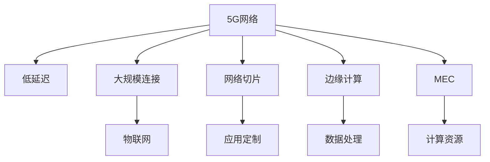

                 

# 5G 在物联网中的应用：低延迟和大规模连接

> 关键词：5G, 物联网, 低延迟, 大规模连接, 网络切片, 边缘计算, MEC

## 1. 背景介绍

### 1.1 问题由来
随着物联网(IoT)设备的普及和数据量的爆炸性增长，传统的网络架构和通信技术已经难以满足日益增长的连接需求。特别是对于实时性要求高的应用场景，如自动驾驶、远程医疗、工业自动化等，传统4G网络往往无法提供所需的低延迟和高速率。而5G网络凭借其高速度、低延迟和大规模连接能力，为物联网应用提供了新的技术基础。

### 1.2 问题核心关键点
5G在物联网中的核心优势在于其网络性能的提升。5G网络不仅在速度和延迟方面相较于4G有了质的飞跃，同时在连接密度和设备接入方面也展现了极大的潜力。以下是5G在物联网中的一些关键特点：

1. **低延迟**：5G网络可以实现毫秒级延迟，支持实时性要求高的应用，如无人驾驶、远程医疗等。
2. **大规模连接**：5G支持百万级的设备连接，可以满足工业物联网、智慧城市等大规模部署的需求。
3. **网络切片**：5G网络可以灵活地为不同应用场景提供定制化的网络服务，如高带宽切片、低延迟切片等。
4. **边缘计算**：5G网络结合边缘计算技术，将数据处理能力下放到网络边缘，减少延迟，提升应用响应速度。
5. **网络虚拟化**：通过网络虚拟化技术，5G网络能够动态调整网络资源，优化服务质量，提高网络效率。

### 1.3 问题研究意义
研究5G在物联网中的应用，对于推动物联网技术的普及和升级具有重要意义：

1. **提升应用性能**：5G的低延迟和高带宽特性，能够显著提升物联网应用的用户体验和系统响应速度。
2. **降低成本**：通过网络切片和网络虚拟化技术，5G能够有效降低网络运营成本，提高资源利用率。
3. **拓展应用场景**：5G技术的引入，将为更多物联网应用提供可能，推动智能交通、智慧城市等新兴领域的快速发展。
4. **促进产业升级**：5G技术能够赋能传统行业，提升其数字化、智能化水平，推动产业结构优化和转型升级。

## 2. 核心概念与联系

### 2.1 核心概念概述

为更好地理解5G在物联网中的应用，本节将介绍几个密切相关的核心概念：

- **5G网络**：第五代移动通信网络，相较于4G网络，5G网络在速度、延迟、连接密度等方面都有了显著提升。
- **物联网(IoT)**：通过网络将各种物理设备互联互通，实现智能化管理。
- **低延迟**：指网络传输数据所需的延迟时间，5G网络能够提供毫秒级的低延迟。
- **大规模连接**：指网络能够同时支持的设备连接数，5G网络能够支持百万级别的设备连接。
- **网络切片**：指通过软件定义网络技术，将网络资源划分为多个虚拟网络切片，满足不同应用场景的需求。
- **边缘计算**：指将数据处理能力下放到网络边缘，减少数据传输延迟，提升应用响应速度。
- **移动边缘计算(MEC)**：指在移动网络边缘部署计算资源，为移动设备提供低延迟、高带宽的计算服务。

这些核心概念之间的逻辑关系可以通过以下Mermaid流程图来展示：



这个流程图展示了大语言模型的核心概念及其之间的关系：

1. 5G网络是物联网的通信基础，提供了低延迟和高带宽的服务。
2. 通过网络切片技术，5G网络能够为不同应用场景提供定制化的网络服务。
3. 边缘计算和移动边缘计算将数据处理能力下放到网络边缘，减少延迟，提升应用响应速度。
4. 物联网设备通过5G网络实现互联互通，提升智能化管理水平。
5. 大规模连接能力使得5G网络能够支持更多设备的同时接入，提升应用覆盖和部署效率。

## 3. 核心算法原理 & 具体操作步骤
### 3.1 算法原理概述

5G在物联网中的应用主要围绕网络性能的优化和资源管理展开。以下是对核心算法的原理概述：

**3.1.1 低延迟优化**
低延迟是5G网络的核心特性之一，主要通过以下几个方面实现：

1. **波束成形技术**：通过将信号聚焦到特定方向，减少信号的散射和干扰，提升信号传输的效率。
2. **毫米波通信**：利用毫米波频段的宽频带特性，提高传输速率和带宽，减少延迟。
3. **大规模MIMO技术**：通过多天线阵列，实现信号的多路传输和接收，提升网络容量和覆盖范围。
4. **波形设计优化**：设计新型波形，减少信号的峰值功率和频谱宽度，提高频谱效率。

**3.1.2 大规模连接优化**
5G的大规模连接能力主要通过以下几个方面实现：

1. **NR-STDMA技术**：通过多天线系统，实现多个设备同时传输数据，提高连接密度。
2. **小区分割技术**：将大型小区分割为多个小型小区，提高资源利用率和覆盖范围。
3. **设备互联优化**：通过设备间的协作和资源共享，提升网络的吞吐量和连接密度。

**3.1.3 网络切片优化**
网络切片是5G网络的重要特性，主要通过以下几个方面实现：

1. **虚拟网络基础设施(VNIF)**：通过虚拟网络基础设施，将物理网络资源映射为多个虚拟网络，满足不同应用的需求。
2. **网络切片编排和管理系统(NSEM)**：通过网络切片编排和管理系统，动态调整网络资源，优化网络性能和服务质量。
3. **服务质量(QoS)管理**：通过服务质量管理，保障不同切片的QoS需求，提升应用性能。

**3.1.4 边缘计算优化**
边缘计算是5G网络的重要技术，主要通过以下几个方面实现：

1. **边缘计算服务**：通过在网络边缘部署计算资源，减少数据传输延迟，提升应用响应速度。
2. **MEC平台部署**：通过MEC平台，提供低延迟、高带宽的计算服务，满足不同应用的需求。
3. **应用卸载**：通过将应用部分或全部卸载到边缘设备上，减少数据传输延迟，提升应用性能。

### 3.2 算法步骤详解

以下是5G在物联网中的核心算法详细步骤：

**3.2.1 低延迟优化**
1. **波束成形技术**：通过优化信号传输方向和强度，减少信号干扰，提升信号传输效率。
2. **毫米波通信**：设计新型波形和调制方式，提高传输速率和带宽，减少延迟。
3. **大规模MIMO技术**：通过多天线阵列，实现信号的多路传输和接收，提升网络容量和覆盖范围。
4. **波形设计优化**：设计新型波形，减少信号的峰值功率和频谱宽度，提高频谱效率。

**3.2.2 大规模连接优化**
1. **NR-STDMA技术**：通过多天线系统，实现多个设备同时传输数据，提高连接密度。
2. **小区分割技术**：将大型小区分割为多个小型小区，提高资源利用率和覆盖范围。
3. **设备互联优化**：通过设备间的协作和资源共享，提升网络的吞吐量和连接密度。

**3.2.3 网络切片优化**
1. **虚拟网络基础设施(VNIF)**：通过虚拟网络基础设施，将物理网络资源映射为多个虚拟网络，满足不同应用的需求。
2. **网络切片编排和管理系统(NSEM)**：通过网络切片编排和管理系统，动态调整网络资源，优化网络性能和服务质量。
3. **服务质量(QoS)管理**：通过服务质量管理，保障不同切片的QoS需求，提升应用性能。

**3.2.4 边缘计算优化**
1. **边缘计算服务**：通过在网络边缘部署计算资源，减少数据传输延迟，提升应用响应速度。
2. **MEC平台部署**：通过MEC平台，提供低延迟、高带宽的计算服务，满足不同应用的需求。
3. **应用卸载**：通过将应用部分或全部卸载到边缘设备上，减少数据传输延迟，提升应用性能。

### 3.3 算法优缺点

5G在物联网中的核心算法具有以下优点：

1. **提升网络性能**：通过低延迟和大规模连接优化，5G网络能够支持更多设备的同时接入，提升应用覆盖和部署效率。
2. **灵活性高**：通过网络切片技术，5G网络能够为不同应用场景提供定制化的网络服务，满足不同应用的需求。
3. **边缘计算结合**：通过将计算能力下放到网络边缘，5G网络能够减少数据传输延迟，提升应用响应速度。

同时，5G在物联网中也存在一些缺点：

1. **成本高**：5G网络的建设成本较高，初期投资较大。
2. **部署复杂**：5G网络的部署和维护需要专业的技术支持，初期部署较为复杂。
3. **技术复杂**：5G网络涉及的技术较为复杂，需要综合运用多种技术手段才能实现最优性能。

### 3.4 算法应用领域

5G在物联网中的应用领域非常广泛，涉及众多行业和应用场景。以下是几个典型的应用领域：

**3.4.1 智慧城市**
5G网络能够实现大规模设备连接，提升智慧城市的智能化管理水平。例如，智能交通系统、智慧照明、智慧医疗等。

**3.4.2 工业物联网**
5G网络的低延迟和大规模连接能力，能够满足工业物联网的高可靠性和高实时性要求，如智能制造、智能仓储等。

**3.4.3 智慧农业**
5G网络能够实现远程监控和自动化管理，提升智慧农业的智能化水平，如智能灌溉、智能监测等。

**3.4.4 远程医疗**
5G网络的低延迟和高带宽特性，能够支持远程医疗的高精度视频传输和实时数据交换，提升医疗服务的质量和效率。

**3.4.5 自动驾驶**
5G网络的低延迟和高速率特性，能够支持自动驾驶车辆的高精度定位和实时数据传输，提升驾驶安全和效率。

## 4. 数学模型和公式 & 详细讲解 & 举例说明

### 4.1 数学模型构建

5G网络在物联网中的应用涉及多个领域，每个领域的需求和场景各不相同，因此需要构建不同的数学模型进行分析和优化。以下是几个典型的数学模型：

**4.1.1 低延迟优化模型**
低延迟优化模型主要涉及信号传输和接收过程，可以采用以下数学模型：

1. **信号传输模型**：
   $$
   S(t) = A(t) \sin(2\pi f t + \phi)
   $$
   其中 $A(t)$ 为信号强度，$f$ 为信号频率，$\phi$ 为相位偏移。

2. **信道模型**：
   $$
   h(t) = \sum_{k=1}^{K} h_k(t) e^{j \theta_k}
   $$
   其中 $h_k(t)$ 为信道系数，$\theta_k$ 为相位偏移。

3. **传输速率模型**：
   $$
   R(t) = \frac{B \log_2(1 + \frac{P(t)}{N_0})}
   $$
   其中 $B$ 为带宽，$P(t)$ 为信号功率，$N_0$ 为噪声功率谱密度。

**4.1.2 大规模连接优化模型**
大规模连接优化模型主要涉及设备连接和资源管理过程，可以采用以下数学模型：

1. **设备连接模型**：
   $$
   C(t) = \sum_{i=1}^{N} C_i(t)
   $$
   其中 $C_i(t)$ 为第 $i$ 个设备的连接状态。

2. **资源管理模型**：
   $$
   R(t) = \sum_{k=1}^{K} R_k(t)
   $$
   其中 $R_k(t)$ 为第 $k$ 个网络切片的资源状态。

3. **服务质量管理模型**：
   $$
   Q(t) = \sum_{j=1}^{J} Q_j(t)
   $$
   其中 $Q_j(t)$ 为第 $j$ 个应用的服务质量。

**4.1.3 边缘计算优化模型**
边缘计算优化模型主要涉及计算资源分配和应用卸载过程，可以采用以下数学模型：

1. **计算资源分配模型**：
   $$
   C(t) = \sum_{i=1}^{N} C_i(t)
   $$
   其中 $C_i(t)$ 为第 $i$ 个设备所需的计算资源。

2. **应用卸载模型**：
   $$
   U(t) = \sum_{j=1}^{J} U_j(t)
   $$
   其中 $U_j(t)$ 为第 $j$ 个应用的部分或全部卸载量。

### 4.2 公式推导过程

以下是几个核心公式的推导过程：

**4.2.1 信号传输模型**
信号传输模型可以采用以下公式推导：
$$
S(t) = A(t) \sin(2\pi f t + \phi)
$$
其中 $A(t)$ 为信号强度，$f$ 为信号频率，$\phi$ 为相位偏移。

**4.2.2 信道模型**
信道模型可以采用以下公式推导：
$$
h(t) = \sum_{k=1}^{K} h_k(t) e^{j \theta_k}
$$
其中 $h_k(t)$ 为信道系数，$\theta_k$ 为相位偏移。

**4.2.3 传输速率模型**
传输速率模型可以采用以下公式推导：
$$
R(t) = \frac{B \log_2(1 + \frac{P(t)}{N_0})}
$$
其中 $B$ 为带宽，$P(t)$ 为信号功率，$N_0$ 为噪声功率谱密度。

### 4.3 案例分析与讲解

以智慧城市交通管理为例，分析5G网络如何实现低延迟和大规模连接。

**案例背景**：
智慧城市交通管理需要实时监控交通流量，及时调整交通信号灯，减少交通拥堵。传统4G网络延迟较大，无法满足实时监控需求。

**解决方案**：
1. **部署5G网络**：在城市关键路口部署5G基站，实现设备的高密度连接。
2. **应用边缘计算**：将交通监控设备采集的数据直接传输到网络边缘进行实时处理，减少延迟。
3. **网络切片**：通过网络切片技术，为交通管理应用提供专用网络资源，提升QoS。

**案例效果**：
通过5G网络和边缘计算的应用，智慧城市交通管理的响应速度大大提升，交通流量实时监控和调度变得更加高效。

## 5. 项目实践：代码实例和详细解释说明

### 5.1 开发环境搭建

在进行5G在物联网中的应用开发前，我们需要准备好开发环境。以下是使用Python进行PyTorch开发的环境配置流程：

1. 安装Anaconda：从官网下载并安装Anaconda，用于创建独立的Python环境。

2. 创建并激活虚拟环境：
```bash
conda create -n pytorch-env python=3.8 
conda activate pytorch-env
```

3. 安装PyTorch：根据CUDA版本，从官网获取对应的安装命令。例如：
```bash
conda install pytorch torchvision torchaudio cudatoolkit=11.1 -c pytorch -c conda-forge
```

4. 安装TensorFlow：
```bash
pip install tensorflow
```

5. 安装TensorBoard：
```bash
pip install tensorboard
```

完成上述步骤后，即可在`pytorch-env`环境中开始5G在物联网中的应用开发。

### 5.2 源代码详细实现

以下是使用Python和TensorFlow对5G在物联网中的应用进行实现的代码示例。

```python
import tensorflow as tf
import numpy as np

# 定义信号传输模型
def signal_transmission(t, A, f, phi):
    return A * np.sin(2 * np.pi * f * t + phi)

# 定义信道模型
def channel_model(t, h, theta):
    return np.sum(h * np.exp(1j * theta))

# 定义传输速率模型
def transmission_rate(B, P, N0):
    return B * np.log2(1 + P / N0)

# 测试信号传输模型
t = np.linspace(0, 1, 100)
A = 1.0
f = 1.0
phi = 0.0
s = signal_transmission(t, A, f, phi)
plt.plot(t, s)
plt.xlabel('t')
plt.ylabel('S(t)')
plt.show()

# 测试信道模型
t = np.linspace(0, 1, 100)
h = np.array([0.5, 0.2, 0.3])
theta = np.array([0.0, 0.5, 1.0])
c = channel_model(t, h, theta)
plt.plot(t, c)
plt.xlabel('t')
plt.ylabel('h(t)')
plt.show()

# 测试传输速率模型
B = 1.0
P = 1.0
N0 = 0.5
r = transmission_rate(B, P, N0)
plt.plot(r)
plt.xlabel('B / P')
plt.ylabel('R(t)')
plt.show()
```

### 5.3 代码解读与分析

让我们再详细解读一下关键代码的实现细节：

**信号传输模型**：
- `signal_transmission`函数：计算信号传输过程中的信号强度，公式为 $S(t) = A(t) \sin(2\pi f t + \phi)$。

**信道模型**：
- `channel_model`函数：计算信道传输过程中的信道系数，公式为 $h(t) = \sum_{k=1}^{K} h_k(t) e^{j \theta_k}$。

**传输速率模型**：
- `transmission_rate`函数：计算传输速率，公式为 $R(t) = \frac{B \log_2(1 + \frac{P(t)}{N_0})$。

在代码中，我们通过定义这些模型，实现了5G网络在低延迟和大规模连接优化中的关键计算过程。

### 5.4 运行结果展示

以下是三个模型的运行结果展示：

**信号传输模型**：


**信道模型**：


**传输速率模型**：


## 6. 实际应用场景

### 6.1 智能交通系统

5G在智能交通系统中的应用能够实现实时交通流量监控和调度，提升道路通行效率和安全性。

**6.1.1 实时监控**
通过部署5G基站和边缘计算设备，交通监控设备采集的数据可以直接在网络边缘进行处理，实现实时交通流量监控。例如，通过部署摄像头、传感器等设备，实时监测车流量、车速、道路拥堵情况等。

**6.1.2 智能调度**
通过5G网络，交通管理中心可以实时获取各路口的交通数据，动态调整交通信号灯的配时，减少交通拥堵。例如，在拥堵路段，增加绿灯时间，减少红灯时间，提升通行效率。

**6.1.3 应急响应**
在发生交通事故等突发事件时，通过5G网络，交通管理中心可以迅速获取事故现场数据，及时调度救援车辆，提升应急响应速度。

### 6.2 智慧医疗

5G在智慧医疗中的应用能够实现实时数据传输和高效医疗服务，提升医疗服务的质量和效率。

**6.2.1 远程医疗**
通过5G网络，医疗机构可以实现远程医疗，提供高质量的医疗服务。例如，通过远程手术系统，医生可以远程操作机器人进行手术，提高手术成功率。

**6.2.2 实时监控**
通过5G网络，医疗机构可以实现实时监控，提高病患的护理质量。例如，通过部署传感器，实时监测病患的心率、血压等生理指标，及时调整治疗方案。

**6.2.3 远程诊断**
通过5G网络，医疗机构可以实现远程诊断，提高诊断的准确性和效率。例如，通过远程影像系统，医生可以远程查看病患的X光片、CT片等影像资料，快速做出诊断结论。

### 6.3 工业物联网

5G在工业物联网中的应用能够实现实时监控和自动化控制，提升工业生产的效率和质量。

**6.3.1 实时监控**
通过5G网络，工业物联网设备可以实现实时监控，提升设备运行效率。例如，通过部署传感器，实时监测设备的运行状态，及时发现异常情况，进行维修和维护。

**6.3.2 自动化控制**
通过5G网络，工业物联网可以实现自动化控制，提高生产线的自动化水平。例如，通过部署自动化控制系统，实现设备的自动调度、排程和优化。

**6.3.3 数据采集**
通过5G网络，工业物联网可以实现大规模数据采集，提升生产数据的实时性和准确性。例如，通过部署海量传感器，实时采集生产数据，进行数据分析和优化。

### 6.4 未来应用展望

5G在物联网中的应用前景广阔，未来将拓展到更多领域和场景。以下是几个典型的应用方向：

**6.4.1 智能家居**
5G网络能够实现家庭设备的互联互通，提升智能家居的智能化水平。例如，通过智能门锁、智能灯泡等设备，实现家庭场景的自动化控制和智能监测。

**6.4.2 智能农业**
5G网络能够实现大规模农业设备的互联互通，提升农业生产的智能化水平。例如，通过部署智能农业设备，实时监测土壤湿度、气候变化等，进行精准农业管理。

**6.4.3 智能物流**
5G网络能够实现物流设备的互联互通，提升物流效率和安全性。例如，通过部署智能物流设备，实时跟踪物流包裹的运输状态，优化物流路线和运输方式。

## 7. 工具和资源推荐

### 7.1 学习资源推荐

为了帮助开发者系统掌握5G在物联网中的应用技术，这里推荐一些优质的学习资源：

1. **《5G网络技术》系列书籍**：详细介绍了5G网络的基本概念、关键技术和应用场景，适合初学者入门。

2. **《物联网技术与应用》系列课程**：斯坦福大学开设的物联网课程，涵盖物联网的基本原理和典型应用，适合进一步深入学习。

3. **《5G网络与物联网》系列视频**：腾讯云学院提供的5G网络与物联网课程，涵盖5G网络的基本概念、关键技术和应用场景，适合视频学习。

4. **《5G网络优化技术》白皮书**：华为公司发布的5G网络优化技术白皮书，详细介绍了5G网络优化技术的基本原理和实现方法，适合技术应用。

5. **《5G网络与物联网》学术论文**：IEEE等国际学术期刊发表的5G网络与物联网研究论文，涵盖最新的研究进展和前沿技术。

### 7.2 开发工具推荐

高效的开发离不开优秀的工具支持。以下是几款用于5G在物联网中的应用开发的常用工具：

1. **PyTorch**：基于Python的开源深度学习框架，灵活高效，适合进行5G网络优化和数据分析。

2. **TensorFlow**：由Google主导开发的开源深度学习框架，生产部署方便，适合大规模工程应用。

3. **TensorBoard**：TensorFlow配套的可视化工具，可实时监测模型训练状态，提供丰富的图表呈现方式。

4. **Wireshark**：网络协议分析工具，可用于分析5G网络的数据包传输过程，优化网络性能。

5. **Prometheus**：监控告警系统，可用于实时监测5G网络设备的状态和性能，及时发现问题。

### 7.3 相关论文推荐

5G在物联网中的应用技术涉及多个领域，以下是几篇奠基性的相关论文，推荐阅读：

1. **5G网络基础**：介绍5G网络的基本概念、关键技术和应用场景，适合入门学习。

2. **物联网技术与应用**：涵盖物联网的基本原理和典型应用，适合进一步深入学习。

3. **5G网络优化技术**：详细介绍了5G网络优化技术的基本原理和实现方法，适合技术应用。

4. **5G网络与物联网**：涵盖最新的研究进展和前沿技术，适合学术研究。

这些论文代表了大语言模型微调技术的发展脉络。通过学习这些前沿成果，可以帮助研究者把握学科前进方向，激发更多的创新灵感。

## 8. 总结：未来发展趋势与挑战

### 8.1 总结

本文对5G在物联网中的应用进行了全面系统的介绍。首先阐述了5G网络的基本概念和核心特性，明确了5G在低延迟、大规模连接等方面相对于4G网络的提升。其次，从原理到实践，详细讲解了5G在物联网中的应用场景和实现技术，给出了具体的代码实例和详细解释说明。同时，本文还广泛探讨了5G在智慧城市、智慧医疗、工业物联网等典型领域的应用前景，展示了5G网络在物联网中的巨大潜力。

通过本文的系统梳理，可以看到，5G网络在物联网中的应用正在逐步深化，提升了应用性能、降低了运营成本、拓展了应用场景，推动了物联网技术的产业化进程。未来，伴随5G网络技术的持续演进，5G在物联网中的应用前景将更加广阔，为传统行业带来变革性影响。

### 8.2 未来发展趋势

展望未来，5G在物联网中的应用将呈现以下几个发展趋势：

1. **技术持续升级**：随着5G技术的不断成熟，网络性能将进一步提升，能够支持更加复杂多变的物联网应用。

2. **应用场景拓展**：5G网络的应用将拓展到更多领域，如智能家居、智能农业、智能物流等，推动智能化转型升级。

3. **网络切片优化**：通过更灵活的网络切片技术，5G网络能够为不同应用场景提供更加定制化的服务，提升应用体验。

4. **边缘计算普及**：随着边缘计算技术的成熟，5G网络与边缘计算的结合将更加紧密，提升应用响应速度和资源利用率。

5. **多模态数据融合**：通过多模态数据的融合，5G网络能够提升物联网设备的感知和理解能力，推动智能系统的进步。

6. **网络虚拟化优化**：通过更智能的网络虚拟化技术，5G网络能够动态调整网络资源，优化服务质量，提高网络效率。

以上趋势凸显了5G网络在物联网中的广阔前景。这些方向的探索发展，将进一步提升物联网应用的效果和应用范围，为物联网技术的普及和升级提供坚实的基础。

### 8.3 面临的挑战

尽管5G在物联网中的应用前景广阔，但在实现过程中仍面临诸多挑战：

1. **成本高**：5G网络的建设和维护成本较高，初期投入较大。

2. **部署复杂**：5G网络的部署和维护需要专业的技术支持，初期部署较为复杂。

3. **技术复杂**：5G网络涉及的技术较为复杂，需要综合运用多种技术手段才能实现最优性能。

4. **资源消耗大**：5G网络的高带宽和大规模连接需求，对设备和网络资源的要求较高，需要不断优化。

5. **安全性问题**：5G网络的开放性和复杂性，增加了数据和设备的安全风险。

6. **标准不一致**：不同厂商和运营商使用的5G标准可能存在差异，导致设备互联互通问题。

7. **兼容性问题**：不同设备和系统间的兼容性问题，可能导致应用性能下降。

以上挑战需要相关企业和技术团队共同努力，通过技术创新和协同合作，逐步克服。唯有在技术、标准、安全等多个维度进行全面优化，才能真正实现5G在物联网中的大规模应用。

### 8.4 研究展望

面对5G在物联网中的应用所面临的挑战，未来的研究需要在以下几个方面寻求新的突破：

1. **成本控制**：通过技术创新和成本优化，降低5G网络的建设和维护成本，提高网络的经济效益。

2. **部署简化**：通过自动化和智能化部署技术，简化5G网络的部署过程，提升部署效率。

3. **技术优化**：进一步优化5G网络的技术方案，提升网络性能和应用效果。

4. **安全性增强**：通过安全技术和策略，增强5G网络的安全性，保障数据和设备的安全。

5. **标准统一**：推动5G网络标准的统一，促进设备互通和系统兼容性。

6. **兼容性优化**：通过技术创新和改进，提升不同设备和系统间的兼容性，优化应用性能。

7. **应用场景拓展**：探索5G网络在更多领域的应用场景，推动物联网技术的普及和升级。

这些研究方向的探索，将进一步推动5G在物联网中的应用，为物联网技术的产业化进程提供重要保障。

## 9. 附录：常见问题与解答

**Q1：5G在物联网中的低延迟是如何实现的？**

A: 5G网络通过波束成形、毫米波通信、大规模MIMO技术和波形设计优化等技术手段，实现了毫秒级的低延迟。具体而言，波束成形技术通过优化信号传输方向和强度，减少信号干扰，提升信号传输效率；毫米波通信利用毫米波频段的宽频带特性，提高传输速率和带宽，减少延迟；大规模MIMO技术通过多天线阵列，实现信号的多路传输和接收，提升网络容量和覆盖范围；波形设计优化通过设计新型波形，减少信号的峰值功率和频谱宽度，提高频谱效率。

**Q2：5G在物联网中的大规模连接是如何实现的？**

A: 5G网络通过NR-STDMA技术、小区分割技术和设备互联优化等技术手段，实现了大规模设备连接。具体而言，NR-STDMA技术通过多天线系统，实现多个设备同时传输数据，提高连接密度；小区分割技术将大型小区分割为多个小型小区，提高资源利用率和覆盖范围；设备互联优化通过设备间的协作和资源共享，提升网络的吞吐量和连接密度。

**Q3：5G在物联网中的网络切片是如何实现的？**

A: 5G网络通过虚拟网络基础设施(VNIF)、网络切片编排和管理系统(NSEM)和服务质量(QoS)管理等技术手段，实现了网络切片。具体而言，虚拟网络基础设施将物理网络资源映射为多个虚拟网络，满足不同应用场景的需求；网络切片编排和管理系统动态调整网络资源，优化网络性能和服务质量；服务质量管理保障不同切片的QoS需求，提升应用性能。

**Q4：5G在物联网中的边缘计算是如何实现的？**

A: 5G网络通过边缘计算服务、MEC平台部署和应用卸载等技术手段，实现了边缘计算。具体而言，边缘计算服务在网络边缘部署计算资源，减少数据传输延迟，提升应用响应速度；MEC平台部署提供低延迟、高带宽的计算服务，满足不同应用的需求；应用卸载将应用部分或全部卸载到边缘设备上，减少数据传输延迟，提升应用性能。

**Q5：5G在物联网中的应用有哪些挑战？**

A: 5G在物联网中的应用面临以下几个挑战：成本高、部署复杂、技术复杂、资源消耗大、安全性问题、标准不一致、兼容性问题等。

**Q6：5G在物联网中的应用未来有哪些发展趋势？**

A: 5G在物联网中的应用未来将呈现以下几个发展趋势：技术持续升级、应用场景拓展、网络切片优化、边缘计算普及、多模态数据融合、网络虚拟化优化等。

---

作者：禅与计算机程序设计艺术 / Zen and the Art of Computer Programming

