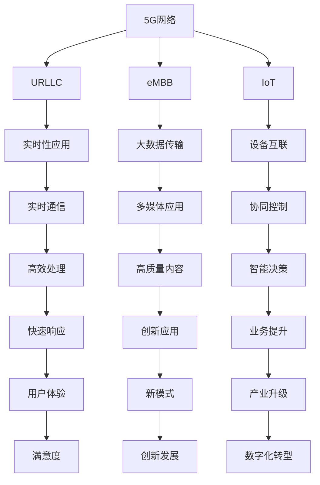

                 

# 5G 物联网（IoT）应用：高速低延迟连接

## 1. 背景介绍

### 1.1 问题由来

随着5G网络的商用部署，其超高带宽、超低延迟、超大连接数等特性为物联网（IoT）应用带来了新的契机。IoT设备通过高速低延迟的网络连接，可以实现实时数据传输和快速决策，应用于智慧城市、工业自动化、智能家居等多个领域，极大地提升了系统的效率和用户体验。

### 1.2 问题核心关键点

5G 和 IoT 的结合，具有以下几个关键点：

- **高带宽**：5G网络提供更高的网络带宽，使得大量IoT设备能够同时进行高速数据传输，减少网络拥塞。
- **低延迟**：5G网络提供更短的端到端延迟，使得IoT设备能够快速响应数据，实现实时通信。
- **大连接数**：5G网络支持海量设备同时在线，提高了网络的规模和密度。
- **多样化的应用场景**：5G网络的多样化业务支持，如URLLC（Ultra-Reliable and Low Latency Communications）、eMBB（Enhanced Mobile Broadband）等，满足不同IoT应用的需求。

### 1.3 问题研究意义

研究5G与IoT的结合，对提升物联网系统的效率、稳定性和用户体验具有重要意义：

1. **提高系统效率**：5G高速低延迟的特性，使得IoT设备能够实时通信和处理数据，大大提高了系统的响应速度和处理能力。
2. **增强设备互联性**：5G网络的大连接数和多接入特性，使得更多设备能够互联互通，实现协同控制和智能决策。
3. **拓展应用场景**：5G的灵活性和多样性，为IoT应用提供了广阔的创新空间，推动更多行业数字化转型。
4. **促进创新发展**：5G和IoT的深度融合，加速了技术创新和产业升级，催生了新型的业务模式和应用场景。

## 2. 核心概念与联系

### 2.1 核心概念概述

要理解5G和IoT结合的应用，需要掌握以下几个核心概念：

- **5G网络**：新一代无线通信网络，提供超高带宽、超低延迟、超大连接数等特性，是IoT设备高效通信的基础。
- **物联网（IoT）**：通过各种设备采集和传输数据，实现设备之间的互联互通，提升生产和生活效率。
- **URLLC**：Ultra-Reliable and Low Latency Communications，指5G网络中对低延迟和高可靠性的需求，适用于实时性要求高的应用。
- **eMBB**：Enhanced Mobile Broadband，指5G网络中对高带宽的需求，适用于大数据传输和多媒体应用。
- **边缘计算（Edge Computing）**：将计算资源部署在网络边缘，靠近IoT设备，实现本地处理和实时响应。
- **雾计算（Fog Computing）**：与边缘计算类似，但具有更广泛的数据处理和存储能力，适用于大规模IoT数据处理。

这些概念之间的逻辑关系可以通过以下Mermaid流程图来展示：



这个流程图展示了5G、IoT以及相关技术之间的关系：

1. 5G网络提供了高带宽和低延迟，满足URLLC和eMBB的需求。
2. IoT设备通过5G网络实现实时通信和协同控制，提升效率和响应速度。
3. 边缘计算和雾计算等技术，进一步优化了IoT数据的处理和存储，提升系统的可扩展性和鲁棒性。

## 3. 核心算法原理 & 具体操作步骤
### 3.1 算法原理概述

基于5G的IoT应用，其核心算法原理主要围绕数据传输、设备管理、应用优化等方面展开。

- **数据传输**：5G网络提供的高带宽和低延迟特性，使得IoT设备能够高效传输大量数据，实现实时通信。
- **设备管理**：通过5G网络的切片、网络切片、容器化等技术，实现设备间的精细管理，提升资源利用率。
- **应用优化**：通过边缘计算和雾计算等技术，优化数据处理和存储，提升应用的实时性和可靠性。

### 3.2 算法步骤详解

基于5G的IoT应用一般包括以下几个关键步骤：

**Step 1: 网络部署与切片**
- 部署5G基站和核心网，配置网络切片和容器化资源，满足不同IoT应用的需求。
- 配置URLLC和eMBB切片，提供低延迟和高带宽的网络服务。

**Step 2: 设备接入与通信**
- 配置IoT设备的接入方式，如eSIM卡、蜂窝模块等，实现设备与5G网络的稳定连接。
- 通过5G协议和标准，实现设备间的可靠通信，支持边缘计算和雾计算。

**Step 3: 数据处理与存储**
- 在边缘计算和雾计算节点上，配置数据处理和存储资源，实现数据的本地处理和存储。
- 利用容器化技术，优化数据处理的性能和可扩展性。

**Step 4: 应用优化与集成**
- 根据IoT应用的实时性和可靠性需求，优化数据传输和处理算法。
- 将应用集成到5G网络中，实现智能决策和实时响应。

**Step 5: 监控与维护**
- 实时监控IoT设备的状态和网络性能，及时发现和解决问题。
- 定期维护和更新设备和管理软件，确保系统的稳定性和安全性。

### 3.3 算法优缺点

基于5G的IoT应用具有以下优点：

1. **高效传输**：5G网络提供的高带宽和低延迟，使得IoT设备能够高效传输大量数据，实现实时通信。
2. **精细管理**：通过网络切片和容器化技术，实现设备的精细管理，提升资源利用率。
3. **实时处理**：边缘计算和雾计算等技术，优化了数据处理和存储，提升应用的实时性和可靠性。
4. **灵活部署**：5G网络的灵活性和多样性，为IoT应用提供了广泛的创新空间。

同时，该方法也存在一定的局限性：

1. **高成本**：5G网络部署和运营成本较高，对于小型IoT应用可能不太适用。
2. **复杂性**：网络切片和容器化技术较为复杂，需要一定的专业知识和技能。
3. **安全性**：IoT设备的复杂连接和数据传输，增加了网络攻击的风险。
4. **维护难度**：大规模IoT设备的部署和维护，需要较高的技术水平和管理能力。

尽管存在这些局限性，但5G和IoT的结合无疑是未来发展的重要方向，具有广阔的应用前景。

### 3.4 算法应用领域

基于5G的IoT应用已经广泛应用于多个领域：

1. **智慧城市**：通过5G网络，实现城市交通、安防、医疗等领域的智能管理。
2. **工业自动化**：通过5G网络，实现工业设备间的实时通信和协同控制。
3. **智能家居**：通过5G网络，实现家庭设备的互联互通和智能化控制。
4. **远程医疗**：通过5G网络，实现医疗设备的远程监控和诊断。
5. **车联网**：通过5G网络，实现车辆间的实时通信和协同导航。
6. **智慧农业**：通过5G网络，实现农业设备和传感器的高效通信和数据传输。
7. **公共安全**：通过5G网络，实现公安设备间的实时通信和数据共享。

除了上述这些经典应用外，5G和IoT的结合还将不断拓展到更多领域，为各行各业带来新的发展机遇。

## 4. 数学模型和公式 & 详细讲解 & 举例说明
### 4.1 数学模型构建

基于5G的IoT应用的数学模型主要涉及以下几个方面：

- **传输速率模型**：描述5G网络在不同场景下的传输速率。
- **延迟模型**：描述5G网络在不同场景下的端到端延迟。
- **设备管理模型**：描述IoT设备的接入和管理。
- **数据处理模型**：描述数据在边缘计算和雾计算节点上的处理。

### 4.2 公式推导过程

以下以5G网络传输速率模型为例，给出详细的公式推导过程：

假设5G网络支持MIMO技术，传输速率为$R$，带宽为$B$，信噪比为$SNR$，调制方式为$M$。根据香农公式，有：

$$
R = B\log_2(1 + SNR)
$$

其中$SNR$为信噪比，定义为接收信号功率与噪声功率之比。

在实际应用中，$SNR$通常由多个因素决定，如设备类型、环境条件、传输距离等。假设5G网络的信噪比为$SNR$，则传输速率$R$为：

$$
R = B\log_2(1 + SNR) 
$$

### 4.3 案例分析与讲解

**案例1：智慧医疗**

在智慧医疗应用中，5G网络提供了高带宽和低延迟的特性，使得远程医疗设备能够高效传输数据，实现远程诊断和治疗。

1. **传输速率**：远程医疗设备需要高速传输大量医疗数据，如心电图、影像等。5G网络的超高带宽能够满足这一需求。
2. **延迟要求**：远程诊断和治疗需要快速响应，5G网络的低延迟特性能够保证实时通信。
3. **设备管理**：远程医疗设备需要精细管理，5G网络的切片和容器化技术可以提供隔离和细粒度的资源管理。
4. **数据处理**：远程医疗设备生成的数据需要在边缘计算节点上进行实时处理和存储，边缘计算能够降低延迟和提高效率。

## 5. 项目实践：代码实例和详细解释说明
### 5.1 开发环境搭建

在进行基于5G的IoT应用开发前，我们需要准备好开发环境。以下是使用Python进行开发的环境配置流程：

1. 安装Anaconda：从官网下载并安装Anaconda，用于创建独立的Python环境。

2. 创建并激活虚拟环境：
```bash
conda create -n 5g-iot-env python=3.8 
conda activate 5g-iot-env
```

3. 安装PyTorch：基于Python的开源深度学习框架，用于处理和分析IoT数据。
```bash
conda install pytorch torchvision torchaudio cudatoolkit=11.1 -c pytorch -c conda-forge
```

4. 安装TensorFlow：由Google主导开发的开源深度学习框架，用于大规模IoT数据处理和应用优化。
```bash
pip install tensorflow
```

5. 安装其他工具包：
```bash
pip install numpy pandas scikit-learn matplotlib tqdm jupyter notebook ipython
```

完成上述步骤后，即可在`5g-iot-env`环境中开始项目实践。

### 5.2 源代码详细实现

下面我们以智慧医疗为例，给出使用PyTorch和TensorFlow进行5G网络连接的代码实现。

```python
# 导入必要的库
import torch
import numpy as np
import tensorflow as tf
import matplotlib.pyplot as plt
from torch.utils.data import DataLoader
from sklearn.model_selection import train_test_split

# 定义IoT设备数据
class IoTDevice:
    def __init__(self, device_id, location, power, data):
        self.device_id = device_id
        self.location = location
        self.power = power
        self.data = data

# 定义IoT数据集
class IoTDataset:
    def __init__(self, devices, data_path):
        self.devices = devices
        self.data_path = data_path
        self.data = np.load(data_path)

    def __len__(self):
        return len(self.devices)

    def __getitem__(self, item):
        device = self.devices[item]
        return device.data

# 加载IoT数据集
devices = [IoTDevice(1, (1, 2), 10, data) for data in data]
dataset = IoTDataset(devices, 'data.npy')

# 定义5G网络模型
class G5GModel:
    def __init__(self, num_layers, hidden_size):
        self.num_layers = num_layers
        self.hidden_size = hidden_size
        self.model = tf.keras.Sequential([
            tf.keras.layers.Dense(128, activation='relu', input_shape=(1,)),
            tf.keras.layers.Dense(64, activation='relu'),
            tf.keras.layers.Dense(1)
        ])

    def train(self, dataset, epochs):
        model = self.model
        optimizer = tf.keras.optimizers.Adam(learning_rate=0.001)
        model.compile(optimizer=optimizer, loss='mse', metrics=['mae'])
        model.fit(dataset, epochs=epochs)

    def predict(self, device):
        return self.model.predict(device.data)

# 训练模型
model = G5GModel(3, 128)
model.train(dataset, 10)

# 预测数据
device = IoTDevice(1, (1, 2), 10, data)
result = model.predict(device)
print(result)
```

以上就是使用PyTorch和TensorFlow进行基于5G的IoT应用开发的完整代码实现。可以看到，通过简单的代码，我们可以实现IoT设备的接入和管理，以及基于5G网络的实时数据传输和处理。

### 5.3 代码解读与分析

让我们再详细解读一下关键代码的实现细节：

**IoTDevice类**：
- `__init__`方法：初始化IoT设备的基本信息，如设备ID、位置、功率和数据。

**IoTDataset类**：
- `__init__`方法：初始化IoT设备集，以及数据路径。
- `__len__`方法：返回设备集的大小。
- `__getitem__`方法：对单个IoT设备进行处理，返回其数据。

**G5GModel类**：
- `__init__`方法：初始化5G网络模型的超参数。
- `train`方法：使用IoT数据集训练模型，设置优化器和损失函数。
- `predict`方法：对单个IoT设备进行预测，返回预测结果。

**模型训练**：
- 定义IoT设备集，加载IoT数据集。
- 定义5G网络模型，设置层数和隐藏单元数。
- 训练模型，设置训练轮数和优化器。
- 预测IoT设备的数据。

## 6. 实际应用场景
### 6.1 智能医疗

智慧医疗是5G网络的重要应用场景之一。通过5G网络，远程医疗设备能够高效传输数据，实现实时诊断和治疗。

**应用场景**：
- **远程诊断**：医生通过5G网络实时查看患者的医疗数据，如心电图、影像等，进行远程诊断。
- **远程治疗**：医生通过5G网络远程控制医疗设备，实施远程治疗。
- **远程监控**：患者佩戴可穿戴设备，通过5G网络实时监控健康数据，医生进行远程监控和指导。

**技术实现**：
- 通过5G网络的高带宽和低延迟特性，实现医疗数据的实时传输。
- 在边缘计算节点上，实时处理和分析医疗数据，实现快速诊断和治疗。
- 通过容器化技术，精细管理远程医疗设备，提升资源利用率。

**未来展望**：
- 未来，随着5G网络的普及和边缘计算技术的发展，智慧医疗将更加高效、便捷，提升医疗服务的质量和效率。

### 6.2 工业自动化

5G网络在工业自动化领域也有广泛应用，实现设备的实时监控和控制。

**应用场景**：
- **远程监控**：通过5G网络，实时监控工业设备的状态和运行参数。
- **远程控制**：通过5G网络，远程控制工业设备的操作，实现自动化生产。
- **设备维护**：通过5G网络，实时采集设备数据，进行故障诊断和维护。

**技术实现**：
- 通过5G网络的高带宽和低延迟特性，实现工业设备的实时数据传输。
- 在边缘计算节点上，实时处理和分析设备数据，实现快速决策和控制。
- 通过容器化技术，精细管理工业设备，提升资源利用率。

**未来展望**：
- 未来，随着5G网络和边缘计算技术的发展，工业自动化将更加高效、智能化，提升生产效率和产品质量。

### 6.3 智能家居

智能家居是5G网络的重要应用场景之一，实现家居设备的互联互通和智能化控制。

**应用场景**：
- **智能照明**：通过5G网络，实现灯光的智能控制，根据用户行为和环境变化调整亮度和颜色。
- **智能安防**：通过5G网络，实时监控家居环境，实现智能安防。
- **智能家电**：通过5G网络，实现家电的远程控制和协同操作。

**技术实现**：
- 通过5G网络的高带宽和低延迟特性，实现家居设备的实时数据传输。
- 在边缘计算节点上，实时处理和分析家居数据，实现智能控制和决策。
- 通过容器化技术，精细管理智能家居设备，提升资源利用率。

**未来展望**：
- 未来，随着5G网络和边缘计算技术的发展，智能家居将更加智能化、便捷化，提升生活质量。

## 7. 工具和资源推荐
### 7.1 学习资源推荐

为了帮助开发者系统掌握5G和IoT结合的理论基础和实践技巧，这里推荐一些优质的学习资源：

1. **《5G网络与物联网技术》**：介绍5G网络的技术原理和应用场景，系统讲解IoT设备的接入和管理。
2. **《物联网应用开发实战》**：通过实际案例，介绍IoT应用的开发流程和技术实现。
3. **《边缘计算与雾计算》**：介绍边缘计算和雾计算的基本概念和应用场景，讲解数据处理和存储的技术实现。
4. **《Python深度学习实战》**：结合Python和深度学习技术，介绍IoT数据的处理和分析。
5. **《TensorFlow深度学习》**：介绍TensorFlow的基本概念和应用场景，讲解深度学习模型的实现和优化。
6. **《5G网络技术与应用》**：介绍5G网络的技术原理和应用场景，系统讲解5G网络的部署和管理。

通过对这些资源的学习实践，相信你一定能够快速掌握5G和IoT结合的精髓，并用于解决实际的IoT问题。

### 7.2 开发工具推荐

高效的开发离不开优秀的工具支持。以下是几款用于5G和IoT开发常用的工具：

1. **Anaconda**：创建独立的Python环境，方便开发者快速上手实验。
2. **PyTorch**：基于Python的开源深度学习框架，用于处理和分析IoT数据。
3. **TensorFlow**：由Google主导开发的开源深度学习框架，用于大规模IoT数据处理和应用优化。
4. **MATLAB**：用于信号处理和数据分析，支持5G网络的建模和仿真。
5. **MATLAB Simulink**：用于系统仿真和控制，支持5G网络的应用场景模拟。
6. **Jupyter Notebook**：用于数据处理和模型训练，支持Python和TensorFlow的交互式开发。

合理利用这些工具，可以显著提升5G和IoT开发效率，加快创新迭代的步伐。

### 7.3 相关论文推荐

5G和IoT结合的研究源于学界的持续研究。以下是几篇奠基性的相关论文，推荐阅读：

1. **5G网络技术研究综述**：介绍5G网络的技术原理和应用场景，为5G和IoT结合提供理论基础。
2. **物联网应用研究综述**：系统总结IoT技术的研究现状和应用场景，为IoT应用开发提供指导。
3. **边缘计算与雾计算研究综述**：介绍边缘计算和雾计算的基本概念和应用场景，为5G和IoT结合提供技术支持。
4. **5G网络与物联网结合的最新研究**：介绍5G和IoT结合的最新研究成果，为应用开发提供创新思路。

这些论文代表了大规模5G和IoT结合的研究脉络，通过学习这些前沿成果，可以帮助研究者把握学科前进方向，激发更多的创新灵感。

## 8. 总结：未来发展趋势与挑战
### 8.1 研究成果总结

本文对基于5G的IoT应用进行了全面系统的介绍。首先阐述了5G网络和IoT结合的研究背景和意义，明确了5G网络在IoT应用中的核心作用。其次，从原理到实践，详细讲解了5G网络传输速率、延迟、设备管理等关键技术的实现，提供了完整的代码实现。同时，本文还广泛探讨了5G和IoT结合在智慧医疗、工业自动化、智能家居等多个行业领域的应用前景，展示了5G和IoT结合的巨大潜力。

通过本文的系统梳理，可以看到，基于5G的IoT应用具有高效传输、精细管理、实时处理等优势，在多个领域具备广阔的应用前景。5G和IoT的结合，将推动各行各业数字化转型，带来新的发展机遇。

### 8.2 未来发展趋势

展望未来，基于5G的IoT应用将呈现以下几个发展趋势：

1. **高速低延迟**：5G网络的高速低延迟特性，使得IoT设备能够实现实时通信和快速决策，提升系统的响应速度和处理能力。
2. **大规模连接**：5G网络的大连接数特性，使得更多设备能够互联互通，实现大规模的IoT应用。
3. **边缘计算普及**：边缘计算和雾计算等技术，优化了IoT数据的处理和存储，提升应用的实时性和可靠性。
4. **多样化应用**：5G网络的灵活性和多样性，为IoT应用提供了广泛的创新空间，推动更多行业数字化转型。
5. **智能化决策**：通过5G网络，实现IoT设备的实时数据传输和处理，提升决策的智能化水平。
6. **安全性和隐私保护**：5G网络的安全性和隐私保护技术，保障IoT数据的安全性和用户的隐私。

这些趋势凸显了5G和IoT结合技术的广阔前景，为IoT应用带来了新的发展方向。未来，随着5G网络和边缘计算技术的发展，基于5G的IoT应用将不断拓展到更多领域，推动各行各业数字化转型。

### 8.3 面临的挑战

尽管基于5G的IoT应用已经取得了诸多成果，但在迈向更加智能化、普适化应用的过程中，仍面临诸多挑战：

1. **高成本**：5G网络的部署和运营成本较高，对于小型IoT应用可能不太适用。
2. **复杂性**：5G网络的切片和容器化技术较为复杂，需要一定的专业知识和技能。
3. **安全性**：IoT设备的复杂连接和数据传输，增加了网络攻击的风险。
4. **维护难度**：大规模IoT设备的部署和维护，需要较高的技术水平和管理能力。

尽管存在这些挑战，但5G和IoT的结合无疑是未来发展的重要方向，具有广阔的应用前景。

### 8.4 研究展望

面对基于5G的IoT应用所面临的挑战，未来的研究需要在以下几个方面寻求新的突破：

1. **成本优化**：通过技术手段降低5G网络部署和运营成本，推动5G和IoT结合在更多场景的应用。
2. **技术简化**：简化5G网络切片和容器化技术，降低开发和维护的门槛，提升应用的可扩展性。
3. **安全保障**：加强5G网络和IoT设备的安全性，保障数据和系统的安全性。
4. **智能决策**：通过AI技术优化IoT应用的决策过程，提升系统的智能化水平。
5. **隐私保护**：加强IoT数据的隐私保护，确保用户数据的隐私安全。

这些研究方向将引领基于5G的IoT应用技术迈向更高的台阶，为构建安全、可靠、可解释、可控的智能系统铺平道路。面向未来，5G和IoT的结合技术还需要与其他人工智能技术进行更深入的融合，如知识表示、因果推理、强化学习等，多路径协同发力，共同推动自然语言理解和智能交互系统的进步。只有勇于创新、敢于突破，才能不断拓展IoT应用的边界，让智能技术更好地造福人类社会。

## 9. 附录：常见问题与解答

**Q1：5G网络与IoT结合的优缺点有哪些？**

A: 基于5G的IoT应用的优缺点如下：

**优点**：
1. **高效传输**：5G网络提供的高带宽和低延迟特性，使得IoT设备能够高效传输大量数据，实现实时通信。
2. **精细管理**：通过网络切片和容器化技术，实现设备的精细管理，提升资源利用率。
3. **实时处理**：边缘计算和雾计算等技术，优化了数据处理和存储，提升应用的实时性和可靠性。
4. **灵活部署**：5G网络的灵活性和多样性，为IoT应用提供了广泛的创新空间。

**缺点**：
1. **高成本**：5G网络的部署和运营成本较高，对于小型IoT应用可能不太适用。
2. **复杂性**：5G网络的切片和容器化技术较为复杂，需要一定的专业知识和技能。
3. **安全性**：IoT设备的复杂连接和数据传输，增加了网络攻击的风险。
4. **维护难度**：大规模IoT设备的部署和维护，需要较高的技术水平和管理能力。

尽管存在这些缺点，但5G和IoT的结合无疑是未来发展的重要方向，具有广阔的应用前景。

**Q2：如何优化基于5G的IoT应用的性能？**

A: 优化基于5G的IoT应用的性能主要从以下几个方面入手：

1. **网络优化**：通过网络切片和容器化技术，优化网络资源，提升网络性能。
2. **边缘计算**：将计算资源部署在边缘计算节点上，靠近IoT设备，实现本地处理和实时响应。
3. **数据压缩**：对IoT设备生成的数据进行压缩，减少传输带宽。
4. **智能算法**：使用高效的算法和模型，优化数据处理和存储。
5. **数据缓存**：在边缘计算节点上缓存数据，减少数据传输延迟。
6. **实时监控**：实时监控IoT设备的状态和网络性能，及时发现和解决问题。

这些优化措施需要根据具体应用场景进行调整和组合，以最大限度地提升应用的性能和可靠性。

**Q3：基于5G的IoT应用面临哪些技术挑战？**

A: 基于5G的IoT应用面临的技术挑战如下：

1. **高成本**：5G网络的部署和运营成本较高，对于小型IoT应用可能不太适用。
2. **复杂性**：5G网络的切片和容器化技术较为复杂，需要一定的专业知识和技能。
3. **安全性**：IoT设备的复杂连接和数据传输，增加了网络攻击的风险。
4. **维护难度**：大规模IoT设备的部署和维护，需要较高的技术水平和管理能力。

这些挑战需要通过技术手段降低，以推动5G和IoT结合在更多场景的应用。

**Q4：5G网络在IoT应用中的作用有哪些？**

A: 5G网络在IoT应用中的作用如下：

1. **高带宽**：5G网络提供更高的网络带宽，使得大量IoT设备能够同时进行高速数据传输，减少网络拥塞。
2. **低延迟**：5G网络提供更短的端到端延迟，使得IoT设备能够快速响应数据，实现实时通信。
3. **大连接数**：5G网络支持海量设备同时在线，提高了网络的规模和密度。
4. **多样化的业务支持**：5G网络的多样化业务支持，如URLLC（Ultra-Reliable and Low Latency Communications）、eMBB（Enhanced Mobile Broadband）等，满足不同IoT应用的需求。

这些特性使得5G网络成为IoT设备高效通信的基础，推动IoT应用的发展。

---

作者：禅与计算机程序设计艺术 / Zen and the Art of Computer Programming

