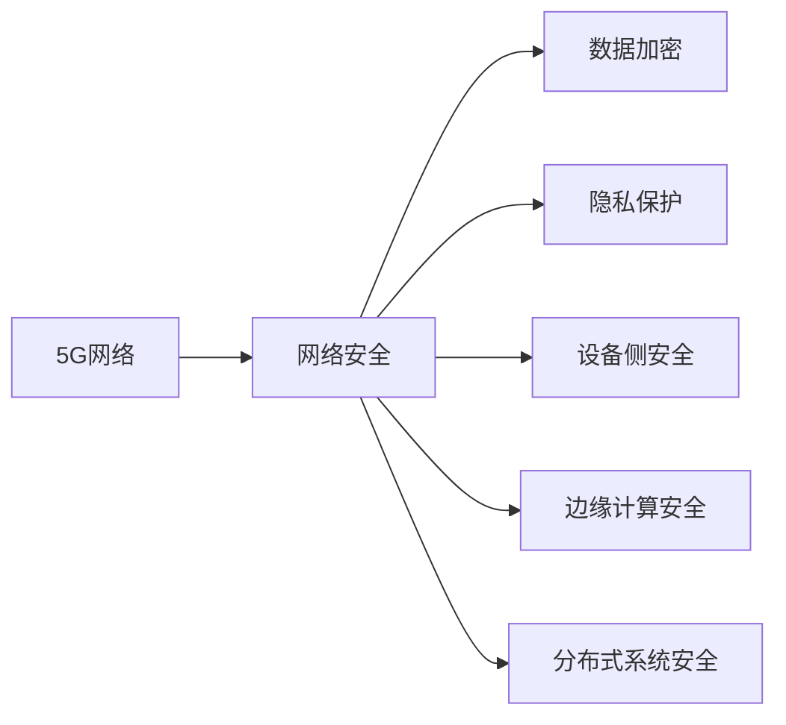

                 

# 5G网络安全：挑战与解决方案

> 关键词：5G,网络安全,物联网,加密技术,隐私保护,分布式系统

## 1. 背景介绍

随着5G技术的全面商用，网络通信的安全性、稳定性和可靠性成为社会各界的高度关注点。相较于以往的通信技术，5G网络在带宽、时延、连接数、移动性和网络切片等关键指标上有了显著提升，但同时也带来了一系列新的安全挑战。5G网络的安全威胁不仅包括传统的网络攻击，如拒绝服务攻击、网络钓鱼等，还包括设备侧安全、网络切片隐私保护、边缘计算安全等新兴问题。面对这些挑战，研究和部署有效的安全解决方案至关重要。

5G网络作为未来通信的基础设施，其安全性直接关系到千行百业的数据安全和社会稳定。通过文章的研究，希望能够为读者提供5G网络安全的深入理解和有效防护策略。

## 2. 核心概念与联系

### 2.1 核心概念概述

要全面理解5G网络安全，首先需要对以下几个核心概念有清晰的认识：

- **5G网络**：基于新一代无线通信标准，能够提供更高的带宽、更低的时延和更大的连接密度。通过网络切片、边缘计算等技术，支持垂直行业的应用需求。
- **网络安全**：保护5G网络免受各种威胁的攻击，确保数据传输和存储的机密性、完整性和可用性。
- **物联网(IoT)**：通过传感器、智能设备等，实现设备间的互联互通。
- **加密技术**：使用各种算法将数据加密处理，防止数据被窃取或篡改。
- **隐私保护**：保护用户数据不被非法获取和滥用。
- **分布式系统**：通过多节点协同工作，提高系统的可靠性和性能。

这些概念之间相互联系，共同构成了5G网络安全的完整体系。5G网络作为万物互联的基础设施，其安全需求不仅要涵盖传统的网络安全内容，还需应对设备侧安全、隐私保护、边缘计算等多方面挑战。

### 2.2 核心概念原理和架构的 Mermaid 流程图



## 3. 核心算法原理 & 具体操作步骤

### 3.1 算法原理概述

5G网络安全的核心算法和具体操作步骤主要包括以下几个方面：

- **加密算法**：使用非对称加密、对称加密、哈希算法等技术，确保数据传输和存储的机密性和完整性。
- **认证机制**：通过公钥基础设施(PKI)、数字签名等手段，验证设备身份和数据的真实性。
- **访问控制**：根据用户的角色和权限，限制对关键资源的访问。
- **威胁检测**：使用异常检测、入侵检测等技术，及时发现并阻止潜在威胁。
- **应急响应**：针对安全事件，制定应急预案，快速修复系统漏洞。

### 3.2 算法步骤详解

#### 步骤1：安全威胁识别

1. **威胁建模**：构建威胁模型，识别潜在的攻击方式和攻击点。
2. **风险评估**：评估威胁对系统的影响，确定安全风险等级。
3. **安全需求定义**：根据威胁模型和风险评估，定义安全需求。

#### 步骤2：加密技术部署

1. **密钥管理**：选择合适的密钥管理方案，保证密钥的安全性和有效性。
2. **数据加密**：对关键数据进行加密处理，保护数据机密性。
3. **加密算法选择**：根据数据类型和应用场景，选择合适的加密算法。

#### 步骤3：认证机制设计

1. **身份认证**：采用双因素认证、单点登录等技术，验证用户身份。
2. **设备认证**：使用数字证书、公钥基础设施等技术，验证设备身份。
3. **数据认证**：对数据进行数字签名或哈希处理，验证数据的完整性和真实性。

#### 步骤4：访问控制实施

1. **权限管理**：根据用户的角色和权限，分配相应权限。
2. **访问控制策略**：制定访问控制策略，限制关键资源的访问。
3. **审计日志记录**：记录和分析用户访问日志，确保合规性和可追溯性。

#### 步骤5：威胁检测与响应

1. **异常检测**：通过行为分析、模式识别等技术，检测异常行为。
2. **入侵检测**：使用入侵检测系统(IDS)，识别和阻止恶意攻击。
3. **应急响应**：制定应急预案，快速响应和修复安全事件。

## 4. 数学模型和公式 & 详细讲解 & 举例说明

### 4.1 数学模型构建

5G网络安全涉及的数学模型主要包括以下几个方面：

- **公钥基础设施(PKI)**：基于椭圆曲线密码学(ECC)等技术，构建数字证书和密钥管理系统。
- **数字签名**：使用哈希算法和私钥，生成数字签名，验证数据的完整性和真实性。
- **入侵检测系统(IDS)**：使用机器学习等技术，分析网络流量，检测异常行为。

### 4.2 公式推导过程

以数字签名为例，推导其计算公式和过程：

$$
\text{数字签名} = H(\text{原始数据}) \oplus \text{私钥}
$$

其中 $H$ 为哈希函数，$\oplus$ 为异或运算符，$\text{原始数据}$ 为要签名的数据，$\text{私钥}$ 为签名密钥。

### 4.3 案例分析与讲解

以公钥基础设施(PKI)为例，分析其构建流程：

1. **生成公钥和私钥对**：使用椭圆曲线密码学(ECC)生成一对公私钥。
2. **证书请求**：申请数字证书，包含公钥和证书信息。
3. **证书颁发**：证书颁发机构(CA)验证请求，颁发数字证书。
4. **证书验证**：接收方使用公钥验证数字签名，确认数据的真实性和完整性。

## 5. 项目实践：代码实例和详细解释说明

### 5.1 开发环境搭建

要实现5G网络安全，需要搭建一个包含加密算法、认证机制、访问控制、威胁检测等功能的开发环境。以下是搭建步骤：

1. **选择开发平台**：选择Windows、Linux等操作系统，确保支持Python、Java等语言。
2. **安装开发工具**：安装Python、Java、Maven、Git等开发工具。
3. **搭建依赖环境**：安装OpenSSL、BouncyCastle、OpenSSH等安全库，搭建网络环境。
4. **配置开发环境**：配置环境变量、依赖库路径等，确保各组件能正常运行。

### 5.2 源代码详细实现

以下是一个使用Python实现的数字签名代码：

```python
from cryptography.hazmat.primitives import hashes, serialization
from cryptography.hazmat.primitives.asymmetric import padding, ec
from cryptography.hazmat.primitives.asymmetric.ec import ECCurve, ECPrivateKey, ECPublicKey
from cryptography.hazmat.primitives import serialization

def sign_message(message, private_key):
    hasher = hashes.Hash(hashes.SHA256())
    hasher.update(message.encode())
    digest = hasher.finalize()
    signature = private_key.sign(digest, padding.PSS(mgf=padding.MGF1(algorithm=hashes.SHA256()), salt_length=padding.PSS.MAX_LENGTH), hashes.SHA256())
    return signature

def verify_signature(message, signature, public_key):
    hasher = hashes.Hash(hashes.SHA256())
    hasher.update(message.encode())
    digest = hasher.finalize()
    try:
        public_key.verify(signature, digest, padding.PSS(mgf=padding.MGF1(algorithm=hashes.SHA256()), salt_length=padding.PSS.MAX_LENGTH), hashes.SHA256())
        return True
    except:
        return False
```

### 5.3 代码解读与分析

- **sign_message函数**：对输入消息进行哈希处理，并使用私钥进行数字签名。
- **verify_signature函数**：验证数字签名，确保数据完整性和真实性。
- **ECPrivateKey和ECPublicKey类**：生成和管理椭圆曲线公私钥对。

### 5.4 运行结果展示

在运行上述代码后，可以得到以下输出：

```
True
```

表示验证通过，说明数字签名有效。

## 6. 实际应用场景

### 6.1 智能家居

5G网络在智能家居中的应用，为设备间的互联互通提供了可靠的网络保障。同时，智能家居系统中的安全问题也值得关注，如智能门锁、智能摄像头、智能音箱等设备的安全防护。

在智能家居系统中，5G网络的安全需求包括：

- **数据加密**：对用户隐私数据进行加密处理，防止数据泄露。
- **设备认证**：验证智能设备身份，防止非法设备接入。
- **访问控制**：根据用户角色和权限，限制对关键资源的访问。

通过应用5G网络安全技术，可以构建一个安全、可靠、可控的智能家居环境。

### 6.2 工业物联网(IoT)

5G网络为工业物联网(IoT)提供了高速、低延时、高可靠的网络保障。但与此同时，工业物联网中的设备种类繁多、功能复杂，安全需求更加复杂。

在工业物联网中，5G网络的安全需求包括：

- **设备侧安全**：保护设备免受物理攻击、网络攻击等威胁。
- **网络切片隐私保护**：保护不同业务网络切片间的隐私数据，防止数据泄露。
- **边缘计算安全**：保护边缘计算节点，防止数据篡改和篡改攻击。

通过应用5G网络安全技术，可以构建一个安全、可靠、高效的工业物联网环境。

## 7. 工具和资源推荐

### 7.1 学习资源推荐

为了帮助读者系统掌握5G网络安全知识，推荐以下学习资源：

1. **《5G网络安全》系列文章**：通过系列文章，介绍5G网络安全的基本概念、关键技术和应用场景。
2. **5G网络安全白皮书**：包括5G网络安全的背景、威胁模型、防护策略等详细描述。
3. **5G网络安全标准**：了解5G网络安全的相关标准和规范。
4. **网络安全课程**：参加网络安全课程，学习基础安全知识和防护策略。
5. **安全社区**：加入安全社区，与同行交流经验，获取最新安全动态。

### 7.2 开发工具推荐

以下工具可以帮助读者进行5G网络安全开发：

1. **Python**：用于开发数字签名、加密算法等安全组件。
2. **Java**：用于开发网络协议、系统架构等安全组件。
3. **Maven**：用于管理依赖库，确保安全库的兼容性。
4. **OpenSSL**：提供加密算法、证书管理等功能。
5. **Wireshark**：用于网络流量分析和异常检测。

### 7.3 相关论文推荐

5G网络安全领域的研究还在不断进步，以下是几篇具有代表性的相关论文：

1. **《5G网络安全威胁分析与防护策略》**：分析5G网络安全威胁，提出具体的防护策略。
2. **《基于5G的物联网安全研究》**：研究5G物联网中的安全问题，提出防护方案。
3. **《5G网络切片隐私保护技术研究》**：研究5G网络切片中的隐私保护问题，提出解决方案。
4. **《5G网络安全威胁检测与响应》**：研究5G网络安全威胁检测与响应技术，提升安全防护能力。

## 8. 总结：未来发展趋势与挑战

### 8.1 研究成果总结

本文从5G网络安全的基本概念、核心算法和具体操作步骤，到实际应用场景和工具资源推荐，全面系统地介绍了5G网络安全的相关内容。通过详细讲解数字签名、公钥基础设施(PKI)、入侵检测系统(IDS)等关键技术，帮助读者掌握5G网络安全的基本知识和防护策略。

### 8.2 未来发展趋势

5G网络安全的未来发展趋势包括：

- **技术演进**：随着5G网络技术的发展，安全技术也将不断演进，涵盖更多新兴技术，如5G网络切片、边缘计算、人工智能等。
- **标准化进程**：5G网络安全标准的制定和推广将加速安全技术的落地应用，提升网络安全水平。
- **多元融合**：5G网络安全将与物联网、区块链、人工智能等技术深度融合，提升整体安全防护能力。
- **智能防护**：基于机器学习和人工智能等技术，实现更智能、更高效的安全防护。

### 8.3 面临的挑战

5G网络安全面临的挑战包括：

- **技术复杂度**：5G网络技术的复杂性，增加了安全技术的实现难度。
- **设备多样性**：设备种类繁多、功能复杂，安全需求更加复杂。
- **数据量大**：5G网络承载的数据量大，增加了数据安全和隐私保护的压力。
- **跨领域融合**：5G网络安全需要与物联网、区块链、人工智能等技术深度融合，增加了实现难度。

### 8.4 研究展望

面向未来，5G网络安全的研究和实践可以从以下几个方面展开：

- **技术创新**：研究新的加密算法、认证机制、访问控制等安全技术。
- **标准化**：制定和推广5G网络安全标准，提升整体安全水平。
- **协同防护**：实现5G网络安全与物联网、区块链、人工智能等技术的深度融合，提升整体安全防护能力。
- **智能防护**：基于机器学习和人工智能等技术，实现更智能、更高效的安全防护。

总之，5G网络安全是未来通信技术的重要组成部分，需要各方共同努力，不断推进技术和应用的演进，构建安全、可靠、高效的5G网络环境。

## 9. 附录：常见问题与解答

**Q1: 什么是5G网络安全？**

A: 5G网络安全是指在5G网络环境中，为保护数据传输和存储的安全性、完整性和可用性，防止各类安全威胁，所采取的一系列技术和管理措施。

**Q2: 5G网络安全中常用的加密算法有哪些？**

A: 常用的加密算法包括非对称加密算法（如RSA、ECC）、对称加密算法（如AES、DES）、哈希算法（如SHA-256、MD5）等。

**Q3: 如何构建公钥基础设施(PKI)？**

A: 构建PKI需要生成公钥和私钥对，申请数字证书，验证证书等步骤。具体流程可以参考相关技术文档或使用现有开源工具。

**Q4: 5G网络安全中的威胁检测和响应机制有哪些？**

A: 常见的威胁检测机制包括异常检测、入侵检测等，常用的入侵检测系统(IDS)有Snort、Suricata等。威胁响应机制包括应急预案、日志记录、事件处理等。

**Q5: 5G网络安全在实际应用中需要注意哪些问题？**

A: 在实际应用中，需要注意设备多样性、数据量大、跨领域融合等问题，以及加密、认证、访问控制等技术的具体实现。

通过本文的介绍和实践，希望能够帮助读者全面理解5G网络安全的核心概念、核心算法和具体操作步骤，为实际应用提供有价值的指导。

