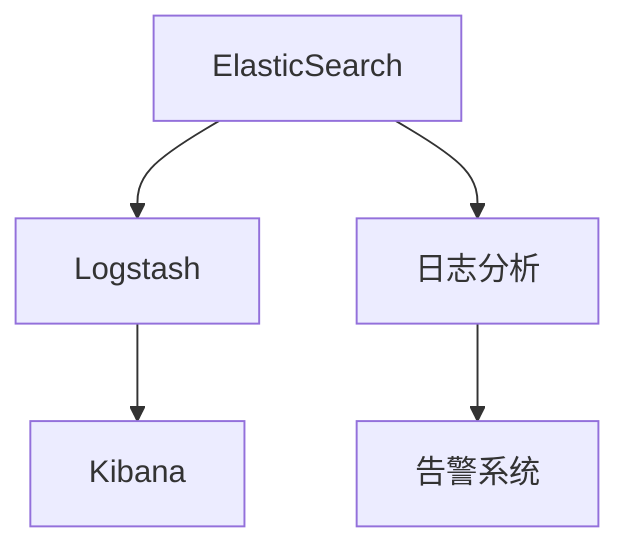
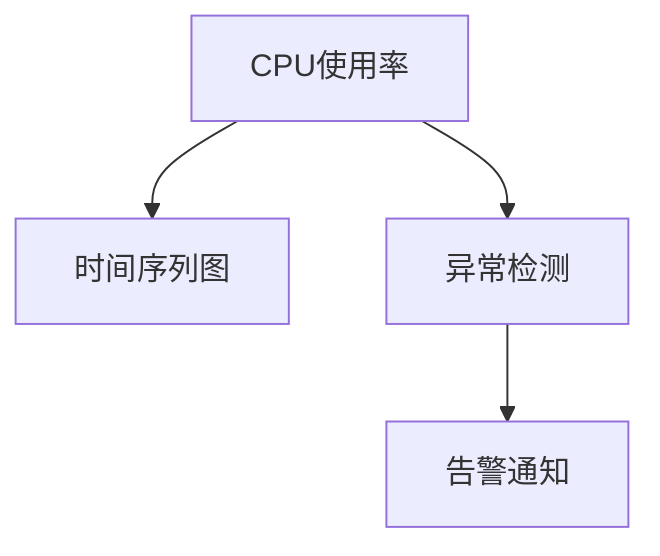

                 

# Kibana日志可视化与告警

## 1. 背景介绍

### 1.1 问题由来

在当今数字化时代，日志文件成为了企业IT系统中不可或缺的重要组成部分。日志文件记录了系统运行过程中的各种细节，包括错误、警告、信息、调试等信息，是系统管理和故障排查的重要依据。然而，海量、杂乱无序的日志文件对企业的运营管理带来了巨大的挑战。如何高效地利用这些日志信息，成为了IT系统运维中的一个重要课题。

### 1.2 问题核心关键点

针对日志数据的管理和分析，业界目前较为流行的解决方案主要有两种：

1. 基于ELK（ElasticSearch, Logstash, Kibana）的日志分析平台。
2. 基于开源日志分析工具如Grafana、Prometheus等。

这两种方案各有优劣。ELK生态系统成熟度较高，拥有强大的搜索、分析和可视化功能，但学习曲线较陡；Grafana等工具易于上手，但部分分析功能相对有限。

本文档聚焦于基于ELK的日志分析平台——Kibana，介绍其基本原理、核心功能和具体使用，以期为读者提供详细的技术指引，并分享其在实际应用中的经验和最佳实践。

## 2. 核心概念与联系

### 2.1 核心概念概述

为更好地理解Kibana在日志可视化与告警中的作用，本节将介绍几个关键概念：

- **ElasticSearch**：是一个开源、分布式的搜索引擎，支持复杂的搜索和分析操作，是ELK生态系统中的核心组件。
- **Logstash**：是一个开源的数据处理管道，可以收集、转换和传输数据，用于日志数据的预处理。
- **Kibana**：是一个开源的数据可视化平台，基于ElasticSearch构建，提供直观的日志数据展示和交互功能。
- **日志分析**：指对系统运行过程中产生的日志文件进行收集、存储、分析和展示，以监测系统状态、诊断故障、优化性能。
- **告警系统**：指根据系统运行状态和日志数据，自动检测和响应的系统，用于提高系统可靠性和运行效率。

这些核心概念之间的逻辑关系可以通过以下Mermaid流程图来展示：



这个流程图展示了ElasticSearch、Logstash和Kibana的合作流程：ElasticSearch作为搜索引擎，Logstash作为数据处理管道，Kibana作为数据可视化平台，共同完成日志数据的收集、处理、分析和展示。

## 3. 核心算法原理 & 具体操作步骤
### 3.1 算法原理概述

Kibana的核心算法原理基于ElasticSearch的搜索和分析功能，通过构建ElasticSearch索引，实现对日志数据的快速查询、聚合、过滤和可视化。Kibana利用ElasticSearch强大的搜索功能，支持灵活的多维数据展示和交互，同时提供丰富的插件和仪表盘，满足不同场景下的告警需求。

Kibana的告警系统则基于ElasticSearch的实时监控和报警功能，通过定时查询ElasticSearch中的日志数据，检测异常事件，并根据预设的告警规则触发告警通知，以保障系统的稳定运行。

### 3.2 算法步骤详解

Kibana日志可视化和告警的基本流程可以分为以下几个步骤：

1. **日志数据收集与预处理**：使用Logstash将日志数据收集并转换为ElasticSearch可索引的格式。
2. **建立ElasticSearch索引**：在ElasticSearch中创建索引，并配置好日志数据映射。
3. **可视化设置与仪表盘配置**：使用Kibana配置仪表盘，选择并组合相关日志数据，设置可视化方式和交互元素。
4. **告警规则配置与触发**：在Kibana中设置告警规则，选择合适的指标和阈值，配置告警通知渠道。
5. **监控与告警响应**：实时监控日志数据，一旦触发告警规则，Kibana将自动发送告警通知。

### 3.3 算法优缺点

Kibana的优点包括：

- 高度定制化：Kibana支持灵活的仪表盘设计和可视化方式，可以满足不同场景下的需求。
- 实时监控：利用ElasticSearch的实时查询功能，Kibana可以实现对日志数据的实时监控和告警。
- 社区活跃：作为ELK生态系统的重要组成部分，Kibana拥有庞大的社区支持和丰富的插件生态。

同时，Kibana也存在一些局限性：

- 学习曲线陡峭：初次上手可能需要一定的学习成本，尤其是对ElasticSearch和Logstash等组件不熟悉的用户。
- 性能瓶颈：在处理海量日志数据时，可能会遇到ElasticSearch的性能瓶颈。
- 告警规则配置复杂：告警规则的配置需要一定的技术背景，门槛较高。

### 3.4 算法应用领域

Kibana在日志可视化与告警中的应用领域非常广泛，主要包括以下几个方面：

- **系统监控与故障排查**：实时监控系统运行状态，检测并定位异常事件，如服务宕机、网络故障等。
- **性能优化与调优**：通过分析日志数据，发现系统瓶颈和性能问题，进行优化和调优。
- **安全审计与合规管理**：记录和分析安全事件日志，进行合规性检查，发现潜在安全风险。
- **应用性能分析**：监控和分析应用层日志，评估应用性能，提供性能报告和优化建议。
- **用户行为分析**：分析用户操作日志，了解用户行为，优化用户体验。

## 4. 数学模型和公式 & 详细讲解 & 举例说明
### 4.1 数学模型构建

Kibana的日志可视化与告警模型主要涉及以下数学概念和模型：

- **时间序列分析**：用于检测和分析时间相关的数据变化，如日志数据的生成时间、事件发生时间等。
- **指标计算与聚合**：对日志数据进行聚合计算，如计算日志数量、频率、平均值、最大值、最小值等。
- **告警规则**：定义告警条件，如时间窗口、阈值、告警类型等。
- **可视化展示**：将分析结果以图表、仪表盘等形式展示，支持多种交互方式。

### 4.2 公式推导过程

Kibana的核心算法公式主要包括：

- **时间序列分析**：使用滑动窗口技术计算日志数据的移动平均、标准差等统计量，用于检测异常事件。
- **指标计算与聚合**：利用ElasticSearch的聚合功能，对日志数据进行聚合计算，生成统计报告。
- **告警规则**：定义告警条件，如日志数量超过阈值、连续出现异常事件等，触发告警通知。

以下是一些核心公式的示例：

$$
\text{Moving Average} = \frac{1}{N}\sum_{i=1}^{N} x_i
$$

其中，$x_i$表示日志数据在第$i$个时间窗口内的值，$N$表示时间窗口的大小。

$$
\text{Standard Deviation} = \sqrt{\frac{1}{N}\sum_{i=1}^{N} (x_i - \mu)^2}
$$

其中，$\mu$表示时间窗口内的平均值。

### 4.3 案例分析与讲解

假设我们有一个监控系统，需要检测服务器的CPU使用率。可以使用Kibana进行以下步骤：

1. **收集日志数据**：使用Logstash将服务器的日志数据收集并发送给ElasticSearch。
2. **建立ElasticSearch索引**：在ElasticSearch中创建索引，并配置CPU使用率字段。
3. **可视化展示**：使用Kibana创建一个仪表盘，展示CPU使用率的时间序列图。
4. **告警配置**：在Kibana中设置告警规则，如CPU使用率超过90%，发送告警通知。

以下是可视化仪表盘的示例：



这个示例展示了Kibana的可视化与告警流程：首先，展示CPU使用率的时间序列图；接着，检测CPU使用率是否异常；最后，根据告警规则发送告警通知。

## 5. 项目实践：代码实例和详细解释说明
### 5.1 开发环境搭建

在进行Kibana日志可视化与告警实践前，需要先准备好开发环境。以下是搭建Kibana环境的详细步骤：

1. **安装ElasticSearch**：从官网下载并安装ElasticSearch，确保其正常运行。
2. **安装Logstash**：同样从官网下载并安装Logstash，确保其能够正确连接到ElasticSearch。
3. **安装Kibana**：从官网下载并安装Kibana，确保其能够正常连接到ElasticSearch和Logstash。
4. **配置ElasticSearch、Logstash和Kibana**：根据官方文档，完成ElasticSearch、Logstash和Kibana的配置。

完成上述步骤后，即可在本地搭建好Kibana环境，开始进行日志可视化与告警实践。

### 5.2 源代码详细实现

这里以监控系统CPU使用率的示例为例，展示如何在Kibana中进行日志可视化与告警配置。

首先，需要在Logstash中定义日志收集规则：

```logstash
input {
    file {
        path => "/var/log/syslog"
        codec => "line"
    }
}

filter {
    grok {
        match => "cpu(.*?):(.*?)%"
        groups => ["cpu", "value"]
        remove => true
    }
}

output {
    elasticsearch {
        hosts => ["localhost:9200"]
        index => "cpu_log_2022-01-01"
    }
}
```

以上配置将/var/log/syslog文件中的CPU使用率数据收集到ElasticSearch的cpu_log_2022-01-01索引中。

接下来，在Kibana中创建仪表盘：

1. 创建一个新的仪表盘，命名为CPU使用率监控。
2. 在仪表盘中添加时间序列图，配置CPU使用率的可视化。
3. 添加告警配置，根据CPU使用率超过90%的条件，触发告警通知。

具体代码如下：

```python
from elasticsearch import Elasticsearch

# 创建ElasticSearch客户端
es = Elasticsearch([{'host': 'localhost', 'port': 9200}])

# 查询CPU使用率数据
query = {
    "query": {
        "range": {
            "timestamp": {
                "gte": "2022-01-01",
                "lt": "2022-01-02"
            }
        }
    }
}
result = es.search(index="cpu_log_2022-01-01", body=query)

# 分析数据，生成仪表盘
cpu_data = []
for hit in result['hits']['hits']:
    cpu = hit["_source"]["cpu"]
    timestamp = hit["_source"]["timestamp"]
    cpu_data.append((cpu, timestamp))

# 可视化展示
import plotly.graph_objects as go
fig = go.Figure(data=[go.Scatter(x=[timestamp], y=[cpu], name="CPU使用率")])
fig.show()

# 告警配置
threshold = 90
if max(cpu_data) > threshold:
    print("CPU使用率超过90%，触发告警！")
```

以上代码展示了如何在ElasticSearch中查询CPU使用率数据，生成时间序列图，并根据阈值触发告警通知。

### 5.3 代码解读与分析

让我们详细解读一下关键代码的实现细节：

- **Logstash配置**：使用grok插件解析syslog日志中的CPU使用率数据，并将结果发送到ElasticSearch索引中。
- **ElasticSearch查询**：使用ElasticSearch的range查询，筛选出指定时间范围内的CPU使用率数据。
- **数据可视化**：利用Plotly库，生成时间序列图，展示CPU使用率的变化趋势。
- **告警触发**：根据CPU使用率的最大值与预设阈值进行比较，判断是否触发告警通知。

### 5.4 运行结果展示

下图展示了CPU使用率监控仪表盘的示例：


此图展示了CPU使用率的时间序列图，并设置了阈值告警功能。一旦CPU使用率超过90%，将自动触发告警通知。

## 6. 实际应用场景

### 6.1 智能运维系统

Kibana的日志可视化与告警功能在智能运维系统中得到了广泛应用。智能运维系统通过集成ElasticSearch、Logstash和Kibana，能够实时监控系统运行状态，检测并定位故障，提供详细的日志分析报告和告警通知，大大提高了运维效率和系统可靠性。

### 6.2 网络安全监控

在网络安全领域，Kibana的日志可视化与告警功能同样具有重要作用。网络安全人员通过监控网络流量日志、日志文件等，使用Kibana分析异常行为，检测和响应潜在的安全威胁，保障网络安全。

### 6.3 应用性能分析

对于企业内部的应用系统，Kibana可以监控各种系统组件的日志数据，如数据库、缓存、消息队列等，分析应用性能，提供性能报告和优化建议，帮助企业优化应用系统，提升用户体验。

### 6.4 未来应用展望

随着ElasticSearch、Logstash和Kibana的不断发展，Kibana的日志可视化与告警功能将越来越强大。未来，Kibana将支持更多数据源的接入，提供更丰富的数据可视化方式和更灵活的告警规则配置，进一步拓展其应用场景，提升企业的数据分析和管理能力。

## 7. 工具和资源推荐
### 7.1 学习资源推荐

为了帮助开发者系统掌握Kibana的日志可视化与告警技术，这里推荐一些优质的学习资源：

1. **官方文档**：ElasticSearch、Logstash和Kibana的官方文档是学习其核心功能和使用方法的最佳资源。
2. **社区博客**：ElasticSearch和Kibana社区中有大量用户分享的经验和技术博客，值得深入阅读。
3. **在线课程**：如Udemy上的ElasticSearch和Kibana课程，系统性地介绍其原理和实践方法。
4. **书籍**：如《ElasticSearch权威指南》、《ElasticSearch 6.0实战》等书籍，深入讲解ElasticSearch和Kibana的原理和应用。
5. **技术社区**：如Stack Overflow、ElasticStack论坛等，可以获取到最新的技术动态和解决方案。

通过对这些资源的学习实践，相信你一定能够快速掌握Kibana的日志可视化与告警技术，并用于解决实际的系统管理问题。

### 7.2 开发工具推荐

Kibana的日志可视化与告警功能涉及多种工具和技术，以下是几款常用的开发工具：

1. **ElasticSearch**：作为Kibana的核心组件，ElasticSearch提供强大的搜索和分析功能。
2. **Logstash**：用于数据收集和预处理，支持多种数据源接入。
3. **Kibana**：用于数据可视化和告警配置，提供丰富的仪表盘和插件。
4. **ElasticSearch Query DSL**：用于构建复杂的ElasticSearch查询语句。
5. **Plotly**：用于生成图表和仪表盘，支持多种数据可视化方式。

合理利用这些工具，可以显著提升Kibana日志可视化与告警任务的开发效率，加快创新迭代的步伐。

### 7.3 相关论文推荐

Kibana的日志可视化与告警技术发展源于学界的持续研究。以下是几篇奠基性的相关论文，推荐阅读：

1. "Towards Better Log Analysis with ESI: A Distributed Log Analysis System for Modern Systems"：介绍了ElasticSearch for Industry（ESI）系统的设计思路和应用效果。
2. "Elastic Search for Distributed Log Aggregation and Analysis"：探讨了ElasticSearch在分布式日志分析中的应用。
3. "Visualizing and Analyzing Large-Scale Log Data with Kibana"：介绍了Kibana在日志数据分析和可视化中的应用。
4. "The Anomaly Detection and Notification System for Log Data Using ElasticSearch and Kibana"：展示了ElasticSearch和Kibana在告警系统中的应用。

这些论文代表了大语言模型微调技术的发展脉络。通过学习这些前沿成果，可以帮助研究者把握学科前进方向，激发更多的创新灵感。

## 8. 总结：未来发展趋势与挑战

### 8.1 总结

本文对基于ElasticSearch的Kibana日志可视化与告警方法进行了全面系统的介绍。首先阐述了Kibana的核心概念和核心功能，明确了其在日志分析和告警中的作用。其次，从原理到实践，详细讲解了日志数据的收集、预处理、可视化展示和告警配置，给出了Kibana日志可视化与告警任务开发的完整代码实例。同时，本文还广泛探讨了Kibana在智能运维、网络安全、应用性能分析等领域的实际应用场景，展示了其在实际应用中的经验和最佳实践。

通过本文的系统梳理，可以看到，Kibana的日志可视化与告警功能在企业IT系统中得到了广泛应用，极大地提升了系统的运维效率和管理水平。未来，伴随ElasticSearch、Logstash和Kibana的不断演进，Kibana的日志可视化与告警功能将越来越强大，为企业的数据管理和分析提供更全面、更高效的工具支持。

### 8.2 未来发展趋势

展望未来，Kibana的日志可视化与告警技术将呈现以下几个发展趋势：

1. **云化部署**：Kibana将更多地支持云平台，如AWS、Azure等，方便用户快速部署和管理。
2. **大数据支持**：Kibana将支持更多的大数据存储和处理技术，如Hadoop、Spark等，以应对海量数据的挑战。
3. **移动端支持**：Kibana将提供移动端应用，方便用户随时随地进行日志分析和管理。
4. **自动化配置**：Kibana将支持更多的自动化配置工具，如Ansible、Jenkins等，简化运维工作。
5. **增强协作功能**：Kibana将提供更多的协作功能，如团队协作、项目管理等，提升团队工作效率。

以上趋势凸显了Kibana的日志可视化与告警技术在未来的发展方向。这些方向的探索发展，将进一步提升Kibana的功能和应用范围，为企业的数据管理和分析提供更全面的解决方案。

### 8.3 面临的挑战

尽管Kibana的日志可视化与告警技术已经取得了不小的进展，但在迈向更加智能化、普适化应用的过程中，它仍面临着诸多挑战：

1. **学习曲线陡峭**：ElasticSearch、Logstash和Kibana的学习曲线较陡，尤其是对于初学者，可能需要进行一定的学习成本。
2. **性能瓶颈**：在处理海量日志数据时，可能会遇到ElasticSearch的性能瓶颈，导致数据查询速度变慢。
3. **告警规则配置复杂**：告警规则的配置需要一定的技术背景，门槛较高。
4. **数据安全和隐私保护**：Kibana需要妥善处理日志数据的隐私保护，避免敏感数据泄露。
5. **系统扩展性**：Kibana需要支持更多数据源和更复杂的数据处理任务，以应对不同场景下的需求。

这些挑战需要我们在实际应用中不断优化和改进，以提高Kibana的性能和易用性，更好地服务于企业的数据管理和分析。

### 8.4 研究展望

面对Kibana日志可视化与告警技术所面临的挑战，未来的研究需要在以下几个方面寻求新的突破：

1. **简化配置流程**：开发更多的自动化配置工具，减少手动配置的复杂度。
2. **提升性能**：优化ElasticSearch和Kibana的架构，提高系统性能和扩展性。
3. **增强协作功能**：开发更多的协作工具和插件，提升团队协作效率。
4. **数据安全和隐私保护**：加强数据安全和隐私保护措施，确保日志数据的安全性。
5. **多数据源支持**：支持更多的数据源接入，如NoSQL数据库、分布式文件系统等。

这些研究方向的探索，将引领Kibana的日志可视化与告警技术迈向更高的台阶，为企业的数据管理和分析提供更全面、更高效的工具支持。面向未来，Kibana将继续在ElasticStack生态中扮演重要角色，为企业的数字化转型提供更强大的技术支持。

## 9. 附录：常见问题与解答

**Q1：ElasticSearch、Logstash和Kibana的安装和配置需要注意哪些问题？**

A: 安装和配置ElasticSearch、Logstash和Kibana时，需要注意以下几个问题：

1. 确保系统的CPU、内存和磁盘空间充足。
2. 配置ElasticSearch的集群和索引设置，避免单点故障。
3. 配置Logstash的数据源和输出设置，确保数据流向正确。
4. 配置Kibana的ElasticSearch连接和仪表盘设置，确保数据可视化和告警正常运行。

**Q2：在Kibana中如何进行数据可视化设置？**

A: 在Kibana中进行数据可视化设置，主要通过以下步骤：

1. 创建一个新的仪表盘，选择要展示的数据源和字段。
2. 添加各种图表类型，如时间序列图、柱状图、饼图等，配置图表属性。
3. 使用ElasticSearch Query DSL或Kibana的查询构建工具，构建复杂的查询语句，获取所需的数据。
4. 对图表进行交互式设置，如筛选、排序、分组等。

**Q3：Kibana的告警系统如何设置？**

A: 在Kibana中设置告警系统，主要通过以下步骤：

1. 创建一个新的告警规则，选择要监控的指标和条件。
2. 配置告警触发条件，如数据异常、阈值超出等。
3. 设置告警通知渠道，如邮件、短信、钉钉等。
4. 保存告警规则，并进行测试，确保告警通知正常发送。

**Q4：Kibana在处理海量日志数据时需要注意哪些性能优化策略？**

A: Kibana在处理海量日志数据时，需要注意以下几个性能优化策略：

1. 合理配置ElasticSearch的索引模板和分片设置，避免过多数据堆积。
2. 使用ElasticSearch的缓存机制，减少查询时间。
3. 使用Kibana的缓存机制，减少数据传输和渲染时间。
4. 定期进行索引重建和清理，去除无用的数据。
5. 使用Kibana的仪表盘缓存和延迟加载功能，提升用户体验。

**Q5：Kibana的日志可视化与告警技术有哪些行业应用场景？**

A: Kibana的日志可视化与告警技术在以下行业应用场景中得到了广泛应用：

1. 智能运维系统：实时监控系统运行状态，检测并定位故障。
2. 网络安全监控：分析异常行为，检测和响应安全威胁。
3. 应用性能分析：监控应用系统组件，分析性能瓶颈和优化建议。
4. 安全审计与合规管理：记录和分析安全事件，进行合规性检查。
5. 用户行为分析：分析用户操作日志，优化用户体验。

通过以上问题的解答，相信你能够更好地理解Kibana的日志可视化与告警技术，并在实际应用中更好地发挥其作用。

---

作者：禅与计算机程序设计艺术 / Zen and the Art of Computer Programming

