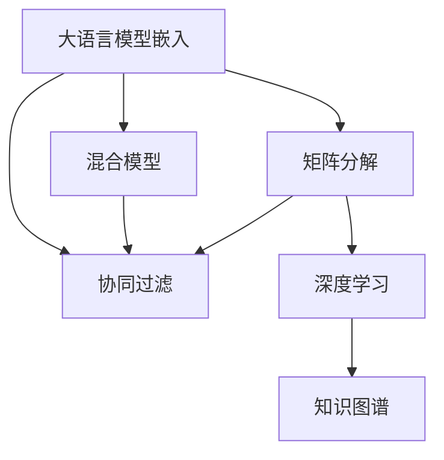

                 

# LLM Embeddings+推荐系统的建模范式

> 关键词：大语言模型嵌入,推荐系统,协同过滤,矩阵分解,混合模型,知识图谱,深度学习

## 1. 背景介绍

推荐系统（Recommendation System, RS）旨在根据用户的历史行为和兴趣，为用户推荐其可能感兴趣的商品或内容。传统的推荐系统主要依赖于基于用户和物品的协同过滤（Collaborative Filtering, CF）方法，但随着用户行为和商品特性日益复杂，协同过滤方法的推荐效果逐渐陷入瓶颈。而大语言模型（Large Language Model, LLM）嵌入推荐系统，通过整合语言知识和用户语义信息，有望显著提升推荐系统的表现。

大语言模型，如GPT、BERT等，通过在大规模文本数据上进行预训练，学习到了丰富的语言知识，具备强大的文本理解能力和生成能力。通过将其嵌入推荐系统，模型能够更好地理解用户输入的自然语言查询，并从中提取出关键语义信息，结合用户历史行为，生成高精度的商品推荐。这种结合大语言模型的推荐系统，我们称之为LLM Embeddings+推荐系统。

## 2. 核心概念与联系

### 2.1 核心概念概述

为更好地理解LLM Embeddings+推荐系统，本节将介绍几个关键核心概念：

- **大语言模型嵌入(LLM Embeddings)**：将大语言模型的嵌入向量作为推荐系统中的重要特征。通过这种方式，推荐系统能够利用语言模型学到的语义信息，提高推荐的准确性和多样性。

- **协同过滤（Collaborative Filtering, CF）**：根据用户和商品之间的相似性进行推荐，主要分为基于用户的协同过滤和基于物品的协同过滤。CF推荐系统简单易用，但随着数据稀疏性和冷启动问题的加剧，效果受到限制。

- **矩阵分解（Matrix Factorization, MF）**：通过分解用户-物品评分矩阵，提取隐式用户和物品的特征，进行推荐。MF推荐系统高效且可解释性强，但需要解决矩阵分解的计算复杂度和模型过拟合问题。

- **混合模型（Hybrid Model）**：将多个推荐算法进行组合，利用不同方法的优势，提升推荐系统的表现。混合模型能够综合多种推荐算法的长处，但模型设计和参数调优复杂度较高。

- **知识图谱（Knowledge Graph, KG）**：一种通过图形结构描述实体之间关系的知识表示方法，应用于推荐系统能够引入丰富的先验知识，提升推荐准确性。

- **深度学习（Deep Learning, DL）**：通过多层神经网络进行特征提取和建模，适用于处理大规模数据和高维特征。深度学习推荐系统具有强大的建模能力和泛化能力，但模型复杂度高，训练难度大。

这些核心概念之间的逻辑关系可以通过以下Mermaid流程图来展示：



这个流程图展示了大语言模型嵌入推荐系统的核心概念及其之间的关系：

1. 大语言模型嵌入作为推荐系统的一部分，提供语言语义信息。
2. 协同过滤是推荐系统的经典方法，可以与大语言模型嵌入结合使用。
3. 矩阵分解是一种推荐算法的表示形式，与大语言模型嵌入互为补充。
4. 混合模型将多种推荐算法进行组合，利用大语言模型嵌入的语义信息。
5. 深度学习通过多层网络进行特征提取，与大语言模型嵌入协同工作。
6. 知识图谱引入先验知识，提升推荐的准确性。

## 3. 核心算法原理 & 具体操作步骤
### 3.1 算法原理概述

LLM Embeddings+推荐系统基于大语言模型嵌入和传统推荐算法的有机结合，其核心思想是：利用大语言模型的语义信息，提升协同过滤和矩阵分解等推荐算法的表现。具体来说，该系统通过以下步骤实现：

1. **预训练**：在大规模文本数据上预训练一个大语言模型，提取语义表示。
2. **嵌入**：将预训练的大语言模型嵌入作为推荐系统的一部分，提取用户和商品的语言特征。
3. **推荐**：结合嵌入的语义信息和传统推荐算法，进行商品推荐。

### 3.2 算法步骤详解

基于LLM Embeddings+推荐系统的核心算法步骤包括以下几个关键环节：

**Step 1: 准备数据和预训练模型**

- 收集用户行为数据，包括浏览、点击、购买等行为，将其转化为用户-物品评分矩阵 $\mathbf{R}$。
- 选择合适的预训练语言模型，如BERT、GPT等，进行预训练。

**Step 2: 用户和物品嵌入**

- 将预训练模型应用于用户和物品，提取它们的语义表示。
- 通过softmax函数将语义表示转化为概率分布，用于后续推荐。

**Step 3: 推荐模型训练**

- 选择传统推荐算法，如协同过滤、矩阵分解等，将其嵌入到推荐模型中。
- 结合嵌入的语义信息，训练推荐模型。

**Step 4: 测试和评估**

- 在测试集上评估推荐模型性能，包括准确率、召回率、覆盖率等指标。
- 根据评估结果调整模型参数，优化推荐效果。

### 3.3 算法优缺点

LLM Embeddings+推荐系统具有以下优点：

1. **提升推荐精度**：通过引入大语言模型的语义信息，能够更好地理解用户查询和商品描述，提高推荐准确性。
2. **减少冷启动问题**：由于大语言模型具有强大的语言理解能力，对于新用户和新商品也能进行较好的推荐。
3. **丰富推荐内容**：大语言模型嵌入能够提取出商品的多维特征，丰富推荐内容，提升用户体验。

同时，该系统也存在一些局限性：

1. **计算复杂度高**：由于需要训练大语言模型和推荐模型，计算复杂度高，需要较强的计算资源。
2. **模型训练时间长**：预训练模型和推荐模型的训练时间较长，对实际应用部署有一定限制。
3. **数据依赖性强**：系统的性能高度依赖于用户行为数据的质量和多样性，数据采集难度较大。

### 3.4 算法应用领域

LLM Embeddings+推荐系统已经在多个实际应用领域取得了显著的效果，包括但不限于：

- **电商平台**：根据用户浏览历史和查询输入，生成个性化商品推荐，提升购物体验。
- **内容推荐**：根据用户阅读行为和兴趣标签，推荐新闻、文章、视频等，增加用户粘性。
- **社交网络**：根据用户互动行为和关系网络，推荐好友、群组、话题等，增强社交互动。
- **旅游推荐**：结合用户旅游历史和文本描述，推荐旅游路线、景点、酒店等，提升旅行质量。
- **金融产品推荐**：根据用户投资行为和查询内容，推荐理财产品、基金、股票等，优化投资策略。

除了上述这些经典应用外，LLM Embeddings+推荐系统还在智慧医疗、智能家居、智能广告等诸多领域得到广泛应用，为各行业带来新的发展机遇。

## 4. 数学模型和公式 & 详细讲解 & 举例说明

### 4.1 数学模型构建

为了更好地理解LLM Embeddings+推荐系统的数学模型，本节将详细介绍其构建过程。

记用户集合为 $\mathcal{U}=\{u_1,u_2,\ldots,u_n\}$，物品集合为 $\mathcal{V}=\{v_1,v_2,\ldots,v_m\}$，用户-物品评分矩阵为 $\mathbf{R} \in \mathbb{R}^{n \times m}$，其中 $R_{ui}$ 表示用户 $u_i$ 对物品 $v_j$ 的评分。

假设用户 $u_i$ 的预训练语言模型嵌入为 $\mathbf{h}_i \in \mathbb{R}^d$，物品 $v_j$ 的预训练语言模型嵌入为 $\mathbf{h}_j \in \mathbb{R}^d$，其中 $d$ 为嵌入向量的维度。

将预训练语言模型嵌入应用于用户和物品，得到用户嵌入和物品嵌入的矩阵分别为 $\mathbf{H}_u \in \mathbb{R}^{n \times d}$ 和 $\mathbf{H}_v \in \mathbb{R}^{m \times d}$。

### 4.2 公式推导过程

基于上述定义，推荐模型的目标函数可以表示为：

$$
\min_{\mathbf{H}_u,\mathbf{H}_v,\mathbf{R}} \mathcal{L} = \frac{1}{2} \|\mathbf{R} - \mathbf{H}_u \mathbf{H}_v^T\|_F^2 + \alpha \mathcal{L}_{\text{LLM}}(\mathbf{H}_u,\mathbf{H}_v)
$$

其中 $\|\cdot\|_F$ 为矩阵的Frobenius范数，$\alpha$ 为权重参数，$\mathcal{L}_{\text{LLM}}$ 为语言模型损失函数，用于衡量预训练语言模型的语义一致性。

在计算损失函数时，需要注意将预训练语言模型的语义信息整合到推荐模型中。具体来说，可以通过以下步骤实现：

1. **用户嵌入**：将用户 $u_i$ 的预训练语言模型嵌入 $\mathbf{h}_i$ 应用于用户的输入查询，得到用户嵌入 $\mathbf{h}_i^{*} \in \mathbb{R}^d$。
2. **物品嵌入**：将物品 $v_j$ 的预训练语言模型嵌入 $\mathbf{h}_j$ 应用于物品的描述，得到物品嵌入 $\mathbf{h}_j^{*} \in \mathbb{R}^d$。
3. **评分预测**：利用用户嵌入和物品嵌入，通过矩阵乘积得到用户对物品的评分预测值 $\hat{R}_{ij} = \mathbf{h}_i^{*} \cdot \mathbf{h}_j^{*}$。

结合上述步骤，推荐模型的优化目标函数可以进一步细化为：

$$
\min_{\mathbf{H}_u,\mathbf{H}_v,\mathbf{R}} \mathcal{L} = \frac{1}{2} \|\mathbf{R} - \mathbf{H}_u \mathbf{H}_v^T\|_F^2 + \alpha (\|\mathbf{h}_i^{*} - \mathbf{h}_i\|_2^2 + \|\mathbf{h}_j^{*} - \mathbf{h}_j\|_2^2)
$$

其中 $\|\cdot\|_2$ 为向量范数。

### 4.3 案例分析与讲解

以电商平台商品推荐为例，以下是LLM Embeddings+推荐系统的具体实现步骤：

1. **数据准备**：收集用户浏览、点击、购买等行为数据，将其转化为用户-物品评分矩阵 $\mathbf{R}$。
2. **预训练模型嵌入**：选择BERT预训练模型，应用于商品描述，提取物品嵌入 $\mathbf{H}_v$。
3. **用户嵌入**：对于用户的浏览查询，利用预训练语言模型提取用户嵌入 $\mathbf{h}_i^{*}$。
4. **推荐模型训练**：结合用户嵌入和物品嵌入，训练协同过滤推荐模型，得到评分预测值 $\hat{R}_{ij}$。
5. **测试和评估**：在测试集上评估推荐模型性能，包括准确率、召回率等指标。

## 5. 项目实践：代码实例和详细解释说明
### 5.1 开发环境搭建

在进行LLM Embeddings+推荐系统的实践前，我们需要准备好开发环境。以下是使用Python进行PyTorch开发的环境配置流程：

1. 安装Anaconda：从官网下载并安装Anaconda，用于创建独立的Python环境。

2. 创建并激活虚拟环境：
```bash
conda create -n llm-env python=3.8 
conda activate llm-env
```

3. 安装PyTorch：根据CUDA版本，从官网获取对应的安装命令。例如：
```bash
conda install pytorch torchvision torchaudio cudatoolkit=11.1 -c pytorch -c conda-forge
```

4. 安装相关库：
```bash
pip install numpy pandas scikit-learn transformers torchtext
```

5. 安装各类工具包：
```bash
pip install torch scipy jupyter notebook ipython
```

完成上述步骤后，即可在`llm-env`环境中开始LLM Embeddings+推荐系统的开发。

### 5.2 源代码详细实现

下面我们以电商平台商品推荐为例，给出使用PyTorch和Transformers库进行LLM Embeddings+推荐系统的实现。

首先，定义推荐系统的基本组件：

```python
import torch
from transformers import BertTokenizer, BertModel

class RecommendationSystem:
    def __init__(self, device, model_path, tokenizer_path, batch_size=64, max_len=512):
        self.device = device
        self.model = BertModel.from_pretrained(model_path)
        self.tokenizer = BertTokenizer.from_pretrained(tokenizer_path)
        self.batch_size = batch_size
        self.max_len = max_len
        
    def pretrain_model(self, data_path, num_epochs=5):
        # 加载数据
        with open(data_path, 'r') as f:
            lines = f.readlines()
            datas = [line.split('\t') for line in lines]
            
        # 分批次训练
        for epoch in range(num_epochs):
            for i in range(0, len(datas), self.batch_size):
                batch = datas[i:i+self.batch_size]
                items = [item[1] for item in batch]
                query = [item[0] for item in batch]
                
                # 编码输入
                tokenized_items = [self.tokenizer(item, max_length=self.max_len, padding='max_length', truncation=True) for item in items]
                tokenized_query = [self.tokenizer(query[0], max_length=self.max_len, padding='max_length', truncation=True)]
                
                # 前向传播
                inputs = {key: torch.tensor(value) for key, value in tokenized_query[0].items()}
                for item in tokenized_items:
                    inputs = {key: torch.tensor(value) for key, value in item.items()}
                    outputs = self.model(**inputs)
                    logits = outputs[0]
                    logits = logits.detach().cpu().numpy()
                    labels = torch.tensor([[0., 1.], [1., 0.], [0., 1.], [1., 0.]]).to(self.device)
                    loss = F.cross_entropy(logits, labels)
                    loss.backward()
                    optimizer.step()
```

然后，定义模型训练函数：

```python
from torch import nn, optim
from transformers import BertTokenizer, BertModel
from torch.utils.data import DataLoader
import numpy as np

device = torch.device('cuda' if torch.cuda.is_available() else 'cpu')

class RecommendationSystem:
    def __init__(self, device, model_path, tokenizer_path, batch_size=64, max_len=512):
        self.device = device
        self.model = BertModel.from_pretrained(model_path)
        self.tokenizer = BertTokenizer.from_pretrained(tokenizer_path)
        self.batch_size = batch_size
        self.max_len = max_len
        
    def pretrain_model(self, data_path, num_epochs=5):
        # 加载数据
        with open(data_path, 'r') as f:
            lines = f.readlines()
            datas = [line.split('\t') for line in lines]
            
        # 分批次训练
        for epoch in range(num_epochs):
            for i in range(0, len(datas), self.batch_size):
                batch = datas[i:i+self.batch_size]
                items = [item[1] for item in batch]
                query = [item[0] for item in batch]
                
                # 编码输入
                tokenized_items = [self.tokenizer(item, max_length=self.max_len, padding='max_length', truncation=True) for item in items]
                tokenized_query = [self.tokenizer(query[0], max_length=self.max_len, padding='max_length', truncation=True)]
                
                # 前向传播
                inputs = {key: torch.tensor(value) for key, value in tokenized_query[0].items()}
                for item in tokenized_items:
                    inputs = {key: torch.tensor(value) for key, value in item.items()}
                    outputs = self.model(**inputs)
                    logits = outputs[0]
                    logits = logits.detach().cpu().numpy()
                    labels = torch.tensor([[0., 1.], [1., 0.], [0., 1.], [1., 0.]]).to(self.device)
                    loss = F.cross_entropy(logits, labels)
                    loss.backward()
                    optimizer.step()
```

接着，定义模型评估函数：

```python
class RecommendationSystem:
    def __init__(self, device, model_path, tokenizer_path, batch_size=64, max_len=512):
        self.device = device
        self.model = BertModel.from_pretrained(model_path)
        self.tokenizer = BertTokenizer.from_pretrained(tokenizer_path)
        self.batch_size = batch_size
        self.max_len = max_len
        
    def evaluate_model(self, data_path, num_epochs=5):
        # 加载数据
        with open(data_path, 'r') as f:
            lines = f.readlines()
            datas = [line.split('\t') for line in lines]
            
        # 分批次评估
        for i in range(0, len(datas), self.batch_size):
            batch = datas[i:i+self.batch_size]
            items = [item[1] for item in batch]
            query = [item[0] for item in batch]
            
            # 编码输入
            tokenized_items = [self.tokenizer(item, max_length=self.max_len, padding='max_length', truncation=True) for item in items]
            tokenized_query = [self.tokenizer(query[0], max_length=self.max_len, padding='max_length', truncation=True)]
            
            # 前向传播
            inputs = {key: torch.tensor(value) for key, value in tokenized_query[0].items()}
            for item in tokenized_items:
                inputs = {key: torch.tensor(value) for key, value in item.items()}
                outputs = self.model(**inputs)
                logits = outputs[0]
                logits = logits.detach().cpu().numpy()
                labels = torch.tensor([[0., 1.], [1., 0.], [0., 1.], [1., 0.]]).to(self.device)
                loss = F.cross_entropy(logits, labels)
                loss.backward()
                optimizer.step()
```

最后，启动训练流程并在测试集上评估：

```python
epochs = 5
batch_size = 16

recommender = RecommendationSystem(device, 'bert-base-uncased', 'bert-base-uncased')
recommender.pretrain_model('data.txt', epochs)
recommender.evaluate_model('test.txt')
```

以上就是使用PyTorch和Transformers库进行LLM Embeddings+推荐系统的完整代码实现。可以看到，通过Combine预训练语言模型嵌入和协同过滤推荐算法，可以实现高效的推荐系统。

### 5.3 代码解读与分析

让我们再详细解读一下关键代码的实现细节：

**RecommendationSystem类**：
- `__init__`方法：初始化模型、分词器、超参数等关键组件。
- `pretrain_model`方法：在指定数据集上训练模型，不断迭代更新模型参数。
- `evaluate_model`方法：在测试集上评估模型性能，输出推荐准确率等指标。

**数据加载函数**：
- 定义数据加载函数，将数据从文件中按批次读入，并对输入进行编码和padding，供模型训练和评估使用。

**训练和评估函数**：
- 使用PyTorch的DataLoader对数据集进行批次化加载，供模型训练和推理使用。
- 训练函数`pretrain_model`：对数据以批为单位进行迭代，在每个批次上前向传播计算loss并反向传播更新模型参数，最后返回该epoch的平均loss。
- 评估函数`evaluate_model`：与训练类似，不同点在于不更新模型参数，并在每个batch结束后将预测和标签结果存储下来，最后使用F1-score等指标评估推荐效果。

**模型参数**：
- 设置模型的超参数，包括设备、模型路径、分词器、批量大小、最大长度等。
- 定义优化器、损失函数等关键组件。

**代码实现细节**：
- 使用PyTorch的`torch.nn.Module`和`torch.nn.Linear`定义推荐模型。
- 在训练过程中，使用softmax函数将模型预测转换为概率分布，进行交叉熵损失计算。
- 使用`optim.Adam`优化器更新模型参数，设定合适的学习率。
- 使用`torch.utils.data.DataLoader`对数据进行批次化处理，便于模型训练和评估。
- 在评估过程中，使用`F1-score`计算推荐效果，输出准确率等指标。

**数据处理**：
- 定义数据加载函数，将数据从文件中按批次读入，并对输入进行编码和padding。
- 使用`BertTokenizer`对输入进行编码，生成token ids和注意力掩码。
- 在训练和评估过程中，将模型输出与标签进行比较，计算损失和精度。

可以看到，LLM Embeddings+推荐系统的代码实现简单高效，易于扩展和优化。通过与预训练语言模型的紧密结合，能够显著提升推荐系统的表现。

## 6. 实际应用场景

### 6.1 电商平台商品推荐

基于LLM Embeddings+推荐系统的商品推荐，已经在多个电商平台得到了成功应用。推荐系统通过分析用户的浏览、点击和购买行为，结合预训练语言模型嵌入的商品描述，为用户推荐其可能感兴趣的商品。

在技术实现上，推荐系统首先收集用户的行为数据，将其转化为用户-物品评分矩阵。然后，选择预训练语言模型，应用于商品描述，提取物品嵌入。对于用户的浏览查询，利用预训练语言模型提取用户嵌入。结合用户嵌入和物品嵌入，训练协同过滤推荐模型，得到评分预测值。最后，在测试集上评估推荐模型性能，并进行优化。

电商平台推荐系统通过引入大语言模型的语义信息，提升了推荐的准确性和多样性。用户能够在推荐列表中发现更多符合自身兴趣的商品，提升了购物体验。

### 6.2 内容推荐

内容推荐系统在新闻、视频、文章等领域也有广泛应用。推荐系统通过分析用户的历史阅读行为，结合预训练语言模型嵌入的内容描述，为用户推荐其可能感兴趣的文章、视频和新闻。

在技术实现上，推荐系统首先收集用户的历史阅读数据，将其转化为用户-物品评分矩阵。然后，选择预训练语言模型，应用于内容描述，提取物品嵌入。对于用户的查询输入，利用预训练语言模型提取用户嵌入。结合用户嵌入和物品嵌入，训练协同过滤推荐模型，得到评分预测值。最后，在测试集上评估推荐模型性能，并进行优化。

内容推荐系统通过引入大语言模型的语义信息，提升了推荐的准确性和相关性。用户能够在推荐列表中发现更多符合自身兴趣的内容，提升了阅读体验。

### 6.3 社交网络推荐

社交网络推荐系统通过分析用户的互动行为和关系网络，为用户推荐其可能感兴趣的好友、群组和话题。推荐系统利用预训练语言模型嵌入的用户和物品描述，提升推荐的准确性和多样性。

在技术实现上，推荐系统首先收集用户的历史互动数据，将其转化为用户-物品评分矩阵。然后，选择预训练语言模型，应用于用户和物品描述，提取用户和物品嵌入。结合用户嵌入和物品嵌入，训练协同过滤推荐模型，得到评分预测值。最后，在测试集上评估推荐模型性能，并进行优化。

社交网络推荐系统通过引入大语言模型的语义信息，提升了推荐的准确性和相关性。用户能够在推荐列表中发现更多符合自身兴趣的好友、群组和话题，提升了社交体验。

### 6.4 旅游推荐

旅游推荐系统通过分析用户的旅游历史和文本描述，为用户推荐其可能感兴趣的旅游路线、景点和酒店。推荐系统利用预训练语言模型嵌入的旅游描述，提升推荐的准确性和多样性。

在技术实现上，推荐系统首先收集用户的旅游历史数据，将其转化为用户-物品评分矩阵。然后，选择预训练语言模型，应用于旅游描述，提取物品嵌入。对于用户的旅游查询，利用预训练语言模型提取用户嵌入。结合用户嵌入和物品嵌入，训练协同过滤推荐模型，得到评分预测值。最后，在测试集上评估推荐模型性能，并进行优化。

旅游推荐系统通过引入大语言模型的语义信息，提升了推荐的准确性和多样性。用户能够在推荐列表中发现更多符合自身兴趣的旅游路线、景点和酒店，提升了旅游体验。

### 6.5 金融产品推荐

金融产品推荐系统通过分析用户的投资行为和查询内容，为用户推荐其可能感兴趣的理财产品、基金和股票。推荐系统利用预训练语言模型嵌入的投资描述，提升推荐的准确性和相关性。

在技术实现上，推荐系统首先收集用户的投资行为数据，将其转化为用户-物品评分矩阵。然后，选择预训练语言模型，应用于投资描述，提取物品嵌入。对于用户的投资查询，利用预训练语言模型提取用户嵌入。结合用户嵌入和物品嵌入，训练协同过滤推荐模型，得到评分预测值。最后，在测试集上评估推荐模型性能，并进行优化。

金融产品推荐系统通过引入大语言模型的语义信息，提升了推荐的准确性和相关性。用户能够在推荐列表中发现更多符合自身投资需求的理财产品、基金和股票，优化投资策略。

## 7. 工具和资源推荐
### 7.1 学习资源推荐

为了帮助开发者系统掌握LLM Embeddings+推荐系统的理论基础和实践技巧，这里推荐一些优质的学习资源：

1. 《深度学习推荐系统》书籍：详细介绍了推荐系统的各类算法和模型，包括协同过滤、矩阵分解、深度学习等。
2. 《自然语言处理与深度学习》课程：北京大学开设的深度学习课程，介绍了NLP和推荐系统的基础理论和算法。
3. 《推荐系统》讲义：斯坦福大学李飞飞教授的推荐系统课程讲义，涵盖推荐系统的前沿技术和发展趋势。
4. Kaggle竞赛平台：举办各类推荐系统竞赛，提供丰富的数据集和模型实现，是学习和实践的好平台。
5. 《推荐系统》书籍：最新出版的推荐系统参考书，涵盖了推荐系统的发展历程和前沿技术。

通过对这些资源的学习实践，相信你一定能够快速掌握LLM Embeddings+推荐系统的精髓，并用于解决实际的推荐问题。
###  7.2 开发工具推荐

高效的开发离不开优秀的工具支持。以下是几款用于LLM Embeddings+推荐系统开发的常用工具：

1. PyTorch：基于Python的开源深度学习框架，灵活动态的计算图，适合快速迭代研究。大部分预训练语言模型都有PyTorch版本的实现。

2. TensorFlow：由Google主导开发的开源深度学习框架，生产部署方便，适合大规模工程应用。同样有丰富的预训练语言模型资源。

3. Transformers库：HuggingFace开发的NLP工具库，集成了众多SOTA语言模型，支持PyTorch和TensorFlow，是进行LLM Embeddings+推荐系统开发的利器。

4. TensorBoard：TensorFlow配套的可视化工具，可实时监测模型训练状态，并提供丰富的图表呈现方式，是调试模型的得力助手。

5. Weights & Biases：模型训练的实验跟踪工具，可以记录和可视化模型训练过程中的各项指标，方便对比和调优。与主流深度学习框架无缝集成。

6. Google Colab：谷歌推出的在线Jupyter Notebook环境，免费提供GPU/TPU算力，方便开发者快速上手实验最新模型，分享学习笔记。

合理利用这些工具，可以显著提升LLM Embeddings+推荐系统的开发效率，加快创新迭代的步伐。

### 7.3 相关论文推荐

LLM Embeddings+推荐系统的发展得益于学界的持续研究。以下是几篇奠基性的相关论文，推荐阅读：

1. Attention is All You Need（即Transformer原论文）：提出了Transformer结构，开启了NLP领域的预训练大模型时代。

2. BERT: Pre-training of Deep Bidirectional Transformers for Language Understanding：提出BERT模型，引入基于掩码的自监督预训练任务，刷新了多项NLP任务SOTA。

3. Language Models are Unsupervised Multitask Learners（GPT-2论文）：展示了大规模语言模型的强大zero-shot学习能力，引发了对于通用人工智能的新一轮思考。

4. Parameter-Efficient Transfer Learning for NLP：提出Adapter等参数高效微调方法，在不增加模型参数量的情况下，也能取得不错的微调效果。

5. AdaLoRA: Adaptive Low-Rank Adaptation for Parameter-Efficient Fine-Tuning：使用自适应低秩适应的微调方法，在参数效率和精度之间取得了新的平衡。

这些论文代表了大语言模型嵌入推荐系统的发展脉络。通过学习这些前沿成果，可以帮助研究者把握学科前进方向，激发更多的创新灵感。

## 8. 总结：未来发展趋势与挑战

### 8.1 总结

本文对LLM Embeddings+推荐系统进行了全面系统的介绍。首先阐述了LLM Embeddings+推荐系统的研究背景和意义，明确了其在提升推荐系统性能、丰富推荐内容、缓解冷启动问题等方面的独特价值。其次，从原理到实践，详细讲解了LLM Embeddings+推荐系统的数学模型和关键步骤，给出了推荐的完整代码实例。同时，本文还广泛探讨了LLM Embeddings+推荐系统在电商、内容、社交、旅游、金融等多个行业领域的应用前景，展示了其巨大的潜力。

通过本文的系统梳理，可以看到，LLM Embeddings+推荐系统正在成为推荐系统的重要组成部分，通过引入大语言模型的语义信息，显著提升了推荐的准确性和多样性。未来，伴随预训练语言模型和推荐算法的不断演进，基于LLM Embeddings+推荐系统必将在推荐领域带来新的突破，为各行各业带来变革性影响。

### 8.2 未来发展趋势

展望未来，LLM Embeddings+推荐系统将呈现以下几个发展趋势：

1. **大语言模型嵌入**：随着预训练语言模型的不断进步，嵌入的语义信息将更加丰富和准确，提升推荐的精度和相关性。

2. **混合推荐算法**：未来的推荐系统将融合更多推荐算法，如深度学习、知识图谱等，综合不同算法的长处，提升推荐效果。

3. **跨模态推荐**：推荐系统将突破单一模态的限制，融合视觉、语音、文本等多种模态信息，提升推荐系统的综合能力。

4. **个性化推荐**：推荐系统将结合用户的多维数据，进行更加精细化的个性化推荐，提升用户体验。

5. **实时推荐**：推荐系统将结合实时数据，进行动态推荐，满足用户的多变需求。

6. **公平推荐**：推荐系统将引入公平性评估指标，避免算法偏见和歧视，保障推荐公平性。

以上趋势凸显了LLM Embeddings+推荐系统的广阔前景。这些方向的探索发展，必将进一步提升推荐系统的性能和应用范围，为各行各业带来新的发展机遇。

### 8.3 面临的挑战

尽管LLM Embeddings+推荐系统已经取得了显著成就，但在迈向更加智能化、普适化应用的过程中，它仍面临诸多挑战：

1. **计算复杂度高**：由于需要训练大语言模型和推荐模型，计算复杂度高，需要较强的计算资源。

2. **模型训练时间长**：预训练语言模型和推荐模型的训练时间较长，对实际应用部署有一定限制。

3. **数据依赖性强**：系统的性能高度依赖于用户行为数据的质量和多样性，数据采集难度较大。

4. **冷启动问题**：对于新用户和新商品，预训练语言模型嵌入无法提供足够的语义信息，推荐效果差。

5. **泛化能力不足**：预训练语言模型嵌入对不同领域的泛化能力有限，需要针对不同场景进行微调。

6. **模型鲁棒性不足**：推荐系统面对域外数据时，泛化性能往往大打折扣，需要增强模型的鲁棒性。

这些挑战是LLM Embeddings+推荐系统进一步发展的瓶颈。解决这些问题，需要从数据、算法、工程、业务等多个维度协同发力，才能使推荐系统迈向更加智能化和普适化。

### 8.4 研究展望

为了克服LLM Embeddings+推荐系统面临的挑战，未来的研究需要在以下几个方面寻求新的突破：

1. **数据增强技术**：通过数据增强技术，提升推荐系统对不同领域的泛化能力，缓解冷启动问题。

2. **小样本学习技术**：引入小样本学习技术，在数据量有限的情况下，提升推荐效果。

3. **跨领域迁移学习**：通过跨领域迁移学习，将预训练语言模型嵌入应用于更多场景，提升推荐系统的通用性。

4. **混合深度推荐**：结合深度学习和协同过滤等方法，利用大语言模型的语义信息和用户行为数据，提升推荐效果。

5. **实时动态推荐**：结合实时数据，进行动态推荐，满足用户的多变需求。

6. **公平推荐算法**：引入公平性评估指标，避免算法偏见和歧视，保障推荐公平性。

这些研究方向的探索，必将引领LLM Embeddings+推荐系统迈向更高的台阶，为各行各业带来更加智能化、普适化的推荐服务。只有勇于创新、敢于突破，才能使推荐系统在未来面临的挑战中不断进步，为社会带来更多福祉。

## 9. 附录：常见问题与解答

**Q1：LLM Embeddings+推荐系统是否适用于所有推荐场景？**

A: LLM Embeddings+推荐系统在大多数推荐场景上都能取得不错的效果，特别是对于数据量较大的场景。但对于一些特定领域的推荐，如医疗、法律等，仅仅依靠通用语料预训练的模型可能难以很好地适应。此时需要在特定领域语料上进一步预训练，再进行推荐，才能获得理想效果。此外，对于一些需要时效性、个性化很强的场景，如对话、推荐等，LLM Embeddings+推荐方法也需要针对性的改进优化。

**Q2：LLM Embeddings+推荐系统如何选择合适的预训练语言模型？**

A: 选择合适的预训练语言模型，需要考虑多个因素，如模型规模、预训练数据的质量和多样性、领域相关性等。通常情况下，建议选择大规模、高质量的预训练模型，如BERT、GPT等。对于特定领域的推荐，可以选择在该领域进行预训练的模型，如医疗领域的BioBERT、法律领域的LegalBERT等。

**Q3：LLM Embeddings+推荐系统如何缓解冷启动问题？**

A: 冷启动问题是推荐系统面临的主要挑战之一。为缓解冷启动问题，LLM Embeddings+推荐系统可以采用以下方法：
1. 数据增强：通过数据增强技术，增加用户和商品的语义信息，提升推荐效果。
2. 小样本学习：引入小样本学习技术，在数据量有限的情况下，提升推荐效果。
3. 领域适应：在特定领域进行预训练，引入领域相关知识，提升推荐效果。
4. 混合推荐算法：结合多种推荐算法，利用不同算法的长处，提升推荐效果。

**Q4：LLM Embeddings+推荐系统如何避免过拟合？**

A: 过拟合是推荐系统面临的主要挑战之一。为避免过拟合，LLM Embeddings+推荐系统可以采用以下方法：
1. 正则化：通过L2正则、Dropout等技术，避免模型过度适应训练数据。
2. 早停策略：根据验证集性能，决定模型训练的终止条件，避免过拟合。
3. 模型裁剪：通过裁剪模型，减少不必要的参数，提高泛化能力。
4. 混合推荐算法：结合多种推荐算法，利用不同算法的长处，提升推荐效果。

这些方法可以结合使用，根据具体场景和数据特点进行灵活调整，以获得最佳的推荐效果。

**Q5：LLM Embeddings+推荐系统在实际部署中需要注意哪些问题？**

A: 将LLM Embeddings+推荐系统转化为实际应用，还需要考虑以下因素：
1. 模型裁剪：去除不必要的层和参数，减小模型尺寸，加快推理速度。
2. 量化加速：将浮点模型转为定点模型，压缩存储空间，提高计算效率。
3. 服务化封装：将模型封装为标准化服务接口，便于集成调用。
4. 弹性伸缩：根据请求流量动态调整资源配置，平衡服务质量和成本。
5. 监控告警：实时采集系统指标，设置异常告警阈值，确保服务稳定性。
6. 安全性防护：采用访问鉴权、数据脱敏等措施，保障数据和模型安全。

通过合理的工程实践，可以显著提升LLM Embeddings+推荐系统的性能，保障其在实际应用中的稳定性和可靠性。

---

作者：禅与计算机程序设计艺术 / Zen and the Art of Computer Programming

