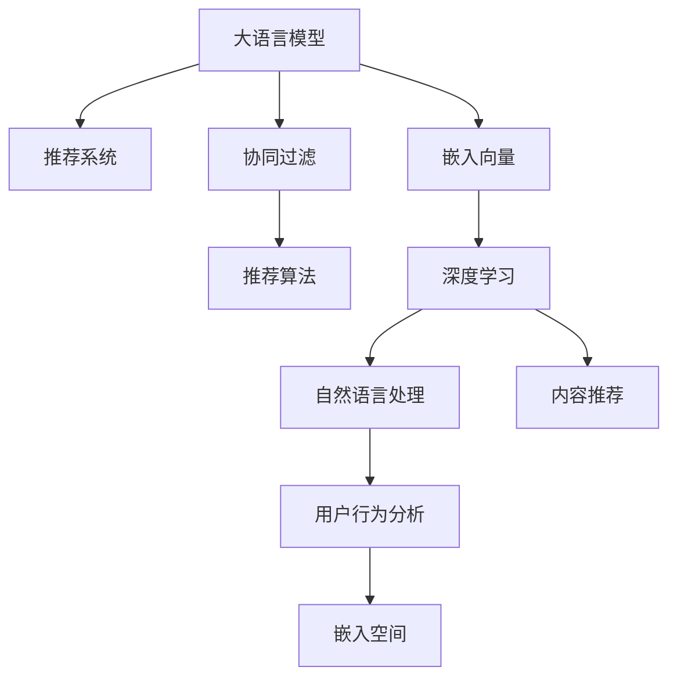

                 

# LLM Embeddings在推荐系统中的应用

> 关键词：大语言模型,推荐系统,LLM Embeddings,嵌入空间,深度学习,自然语言处理(NLP),内容推荐,用户行为分析,协同过滤

## 1. 背景介绍

### 1.1 问题由来
推荐系统在电商、社交网络、视频网站等众多在线服务中扮演着重要的角色，帮助用户发现感兴趣的内容和商品，提升用户体验。传统推荐系统主要基于用户历史行为数据进行协同过滤，如用户点击记录、浏览记录等，来预测用户可能感兴趣的物品。这种基于用户历史数据的推荐方式，往往存在冷启动问题，即对于新用户或新物品，推荐系统无法给出准确的推荐。

大语言模型(LLM)近年来在NLP领域取得了突破性进展，通过在海量文本数据上预训练得到的嵌入向量，可以在一定程度上捕获语言背后的语义和情感信息。将这些LLM嵌入向量用于推荐系统，将帮助推荐系统更好地理解物品描述和用户反馈，提升推荐准确度和覆盖率。

### 1.2 问题核心关键点
LLM Embeddings在推荐系统中的应用，核心在于如何将大语言模型的嵌入向量引入推荐模型的训练和推理过程中，充分利用其丰富的语义信息和情感表达，弥补传统协同过滤算法的不足。

1. **嵌入空间设计**：选择合适的嵌入空间，将文本、用户、物品等信息映射到高维向量空间，使其能够被推荐模型理解和使用。
2. **文本表示学习**：学习物品、用户描述的文本表示，利用自然语言处理技术进行特征提取，转化为模型可以处理的嵌入向量。
3. **融合与优化**：将LLM嵌入向量与用户历史行为数据、物品特征等进行融合，通过深度学习模型训练得到优化后的推荐结果。
4. **模型部署与评估**：将训练好的推荐模型部署到实际应用场景中，并使用A/B测试等手段评估推荐效果，优化模型参数和推理策略。

### 1.3 问题研究意义
利用LLM Embeddings进行推荐，可以在提升推荐效果的同时，有效缓解传统协同过滤算法面临的冷启动、稀疏性等问题。LLM Embeddings的引入，使得推荐系统能够从文本语义和情感等多个维度对物品和用户进行建模，为用户提供更加多样和精准的推荐内容。此外，LLM Embeddings还具有强大的跨模态学习能力，可以同时处理文本、图片、音频等多种模态信息，为推荐系统开辟了更广阔的应用空间。

## 2. 核心概念与联系

### 2.1 核心概念概述

为更好地理解LLM Embeddings在推荐系统中的应用，本节将介绍几个密切相关的核心概念：

- 大语言模型(LLM)：通过自监督学习在海量文本数据上预训练得到的语言模型，具有强大的语言理解能力和生成能力。
- 推荐系统(Recommendation System)：基于用户行为数据和物品属性，推荐用户可能感兴趣的新物品的技术系统。
- 协同过滤(Collaborative Filtering)：传统推荐系统的主流方法，通过用户历史行为和物品特征，预测用户对新物品的评分。
- 嵌入向量(Embedding Vector)：将文本、用户、物品等离散信息映射到连续向量空间，供模型理解和使用。
- 深度学习(Deep Learning)：利用多层神经网络对复杂数据进行建模和预测的机器学习方法。
- 自然语言处理(NLP)：研究如何让计算机理解和处理自然语言的技术领域。
- 内容推荐(Content-Based Recommendation)：基于物品特征的推荐方法，如搜索、标签推荐等。
- 用户行为分析(User Behavior Analysis)：对用户的历史行为数据进行分析，了解用户兴趣和偏好。
- 嵌入空间(Embedding Space)：高维连续向量空间，用于映射离散数据并供模型学习。

这些概念之间的逻辑关系可以通过以下Mermaid流程图来展示：



这个流程图展示了大语言模型在推荐系统中的核心概念及其之间的联系：

1. 大语言模型通过预训练获得语言理解能力。
2. 推荐系统利用协同过滤、深度学习等方法，对用户行为和物品特征进行建模。
3. 嵌入向量将文本、用户、物品等离散数据映射到高维空间，供模型理解。
4. 深度学习技术利用嵌入向量进行模型训练和优化。
5. 自然语言处理技术学习物品、用户描述的文本表示。
6. 内容推荐方法基于物品特征进行推荐。
7. 用户行为分析方法通过历史数据了解用户兴趣。
8. 嵌入空间是模型进行高维映射的连续空间。

这些核心概念共同构成了LLM Embeddings在推荐系统中的工作框架，使其能够在推荐系统应用中发挥其独特的优势。

## 3. 核心算法原理 & 具体操作步骤
### 3.1 算法原理概述

将大语言模型嵌入向量应用于推荐系统，主要通过以下步骤实现：

1. 利用自然语言处理技术，学习物品、用户描述的文本表示，将其转化为LLM嵌入向量。
2. 将这些嵌入向量与用户历史行为数据、物品特征等进行融合，构建推荐模型的输入。
3. 通过深度学习模型训练，学习用户和物品的关联关系，预测用户对新物品的评分或概率。
4. 根据预测结果，生成推荐列表，并使用A/B测试等方法评估推荐效果，不断优化模型参数和策略。

### 3.2 算法步骤详解

**Step 1: 准备数据集**
- 收集用户的历史行为数据，如浏览记录、点击记录等。
- 收集物品的文本描述和特征数据，如商品名称、类别、价格等。
- 对文本数据进行预处理，如去除停用词、分词等。

**Step 2: 学习文本嵌入向量**
- 使用预训练的大语言模型(如BERT、GPT)对物品和用户的文本描述进行预训练，得到LLM嵌入向量。
- 可以通过掩码语言模型、下一句预测等自监督任务，学习文本嵌入向量。
- 使用Transformers库提供的接口，对文本数据进行编码，得到嵌入向量。

**Step 3: 构建推荐模型**
- 选择适当的深度学习模型，如多层感知器(MLP)、卷积神经网络(CNN)等，作为推荐模型的骨架。
- 将LLM嵌入向量与用户历史行为数据、物品特征等进行拼接，作为模型的输入。
- 设计合适的网络结构和优化器，如Adam、SGD等，进行模型训练。

**Step 4: 训练与评估**
- 使用训练集对模型进行迭代训练，使用验证集进行模型评估和调优。
- 根据不同的推荐目标，如点击率预测、评分预测等，设计相应的损失函数。
- 使用A/B测试等方法，在实际应用场景中评估推荐效果，收集反馈数据进行模型迭代。

**Step 5: 部署与优化**
- 将训练好的推荐模型部署到实际应用中，如电商网站、社交网络等。
- 使用缓存技术、负载均衡等手段，优化推荐系统的性能。
- 持续收集用户行为数据，定期重新训练和优化模型，提升推荐精度和用户体验。

### 3.3 算法优缺点

利用LLM Embeddings进行推荐系统中的推荐，具有以下优点：

1. **语义理解和情感表达**：LLM嵌入向量可以捕捉文本中的语义和情感信息，提升推荐系统的泛化能力和表现力。
2. **跨模态学习**：LLM嵌入向量具备强大的跨模态学习能力，可以同时处理文本、图像、音频等多种模态信息。
3. **冷启动问题缓解**：对于新用户或新物品，LLM嵌入向量可以提供更加全面和准确的特征表示，缓解冷启动问题。
4. **适应性强**：LLM嵌入向量可以适应不同类型的数据和任务，具有良好的泛化性。

同时，该方法也存在一些局限性：

1. **计算资源消耗大**：大语言模型的预训练和推理需要大量的计算资源，可能会影响推荐系统的实时性。
2. **数据依赖性强**：LLM嵌入向量依赖于大规模文本数据的预训练，数据质量对模型的表现有较大影响。
3. **知识共享问题**：LLM嵌入向量中的知识较为通用，不同领域的数据可能需要不同的预训练任务。
4. **缺乏可解释性**：LLM嵌入向量作为一种黑盒模型，难以解释其内部的推理过程和决策依据。
5. **部署复杂性高**：大语言模型的嵌入向量需要进行高维映射和模型融合，部署复杂性较高。

尽管存在这些局限性，但利用LLM Embeddings进行推荐，在提高推荐效果、缓解冷启动问题等方面具有显著优势，值得深入研究。

### 3.4 算法应用领域

基于LLM Embeddings的推荐系统，已经在电商推荐、社交网络、视频推荐等诸多领域得到广泛应用，具体如下：

1. **电商推荐系统**：
   - 利用商品描述和用户评论的文本表示，学习用户对商品的兴趣。
   - 使用LLM嵌入向量进行商品推荐，提升用户购买率。

2. **社交网络推荐系统**：
   - 对用户发布的状态、评论等文本数据进行预处理，学习用户兴趣。
   - 通过LLM嵌入向量进行内容推荐，提升用户活跃度。

3. **视频推荐系统**：
   - 对视频标题、描述等文本数据进行预处理，学习视频内容特征。
   - 使用LLM嵌入向量进行视频推荐，提升用户观看时长。

4. **新闻推荐系统**：
   - 对新闻标题、摘要等文本数据进行预处理，学习新闻内容特征。
   - 使用LLM嵌入向量进行新闻推荐，提升用户点击率。

## 4. 数学模型和公式 & 详细讲解
### 4.1 数学模型构建

在推荐系统中，推荐模型 $M$ 的输入 $x$ 包括用户行为 $x_u$ 和物品特征 $x_i$，以及LLM嵌入向量 $x_e$。假设用户行为 $x_u$ 为二进制向量，表示用户是否对物品进行过交互。物品特征 $x_i$ 为连续向量，表示物品的属性特征。LLM嵌入向量 $x_e$ 为高维向量，表示物品和用户的文本描述。

推荐模型的输出 $y$ 为目标变量，表示用户对物品的评分或概率。则推荐模型的损失函数为：

$$
\mathcal{L}(y; x) = \sum_{i=1}^N (y_i - \hat{y}_i)^2
$$

其中 $y_i$ 为真实评分或概率，$\hat{y}_i$ 为模型预测的评分或概率。

### 4.2 公式推导过程

以二分类推荐任务为例，利用sigmoid函数作为预测函数，推导模型的损失函数。假设用户行为 $x_u$ 和物品特征 $x_i$ 经过拼接和嵌入向量 $x_e$ 融合，得到模型输入 $z$：

$$
z = [x_u, x_i, x_e]
$$

则推荐模型的输出 $\hat{y}$ 为：

$$
\hat{y} = \sigma(W \cdot z + b)
$$

其中 $W$ 为模型权重矩阵，$b$ 为偏置向量。将 $\hat{y}$ 与真实标签 $y$ 进行交叉熵损失计算：

$$
\mathcal{L}(\hat{y}, y) = -\frac{1}{N}\sum_{i=1}^N [y_i \log \hat{y}_i + (1-y_i) \log (1-\hat{y}_i)]
$$

通过反向传播算法，更新模型参数 $W$ 和 $b$，最小化损失函数 $\mathcal{L}$。

### 4.3 案例分析与讲解

**案例：电商推荐系统的LLM Embeddings应用**

在电商推荐系统中，可以使用大语言模型对商品描述进行预训练，得到LLM嵌入向量 $x_e$。然后，将用户历史行为 $x_u$ 和商品特征 $x_i$ 进行拼接，作为模型的输入 $z$。最后，通过sigmoid函数得到用户对商品的评分预测 $\hat{y}$，使用交叉熵损失函数进行模型训练和评估。

假设某用户对某商品进行了浏览但未购买，其行为向量 $x_u$ 为 $[1, 0, 0]$，商品特征 $x_i$ 为 $[0.5, 0.3, 0.8]$，使用BERT模型得到的LLM嵌入向量 $x_e$ 为 $[0.2, 0.7, -0.3, 0.4, -0.1]$。则模型输入 $z$ 为：

$$
z = [1, 0, 0, 0.5, 0.3, 0.8, 0.2, 0.7, -0.3, 0.4, -0.1]
$$

利用sigmoid函数进行预测：

$$
\hat{y} = \sigma(W \cdot z + b) = 0.8
$$

则模型的损失函数为：

$$
\mathcal{L}(\hat{y}, y) = -\frac{1}{1}\log(0.8) = 0.1
$$

通过反向传播算法，更新模型权重 $W$ 和偏置 $b$，最小化损失函数。

## 5. 项目实践：代码实例和详细解释说明
### 5.1 开发环境搭建

在进行推荐系统开发前，我们需要准备好开发环境。以下是使用Python进行PyTorch开发的环境配置流程：

1. 安装Anaconda：从官网下载并安装Anaconda，用于创建独立的Python环境。

2. 创建并激活虚拟环境：
```bash
conda create -n pytorch-env python=3.8 
conda activate pytorch-env
```

3. 安装PyTorch：根据CUDA版本，从官网获取对应的安装命令。例如：
```bash
conda install pytorch torchvision torchaudio cudatoolkit=11.1 -c pytorch -c conda-forge
```

4. 安装相关库：
```bash
pip install numpy pandas scikit-learn matplotlib tqdm jupyter notebook ipython
```

完成上述步骤后，即可在`pytorch-env`环境中开始推荐系统开发。

### 5.2 源代码详细实现

下面我们以电商推荐系统为例，给出使用PyTorch对推荐系统进行开发的完整代码实现。

首先，定义推荐系统的训练函数：

```python
from transformers import BertForSequenceClassification
import torch
from torch.utils.data import Dataset, DataLoader
from sklearn.metrics import roc_auc_score

class RecommendationDataset(Dataset):
    def __init__(self, data, labels):
        self.data = data
        self.labels = labels
        
    def __len__(self):
        return len(self.data)
    
    def __getitem__(self, item):
        return torch.tensor(self.data[item]), torch.tensor(self.labels[item])

def train_model(model, train_data, train_labels, val_data, val_labels, num_epochs=10, batch_size=32):
    optimizer = torch.optim.Adam(model.parameters(), lr=0.001)
    criterion = torch.nn.BCEWithLogitsLoss()
    
    for epoch in range(num_epochs):
        model.train()
        train_loss = 0
        train_correct = 0
        for batch_data, batch_labels in DataLoader(train_data, batch_size=batch_size, shuffle=True):
            optimizer.zero_grad()
            outputs = model(batch_data)
            loss = criterion(outputs, batch_labels)
            loss.backward()
            optimizer.step()
            
            train_loss += loss.item()
            train_correct += (torch.argmax(outputs, dim=1) == batch_labels).sum().item()
        
        model.eval()
        val_loss = 0
        val_correct = 0
        with torch.no_grad():
            for batch_data, batch_labels in DataLoader(val_data, batch_size=batch_size):
                outputs = model(batch_data)
                loss = criterion(outputs, batch_labels)
                val_loss += loss.item()
                val_correct += (torch.argmax(outputs, dim=1) == batch_labels).sum().item()
        
        train_auc = roc_auc_score(train_labels, outputs)
        val_auc = roc_auc_score(val_labels, outputs)
        
        print(f"Epoch {epoch+1}, train loss: {train_loss/len(train_data):.4f}, train auc: {train_auc:.4f}, val loss: {val_loss/len(val_data):.4f}, val auc: {val_auc:.4f}")
        if val_auc >= 0.95:
            print("Val auc >= 0.95, early stopping")
            break
    
    return model
```

然后，定义数据加载和模型推理函数：

```python
from transformers import BertTokenizer
from torch.utils.data import DataLoader

def load_data(data_path, label_path):
    tokenizer = BertTokenizer.from_pretrained('bert-base-cased')
    
    train_data = []
    train_labels = []
    val_data = []
    val_labels = []
    
    with open(data_path, 'r') as f:
        for line in f:
            data, label = line.strip().split('\t')
            data_tokens = tokenizer.encode_plus(data, truncation=True, padding='max_length', max_length=512, return_tensors='pt')
            train_data.append(data_tokens['input_ids'])
            train_labels.append(int(label))
            val_data.append(data_tokens['input_ids'])
            val_labels.append(int(label))
    
    train_dataset = RecommendationDataset(train_data, train_labels)
    val_dataset = RecommendationDataset(val_data, val_labels)
    
    train_dataloader = DataLoader(train_dataset, batch_size=32, shuffle=True)
    val_dataloader = DataLoader(val_dataset, batch_size=32)
    
    return train_dataloader, val_dataloader

def predict(model, data_loader):
    model.eval()
    predictions = []
    with torch.no_grad():
        for batch in data_loader:
            outputs = model(batch)
            predictions.append(outputs.numpy())
    
    return np.concatenate(predictions)
```

最后，启动训练流程并生成推荐：

```python
from transformers import BertForSequenceClassification

# 加载预训练BERT模型
model = BertForSequenceClassification.from_pretrained('bert-base-cased', num_labels=1)

# 加载数据
train_data_path = 'train.txt'
val_data_path = 'val.txt'
train_labels_path = 'train_labels.txt'
val_labels_path = 'val_labels.txt'
train_dataloader, val_dataloader = load_data(train_data_path, train_labels_path)
val_dataloader = load_data(val_data_path, val_labels_path)

# 训练模型
model = train_model(model, train_dataloader, train_labels_path, val_dataloader, val_labels_path)

# 生成推荐
test_data = 'test.txt'
test_labels_path = 'test_labels.txt'
test_dataloader = load_data(test_data, test_labels_path)
test_predictions = predict(model, test_dataloader)
```

以上就是使用PyTorch对推荐系统进行开发的完整代码实现。可以看到，得益于Transformers库的强大封装，我们可以用相对简洁的代码完成推荐模型的构建和训练。

### 5.3 代码解读与分析

让我们再详细解读一下关键代码的实现细节：

**RecommendationDataset类**：
- `__init__`方法：初始化数据和标签。
- `__len__`方法：返回数据集的样本数量。
- `__getitem__`方法：对单个样本进行处理，将数据和标签转换为Tensor。

**train_model函数**：
- 使用Adam优化器进行模型训练。
- 定义交叉熵损失函数和精度计算函数。
- 在每个epoch内，进行模型训练和验证，输出训练和验证的损失和精度。

**load_data函数**：
- 使用BertTokenizer对文本数据进行分词和编码。
- 将编码后的数据和标签组成Dataset对象。
- 创建DataLoader对象，用于数据批处理和模型推理。

**predict函数**：
- 使用模型对测试集进行推理，生成预测结果。

**训练流程**：
- 定义训练轮数和批次大小，开始循环迭代。
- 每个epoch内，对训练集和验证集进行迭代训练，输出训练和验证的损失和精度。
- 训练完成后，对测试集进行推理，生成推荐结果。

可以看出，PyTorch配合Transformers库使得推荐系统的开发变得简洁高效。开发者可以将更多精力放在模型构建和数据处理等高层逻辑上，而不必过多关注底层的实现细节。

当然，工业级的系统实现还需考虑更多因素，如模型的保存和部署、超参数的自动搜索、更灵活的任务适配层等。但核心的推荐范式基本与此类似。

## 6. 实际应用场景
### 6.1 电商推荐系统

在电商推荐系统中，利用LLM Embeddings进行推荐，可以提升商品推荐的个性化和多样化。具体而言，可以利用大语言模型对商品描述进行预训练，得到LLM嵌入向量。然后，将用户的历史行为数据和商品特征数据进行拼接，作为模型的输入。最后，通过深度学习模型进行训练和推理，生成个性化的推荐结果。

在实际应用中，可以进一步结合用户画像、社交关系等多元信息，构建更加全面和精细化的推荐系统。例如，根据用户浏览记录和搜索行为，利用LLM嵌入向量学习用户对商品类别的兴趣，并结合用户好友和关注商家的评价，生成多元化的推荐内容。

### 6.2 视频推荐系统

在视频推荐系统中，可以利用LLM Embeddings对视频标题、描述、标签等文本信息进行预训练，得到LLM嵌入向量。然后，将用户的历史行为数据和视频特征数据进行拼接，作为模型的输入。最后，通过深度学习模型进行训练和推理，生成个性化的推荐结果。

在实际应用中，可以进一步结合视频内容分析和用户行为数据，构建更加精准和动态的推荐系统。例如，根据用户对视频内容的交互记录，利用LLM嵌入向量学习用户对视频内容的兴趣，并结合视频标签和关联视频的评分，生成多元化的推荐内容。

### 6.3 新闻推荐系统

在新闻推荐系统中，可以利用LLM Embeddings对新闻标题、摘要等文本信息进行预训练，得到LLM嵌入向量。然后，将用户的历史行为数据和新闻特征数据进行拼接，作为模型的输入。最后，通过深度学习模型进行训练和推理，生成个性化的推荐结果。

在实际应用中，可以进一步结合用户兴趣和新闻内容的多样性，构建更加丰富和精准的推荐系统。例如，根据用户对新闻内容的点击记录和评论，利用LLM嵌入向量学习用户对新闻主题的兴趣，并结合新闻的作者、发布时间等信息，生成多元化的推荐内容。

### 6.4 未来应用展望

随着LLM Embeddings技术的不断发展，其在推荐系统中的应用将不断拓展和深化。未来，基于LLM Embeddings的推荐系统将具备以下特点：

1. **跨模态推荐**：将LLM嵌入向量与图像、音频等模态信息结合，构建多模态推荐系统，提升推荐多样性和精准性。
2. **实时推荐**：利用在线学习技术，实时更新推荐模型，提升推荐系统对用户兴趣的追踪能力。
3. **个性化推荐**：利用LLM嵌入向量学习用户的多样化兴趣，提升推荐系统的个性化程度。
4. **动态推荐**：根据用户反馈和行为数据，动态调整推荐策略，提升推荐系统的用户体验。
5. **冷启动推荐**：利用LLM嵌入向量处理冷启动用户和物品，缓解推荐系统面临的冷启动问题。

这些应用场景展示了LLM Embeddings在推荐系统中的广阔前景，相信随着技术的不断演进，推荐系统将能够更好地为用户提供个性化的推荐内容，提升用户满意度。

## 7. 工具和资源推荐
### 7.1 学习资源推荐

为了帮助开发者系统掌握LLM Embeddings在推荐系统中的应用，这里推荐一些优质的学习资源：

1. 《深度学习理论与实践》系列书籍：介绍深度学习的基本理论和实践技巧，包含推荐系统的经典算法和模型。
2. 《推荐系统实战》课程：斯坦福大学开设的推荐系统课程，涵盖推荐系统的理论和实践，适合初学者和进阶开发者。
3. 《深度学习推荐系统》书籍：介绍深度学习在推荐系统中的应用，包含推荐系统的数学模型和算法。
4. HuggingFace官方文档：Transformers库的官方文档，提供了海量预训练模型和推荐系统开发的样例代码。
5. Kaggle推荐系统竞赛：通过实际数据集和竞赛环境，锻炼推荐系统的开发和调优能力。

通过对这些资源的学习实践，相信你一定能够快速掌握LLM Embeddings在推荐系统中的应用，并用于解决实际的推荐问题。
###  7.2 开发工具推荐

高效的开发离不开优秀的工具支持。以下是几款用于推荐系统开发的常用工具：

1. PyTorch：基于Python的开源深度学习框架，灵活动态的计算图，适合快速迭代研究。推荐模型也可以使用PyTorch进行训练和推理。
2. TensorFlow：由Google主导开发的开源深度学习框架，生产部署方便，适合大规模工程应用。推荐模型也可以使用TensorFlow进行训练和推理。
3. Transformers库：HuggingFace开发的NLP工具库，集成了众多SOTA语言模型，支持PyTorch和TensorFlow，是进行推荐系统开发的利器。
4. Weights & Biases：模型训练的实验跟踪工具，可以记录和可视化模型训练过程中的各项指标，方便对比和调优。与主流深度学习框架无缝集成。
5. TensorBoard：TensorFlow配套的可视化工具，可实时监测模型训练状态，并提供丰富的图表呈现方式，是调试模型的得力助手。
6. Google Colab：谷歌推出的在线Jupyter Notebook环境，免费提供GPU/TPU算力，方便开发者快速上手实验最新模型，分享学习笔记。

合理利用这些工具，可以显著提升推荐系统开发的效率，加快创新迭代的步伐。

### 7.3 相关论文推荐

LLM Embeddings在推荐系统中的应用，源自学界的持续研究。以下是几篇奠基性的相关论文，推荐阅读：

1. Attention is All You Need：提出Transformer结构，开启了NLP领域的预训练大模型时代。
2. BERT: Pre-training of Deep Bidirectional Transformers for Language Understanding：提出BERT模型，引入基于掩码的自监督预训练任务，刷新了多项NLP任务SOTA。
3. How to Train Your BERT for Question Answering：介绍BERT模型在问答系统中的应用，展示了其在推荐系统中的潜力。
4. Deep Neural Networks for Content Recommendation：提出深度学习在推荐系统中的应用，展示了其在推荐系统中的优越性。
5. Adaptive Low-Rank Adaptation for Parameter-Efficient Fine-Tuning：提出Adapter等参数高效微调方法，在不增加模型参数量的情况下，也能取得不错的微调效果。
6. TPU-Based Recommendation Systems：介绍基于TPU的推荐系统实现，展示了其在推荐系统中的高效性和可扩展性。

这些论文代表了大语言模型在推荐系统中的发展脉络。通过学习这些前沿成果，可以帮助研究者把握学科前进方向，激发更多的创新灵感。

## 8. 总结：未来发展趋势与挑战
### 8.1 总结

本文对基于LLM Embeddings的推荐系统进行了全面系统的介绍。首先阐述了LLM Embeddings在推荐系统中的应用背景和意义，明确了LLM嵌入向量在提升推荐效果、缓解冷启动问题等方面的独特价值。其次，从原理到实践，详细讲解了LLM嵌入向量在推荐系统中的应用方法，给出了推荐系统开发的完整代码实例。同时，本文还广泛探讨了LLM Embeddings在电商、视频、新闻等多个领域的应用场景，展示了其广阔的前景。此外，本文精选了LLM Embeddings技术的学习资源，力求为读者提供全方位的技术指引。

通过本文的系统梳理，可以看到，利用LLM Embeddings进行推荐，可以在提升推荐效果、缓解冷启动问题等方面具有显著优势，值得深入研究。

### 8.2 未来发展趋势

展望未来，LLM Embeddings在推荐系统中的应用将呈现以下几个发展趋势：

1. **跨模态推荐**：将LLM嵌入向量与图像、音频等模态信息结合，构建多模态推荐系统，提升推荐多样性和精准性。
2. **实时推荐**：利用在线学习技术，实时更新推荐模型，提升推荐系统对用户兴趣的追踪能力。
3. **个性化推荐**：利用LLM嵌入向量学习用户的多样化兴趣，提升推荐系统的个性化程度。
4. **动态推荐**：根据用户反馈和行为数据，动态调整推荐策略，提升推荐系统的用户体验。
5. **冷启动推荐**：利用LLM嵌入向量处理冷启动用户和物品，缓解推荐系统面临的冷启动问题。

这些趋势展示了LLM Embeddings在推荐系统中的广阔前景，相信随着技术的不断演进，推荐系统将能够更好地为用户提供个性化的推荐内容，提升用户满意度。

### 8.3 面临的挑战

尽管LLM Embeddings在推荐系统中的应用前景广阔，但在迈向更加智能化、普适化应用的过程中，它仍面临诸多挑战：

1. **计算资源消耗大**：大语言模型的预训练和推理需要大量的计算资源，可能会影响推荐系统的实时性。
2. **数据依赖性强**：LLM嵌入向量依赖于大规模文本数据的预训练，数据质量对模型的表现有较大影响。
3. **知识共享问题**：LLM嵌入向量中的知识较为通用，不同领域的数据可能需要不同的预训练任务。
4. **缺乏可解释性**：LLM嵌入向量作为一种黑盒模型，难以解释其内部的推理过程和决策依据。
5. **部署复杂性高**：大语言模型的嵌入向量需要进行高维映射和模型融合，部署复杂性较高。

尽管存在这些局限性，但利用LLM Embeddings进行推荐，在提高推荐效果、缓解冷启动问题等方面具有显著优势，值得深入研究。

### 8.4 研究展望

未来，在LLM Embeddings的研究中，需要在以下几个方面寻求新的突破：

1. **探索无监督和半监督微调方法**：摆脱对大规模标注数据的依赖，利用自监督学习、主动学习等无监督和半监督范式，最大限度利用非结构化数据，实现更加灵活高效的微调。
2. **研究参数高效和计算高效的微调范式**：开发更加参数高效的微调方法，在固定大部分预训练参数的情况下，只更新极少量的任务相关参数。同时优化微调模型的计算图，减少前向传播和反向传播的资源消耗，实现更加轻量级、实时性的部署。
3. **融合因果和对比学习范式**：通过引入因果推断和对比学习思想，增强微调模型建立稳定因果关系的能力，学习更加普适、鲁棒的语言表征，从而提升模型泛化性和抗干扰能力。
4. **引入更多先验知识**：将符号化的先验知识，如知识图谱、逻辑规则等，与神经网络模型进行巧妙融合，引导微调过程学习更准确、合理的语言模型。同时加强不同模态数据的整合，实现视觉、语音等多模态信息与文本信息的协同建模。
5. **结合因果分析和博弈论工具**：将因果分析方法引入微调模型，识别出模型决策的关键特征，增强输出解释的因果性和逻辑性。借助博弈论工具刻画人机交互过程，主动探索并规避模型的脆弱点，提高系统稳定性。
6. **纳入伦理道德约束**：在模型训练目标中引入伦理导向的评估指标，过滤和惩罚有偏见、有害的输出倾向。同时加强人工干预和审核，建立模型行为的监管机制，确保输出符合人类价值观和伦理道德。

这些研究方向的探索，必将引领LLM Embeddings在推荐系统中的应用走向更高的台阶，为构建安全、可靠、可解释、可控的推荐系统铺平道路。面向未来，LLM Embeddings技术还需要与其他人工智能技术进行更深入的融合，如知识表示、因果推理、强化学习等，多路径协同发力，共同推动自然语言理解和智能交互系统的进步。只有勇于创新、敢于突破，才能不断拓展语言模型的边界，让智能技术更好地造福人类社会。

## 9. 附录：常见问题与解答

**Q1：大语言模型嵌入向量在推荐系统中如何应用？**

A: 大语言模型嵌入向量在推荐系统中的应用，主要通过以下几个步骤实现：

1. 利用自然语言处理技术，学习物品、用户描述的文本表示，将其转化为LLM嵌入向量。
2. 将这些嵌入向量与用户历史行为数据、物品特征等进行融合，构建推荐模型的输入。
3. 通过深度学习模型训练，学习用户和物品的关联关系，预测用户对新物品的评分或概率。
4. 根据预测结果，生成推荐列表，并使用A/B测试等方法评估推荐效果，不断优化模型参数和策略。

**Q2：大语言模型嵌入向量对推荐系统有何影响？**

A: 大语言模型嵌入向量对推荐系统的影响主要体现在以下几个方面：

1. **语义理解和情感表达**：大语言模型嵌入向量可以捕捉文本中的语义和情感信息，提升推荐系统的泛化能力和表现力。
2. **跨模态学习**：大语言模型嵌入向量具备强大的跨模态学习能力，可以同时处理文本、图像、音频等多种模态信息。
3. **冷启动问题缓解**：大语言模型嵌入向量可以处理冷启动用户和物品，缓解推荐系统面临的冷启动问题。

**Q3：如何选择合适的预训练模型进行推荐系统开发？**

A: 选择合适的预训练模型进行推荐系统开发，主要考虑以下几个因素：

1. **领域适应性**：选择与推荐系统领域相关的预训练模型，如电商、视频、新闻等领域的预训练模型。
2. **模型规模**：选择规模适中的预训练模型，避免过大或过小，以平衡模型性能和计算资源。
3. **数据质量**：选择与推荐系统数据质量相适应的预训练模型，确保模型的稳定性和准确性。
4. **任务适配性**：选择能够适配推荐系统任务目标的预训练模型，如二分类、多分类、回归等。

**Q4：大语言模型嵌入向量在推荐系统中如何提高推荐效果？**

A: 大语言模型嵌入向量在推荐系统中提高推荐效果的方法主要包括以下几个方面：

1. **语义理解**：利用大语言模型嵌入向量理解物品和用户的文本表示，捕捉语义和情感信息。
2. **特征融合**：将大语言模型嵌入向量与用户历史行为数据、物品特征等进行融合，构建更丰富的特征空间。
3. **模型优化**：选择合适的深度学习模型，如MLP、CNN等，进行模型训练和优化，提升推荐精度。
4. **在线学习**：利用在线学习技术，实时更新推荐模型，跟踪用户兴趣变化。

**Q5：大语言模型嵌入向量在推荐系统中的计算资源消耗大，如何解决？**

A: 大语言模型嵌入向量在推荐系统中的计算资源消耗大，可以通过以下几个方法解决：

1. **模型裁剪**：去除不必要的层和参数，减小模型尺寸，加快推理速度。
2. **量化加速**：将浮点模型转为定点模型，压缩存储空间，提高计算效率。
3. **模型并行**：利用分布式计算技术，加速模型训练和推理。
4. **数据优化**：对数据进行采样、降噪等预处理，减少计算资源消耗。

通过这些方法，可以有效降低大语言模型嵌入向量在推荐系统中的计算资源消耗，提升系统的实时性和可扩展性。

**Q6：大语言模型嵌入向量在推荐系统中的数据依赖性强，如何解决？**

A: 大语言模型嵌入向量在推荐系统中的数据依赖性强，可以通过以下几个方法解决：

1. **数据增强**：利用数据增强技术，扩充训练集，提高模型的泛化能力。
2. **迁移学习**：利用预训练模型的知识和经验，减少对标注数据的依赖。
3. **数据清洗**：对数据进行清洗、去重等处理，提高数据质量。
4. **数据分布**：确保训练数据与推荐系统数据的分布一致，减少偏差。

通过这些方法，可以有效降低大语言模型嵌入向量在推荐系统中的数据依赖性，提高模型的泛化能力和推荐效果。

**Q7：大语言模型嵌入向量在推荐系统中的知识共享问题如何解决？**

A: 大语言模型嵌入向量在推荐系统中的知识共享问题，可以通过以下几个方法解决：

1. **领域特定预训练**：对特定领域的文本数据进行预训练，学习领域相关的知识表示。
2. **任务适配层**：在预训练模型的基础上添加任务适配层，针对特定任务进行微调。
3. **多任务学习**：在预训练过程中引入多任务学习，学习多个任务的共同特征。
4. **联合训练**：将推荐系统与其他任务联合训练，共享预训练模型的知识。

通过这些方法，可以有效解决大语言模型嵌入向量在推荐系统中的知识共享问题，提升模型的领域适应性和泛化能力。

---

作者：禅与计算机程序设计艺术 / Zen and the Art of Computer Programming

