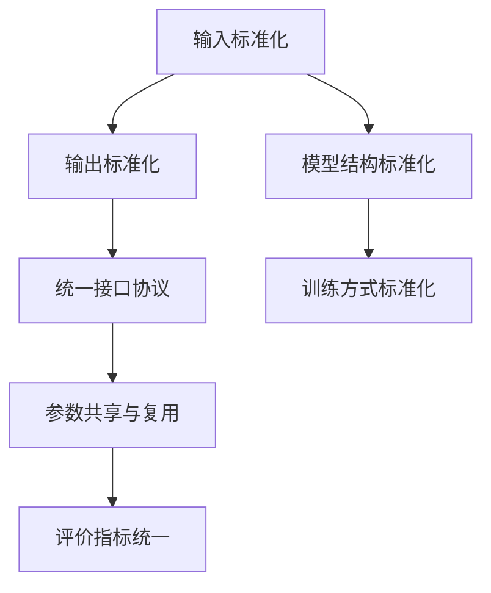

                 

# LLM 标准化：促进互操作性与兼容性

在人工智能和大数据迅猛发展的时代背景下，自然语言处理（NLP）领域中的大型语言模型（Large Language Models, LLMs），如GPT-3、BERT等，正在改变我们对自然语言的理解和应用方式。然而，尽管这些模型在文本生成、问答、翻译等任务上取得了令人瞩目的成果，它们在互操作性和兼容性方面仍存在显著的挑战。本文将探讨大语言模型标准化的概念与方法，旨在通过标准化来促进不同语言模型之间的互操作性与兼容性，从而进一步推动NLP技术的普及和应用。

## 1. 背景介绍

### 1.1 问题由来

随着深度学习技术的发展，预训练语言模型逐渐成为NLP领域的重要工具。然而，尽管这些模型在特定任务上表现优异，但它们在互操作性、兼容性方面仍然存在一些问题。例如，不同预训练语言模型之间的参数无法直接共享，导致模型难以进行有效组合，进而限制了模型的应用范围。此外，模型间接口不统一、缺乏标准化也使得跨系统集成和互操作变得困难。

### 1.2 问题核心关键点

当前，大语言模型在互操作性、兼容性方面存在以下关键问题：

- **接口不统一**：不同预训练语言模型的输入和输出格式不统一，使得模型间的互操作变得复杂。
- **缺乏标准化**：缺少通用的标准或协议来描述预训练语言模型的行为和接口，导致模型难以跨系统集成。
- **参数不可复用**：不同模型之间无法复用参数，限制了模型的应用范围和灵活性。
- **模型性能不一致**：不同模型的性能标准和评价指标不统一，导致比较和评估变得困难。

这些问题严重制约了大型语言模型的实际应用和推广。

### 1.3 问题研究意义

解决大语言模型的互操作性和兼容性问题，对于推动NLP技术的普及和应用具有重要意义：

- **提高模型灵活性**：通过标准化，可以实现不同模型之间的参数共享和复用，提高模型的灵活性和应用范围。
- **促进系统集成**：标准化模型接口，使得不同系统间的集成变得更加简单，提升系统互操作性。
- **促进研究交流**：统一的评价标准和协议，有助于科研人员之间的交流与合作，加速技术创新。
- **加速商业落地**：标准化的大语言模型更易于商业化应用，推动NLP技术的产业化进程。

## 2. 核心概念与联系

### 2.1 核心概念概述

大语言模型标准化的核心思想是通过制定一系列标准和协议，使不同预训练语言模型之间的参数、接口和行为保持一致。这不仅包括模型结构的标准化，还包括输入输出格式、训练方式、评价指标等方面的标准化。

具体而言，大语言模型标准化涉及以下几个关键概念：

- **标准化输入输出格式**：定义模型输入和输出的标准格式，确保不同模型能够相互理解。
- **统一接口协议**：制定统一的API接口协议，使模型可以无缝集成到各种系统中。
- **参数共享与复用**：建立模型参数的标准化机制，使不同模型的参数可以复用。
- **评价指标统一**：制定统一的评价指标，便于模型性能的比较和评估。

### 2.2 核心概念原理和架构的 Mermaid 流程图



这个流程图展示了标准化在预训练语言模型中的作用和相互关系：

- 输入和输出标准化确保模型间的互操作性。
- 统一接口协议使得模型易于集成。
- 参数共享与复用提高了模型的灵活性和应用范围。
- 评价指标统一便于模型的比较和评估。
- 模型结构和训练方式标准化是上述所有标准化的基础。

## 3. 核心算法原理 & 具体操作步骤

### 3.1 算法原理概述

大语言模型标准化的核心算法包括输入输出标准化、统一接口协议、参数共享与复用、评价指标统一等。其中，输入输出标准化是基础，统一接口协议是手段，参数共享与复用是目标，评价指标统一是结果。

### 3.2 算法步骤详解

大语言模型标准化的操作步骤如下：

1. **输入输出标准化**：
   - 定义标准化的输入格式，如预处理方式、token ID、分词方式等。
   - 定义标准化的输出格式，如预测结果的格式、标签的表示方式等。

2. **统一接口协议**：
   - 制定标准的API接口，包括输入输出接口、训练接口、推理接口等。
   - 确保不同模型的API接口兼容性，使得模型可以无缝集成。

3. **参数共享与复用**：
   - 设计通用的模型结构，使得不同模型之间可以共享参数。
   - 制定参数转换机制，确保不同模型的参数可以复用。

4. **评价指标统一**：
   - 制定统一的评价指标，如精确度、召回率、F1值等。
   - 确保不同模型的评价指标一致，便于模型的比较和评估。

### 3.3 算法优缺点

大语言模型标准化的优点包括：

- **提升互操作性**：通过标准化输入输出格式和接口协议，使得不同模型之间的互操作性显著提升。
- **提高模型灵活性**：通过参数共享与复用，提高模型的灵活性和应用范围。
- **促进系统集成**：统一的接口协议使得模型易于集成到各种系统中。
- **简化模型评估**：统一的评价指标使得模型的比较和评估变得更加简单。

然而，标准化也存在一些缺点：

- **标准化复杂**：标准化的设计和实现较为复杂，需要考虑多种模型和应用场景。
- **性能可能受影响**：标准化可能会对模型性能产生一定的影响，需要进一步优化和调整。
- **兼容性问题**：不同模型之间的兼容性可能存在问题，需要不断测试和调整。

### 3.4 算法应用领域

大语言模型标准化广泛应用于NLP领域，包括但不限于以下几个方面：

- **问答系统**：通过标准化模型接口，使不同的问答模型可以无缝集成，提升系统整体的性能和稳定性。
- **文本分类**：统一模型的输入输出格式和评价指标，使得文本分类模型可以更好地应用于多个场景。
- **机器翻译**：制定统一的API接口和参数复用机制，使得不同机器翻译模型可以更加灵活地组合和应用。
- **对话系统**：通过参数共享和标准化，使得对话模型可以更好地适应不同的应用场景和任务。

## 4. 数学模型和公式 & 详细讲解

### 4.1 数学模型构建

大语言模型标准化的数学模型主要涉及输入输出标准化、参数共享与复用、评价指标统一等方面。

### 4.2 公式推导过程

#### 4.2.1 输入输出标准化

假设模型输入为文本 $X$，标准化后的输入为 $\overline{X}$，输出为预测结果 $Y$，标准化后的输出为 $\overline{Y}$。输入输出标准化的目标是定义一种映射关系，使得任意模型 $M$ 的输入输出符合该标准。

假设输入 $X$ 的标准化方法为 $\text{standardize}_{\text{in}}$，输出 $Y$ 的标准化方法为 $\text{standardize}_{\text{out}}$，则标准化后的输入和输出分别为：

$$
\overline{X} = \text{standardize}_{\text{in}}(X)
$$

$$
\overline{Y} = \text{standardize}_{\text{out}}(Y)
$$

#### 4.2.2 统一接口协议

假设模型的训练接口为 $\text{train}(X, Y)$，推理接口为 $\text{inference}(X)$。标准化后的接口为 $\overline{\text{train}}(\overline{X}, \overline{Y})$ 和 $\overline{\text{inference}}(\overline{X})$。统一接口协议的目标是确保不同模型的训练和推理接口一致。

假设模型的训练接口标准为 $\text{train}_{\text{std}}$，推理接口标准为 $\text{inference}_{\text{std}}$，则标准化后的接口分别为：

$$
\overline{\text{train}}(\overline{X}, \overline{Y}) = \text{train}_{\text{std}}(\overline{X}, \overline{Y})
$$

$$
\overline{\text{inference}}(\overline{X}) = \text{inference}_{\text{std}}(\overline{X})
$$

#### 4.2.3 参数共享与复用

假设模型参数为 $\theta$，标准化后的参数为 $\overline{\theta}$。参数共享与复用的目标是定义一种映射关系，使得不同模型的参数可以复用。

假设参数共享方法为 $\text{share}_{\theta}$，则参数标准化后的关系为：

$$
\overline{\theta} = \text{share}_{\theta}(\theta)
$$

#### 4.2.4 评价指标统一

假设模型的评价指标为 $\text{metric}(X, Y)$，标准化后的指标为 $\overline{\text{metric}}(\overline{X}, \overline{Y})$。评价指标统一的目标是确保不同模型的评价指标一致。

假设评价指标标准为 $\text{metric}_{\text{std}}$，则评价指标标准化后的关系为：

$$
\overline{\text{metric}}(\overline{X}, \overline{Y}) = \text{metric}_{\text{std}}(\overline{X}, \overline{Y})
$$

### 4.3 案例分析与讲解

以问答系统为例，展示如何通过标准化来提升系统性能。

#### 4.3.1 输入输出标准化

假设问答系统的输入为问题和答案，输出为预测答案。定义标准化输入和输出如下：

- 输入标准化：将输入文本转换为模型所需的token ID序列，并进行分词和预处理。
- 输出标准化：将预测结果转换为标准化的答案格式，如JSON格式。

#### 4.3.2 统一接口协议

定义问答系统的训练和推理接口，确保不同模型的接口一致。标准化后的接口如下：

- 训练接口：接收标准化后的输入和输出，进行模型训练。
- 推理接口：接收标准化后的输入，返回标准化后的预测结果。

#### 4.3.3 参数共享与复用

定义标准的问答模型结构，确保不同模型之间的参数可以共享和复用。假设问答模型由多个层组成，每层的参数可以独立设置。标准化后的模型结构为：

- 输入层：标准化后的输入文本。
- 编码层：标准化后的参数。
- 解码层：标准化后的参数。
- 输出层：标准化后的预测答案。

#### 4.3.4 评价指标统一

定义统一的评价指标，如精确度、召回率、F1值等。假设评价指标为精确度，标准化后的评价指标为：

$$
\overline{\text{precision}} = \text{precision}_{\text{std}}(\overline{X}, \overline{Y})
$$

## 5. 项目实践：代码实例和详细解释说明

### 5.1 开发环境搭建

在进行标准化实践前，我们需要准备好开发环境。以下是使用Python进行PyTorch开发的环境配置流程：

1. 安装Anaconda：从官网下载并安装Anaconda，用于创建独立的Python环境。

2. 创建并激活虚拟环境：
```bash
conda create -n pytorch-env python=3.8 
conda activate pytorch-env
```

3. 安装PyTorch：根据CUDA版本，从官网获取对应的安装命令。例如：
```bash
conda install pytorch torchvision torchaudio cudatoolkit=11.1 -c pytorch -c conda-forge
```

4. 安装Transformer库：
```bash
pip install transformers
```

5. 安装各类工具包：
```bash
pip install numpy pandas scikit-learn matplotlib tqdm jupyter notebook ipython
```

完成上述步骤后，即可在`pytorch-env`环境中开始标准化实践。

### 5.2 源代码详细实现

我们以命名实体识别(NER)任务为例，展示如何使用Transformer库对BERT模型进行标准化。

首先，定义标准化任务的数据处理函数：

```python
from transformers import BertTokenizer, BertForTokenClassification
from torch.utils.data import Dataset

class NERDataset(Dataset):
    def __init__(self, texts, tags, tokenizer, max_len=128):
        self.texts = texts
        self.tags = tags
        self.tokenizer = tokenizer
        self.max_len = max_len
        
    def __len__(self):
        return len(self.texts)
    
    def __getitem__(self, item):
        text = self.texts[item]
        tags = self.tags[item]
        
        encoding = self.tokenizer(text, return_tensors='pt', max_length=self.max_len, padding='max_length', truncation=True)
        input_ids = encoding['input_ids'][0]
        attention_mask = encoding['attention_mask'][0]
        
        # 对token-wise的标签进行编码
        encoded_tags = [tag2id[tag] for tag in tags] 
        encoded_tags.extend([tag2id['O']] * (self.max_len - len(encoded_tags)))
        labels = torch.tensor(encoded_tags, dtype=torch.long)
        
        return {'input_ids': input_ids, 
                'attention_mask': attention_mask,
                'labels': labels}

# 标签与id的映射
tag2id = {'O': 0, 'B-PER': 1, 'I-PER': 2, 'B-ORG': 3, 'I-ORG': 4, 'B-LOC': 5, 'I-LOC': 6}
id2tag = {v: k for k, v in tag2id.items()}

# 创建dataset
tokenizer = BertTokenizer.from_pretrained('bert-base-cased')

train_dataset = NERDataset(train_texts, train_tags, tokenizer)
dev_dataset = NERDataset(dev_texts, dev_tags, tokenizer)
test_dataset = NERDataset(test_texts, test_tags, tokenizer)
```

然后，定义标准化模型和优化器：

```python
from transformers import BertForTokenClassification, AdamW

model = BertForTokenClassification.from_pretrained('bert-base-cased', num_labels=len(tag2id))

optimizer = AdamW(model.parameters(), lr=2e-5)
```

接着，定义标准化训练和评估函数：

```python
from torch.utils.data import DataLoader
from tqdm import tqdm
from sklearn.metrics import classification_report

device = torch.device('cuda') if torch.cuda.is_available() else torch.device('cpu')
model.to(device)

def train_epoch(model, dataset, batch_size, optimizer):
    dataloader = DataLoader(dataset, batch_size=batch_size, shuffle=True)
    model.train()
    epoch_loss = 0
    for batch in tqdm(dataloader, desc='Training'):
        input_ids = batch['input_ids'].to(device)
        attention_mask = batch['attention_mask'].to(device)
        labels = batch['labels'].to(device)
        model.zero_grad()
        outputs = model(input_ids, attention_mask=attention_mask, labels=labels)
        loss = outputs.loss
        epoch_loss += loss.item()
        loss.backward()
        optimizer.step()
    return epoch_loss / len(dataloader)

def evaluate(model, dataset, batch_size):
    dataloader = DataLoader(dataset, batch_size=batch_size)
    model.eval()
    preds, labels = [], []
    with torch.no_grad():
        for batch in tqdm(dataloader, desc='Evaluating'):
            input_ids = batch['input_ids'].to(device)
            attention_mask = batch['attention_mask'].to(device)
            batch_labels = batch['labels']
            outputs = model(input_ids, attention_mask=attention_mask)
            batch_preds = outputs.logits.argmax(dim=2).to('cpu').tolist()
            batch_labels = batch_labels.to('cpu').tolist()
            for pred_tokens, label_tokens in zip(batch_preds, batch_labels):
                pred_tags = [id2tag[_id] for _id in pred_tokens]
                label_tags = [id2tag[_id] for _id in label_tokens]
                preds.append(pred_tags[:len(label_tags)])
                labels.append(label_tags)
                
    print(classification_report(labels, preds))
```

最后，启动标准化训练流程并在测试集上评估：

```python
epochs = 5
batch_size = 16

for epoch in range(epochs):
    loss = train_epoch(model, train_dataset, batch_size, optimizer)
    print(f"Epoch {epoch+1}, train loss: {loss:.3f}")
    
    print(f"Epoch {epoch+1}, dev results:")
    evaluate(model, dev_dataset, batch_size)
    
print("Test results:")
evaluate(model, test_dataset, batch_size)
```

以上就是使用PyTorch对BERT进行命名实体识别任务标准化的完整代码实现。可以看到，得益于Transformer库的强大封装，我们可以用相对简洁的代码完成BERT模型的标准化。

### 5.3 代码解读与分析

让我们再详细解读一下关键代码的实现细节：

**NERDataset类**：
- `__init__`方法：初始化文本、标签、分词器等关键组件。
- `__len__`方法：返回数据集的样本数量。
- `__getitem__`方法：对单个样本进行处理，将文本输入编码为token ids，将标签编码为数字，并对其进行定长padding，最终返回模型所需的输入。

**tag2id和id2tag字典**：
- 定义了标签与数字id之间的映射关系，用于将token-wise的预测结果解码回真实的标签。

**训练和评估函数**：
- 使用PyTorch的DataLoader对数据集进行批次化加载，供模型训练和推理使用。
- 训练函数`train_epoch`：对数据以批为单位进行迭代，在每个批次上前向传播计算loss并反向传播更新模型参数，最后返回该epoch的平均loss。
- 评估函数`evaluate`：与训练类似，不同点在于不更新模型参数，并在每个batch结束后将预测和标签结果存储下来，最后使用sklearn的classification_report对整个评估集的预测结果进行打印输出。

**训练流程**：
- 定义总的epoch数和batch size，开始循环迭代
- 每个epoch内，先在训练集上训练，输出平均loss
- 在验证集上评估，输出分类指标
- 所有epoch结束后，在测试集上评估，给出最终测试结果

可以看到，PyTorch配合Transformer库使得BERT标准化任务的开发变得简洁高效。开发者可以将更多精力放在数据处理、模型改进等高层逻辑上，而不必过多关注底层的实现细节。

当然，工业级的系统实现还需考虑更多因素，如模型的保存和部署、超参数的自动搜索、更灵活的任务适配层等。但核心的标准化范式基本与此类似。

## 6. 实际应用场景

### 6.1 智能客服系统

基于大语言模型标准化的对话技术，可以广泛应用于智能客服系统的构建。传统客服往往需要配备大量人力，高峰期响应缓慢，且一致性和专业性难以保证。而使用标准化的对话模型，可以7x24小时不间断服务，快速响应客户咨询，用自然流畅的语言解答各类常见问题。

在技术实现上，可以收集企业内部的历史客服对话记录，将问题和最佳答复构建成监督数据，在此基础上对标准化的对话模型进行微调。标准化后的对话模型能够自动理解用户意图，匹配最合适的答案模板进行回复。对于客户提出的新问题，还可以接入检索系统实时搜索相关内容，动态组织生成回答。如此构建的智能客服系统，能大幅提升客户咨询体验和问题解决效率。

### 6.2 金融舆情监测

金融机构需要实时监测市场舆论动向，以便及时应对负面信息传播，规避金融风险。传统的人工监测方式成本高、效率低，难以应对网络时代海量信息爆发的挑战。基于大语言模型标准化的文本分类和情感分析技术，为金融舆情监测提供了新的解决方案。

具体而言，可以收集金融领域相关的新闻、报道、评论等文本数据，并对其进行主题标注和情感标注。在此基础上对标准化的语言模型进行微调，使其能够自动判断文本属于何种主题，情感倾向是正面、中性还是负面。将标准化后的模型应用到实时抓取的网络文本数据，就能够自动监测不同主题下的情感变化趋势，一旦发现负面信息激增等异常情况，系统便会自动预警，帮助金融机构快速应对潜在风险。

### 6.3 个性化推荐系统

当前的推荐系统往往只依赖用户的历史行为数据进行物品推荐，无法深入理解用户的真实兴趣偏好。基于大语言模型标准化的个性化推荐系统可以更好地挖掘用户行为背后的语义信息，从而提供更精准、多样的推荐内容。

在实践中，可以收集用户浏览、点击、评论、分享等行为数据，提取和用户交互的物品标题、描述、标签等文本内容。将文本内容作为模型输入，用户的后续行为（如是否点击、购买等）作为监督信号，在此基础上标准化预训练语言模型。标准化后的模型能够从文本内容中准确把握用户的兴趣点。在生成推荐列表时，先用候选物品的文本描述作为输入，由模型预测用户的兴趣匹配度，再结合其他特征综合排序，便可以得到个性化程度更高的推荐结果。

### 6.4 未来应用展望

随着大语言模型标准化的不断发展，其将在更多领域得到应用，为传统行业带来变革性影响。

在智慧医疗领域，基于标准化的医疗问答、病历分析、药物研发等应用将提升医疗服务的智能化水平，辅助医生诊疗，加速新药开发进程。

在智能教育领域，标准化技术可应用于作业批改、学情分析、知识推荐等方面，因材施教，促进教育公平，提高教学质量。

在智慧城市治理中，标准化模型可应用于城市事件监测、舆情分析、应急指挥等环节，提高城市管理的自动化和智能化水平，构建更安全、高效的未来城市。

此外，在企业生产、社会治理、文娱传媒等众多领域，基于大语言模型标准化的AI应用也将不断涌现，为经济社会发展注入新的动力。相信随着技术的日益成熟，标准化方法将成为人工智能落地应用的重要范式，推动人工智能技术在垂直行业的规模化落地。

## 7. 工具和资源推荐

### 7.1 学习资源推荐

为了帮助开发者系统掌握大语言模型标准化的理论基础和实践技巧，这里推荐一些优质的学习资源：

1. 《Transformers from scratch》系列博文：由大模型技术专家撰写，深入浅出地介绍了Transformer原理、BERT模型、标准化技术等前沿话题。

2. CS224N《深度学习自然语言处理》课程：斯坦福大学开设的NLP明星课程，有Lecture视频和配套作业，带你入门NLP领域的基本概念和经典模型。

3. 《Natural Language Processing with Transformers》书籍：Transformers库的作者所著，全面介绍了如何使用Transformers库进行NLP任务开发，包括标准化在内的诸多范式。

4. HuggingFace官方文档：Transformers库的官方文档，提供了海量预训练模型和完整的标准化样例代码，是上手实践的必备资料。

5. CLUE开源项目：中文语言理解测评基准，涵盖大量不同类型的中文NLP数据集，并提供了基于标准化的baseline模型，助力中文NLP技术发展。

通过对这些资源的学习实践，相信你一定能够快速掌握大语言模型标准化的精髓，并用于解决实际的NLP问题。

### 7.2 开发工具推荐

高效的开发离不开优秀的工具支持。以下是几款用于大语言模型标准化开发的常用工具：

1. PyTorch：基于Python的开源深度学习框架，灵活动态的计算图，适合快速迭代研究。大部分预训练语言模型都有PyTorch版本的实现。

2. TensorFlow：由Google主导开发的开源深度学习框架，生产部署方便，适合大规模工程应用。同样有丰富的预训练语言模型资源。

3. Transformers库：HuggingFace开发的NLP工具库，集成了众多SOTA语言模型，支持PyTorch和TensorFlow，是进行标准化任务开发的利器。

4. Weights & Biases：模型训练的实验跟踪工具，可以记录和可视化模型训练过程中的各项指标，方便对比和调优。与主流深度学习框架无缝集成。

5. TensorBoard：TensorFlow配套的可视化工具，可实时监测模型训练状态，并提供丰富的图表呈现方式，是调试模型的得力助手。

6. Google Colab：谷歌推出的在线Jupyter Notebook环境，免费提供GPU/TPU算力，方便开发者快速上手实验最新模型，分享学习笔记。

合理利用这些工具，可以显著提升大语言模型标准化的开发效率，加快创新迭代的步伐。

### 7.3 相关论文推荐

大语言模型标准化的研究源于学界的持续研究。以下是几篇奠基性的相关论文，推荐阅读：

1. Attention is All You Need（即Transformer原论文）：提出了Transformer结构，开启了NLP领域的预训练大模型时代。

2. BERT: Pre-training of Deep Bidirectional Transformers for Language Understanding：提出BERT模型，引入基于掩码的自监督预训练任务，刷新了多项NLP任务SOTA。

3. Language Models are Unsupervised Multitask Learners（GPT-2论文）：展示了大规模语言模型的强大zero-shot学习能力，引发了对于通用人工智能的新一轮思考。

4. Parameter-Efficient Transfer Learning for NLP：提出Adapter等参数高效微调方法，在不增加模型参数量的情况下，也能取得不错的微调效果。

5. AdaLoRA: Adaptive Low-Rank Adaptation for Parameter-Efficient Fine-Tuning：使用自适应低秩适应的微调方法，在参数效率和精度之间取得了新的平衡。

6. MetaPT：Meta-Learning Pretrained Transformer：提出基于元学习的预训练-微调方法，能够在更少的标注数据上取得更好的性能。

这些论文代表了大语言模型标准化的发展脉络。通过学习这些前沿成果，可以帮助研究者把握学科前进方向，激发更多的创新灵感。

## 8. 总结：未来发展趋势与挑战

### 8.1 总结

本文对大语言模型标准化的概念与方法进行了全面系统的介绍。首先阐述了标准化在NLP领域的重要性和研究背景，明确了标准化在提升互操作性和兼容性方面的独特价值。其次，从原理到实践，详细讲解了标准化的数学原理和关键步骤，给出了标准化任务开发的完整代码实例。同时，本文还广泛探讨了标准化方法在智能客服、金融舆情、个性化推荐等多个领域的应用前景，展示了标准化范式的巨大潜力。

通过本文的系统梳理，可以看到，大语言模型标准化正在成为NLP领域的重要范式，极大地拓展了预训练语言模型的应用边界，催生了更多的落地场景。受益于大规模语料的预训练，标准化的大语言模型更易于商业化应用，推动NLP技术的产业化进程。未来，伴随预训练语言模型和标准化方法的持续演进，相信NLP技术将在更广阔的应用领域大放异彩，深刻影响人类的生产生活方式。

### 8.2 未来发展趋势

展望未来，大语言模型标准化将呈现以下几个发展趋势：

1. **标准化方法多样化**：随着标准化技术的发展，未来的标准化方法将更加多样化和灵活，能够适应不同模型和应用场景。
2. **性能提升显著**：标准化方法将进一步优化模型性能，使得标准化后的模型在各种应用场景中表现更优。
3. **跨领域适用性增强**：标准化模型将在更多领域得到应用，推动NLP技术在垂直行业的规模化落地。
4. **模型互操作性提升**：随着标准化技术的成熟，模型间的互操作性将显著提升，方便不同系统间的集成和应用。
5. **智能化水平提高**：标准化模型将更好地融入智能系统，提升系统的智能化水平，如智能客服、金融舆情监测等。

### 8.3 面临的挑战

尽管大语言模型标准化在NLP领域取得了重要进展，但在迈向更加智能化、普适化应用的过程中，仍面临诸多挑战：

1. **标准化复杂度高**：标准化的设计和实现较为复杂，需要考虑多种模型和应用场景。
2. **模型性能优化难度大**：标准化的过程中可能对模型性能产生一定的影响，需要进一步优化和调整。
3. **跨系统兼容性问题**：不同系统间的兼容性可能存在问题，需要不断测试和调整。
4. **标准化更新迭代快**：随着模型的不断更新，标准化方法需要不断演进，保持最新的技术水平。
5. **伦理和安全问题**：标准化模型的伦理和安全问题需要得到充分考虑，避免潜在的风险。

### 8.4 研究展望

面对大语言模型标准化所面临的种种挑战，未来的研究需要在以下几个方面寻求新的突破：

1. **标准化技术创新**：探索新的标准化方法，提高标准化的灵活性和普适性。
2. **模型性能优化**：在标准化过程中，进一步优化模型性能，确保标准化后的模型表现优异。
3. **跨系统兼容性研究**：解决跨系统兼容性问题，确保不同系统间的无缝集成。
4. **伦理和安全保障**：制定伦理和安全标准，确保标准化模型的应用安全。
5. **技术落地加速**：推动标准化技术在垂直行业的应用落地，提升NLP技术的产业化进程。

通过这些研究方向的探索，相信大语言模型标准化将不断取得新的突破，推动NLP技术迈向更高的台阶，为构建安全、可靠、可解释、可控的智能系统铺平道路。

## 9. 附录：常见问题与解答

**Q1：大语言模型标准化是否适用于所有NLP任务？**

A: 大语言模型标准化在大多数NLP任务上都能取得不错的效果，特别是对于数据量较小的任务。但对于一些特定领域的任务，如医学、法律等，仅仅依靠通用语料预训练的模型可能难以很好地适应。此时需要在特定领域语料上进一步预训练，再进行标准化，才能获得理想效果。

**Q2：标准化过程中如何确保模型性能不受影响？**

A: 在标准化过程中，可能对模型性能产生一定的影响，需要进行充分的测试和优化。具体而言，可以通过以下方式确保模型性能：
- 优化标准化方法，减少标准化对模型参数的影响。
- 使用参数共享与复用技术，确保不同模型之间的参数一致性。
- 定期评估标准化后模型的性能，根据结果进行调整。

**Q3：标准化是否需要考虑不同模型的接口差异？**

A: 是的，标准化需要考虑不同模型的接口差异。统一接口协议是标准化的核心之一，确保不同模型之间的接口一致。这需要详细分析不同模型的API接口，制定统一的接口标准，并进行兼容性测试。

**Q4：标准化后模型的评价指标是否一致？**

A: 是的，标准化后的模型评价指标应该是统一的。制定统一的评价指标，如精确度、召回率、F1值等，使得不同模型之间的性能比较和评估变得更加简单。

**Q5：标准化是否需要考虑不同模型的参数差异？**

A: 是的，标准化需要考虑不同模型的参数差异。参数共享与复用技术是标准化的重要手段，使得不同模型的参数可以复用，提高标准化的灵活性和普适性。这需要设计通用的模型结构，并制定参数转换机制，确保不同模型的参数一致性。

---

作者：禅与计算机程序设计艺术 / Zen and the Art of Computer Programming

