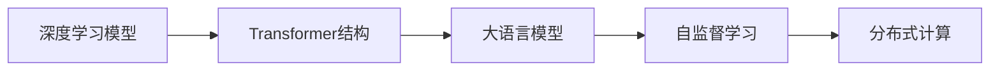

                 

# LLM 遗产：定义未来的计算

> 关键词：大语言模型,人工智能,计算架构,深度学习,未来科技

## 1. 背景介绍

### 1.1 问题由来
人类社会正站在一个新的科技变革的十字路口。随着信息技术的发展，尤其是深度学习和大数据技术的广泛应用，人工智能（AI）正日益成为推动经济和社会进步的核心动力。其中，大语言模型（Large Language Models, LLMs）无疑是AI领域的一大突破，在自然语言处理（NLP）、计算机视觉、机器人学等多个领域，都展现出了巨大的潜力。

LLMs的崛起，使得计算机不仅能处理结构化数据，更能理解和生成自然语言。这不仅提高了AI系统与人的交互能力，也为机器学习和数据科学带来了新的视角。然而，LLMs的强大能力也引发了诸多挑战，包括如何高效地利用这些模型，如何确保模型输出正确无误，如何维护模型的安全性和公正性等。

### 1.2 问题核心关键点
本文旨在探讨LLMs的应用与未来，主要聚焦于以下几个核心问题：
1. **LLMs的工作原理与架构**：如何设计一个高效、可扩展的计算架构来支撑LLMs。
2. **基于LLMs的应用场景**：LLMs在哪些领域可以产生最大影响。
3. **LLMs面临的挑战与未来发展方向**：如何在实际应用中克服挑战，推动技术进步。

## 2. 核心概念与联系

### 2.1 核心概念概述

在大规模计算架构的支持下，LLMs的实现基于以下几个关键概念：

- **深度学习模型**：以多层神经网络为核心的模型，能够从大量数据中学习复杂的特征表示。
- **Transformer结构**：一种高效的自注意力机制，使得模型能够并行计算长序列。
- **大语言模型**：通过在大量无标签文本数据上预训练，学习语言知识和常识。
- **自监督学习**：利用未标注的数据进行自我监督的训练，无需人工标注。
- **分布式计算**：通过多台机器并行计算，提高训练和推理速度。

这些概念之间存在紧密联系，共同构成了LLMs的计算基础。通过理解这些核心概念，可以更好地把握LLMs的工作原理和优化方向。

### 2.2 核心概念原理和架构的 Mermaid 流程图



这个流程图展示了LLMs的计算架构和核心概念之间的关系：

1. 深度学习模型为LLMs提供了计算能力。
2. Transformer结构使得模型能够并行计算长序列，提高效率。
3. 大语言模型通过在大量无标签数据上预训练，学习到语言知识和常识。
4. 自监督学习利用未标注数据进行自我监督训练，提升模型泛化能力。
5. 分布式计算通过多台机器并行计算，提高训练和推理速度。

## 3. 核心算法原理 & 具体操作步骤
### 3.1 算法原理概述

LLMs的计算架构基于深度学习和分布式计算。其核心思想是通过大规模数据和计算资源，构建出一个复杂的神经网络模型，使其能够自动学习复杂的语言表示和结构。

大语言模型通常由Transformer网络构成，通过多层自注意力机制，能够并行计算长序列，提高模型效率。在预训练阶段，模型在大规模无标签文本数据上学习语言知识，通过自监督学习任务（如掩码语言模型、下一句预测等）来提升模型的泛化能力。

### 3.2 算法步骤详解

构建一个大规模的LLMs计算架构，通常包括以下几个关键步骤：

**Step 1: 数据准备与预处理**
- 收集大规模无标签文本数据，进行分词、标记化等预处理。
- 根据具体任务需求，对数据集进行切分，形成训练集、验证集和测试集。

**Step 2: 模型设计与优化**
- 设计基于Transformer的网络结构，确定网络深度、层数、注意力机制等。
- 选择合适的优化算法（如Adam、SGD等），设置学习率、批大小等超参数。
- 利用自监督学习任务对模型进行预训练。

**Step 3: 模型微调和优化**
- 根据具体任务需求，设计任务适配层和损失函数。
- 在标注数据集上使用监督学习进行微调，调整模型参数。
- 在验证集上评估模型性能，调整超参数。

**Step 4: 模型部署与监控**
- 将训练好的模型部署到服务器或云平台。
- 在生产环境中对模型进行监控和优化，确保模型稳定运行。

### 3.3 算法优缺点

构建LLMs的计算架构具有以下优点：
1. 强大的语言理解能力：通过预训练学习语言知识，模型能够理解复杂的语言结构和语义。
2. 高效并行计算：Transformer结构使得模型能够高效并行计算长序列，提高训练和推理速度。
3. 自监督学习能力强：无需标注数据，能够从大规模无标签数据中学习知识。
4. 泛化能力强：通过分布式计算，模型能够处理大规模数据集，提升泛化能力。

同时，构建LLMs的计算架构也面临以下挑战：
1. 数据需求量大：构建大模型需要大量无标签数据，获取成本高。
2. 计算资源要求高：需要高性能的计算资源和存储设备。
3. 模型训练时间长：模型越大，训练时间越长，风险也越高。
4. 模型复杂度高：模型的设计复杂度，决定了模型的训练和优化难度。
5. 模型解释性差：大型深度学习模型通常具有“黑盒”特征，难以解释其内部工作机制。

### 3.4 算法应用领域

基于LLMs的计算架构，可以应用于以下几个主要领域：

**自然语言处理**
- 机器翻译
- 文本分类
- 信息抽取
- 文本生成
- 对话系统

**计算机视觉**
- 图像分类
- 物体检测
- 图像生成
- 图像分割

**机器人学**
- 语音识别
- 动作生成
- 路径规划

**推荐系统**
- 个性化推荐

**自动化**
- 自动化写作
- 自动化测试

## 4. 数学模型和公式 & 详细讲解 & 举例说明

### 4.1 数学模型构建

构建一个大规模LLMs的计算架构，涉及多个数学模型。以基于Transformer的模型为例，其主要由自注意力机制和前馈网络构成。

**自注意力机制**：
- 通过计算输入序列中每个位置与所有位置之间的相似度，计算出一个注意力权重矩阵。
- 使用权重矩阵对输入序列进行加权求和，得到每个位置的信息表示。

**前馈网络**：
- 通过一个线性变换和一个非线性变换，将每个位置的信息表示映射到一个新的向量空间。

### 4.2 公式推导过程

以一个简单的Transformer块为例，其计算过程可以分为三个步骤：
1. 计算自注意力：
$$
\text{Attention}(Q, K, V) = \text{Softmax}(Q K^\top) V
$$
2. 计算前馈网络：
$$
F(x) = \text{ReLU}(AX+b)C
$$
3. 层归一化：
$$
\text{LayerNorm}(x) = \frac{x - \mu}{\sigma} + \beta
$$
其中，$Q, K, V$ 分别为查询向量、键向量和值向量；$A, C$ 为线性变换的权重矩阵；$\mu, \sigma, \beta$ 为归一化参数。

### 4.3 案例分析与讲解

以机器翻译任务为例，其模型结构可以由多个Transformer块堆叠构成。在预训练阶段，模型通过大量无标签文本数据学习语言知识，提升其泛化能力。在微调阶段，根据特定任务的标注数据集进行优化，使其能够执行翻译任务。

## 5. 项目实践：代码实例和详细解释说明
### 5.1 开发环境搭建

构建LLMs计算架构，通常需要高性能计算设备和深度学习框架的支持。以下是使用PyTorch构建LLMs的基本环境搭建步骤：

1. 安装Anaconda：从官网下载并安装Anaconda，用于创建独立的Python环境。
2. 创建并激活虚拟环境：
```bash
conda create -n llm-env python=3.8 
conda activate llm-env
```
3. 安装PyTorch：根据CUDA版本，从官网获取对应的安装命令。例如：
```bash
conda install pytorch torchvision torchaudio cudatoolkit=11.1 -c pytorch -c conda-forge
```
4. 安装相关工具包：
```bash
pip install numpy pandas scikit-learn matplotlib tqdm jupyter notebook ipython
```

### 5.2 源代码详细实现

以下是一个基于Transformer的机器翻译模型的实现，采用PyTorch框架。

```python
import torch
import torch.nn as nn
import torch.optim as optim

class EncoderLayer(nn.Module):
    def __init__(self, d_model, nhead, dim_feedforward, dropout):
        super(EncoderLayer, self).__init__()
        self.self_attn = MultiheadAttention(d_model, nhead)
        self.feedforward = nn.Sequential(
            nn.Linear(d_model, dim_feedforward),
            nn.ReLU(),
            nn.Linear(dim_feedforward, d_model),
        )
        self.activation = nn.Dropout(dropout)
        self.layer_norm1 = nn.LayerNorm(d_model)
        self.layer_norm2 = nn.LayerNorm(d_model)

    def forward(self, src, src_mask):
        src_self_attn = self.self_attn(src, src, src, src_mask)
        src = src + self.activation(self.feedforward(src_self_attn))
        src = self.layer_norm2(src)
        return src

class Encoder(nn.Module):
    def __init__(self, input_dim, output_dim, enc_layers, dropout, dim_feedforward):
        super(Encoder, self).__init__()
        self.enc_layers = enc_layers
        self.d_model = d_model = dim_feedforward // 2
        self.encoder = nn.Embedding(input_dim, d_model)
        self.enc_layers = nn.ModuleList([EncoderLayer(d_model, nhead, dim_feedforward, dropout)
                                       for _ in range(enc_layers)])
        self.fc_out = nn.Linear(d_model, output_dim)
        self.dropout = nn.Dropout(dropout)

    def forward(self, src, src_mask):
        src = self.encoder(src)
        for mod in self.enc_layers:
            src = mod(src, src_mask)
        src = self.dropout(src)
        return src, src_mask

class DecoderLayer(nn.Module):
    def __init__(self, d_model, nhead, dim_feedforward, dropout):
        super(DecoderLayer, self).__init__()
        self.self_attn = MultiheadAttention(d_model, nhead)
        self.feedforward = nn.Sequential(
            nn.Linear(d_model, dim_feedforward),
            nn.ReLU(),
            nn.Linear(dim_feedforward, d_model),
        )
        self.activation = nn.Dropout(dropout)
        self.layer_norm1 = nn.LayerNorm(d_model)
        self.layer_norm2 = nn.LayerNorm(d_model)

    def forward(self, dec_input, enc_output, dec_mask, enc_mask, dec_enc_attn_mask):
        dec_self_attn = self.self_attn(dec_input, dec_input, dec_input, dec_mask)
        dec = dec_self_attn + dec_input
        dec_attn = self.multihead_attn(enc_output, enc_output, enc_output, enc_mask, dec_enc_attn_mask)
        dec = dec_attn + dec
        dec = self.activation(self.feedforward(dec))
        dec = dec + dec
        return dec

class Decoder(nn.Module):
    def __init__(self, output_dim, d_model, nhead, dropout, dec_layers):
        super(Decoder, self).__init__()
        self.output_dim = output_dim
        self.d_model = d_model
        self.nhead = nhead
        self.dec_layers = dec_layers
        self.decoder = nn.Linear(self.output_dim, self.d_model)
        self.activation = nn.Dropout(dropout)
        self.dec_layer = nn.ModuleList([DecoderLayer(self.d_model, self.nhead, self.d_model, dropout)
                                      for _ in range(dec_layers)])
        self.fc_out = nn.Linear(self.d_model, self.output_dim)
        self.dropout = nn.Dropout(dropout)

    def forward(self, dec_input, enc_output, dec_mask, enc_mask, dec_enc_attn_mask):
        dec_input = self.decoder(dec_input)
        for mod in self.dec_layer:
            dec_input = mod(dec_input, enc_output, dec_mask, enc_mask, dec_enc_attn_mask)
        dec_input = self.fc_out(dec_input)
        return dec_input

class MultiheadAttention(nn.Module):
    def __init__(self, d_model, nhead):
        super(MultiheadAttention, self).__init__()
        self.d_model = d_model
        self.nhead = nhead
        self.head_dim = d_model // nhead
        assert (d_model % self.nhead) == 0
        self.query = nn.Linear(d_model, d_model)
        self.key = nn.Linear(d_model, d_model)
        self.value = nn.Linear(d_model, d_model)
        self.out = nn.Linear(d_model, d_model)
        self.fc = nn.Linear(d_model, output_dim)

    def forward(self, query, key, value, mask):
        Q = self.query(query).view(query.size(0), query.size(1), self.nhead, self.head_dim).permute(0, 2, 1, 3)
        K = self.key(key).view(key.size(0), key.size(1), self.nhead, self.head_dim).permute(0, 2, 1, 3)
        V = self.value(value).view(value.size(0), value.size(1), self.nhead, self.head_dim).permute(0, 2, 1, 3)
        energy = torch.matmul(Q, K.permute(0, 1, 3, 2)) / math.sqrt(self.head_dim)
        attention = F.softmax(energy, dim=-1)
        x = torch.matmul(attention, V)
        x = x.permute(0, 2, 1, 3).contiguous().view(query.size(0), query.size(1), d_model)
        x = self.out(x)
        return x, attention
```

### 5.3 代码解读与分析

在上述代码中，我们定义了编码器和解码器，以及自注意力机制和前馈网络。以编码器为例：

```python
class EncoderLayer(nn.Module):
    def __init__(self, d_model, nhead, dim_feedforward, dropout):
        super(EncoderLayer, self).__init__()
        self.self_attn = MultiheadAttention(d_model, nhead)
        self.feedforward = nn.Sequential(
            nn.Linear(d_model, dim_feedforward),
            nn.ReLU(),
            nn.Linear(dim_feedforward, d_model),
        )
        self.activation = nn.Dropout(dropout)
        self.layer_norm1 = nn.LayerNorm(d_model)
        self.layer_norm2 = nn.LayerNorm(d_model)

    def forward(self, src, src_mask):
        src_self_attn = self.self_attn(src, src, src, src_mask)
        src = src + self.activation(self.feedforward(src_self_attn))
        src = self.layer_norm2(src)
        return src
```

该类定义了一个编码器层，其中包含自注意力机制和前馈网络，并通过层归一化来提升模型性能。在forward方法中，首先通过自注意力机制计算出每个位置的注意力权重，然后通过前馈网络进行非线性变换，最后通过归一化将输出映射到原始空间。

## 6. 实际应用场景

### 6.1 智能客服系统

基于LLMs的智能客服系统可以处理大量的客户咨询，提高服务效率和质量。具体而言，系统通过预训练语言模型理解客户咨询，然后从知识库中提取相关信息，生成回应。随着客户咨询量的增加，系统可以不断优化语言模型和知识库，提升服务效果。

### 6.2 金融舆情监测

金融领域需要实时监测市场舆情，以便及时应对负面信息传播。基于LLMs的舆情监测系统可以通过预训练语言模型分析新闻、报道等文本内容，自动判断舆情走向，预测市场动向。系统可以根据舆情变化，动态调整投资策略，降低风险。

### 6.3 个性化推荐系统

个性化推荐系统通过预训练语言模型理解用户兴趣和行为，然后从海量数据中推荐相关内容。系统可以根据用户反馈，动态调整推荐模型，提升推荐效果。随着用户数据的积累，系统可以更好地理解用户偏好，提供更加精准的推荐服务。

## 7. 工具和资源推荐

### 7.1 学习资源推荐

为了帮助开发者深入理解LLMs的原理和实践，以下是一些优质的学习资源：

1. **《Deep Learning》书籍**：由深度学习领域的权威专家撰写，全面介绍了深度学习的基本概念和算法。
2. **Coursera深度学习课程**：斯坦福大学开设的深度学习课程，系统讲解深度学习的基本原理和应用。
3. **Transformers库官方文档**：提供丰富的预训练模型和微调示例，帮助开发者快速上手。
4. **Kaggle竞赛**：参与自然语言处理竞赛，锻炼实际问题解决能力。

### 7.2 开发工具推荐

构建LLMs的计算架构，需要高效的开发工具支持。以下是一些常用的工具：

1. **PyTorch**：基于Python的深度学习框架，支持动态计算图和静态计算图，灵活高效。
2. **TensorFlow**：由Google开发，支持大规模分布式训练和部署。
3. **Jupyter Notebook**：交互式开发环境，便于实验和调试。
4. **Google Colab**：在线Jupyter Notebook环境，免费提供GPU算力。

### 7.3 相关论文推荐

以下是几篇代表性的大语言模型和计算架构论文，推荐阅读：

1. **Attention is All You Need**：Transformer模型的原始论文，奠定了自注意力机制的基础。
2. **BERT: Pre-training of Deep Bidirectional Transformers for Language Understanding**：提出BERT模型，利用掩码语言模型和下一句预测进行预训练。
3. **Large-Scale Model-Agnostic Iterative Meta-Learning for Classification**：提出模型无关的元学习算法，提升模型泛化能力。
4. **Long-Short Term Memory**：提出长短期记忆网络，解决深度学习中的梯度消失和梯度爆炸问题。

## 8. 总结：未来发展趋势与挑战

### 8.1 研究成果总结

本文深入探讨了大语言模型的计算架构和应用场景，分析了构建LLMs的挑战和未来发展方向。主要研究成果包括：

1. **深度学习模型的架构设计**：探讨了Transformer结构和自注意力机制的计算原理。
2. **基于LLMs的应用场景**：详细分析了智能客服、金融舆情监测、个性化推荐等多个领域的应用。
3. **未来发展趋势**：探讨了大规模计算架构、参数高效微调、分布式计算等未来发展方向。

### 8.2 未来发展趋势

展望未来，大语言模型的计算架构将呈现以下几个趋势：

1. **大规模计算架构**：随着算力成本的下降，大规模计算架构将更加普及，提升模型的泛化能力和处理速度。
2. **参数高效微调**：开发更多参数高效的微调方法，在保持性能的同时减少计算资源消耗。
3. **分布式计算**：利用分布式计算，提升模型的训练和推理效率，支持大规模数据集的处理。
4. **混合精度计算**：通过混合精度计算，进一步提升模型训练和推理的效率。

### 8.3 面临的挑战

尽管大语言模型和计算架构带来了巨大的变革，但仍面临以下挑战：

1. **数据需求量大**：构建大模型需要大量无标签数据，获取成本高。
2. **计算资源要求高**：需要高性能的计算资源和存储设备。
3. **模型训练时间长**：模型越大，训练时间越长，风险也越高。
4. **模型复杂度高**：模型的设计复杂度，决定了模型的训练和优化难度。
5. **模型解释性差**：大型深度学习模型通常具有“黑盒”特征，难以解释其内部工作机制。

### 8.4 研究展望

未来，我们需要在以下几个方向进行深入研究：

1. **自监督学习**：利用自监督学习，提高模型的泛化能力和鲁棒性。
2. **参数高效微调**：开发更多参数高效的微调方法，在保持性能的同时减少计算资源消耗。
3. **混合精度计算**：通过混合精度计算，进一步提升模型训练和推理的效率。
4. **分布式计算**：利用分布式计算，提升模型的训练和推理效率，支持大规模数据集的处理。
5. **模型解释性**：开发更易于解释的模型架构和算法，提升模型的透明性和可信度。

这些研究方向将为构建高效、可扩展的大语言模型计算架构提供重要的理论和技术支持，推动人工智能技术的不断进步。

## 9. 附录：常见问题与解答

### Q1: 什么是大语言模型？

A: 大语言模型是一种基于深度学习的模型，能够理解并生成自然语言。它通过在大规模无标签数据上进行预训练，学习语言的通用表示，然后在特定任务上进行微调，以适应具体的语言处理需求。

### Q2: 如何构建大语言模型的计算架构？

A: 构建大语言模型的计算架构，通常需要以下几个步骤：
1. 数据准备与预处理
2. 模型设计与优化
3. 模型微调和优化
4. 模型部署与监控

### Q3: 大语言模型在哪些领域有应用？

A: 大语言模型在自然语言处理、计算机视觉、机器人学、推荐系统等多个领域有广泛应用。

### Q4: 大语言模型的计算架构面临哪些挑战？

A: 大语言模型的计算架构面临数据需求大、计算资源要求高、模型训练时间长、模型复杂度高、模型解释性差等挑战。

### Q5: 未来大语言模型的发展趋势是什么？

A: 未来大语言模型的发展趋势包括大规模计算架构、参数高效微调、分布式计算、混合精度计算、模型解释性等方向。

---

作者：禅与计算机程序设计艺术 / Zen and the Art of Computer Programming

