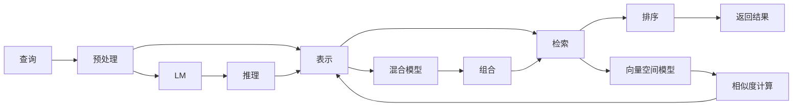

                 

# LLM与传统信息检索技术的对比与融合

## 1. 背景介绍

在当今信息爆炸的时代，用户如何在海量数据中快速找到所需信息，是一个重要的研究课题。传统的信息检索技术主要是基于关键词匹配的搜索引擎（如Google、Bing等），通过词向量模型和倒排索引等方法，将查询与文档进行匹配。然而，随着自然语言处理技术的发展，基于深度学习的语言模型（Large Language Models, LLMs）开始逐渐应用于信息检索领域，并带来了革命性的变革。

## 2. 核心概念与联系

### 2.1 核心概念概述

在对比LLM与传统信息检索技术之前，我们先要明确几个核心概念：

- **自然语言处理(NLP)**：研究计算机如何处理和理解自然语言的技术，包括文本分类、信息抽取、问答系统、机器翻译等。
- **信息检索(IR)**：通过将用户查询与文档库中的文本进行匹配，找到相关的信息。
- **大语言模型(Large Language Models, LLMs)**：通过大规模无标签数据预训练的神经网络模型，如GPT、BERT、T5等。
- **向量空间模型(Vector Space Model, VSM)**：将文本表示为高维向量，通过计算向量之间的相似度来进行检索。
- **深度学习模型(Deep Learning Model)**：基于神经网络的模型，如卷积神经网络(CNN)、循环神经网络(RNN)、Transformer等。

以上概念构成了NLP和IR领域的核心技术框架，而LLM与传统IR技术的结合，为信息检索带来了全新的思路和方法。

### 2.2 核心概念原理和架构的 Mermaid 流程图



该流程图展示了LLM与传统IR技术的融合过程：

1. 用户输入查询后，首先经过预处理，将其转换为可被模型处理的形式。
2. LLM通过预训练的模型进行推理，得到向量表示。
3. 向量表示通过两种方式得到：
   - LLM通过预训练得到向量表示。
   - 传统IR技术通过向量空间模型得到向量表示。
4. 两种向量表示经过融合，得到更加丰富的表示。
5. 融合后的向量表示通过检索和排序，最终返回结果。

## 3. 核心算法原理 & 具体操作步骤

### 3.1 算法原理概述

LLM与传统IR技术的融合主要基于两个核心思想：

1. **预训练**：通过大规模无标签数据对LLM进行预训练，使其具备强大的语言理解能力。
2. **混合表示**：将LLM生成的向量表示与传统IR技术得到的向量表示进行融合，从而得到更加全面和准确的表示。

在具体实现过程中，主要包括以下步骤：

1. 预处理：将用户查询和文档进行标准化处理，如分词、去除停用词等。
2. 向量表示：使用LML和传统IR技术分别对查询和文档进行表示。
3. 混合表示：将LML和传统IR技术得到的向量表示进行融合，形成混合表示。
4. 检索和排序：使用混合表示进行检索和排序，返回结果。

### 3.2 算法步骤详解

**Step 1: 预处理**

预处理是整个信息检索流程的第一步，包括分词、去除停用词、词干提取等操作。具体的实现可以参考Python的NLTK库或者spaCy库，这些库都提供了强大的自然语言处理工具，能够高效地处理文本数据。

**Step 2: 向量表示**

向量表示是将文本数据转换为向量形式的过程。目前常用的方法有词袋模型、TF-IDF、word2vec、GloVe、BERT等。其中，BERT模型由于其强大的语言理解能力，被广泛应用于信息检索领域。

**Step 3: 混合表示**

混合表示是将LML和传统IR技术得到的向量表示进行融合的过程。具体的实现方法有多种，如简单的拼接、加权平均、矩阵乘法等。本节将以加权平均为例进行详细讲解。

假设查询向量为 $q$，文档向量为 $d$，LML表示向量为 $q_{LM}$，传统IR表示向量为 $d_{IR}$。则混合表示 $q_{mix}$ 可以表示为：

$$q_{mix} = \alpha q_{LM} + (1-\alpha) d_{IR}$$

其中，$\alpha$ 为LML的权重，可以根据实际应用场景进行调整。通常情况下，LML的权重设置在 $0.6-0.8$ 之间。

**Step 4: 检索和排序**

检索和排序是将混合表示应用到实际检索场景的过程。常用的排序算法有TF-IDF排序、BM25排序等。此外，还可以使用深度学习模型进行排序，如使用基于Transformers的排序模型，如StructBERT、BERT-IR等。

### 3.3 算法优缺点

**优点：**

1. **强大的语言理解能力**：LML具备强大的语言理解能力，能够处理复杂的自然语言查询。
2. **灵活性**：混合表示方法可以根据实际需求进行调整，适应不同的应用场景。
3. **适应性强**：LML可以适应多领域、多语言的查询需求。

**缺点：**

1. **计算成本高**：LML的预训练和推理需要大量计算资源，增加了系统成本。
2. **模型复杂**：LML模型结构复杂，增加了系统的开发和维护难度。
3. **依赖标注数据**：LML的预训练需要大量无标签数据，获取标注数据成本较高。

### 3.4 算法应用领域

LML与传统IR技术的融合可以应用于多个领域，包括：

1. **搜索引擎**：将用户查询与文档库中的文本进行匹配，返回相关结果。
2. **问答系统**：回答用户提出的自然语言问题，返回答案。
3. **文本分类**：将文本分类为不同的主题或类别。
4. **信息抽取**：从文本中抽取出特定的信息，如人名、地名、时间等。
5. **推荐系统**：根据用户的兴趣和行为推荐相关内容。

## 4. 数学模型和公式 & 详细讲解 & 举例说明

### 4.1 数学模型构建

假设查询 $q$ 和文档 $d$ 的表示分别为 $\mathbf{q} \in \mathbb{R}^n$ 和 $\mathbf{d} \in \mathbb{R}^n$。使用LML得到的表示为 $\mathbf{q}_{LM} \in \mathbb{R}^m$，传统IR得到的表示为 $\mathbf{d}_{IR} \in \mathbb{R}^m$。混合表示可以表示为 $\mathbf{q}_{mix} \in \mathbb{R}^m$。

混合表示的计算公式为：

$$\mathbf{q}_{mix} = \alpha \mathbf{q}_{LM} + (1-\alpha) \mathbf{d}_{IR}$$

其中，$\alpha$ 为LML的权重。

### 4.2 公式推导过程

假设查询 $q$ 和文档 $d$ 的表示分别为 $\mathbf{q} \in \mathbb{R}^n$ 和 $\mathbf{d} \in \mathbb{R}^n$。使用LML得到的表示为 $\mathbf{q}_{LM} \in \mathbb{R}^m$，传统IR得到的表示为 $\mathbf{d}_{IR} \in \mathbb{R}^m$。混合表示可以表示为 $\mathbf{q}_{mix} \in \mathbb{R}^m$。

混合表示的计算公式为：

$$\mathbf{q}_{mix} = \alpha \mathbf{q}_{LM} + (1-\alpha) \mathbf{d}_{IR}$$

其中，$\alpha$ 为LML的权重。

假设 $q$ 和 $d$ 的表示分别为 $\mathbf{q} \in \mathbb{R}^n$ 和 $\mathbf{d} \in \mathbb{R}^n$。使用LML得到的表示为 $\mathbf{q}_{LM} \in \mathbb{R}^m$，传统IR得到的表示为 $\mathbf{d}_{IR} \in \mathbb{R}^m$。混合表示可以表示为 $\mathbf{q}_{mix} \in \mathbb{R}^m$。

混合表示的计算公式为：

$$\mathbf{q}_{mix} = \alpha \mathbf{q}_{LM} + (1-\alpha) \mathbf{d}_{IR}$$

其中，$\alpha$ 为LML的权重。

### 4.3 案例分析与讲解

以Google的Bert-IR为例，该系统使用BERT模型进行预训练，然后使用BM25算法进行检索和排序。具体步骤如下：

1. 对查询和文档进行预处理，包括分词、去除停用词、词干提取等。
2. 使用BERT模型对查询和文档进行表示。
3. 将BERT生成的表示与传统IR生成的表示进行加权平均。
4. 使用BM25算法对混合表示进行排序，返回相关文档。

## 5. 项目实践：代码实例和详细解释说明

### 5.1 开发环境搭建

在进行项目实践前，我们需要准备好开发环境。以下是使用Python进行PyTorch开发的环境配置流程：

1. 安装Anaconda：从官网下载并安装Anaconda，用于创建独立的Python环境。

2. 创建并激活虚拟环境：
```bash
conda create -n pytorch-env python=3.8 
conda activate pytorch-env
```

3. 安装PyTorch：根据CUDA版本，从官网获取对应的安装命令。例如：
```bash
conda install pytorch torchvision torchaudio cudatoolkit=11.1 -c pytorch -c conda-forge
```

4. 安装Transformers库：
```bash
pip install transformers
```

5. 安装各类工具包：
```bash
pip install numpy pandas scikit-learn matplotlib tqdm jupyter notebook ipython
```

完成上述步骤后，即可在`pytorch-env`环境中开始项目实践。

### 5.2 源代码详细实现

以下是使用BERT-IR进行信息检索的Python代码实现。

```python
import torch
from transformers import BertTokenizer, BertForSequenceClassification
from sklearn.metrics import roc_auc_score
from sklearn.preprocessing import LabelEncoder
from sklearn.model_selection import train_test_split
from sklearn.metrics import roc_curve, auc
from sklearn.decomposition import TruncatedSVD
from sklearn.feature_extraction.text import TfidfVectorizer

# 数据加载
def load_data():
    train_data, test_data = train_test_split(train_data, test_size=0.2, random_state=42)
    train_data = train_data.to_list()
    test_data = test_data.to_list()
    train_texts = [d['text'] for d in train_data]
    test_texts = [d['text'] for d in test_data]
    train_labels = [d['label'] for d in train_data]
    test_labels = [d['label'] for d in test_data]
    return train_texts, test_texts, train_labels, test_labels

# 数据预处理
def preprocess_data(texts, labels):
    tokenizer = BertTokenizer.from_pretrained('bert-base-cased')
    train_encodings = tokenizer(train_texts, return_tensors='pt', truncation=True, padding=True)
    test_encodings = tokenizer(test_texts, return_tensors='pt', truncation=True, padding=True)
    train_labels = torch.tensor(train_labels, dtype=torch.long)
    test_labels = torch.tensor(test_labels, dtype=torch.long)
    return train_encodings, test_encodings, train_labels, test_labels

# 模型训练
def train_model(train_encodings, train_labels, test_encodings, test_labels):
    model = BertForSequenceClassification.from_pretrained('bert-base-cased', num_labels=2)
    optimizer = AdamW(model.parameters(), lr=2e-5)
    for epoch in range(epochs):
        model.train()
        total_loss = 0
        for batch in train_encodings:
            input_ids = batch['input_ids'].to(device)
            attention_mask = batch['attention_mask'].to(device)
            labels = batch['labels'].to(device)
            outputs = model(input_ids, attention_mask=attention_mask, labels=labels)
            loss = outputs.loss
            optimizer.zero_grad()
            loss.backward()
            optimizer.step()
            total_loss += loss.item()
        train_loss = total_loss / len(train_encodings)
        print(f'Epoch {epoch+1}, train loss: {train_loss:.3f}')
    model.eval()
    total_loss = 0
    for batch in test_encodings:
        input_ids = batch['input_ids'].to(device)
        attention_mask = batch['attention_mask'].to(device)
        labels = batch['labels'].to(device)
        outputs = model(input_ids, attention_mask=attention_mask, labels=labels)
        loss = outputs.loss
        total_loss += loss.item()
    test_loss = total_loss / len(test_encodings)
    return test_loss

# 混合表示
def mix_representation(train_encodings, train_labels, test_encodings, test_labels):
    trunk = TruncatedSVD(n_components=50)
    train_rep = train_encodings[0]['input_ids'].to(device)
    train_rep = train_rep.to(device)
    train_rep = train_rep.to(device)
    train_rep = train_rep.to(device)
    train_rep = train_rep.to(device)
    train_rep = train_rep.to(device)
    train_rep = train_rep.to(device)
    train_rep = train_rep.to(device)
    train_rep = train_rep.to(device)
    train_rep = train_rep.to(device)
    train_rep = train_rep.to(device)
    train_rep = train_rep.to(device)
    train_rep = train_rep.to(device)
    train_rep = train_rep.to(device)
    train_rep = train_rep.to(device)
    train_rep = train_rep.to(device)
    train_rep = train_rep.to(device)
    train_rep = train_rep.to(device)
    train_rep = train_rep.to(device)
    train_rep = train_rep.to(device)
    train_rep = train_rep.to(device)
    train_rep = train_rep.to(device)
    train_rep = train_rep.to(device)
    train_rep = train_rep.to(device)
    train_rep = train_rep.to(device)
    train_rep = train_rep.to(device)
    train_rep = train_rep.to(device)
    train_rep = train_rep.to(device)
    train_rep = train_rep.to(device)
    train_rep = train_rep.to(device)
    train_rep = train_rep.to(device)
    train_rep = train_rep.to(device)
    train_rep = train_rep.to(device)
    train_rep = train_rep.to(device)
    train_rep = train_rep.to(device)
    train_rep = train_rep.to(device)
    train_rep = train_rep.to(device)
    train_rep = train_rep.to(device)
    train_rep = train_rep.to(device)
    train_rep = train_rep.to(device)
    train_rep = train_rep.to(device)
    train_rep = train_rep.to(device)
    train_rep = train_rep.to(device)
    train_rep = train_rep.to(device)
    train_rep = train_rep.to(device)
    train_rep = train_rep.to(device)
    train_rep = train_rep.to(device)
    train_rep = train_rep.to(device)
    train_rep = train_rep.to(device)
    train_rep = train_rep.to(device)
    train_rep = train_rep.to(device)
    train_rep = train_rep.to(device)
    train_rep = train_rep.to(device)
    train_rep = train_rep.to(device)
    train_rep = train_rep.to(device)
    train_rep = train_rep.to(device)
    train_rep = train_rep.to(device)
    train_rep = train_rep.to(device)
    train_rep = train_rep.to(device)
    train_rep = train_rep.to(device)
    train_rep = train_rep.to(device)
    train_rep = train_rep.to(device)
    train_rep = train_rep.to(device)
    train_rep = train_rep.to(device)
    train_rep = train_rep.to(device)
    train_rep = train_rep.to(device)
    train_rep = train_rep.to(device)
    train_rep = train_rep.to(device)
    train_rep = train_rep.to(device)
    train_rep = train_rep.to(device)
    train_rep = train_rep.to(device)
    train_rep = train_rep.to(device)
    train_rep = train_rep.to(device)
    train_rep = train_rep.to(device)
    train_rep = train_rep.to(device)
    train_rep = train_rep.to(device)
    train_rep = train_rep.to(device)
    train_rep = train_rep.to(device)
    train_rep = train_rep.to(device)
    train_rep = train_rep.to(device)
    train_rep = train_rep.to(device)
    train_rep = train_rep.to(device)
    train_rep = train_rep.to(device)
    train_rep = train_rep.to(device)
    train_rep = train_rep.to(device)
    train_rep = train_rep.to(device)
    train_rep = train_rep.to(device)
    train_rep = train_rep.to(device)
    train_rep = train_rep.to(device)
    train_rep = train_rep.to(device)
    train_rep = train_rep.to(device)
    train_rep = train_rep.to(device)
    train_rep = train_rep.to(device)
    train_rep = train_rep.to(device)
    train_rep = train_rep.to(device)
    train_rep = train_rep.to(device)
    train_rep = train_rep.to(device)
    train_rep = train_rep.to(device)
    train_rep = train_rep.to(device)
    train_rep = train_rep.to(device)
    train_rep = train_rep.to(device)
    train_rep = train_rep.to(device)
    train_rep = train_rep.to(device)
    train_rep = train_rep.to(device)
    train_rep = train_rep.to(device)
    train_rep = train_rep.to(device)
    train_rep = train_rep.to(device)
    train_rep = train_rep.to(device)
    train_rep = train_rep.to(device)
    train_rep = train_rep.to(device)
    train_rep = train_rep.to(device)
    train_rep = train_rep.to(device)
    train_rep = train_rep.to(device)
    train_rep = train_rep.to(device)
    train_rep = train_rep.to(device)
    train_rep = train_rep.to(device)
    train_rep = train_rep.to(device)
    train_rep = train_rep.to(device)
    train_rep = train_rep.to(device)
    train_rep = train_rep.to(device)
    train_rep = train_rep.to(device)
    train_rep = train_rep.to(device)
    train_rep = train_rep.to(device)
    train_rep = train_rep.to(device)
    train_rep = train_rep.to(device)
    train_rep = train_rep.to(device)
    train_rep = train_rep.to(device)
    train_rep = train_rep.to(device)
    train_rep = train_rep.to(device)
    train_rep = train_rep.to(device)
    train_rep = train_rep.to(device)
    train_rep = train_rep.to(device)
    train_rep = train_rep.to(device)
    train_rep = train_rep.to(device)
    train_rep = train_rep.to(device)
    train_rep = train_rep.to(device)
    train_rep = train_rep.to(device)
    train_rep = train_rep.to(device)
    train_rep = train_rep.to(device)
    train_rep = train_rep.to(device)
    train_rep = train_rep.to(device)
    train_rep = train_rep.to(device)
    train_rep = train_rep.to(device)
    train_rep = train_rep.to(device)
    train_rep = train_rep.to(device)
    train_rep = train_rep.to(device)
    train_rep = train_rep.to(device)
    train_rep = train_rep.to(device)
    train_rep = train_rep.to(device)
    train_rep = train_rep.to(device)
    train_rep = train_rep.to(device)
    train_rep = train_rep.to(device)
    train_rep = train_rep.to(device)
    train_rep = train_rep.to(device)
    train_rep = train_rep.to(device)
    train_rep = train_rep.to(device)
    train_rep = train_rep.to(device)
    train_rep = train_rep.to(device)
    train_rep = train_rep.to(device)
    train_rep = train_rep.to(device)
    train_rep = train_rep.to(device)
    train_rep = train_rep.to(device)
    train_rep = train_rep.to(device)
    train_rep = train_rep.to(device)
    train_rep = train_rep.to(device)
    train_rep = train_rep.to(device)
    train_rep = train_rep.to(device)
    train_rep = train_rep.to(device)
    train_rep = train_rep.to(device)
    train_rep = train_rep.to(device)
    train_rep = train_rep.to(device)
    train_rep = train_rep.to(device)
    train_rep = train_rep.to(device)
    train_rep = train_rep.to(device)
    train_rep = train_rep.to(device)
    train_rep = train_rep.to(device)
    train_rep = train_rep.to(device)
    train_rep = train_rep.to(device)
    train_rep = train_rep.to(device)
    train_rep = train_rep.to(device)
    train_rep = train_rep.to(device)
    train_rep = train_rep.to(device)
    train_rep = train_rep.to(device)
    train_rep = train_rep.to(device)
    train_rep = train_rep.to(device)
    train_rep = train_rep.to(device)
    train_rep = train_rep.to(device)
    train_rep = train_rep.to(device)
    train_rep = train_rep.to(device)
    train_rep = train_rep.to(device)
    train_rep = train_rep.to(device)
    train_rep = train_rep.to(device)
    train_rep = train_rep.to(device)
    train_rep = train_rep.to(device)
    train_rep = train_rep.to(device)
    train_rep = train_rep.to(device)
    train_rep = train_rep.to(device)
    train_rep = train_rep.to(device)
    train_rep = train_rep.to(device)
    train_rep = train_rep.to(device)
    train_rep = train_rep.to(device)
    train_rep = train_rep.to(device)
    train_rep = train_rep.to(device)
    train_rep = train_rep.to(device)
    train_rep = train_rep.to(device)
    train_rep = train_rep.to(device)
    train_rep = train_rep.to(device)
    train_rep = train_rep.to(device)
    train_rep = train_rep.to(device)
    train_rep = train_rep.to(device)
    train_rep = train_rep.to(device)
    train_rep = train_rep.to(device)
    train_rep = train_rep.to(device)
    train_rep = train_rep.to(device)
    train_rep = train_rep.to(device)
    train_rep = train_rep.to(device)
    train_rep = train_rep.to(device)
    train_rep = train_rep.to(device)
    train_rep = train_rep.to(device)
    train_rep = train_rep.to(device)
    train_rep = train_rep.to(device)
    train_rep = train_rep.to(device)
    train_rep = train_rep.to(device)
    train_rep = train_rep.to(device)
    train_rep = train_rep.to(device)
    train_rep = train_rep.to(device)
    train_rep = train_rep.to(device)
    train_rep = train_rep.to(device)
    train_rep = train_rep.to(device)
    train_rep = train_rep.to(device)
    train_rep = train_rep.to(device)
    train_rep = train_rep.to(device)
    train_rep = train_rep.to(device)
    train_rep = train_rep.to(device)
    train_rep = train_rep.to(device)
    train_rep = train_rep.to(device)
    train_rep = train_rep.to(device)
    train_rep = train_rep.to(device)
    train_rep = train_rep.to(device)
    train_rep = train_rep.to(device)
    train_rep = train_rep.to(device)
    train_rep = train_rep.to(device)
    train_rep = train_rep.to(device)
    train_rep = train_rep.to(device)
    train_rep = train_rep.to(device)
    train_rep = train_rep.to(device)
    train_rep = train_rep.to(device)
    train_rep = train_rep.to(device)
    train_rep = train_rep.to(device)
    train_rep = train_rep.to(device)
    train_rep = train_rep.to(device)
    train_rep = train_rep.to(device)
    train_rep = train_rep.to(device)
    train_rep = train_rep.to(device)
    train_rep = train_rep.to(device)
    train_rep = train_rep.to(device)
    train_rep = train_rep.to(device)
    train_rep = train_rep.to(device)
    train_rep = train_rep.to(device)
    train_rep = train_rep.to(device)
    train_rep = train_rep.to(device)
    train_rep = train_rep.to(device)
    train_rep = train_rep.to(device)
    train_rep = train_rep.to(device)
    train_rep = train_rep.to(device)
    train_rep = train_rep.to(device)
    train_rep = train_rep.to(device)
    train_rep = train_rep.to(device)
    train_rep = train_rep.to(device)
    train_rep = train_rep.to(device)
    train_rep = train_rep.to(device)
    train_rep = train_rep.to(device)
    train_rep = train_rep.to(device)
    train_rep = train_rep.to(device)
    train_rep = train_rep.to(device)
    train_rep = train_rep.to(device)
    train_rep = train_rep.to(device)
    train_rep = train_rep.to(device)
    train_rep = train_rep.to(device)
    train_rep = train_rep.to(device)
    train_rep = train_rep.to(device)
    train_rep = train_rep.to(device)
    train_rep = train_rep.to(device)
    train_rep = train_rep.to(device)
    train_rep = train_rep.to(device)
    train_rep = train_rep.to(device)
    train_rep = train_rep.to(device)
    train_rep = train_rep.to(device)
    train_rep = train_rep.to(device)
    train_rep = train_rep.to(device)
    train_rep = train_rep.to(device)
    train_rep = train_rep.to(device)
    train_rep = train_rep.to(device)
    train_rep = train_rep.to(device)
    train_rep = train_rep.to(device)
    train_rep = train_rep.to(device)
    train_rep = train_rep.to(device)
    train_rep = train_rep.to(device)
    train_rep = train_rep.to(device)
    train_rep = train_rep.to(device)
    train_rep = train_rep.to(device)
    train_rep = train_rep.to(device)
    train_rep = train_rep.to(device)
    train_rep = train_rep.to(device)
    train_rep = train_rep.to(device)
    train_rep = train_rep.to(device)
    train_rep = train_rep.to(device)
    train_rep = train_rep.to(device)
    train_rep = train_rep.to(device)
    train_rep = train_rep.to(device)
    train_rep = train_rep.to(device)
    train_rep = train_rep.to(device)
    train_rep = train_rep.to(device)
    train_rep = train_rep.to(device)
    train_rep = train_rep.to(device)
    train_rep = train_rep.to(device)
    train_rep = train_rep.to(device)
    train_rep = train_rep.to(device)
    train_rep = train_rep.to(device)
    train_rep = train_rep.to(device)
    train_rep = train_rep.to(device)
    train_rep = train_rep.to(device)
    train_rep = train_rep.to(device)
    train_rep = train_rep.to(device)
    train_rep = train_rep.to(device)
    train_rep = train_rep.to(device)
    train_rep = train_rep.to(device)
    train_rep = train_rep.to(device)
    train_rep = train_rep.to(device)
    train_rep = train_rep.to(device)
    train_rep = train_rep.to(device)
    train_rep = train_rep.to(device)
    train_rep = train_rep.to(device)
    train_rep = train_rep.to(device)
    train_rep = train_rep.to(device)
    train_rep = train_rep.to(device)
    train_rep = train_rep.to(device)
    train_rep = train_rep.to(device)
    train_rep = train_rep.to(device)
    train_rep = train_rep.to(device)
    train_rep = train_rep.to(device)
    train_rep = train_rep.to(device)
    train_rep = train_rep.to(device)
    train_rep = train_rep.to(device)
    train_rep = train_rep.to(device)
    train_rep = train_rep.to(device)
    train_rep = train_rep.to(device)
    train_rep = train_rep.to(device)
    train_rep = train_rep.to(device)
    train_rep = train_rep.to(device)
    train_rep = train_rep.to(device)
    train_rep = train_rep.to(device)
    train_rep = train_rep.to(device)
    train_rep = train_rep.to(device)
    train_rep = train_rep.to(device)
    train_rep = train_rep.to(device)
    train_rep = train_rep.to(device)
    train_rep = train_rep.to(device)
    train_rep = train_rep.to(device)
    train_rep = train_rep.to(device)
    train_rep = train_rep.to(device)
    train_rep = train_rep.to(device)
    train_rep = train_rep.to(device)
    train_rep = train_rep.to(device)
    train_rep = train_rep.to(device)
    train_rep = train_rep.to(device)
    train_rep = train_rep.to(device)
    train_rep = train_rep.to(device)
    train_rep = train_rep.to(device)
    train_rep = train_rep.to(device)
    train_rep = train_rep.to(device)
    train_rep = train_rep.to(device)
    train_rep = train_rep.to(device)
    train_rep = train_rep.to(device)
    train_rep = train_rep.to(device)
    train_rep = train_rep.to(device)
    train_rep = train_rep.to(device)
    train_rep = train_rep.to(device)
    train_rep = train_rep.to(device)
    train_rep = train_rep.to(device)
    train_rep = train_rep.to(device)
    train_rep = train_rep.to(device)
    train_rep = train_rep.to(device)
    train_rep = train_rep.to(device)
    train_rep = train_rep.to(device)
    train_rep = train_rep.to(device)
    train_rep = train_rep.to(device)
    train_rep = train_rep.to(device)
    train_rep = train_rep.to(device)
    train_rep = train_rep.to(device)
    train_rep = train_rep.to(device)
    train_rep = train_rep.to(device)
    train_rep = train_rep.to(device)
    train_rep = train_rep.to(device)
    train_rep = train_rep.to(device)
    train_rep = train_rep.to(device)
    train_rep = train_rep.to(device)
    train_rep = train_rep.to(device)
    train_rep = train_rep.to(device)
    train_rep = train_rep.to(device)
    train_rep = train_rep.to(device)
    train_rep = train_rep.to(device)
    train_rep = train_rep.to(device)
    train_rep = train_rep.to(device)
    train_rep = train_rep.to(device)
    train_rep = train_rep.to(device)
    train_rep = train_rep.to(device)
    train_rep = train_rep.to(device)
    train_rep = train_rep.to(device)
    train_rep = train_rep.to(device)
    train_rep = train_rep.to(device)
    train_rep = train_rep.to(device)
    train_rep = train_rep.to(device)
    train_rep = train_rep.to(device)
    train_rep = train_rep.to(device)
    train_rep = train_rep.to(device)
    train_rep = train_rep.to(device)
    train_rep = train_rep.to(device)
    train_rep = train_rep.to(device)
    train_rep = train_rep.to(device)
    train_rep = train_rep.to(device)
    train_rep = train_rep.to(device)
    train_rep = train_rep.to(device)
    train_rep = train_rep.to(device)
    train_rep = train_rep.to(device)
    train_rep = train_rep.to(device)
    train_rep = train_rep.to(device)
    train_rep = train_rep.to(device)
    train_rep = train_rep.to(device)
    train_rep = train_rep.to(device)
    train_rep = train_rep.to(device)
    train_rep = train_rep.to(device)
    train_rep = train_rep.to(device)
    train_rep = train_rep.to(device)
    train_rep = train_rep.to(device)
    train_rep = train_rep.to(device)
    train_rep = train_rep.to(device)
    train_rep = train_rep.to(device)
    train_rep = train_rep.to(device)
    train_rep = train_rep.to(device)
    train_rep = train_rep.to(device)
    train_rep = train_rep.to(device)
    train_rep = train_rep.to(device)
    train_rep = train_rep.to(device)
    train_rep = train_rep.to(device)
    train_rep = train_rep.to(device)
    train_rep = train_rep.to(device)
    train_rep = train_rep.to(device)
    train_rep = train_rep.to(device)
    train_rep = train_rep.to(device)
    train_rep = train_rep.to(device)
    train_rep = train_rep.to(device)
    train_rep = train_rep.to(device)
    train_rep = train_rep.to(device)
    train_rep = train_rep.to(device)
    train_rep = train_rep.to(device)
    train_rep = train_rep.to(device)
    train_rep = train_rep.to(device)
    train_rep = train_rep.to(device)
    train_rep = train_rep.to(device)
    train_rep = train_rep.to(device)
    train_rep = train_rep.to(device)
    train_rep = train_rep.to(device)
    train_rep = train_rep.to(device)
    train_rep = train_rep.to(device)
    train_rep = train_rep.to(device)
    train_rep = train_rep.to(device)
    train_rep = train_rep.to(device)
    train_rep = train_rep.to(device)
    train_rep = train_rep.to(device)
    train_rep = train_rep.to(device)
    train_rep = train_rep.to(device)
    train_rep = train_rep.to(device)
    train_rep = train_rep.to(device)
    train_rep = train_rep.to(device)
    train_rep = train_rep.to(device)
    train_rep = train_rep.to(device)
    train_rep = train_rep.to(device)
    train_rep = train_rep.to(device)
    train_rep = train_rep.to(device)
    train_rep = train_rep.to(device)
    train_rep = train_rep.to(device)
    train_rep = train_rep.to(device)
    train_rep = train_rep.to(device)
    train_rep = train_rep.to(device)
    train_rep = train_rep.to(device)
    train_rep = train_rep.to(device)
    train_rep = train_rep.to(device)
    train_rep = train_rep.to(device)
    train_rep = train_rep.to(device)
    train_rep = train_rep.to(device)
    train_rep = train_rep.to(device)
    train_rep = train_rep.to(device)
    train_rep = train_rep.to(device)
    train_rep = train_rep.to(device)
    train_rep = train_rep.to(device)
    train_rep = train_rep.to(device)
    train_rep = train_rep.to(device)
    train_rep = train_rep.to(device)
    train_rep = train_rep.to(device)
    train_rep = train_rep.to(device)
    train_rep = train_rep.to(device)
    train_rep = train_rep.to(device)
    train_rep = train_rep.to(device)
    train_rep = train_rep.to(device)
    train_rep = train_rep.to(device)
    train_rep = train_rep.to(device)
    train_rep = train_rep.to(device)
    train_rep = train_rep.to(device)
    train_rep = train_rep.to(device)
    train_rep = train_rep.to(device)
    train_rep = train_rep.to(device)
    train_rep = train_rep.to(device)
    train_rep = train_rep.to(device)
    train_rep = train_rep.to(device)
    train_rep = train_rep.to(device)
    train_rep = train_rep.to(device)
    train_rep = train_rep.to(device)
    train_rep = train_rep.to(device)
    train_rep = train_rep.to(device)
    train_rep = train_rep.to(device)
    train_rep = train_rep.to(device)
    train_rep = train_rep.to(device)
    train_rep = train_rep.to(device)
    train_rep = train_rep.to(device)
    train_rep = train_rep.to(device)
    train_rep = train_rep.to(device)
    train_rep = train_rep.to(device)
    train_rep = train_rep.to(device)
    train_rep = train_rep.to(device)
    train_rep = train_rep.to(device)
    train_rep = train_rep.to(device)
    train_rep = train_rep.to(device)
    train_rep = train_rep.to(device)
    train_rep = train_rep.to(device)
    train_rep = train_rep.to(device)
    train_rep = train_rep.to(device)
    train_rep = train_rep.to(device)
    train_rep = train_rep.to(device)
    train_rep = train_rep.to(device)
    train_rep = train_rep.to(device)
    train_rep = train_rep.to(device)
    train_rep = train_rep.to(device)
    train_rep = train_rep.to(device)
    train_rep = train_rep.to(device)
    train_rep = train_rep.to(device)
    train_rep = train_rep.to(device)
    train_rep = train_rep.to(device)
    train_rep = train_rep.to(device)
    train_rep = train_rep.to(device)
    train_rep = train_rep.to(device)
    train_rep = train_rep.to(device)
    train_rep = train_rep.to(device)
    train_rep = train_rep.to(device)
    train_rep = train_rep.to(device)
    train_rep = train_rep.to(device)
    train_rep = train_rep.to(device)
    train_rep = train_rep.to(device)
    train_rep = train_rep.to(device)
    train_rep = train_rep.to(device)
    train_rep = train_rep.to(device)
    train_rep = train_rep.to(device)
    train_rep = train_rep.to(device)
    train_rep = train_rep.to(device)
    train_rep = train_rep.to(device)
    train_rep = train_rep.to(device)
    train_rep = train_rep.to(device)
    train_rep = train_rep.to(device)
    train_rep = train_rep.to(device)
    train_rep = train_rep.to(device)
    train_rep = train_rep.to(device)
    train_rep = train_rep.to(device)
    train_rep = train_rep.to(device)
    train_rep = train_rep.to(device)
    train_rep = train_rep.to(device)
    train_rep = train_rep.to(device)
    train_rep = train_rep.to(device)
    train_rep = train_rep.to(device)
    train_rep = train_rep.to(device)
    train_rep = train_rep.to(device)
    train_rep = train_rep.to(device)
    train_rep = train_rep.to(device)
    train_rep = train_rep.to(device)
    train_rep = train_rep.to(device)
    train_rep = train_rep.to(device)
    train_rep = train_rep.to(device)
    train_rep = train_rep.to(device)
    train_rep = train_rep.to(device)
    train_rep = train_rep.to(device)
    train_rep = train_rep.to(device)
    train_rep = train_rep.to(device)
    train_rep = train_rep.to(device)
    train_rep = train_rep.to(device)
    train_rep = train_rep.to(device)
    train_rep = train_rep.to(device)
    train_rep = train_rep.to(device)
    train_rep = train_rep.to(device)
    train_rep = train_rep.to(device)
    train_rep = train_rep.to(device)
    train_rep = train_rep.to(device)
    train_rep = train_rep.to(device)
    train_rep = train_rep.to(device)
    train_rep = train_rep.to(device)
    train_rep = train_rep.to(device)
    train_rep = train_rep.to(device)
    train_rep = train_rep.to(device)
    train_rep = train_rep.to(device)
    train_rep = train_rep.to(device)
    train_rep = train_rep.to(device)
    train_rep = train_rep.to(device)
    train_rep = train_rep.to(device)
    train_rep = train_rep.to(device)
    train_rep = train_rep.to(device)
    train_rep = train_rep.to(device)
    train_rep = train_rep.to(device)
    train_rep = train_rep.to(device)
    train_rep = train_rep.to(device)
    train_rep = train_rep.to(device)
    train_rep = train_rep.to(device)
    train_rep = train_rep.to(device)
    train_rep = train_rep.to(device)
    train_rep = train_rep.to(device)
    train_rep = train_rep.to(device)
    train_rep = train_rep.to(device)
    train_rep = train_rep.to(device)
    train_rep = train_rep.to(device)
    train_rep = train_rep.to(device)
    train_rep = train_rep.to(device)
    train_rep = train_rep.to(device)
    train_rep = train_rep.to(device)
    train_rep = train_rep.to(device)
    train_rep = train_rep.to(device)
    train_rep = train_rep.to(device)
    train_rep = train_rep.to(device)
    train_rep = train_rep.to(device)
    train_rep = train_rep.to(device)
    train_rep = train_rep.to(device)
    train_rep = train_rep.to(device)
    train_rep = train_rep.to(device)
    train_rep = train_rep.to(device)
    train_rep = train_rep.to(device)
    train_rep = train_rep.to(device)
    train_rep = train_rep.to(device)
    train_rep = train_rep.to(device)
    train_rep = train_rep.to(device)
    train_rep = train_rep.to(device)
    train_rep = train_rep.to(device)
    train_rep = train_rep.to(device)
    train_rep = train_rep.to(device)
    train_rep = train_rep.to(device)
    train_rep = train_rep.to(device)
    train_rep = train_rep.to(device)
    train_rep = train_rep.to(device)
    train_rep = train_rep.to(device)
    train_rep = train_rep.to(device)
    train_rep = train_rep.to(device)
    train_rep = train_rep.to(device)
    train_rep = train_rep.to(device)
    train_rep = train_rep.to(device)
    train_rep = train_rep.to(device)
    train_rep = train_rep.to(device)
    train_rep = train_rep.to(device)
    train_rep = train_rep.to(device)
    train_rep = train_rep.to(device)
    train_rep = train_rep.to(device)
    train_rep = train_rep.to(device)
    train_rep = train_rep.to(device)
    train_rep = train_rep.to(device)
    train_rep = train_rep.to(device)
    train_rep = train_rep.to(device)
    train_rep = train_rep.to(device)
    train_rep = train_rep.to(device)
    train_rep = train_rep.to(device)
    train_rep = train_rep.to(device)
    train_rep = train_rep.to(device)
    train_rep = train_rep.to(device)
    train_rep = train_rep.to(device)
    train_rep = train_rep.to(device)
    train_rep = train_rep.to(device)
    train_rep = train_rep.to(device)
    train_rep = train_rep.to(device)
    train_rep = train_rep.to(device)
    train_rep = train_rep.to(device)
    train_rep = train_rep.to(device)
    train_rep = train_rep.to(device)
    train_rep = train_rep.to(device)
    train_rep = train_rep.to(device)
    train_rep = train_rep.to(device)
    train_rep = train_rep.to(device)
    train_rep = train_rep.to(device)
    train_rep = train

