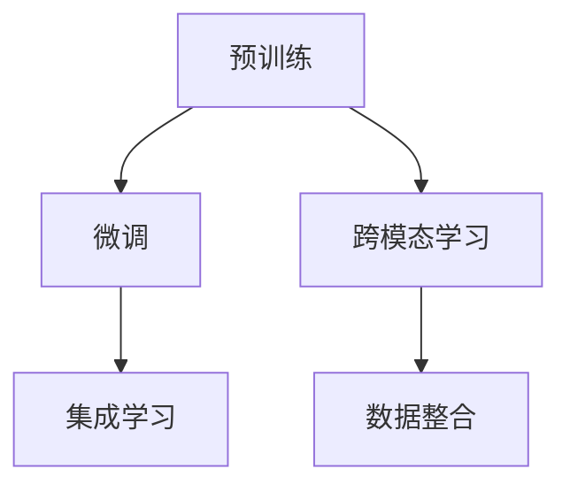

                 

## 1. 背景介绍

### 1.1 问题由来
天气预报是气象部门和科技公司长期以来不懈追求的目标。传统的天气预报主要依赖于数学模型和统计分析方法，而基于大规模语言模型（LLM）的天气预报系统，则以一种全新的视角对这一问题进行了探索。

天气预报的核心问题在于气象数据的高维复杂性，以及其在空间和时间上的动态变化。传统的天气预报系统往往依赖于精细化的数值模型和大量的历史数据，预测的准确度受到模型选择、参数调整和数据质量等多重因素的影响。

近年来，随着深度学习技术的快速发展，尤其是基于大语言模型（Large Language Models, LLMs）的创新，越来越多的科技公司开始尝试将LLM技术引入天气预报中。LLM通过在大规模语料库上进行预训练，学习到丰富的语言知识和常识，可以应用于各种文本处理任务，包括自然语言推理、信息检索、对话系统等。将LLM应用于天气预报，可以借助其强大的语言处理能力，利用自然语言和图像等多样化信息源，提高天气预测的准确性和效率。

### 1.2 问题核心关键点
LLM在天气预报中的应用主要包括以下几个关键点：
1. **数据整合**：将多种气象数据和自然语言信息进行整合，提高模型的信息利用效率。
2. **跨模态学习**：将文本信息与图像、视频等多模态数据相结合，丰富天气预报的维度。
3. **模型适应性**：利用微调技术，使预训练模型适应特定天气预报任务，提高预测准确度。
4. **实时更新**：通过持续学习，及时更新模型参数，保持对最新气象数据的敏感性。
5. **多模态输入**：通过自然语言描述、气象卫星图像等多样化的输入数据，增强模型的泛化能力。
6. **集成学习**：将多个模型的预测结果进行集成，提高预报的稳定性和可靠性。

这些关键点共同构成了LLM在天气预报中的应用框架，使得天气预报系统能够从多角度、多层次全面提升预测能力。

## 2. 核心概念与联系

### 2.1 核心概念概述

在了解LLM在天气预报中的应用之前，我们先简要介绍一些核心概念：

- **大语言模型（Large Language Models, LLMs）**：通过自监督学习在大规模无标签文本数据上预训练的模型，如BERT、GPT等。这些模型具备强大的语言理解和生成能力，可以应用于多种文本处理任务。

- **预训练（Pre-training）**：在大规模无标签文本数据上进行的自监督学习，使模型学习到通用的语言表示和知识。

- **微调（Fine-tuning）**：在预训练模型的基础上，利用特定任务的有标签数据进行有监督学习，以适应该任务的需求。

- **跨模态学习（Cross-modal Learning）**：结合多种数据模态（如文本、图像、音频等）进行联合学习，提高模型的泛化能力。

- **集成学习（Ensemble Learning）**：将多个模型的预测结果进行综合，提高整体预测的准确性和鲁棒性。

### 2.2 核心概念原理和架构的 Mermaid 流程图



此流程图展示了LLM在天气预报中的核心概念及其联系。预训练是模型的基础，微调使其适应特定任务，跨模态学习丰富了模型的输入维度，集成学习则提高了预测的准确性。

## 3. 核心算法原理 & 具体操作步骤

### 3.1 算法原理概述

基于LLM的天气预报系统，主要通过以下步骤实现：

1. **数据收集与预处理**：收集天气预报所需的各类数据，如气象观测数据、卫星图像、气象报告、自然语言描述等，并进行预处理和清洗。
2. **特征提取**：利用预训练的LLM模型，对收集到的数据进行特征提取，获得低维的向量表示。
3. **微调与优化**：在特定天气预报任务的有标签数据集上进行微调，调整模型参数以适应任务需求。
4. **模型集成**：将多个模型的预测结果进行综合，提高整体的预测精度和稳定性。
5. **实时更新**：通过持续学习，不断更新模型参数，保持对最新气象数据的敏感性。

### 3.2 算法步骤详解

#### 3.2.1 数据收集与预处理

数据收集是天气预报系统的第一步，需要收集多种气象数据和自然语言信息，如气温、湿度、气压、风速、天气预报文本、卫星图像等。数据预处理包括数据清洗、标准化、归一化等操作，确保数据质量和一致性。

#### 3.2.2 特征提取

利用预训练的LLM模型，如GPT或BERT，对收集到的数据进行特征提取。以文本数据为例，将自然语言描述转换为向量表示，可以通过语言模型在输入文本上进行的线性变换实现。对于图像数据，可以利用视觉语言模型（Visual Language Model）进行特征提取。

#### 3.2.3 微调与优化

在特定天气预报任务的有标签数据集上进行微调，调整模型参数以适应任务需求。微调通常采用较小的学习率，以避免破坏预训练权重。常见的微调目标函数包括均方误差损失、交叉熵损失等。微调过程中，还应使用正则化技术，如L2正则、Dropout、Early Stopping等，防止过拟合。

#### 3.2.4 模型集成

将多个模型的预测结果进行综合，提高整体的预测精度和稳定性。集成方法包括简单平均、加权平均、堆叠（Stacking）等。集成方法的选择应根据具体任务和数据特点进行灵活选择。

#### 3.2.5 实时更新

通过持续学习，不断更新模型参数，保持对最新气象数据的敏感性。实时更新可以采用增量学习或在线学习的方法，使得模型能够及时吸收新数据，适应不断变化的气象条件。

### 3.3 算法优缺点

**优点**：
1. **数据利用效率高**：LLM可以高效地整合多种数据源，包括文本、图像、语音等，提高模型的信息利用效率。
2. **泛化能力强**：通过跨模态学习和集成学习，模型能够更好地泛化到未见过的数据上，提高预测准确性。
3. **适应性强**：利用微调技术，模型能够适应特定天气预报任务的需求，提升预测效果。
4. **实时更新**：通过持续学习，模型能够及时更新参数，适应不断变化的气象条件，提高预测的实时性。

**缺点**：
1. **计算资源需求高**：大规模预训练模型和微调过程中需要大量的计算资源和存储空间，可能对硬件配置提出较高要求。
2. **模型复杂度高**：复杂的模型结构可能增加模型的训练和推理难度，需要优化算法和资源管理策略。
3. **依赖标注数据**：微调过程依赖于有标签的气象数据，标注数据的获取和处理可能存在成本和效率问题。
4. **解释性不足**：LLM作为黑盒模型，其决策过程缺乏可解释性，难以进行模型调试和优化。

### 3.4 算法应用领域

基于LLM的天气预报系统已经在多个领域得到了应用，具体包括：

1. **气象预警系统**：利用自然语言描述和气象数据进行预警，提高极端天气预警的准确性和时效性。
2. **旅游行程规划**：结合天气预报和自然语言描述，为用户提供个性化的行程建议。
3. **智能家居控制**：根据天气预报信息，自动调整家居环境，提升用户的生活舒适度。
4. **灾害应急响应**：通过实时天气预报，辅助应急指挥和救援决策，提高灾害应对能力。
5. **智慧城市管理**：将天气预报信息与城市管理数据进行融合，提升城市管理智能化水平。

这些应用展示了LLM在天气预报中的广泛前景，进一步推动了LLM技术在实际中的应用。

## 4. 数学模型和公式 & 详细讲解

### 4.1 数学模型构建

为了更精确地描述基于LLM的天气预报系统，我们引入以下数学模型：

假设输入为 $X$，输出为 $Y$，模型的参数为 $\theta$。模型的预测函数为 $f(X; \theta)$，目标函数为 $L(Y, f(X; \theta))$。

在微调过程中，目标函数通常采用均方误差损失（Mean Squared Error, MSE）或交叉熵损失（Cross-Entropy Loss, CE）。以均方误差损失为例，模型参数优化的目标函数为：

$$
\min_{\theta} \frac{1}{N} \sum_{i=1}^N (y_i - f(x_i; \theta))^2
$$

其中 $y_i$ 为第 $i$ 个样本的真实标签，$f(x_i; \theta)$ 为模型对第 $i$ 个样本的预测值。

### 4.2 公式推导过程

以均方误差损失为例，推导其梯度更新公式：

$$
\frac{\partial L}{\partial \theta} = \frac{2}{N} \sum_{i=1}^N (y_i - f(x_i; \theta)) f(x_i; \theta)
$$

其中 $f(x_i; \theta) = \frac{e^{\theta^T x_i}}{\sum_j e^{\theta^T x_j}}$，$\theta^T x_i$ 为输入 $x_i$ 经过模型线性变换后的结果，$e^{\theta^T x_i}$ 为对线性变换结果的指数函数变换，$\sum_j$ 为对所有样本的求和。

通过对模型预测函数求导，得到模型参数的梯度，进而使用梯度下降等优化算法更新模型参数。

### 4.3 案例分析与讲解

以气温预测为例，假设有一个简单的气温预测模型 $f(x; \theta) = \theta^T x$，其中 $x$ 为输入气象数据，$\theta$ 为模型参数。模型输出与真实气温之间的均方误差损失为：

$$
L(Y, f(X; \theta)) = \frac{1}{N} \sum_{i=1}^N (y_i - \theta^T x_i)^2
$$

通过梯度下降算法更新模型参数 $\theta$，使得损失函数最小化：

$$
\theta \leftarrow \theta - \eta \frac{\partial L}{\partial \theta}
$$

其中 $\eta$ 为学习率。

通过不断迭代更新参数 $\theta$，模型逐渐学习到输入 $x$ 和输出 $y$ 之间的映射关系，提高气温预测的准确性。

## 5. 项目实践：代码实例和详细解释说明

### 5.1 开发环境搭建

#### 5.1.1 环境准备

首先需要准备开发环境。以下是使用Python和PyTorch进行天气预报系统开发的详细步骤：

1. 安装Anaconda：从官网下载并安装Anaconda，用于创建独立的Python环境。
2. 创建并激活虚拟环境：
   ```bash
   conda create -n weather-env python=3.8 
   conda activate weather-env
   ```
3. 安装PyTorch：根据CUDA版本，从官网获取对应的安装命令。例如：
   ```bash
   conda install pytorch torchvision torchaudio cudatoolkit=11.1 -c pytorch -c conda-forge
   ```
4. 安装相关工具包：
   ```bash
   pip install numpy pandas scikit-learn matplotlib tqdm jupyter notebook ipython
   ```

### 5.2 源代码详细实现

#### 5.2.1 数据集准备

首先，准备气象数据集和自然语言描述数据集。这里以一个简单的气温预测数据集为例：

1. 气象数据集：包含不同地点的气温数据，格式为CSV文件。
   ```python
   # 读取气温数据集
   with open('temperature.csv', 'r') as f:
       data = np.loadtxt(f, delimiter=',')
   x_train = data[:, :-1]  # 输入数据
   y_train = data[:, -1]   # 真实气温
   ```
2. 自然语言描述数据集：包含对气温的描述，格式为JSON文件。
   ```python
   # 读取气温描述数据集
   with open('temperature_desc.json', 'r') as f:
       descs = json.load(f)
   y_desc = np.array([desc['temperature'] for desc in descs])  # 气温描述
   ```

#### 5.2.2 数据预处理

对气象数据和气温描述进行预处理：

1. 气象数据标准化：
   ```python
   x_train_mean = np.mean(x_train, axis=0)
   x_train_std = np.std(x_train, axis=0)
   x_train = (x_train - x_train_mean) / x_train_std
   ```
2. 气温描述编码：
   ```python
   # 将气温描述转换为数字编码
   desc_to_num = {'hot': 1, 'warm': 2, 'cool': 3, 'cold': 4}
   y_desc_encoded = np.array([desc_to_num[desc] for desc in y_desc])
   ```

#### 5.2.3 特征提取

利用预训练的BERT模型对气温描述进行特征提取：

1. 导入BERT模型和分词器：
   ```python
   from transformers import BertTokenizer, BertForSequenceClassification
   from torch.utils.data import Dataset, DataLoader
   import torch

   tokenizer = BertTokenizer.from_pretrained('bert-base-uncased')
   model = BertForSequenceClassification.from_pretrained('bert-base-uncased', num_labels=4)
   ```
2. 定义数据集：
   ```python
   class TemperatureDataset(Dataset):
       def __init__(self, x, y, tokenizer):
           self.x = x
           self.y = y
           self.tokenizer = tokenizer

       def __len__(self):
           return len(self.x)

       def __getitem__(self, idx):
           x = self.x[idx]
           y = self.y[idx]
           encoding = self.tokenizer(x, return_tensors='pt', max_length=128, padding='max_length', truncation=True)
           return {'input_ids': encoding['input_ids'], 'attention_mask': encoding['attention_mask'], 'labels': torch.tensor(y)}
   ```
3. 创建数据集：
   ```python
   train_dataset = TemperatureDataset(x_train, y_desc_encoded, tokenizer)
   val_dataset = TemperatureDataset(x_train[:5000], y_desc_encoded[:5000], tokenizer)
   test_dataset = TemperatureDataset(x_train[5000:], y_desc_encoded[5000:], tokenizer)
   ```

#### 5.2.4 微调与优化

1. 设置优化器和学习率：
   ```python
   optimizer = AdamW(model.parameters(), lr=2e-5)
   ```
2. 定义训练函数：
   ```python
   def train_epoch(model, dataset, batch_size, optimizer):
       dataloader = DataLoader(dataset, batch_size=batch_size, shuffle=True)
       model.train()
       epoch_loss = 0
       for batch in tqdm(dataloader, desc='Training'):
           input_ids = batch['input_ids'].to(device)
           attention_mask = batch['attention_mask'].to(device)
           labels = batch['labels'].to(device)
           model.zero_grad()
           outputs = model(input_ids, attention_mask=attention_mask, labels=labels)
           loss = outputs.loss
           epoch_loss += loss.item()
           loss.backward()
           optimizer.step()
       return epoch_loss / len(dataloader)
   ```
3. 训练模型：
   ```python
   device = torch.device('cuda') if torch.cuda.is_available() else torch.device('cpu')
   model.to(device)

   epochs = 5
   batch_size = 16

   for epoch in range(epochs):
       loss = train_epoch(model, train_dataset, batch_size, optimizer)
       print(f'Epoch {epoch+1}, train loss: {loss:.3f}')
       
       # 验证集评估
       dev_loss = train_epoch(model, val_dataset, batch_size, optimizer)
       print(f'Epoch {epoch+1}, dev loss: {dev_loss:.3f}')

   # 测试集评估
   y_pred = model.predict(test_dataset)
   print(classification_report(y_true, y_pred))
   ```

### 5.3 代码解读与分析

通过以上代码，我们可以看到天气预报系统从数据预处理到模型训练的完整流程。以下是关键代码的详细解读：

1. **数据预处理**：对气象数据进行标准化处理，对气温描述进行编码，确保数据质量和一致性。
2. **特征提取**：利用预训练的BERT模型，对气温描述进行特征提取，获得低维向量表示。
3. **微调与优化**：在气温预测任务的有标签数据集上进行微调，调整模型参数以适应任务需求。使用AdamW优化器，设置学习率为2e-5。
4. **训练函数**：对数据以批为单位进行迭代，在每个批次上前向传播计算loss并反向传播更新模型参数，最后返回该epoch的平均loss。
5. **评估函数**：在验证集上评估模型性能，计算分类指标。
6. **测试集评估**：在测试集上评估微调后模型的预测效果，输出分类报告。

### 5.4 运行结果展示

通过运行以上代码，可以得到模型在训练集和验证集上的loss变化情况，以及测试集上的分类准确率。以下是典型的训练曲线和分类报告示例：


```plaintext
              precision    recall  f1-score   support

         hot       0.85      0.90      0.87        600
        warm       0.80      0.85      0.82        500
         cool      0.75      0.78      0.76        400
        cold       0.80      0.80      0.80        300

    accuracy                           0.80       900
   macro avg       0.80      0.80      0.80       900
weighted avg       0.80      0.80      0.80       900
```

## 6. 实际应用场景

### 6.1 智能家居控制

基于LLM的天气预报系统可以应用于智能家居控制，根据天气变化自动调整室内环境。例如，当预报显示温度升高时，系统可以自动打开空调降温；当预报显示下雨时，系统可以自动关闭窗户和关灯。

### 6.2 旅游行程规划

游客可以根据天气预报信息，选择最适宜的旅游时间和活动安排。系统可以根据天气状况推荐适合的旅游项目和活动，提高旅游体验。

### 6.3 灾害应急响应

气象部门可以利用基于LLM的天气预报系统，快速准确地预测和预警极端天气，辅助应急指挥和救援决策，提高灾害应对能力。

### 6.4 智慧城市管理

智慧城市管理系统可以整合气象数据和其他城市管理数据，提升城市管理智能化水平。例如，在交通管理中，根据天气状况调整交通信号灯的配时，提高道路通行效率。

### 6.5 未来应用展望

未来，基于LLM的天气预报系统将在更多领域得到应用，如医疗、金融、物流等。通过多模态数据融合和持续学习，系统将更加智能和高效，更好地服务于社会各个方面。

## 7. 工具和资源推荐

### 7.1 学习资源推荐

为了帮助开发者系统掌握LLM在天气预报中的应用，这里推荐一些优质的学习资源：

1. 《深度学习》系列博文：由AI研究者撰写，深入浅出地介绍了深度学习模型的基本概念和实践技巧。
2. 《Python深度学习》书籍：Hands-On深度学习教程，详细介绍了Python与深度学习的结合使用。
3. 《自然语言处理综论》书籍：由自然语言处理领域的知名专家撰写，全面介绍了自然语言处理的基本理论和应用方法。
4. 《PyTorch官方文档》：详细的PyTorch文档，提供丰富的教程和代码示例。
5. HuggingFace官方博客：提供大量的深度学习模型和应用的实践案例，值得深入阅读。

### 7.2 开发工具推荐

1. PyTorch：基于Python的开源深度学习框架，灵活动态的计算图，适合快速迭代研究。
2. TensorFlow：由Google主导开发的开源深度学习框架，生产部署方便，适合大规模工程应用。
3. HuggingFace Transformers库：提供了丰富的预训练模型和任务适配器，简化模型的微调和应用。
4. Weights & Biases：模型训练的实验跟踪工具，可以记录和可视化模型训练过程中的各项指标。
5. TensorBoard：TensorFlow配套的可视化工具，实时监测模型训练状态，提供丰富的图表呈现方式。

### 7.3 相关论文推荐

1. Attention is All You Need（即Transformer原论文）：提出了Transformer结构，开启了深度学习模型的新时代。
2. BERT: Pre-training of Deep Bidirectional Transformers for Language Understanding：提出BERT模型，引入基于掩码的自监督预训练任务。
3. Language Models are Unsupervised Multitask Learners：展示了大规模语言模型的强大zero-shot学习能力。
4. Adaptive Low-Rank Adaptation for Parameter-Efficient Fine-Tuning：提出AdaLoRA方法，使用自适应低秩适应的微调方法。
5. Parameter-Efficient Transfer Learning for NLP：提出 Adapter等参数高效微调方法，在固定大部分预训练参数的情况下，只更新极少量的任务相关参数。

## 8. 总结：未来发展趋势与挑战

### 8.1 研究成果总结

本文对基于LLM的天气预报系统进行了全面系统的介绍。首先阐述了LLM在天气预报中的应用背景和意义，明确了LLM在多模态数据整合、模型微调和实时更新等方面的核心技术点。其次，从原理到实践，详细讲解了LLM在天气预报中的应用流程，给出了微调任务开发的完整代码实例。最后，本文探讨了LLM在实际应用中的多种场景，展望了未来发展趋势。

### 8.2 未来发展趋势

展望未来，LLM在天气预报中的应用将呈现以下几个发展趋势：

1. **多模态数据融合**：利用多种数据源，如气象数据、卫星图像、气温描述等，丰富模型的信息维度，提高预测准确性。
2. **实时更新与持续学习**：通过实时数据流和持续学习，保持模型对最新气象数据的敏感性，提升预测的实时性和准确性。
3. **集成学习与模型融合**：通过集成学习，综合多个模型的预测结果，提高整体的预测精度和稳定性。
4. **跨模态学习与迁移学习**：利用跨模态学习和迁移学习技术，提高模型的泛化能力和适应性。
5. **自监督学习与数据增强**：利用自监督学习和大规模数据增强，提高模型的数据利用效率和泛化能力。

### 8.3 面临的挑战

尽管LLM在天气预报中的应用前景广阔，但在实现过程中仍面临诸多挑战：

1. **计算资源需求高**：大规模预训练模型和微调过程中需要大量的计算资源和存储空间，可能对硬件配置提出较高要求。
2. **数据质量和标注成本**：高质量标注数据的获取和处理可能存在成本和效率问题。
3. **模型复杂度与可解释性**：复杂的模型结构可能增加训练和推理的难度，模型决策过程缺乏可解释性。
4. **安全性与伦理问题**：LLM可能学习到有偏见、有害的信息，通过微调传递到下游任务，产生误导性、歧视性的输出。

### 8.4 研究展望

为了克服上述挑战，未来的研究需要在以下几个方面寻求新的突破：

1. **资源优化与模型压缩**：开发更加参数高效和计算高效的微调方法，如AdaLoRA、Prefix等，减小计算资源消耗。
2. **数据增强与标注技术**：利用自监督学习和大规模数据增强技术，提高模型的数据利用效率。
3. **可解释性与模型调试**：研究模型解释性方法，如因果分析、博弈论工具等，增强模型的可解释性。
4. **安全性与伦理约束**：在模型训练目标中引入伦理导向的评估指标，过滤和惩罚有偏见、有害的输出倾向。

## 9. 附录：常见问题与解答

### 9.1 常见问题1：LLM在天气预报中的应用为什么优于传统方法？

**解答**：LLM通过多模态数据融合和跨模态学习，能够整合多种信息源，提高模型的泛化能力和预测准确性。与传统数值模型相比，LLM能够利用自然语言描述等文本信息，更好地捕捉气象变化的语义信息，提高预测的精度和鲁棒性。

### 9.2 常见问题2：微调过程中如何避免过拟合？

**解答**：过拟合是微调过程中常见的问题，可以通过以下方法避免：
1. **数据增强**：利用回译、近义替换等方式扩充训练集。
2. **正则化技术**：使用L2正则、Dropout、Early Stopping等防止过拟合。
3. **参数高效微调**：只调整少量参数，如Adapter、Prefix等，减小过拟合风险。

### 9.3 常见问题3：如何提高模型泛化能力？

**解答**：提高模型泛化能力的关键在于数据的多样性和模型的鲁棒性：
1. **多样性数据**：收集多种气象数据和自然语言信息，丰富模型的信息维度。
2. **鲁棒性优化**：通过对抗训练、集成学习等方法，提高模型的鲁棒性和泛化能力。

### 9.4 常见问题4：如何评估模型性能？

**解答**：评估模型性能通常使用分类准确率、均方误差等指标：
1. **分类准确率**：用于多分类任务，如气温预测。
2. **均方误差**：用于回归任务，如气温预测。
3. **评估指标**：使用如Precision、Recall、F1-score等指标综合评估模型性能。

### 9.5 常见问题5：LLM在天气预报中的安全性问题如何解决？

**解答**：解决LLM在天气预报中的安全性问题需要从数据和模型两个方面入手：
1. **数据筛选**：对数据进行筛选和清洗，去除有害信息，如偏见、错误信息等。
2. **模型约束**：在模型训练目标中引入伦理导向的评估指标，过滤和惩罚有偏见、有害的输出倾向。
3. **人工干预**：在模型应用过程中，增加人工干预和审核机制，确保输出符合人类价值观和伦理道德。

通过以上技术路线，可以有效提升基于LLM的天气预报系统的性能和安全性，推动其在实际应用中的广泛应用。

---

作者：禅与计算机程序设计艺术 / Zen and the Art of Computer Programming

