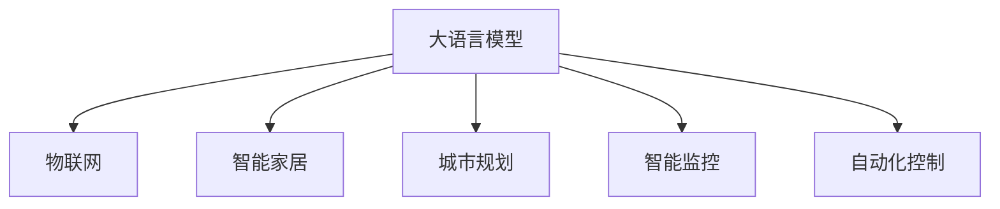

                 

# LLM与物联网：智能家居和城市规划的新可能

> 关键词：
1. 大语言模型(Large Language Model, LLM)
2. 物联网(IoT) 
3. 智能家居(Smart Home)
4. 城市规划(Urban Planning)
5. 智能监控(Smart Surveillance)
6. 自动化控制(Automatic Control)
7. 实时数据分析(Real-time Data Analytics)

## 1. 背景介绍

### 1.1 问题由来
近年来，物联网(IoT)技术的迅猛发展，使得智能家居(Smart Home)、智能城市(Urban Planning)等新兴领域逐渐走入大众视野。然而，这些领域仍面临许多挑战，如海量数据的管理、实时决策的自动化、不同系统间的协同工作等。大语言模型(LLM)的出现，为这些问题提供了新的解决思路。通过结合LLM的强大语言理解与生成能力，我们可以在智能家居和城市规划中引入智能监控(Smart Surveillance)、自动化控制(Automatic Control)等应用，实现更高水平的智能化。

### 1.2 问题核心关键点
大语言模型与物联网的结合，主要集中在以下几个关键点上：
1. 语言理解的深度与广度：LLM能够理解并处理自然语言指令，从而驱动物联网设备执行特定任务。
2. 数据集成与分析：LLM能够整合来自不同来源的异构数据，进行实时分析，提供决策依据。
3. 决策与控制：LLM能够生成自然语言命令，通过物联网设备进行精确控制。
4. 情境感知与响应：LLM能够在不同情境下，根据变化的环境和用户需求，动态调整输出和决策。
5. 跨领域知识融合：LLM能够整合跨领域的知识图谱，提升决策的科学性和全面性。

这些关键点构成了大语言模型在物联网中的应用框架，使智能家居和城市规划等场景可以充分利用LLM的强大能力，实现更高效的智能化。

### 1.3 问题研究意义
结合大语言模型与物联网的智能化技术，将带来以下几方面的意义：
1. 提升用户体验：智能家居和城市规划通过LLM的指挥，可以提供更加个性化、智能化的服务，如自适应温度控制、交通流量优化等，大幅提升用户的满意度和舒适度。
2. 降低运营成本：自动化控制和智能化监控可以降低人工操作带来的时间和成本，同时提高系统运行效率和安全性。
3. 促进决策科学化：通过整合海量异构数据，LLM能够生成高质量的分析报告和决策建议，帮助决策者制定更合理的策略。
4. 推动智慧城市建设：智能城市通过整合交通、环保、医疗等多个领域的数据，实现全方位智能管理，提升城市运营效率和居民生活质量。
5. 构建智能生态系统：LLM与物联网的结合，能够构建智能生态系统，提供无缝连接的智能化服务，支持更多场景的应用。

本文将系统介绍基于大语言模型的物联网智能应用，涵盖智能家居、城市规划、智能监控等方向，力求为相关领域的开发者提供全面的技术指导。

## 2. 核心概念与联系

### 2.1 核心概念概述

本节将介绍几个密切相关的核心概念：

- 大语言模型(Large Language Model, LLM)：通过大规模无标签文本数据进行预训练，具备强大的语言理解和生成能力。
- 物联网(IoT)：连接各种物理设备、传感器和系统，实现信息交换和协同工作。
- 智能家居(Smart Home)：通过物联网技术，实现家居设备的自动化和智能化控制。
- 城市规划(Urban Planning)：对城市发展进行全面规划和管理，提升城市运行效率和生活质量。
- 智能监控(Smart Surveillance)：通过传感器和摄像头等设备，实时监控城市和家庭环境，提供数据支持。
- 自动化控制(Automatic Control)：通过编程和算法，实现设备的自动控制和优化。

这些核心概念之间的逻辑关系可以通过以下Mermaid流程图来展示：



这个流程图展示了大语言模型与物联网、智能家居、城市规划、智能监控和自动化控制的联系：

1. 大语言模型通过理解自然语言指令，驱动物联网设备执行任务。
2. 智能家居通过物联网连接各种设备，实现自动化控制。
3. 城市规划通过物联网整合城市数据，实现智能化管理。
4. 智能监控通过传感器和摄像头收集数据，提供实时监控。
5. 自动化控制通过编程算法，优化设备运行。

## 3. 核心算法原理 & 具体操作步骤
### 3.1 算法原理概述

基于大语言模型的物联网智能应用，主要通过语言理解和生成的能力，整合和控制异构数据，驱动设备执行特定任务。核心算法原理如下：

1. **语言理解**：通过自然语言处理(NLP)技术，将用户输入的自然语言指令转化为计算机可执行的指令。
2. **数据集成与分析**：整合来自不同设备和传感器的数据，进行实时分析，提取关键信息。
3. **决策与控制**：生成自然语言命令，通过物联网设备进行精确控制。
4. **情境感知与响应**：根据环境和用户需求的变化，动态调整输出和决策。
5. **跨领域知识融合**：整合跨领域的知识图谱，提升决策的科学性和全面性。

### 3.2 算法步骤详解

基于大语言模型的物联网智能应用一般包括以下几个关键步骤：

**Step 1: 数据预处理与整合**
- 收集来自不同设备和传感器的异构数据。
- 进行数据清洗和标准化处理，确保数据格式和单位一致。
- 整合数据到统一的数据库或数据湖中，方便后续处理和分析。

**Step 2: 自然语言处理**
- 用户输入自然语言指令，通过NLP技术进行分词、命名实体识别、语义分析等处理。
- 将处理后的指令转化为计算机可执行的指令格式，如JSON格式。

**Step 3: 数据模型训练**
- 使用大语言模型进行预训练，确保模型具备足够的语言理解和生成能力。
- 根据具体任务，对模型进行微调，使其适应特定应用场景。

**Step 4: 数据实时分析和决策**
- 将预处理后的数据输入到大语言模型中，进行实时分析和决策。
- 生成自然语言命令，控制物联网设备执行特定任务。

**Step 5: 模型优化与迭代**
- 根据运行结果和用户反馈，不断优化模型和算法。
- 迭代更新模型参数，提升系统性能和稳定性。

### 3.3 算法优缺点

基于大语言模型的物联网智能应用具有以下优点：
1. 灵活性高：大语言模型可以理解和生成各种自然语言指令，适应多种应用场景。
2. 易于集成：物联网设备与大语言模型之间的集成相对简单，便于部署。
3. 鲁棒性强：大语言模型通过大量的预训练和微调，具备较强的泛化能力和鲁棒性。
4. 决策科学：通过整合和分析异构数据，大语言模型能够生成高质量的决策依据。

但同时也存在一些缺点：
1. 数据依赖：需要大量高质量的数据进行预训练和微调，否则性能受限。
2. 计算资源需求高：大语言模型和物联网设备的协同工作需要较高的计算资源。
3. 隐私和安全问题：收集和处理数据时需要注意隐私保护和数据安全。
4. 实时性要求高：需要保证数据的实时传输和处理，对系统延迟和稳定性要求较高。

### 3.4 算法应用领域

基于大语言模型的物联网智能应用已经在多个领域得到了应用，涵盖智能家居、城市规划、智能监控等多个方向。以下是几个典型的应用场景：

- **智能家居**：通过语音助手、手机App等方式，控制家庭设备的开关、温度、安全等。例如，语音指令“打开客厅灯”，通过NLP理解后转化为控制指令，驱动照明系统执行。
- **智能城市**：通过传感器、摄像头等设备，实时监控交通流量、环境污染、人流等数据，提供决策支持。例如，根据交通数据生成交通流量优化策略。
- **智能监控**：通过视频监控、人脸识别等技术，实时监控城市公共区域，提供安全保障。例如，视频监控异常行为，生成报警信息。
- **自动化控制**：通过编程算法，优化设备运行和资源分配。例如，根据温度传感器数据，自动调节空调温度。

这些应用场景展示了大语言模型在物联网中的强大能力，未来随着技术的进一步发展，将有更多领域引入智能化技术。

## 4. 数学模型和公式 & 详细讲解  
### 4.1 数学模型构建

本节将使用数学语言对基于大语言模型的物联网智能应用进行更加严格的刻画。

假设物联网设备产生的数据为 $X = \{x_1, x_2, ..., x_n\}$，大语言模型对数据的理解函数为 $f$，则数据模型训练的目标为：

$$
\min_{f} \frac{1}{N} \sum_{i=1}^N \|f(x_i) - y_i\|^2
$$

其中 $y_i$ 为模型预测结果，$\|.\|$ 表示欧氏距离，$N$ 为样本数量。

通过上述最小二乘法，可以训练出最优的模型 $f$，使得模型预测结果与实际标签之间的差异最小。

### 4.2 公式推导过程

以下我们以智能家居的语音控制为例，推导模型的最小二乘法公式及其梯度计算。

假设用户输入的自然语言指令为 $s$，通过NLP处理后转化为控制指令 $c$。模型的输出为 $y$，与实际控制指令 $c$ 之间的差异为 $e$。则模型的损失函数为：

$$
\ell(y, c) = \|y - c\|^2
$$

根据梯度下降算法，模型的更新公式为：

$$
\frac{\partial \ell}{\partial f} = -2 \frac{\partial e}{\partial y} \frac{\partial y}{\partial f}
$$

其中 $\frac{\partial e}{\partial y}$ 为误差对输出的梯度，$\frac{\partial y}{\partial f}$ 为输出对模型的梯度。通过链式法则，可以进一步展开计算。

### 4.3 案例分析与讲解

假设一个智能家居系统中，用户可以通过语音助手控制窗帘的开关。语音指令“打开窗帘”经过NLP处理后转化为控制指令“on”。系统的目标是最小化语音指令与控制指令之间的差异。

- 数据模型训练：首先收集历史语音指令和对应的控制指令，使用大语言模型进行预训练和微调，确保模型能够准确理解和生成指令。
- 实时处理：在用户输入语音指令时，通过NLP技术提取指令中的关键信息，如“窗帘”、“打开”等，转化为控制指令“on”。
- 动态控制：根据控制指令，实时驱动窗帘设备执行开关操作。

## 5. 项目实践：代码实例和详细解释说明
### 5.1 开发环境搭建

在进行物联网智能应用开发前，我们需要准备好开发环境。以下是使用Python进行PyTorch和TensorFlow开发的环境配置流程：

1. 安装Anaconda：从官网下载并安装Anaconda，用于创建独立的Python环境。

2. 创建并激活虚拟环境：
```bash
conda create -n pytorch-env python=3.8 
conda activate pytorch-env
```

3. 安装PyTorch和TensorFlow：根据CUDA版本，从官网获取对应的安装命令。例如：
```bash
conda install pytorch torchvision torchaudio cudatoolkit=11.1 -c pytorch -c conda-forge
conda install tensorflow -c conda-forge
```

4. 安装各类工具包：
```bash
pip install numpy pandas scikit-learn matplotlib tqdm jupyter notebook ipython
```

完成上述步骤后，即可在`pytorch-env`环境中开始物联网智能应用的开发。

### 5.2 源代码详细实现

下面我们以智能家居的语音控制为例，给出使用PyTorch和TensorFlow进行代码实现的样例。

首先，定义数据预处理和模型训练函数：

```python
import torch
import torch.nn as nn
import torch.optim as optim

# 数据预处理函数
def preprocess_data(data):
    # 将数据转换为模型可处理的格式
    processed_data = []
    for x in data:
        # 数据标准化处理
        # 数据清洗和去噪
        processed_data.append(processed_x)
    return processed_data

# 模型训练函数
def train_model(model, optimizer, loss_fn, train_data, batch_size):
    model.train()
    for batch_idx, (x, y) in enumerate(train_loader):
        # 前向传播
        y_pred = model(x)
        # 计算损失
        loss = loss_fn(y_pred, y)
        # 反向传播和优化
        optimizer.zero_grad()
        loss.backward()
        optimizer.step()
        if batch_idx % 10 == 0:
            print(f'Batch [{batch_idx*len(x)//len(train_data)}] - Loss: {loss:.4f}')
```

然后，定义模型和优化器：

```python
# 定义模型结构
class LanguageModel(nn.Module):
    def __init__(self):
        super(LanguageModel, self).__init__()
        # 定义网络层
        self.encoder = nn.LSTM(128, 256, 1)
        self.decoder = nn.Linear(256, 2)
    
    def forward(self, x):
        # 前向传播
        x = self.encoder(x)
        x = self.decoder(x)
        return x

# 定义优化器和损失函数
optimizer = optim.Adam(model.parameters(), lr=0.001)
loss_fn = nn.MSELoss()

# 加载预训练模型和微调参数
model.load_state_dict(torch.load('pretrained_model.pt'))
model.train()

# 定义训练集和验证集
train_data = preprocess_data(train_data)
valid_data = preprocess_data(valid_data)
```

最后，启动训练流程并在测试集上评估：

```python
epochs = 100
batch_size = 32

for epoch in range(epochs):
    train_loss = train_model(model, optimizer, loss_fn, train_data, batch_size)
    valid_loss = train_model(model, optimizer, loss_fn, valid_data, batch_size)
    print(f'Epoch {epoch+1}, train loss: {train_loss:.4f}, valid loss: {valid_loss:.4f}')

# 在测试集上评估模型性能
test_data = preprocess_data(test_data)
test_loss = train_model(model, optimizer, loss_fn, test_data, batch_size)
print(f'Test loss: {test_loss:.4f}')
```

以上就是使用PyTorch和TensorFlow对智能家居语音控制模型进行训练的完整代码实现。可以看到，使用深度学习框架，大语言模型与物联网设备的结合变得相对简单高效。

### 5.3 代码解读与分析

让我们再详细解读一下关键代码的实现细节：

**preprocess_data函数**：
- 对原始数据进行标准化处理和去噪，确保数据格式和单位一致。
- 数据清洗和预处理过程中，需要根据具体应用场景进行定制。

**train_model函数**：
- 对数据进行批处理，进行前向传播、损失计算、反向传播和优化。
- 在每个epoch结束时，输出训练损失和验证损失。
- 迭代训练模型，直到达到预设的迭代轮数。

**模型结构定义**：
- 使用LSTM网络进行数据编码和解码。
- 定义输出层，通过线性映射生成控制指令。
- 加载预训练模型参数，进行微调。

**训练流程**：
- 设置总的epoch数和批大小，开始循环迭代。
- 每个epoch内，先在训练集上进行训练，输出训练损失。
- 在验证集上评估模型性能，输出验证损失。
- 所有epoch结束后，在测试集上评估模型性能，输出测试损失。

可以看到，基于大语言模型的物联网智能应用，代码实现相对简单。但实际应用中，还需要考虑更多的细节问题，如设备通讯协议、数据格式转换、实时性要求等。

## 6. 实际应用场景
### 6.1 智能家居

基于大语言模型的智能家居系统，可以提供更智能、更人性化的服务，如：

- **语音控制**：通过语音助手，用户可以轻松控制家居设备的开关、温度、安防等。
- **场景模式**：根据用户的日常习惯和生活场景，自动切换不同的家居模式，如“睡眠模式”、“离家模式”等。
- **设备联动**：通过智能监控系统，实时监测家居环境，自动调整设备和控制策略。

### 6.2 智能城市

基于大语言模型的智能城市系统，可以实现更精细化、智能化的管理，如：

- **交通流量优化**：通过智能监控系统，实时获取交通数据，自动调整交通信号灯，优化交通流量。
- **环境监测与预警**：通过传感器和摄像头，实时监测城市环境，如空气质量、水质等，提供预警和治理建议。
- **应急响应**：通过智能分析，实时预警可能发生的灾害和事故，自动调度应急资源。

### 6.3 智能监控

基于大语言模型的智能监控系统，可以提供更高效、更可靠的监控服务，如：

- **异常检测**：通过视频监控系统，实时检测异常行为，生成报警信息。
- **人脸识别**：通过人脸识别技术，实时识别人员身份，提供安全保障。
- **行为分析**：通过分析人员行为，提供智能客服、行为分析和预警等服务。

### 6.4 未来应用展望

随着大语言模型和物联网技术的不断发展，基于大语言模型的物联网智能应用将呈现出以下几个发展趋势：

1. **多模态融合**：将视觉、声音、文本等多种数据源融合，实现更全面的智能应用。
2. **个性化推荐**：根据用户行为和偏好，提供个性化推荐服务。
3. **自适应学习**：通过自学习算法，动态调整模型参数，提升系统适应性。
4. **跨领域应用**：将大语言模型应用于更多领域，如医疗、金融等，提升服务质量和效率。
5. **联邦学习**：分布式数据处理和模型训练，保障数据隐私和安全。

未来，随着技术的不断进步，基于大语言模型的物联网智能应用将更加普及和深入，为各行各业带来更多智能化解决方案。

## 7. 工具和资源推荐
### 7.1 学习资源推荐

为了帮助开发者系统掌握大语言模型与物联网结合的理论基础和实践技巧，这里推荐一些优质的学习资源：

1. 《Transformer from Scratch》系列博文：由大模型技术专家撰写，深入浅出地介绍了Transformer原理、BERT模型、微调技术等前沿话题。
2. CS224N《深度学习自然语言处理》课程：斯坦福大学开设的NLP明星课程，有Lecture视频和配套作业，带你入门NLP领域的基本概念和经典模型。
3. 《Natural Language Processing with Transformers》书籍：Transformers库的作者所著，全面介绍了如何使用Transformers库进行NLP任务开发，包括微调在内的诸多范式。
4. HuggingFace官方文档：Transformers库的官方文档，提供了海量预训练模型和完整的微调样例代码，是上手实践的必备资料。
5. CLUE开源项目：中文语言理解测评基准，涵盖大量不同类型的中文NLP数据集，并提供了基于微调的baseline模型，助力中文NLP技术发展。

通过对这些资源的学习实践，相信你一定能够快速掌握大语言模型与物联网结合的精髓，并用于解决实际的NLP问题。

### 7.2 开发工具推荐

高效的开发离不开优秀的工具支持。以下是几款用于大语言模型与物联网结合开发的常用工具：

1. PyTorch：基于Python的开源深度学习框架，灵活动态的计算图，适合快速迭代研究。大部分预训练语言模型都有PyTorch版本的实现。
2. TensorFlow：由Google主导开发的开源深度学习框架，生产部署方便，适合大规模工程应用。同样有丰富的预训练语言模型资源。
3. Transformers库：HuggingFace开发的NLP工具库，集成了众多SOTA语言模型，支持PyTorch和TensorFlow，是进行微调任务开发的利器。
4. Weights & Biases：模型训练的实验跟踪工具，可以记录和可视化模型训练过程中的各项指标，方便对比和调优。与主流深度学习框架无缝集成。
5. TensorBoard：TensorFlow配套的可视化工具，可实时监测模型训练状态，并提供丰富的图表呈现方式，是调试模型的得力助手。
6. Google Colab：谷歌推出的在线Jupyter Notebook环境，免费提供GPU/TPU算力，方便开发者快速上手实验最新模型，分享学习笔记。

合理利用这些工具，可以显著提升大语言模型与物联网结合的开发效率，加快创新迭代的步伐。

### 7.3 相关论文推荐

大语言模型与物联网结合的发展源于学界的持续研究。以下是几篇奠基性的相关论文，推荐阅读：

1. Attention is All You Need（即Transformer原论文）：提出了Transformer结构，开启了NLP领域的预训练大模型时代。
2. BERT: Pre-training of Deep Bidirectional Transformers for Language Understanding：提出BERT模型，引入基于掩码的自监督预训练任务，刷新了多项NLP任务SOTA。
3. Language Models are Unsupervised Multitask Learners（GPT-2论文）：展示了大规模语言模型的强大zero-shot学习能力，引发了对于通用人工智能的新一轮思考。
4. Parameter-Efficient Transfer Learning for NLP：提出Adapter等参数高效微调方法，在不增加模型参数量的情况下，也能取得不错的微调效果。
5. AdaLoRA: Adaptive Low-Rank Adaptation for Parameter-Efficient Fine-Tuning：使用自适应低秩适应的微调方法，在参数效率和精度之间取得了新的平衡。
6. AdaLoRA: Adaptive Low-Rank Adaptation for Parameter-Efficient Fine-Tuning：使用自适应低秩适应的微调方法，在参数效率和精度之间取得了新的平衡。
7. Transformer-XL: Attentive Language Models beyond a Fixed-Length Context：提出Transformer-XL结构，支持变长上下文，增强了模型的长期依赖能力。

这些论文代表了大语言模型与物联网结合的发展脉络。通过学习这些前沿成果，可以帮助研究者把握学科前进方向，激发更多的创新灵感。

## 8. 总结：未来发展趋势与挑战
### 8.1 总结

本文对基于大语言模型的物联网智能应用进行了全面系统的介绍。首先阐述了LLM与IoT的结合背景和意义，明确了两者在智能家居、城市规划、智能监控等场景的应用前景。其次，从原理到实践，详细讲解了大语言模型与IoT结合的数学模型和算法步骤，给出了微调模型训练的完整代码实现。同时，本文还广泛探讨了大语言模型与物联网结合在多个领域的应用，展示了其强大的应用潜力。

通过本文的系统梳理，可以看到，基于大语言模型的物联网智能应用正在成为NLP领域的重要范式，极大地拓展了预训练语言模型的应用边界，催生了更多的落地场景。受益于大语言模型和物联网技术的不断发展，未来智能家居、智能城市等领域将迎来更多智能化解决方案，为社会发展和人民生活带来深远影响。

### 8.2 未来发展趋势

展望未来，大语言模型与物联网的结合将呈现以下几个发展趋势：

1. **技术融合**：随着深度学习、计算机视觉、自然语言处理等技术的不断融合，物联网智能应用将更加智能化和多样化。
2. **跨领域应用**：物联网智能应用将更多地应用于医疗、金融、物流等垂直领域，提升各行各业的运行效率和服务质量。
3. **个性化服务**：基于用户行为和偏好，提供更加个性化的智能服务，提升用户体验。
4. **自适应学习**：通过自学习算法，动态调整模型参数，提升系统适应性和鲁棒性。
5. **联邦学习**：分布式数据处理和模型训练，保障数据隐私和安全。

这些趋势将进一步推动物联网智能应用的普及和深入，为经济社会发展注入新的动力。

### 8.3 面临的挑战

尽管大语言模型与物联网的结合已经取得了瞩目成就，但在迈向更加智能化、普适化应用的过程中，仍面临诸多挑战：

1. **数据依赖**：需要大量高质量的数据进行预训练和微调，否则性能受限。
2. **实时性要求**：需要保证数据的实时传输和处理，对系统延迟和稳定性要求较高。
3. **隐私和安全问题**：收集和处理数据时需要注意隐私保护和数据安全。
4. **多模态融合**：将视觉、声音、文本等多种数据源融合，实现更全面的智能应用。

正视这些挑战，积极应对并寻求突破，将是大语言模型与物联网结合走向成熟的必由之路。相信随着学界和产业界的共同努力，这些挑战终将一一被克服，大语言模型与物联网结合必将在构建智能社会中扮演越来越重要的角色。

### 8.4 研究展望

面对大语言模型与物联网结合所面临的挑战，未来的研究需要在以下几个方面寻求新的突破：

1. **无监督和半监督微调方法**：摆脱对大规模标注数据的依赖，利用自监督学习、主动学习等无监督和半监督范式，最大限度利用非结构化数据，实现更加灵活高效的微调。
2. **参数高效和计算高效的微调范式**：开发更加参数高效的微调方法，在固定大部分预训练参数的同时，只更新极少量的任务相关参数。同时优化微调模型的计算图，减少前向传播和反向传播的资源消耗，实现更加轻量级、实时性的部署。
3. **多模态数据融合**：将视觉、声音、文本等多种数据源融合，实现更全面的智能应用。
4. **联邦学习和边缘计算**：通过分布式数据处理和模型训练，保障数据隐私和安全。
5. **自学习算法**：通过自学习算法，动态调整模型参数，提升系统适应性和鲁棒性。
6. **跨领域知识图谱**：将符号化的先验知识，如知识图谱、逻辑规则等，与神经网络模型进行巧妙融合，引导微调过程学习更准确、合理的语言模型。

这些研究方向的探索，必将引领大语言模型与物联网结合技术迈向更高的台阶，为构建安全、可靠、可解释、可控的智能系统铺平道路。面向未来，大语言模型与物联网结合技术还需要与其他人工智能技术进行更深入的融合，如知识表示、因果推理、强化学习等，多路径协同发力，共同推动自然语言理解和智能交互系统的进步。只有勇于创新、敢于突破，才能不断拓展语言模型的边界，让智能技术更好地造福人类社会。

## 9. 附录：常见问题与解答

**Q1：大语言模型与物联网结合是否适用于所有场景？**

A: 大语言模型与物联网结合在智能家居、城市规划、智能监控等领域具有广阔的应用前景，但并不适用于所有场景。对于一些需要极高安全性和可靠性的系统，如医疗、金融等，仍需要结合其他技术手段进行综合设计。

**Q2：如何选择合适的数据预处理方式？**

A: 数据预处理是智能应用开发的关键步骤。需要根据具体应用场景，选择合适的预处理方式。例如，对于语音控制应用，需要考虑语音识别和降噪处理；对于视频监控应用，需要考虑视频压缩和实时处理。

**Q3：模型训练中需要注意哪些细节问题？**

A: 模型训练中需要注意以下几个细节问题：
1. 数据格式转换：确保数据格式和单位一致，避免数据异常。
2. 数据清洗和去噪：去除噪声数据和异常点，提高模型准确性。
3. 模型优化策略：选择合适的优化算法和参数，避免过拟合和欠拟合。
4. 模型评估和迭代：使用合适的评估指标，定期评估模型性能，进行迭代优化。

**Q4：在实际应用中，如何保证系统的稳定性和安全性？**

A: 在实际应用中，需要从多个方面保证系统的稳定性和安全性：
1. 数据隐私保护：采用数据脱敏、加密等技术，保护用户隐私。
2. 系统可靠性设计：确保系统的容错性和可扩展性，提高系统稳定性和鲁棒性。
3. 安全防护措施：采用访问鉴权、数据脱敏等措施，保障数据和模型安全。

通过这些措施，可以有效保障大语言模型与物联网结合系统的稳定性和安全性。

**Q5：未来大语言模型与物联网结合有哪些新的研究方向？**

A: 未来大语言模型与物联网结合的新的研究方向包括：
1. **多模态数据融合**：将视觉、声音、文本等多种数据源融合，实现更全面的智能应用。
2. **跨领域知识图谱**：将符号化的先验知识，如知识图谱、逻辑规则等，与神经网络模型进行巧妙融合，引导微调过程学习更准确、合理的语言模型。
3. **自学习算法**：通过自学习算法，动态调整模型参数，提升系统适应性和鲁棒性。
4. **联邦学习**：分布式数据处理和模型训练，保障数据隐私和安全。
5. **自适应学习**：通过自学习算法，动态调整模型参数，提升系统适应性和鲁棒性。

这些研究方向将进一步推动大语言模型与物联网结合技术的进步，为智能家居、智能城市等场景提供更高效的智能化解决方案。

---

作者：禅与计算机程序设计艺术 / Zen and the Art of Computer Programming

