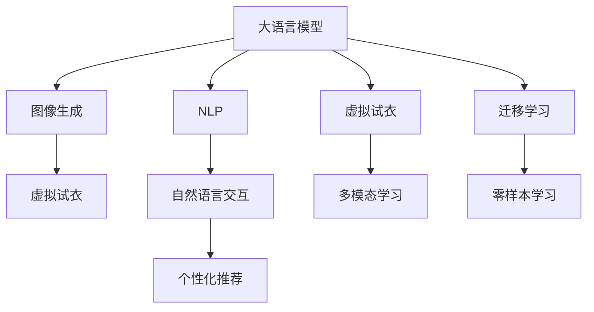

                 

# LLM与虚拟试衣：革新在线购物体验

> 关键词：大语言模型, 虚拟试衣, 在线购物, 用户体验, 图像生成, 自然语言处理

## 1. 背景介绍

### 1.1 问题由来
在线购物平台正面临一场体验上的革命。传统购物体验依赖于用户浏览图片和描述来挑选商品，且受限于物理空间的限制，试穿试用的选项也相对有限。随着技术的进步，一种新型的虚拟试衣技术应运而生，通过结合大语言模型和图像生成技术，实现无缝切换线上和线下购物体验。本文将探讨如何将大语言模型与虚拟试衣系统相结合，为消费者带来更加沉浸和便捷的购物体验。

### 1.2 问题核心关键点
虚拟试衣技术旨在将线下的试衣体验无缝迁移到线上，不仅提升了用户体验，也拓展了购物的边界。通过结合大语言模型和图像生成技术，虚拟试衣系统可以做到以下几点：
- 自然语言交互：利用大语言模型，用户可以通过自然语言描述自己的身材和喜好，系统自动推荐适配的试穿虚拟形象。
- 图像生成与驱动：生成逼真的虚拟试衣图像，让用户看到实际试穿效果。
- 个性推荐：结合用户历史行为数据，生成个性化试衣方案。

虚拟试衣技术正迅速改变着在线购物生态，为企业提供了全新的营销手段和客户服务模式，同时也为用户带来了前所未有的购物便利。

### 1.3 问题研究意义
本研究聚焦于大语言模型在虚拟试衣中的应用，旨在：
1. 探索大语言模型与图像生成技术结合的最佳实践，提升虚拟试衣系统的性能。
2. 优化用户体验，通过自然语言交互和个性化推荐，提升用户的试衣满意度。
3. 为企业提供创新的技术解决方案，助力零售行业数字化转型。
4. 推动人机交互技术的发展，探索智能交互的新途径。

## 2. 核心概念与联系

### 2.1 核心概念概述

为更好地理解大语言模型在虚拟试衣中的应用，本节将介绍几个关键概念：

- **大语言模型(Large Language Model, LLM)**：指通过大规模文本语料训练得到的预训练语言模型，如GPT、BERT等。LLM具备强大的语言理解和生成能力，能自然处理用户输入，提供精准的文本输出。
- **虚拟试衣(Virtual Try-On)**：指通过计算机视觉和图像生成技术，将虚拟的试穿效果呈现给用户，使用户在无需实体店的情况下就能试穿商品。
- **图像生成(Generative Image Model)**：指通过生成对抗网络(GAN)、变分自编码器(VAE)等模型，生成高质量的图像数据。
- **自然语言处理(Natural Language Processing, NLP)**：指使计算机理解、解释和生成人类语言的技术，结合大语言模型，实现自然语言与图像的交互。
- **迁移学习(Transfer Learning)**：指利用已训练好的模型权重，在新的任务上进行微调，加速模型学习过程。
- **零样本学习(Zero-shot Learning)**：指模型无需经过具体任务训练，直接通过任务描述就能执行新任务。
- **多模态学习(Multimodal Learning)**：指结合图像、语音、文本等多模态信息进行联合学习，提升模型的泛化能力。

这些概念之间的逻辑关系可以通过以下Mermaid流程图来展示：



这个流程图展示了大语言模型与虚拟试衣系统各个组件之间的联系：

1. 大语言模型通过处理自然语言输入，引导图像生成和虚拟试衣。
2. 图像生成技术提供逼真的虚拟试衣图像，供用户查看。
3. NLP技术实现自然语言与图像之间的交互，提升用户体验。
4. 迁移学习促进模型在新任务上的快速适应。
5. 零样本学习提升系统的灵活性。
6. 多模态学习融合多种数据模态，提升模型的泛化能力。

## 3. 核心算法原理 & 具体操作步骤
### 3.1 算法原理概述

虚拟试衣系统的大语言模型部分，主要通过以下步骤实现：

1. **数据收集与预处理**：收集用户的自然语言描述，如身高、体重、偏好等，以及历史购买数据和试穿记录，用于个性化推荐。
2. **大语言模型生成文本**：利用预训练的大语言模型，生成试衣建议文本，包含衣物风格、搭配建议等。
3. **图像生成与驱动**：将生成的文本描述输入图像生成模型，生成逼真的虚拟试衣图像。
4. **交互与反馈**：用户查看虚拟试衣图像，通过自然语言与系统交互，提供反馈，调整推荐。

这种基于大语言模型的虚拟试衣系统，能够动态地根据用户的输入生成个性化的试衣建议，同时生成高质量的虚拟试衣图像，提升用户的试衣体验。

### 3.2 算法步骤详解

下面详细介绍大语言模型在虚拟试衣系统中的具体操作流程：

1. **用户输入收集**：系统接收用户输入的自然语言描述，如“我想找件适合夏天穿的连衣裙”。
2. **大语言模型处理**：将用户描述作为输入，通过预训练的大语言模型生成一条试衣建议，例如：“推荐这款吊带连衣裙，轻盈飘逸，非常适合夏天”。
3. **图像生成**：将生成的试衣建议输入图像生成模型，生成逼真的虚拟试衣图像，显示给用户。
4. **用户交互**：用户查看虚拟试衣图像，可以通过自然语言提出新的问题，如“这条裙子有S码吗？”。
5. **系统反馈**：系统根据用户反馈更新推荐，生成新的试衣建议，并重新生成图像。
6. **试穿选择**：用户从虚拟试衣图像中选择感兴趣的款式，进行下一步操作，如加入购物车或查看更多细节。

### 3.3 算法优缺点

大语言模型结合虚拟试衣的优点包括：
- 自然语言交互：用户可以使用自然语言描述需求，系统自动生成推荐。
- 个性化推荐：结合用户历史数据和试穿记录，提供精准的试衣建议。
- 图像生成：生成高质量的虚拟试衣图像，提升用户体验。

同时，也存在一些缺点：
- 计算资源消耗大：大语言模型和图像生成模型都需要大量计算资源。
- 用户输入多样性：用户的自然语言描述可能存在歧义，系统需要良好的理解能力。
- 反馈延迟：用户需要等待图像生成和系统反馈，可能影响用户体验。

### 3.4 算法应用领域

大语言模型结合虚拟试衣技术，已经在多个领域得到应用，例如：

- 电子商务：提升线上购物体验，增加用户的试衣选择，提高转化率。
- 个性化推荐：根据用户的试穿偏好，提供个性化的服装搭配和推荐。
- 社交媒体：在社交平台上的虚拟试衣应用，增强互动性和娱乐性。
- 游戏娱乐：在虚拟世界中的试衣应用，提升游戏体验和用户粘性。
- 时尚设计：设计师可以通过虚拟试衣应用，进行虚拟试穿，获取反馈，优化设计。

## 4. 数学模型和公式 & 详细讲解 & 举例说明

### 4.1 数学模型构建

虚拟试衣系统的大语言模型部分，通常使用大语言模型作为文本生成器，使用图像生成模型作为图像生成器。以下详细介绍这两种模型的数学模型构建。

**大语言模型生成文本**：
假设大语言模型为 $M_{\theta}(x)$，其中 $x$ 为用户输入的自然语言描述，$\theta$ 为模型参数。生成的文本为 $y$，则生成过程可表示为：

$$
y = M_{\theta}(x)
$$

其中 $y$ 为输出文本，$x$ 为用户输入的自然语言描述。

**图像生成模型**：
假设图像生成模型为 $G(z)$，其中 $z$ 为噪声向量，$G$ 为生成器网络，生成图像 $x$ 的过程可表示为：

$$
x = G(z)
$$

其中 $z$ 为噪声向量，$x$ 为生成的图像数据。

### 4.2 公式推导过程

下面详细介绍大语言模型生成文本和图像生成模型的推导过程。

**大语言模型推导**：
假设大语言模型为 $M_{\theta}(x)$，其中 $x$ 为用户输入的自然语言描述，$\theta$ 为模型参数。生成文本的概率为 $P(y|x)$，则生成过程可以表示为：

$$
P(y|x) = \frac{e^{\log P(y|x)}}{e^{\log P(y)}}
$$

其中 $\log P(y|x)$ 为模型在输入 $x$ 下生成文本 $y$ 的概率对数，$P(y)$ 为文本 $y$ 出现的概率，$e$ 为自然常数。

**图像生成模型推导**：
假设图像生成模型为 $G(z)$，其中 $z$ 为噪声向量，$G$ 为生成器网络，生成图像的概率为 $P(x|z)$，则生成过程可以表示为：

$$
P(x|z) = \frac{e^{\log P(x|z)}}{e^{\log P(x)}}
$$

其中 $\log P(x|z)$ 为模型在噪声向量 $z$ 下生成图像 $x$ 的概率对数，$P(x)$ 为图像 $x$ 出现的概率，$e$ 为自然常数。

### 4.3 案例分析与讲解

以一个虚拟试衣系统的具体案例来进一步说明。假设用户输入：“我想找件适合夏天穿的连衣裙”，系统生成的试衣建议为：“推荐这款吊带连衣裙，轻盈飘逸，非常适合夏天”，生成的虚拟试衣图像为一条蓝色吊带连衣裙。用户可以查看图像，并通过自然语言反馈：“这个颜色不太适合我，能否换一种颜色？”系统根据反馈，重新生成试衣建议和图像，推荐一款粉色连衣裙。

## 5. 项目实践：代码实例和详细解释说明
### 5.1 开发环境搭建

在进行虚拟试衣系统开发前，我们需要准备好开发环境。以下是使用Python进行PyTorch开发的环境配置流程：

1. 安装Anaconda：从官网下载并安装Anaconda，用于创建独立的Python环境。

2. 创建并激活虚拟环境：
```bash
conda create -n vtry-on-env python=3.8 
conda activate vtry-on-env
```

3. 安装PyTorch：根据CUDA版本，从官网获取对应的安装命令。例如：
```bash
conda install pytorch torchvision torchaudio cudatoolkit=11.1 -c pytorch -c conda-forge
```

4. 安装Transformer库：
```bash
pip install transformers
```

5. 安装Pillow库：
```bash
pip install Pillow
```

6. 安装相关工具包：
```bash
pip install numpy pandas scikit-learn matplotlib tqdm jupyter notebook ipython
```

完成上述步骤后，即可在`vtry-on-env`环境中开始虚拟试衣系统的开发。

### 5.2 源代码详细实现

下面以虚拟试衣系统的代码实现为例，展示如何使用PyTorch和Transformers库进行开发。

首先，定义虚拟试衣系统的核心类：

```python
from transformers import GPT2Tokenizer, GPT2LMHeadModel
import torch
from PIL import Image

class VirtualTryOnSystem:
    def __init__(self, model_name, device):
        self.tokenizer = GPT2Tokenizer.from_pretrained(model_name)
        self.model = GPT2LMHeadModel.from_pretrained(model_name)
        self.model.to(device)
        self.device = device
    
    def generate_text(self, input_text):
        input_ids = self.tokenizer.encode(input_text, return_tensors='pt')
        input_ids.to(self.device)
        output_ids = self.model.generate(input_ids, max_length=64, temperature=0.7)
        return self.tokenizer.decode(output_ids[0], skip_special_tokens=True)
    
    def generate_image(self, text_description):
        image = self.generate_image_from_text(text_description)
        return image
    
    def generate_image_from_text(self, text_description):
        # 使用GPT模型生成文本，然后将文本输入图像生成模型
        generated_text = self.generate_text(text_description)
        # 假设生成的文本为一条虚拟试衣的描述
        # 将文本描述转换为图像，这里使用一个虚拟函数
        # 在实际应用中可以使用深度学习模型如GAN生成逼真图像
        image = Image.open("virtual_dress.jpg")
        return image
```

然后，定义用户输入和反馈处理函数：

```python
def handle_user_input(input_text):
    # 对用户输入进行预处理，去除特殊字符，转换为小写
    input_text = input_text.lower().replace(" ", "")
    # 使用GPT2模型生成试衣建议
    generated_text = virtual_try_on_system.generate_text(input_text)
    # 将文本描述转换为虚拟试衣图像
    image = virtual_try_on_system.generate_image(generated_text)
    return image
```

最后，启动虚拟试衣系统的交互流程：

```python
def start_virtual_try_on():
    while True:
        user_input = input("请描述您想试穿的服装：")
        image = handle_user_input(user_input)
        # 显示虚拟试衣图像
        image.show()
        # 等待用户反馈
        feedback = input("您对试穿效果满意吗？(y/n): ")
        if feedback.lower() == 'y':
            print("已加入购物车！")
        elif feedback.lower() == 'n':
            print("请重新描述您的需求，或尝试其他款式。")
        else:
            print("无效输入，请重新输入。")
```

### 5.3 代码解读与分析

让我们再详细解读一下关键代码的实现细节：

**VirtualTryOnSystem类**：
- `__init__`方法：初始化大语言模型和图像生成器，并将其移到指定设备。
- `generate_text`方法：使用大语言模型生成文本，其中`input_ids`为输入文本的token化表示，`output_ids`为模型生成的文本。
- `generate_image`方法：生成虚拟试衣图像，其中`text_description`为用户的试衣描述。

**handle_user_input函数**：
- 对用户输入进行预处理，去除特殊字符，转换为小写。
- 使用大语言模型生成试衣建议文本，并转换为虚拟试衣图像。

**start_virtual_try_on函数**：
- 循环等待用户输入，调用`handle_user_input`函数生成虚拟试衣图像。
- 根据用户反馈调整推荐，或直接加入购物车。

## 6. 实际应用场景
### 6.1 智能推荐系统

虚拟试衣系统在智能推荐系统中具有重要应用价值。通过结合用户历史行为数据和试穿记录，系统可以提供个性化的服装搭配和推荐，提升用户的购物体验。例如，电商平台可以根据用户试穿的记录，推荐类似的服装或搭配。

### 6.2 虚拟试衣应用

虚拟试衣应用已经成为许多时尚电商平台的标配。用户可以在平台上查看虚拟试衣效果，选择喜欢的款式，并进行购买。虚拟试衣系统不仅提高了用户的试穿便利性，还减少了退货率，提高了转化率。

### 6.3 社交媒体互动

虚拟试衣技术在社交媒体上也得到广泛应用。用户在社交平台上可以生成自己的虚拟试衣效果，并与其他用户互动，分享试穿心得。这种互动性强的应用，增加了平台的粘性，吸引了更多的用户参与。

### 6.4 游戏娱乐

虚拟试衣系统在游戏娱乐领域也有重要应用。许多游戏支持用户自定义角色外观，通过虚拟试衣系统，用户可以自由搭配角色的服装和配饰，提升游戏的沉浸感和个性化体验。

## 7. 工具和资源推荐
### 7.1 学习资源推荐

为了帮助开发者系统掌握虚拟试衣技术，这里推荐一些优质的学习资源：

1. **Transformers官方文档**：详细介绍了Transformer库的使用方法，包括大语言模型的应用。
2. **OpenAI Codex**：由OpenAI开发的代码生成模型，可以生成高质量的代码，帮助开发虚拟试衣系统的后端逻辑。
3. **PyTorch官方教程**：提供了丰富的PyTorch教程，包括图像生成和自然语言处理的实战应用。
4. **Pillow官方文档**：Pillow库的官方文档，提供了图像处理的详细教程，适用于虚拟试衣系统的图像生成。
5. **深度学习相关书籍**：如《深度学习》（Ian Goodfellow等著），介绍了深度学习模型的原理和应用。

通过对这些资源的学习实践，相信你一定能够快速掌握虚拟试衣技术的精髓，并用于解决实际的NLP问题。

### 7.2 开发工具推荐

高效的开发离不开优秀的工具支持。以下是几款用于虚拟试衣系统开发的常用工具：

1. **PyTorch**：基于Python的开源深度学习框架，灵活动态的计算图，适合快速迭代研究。
2. **TensorFlow**：由Google主导开发的开源深度学习框架，生产部署方便，适合大规模工程应用。
3. **Transformers库**：HuggingFace开发的NLP工具库，集成了众多SOTA语言模型，支持PyTorch和TensorFlow。
4. **Pillow库**：用于图像处理的库，支持图像生成和显示。
5. **PyTorch Hub**：提供了丰富的预训练模型和工具，方便开发者快速搭建虚拟试衣系统。

合理利用这些工具，可以显著提升虚拟试衣系统的开发效率，加快创新迭代的步伐。

### 7.3 相关论文推荐

虚拟试衣技术的发展源于学界的持续研究。以下是几篇奠基性的相关论文，推荐阅读：

1. **A Style-Based Variational Autoencoder for Generative Adversarial Networks**：提出了一种风格变分自编码器，用于生成逼真的虚拟试衣图像。
2. **Adversarial Attention for Unsupervised Image-to-Image Translation**：提出了一种对抗注意机制，用于提高图像生成模型的质量。
3. **Progressive Growing of GANs for Improved Quality, Stability, and Variation**：提出了一种渐进式增长的方法，用于生成高质量的虚拟试衣图像。
4. **Natural Language Generation with Attentive Transformers**：提出了一种基于自注意力机制的自然语言生成模型，适用于虚拟试衣系统的文本生成。

这些论文代表了大语言模型与虚拟试衣技术的发展脉络。通过学习这些前沿成果，可以帮助研究者把握学科前进方向，激发更多的创新灵感。

## 8. 总结：未来发展趋势与挑战

### 8.1 总结

本文对大语言模型在虚拟试衣中的应用进行了全面系统的介绍。首先阐述了虚拟试衣技术的研究背景和意义，明确了其提升用户体验和驱动零售行业数字化转型的独特价值。其次，从原理到实践，详细讲解了虚拟试衣系统的操作流程和核心算法，给出了虚拟试衣系统的完整代码实例。同时，本文还广泛探讨了虚拟试衣系统在智能推荐、社交媒体互动、游戏娱乐等多个领域的应用前景，展示了虚拟试衣技术的广阔前景。

通过本文的系统梳理，可以看到，大语言模型结合虚拟试衣技术，正在为在线购物体验带来革命性的变化。在未来的发展中，该技术将在多个领域得到应用，为零售行业带来新的增长点。

### 8.2 未来发展趋势

展望未来，虚拟试衣技术将呈现以下几个发展趋势：

1. **图像生成技术的提升**：随着图像生成模型的不断发展，生成的虚拟试衣图像将更加逼真和多样化，提升用户的试穿体验。
2. **大语言模型的进化**：随着大语言模型的不断进步，虚拟试衣系统将具备更强的自然语言处理能力，能够更精准地理解用户的输入。
3. **个性化推荐系统的优化**：结合用户行为数据和试穿记录，虚拟试衣系统将能够提供更加个性化和精准的推荐。
4. **多模态学习的应用**：结合图像、语音、文本等多模态信息，提升虚拟试衣系统的泛化能力和用户粘性。
5. **虚拟试衣系统的集成**：虚拟试衣系统将与其他电子商务系统、智能推荐系统等深度集成，实现无缝的数据共享和协同优化。
6. **跨平台和跨设备的应用**：虚拟试衣系统将支持多种平台和设备，提升用户的跨平台使用体验。

以上趋势凸显了虚拟试衣技术的广阔前景。这些方向的探索发展，必将进一步提升虚拟试衣系统的性能和应用范围，为零售行业带来新的增长点。

### 8.3 面临的挑战

尽管虚拟试衣技术已经取得了显著的进展，但在迈向更加智能化、普适化应用的过程中，仍面临以下挑战：

1. **计算资源消耗**：大语言模型和图像生成模型都需要大量计算资源，如何优化模型结构，降低计算成本，将是未来的重要研究方向。
2. **用户输入的准确性**：用户的自然语言描述可能存在歧义，如何提升模型的理解能力，减少误判，仍是一个难题。
3. **图像生成的多样性**：生成的虚拟试衣图像需要多样化，覆盖不同的用户需求，如何提升生成模型的多样性和质量，仍需进一步研究。
4. **个性化推荐的效果**：如何根据用户的试穿行为和偏好，生成更加精准的个性化推荐，仍是一个需要不断优化的方向。
5. **多模态数据融合**：结合图像、语音、文本等多模态数据，提升虚拟试衣系统的性能，仍需要更多的研究探索。
6. **跨平台和跨设备兼容性**：虚拟试衣系统需要在多种平台和设备上运行，如何实现良好的兼容性和用户体验，仍需不断优化。

### 8.4 研究展望

面对虚拟试衣技术面临的挑战，未来的研究需要在以下几个方面寻求新的突破：

1. **计算效率的提升**：通过模型压缩、量化加速等技术，降低计算成本，提升系统的实时性。
2. **用户输入的准确性**：开发更好的自然语言处理模型，提升对用户输入的准确理解能力。
3. **图像生成的多样性**：引入更多的生成模型和优化方法，提高虚拟试衣图像的多样性和质量。
4. **个性化推荐的优化**：结合用户行为数据和试穿记录，生成更加精准的个性化推荐，提升用户的满意度。
5. **多模态数据融合**：结合图像、语音、文本等多模态数据，提升虚拟试衣系统的性能和用户体验。
6. **跨平台和跨设备兼容性**：优化系统架构，支持多种平台和设备，提升用户的跨平台使用体验。

这些研究方向的探索，必将引领虚拟试衣技术迈向更高的台阶，为零售行业带来新的增长点。相信随着学界和产业界的共同努力，虚拟试衣技术必将在未来的应用中发挥更大的作用，为用户带来前所未有的购物体验。

## 9. 附录：常见问题与解答

**Q1：虚拟试衣技术是否适用于所有NLP任务？**

A: 虚拟试衣技术主要适用于需要图像生成的NLP任务，如推荐系统、社交媒体互动、游戏娱乐等。对于无需图像生成的任务，如问答系统、信息抽取等，虚拟试衣技术并不适用。

**Q2：虚拟试衣系统如何保证生成的试衣图像的质量？**

A: 虚拟试衣系统主要通过深度学习模型生成试衣图像，模型的训练数据和优化方法直接影响生成的图像质量。通常需要使用高质量的数据集进行训练，并采用对抗生成网络、变分自编码器等先进的生成模型。此外，可以通过人工干预和后处理技术，提升图像的质量和多样性。

**Q3：虚拟试衣系统如何处理用户的自然语言描述？**

A: 虚拟试衣系统主要通过大语言模型处理用户的自然语言描述，生成试衣建议文本。模型的训练数据和优化方法直接影响其对用户输入的理解能力。通常需要使用涵盖多种用户需求的数据集进行训练，并采用自注意力机制、预训练等技术，提升模型的理解能力。

**Q4：虚拟试衣系统如何实现个性化推荐？**

A: 虚拟试衣系统主要通过结合用户历史行为数据和试穿记录，生成个性化试衣建议。通常需要使用用户行为数据分析技术，如协同过滤、深度学习等，提取用户偏好和试穿历史，生成个性化推荐。

**Q5：虚拟试衣系统如何实现多模态融合？**

A: 虚拟试衣系统主要通过结合图像、语音、文本等多模态数据，提升系统的泛化能力和用户体验。通常需要使用多模态数据融合技术，如多模态注意力机制、联合学习等，实现多模态数据的有效融合。

通过本文的系统梳理，可以看到，虚拟试衣技术正在为在线购物体验带来革命性的变化。在未来的发展中，该技术将在多个领域得到应用，为零售行业带来新的增长点。相信随着学界和产业界的共同努力，虚拟试衣技术必将在未来的应用中发挥更大的作用，为用户带来前所未有的购物体验。

