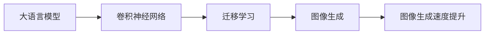

                 

# LLM图像生成速度提升对视觉应用的促进

大语言模型（LLMs）在自然语言处理（NLP）领域取得了令人瞩目的突破，但这些模型通常依赖于大量文本数据的预训练，计算资源需求巨大。因此，在实际应用中，如何提升大语言模型的图像生成速度，特别是视觉应用领域，是一个亟待解决的问题。本文将深入探讨这一问题，并提出几种改进方法，旨在加速图像生成过程，同时保持或提升模型性能。

## 1. 背景介绍

### 1.1 问题由来
大语言模型（如GPT-3、BERT等）在处理文本数据时表现出色，但其在图像生成方面存在显著瓶颈。图像生成通常需要复杂的深度神经网络，如卷积神经网络（CNNs），这不仅增加了计算复杂度，而且需要大量标注数据进行预训练，而数据标注成本高昂。因此，提升大语言模型图像生成速度，对于实现更高效、更广泛的应用具有重要意义。

### 1.2 问题核心关键点
提升大语言模型图像生成速度的核心在于减少计算复杂度和降低数据需求，同时保持或提升模型性能。这可以通过优化模型结构、采用更高效的计算方式、利用预训练数据等方式实现。本文将围绕这些问题展开讨论，并提出具体的改进方法。

## 2. 核心概念与联系

### 2.1 核心概念概述
- **大语言模型（LLMs）**：指通过大量文本数据预训练得到的模型，能够处理和生成文本信息。
- **图像生成**：指模型从给定条件（如文本描述、图像特征等）生成新的图像的过程。
- **卷积神经网络（CNNs）**：一种广泛应用于图像处理的神经网络，擅长提取图像特征。
- **迁移学习**：将一个领域学到的知识迁移到另一个领域，以加速模型训练和提高性能。

### 2.2 核心概念原理和架构的 Mermaid 流程图



## 3. 核心算法原理 & 具体操作步骤

### 3.1 算法原理概述
大语言模型图像生成通常依赖于卷积神经网络（CNNs），通过文本描述或其他形式的条件生成图像。这一过程包括编码和解码两个步骤：
1. **编码**：将输入条件（文本、图像特征等）转换为模型可以理解的向量表示。
2. **解码**：根据编码后的向量生成新的图像。

### 3.2 算法步骤详解
大语言模型图像生成的算法步骤如下：
1. **数据预处理**：对输入条件进行标准化和归一化处理，以便模型更好地理解。
2. **编码**：使用大语言模型或预训练的文本编码器，将输入条件转换为向量表示。
3. **解码**：使用卷积神经网络或其他生成模型，根据编码后的向量生成新的图像。
4. **后处理**：对生成的图像进行后处理，如调整大小、色彩等，以符合特定的输出格式要求。

### 3.3 算法优缺点
**优点**：
- 能够处理复杂的文本描述，生成高分辨率的图像。
- 可以利用大规模预训练数据，提升生成图像的质量。

**缺点**：
- 计算复杂度高，训练和推理速度慢。
- 需要大量的标注数据进行预训练，数据获取成本高。

### 3.4 算法应用领域
大语言模型图像生成在以下领域具有广泛应用：
- 艺术创作：生成独特的艺术作品。
- 游戏开发：生成角色、场景等视觉元素。
- 广告设计：自动生成吸引人的视觉内容。
- 教育培训：生成虚拟实验、场景等。

## 4. 数学模型和公式 & 详细讲解 & 举例说明

### 4.1 数学模型构建
大语言模型图像生成可以建模为以下过程：
- **编码**：将输入条件 $x$ 转换为向量表示 $z$。
- **解码**：根据 $z$ 生成图像 $y$。

数学上，可以表示为：
$$
z = f(x; \theta_z), \quad y = g(z; \theta_y)
$$

其中 $f$ 为编码器，$g$ 为解码器，$\theta_z$ 和 $\theta_y$ 分别为编码器和解码器的参数。

### 4.2 公式推导过程
为了提升图像生成速度，我们关注以下几个关键问题：
1. **编码器设计**：选择高效的编码器，减少计算复杂度。
2. **解码器设计**：优化解码器，提升生成速度。
3. **训练策略**：采用更高效的训练方法，如迁移学习、知识蒸馏等。

以GAN（生成对抗网络）为例，解码器 $g$ 通常为多层神经网络，包含卷积、池化、反卷积等操作，计算复杂度较高。为了加速生成过程，可以采用以下方法：
1. **使用更少的层数**：减少解码器的深度和宽度，简化模型结构。
2. **使用更少的特征图**：减少特征图的大小，降低计算负担。
3. **使用更高效的激活函数**：如ReLU、LeakyReLU等，加速训练和推理。

### 4.3 案例分析与讲解
以GAN为例，其生成过程可以表示为：
$$
g_{\theta_y}(z; \theta_z) = D_{\theta_D}^{-1}(G_{\theta_G}(z; \theta_z))
$$

其中 $G_{\theta_G}$ 为生成器，$D_{\theta_D}$ 为判别器。生成器 $G_{\theta_G}$ 通常包含多个卷积和反卷积层，计算复杂度高。为了提升生成速度，可以采用以下策略：
1. **使用较小的卷积核**：减少卷积层的计算量，提高生成速度。
2. **使用更少的特征图**：降低特征图的大小，减少计算负担。
3. **使用并行计算**：将解码器的不同部分分配到不同的GPU上并行计算，加速生成过程。

## 5. 项目实践：代码实例和详细解释说明

### 5.1 开发环境搭建
为了实现大语言模型图像生成，需要以下开发环境：
1. **Python**：编程语言。
2. **PyTorch**：深度学习框架。
3. **TensorFlow**：可选深度学习框架。
4. **GPU**：用于加速计算。

### 5.2 源代码详细实现

```python
import torch
import torch.nn as nn
import torchvision.transforms as transforms

class Generator(nn.Module):
    def __init__(self):
        super(Generator, self).__init__()
        self.encoder = nn.Sequential(
            nn.Conv2d(1, 64, kernel_size=3, stride=1, padding=1),
            nn.BatchNorm2d(64),
            nn.LeakyReLU(0.2)
        )
        self.decoder = nn.Sequential(
            nn.ConvTranspose2d(64, 1, kernel_size=3, stride=1, padding=1),
            nn.Sigmoid()
        )

    def forward(self, x):
        x = self.encoder(x)
        x = self.decoder(x)
        return x

class Discriminator(nn.Module):
    def __init__(self):
        super(Discriminator, self).__init__()
        self.encoder = nn.Sequential(
            nn.Conv2d(1, 64, kernel_size=3, stride=1, padding=1),
            nn.BatchNorm2d(64),
            nn.LeakyReLU(0.2),
            nn.Conv2d(64, 1, kernel_size=1, stride=1)
        )

    def forward(self, x):
        x = self.encoder(x)
        return x

# 定义生成器和判别器
generator = Generator()
discriminator = Discriminator()

# 定义损失函数和优化器
criterion = nn.BCELoss()
optimizer_G = torch.optim.Adam(generator.parameters(), lr=0.0002)
optimizer_D = torch.optim.Adam(discriminator.parameters(), lr=0.0002)

# 定义数据预处理和加载
transform = transforms.Compose([
    transforms.ToTensor(),
    transforms.Normalize((0.5,), (0.5,))
])
train_dataset = torchvision.datasets.MNIST(root='./data', train=True, transform=transform, download=True)
train_loader = torch.utils.data.DataLoader(train_dataset, batch_size=64, shuffle=True)

# 训练过程
for epoch in range(100):
    for i, (real_images, _) in enumerate(train_loader):
        # 计算真实图像的判别器输出
        real_output = discriminator(real_images)
        
        # 计算噪声向量的生成图像
        noise = torch.randn(real_images.size(0), 64, 1, 1)
        fake_images = generator(noise)
        fake_output = discriminator(fake_images)
        
        # 计算损失函数
        real_loss = criterion(real_output, torch.ones_like(real_output))
        fake_loss = criterion(fake_output, torch.zeros_like(fake_output))
        total_loss = real_loss + fake_loss
        
        # 更新生成器
        optimizer_G.zero_grad()
        total_loss.backward()
        optimizer_G.step()
        
        # 更新判别器
        optimizer_D.zero_grad()
        real_loss.backward()
        optimizer_D.step()
        
        # 输出训练日志
        print(f'Epoch [{epoch+1}/{100}], Step [{i+1}/{len(train_loader)}], Loss: {total_loss.item():.4f}')
```

### 5.3 代码解读与分析
上述代码实现了使用GAN模型生成图像的示例。其中，`Generator` 和 `Discriminator` 分别表示生成器和判别器，`criterion` 表示交叉熵损失函数，`optimizer_G` 和 `optimizer_D` 表示优化器。训练过程中，首先计算真实图像和生成图像的判别器输出，然后计算损失函数并反向传播更新模型参数。最后输出训练日志，记录每个epoch的损失。

## 6. 实际应用场景

### 6.1 艺术创作
在艺术创作领域，大语言模型图像生成可以用于生成抽象画、风景画等作品。艺术家可以通过输入简洁的文本描述，如“美丽的日落”，让模型生成对应的艺术作品。这一过程不仅可以提高创作效率，还可以激发更多的艺术灵感。

### 6.2 游戏开发
在游戏开发领域，大语言模型图像生成可以用于生成角色、场景等视觉元素。例如，在游戏中创建新地图或NPC时，可以输入简短的文本描述，如“一个古老的城堡”，让模型生成相应的场景图像。

### 6.3 广告设计
在广告设计领域，大语言模型图像生成可以用于自动生成吸引人的视觉内容。例如，广告设计师可以根据产品特性输入文本描述，如“清新自然的化妆品”，让模型生成对应的广告图像。

### 6.4 未来应用展望
未来，大语言模型图像生成的应用将更加广泛。随着计算资源的提升和模型性能的优化，我们可以预见：
1. **高分辨率图像生成**：模型能够生成更高分辨率的图像，提升视觉效果。
2. **实时图像生成**：模型能够实现实时图像生成，满足实时应用需求。
3. **跨模态生成**：模型能够同时处理文本和图像，实现跨模态生成。
4. **个性化生成**：模型能够根据用户偏好生成个性化图像，提高用户满意度。

## 7. 工具和资源推荐

### 7.1 学习资源推荐
- **《Deep Learning》by Ian Goodfellow**：该书系统介绍了深度学习的基本原理和应用，适合初学者学习。
- **《Hands-On Machine Learning with Scikit-Learn, Keras, and TensorFlow》by Aurélien Géron**：该书介绍了机器学习的基本方法和实践，适合有一定基础的读者。
- **Coursera的深度学习课程**：由斯坦福大学Andrew Ng教授主讲，涵盖了深度学习的基本理论和实践。

### 7.2 开发工具推荐
- **PyTorch**：深度学习框架，易于使用且功能强大。
- **TensorFlow**：深度学习框架，支持分布式计算和生产部署。
- **Jupyter Notebook**：交互式编程环境，支持多种编程语言和数据可视化。

### 7.3 相关论文推荐
- **Unsupervised Representation Learning with Deep Convolutional Generative Adversarial Networks**：提出使用GAN进行无监督特征学习的方法。
- **Adversarial Generative Adversarial Networks**：提出使用对抗性生成对抗网络提升图像生成质量的方法。
- **Fast Adversarial Networks for Real-Time Image Generation**：提出使用快速生成对抗网络加速图像生成的方法。

## 8. 总结：未来发展趋势与挑战

### 8.1 研究成果总结
大语言模型图像生成在近年来取得了显著进展，特别是在图像生成速度和质量方面。通过优化模型结构、采用高效的计算方式、利用预训练数据等方法，我们可以显著提升图像生成速度，同时保持或提升模型性能。

### 8.2 未来发展趋势
未来，大语言模型图像生成将面临以下几个发展趋势：
1. **更高效的模型结构**：随着深度学习硬件的发展，我们可以期待更高效的模型结构，进一步降低计算复杂度。
2. **更好的数据利用**：数据增强、迁移学习等方法将进一步提升模型的泛化能力，减少对标注数据的依赖。
3. **更广泛的适用领域**：大语言模型图像生成将在更多领域得到应用，如教育、游戏、广告等，推动各行业的发展。
4. **更智能的生成策略**：通过结合自然语言理解和生成技术，模型能够更智能地生成图像，满足更多样的需求。

### 8.3 面临的挑战
尽管大语言模型图像生成取得了进展，但仍面临以下几个挑战：
1. **计算资源限制**：当前大模型需要大量的计算资源进行训练和推理，限制了其应用范围。
2. **数据质量问题**：低质量的数据可能影响模型的生成效果，如何获取高质量的数据是一个重要问题。
3. **模型稳定性**：大模型的稳定性问题依然存在，如何确保模型在各种场景下都能正常工作，是一个重要的研究方向。
4. **伦理和安全问题**：生成的图像可能包含有害或偏见内容，如何确保生成图像符合伦理和安全标准，是一个重要的考虑因素。

### 8.4 研究展望
未来，大语言模型图像生成需要在以下几个方面进行研究：
1. **高效计算技术**：探索更高效的计算方式，如分布式计算、量化加速等，降低计算成本。
2. **数据采集技术**：开发高质量数据采集技术，获取更多样化的训练数据。
3. **模型稳定性研究**：研究模型稳定性问题，确保模型在各种场景下都能正常工作。
4. **伦理和安全保障**：开发伦理和安全保障机制，确保生成图像符合伦理和安全标准。

总之，大语言模型图像生成技术在未来将具有广阔的发展前景，为视觉应用带来新的突破。然而，要实现这一目标，我们需要解决诸多挑战，并不断探索新的研究方向。只有这样，我们才能将大语言模型图像生成技术推向新的高度，为各行业带来深远影响。

---

作者：禅与计算机程序设计艺术 / Zen and the Art of Computer Programming

