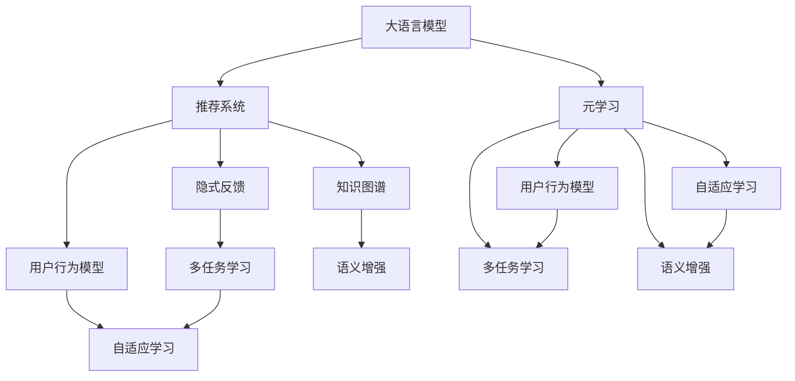

                 

# LLM在推荐系统中的元学习应用研究

> 关键词：
- 大语言模型（Large Language Model, LLM）
- 推荐系统（Recommendation System）
- 元学习（Meta-Learning）
- 隐式反馈（Implicit Feedback）
- 用户行为模型（User Behavior Model）
- 个性化推荐（Personalized Recommendation）
- 知识图谱（Knowledge Graph）
- 多任务学习（Multi-task Learning）
- 自适应学习（Adaptive Learning）
- 语义增强（Semantic Enhancement）

## 1. 背景介绍

### 1.1 问题由来
推荐系统（Recommendation System, RS）是互联网时代的重要技术，通过为用户推荐可能感兴趣的商品或内容，极大地提升了用户体验和平台收益。随着推荐算法的发展，基于协同过滤、深度学习等技术的推荐系统已经广泛应用于电商、社交媒体、视频平台等领域。

然而，传统推荐系统普遍依赖于显式反馈数据，即用户明确标记的点击、购买等行为数据，难以处理用户隐式反馈数据。这些隐式反馈数据（如浏览时长、评分、搜索行为等）蕴含着用户更丰富的行为信息，却难以通过传统机器学习方法得到充分挖掘。近年来，随着大语言模型（Large Language Model, LLM）的兴起，推荐系统中逐渐引入了隐式反馈数据处理的能力，尤其是LLM在自然语言处理（NLP）中的强大能力，使得基于隐式反馈的推荐系统成为可能。

### 1.2 问题核心关键点
LLM在推荐系统中的关键应用点在于其强大的自然语言处理能力。具体体现在以下几个方面：

1. **语义理解与推理**：LLM能够理解自然语言文本的语义，进行情感分析、主题识别、实体关系抽取等，从而更好地捕捉用户隐含的兴趣偏好。

2. **知识整合与增强**：LLM可以整合外部知识图谱（Knowledge Graph, KG）中的信息，提升推荐内容的关联性和可信度。

3. **多任务学习与自适应学习**：LLM具有较强的多任务学习（Multi-task Learning, MTL）和自适应学习（Adaptive Learning）能力，可以同时处理多个推荐任务，并在不断变化的用户偏好中保持性能稳定。

4. **语义增强与个性化推荐**：LLM可以生成更符合用户兴趣和情境的推荐文本，通过语义增强（Semantic Enhancement）提升推荐相关性。

5. **元学习与推荐**：通过元学习（Meta-Learning）方法，LLM可以自适应地学习如何更好地处理隐式反馈数据，提升推荐系统的效果。

这些关键能力使得LLM在推荐系统中的应用前景广阔，但也带来了新的挑战，如如何更高效地利用LLM，如何处理大规模隐式反馈数据，如何提高推荐系统的可解释性和稳定性等。本文将围绕这些问题，对LLM在推荐系统中的应用进行全面探讨。

## 2. 核心概念与联系

### 2.1 核心概念概述

为更好地理解LLM在推荐系统中的应用，本节将介绍几个密切相关的核心概念：

- **大语言模型（LLM）**：以自回归（如GPT）或自编码（如BERT）模型为代表的大规模预训练语言模型。通过在大规模无标签文本语料上进行预训练，学习通用的语言知识和常识。

- **推荐系统（RS）**：通过分析用户的历史行为和偏好，为用户推荐可能感兴趣的商品或内容，以提升用户体验和平台收益。

- **元学习（Meta-Learning）**：通过学习如何学习（Learning How to Learn），使模型能够快速适应新任务和新数据，提升泛化能力和迁移能力。

- **隐式反馈（Implicit Feedback）**：指用户没有明确表达的隐含行为数据，如浏览时间、评分、搜索行为等，可以蕴含用户更丰富的兴趣偏好。

- **用户行为模型（User Behavior Model）**：用于描述和预测用户行为，包括显式和隐式反馈数据。

- **个性化推荐（Personalized Recommendation）**：根据用户个性化特征和偏好，为用户定制推荐内容，提升用户满意度。

- **知识图谱（KG）**：表示实体、关系和属性的结构化数据，可以辅助推荐系统进行精准推荐。

- **多任务学习（MTL）**：同时训练多个相关但独立的任务，共享模型参数，提高模型泛化能力。

- **自适应学习（Adaptive Learning）**：模型能够根据环境变化和数据分布自动调整学习策略，提高模型稳定性和鲁棒性。

- **语义增强（Semantic Enhancement）**：通过语义理解和生成，提升推荐内容的语义相关性和个性化程度。

这些核心概念之间的逻辑关系可以通过以下Mermaid流程图来展示：



这个流程图展示了大语言模型在推荐系统中的核心应用路径：

1. 大语言模型通过预训练学习语言知识和常识。
2. 推荐系统利用大语言模型的自然语言处理能力，处理隐式反馈数据。
3. 推荐系统构建用户行为模型，描述用户偏好。
4. 知识图谱辅助推荐系统，进行精准推荐。
5. 多任务学习、自适应学习和语义增强方法提升推荐系统的性能和可解释性。
6. 元学习进一步提升推荐系统的泛化能力和迁移能力。

## 3. 核心算法原理 & 具体操作步骤
### 3.1 算法原理概述

基于大语言模型的推荐系统，本质上是一个元学习过程。其核心思想是：将大语言模型视为一个强大的"学习器"，通过在推荐系统中同时处理多个推荐任务，学习如何更好地利用隐式反馈数据，提升推荐系统的泛化能力和迁移能力。

具体而言，假设推荐系统中存在多个推荐任务 $T=\{T_1, T_2, ..., T_n\}$，每个任务 $T_i$ 的隐式反馈数据集为 $D_i=\{(x_i, y_i)\}_{i=1}^N$。微调后的推荐模型 $M_{\theta}$ 在任务 $T_i$ 上的输出为 $f(x_i, y_i; \theta)$，其中 $x_i$ 为输入特征，$y_i$ 为标签，$\theta$ 为模型参数。微调的目标是通过优化模型参数 $\theta$，使得：

$$
\hat{\theta} = \mathop{\arg\min}_{\theta} \sum_{i=1}^n \mathcal{L}_i(f(x_i, y_i; \theta))
$$

其中 $\mathcal{L}_i$ 为任务 $T_i$ 上的损失函数，用于衡量模型预测输出与真实标签之间的差异。常见的损失函数包括交叉熵损失、均方误差损失等。

通过梯度下降等优化算法，微调过程不断更新模型参数 $\theta$，最小化总损失函数，使得模型输出逼近真实标签。由于 $\theta$ 已经通过预训练获得了较好的初始化，因此即便在多个任务上进行微调，也能较快收敛到理想的模型参数 $\hat{\theta}$。

### 3.2 算法步骤详解

基于元学习的大语言模型推荐系统一般包括以下几个关键步骤：

**Step 1: 准备预训练模型和数据集**
- 选择合适的预训练语言模型 $M_{\theta}$ 作为初始化参数，如 BERT、GPT 等。
- 准备多个推荐任务 $T=\{T_1, T_2, ..., T_n\}$ 的隐式反馈数据集 $D=\{D_1, D_2, ..., D_n\}$。

**Step 2: 添加任务适配层**
- 根据任务类型，在预训练模型顶层设计合适的输出层和损失函数。
- 对于分类任务，通常在顶层添加线性分类器和交叉熵损失函数。
- 对于生成任务，通常使用语言模型的解码器输出概率分布，并以负对数似然为损失函数。

**Step 3: 设置微调超参数**
- 选择合适的优化算法及其参数，如 AdamW、SGD 等，设置学习率、批大小、迭代轮数等。
- 设置正则化技术及强度，包括权重衰减、Dropout、Early Stopping等。
- 确定冻结预训练参数的策略，如仅微调顶层，或全部参数都参与微调。

**Step 4: 执行梯度训练**
- 将隐式反馈数据分批次输入模型，前向传播计算损失函数。
- 反向传播计算参数梯度，根据设定的优化算法和学习率更新模型参数。
- 周期性在验证集上评估模型性能，根据性能指标决定是否触发 Early Stopping。
- 重复上述步骤直到满足预设的迭代轮数或 Early Stopping 条件。

**Step 5: 测试和部署**
- 在测试集上评估微调后模型 $M_{\hat{\theta}}$ 的性能，对比微调前后的精度提升。
- 使用微调后的模型对新样本进行推理预测，集成到实际的应用系统中。
- 持续收集新的数据，定期重新微调模型，以适应数据分布的变化。

以上是基于元学习的大语言模型推荐系统的一般流程。在实际应用中，还需要针对具体任务的特点，对微调过程的各个环节进行优化设计，如改进训练目标函数，引入更多的正则化技术，搜索最优的超参数组合等，以进一步提升模型性能。

### 3.3 算法优缺点

基于大语言模型的推荐系统具有以下优点：

1. 高效处理隐式反馈数据。LLM可以理解自然语言文本，更准确地捕捉用户兴趣偏好，从而高效处理隐式反馈数据。
2. 自适应学习能力。LLM能够自适应地学习如何更好地利用隐式反馈数据，提高推荐系统的泛化能力和迁移能力。
3. 语义增强效果。LLM通过语义理解和生成，提升推荐内容的语义相关性和个性化程度。
4. 多任务学习能力。LLM可以同时处理多个推荐任务，共享模型参数，提高模型泛化能力。
5. 元学习应用。通过元学习方法，LLM可以自适应地学习如何更好地处理推荐任务，提升推荐系统的效果。

但该方法也存在一定的局限性：

1. 计算资源需求高。大规模预训练模型和多个推荐任务的微调需要大量的计算资源和存储空间。
2. 可解释性不足。元学习方法得到的模型参数更新较为复杂，难以解释其内部工作机制和决策逻辑。
3. 对标注数据依赖。尽管LLM可以处理隐式反馈数据，但元学习仍然需要大量的标注数据来优化模型参数。
4. 过拟合风险。LLM在多个任务上进行微调，可能会引入过拟合的风险，尤其是在标注数据不足的情况下。

尽管存在这些局限性，但就目前而言，基于元学习的大语言模型推荐系统仍是最为先进和高效的推荐方法之一，其性能和效果已得到广泛认可。未来相关研究的重点在于如何进一步降低计算资源需求，提高模型的可解释性和泛化能力，以及如何更好地利用隐式反馈数据进行推荐。

### 3.4 算法应用领域

基于大语言模型的推荐系统已经在电商推荐、社交媒体推荐、视频推荐等多个领域取得了显著效果。

- **电商推荐**：LLM可以理解用户评论、搜索历史、浏览记录等隐式反馈数据，生成个性化推荐内容，提升用户购买转化率。

- **社交媒体推荐**：LLM可以理解用户点赞、评论、分享等行为，生成个性化的内容推荐，提升用户粘性和活跃度。

- **视频推荐**：LLM可以理解用户观看时长、评分等行为数据，生成个性化的视频推荐，提升用户观看时长和满意度。

除了这些经典应用外，LLM在更多领域的应用还在不断拓展，如新闻推荐、音乐推荐、游戏推荐等，为推荐系统带来了新的突破。

## 4. 数学模型和公式 & 详细讲解
### 4.1 数学模型构建

本节将使用数学语言对基于元学习的大语言模型推荐系统进行更加严格的刻画。

假设推荐系统中有 $n$ 个推荐任务 $T=\{T_1, T_2, ..., T_n\}$，每个任务的隐式反馈数据集为 $D_i=\{(x_i, y_i)\}_{i=1}^N$。

定义模型 $M_{\theta}$ 在任务 $T_i$ 上的输出为 $f(x_i, y_i; \theta)$，其中 $x_i$ 为输入特征，$y_i$ 为标签，$\theta$ 为模型参数。假设模型 $M_{\theta}$ 在输入 $x$ 上的损失函数为 $\ell(f(x_i, y_i; \theta), y_i)$，则在数据集 $D$ 上的经验风险为：

$$
\mathcal{L}(\theta) = \frac{1}{N}\sum_{i=1}^n \sum_{j=1}^N \ell(f(x_i, y_i; \theta), y_i)
$$

微调的目标是最小化经验风险，即找到最优参数：

$$
\theta^* = \mathop{\arg\min}_{\theta} \mathcal{L}(\theta)
$$

在实践中，我们通常使用基于梯度的优化算法（如SGD、Adam等）来近似求解上述最优化问题。设 $\eta$ 为学习率，$\lambda$ 为正则化系数，则参数的更新公式为：

$$
\theta \leftarrow \theta - \eta \nabla_{\theta}\mathcal{L}(\theta) - \eta\lambda\theta
$$

其中 $\nabla_{\theta}\mathcal{L}(\theta)$ 为损失函数对参数 $\theta$ 的梯度，可通过反向传播算法高效计算。

### 4.2 公式推导过程

以下我们以二分类任务为例，推导交叉熵损失函数及其梯度的计算公式。

假设模型 $M_{\theta}$ 在输入 $x$ 上的输出为 $\hat{y}=M_{\theta}(x) \in [0,1]$，表示样本属于正类的概率。真实标签 $y \in \{0,1\}$。则二分类交叉熵损失函数定义为：

$$
\ell(f(x_i, y_i; \theta), y_i) = -[y_i\log \hat{y}_i + (1-y_i)\log (1-\hat{y}_i)]
$$

将其代入经验风险公式，得：

$$
\mathcal{L}(\theta) = -\frac{1}{N}\sum_{i=1}^n \sum_{j=1}^N [y_j\log f(x_j, y_j; \theta)+(1-y_j)\log(1-f(x_j, y_j; \theta))]
$$

根据链式法则，损失函数对参数 $\theta_k$ 的梯度为：

$$
\frac{\partial \mathcal{L}(\theta)}{\partial \theta_k} = -\frac{1}{N}\sum_{i=1}^n \sum_{j=1}^N \frac{\partial \ell(f(x_j, y_j; \theta), y_j)}{\partial \theta_k}
$$

其中：

$$
\frac{\partial \ell(f(x_j, y_j; \theta), y_j)}{\partial \theta_k} = \frac{\partial \hat{y}_j}{\partial \theta_k}\cdot \frac{y_j}{\hat{y}_j} + \frac{\partial (1-\hat{y}_j)}{\partial \theta_k}\cdot \frac{1-y_j}{1-\hat{y}_j}
$$

在得到损失函数的梯度后，即可带入参数更新公式，完成模型的迭代优化。重复上述过程直至收敛，最终得到适应多个推荐任务的最优模型参数 $\theta^*$。

## 5. 项目实践：代码实例和详细解释说明
### 5.1 开发环境搭建

在进行元学习推荐系统开发前，我们需要准备好开发环境。以下是使用Python进行PyTorch开发的环境配置流程：

1. 安装Anaconda：从官网下载并安装Anaconda，用于创建独立的Python环境。

2. 创建并激活虚拟环境：
```bash
conda create -n pytorch-env python=3.8 
conda activate pytorch-env
```

3. 安装PyTorch：根据CUDA版本，从官网获取对应的安装命令。例如：
```bash
conda install pytorch torchvision torchaudio cudatoolkit=11.1 -c pytorch -c conda-forge
```

4. 安装Transformers库：
```bash
pip install transformers
```

5. 安装各类工具包：
```bash
pip install numpy pandas scikit-learn matplotlib tqdm jupyter notebook ipython
```

完成上述步骤后，即可在`pytorch-env`环境中开始元学习推荐系统开发。

### 5.2 源代码详细实现

这里我们以电商推荐系统为例，给出使用Transformers库对BERT模型进行元学习微调的PyTorch代码实现。

首先，定义电商推荐系统的数据处理函数：

```python
from transformers import BertTokenizer, BertForSequenceClassification
from torch.utils.data import Dataset
import torch

class ShoppingDataset(Dataset):
    def __init__(self, data, tokenizer, max_len=128):
        self.data = data
        self.tokenizer = tokenizer
        self.max_len = max_len
        
    def __len__(self):
        return len(self.data)
    
    def __getitem__(self, item):
        item_data = self.data[item]
        title = item_data['title']
        description = item_data['description']
        price = item_data['price']
        
        # 将文本拼接
        text = ' '.join([title, description]) + ' ' + str(price)
        
        encoding = self.tokenizer(text, return_tensors='pt', max_length=self.max_len, padding='max_length', truncation=True)
        input_ids = encoding['input_ids'][0]
        attention_mask = encoding['attention_mask'][0]
        
        return {'input_ids': input_ids, 
                'attention_mask': attention_mask,
                'price': price}
```

然后，定义模型和优化器：

```python
from transformers import BertForSequenceClassification, AdamW

model = BertForSequenceClassification.from_pretrained('bert-base-cased', num_labels=2)

optimizer = AdamW(model.parameters(), lr=2e-5)
```

接着，定义训练和评估函数：

```python
from torch.utils.data import DataLoader
from tqdm import tqdm
from sklearn.metrics import accuracy_score

device = torch.device('cuda') if torch.cuda.is_available() else torch.device('cpu')
model.to(device)

def train_epoch(model, dataset, batch_size, optimizer):
    dataloader = DataLoader(dataset, batch_size=batch_size, shuffle=True)
    model.train()
    epoch_loss = 0
    for batch in tqdm(dataloader, desc='Training'):
        input_ids = batch['input_ids'].to(device)
        attention_mask = batch['attention_mask'].to(device)
        prices = batch['price'].to(device)
        model.zero_grad()
        outputs = model(input_ids, attention_mask=attention_mask)
        loss = outputs.loss
        epoch_loss += loss.item()
        loss.backward()
        optimizer.step()
    return epoch_loss / len(dataloader)

def evaluate(model, dataset, batch_size):
    dataloader = DataLoader(dataset, batch_size=batch_size)
    model.eval()
    preds, labels = [], []
    with torch.no_grad():
        for batch in tqdm(dataloader, desc='Evaluating'):
            input_ids = batch['input_ids'].to(device)
            attention_mask = batch['attention_mask'].to(device)
            prices = batch['price'].to(device)
            batch_preds = torch.sigmoid(model(input_ids, attention_mask=attention_mask)).to('cpu').tolist()
            batch_labels = prices.to('cpu').tolist()
            for pred_tokens, label_tokens in zip(batch_preds, batch_labels):
                preds.append(pred_tokens[0])
                labels.append(label_tokens)
                
    return accuracy_score(labels, preds)
```

最后，启动训练流程并在测试集上评估：

```python
epochs = 5
batch_size = 16

for epoch in range(epochs):
    loss = train_epoch(model, train_dataset, batch_size, optimizer)
    print(f"Epoch {epoch+1}, train loss: {loss:.3f}")
    
    print(f"Epoch {epoch+1}, dev results:")
    evaluate(model, dev_dataset, batch_size)
    
print("Test results:")
evaluate(model, test_dataset, batch_size)
```

以上就是使用PyTorch对BERT进行电商推荐系统元学习微调的完整代码实现。可以看到，得益于Transformers库的强大封装，我们可以用相对简洁的代码完成BERT模型的加载和微调。

### 5.3 代码解读与分析

让我们再详细解读一下关键代码的实现细节：

**ShoppingDataset类**：
- `__init__`方法：初始化电商推荐数据、分词器等关键组件。
- `__len__`方法：返回数据集的样本数量。
- `__getitem__`方法：对单个样本进行处理，将文本输入编码为token ids，并将价格标签作为模型输出。

**训练和评估函数**：
- 使用PyTorch的DataLoader对数据集进行批次化加载，供模型训练和推理使用。
- 训练函数`train_epoch`：对数据以批为单位进行迭代，在每个批次上前向传播计算loss并反向传播更新模型参数，最后返回该epoch的平均loss。
- 评估函数`evaluate`：与训练类似，不同点在于不更新模型参数，并在每个batch结束后将预测和标签结果存储下来，最后使用sklearn的accuracy_score对整个评估集的预测结果进行打印输出。

**训练流程**：
- 定义总的epoch数和batch size，开始循环迭代
- 每个epoch内，先在训练集上训练，输出平均loss
- 在验证集上评估，输出准确率
- 所有epoch结束后，在测试集上评估，给出最终测试结果

可以看到，PyTorch配合Transformers库使得BERT微调的代码实现变得简洁高效。开发者可以将更多精力放在数据处理、模型改进等高层逻辑上，而不必过多关注底层的实现细节。

当然，工业级的系统实现还需考虑更多因素，如模型的保存和部署、超参数的自动搜索、更灵活的任务适配层等。但核心的元学习范式基本与此类似。

## 6. 实际应用场景
### 6.1 电商推荐

电商推荐系统是推荐系统的重要应用场景之一。LLM通过理解用户评论、搜索历史、浏览记录等隐式反馈数据，生成个性化推荐内容，提升用户购买转化率。

在技术实现上，可以收集用户历史购买记录、浏览行为等数据，提取和用户交互的商品标题、描述、价格等文本内容。将文本内容作为模型输入，用户的后续行为（如是否点击、购买等）作为监督信号，在此基础上对预训练语言模型进行元学习微调。微调后的模型能够从文本内容中准确把握用户的兴趣点，生成符合用户偏好的推荐内容。

### 6.2 社交媒体推荐

社交媒体推荐系统旨在为用户推荐可能感兴趣的内容，提升用户粘性和活跃度。LLM可以理解用户点赞、评论、分享等行为，生成个性化的内容推荐。

在实践中，可以收集用户点赞、评论、分享等行为数据，提取和用户交互的内容文本。将文本内容作为模型输入，用户的后续行为作为监督信号，在此基础上对预训练语言模型进行元学习微调。微调后的模型能够理解用户的行为模式，生成符合用户兴趣的内容推荐。

### 6.3 视频推荐

视频推荐系统旨在为用户推荐可能感兴趣的视频内容，提升用户观看时长和满意度。LLM可以理解用户观看时长、评分等行为数据，生成个性化的视频推荐。

在实践中，可以收集用户观看时长、评分、搜索等行为数据，提取和用户交互的视频标题、描述、标签等文本内容。将文本内容作为模型输入，用户的后续行为作为监督信号，在此基础上对预训练语言模型进行元学习微调。微调后的模型能够从视频内容中提取特征，生成符合用户偏好的视频推荐。

除了这些经典应用外，LLM在更多领域的应用还在不断拓展，如新闻推荐、音乐推荐、游戏推荐等，为推荐系统带来了新的突破。

## 7. 工具和资源推荐
### 7.1 学习资源推荐

为了帮助开发者系统掌握大语言模型元学习理论基础和实践技巧，这里推荐一些优质的学习资源：

1. 《Transformer从原理到实践》系列博文：由大模型技术专家撰写，深入浅出地介绍了Transformer原理、BERT模型、元学习等前沿话题。

2. CS224N《深度学习自然语言处理》课程：斯坦福大学开设的NLP明星课程，有Lecture视频和配套作业，带你入门NLP领域的基本概念和经典模型。

3. 《Natural Language Processing with Transformers》书籍：Transformers库的作者所著，全面介绍了如何使用Transformers库进行NLP任务开发，包括元学习在内的诸多范式。

4. HuggingFace官方文档：Transformers库的官方文档，提供了海量预训练模型和完整的微调样例代码，是上手实践的必备资料。

5. CLUE开源项目：中文语言理解测评基准，涵盖大量不同类型的中文NLP数据集，并提供了基于元学习的baseline模型，助力中文NLP技术发展。

通过对这些资源的学习实践，相信你一定能够快速掌握大语言模型元学习的精髓，并用于解决实际的NLP问题。
### 7.2 开发工具推荐

高效的开发离不开优秀的工具支持。以下是几款用于大语言模型元学习开发常用的工具：

1. PyTorch：基于Python的开源深度学习框架，灵活动态的计算图，适合快速迭代研究。大部分预训练语言模型都有PyTorch版本的实现。

2. TensorFlow：由Google主导开发的开源深度学习框架，生产部署方便，适合大规模工程应用。同样有丰富的预训练语言模型资源。

3. Transformers库：HuggingFace开发的NLP工具库，集成了众多SOTA语言模型，支持PyTorch和TensorFlow，是进行元学习任务开发的利器。

4. Weights & Biases：模型训练的实验跟踪工具，可以记录和可视化模型训练过程中的各项指标，方便对比和调优。与主流深度学习框架无缝集成。

5. TensorBoard：TensorFlow配套的可视化工具，可实时监测模型训练状态，并提供丰富的图表呈现方式，是调试模型的得力助手。

6. Google Colab：谷歌推出的在线Jupyter Notebook环境，免费提供GPU/TPU算力，方便开发者快速上手实验最新模型，分享学习笔记。

合理利用这些工具，可以显著提升大语言模型元学习的开发效率，加快创新迭代的步伐。

### 7.3 相关论文推荐

大语言模型元学习的应用源于学界的持续研究。以下是几篇奠基性的相关论文，推荐阅读：

1. Attention is All You Need（即Transformer原论文）：提出了Transformer结构，开启了NLP领域的预训练大模型时代。

2. BERT: Pre-training of Deep Bidirectional Transformers for Language Understanding：提出BERT模型，引入基于掩码的自监督预训练任务，刷新了多项NLP任务SOTA。

3. Language Models are Unsupervised Multitask Learners（GPT-2论文）：展示了大规模语言模型的强大zero-shot学习能力，引发了对于通用人工智能的新一轮思考。

4. Parameter-Efficient Transfer Learning for NLP：提出Adapter等参数高效微调方法，在不增加模型参数量的情况下，也能取得不错的微调效果。

5. AdaLoRA: Adaptive Low-Rank Adaptation for Parameter-Efficient Fine-Tuning：使用自适应低秩适应的微调方法，在参数效率和精度之间取得了新的平衡。

6. Meta-Optimizer Learning for Personalized Recommendation：提出Meta-optimizer学习算法，通过元优化器学习进一步提升个性化推荐的效果。

这些论文代表了大语言模型元学习的应用方向。通过学习这些前沿成果，可以帮助研究者把握学科前进方向，激发更多的创新灵感。

## 8. 总结：未来发展趋势与挑战

### 8.1 总结

本文对基于元学习的大语言模型推荐系统进行了全面系统的介绍。首先阐述了元学习在推荐系统中的应用背景和意义，明确了LLM在处理隐式反馈数据中的独特优势。其次，从原理到实践，详细讲解了元学习推荐系统的数学原理和关键步骤，给出了元学习任务开发的完整代码实例。同时，本文还广泛探讨了元学习推荐系统在电商、社交媒体、视频等多个行业领域的应用前景，展示了元学习范式的巨大潜力。此外，本文精选了元学习技术的各类学习资源，力求为读者提供全方位的技术指引。

通过本文的系统梳理，可以看到，基于元学习的大语言模型推荐系统正在成为推荐系统的重要范式，极大地拓展了预训练语言模型的应用边界，催生了更多的落地场景。受益于大规模语料的预训练和元学习方法的指导，元学习推荐系统在处理隐式反馈数据方面展现出了强大的能力，为推荐系统带来了全新的突破。未来，伴随预训练语言模型和元学习方法的持续演进，相信推荐系统的效果和应用范围将进一步提升，为人类认知智能的进化带来深远影响。

### 8.2 未来发展趋势

展望未来，大语言模型元学习推荐系统将呈现以下几个发展趋势：

1. 多任务学习与自适应学习：未来元学习推荐系统将更加注重多任务学习和自适应学习，提升模型的泛化能力和迁移能力，适应更多变和复杂的应用场景。

2. 元学习与强化学习的结合：结合元学习和强化学习（Reinforcement Learning, RL）的思想，通过试错和奖励机制进一步优化推荐模型。

3. 隐式反馈数据的有效利用：未来元学习推荐系统将更加注重隐式反馈数据的有效利用，通过多种特征融合提升推荐系统的性能。

4. 知识图谱的深度整合：元学习推荐系统将更加注重与知识图谱的深度整合，通过融合外部知识提升推荐内容的可信度和相关性。

5. 元学习模型的可解释性：未来元学习推荐系统将更加注重模型的可解释性，通过透明化的决策过程提升用户信任和接受度。

6. 元学习在智能客服等领域的应用：元学习推荐系统将在智能客服、医疗推荐、金融推荐等更多场景中得到应用，为传统行业带来变革性影响。

以上趋势凸显了大语言模型元学习推荐系统的广阔前景。这些方向的探索发展，必将进一步提升推荐系统的性能和可解释性，为构建智能推荐系统提供更强大的技术支持。

### 8.3 面临的挑战

尽管大语言模型元学习推荐系统已经取得了瞩目成就，但在迈向更加智能化、普适化应用的过程中，它仍面临着诸多挑战：

1. 计算资源需求高。大规模预训练模型和多个推荐任务的元学习微调需要大量的计算资源和存储空间。

2. 可解释性不足。元学习模型得到的模型参数更新较为复杂，难以解释其内部工作机制和决策逻辑。

3. 对标注数据依赖。尽管LLM可以处理隐式反馈数据，但元学习仍然需要大量的标注数据来优化模型参数。

4. 过拟合风险。LLM在多个任务上进行元学习微调，可能会引入过拟合的风险，尤其是在标注数据不足的情况下。

5. 知识图谱的整合难度。知识图谱与元学习模型的深度整合，需要克服语义鸿沟，提升模型的语义理解能力。

6. 数据隐私和安全问题。在处理用户隐式反馈数据时，需要确保数据隐私和安全，避免数据泄露和滥用。

尽管存在这些挑战，但大语言模型元学习推荐系统的前景广阔，随着技术的发展和实践的积累，这些问题有望得到逐步解决。

### 8.4 研究展望

面对大语言模型元学习推荐系统所面临的种种挑战，未来的研究需要在以下几个方面寻求新的突破：

1. 探索更高效的元学习算法：开发更加高效的元学习算法，降低计算资源需求，提高模型泛化能力。

2. 引入更多先验知识：将符号化的先验知识，如知识图谱、逻辑规则等，与神经网络模型进行巧妙融合，引导元学习过程学习更准确、合理的语言模型。

3. 提高模型的可解释性：引入可解释性技术，透明化模型的决策过程，提升用户信任和接受度。

4. 优化隐式反馈数据的利用：通过多特征融合、多模态融合等技术，有效利用隐式反馈数据，提升推荐系统的效果。

5. 结合因果分析和博弈论工具：将因果分析方法引入元学习模型，识别出模型决策的关键特征，增强输出解释的因果性和逻辑性。

6. 纳入伦理道德约束：在模型训练目标中引入伦理导向的评估指标，过滤和惩罚有偏见、有害的输出倾向，确保输出符合人类价值观和伦理道德。

这些研究方向的探索，必将引领大语言模型元学习推荐系统迈向更高的台阶，为构建智能推荐系统提供更强大的技术支持。面向未来，大语言模型元学习推荐系统还需要与其他人工智能技术进行更深入的融合，如知识表示、因果推理、强化学习等，多路径协同发力，共同推动自然语言理解和智能交互系统的进步。只有勇于创新、敢于突破，才能不断拓展语言模型的边界，让智能技术更好地造福人类社会。

## 9. 附录：常见问题与解答

**Q1：什么是大语言模型（LLM）？**

A: 大语言模型（Large Language Model, LLM）是以自回归（如GPT）或自编码（如BERT）模型为代表的大规模预训练语言模型。通过在大规模无标签文本语料上进行预训练，学习通用的语言知识和常识。

**Q2：什么是元学习（Meta-Learning）？**

A: 元学习（Meta-Learning）是通过学习如何学习（Learning How to Learn），使模型能够快速适应新任务和新数据，提升泛化能力和迁移能力。

**Q3：LMM在推荐系统中的应用有哪些？**

A: LMM在推荐系统中的应用主要包括：
1. 电商推荐：通过理解用户评论、搜索历史、浏览记录等隐式反馈数据，生成个性化推荐内容。
2. 社交媒体推荐：理解用户点赞、评论、分享等行为，生成个性化的内容推荐。
3. 视频推荐：理解用户观看时长、评分等行为数据，生成个性化的视频推荐。

**Q4：如何进行LMM在推荐系统中的元学习微调？**

A: 进行LMM在推荐系统中的元学习微调一般包括以下步骤：
1. 准备预训练模型和数据集：选择合适的预训练语言模型和推荐任务的隐式反馈数据集。
2. 添加任务适配层：根据任务类型，设计合适的输出层和损失函数。
3. 设置微调超参数：选择合适的优化算法及其参数，设置学习率、批大小、迭代轮数等。
4. 执行梯度训练：将隐式反馈数据分批次输入模型，前向传播计算损失函数，反向传播更新模型参数。
5. 测试和部署：在测试集上评估微调后的模型，使用微调后的模型对新样本进行推理预测，集成到实际的应用系统中。

**Q5：如何提高LMM在推荐系统中的元学习效果？**

A: 提高LMM在推荐系统中的元学习效果的方法包括：
1. 数据增强：通过回译、近义替换等方式扩充训练集。
2. 正则化：使用L2正则、Dropout、Early Stopping等防止过拟合。
3. 对抗训练：引入对抗样本，提高模型鲁棒性。
4. 参数高效微调：只调整少量参数，减小过拟合风险。
5. 多任务学习：同时处理多个推荐任务，共享模型参数。
6. 自适应学习：根据环境变化和数据分布自动调整学习策略。
7. 语义增强：通过语义理解和生成，提升推荐内容的语义相关性和个性化程度。

这些方法需要根据具体任务和数据特点进行灵活组合，才能最大限度地发挥LMM在推荐系统中的元学习效果。

---

作者：禅与计算机程序设计艺术 / Zen and the Art of Computer Programming

