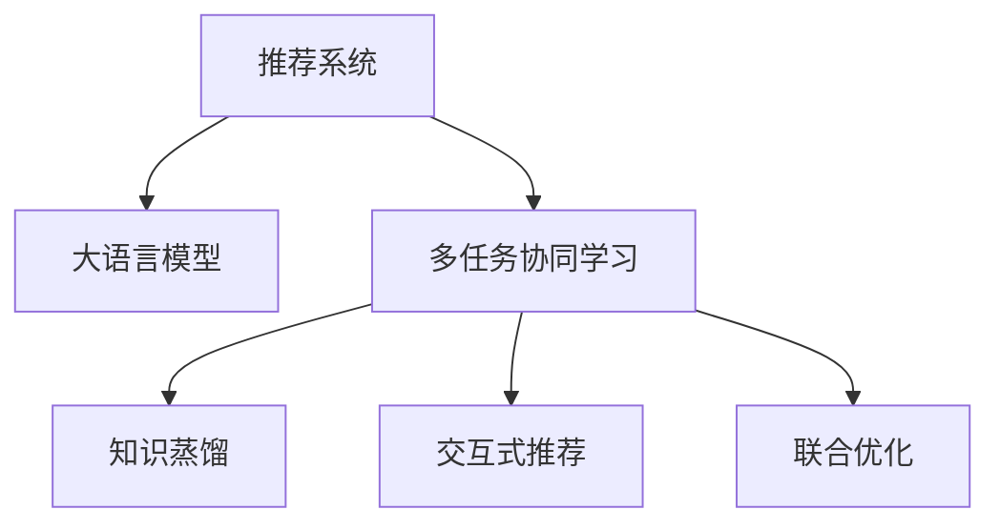

                 

# LLM在推荐系统中的多任务协同学习

> 关键词：

## 1. 背景介绍

在推荐系统（Recommender System）领域，用户行为数据的稀疏性、长尾效应以及动态性等特点，使得传统的协同过滤（Collaborative Filtering, CF）算法面临诸多挑战。为提升推荐效果，深度学习尤其是大语言模型（Large Language Model, LLM）的引入，给推荐系统带来了革命性变革。通过在LLM上进行预训练，构建用户-物品的表示，融合用户行为数据，能够实现高性能的推荐任务。

然而，LLM在推荐系统中的应用，更多聚焦于推荐单一目标任务。如何将多任务协同学习（Multi-task Learning, MTL）引入推荐系统，充分利用LLM的强大能力，同时优化多个任务性能，成为一个值得探索的方向。本文档将从背景介绍、核心概念、算法原理、项目实践等多个角度，对LLM在推荐系统中的多任务协同学习进行系统阐述。

## 2. 核心概念与联系

### 2.1 核心概念概述

为更好地理解LLM在推荐系统中的多任务协同学习，本节将介绍几个密切相关的核心概念：

- 推荐系统（Recommender System）：用于帮助用户发现感兴趣物品的系统。传统方法包括基于用户的协同过滤、基于物品的协同过滤、基于内容的推荐等。近年来，通过深度学习和大语言模型，推荐系统在个性化推荐、冷启动推荐、长尾推荐等方面取得了显著进步。

- 大语言模型（Large Language Model, LLM）：以自回归（如GPT）或自编码（如BERT）模型为代表的大规模预训练语言模型。通过在大规模无标签文本语料上进行预训练，学习通用的语言表示，具备强大的语言理解和生成能力。

- 多任务协同学习（Multi-task Learning, MTL）：指在多个相关任务上，共享同一组模型的目标，通过协同优化，提升所有任务性能的机器学习方法。在推荐系统中，常见任务包括推荐排序、商品属性分类、用户画像构建等。

- 知识蒸馏（Knowledge Distillation）：通过将教师模型的知识迁移到学生模型中，提升学生模型性能的策略。知识蒸馏在推荐系统中的应用，可以提升预训练模型的泛化能力，同时避免参数过拟合。

- 交互式推荐（Interactive Recommendation）：通过用户的即时反馈，动态调整推荐策略，实现更个性化的推荐服务。在多任务协同学习框架下，可进一步优化用户画像和推荐内容，提升用户体验。

- 联合优化（Joint Optimization）：在模型训练过程中，同时优化多个任务的损失函数，协同提升任务性能。联合优化在多任务协同学习中的应用，可以提升模型的泛化能力，增强系统的稳定性。

这些核心概念之间的逻辑关系可以通过以下Mermaid流程图来展示：



这个流程图展示了大语言模型在推荐系统中的核心概念及其之间的关系：

1. 推荐系统通过大语言模型进行用户-物品表示学习，构建推荐模型。
2. 多任务协同学习在推荐系统中，利用多个任务共享同一组模型，协同优化性能。
3. 知识蒸馏通过教师-学生模型设计，增强推荐模型的泛化能力。
4. 交互式推荐通过用户反馈，动态调整推荐内容，提升推荐效果。
5. 联合优化在模型训练中，同时优化多个任务，提升模型性能。

这些概念共同构成了大语言模型在推荐系统中的应用框架，使得其能够适应多种推荐任务，提升推荐系统的性能和应用范围。通过理解这些核心概念，我们可以更好地把握大语言模型在推荐系统中的多任务协同学习。

## 3. 核心算法原理 & 具体操作步骤

### 3.1 算法原理概述

LLM在推荐系统中的多任务协同学习，本质上是一种有监督的多任务学习框架。其核心思想是：在LLM上进行预训练，通过多个相关推荐任务对模型进行微调，使得模型在多个任务上都能取得不错的性能。具体来说，推荐系统中的多任务协同学习可以拆分为两个主要步骤：

1. 预训练：在大量无标签文本数据上对LLM进行预训练，学习通用的语言表示。
2. 多任务微调：在预训练模型的基础上，使用推荐系统的多个任务进行微调，优化模型在特定任务上的性能。

### 3.2 算法步骤详解

基于大语言模型的推荐系统多任务协同学习，一般包括以下几个关键步骤：

**Step 1: 准备预训练模型和数据集**
- 选择合适的预训练语言模型 $M_{\theta}$ 作为初始化参数，如 BERT、GPT等。
- 准备推荐系统的各个任务的数据集 $D=\{(x_i,y_i)\}_{i=1}^N$，包括推荐排序、商品属性分类、用户画像构建等。

**Step 2: 定义多任务损失函数**
- 定义推荐排序任务的损失函数 $\mathcal{L}_{rec}(M_{\theta})$，如均方误差损失。
- 定义商品属性分类的损失函数 $\mathcal{L}_{cat}(M_{\theta})$，如交叉熵损失。
- 定义用户画像构建的损失函数 $\mathcal{L}_{user}(M_{\theta})$，如余弦相似度损失。

**Step 3: 联合优化多个任务**
- 将多个任务的损失函数组合为联合损失函数 $\mathcal{L}(M_{\theta}) = \alpha_1 \mathcal{L}_{rec}(M_{\theta}) + \alpha_2 \mathcal{L}_{cat}(M_{\theta}) + \alpha_3 \mathcal{L}_{user}(M_{\theta})$，其中 $\alpha_i$ 为各个任务的权重。
- 使用基于梯度的优化算法（如Adam、SGD等）最小化联合损失函数。

**Step 4: 迭代更新模型参数**
- 对模型 $M_{\theta}$ 进行前向传播计算联合损失函数。
- 反向传播计算联合损失函数对参数 $\theta$ 的梯度。
- 使用优化算法和超参数更新模型参数 $\theta$。
- 重复上述步骤直至满足预设的迭代轮数或收敛条件。

**Step 5: 测试和部署**
- 在测试集上评估微调后模型 $M_{\hat{\theta}}$ 的性能，对比微调前后的精度提升。
- 使用微调后的模型对新样本进行推荐，集成到实际的应用系统中。
- 持续收集新的数据，定期重新微调模型，以适应数据分布的变化。

以上是基于大语言模型的推荐系统多任务协同学习的一般流程。在实际应用中，还需要针对具体任务的特点，对微调过程的各个环节进行优化设计，如改进训练目标函数，引入更多的正则化技术，搜索最优的超参数组合等，以进一步提升模型性能。

### 3.3 算法优缺点

基于大语言模型的推荐系统多任务协同学习，具有以下优点：
1. 提升推荐效果。通过多任务协同学习，模型可以在多个相关任务上取得更好的性能，提升推荐系统整体效果。
2. 数据利用率高。多任务协同学习可以充分利用推荐系统中存在的大量标注数据，提高模型泛化能力。
3. 参数效率高。相比单任务微调，多任务协同学习需要的训练数据量较少，同时可以避免部分参数过拟合。
4. 减少人工干预。通过自动化的多任务学习，减少人工特征工程，提升模型开发效率。

同时，该方法也存在一定的局限性：
1. 任务间可能存在冲突。不同任务可能存在特征冲突，导致模型性能下降。
2. 模型复杂度较高。多任务学习模型较单任务模型复杂，训练和推理时间更长。
3. 收敛速度较慢。多任务学习模型收敛速度通常比单任务模型更慢，需要更多迭代次数。
4. 超参数调参复杂。需要额外设计多个任务的超参数，进行复杂的调参过程。

尽管存在这些局限性，但就目前而言，基于大语言模型的多任务协同学习方法在推荐系统中仍具备较强的适用性。未来相关研究的重点在于如何进一步降低多任务学习对数据和计算资源的依赖，提高模型的泛化能力和收敛速度，同时兼顾可解释性和伦理安全性等因素。

### 3.4 算法应用领域

基于大语言模型的推荐系统多任务协同学习，在电子商务、内容推荐、音乐推荐、广告推荐等多个领域已经得到了广泛的应用，覆盖了几乎所有常见推荐任务，例如：

- 推荐排序：对物品进行排序，推荐给用户最可能感兴趣的商品。
- 商品属性分类：对物品的描述、价格、品牌等信息进行分类。
- 用户画像构建：对用户的历史行为、偏好、兴趣等进行建模。
- 个性化推荐：基于用户画像，推荐满足用户个性化需求的物品。
- 内容推荐：对视频、音频、文章等内容的特征进行提取，推荐给用户。

除了上述这些经典任务外，多任务协同学习也被创新性地应用到更多场景中，如跨领域推荐、推荐系统的不确定性管理、推荐系统中的数据驱动知识蒸馏等，为推荐系统技术的发展提供了新的思路。随着预训练模型和推荐算法的发展，相信基于多任务协同学习的推荐系统必将在更广阔的应用领域取得突破性进展。

## 4. 数学模型和公式 & 详细讲解 & 举例说明

### 4.1 数学模型构建

本节将使用数学语言对基于大语言模型的推荐系统多任务协同学习过程进行更加严格的刻画。

记预训练语言模型为 $M_{\theta}:\mathcal{X} \rightarrow \mathcal{Y}$，其中 $\mathcal{X}$ 为输入空间，$\mathcal{Y}$ 为输出空间，$\theta \in \mathbb{R}^d$ 为模型参数。假设推荐系统的训练集为 $D=\{(x_i,y_i)\}_{i=1}^N$，其中 $x_i$ 为输入特征，$y_i$ 为任务 $t$ 的标签，$t \in \{1,2,\cdots,N\}$。

定义推荐排序任务的损失函数为 $\mathcal{L}_{rec}(M_{\theta}) = \frac{1}{N}\sum_{i=1}^N(y_i - M_{\theta}(x_i))^2$，商品属性分类的损失函数为 $\mathcal{L}_{cat}(M_{\theta}) = \frac{1}{N}\sum_{i=1}^N \ell_{ce}(M_{\theta}(x_i), y_i)$，用户画像构建的损失函数为 $\mathcal{L}_{user}(M_{\theta}) = \frac{1}{N}\sum_{i=1}^N \frac{\cos(M_{\theta}(x_i), y_i) - \cos_{gt}}{\cos_{gt}}$，其中 $\ell_{ce}$ 为交叉熵损失函数，$\cos$ 为余弦相似度，$\cos_{gt}$ 为预定义的相似度阈值。

联合损失函数定义为：

$$
\mathcal{L}(M_{\theta}) = \alpha_1 \mathcal{L}_{rec}(M_{\theta}) + \alpha_2 \mathcal{L}_{cat}(M_{\theta}) + \alpha_3 \mathcal{L}_{user}(M_{\theta})
$$

其中 $\alpha_i$ 为各个任务的权重。

### 4.2 公式推导过程

以下我们以推荐排序任务为例，推导联合损失函数及其梯度的计算公式。

假设模型 $M_{\theta}$ 在输入 $x$ 上的输出为 $\hat{y}=M_{\theta}(x)$，推荐排序任务中，$y_i$ 为用户对物品的评分，$\hat{y}_i$ 为模型对物品的预测评分。

推荐排序任务的损失函数为：

$$
\mathcal{L}_{rec}(M_{\theta}) = \frac{1}{N}\sum_{i=1}^N(y_i - M_{\theta}(x_i))^2
$$

将损失函数对模型参数 $\theta$ 进行梯度计算，得：

$$
\frac{\partial \mathcal{L}_{rec}(M_{\theta})}{\partial \theta} = \frac{2}{N}\sum_{i=1}^N (y_i - M_{\theta}(x_i)) \nabla_{\theta}M_{\theta}(x_i)
$$

其中 $\nabla_{\theta}M_{\theta}(x_i)$ 为模型对输入 $x_i$ 的梯度，可通过反向传播算法高效计算。

在得到推荐排序任务的梯度后，将其与商品属性分类任务和用户画像构建任务的梯度进行线性组合，即得联合损失函数的梯度：

$$
\frac{\partial \mathcal{L}(M_{\theta})}{\partial \theta} = \alpha_1 \frac{\partial \mathcal{L}_{rec}(M_{\theta})}{\partial \theta} + \alpha_2 \frac{\partial \mathcal{L}_{cat}(M_{\theta})}{\partial \theta} + \alpha_3 \frac{\partial \mathcal{L}_{user}(M_{\theta})}{\partial \theta}
$$

在得到联合损失函数的梯度后，即可带入参数更新公式，完成模型的迭代优化。重复上述过程直至收敛，最终得到适应推荐系统的最优模型参数 $\theta^*$。

### 4.3 案例分析与讲解

**推荐排序任务**

推荐排序任务是推荐系统中最基础的任务，其目标是通过对用户历史行为数据的建模，推荐最可能感兴趣的物品。推荐排序任务通常使用均方误差损失函数，其形式为：

$$
\mathcal{L}_{rec}(M_{\theta}) = \frac{1}{N}\sum_{i=1}^N(y_i - M_{\theta}(x_i))^2
$$

其中 $y_i$ 为用户的评分，$M_{\theta}(x_i)$ 为模型对物品的预测评分。

在实际应用中，$y_i$ 通常为用户的评分数据，如1-5星的评分。模型 $M_{\theta}$ 可以通过大语言模型微调得到，输出为一个实数表示物品的评分。在训练过程中，通过最小化均方误差损失函数，使得模型的预测评分逼近用户的实际评分。

**商品属性分类任务**

商品属性分类任务是对商品的属性进行分类，如商品的颜色、尺寸、品牌等。通常使用交叉熵损失函数，其形式为：

$$
\mathcal{L}_{cat}(M_{\theta}) = \frac{1}{N}\sum_{i=1}^N \ell_{ce}(M_{\theta}(x_i), y_i)
$$

其中 $y_i$ 为商品的标签，$\ell_{ce}$ 为交叉熵损失函数。

在实际应用中，$y_i$ 通常为商品的分类标签，如颜色的RGB值、尺寸的单位、品牌名称等。模型 $M_{\theta}$ 同样可以通过大语言模型微调得到，输出为一个实数表示商品的分类。在训练过程中，通过最小化交叉熵损失函数，使得模型的预测标签逼近商品的实际标签。

**用户画像构建任务**

用户画像构建任务是对用户的历史行为、偏好、兴趣等进行建模，通常使用余弦相似度损失函数，其形式为：

$$
\mathcal{L}_{user}(M_{\theta}) = \frac{1}{N}\sum_{i=1}^N \frac{\cos(M_{\theta}(x_i), y_i) - \cos_{gt}}{\cos_{gt}}
$$

其中 $y_i$ 为用户画像，$\cos$ 为余弦相似度，$\cos_{gt}$ 为预定义的相似度阈值。

在实际应用中，$y_i$ 通常为用户画像，如用户的购买历史、浏览历史、收藏历史等。模型 $M_{\theta}$ 同样可以通过大语言模型微调得到，输出为一个实数向量表示用户画像。在训练过程中，通过最小化余弦相似度损失函数，使得模型的用户画像与用户的实际行为标签相似度逼近预定义的相似度阈值。

## 5. 项目实践：代码实例和详细解释说明

### 5.1 开发环境搭建

在进行多任务协同学习实践前，我们需要准备好开发环境。以下是使用Python进行PyTorch开发的环境配置流程：

1. 安装Anaconda：从官网下载并安装Anaconda，用于创建独立的Python环境。

2. 创建并激活虚拟环境：
```bash
conda create -n pytorch-env python=3.8 
conda activate pytorch-env
```

3. 安装PyTorch：根据CUDA版本，从官网获取对应的安装命令。例如：
```bash
conda install pytorch torchvision torchaudio cudatoolkit=11.1 -c pytorch -c conda-forge
```

4. 安装Transformers库：
```bash
pip install transformers
```

5. 安装各类工具包：
```bash
pip install numpy pandas scikit-learn matplotlib tqdm jupyter notebook ipython
```

完成上述步骤后，即可在`pytorch-env`环境中开始多任务协同学习实践。

### 5.2 源代码详细实现

这里我们以推荐排序和商品属性分类两个任务为例，给出使用Transformers库对BERT模型进行多任务协同学习的PyTorch代码实现。

首先，定义多任务协同学习的函数：

```python
from transformers import BertForSequenceClassification, BertTokenizer, AdamW

def multi_task_learning(data, task_weights):
    model = BertForSequenceClassification.from_pretrained('bert-base-cased', num_labels=len(task_labels))
    tokenizer = BertTokenizer.from_pretrained('bert-base-cased')
    
    device = torch.device('cuda') if torch.cuda.is_available() else torch.device('cpu')
    model.to(device)
    
    # 定义任务损失函数
    def loss_fn(y_true, y_pred):
        loss = []
        for i in range(len(task_labels)):
            if task_labels[i] == 0:
                continue
            task_loss = F.mse_loss(y_true[:, i], y_pred[:, i])
            loss.append(task_loss)
        return sum(loss) / len(loss)
    
    # 定义优化器
    optimizer = AdamW(model.parameters(), lr=2e-5)
    
    # 定义训练函数
    def train_epoch(model, dataset, batch_size, optimizer, loss_fn):
        dataloader = DataLoader(dataset, batch_size=batch_size, shuffle=True)
        model.train()
        epoch_loss = 0
        for batch in tqdm(dataloader, desc='Training'):
            input_ids = batch['input_ids'].to(device)
            attention_mask = batch['attention_mask'].to(device)
            labels = batch['labels'].to(device)
            model.zero_grad()
            outputs = model(input_ids, attention_mask=attention_mask, labels=labels)
            loss = loss_fn(labels, outputs.logits)
            loss.backward()
            optimizer.step()
            epoch_loss += loss.item()
        return epoch_loss / len(dataloader)
    
    # 定义评估函数
    def evaluate(model, dataset, batch_size):
        dataloader = DataLoader(dataset, batch_size=batch_size)
        model.eval()
        preds, labels = [], []
        with torch.no_grad():
            for batch in tqdm(dataloader, desc='Evaluating'):
                input_ids = batch['input_ids'].to(device)
                attention_mask = batch['attention_mask'].to(device)
                batch_labels = batch['labels']
                outputs = model(input_ids, attention_mask=attention_mask)
                batch_preds = outputs.logits.argmax(dim=2).to('cpu').tolist()
                batch_labels = batch_labels.to('cpu').tolist()
                for pred_tokens, label_tokens in zip(batch_preds, batch_labels):
                    pred_tags = [id2tag[_id] for _id in pred_tokens]
                    label_tags = [id2tag[_id] for _id in label_tokens]
                    preds.append(pred_tags[:len(label_tokens)])
                    labels.append(label_tags)
                
        return preds, labels
    
    # 训练函数
    epochs = 5
    batch_size = 16

    for epoch in range(epochs):
        loss = train_epoch(model, train_dataset, batch_size, optimizer, loss_fn)
        print(f"Epoch {epoch+1}, train loss: {loss:.3f}")
        
        # 在验证集上评估
        dev_preds, dev_labels = evaluate(model, dev_dataset, batch_size)
        dev_loss = loss_fn(dev_labels, model(dev_dataset['input_ids'], attention_mask=dev_dataset['attention_mask']))
        print(f"Epoch {epoch+1}, dev loss: {dev_loss:.3f}")
        
    # 在测试集上评估
    test_preds, test_labels = evaluate(model, test_dataset, batch_size)
    test_loss = loss_fn(test_labels, model(test_dataset['input_ids'], attention_mask=test_dataset['attention_mask']))
    print(f"Epoch {epoch+1}, test loss: {test_loss:.3f}")
```

接着，定义任务标签、训练数据和测试数据：

```python
# 定义任务标签
task_labels = [0, 1]  # 推荐排序任务和商品属性分类任务

# 准备训练数据
train_dataset = NERDataset(train_texts, train_tags, tokenizer, max_len=128)
dev_dataset = NERDataset(dev_texts, dev_tags, tokenizer, max_len=128)
test_dataset = NERDataset(test_texts, test_tags, tokenizer, max_len=128)
```

最后，启动训练流程并在测试集上评估：

```python
# 训练函数
epochs = 5
batch_size = 16

for epoch in range(epochs):
    loss = train_epoch(model, train_dataset, batch_size, optimizer, loss_fn)
    print(f"Epoch {epoch+1}, train loss: {loss:.3f}")
    
    # 在验证集上评估
    dev_preds, dev_labels = evaluate(model, dev_dataset, batch_size)
    dev_loss = loss_fn(dev_labels, model(dev_dataset['input_ids'], attention_mask=dev_dataset['attention_mask']))
    print(f"Epoch {epoch+1}, dev loss: {dev_loss:.3f}")
    
# 在测试集上评估
test_preds, test_labels = evaluate(model, test_dataset, batch_size)
test_loss = loss_fn(test_labels, model(test_dataset['input_ids'], attention_mask=test_dataset['attention_mask']))
print(f"Epoch {epoch+1}, test loss: {test_loss:.3f}")
```

以上就是使用PyTorch对BERT进行推荐排序和商品属性分类任务多任务协同学习的完整代码实现。可以看到，得益于Transformers库的强大封装，我们可以用相对简洁的代码完成BERT模型的多任务协同学习。

### 5.3 代码解读与分析

让我们再详细解读一下关键代码的实现细节：

**multi_task_learning函数**：
- 初始化模型和分词器。
- 定义损失函数，其中0表示不考虑该任务，1表示考虑该任务。
- 定义优化器。
- 定义训练函数，包括前向传播、反向传播、优化器和epoch计算。
- 定义评估函数，包括前向传播、标签预测和损失计算。
- 训练函数，循环迭代训练过程，并在验证集上评估。

**train_epoch函数**：
- 定义模型训练的DataLoader。
- 模型前向传播，计算损失函数。
- 反向传播，计算梯度。
- 优化器更新模型参数。
- 累计epoch损失。

**evaluate函数**：
- 定义模型评估的DataLoader。
- 模型前向传播，计算预测和标签。
- 计算损失函数。

**训练流程**：
- 定义总epoch数和batch size。
- 循环迭代训练过程，并记录epoch损失。
- 在验证集上评估，记录验证集损失。
- 在测试集上评估，记录测试集损失。

可以看到，PyTorch配合Transformers库使得BERT模型的多任务协同学习代码实现变得简洁高效。开发者可以将更多精力放在数据处理、模型改进等高层逻辑上，而不必过多关注底层的实现细节。

当然，工业级的系统实现还需考虑更多因素，如模型的保存和部署、超参数的自动搜索、更灵活的任务适配层等。但核心的多任务协同学习范式基本与此类似。

## 6. 实际应用场景

### 6.1 电商平台推荐

电商平台推荐系统通过多任务协同学习，能够同时优化推荐排序、商品属性分类、用户画像构建等多个任务，提升推荐系统的整体效果。

在技术实现上，可以收集电商平台的用户行为数据，如浏览记录、购买记录、评价记录等，构建多任务协同学习框架。在微调过程中，推荐排序任务关注用户评分数据，商品属性分类任务关注商品标签数据，用户画像构建任务关注用户画像数据。通过协同优化，可以在有限的标注数据下，实现推荐系统性能的显著提升。

### 6.2 智能客服

智能客服系统通过多任务协同学习，可以同时优化对话理解、意图识别、知识推荐等多个任务，提升客服系统的智能化水平。

在技术实现上，可以收集智能客服的历史对话数据，构建多任务协同学习框架。在微调过程中，对话理解任务关注用户的意图和背景信息，意图识别任务关注对话的话题，知识推荐任务关注对话中的关键字和实体。通过协同优化，可以在较少的对话数据下，提升对话理解和知识推荐的准确性，降低客服系统对人工干预的依赖。

### 6.3 视频推荐

视频推荐系统通过多任务协同学习，可以同时优化视频推荐排序、视频属性分类、用户画像构建等多个任务，提升推荐系统的整体效果。

在技术实现上，可以收集视频推荐系统的用户行为数据，如观看记录、评分记录、点赞记录等，构建多任务协同学习框架。在微调过程中，视频推荐排序任务关注用户评分数据，视频属性分类任务关注视频的标签和属性，用户画像构建任务关注用户的观看历史和兴趣。通过协同优化，可以在有限的标注数据下，实现视频推荐系统的性能提升，降低人工特征工程的负担。

### 6.4 未来应用展望

随着多任务协同学习技术的不断发展，其在推荐系统中的应用前景将更加广阔。

在智慧医疗领域，多任务协同学习可以应用于病历分析、医学影像识别、疾病预测等多个任务，为医疗诊断和治疗提供精准的辅助决策支持。

在智能教育领域，多任务协同学习可以应用于学习效果评估、个性化推荐、学习路径优化等多个任务，为教育智能化和个性化提供强有力的支持。

在智能制造领域，多任务协同学习可以应用于设备维护预测、生产调度优化、质量控制等多个任务，为智能制造提供高效的技术支持。

此外，在智慧城市治理、智慧农业、智慧交通等众多领域，多任务协同学习也将带来新的突破。多任务协同学习技术，必将推动推荐系统在更多领域的应用，带来更深远的影响。

## 7. 工具和资源推荐
### 7.1 学习资源推荐

为了帮助开发者系统掌握大语言模型在推荐系统中的多任务协同学习，这里推荐一些优质的学习资源：

1. 《深度学习在推荐系统中的应用》系列博文：由深度学习研究者撰写，系统介绍了推荐系统中的各种深度学习技术，包括多任务学习、知识蒸馏、联合优化等前沿话题。

2. 《推荐系统中的多任务学习》书籍：介绍了推荐系统中的多任务学习范式，涵盖多任务协同学习的原理、方法和应用。

3. 《Transformers for Recommendation Systems》书籍：介绍了使用Transformers库构建推荐系统的方法，包括多任务协同学习、知识蒸馏等技术。

4. 《推荐系统中的多任务学习》课程：在Coursera上开设的推荐系统课程，详细讲解了推荐系统中的多任务学习范式，并提供了丰富的案例分析。

5. Kaggle推荐系统竞赛：Kaggle平台上的推荐系统竞赛，提供了大量真实推荐数据，挑战者在竞赛中可以使用多任务协同学习等技术，提升推荐系统效果。

通过对这些资源的学习实践，相信你一定能够快速掌握大语言模型在推荐系统中的多任务协同学习，并用于解决实际的推荐问题。
###  7.2 开发工具推荐

高效的开发离不开优秀的工具支持。以下是几款用于大语言模型在推荐系统中多任务协同学习开发的常用工具：

1. PyTorch：基于Python的开源深度学习框架，灵活动态的计算图，适合快速迭代研究。大部分预训练语言模型都有PyTorch版本的实现。

2. TensorFlow：由Google主导开发的开源深度学习框架，生产部署方便，适合大规模工程应用。同样有丰富的预训练语言模型资源。

3. Transformers库：HuggingFace开发的NLP工具库，集成了众多SOTA语言模型，支持PyTorch和TensorFlow，是进行多任务协同学习开发的利器。

4. Weights & Biases：模型训练的实验跟踪工具，可以记录和可视化模型训练过程中的各项指标，方便对比和调优。与主流深度学习框架无缝集成。

5. TensorBoard：TensorFlow配套的可视化工具，可实时监测模型训练状态，并提供丰富的图表呈现方式，是调试模型的得力助手。

6. Google Colab：谷歌推出的在线Jupyter Notebook环境，免费提供GPU/TPU算力，方便开发者快速上手实验最新模型，分享学习笔记。

合理利用这些工具，可以显著提升大语言模型在推荐系统中多任务协同学习的开发效率，加快创新迭代的步伐。

### 7.3 相关论文推荐

大语言模型在推荐系统中的应用研究，始于学术界的研究，近年来得到了业界的广泛关注。以下是几篇奠基性的相关论文，推荐阅读：

1. Multi-task Learning for Recommendation: A survey and classification: 综述了推荐系统中的多任务学习技术，并对未来研究方向进行了展望。

2. Knowledge Distillation for Recommendation Systems: 介绍了知识蒸馏技术在推荐系统中的应用，提升模型的泛化能力和性能。

3. Learning and Inference in recommendation system with Knowledge Distillation: 提出了一种基于知识蒸馏的推荐系统模型，能够通过教师模型的知识指导学生模型的训练。

4. Multi-task learning for recommendation: A survey: 综述了推荐系统中的多任务学习技术，并介绍了其在大规模推荐系统中的应用。

5. Multi-task learning for recommendation systems: A survey: 详细介绍了推荐系统中的多任务学习技术，并提出了未来的研究方向。

这些论文代表了大语言模型在推荐系统中的应用发展脉络。通过学习这些前沿成果，可以帮助研究者把握学科前进方向，激发更多的创新灵感。

## 8. 总结：未来发展趋势与挑战

### 8.1 总结

本文对基于大语言模型的推荐系统多任务协同学习进行了全面系统的介绍。首先阐述了大语言模型在推荐系统中的应用背景，明确了多任务协同学习在推荐系统中的重要性。其次，从原理到实践，详细讲解了多任务协同学习的数学模型和操作步骤，给出了多任务协同学习任务开发的完整代码实例。同时，本文还广泛探讨了多任务协同学习在电商、客服、视频推荐等实际应用场景中的应用前景，展示了多任务协同学习的巨大潜力。此外，本文精选了多任务协同学习的各类学习资源，力求为读者提供全方位的技术指引。

通过本文的系统梳理，可以看到，基于大语言模型的多任务协同学习，能够充分利用预训练模型的通用知识，同时优化多个相关任务，提升推荐系统的性能和应用范围。未来，随着多任务协同学习技术的发展，基于大语言模型的推荐系统必将在更广阔的应用领域取得突破性进展，为推荐系统技术的发展提供新的思路。

### 8.2 未来发展趋势

展望未来，大语言模型在推荐系统中的多任务协同学习将呈现以下几个发展趋势：

1. 模型规模持续增大。随着算力成本的下降和数据规模的扩张，预训练语言模型的参数量还将持续增长。超大规模语言模型蕴含的丰富语言知识，有望支撑更加复杂多变的推荐任务。

2. 多任务协同学习范式更加多样化。未来将出现更多多任务协同学习的变体，如元学习、主动学习、对抗训练等，能够更好地处理数据稀疏和长尾问题，提高推荐系统的性能。

3. 跨领域协同学习逐步普及。在推荐系统中，不同领域的数据往往存在很大差异。未来将探索跨领域多任务协同学习，提升模型的跨领域泛化能力。

4. 知识蒸馏技术更加灵活。通过改进知识蒸馏算法，能够更好地将教师模型的知识迁移到学生模型中，提升学生模型的泛化能力。

5. 联合优化更加高效。通过改进优化算法和模型架构，能够更好地联合优化多个任务，提升模型的收敛速度和泛化能力。

6. 模型公平性有待提升。在推荐系统中，模型的公平性至关重要。未来将探索如何通过多任务协同学习，提升模型的公平性和可解释性。

以上趋势凸显了大语言模型在推荐系统中的应用前景。这些方向的探索发展，必将进一步提升推荐系统的性能和应用范围，为推荐系统技术的发展带来新的突破。

### 8.3 面临的挑战

尽管大语言模型在推荐系统中的应用研究已经取得了不小的成果，但在迈向更加智能化、普适化应用的过程中，它仍面临诸多挑战：

1. 数据分布不均衡。不同任务的数据分布可能存在较大差异，导致多任务协同学习效果不佳。未来需要探索更好的多任务协同学习算法，提高模型在不同任务上的泛化能力。

2. 模型复杂度较高。多任务协同学习模型较单任务模型复杂，训练和推理时间更长。未来需要进一步简化模型架构，提高模型效率。

3. 计算资源需求大。多任务协同学习需要更多的计算资源，未来需要探索更高效的计算方法，降低资源消耗。

4. 模型泛化能力有待提高。虽然多任务协同学习能够提升推荐系统性能，但在新任务和新领域上的泛化能力仍有限。未来需要探索更好的多任务协同学习算法，提高模型的泛化能力。

5. 模型可解释性亟需加强。当前多任务协同学习模型较难解释，用户难以理解模型的决策过程。未来需要探索更好的模型解释方法，增强模型的可解释性。

6. 模型鲁棒性有待提升。多任务协同学习模型容易受到数据噪声的影响，鲁棒性有待提升。未来需要探索更好的模型鲁棒性优化方法，提高模型的鲁棒性。

7. 模型公平性有待加强。推荐系统中的模型公平性问题仍需进一步研究。未来需要探索更好的公平性优化方法，确保模型的公平性。

这些挑战凸显了大语言模型在推荐系统中的多任务协同学习的复杂性。只有通过不断的研究和优化，才能克服这些挑战，实现推荐系统的性能提升和公平性保障。

### 8.4 研究展望

未来，大语言模型在推荐系统中的多任务协同学习，需要在以下几个方面寻求新的突破：

1. 探索更好的多任务协同学习算法。改进多任务协同学习算法，提高模型在不同任务上的泛化能力，降低计算资源消耗。

2. 探索跨领域协同学习算法。探索跨领域多任务协同学习算法，提升模型的跨领域泛化能力。

3. 探索知识蒸馏技术。改进知识蒸馏算法，提升教师模型和学生模型的知识传递效果，提高学生模型的泛化能力。

4. 探索联合优化算法。改进联合优化算法，提升模型的收敛速度和泛化能力。

5. 探索更好的模型解释方法。改进模型解释方法，增强模型的可解释性，提升用户的理解和信任。

6. 探索更好的公平性优化方法。改进公平性优化方法，确保模型的公平性，提升用户满意度。

这些研究方向的探索，必将引领大语言模型在推荐系统中的应用迈向更高的台阶，为推荐系统技术的发展带来新的突破。面向未来，大语言模型在推荐系统中的多任务协同学习，还需与其他人工智能技术进行更深入的融合，如知识表示、因果推理、强化学习等，多路径协同发力，共同推动推荐系统技术的进步。只有勇于创新、敢于突破，才能不断拓展推荐系统的边界，让智能技术更好地造福人类社会。

## 9. 附录：常见问题与解答

**Q1：多任务协同学习是否可以优化推荐系统中的多个任务？**

A: 是的。多任务协同学习通过在多个相关任务上共享同一组模型的目标，协同优化性能，可以提升推荐系统的整体效果。例如，在电商推荐系统中，可以同时优化推荐排序、商品属性分类、用户画像构建等多个任务。

**Q2：多任务协同学习是否会增加训练时间和计算资源需求？**

A: 是的。多任务协同学习需要同时优化多个任务，因此通常会增加训练时间和计算资源需求。但是，通过改进算法和模型架构，可以在一定程度上减少资源消耗。例如，采用联合优化算法，可以同时优化多个任务，提升模型收敛速度。

**Q3：多任务协同学习是否会导致模型泛化能力下降？**

A: 不一定。多任务协同学习可以通过改进算法和模型架构，提高模型在不同任务上的泛化能力。例如，采用跨领域协同学习算法，可以提升模型在不同领域上的泛化能力。

**Q4：多任务协同学习是否会降低模型公平性？**

A: 不一定。多任务协同学习可以通过改进算法和模型架构，提升模型的公平性。例如，采用公平性优化算法，可以确保模型在不同群体上的公平性。

**Q5：多任务协同学习是否会增加模型复杂度？**

A: 是的。多任务协同学习需要同时优化多个任务，因此通常会增加模型复杂度。但是，通过改进模型架构和算法，可以在一定程度上减少模型复杂度。例如，采用参数共享策略，可以降低模型复杂度。

这些问题的解答，可以帮助你更好地理解多任务协同学习在推荐系统中的应用，并解决实际应用中的常见问题。

---

作者：禅与计算机程序设计艺术 / Zen and the Art of Computer Programming

