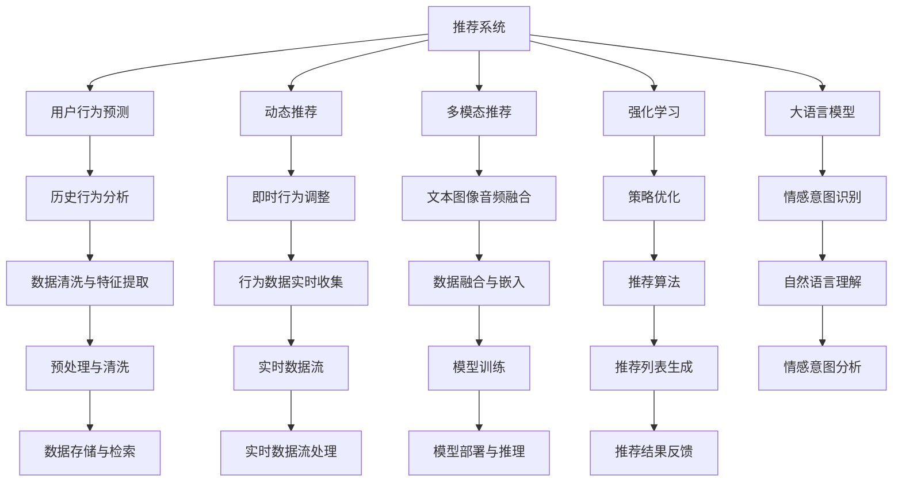

                 

# LLM在推荐系统中的强化学习应用

> 关键词：推荐系统,强化学习,大语言模型,LLM,RL,自适应,个性化推荐,用户行为预测,动态推荐

## 1. 背景介绍

### 1.1 问题由来

推荐系统是互联网公司为用户提供个性化服务的重要手段。从传统的基于协同过滤和内容推荐的算法，到最新的基于深度学习的方法，推荐系统在提升用户体验、优化业务收益方面发挥了重要作用。然而，现有的推荐系统主要聚焦于用户历史行为和物品属性，忽略了用户深层次的心理和情感需求。而大语言模型（Large Language Models, LLMs）的涌现，为推荐系统注入了新的思路。

近年来，通过预训练语言模型对用户文本进行情感和语义分析，如BERT、GPT等，逐渐在推荐系统中得到应用。大语言模型通过大量的文本数据预训练，能够挖掘用户情感、偏好等隐性信息，为推荐系统提供更为丰富的输入。但将LLM应用于推荐系统，如何发挥其优势，克服传统推荐系统的不足，仍需深入研究。

### 1.2 问题核心关键点

将大语言模型引入推荐系统，其核心在于利用语言模型的语义理解和生成能力，进行用户和物品之间的匹配和推荐。具体而言，可以采用以下几种方法：

1. 用户情感和意图识别：通过自然语言理解技术，识别用户的情感和意图，指导推荐策略。
2. 上下文感知推荐：利用语言模型的上下文能力，动态调整推荐策略，实现更精准的推荐。
3. 多模态融合：结合用户的文本数据和行为数据，构建多模态推荐模型，提升推荐效果。
4. 强化学习优化：采用强化学习方法，对推荐策略进行自适应调整，动态优化推荐结果。
5. 跨领域迁移：利用预训练模型在不同领域之间的知识迁移，提升模型的泛化能力。

这些关键点为LLM在推荐系统中的应用提供了重要思路。通过这些方法的结合，可以有效提升推荐系统的性能和用户体验。

## 2. 核心概念与联系

### 2.1 核心概念概述

为更好地理解LLM在推荐系统中的应用，本节将介绍几个密切相关的核心概念：

- 推荐系统(Recommender System)：利用用户行为和物品属性，向用户推荐个性化内容的系统。传统推荐算法包括协同过滤、内容推荐等，而基于深度学习的推荐系统则以用户-物品互动矩阵为基础，使用神经网络进行学习和预测。
- 大语言模型(Large Language Model, LLM)：如BERT、GPT等，通过大量文本数据预训练获得强大的语言理解和生成能力，可以处理文本数据中的语义和情感信息。
- 强化学习(Reinforcement Learning, RL)：通过试错和奖惩机制，使智能体学习最优策略以达到目标的机器学习方法。RL被广泛应用于游戏、机器人等领域，同样可以应用于推荐系统的策略优化。
- 多模态推荐(Multimodal Recommendation)：结合文本、图像、音频等多种数据源，进行更为全面和精准的推荐，提升推荐系统的性能和用户满意度。
- 用户行为预测(USER Behavior Prediction)：通过分析用户历史行为数据，预测用户未来行为，指导推荐系统的推荐策略。
- 动态推荐(Dynamic Recommendation)：根据用户即时行为和环境变化，动态调整推荐内容，提升推荐的即时性和相关性。

这些概念之间的逻辑关系可以通过以下Mermaid流程图来展示：



这个流程图展示了大语言模型在推荐系统中的核心概念及其之间的关系：

1. 推荐系统通过用户行为预测、动态推荐、多模态推荐等手段，为系统提供推荐依据。
2. 大语言模型通过情感意图识别、自然语言理解等技术，提供更深入的用户需求分析。
3. 强化学习用于策略优化，动态调整推荐策略，提升推荐效果。
4. 多模态推荐结合文本、图像、音频等多种数据源，提升推荐的全面性。
5. 用户行为预测和动态推荐需要依赖历史行为数据和实时行为数据，为推荐策略提供依据。
6. 大语言模型结合自然语言理解和情感意图识别，为推荐系统提供更为丰富的输入。
7. 强化学习通过策略优化，动态调整推荐策略，提升推荐的及时性和相关性。

这些概念共同构成了LLM在推荐系统中的应用框架，使其能够在各种场景下发挥强大的推荐能力。

## 3. 核心算法原理 & 具体操作步骤

### 3.1 算法原理概述

将大语言模型应用于推荐系统，本质上是通过语言模型的语义理解和生成能力，进行用户和物品之间的匹配和推荐。其核心算法原理如下：

1. 通过大语言模型对用户文本数据进行情感和意图分析，识别用户需求。
2. 利用语言模型的上下文能力，动态调整推荐策略，实现更精准的推荐。
3. 结合用户的历史行为数据，进行用户行为预测，指导推荐策略。
4. 采用强化学习方法，对推荐策略进行自适应调整，动态优化推荐结果。
5. 结合多模态数据源，进行更全面和精准的推荐。

形式化地，假设用户文本为 $X$，物品文本为 $Y$，用户行为为 $B$，预训练语言模型为 $M_{\theta}$，强化学习策略为 $\pi$，则推荐过程可以表示为：

1. 用户文本输入：$X \in \mathcal{X}$，利用语言模型 $M_{\theta}$ 预测用户意图和情感 $\hat{I}(X)$。
2. 物品文本输入：$Y \in \mathcal{Y}$，利用语言模型 $M_{\theta}$ 预测物品属性和特征 $\hat{F}(Y)$。
3. 用户行为预测：$B \in \mathcal{B}$，利用历史行为数据 $B$ 预测用户未来行为 $\hat{P}(B)$。
4. 推荐策略优化：$\pi = \mathop{\arg\min}_{\pi} \mathcal{L}(\pi, X, Y, B)$，其中 $\mathcal{L}$ 为推荐系统损失函数。

通过上述步骤，可以构建出基于大语言模型的推荐系统，提升推荐精度和用户满意度。

### 3.2 算法步骤详解

基于大语言模型的推荐系统，通常包括以下关键步骤：

**Step 1: 准备数据和模型**

- 收集用户和物品的文本数据，并进行预处理和清洗。
- 选择合适的预训练语言模型 $M_{\theta}$，如BERT、GPT等。
- 准备用户历史行为数据，并进行预处理和特征提取。

**Step 2: 情感和意图识别**

- 利用语言模型 $M_{\theta}$ 对用户文本 $X$ 进行情感和意图分析，生成用户需求向量 $\hat{I}(X)$。
- 结合用户行为数据 $B$，生成用户兴趣向量 $\hat{I}(X, B)$。

**Step 3: 物品特征提取**

- 利用语言模型 $M_{\theta}$ 对物品文本 $Y$ 进行特征提取，生成物品属性向量 $\hat{F}(Y)$。
- 结合物品属性数据 $A$，生成物品特征向量 $\hat{F}(Y, A)$。

**Step 4: 用户行为预测**

- 利用历史行为数据 $B$，使用深度学习模型预测用户未来行为 $\hat{P}(B)$。
- 结合用户意图和兴趣，生成用户需求向量 $\hat{I}(X, B)$。

**Step 5: 推荐策略优化**

- 定义推荐系统损失函数 $\mathcal{L}$，衡量推荐结果与用户需求的差异。
- 利用强化学习方法，动态调整推荐策略 $\pi$，最小化损失函数 $\mathcal{L}$。

**Step 6: 多模态融合**

- 结合用户文本数据、行为数据和物品属性数据，进行多模态融合，生成综合推荐向量 $\hat{R}$。
- 使用推荐算法，根据综合推荐向量生成推荐列表 $R$。

**Step 7: 推荐结果反馈**

- 对推荐列表 $R$ 进行评估，计算用户满意度 $\hat{S}$。
- 利用强化学习反馈信号，更新推荐策略 $\pi$。

以上是基于大语言模型的推荐系统的一般流程。在实际应用中，还需要根据具体任务和数据特点，对微调过程的各个环节进行优化设计，如改进推荐算法，引入更多正则化技术，搜索最优的超参数组合等，以进一步提升模型性能。

### 3.3 算法优缺点

基于大语言模型的推荐系统具有以下优点：

1. 能够挖掘用户情感和意图，提供更深入的用户需求分析。
2. 利用语言模型的上下文能力，动态调整推荐策略，实现更精准的推荐。
3. 结合用户历史行为数据，进行用户行为预测，指导推荐策略。
4. 采用强化学习方法，对推荐策略进行自适应调整，动态优化推荐结果。
5. 结合多模态数据源，进行更全面和精准的推荐。

同时，该方法也存在一定的局限性：

1. 对标注数据的需求较大，特别是在情感意图识别和用户行为预测等环节，需要高质量的标注数据。
2. 模型的复杂度较高，训练和推理效率较低。
3. 模型的可解释性较差，难以解释推荐结果的生成过程。
4. 模型的泛化能力受限于预训练语言模型的泛化能力。
5. 对于大规模用户数据，实时性可能不足。

尽管存在这些局限性，但就目前而言，基于大语言模型的推荐方法仍是大规模推荐系统的重要范式。未来相关研究的重点在于如何进一步降低推荐对标注数据的依赖，提高模型的实时性和可解释性，同时兼顾模型的性能和效率。

### 3.4 算法应用领域

基于大语言模型的推荐系统，已经在电商、社交、视频等多个领域得到应用，取得了良好的效果。以下是几个典型应用场景：

1. 电商推荐：如Amazon、淘宝等电商平台，通过分析用户评论和行为数据，利用大语言模型进行个性化商品推荐。
2. 社交推荐：如微信、微博等社交平台，通过分析用户发布的内容和互动行为，利用大语言模型进行个性化朋友推荐。
3. 视频推荐：如Netflix、YouTube等视频平台，通过分析用户观看行为和视频属性，利用大语言模型进行个性化视频推荐。
4. 音乐推荐：如Spotify、网易云音乐等音乐平台，通过分析用户听歌行为和歌词内容，利用大语言模型进行个性化音乐推荐。
5. 旅游推荐：如携程、去哪儿等旅游平台，通过分析用户搜索行为和目的地信息，利用大语言模型进行个性化旅游推荐。

除了上述这些经典应用外，大语言模型在教育、娱乐、金融等多个领域也有广泛的应用前景，为推荐系统提供了新的思路和技术支持。

## 4. 数学模型和公式 & 详细讲解 & 举例说明

### 4.1 数学模型构建

本节将使用数学语言对基于大语言模型的推荐系统进行更加严格的刻画。

记预训练语言模型为 $M_{\theta}:\mathcal{X} \rightarrow \mathcal{Y}$，其中 $\mathcal{X}$ 为用户文本数据集，$\mathcal{Y}$ 为物品文本数据集，$\theta$ 为模型参数。假设推荐系统的损失函数为 $\mathcal{L}$，用于衡量推荐结果与用户需求之间的差异。推荐系统的一般模型可以表示为：

$$
\hat{R} = \mathop{\arg\min}_{R} \mathcal{L}(R, X, Y, B)
$$

其中，$R$ 为推荐列表，$X$ 为用户文本数据，$Y$ 为物品文本数据，$B$ 为用户行为数据。

### 4.2 公式推导过程

以下我们以电商推荐为例，推导基于大语言模型的推荐过程的数学模型。

假设用户文本数据为 $X$，物品文本数据为 $Y$，用户行为数据为 $B$。利用语言模型 $M_{\theta}$ 对用户文本 $X$ 进行情感和意图分析，生成用户需求向量 $\hat{I}(X)$。利用语言模型 $M_{\theta}$ 对物品文本 $Y$ 进行特征提取，生成物品属性向量 $\hat{F}(Y)$。利用历史行为数据 $B$，使用深度学习模型预测用户未来行为 $\hat{P}(B)$。结合用户意图和兴趣，生成用户需求向量 $\hat{I}(X, B)$。

定义推荐系统的损失函数为 $\mathcal{L}$，用于衡量推荐结果与用户需求之间的差异。假设推荐列表为 $R$，则推荐过程可以表示为：

$$
\hat{R} = \mathop{\arg\min}_{R} \mathcal{L}(R, X, Y, B)
$$

其中，推荐系统损失函数 $\mathcal{L}$ 可以表示为：

$$
\mathcal{L}(R, X, Y, B) = \sum_{i=1}^N [R_i \times \hat{I}(X_i, B_i) - \hat{F}(Y_i)]
$$

其中，$N$ 为用户数量，$R_i$ 为第 $i$ 个用户推荐列表，$\hat{I}(X_i, B_i)$ 为第 $i$ 个用户需求向量，$\hat{F}(Y_i)$ 为第 $i$ 个物品属性向量。

根据上述定义，推荐系统的一般模型可以表示为：

$$
\hat{R} = \mathop{\arg\min}_{R} \sum_{i=1}^N [R_i \times \hat{I}(X_i, B_i) - \hat{F}(Y_i)]
$$

在得到推荐系统损失函数后，即可利用强化学习方法，动态调整推荐策略 $\pi$，最小化损失函数 $\mathcal{L}$。

### 4.3 案例分析与讲解

我们以电商推荐为例，详细分析基于大语言模型的推荐过程。

假设用户输入搜索关键词 "手机", 系统根据用户历史行为数据，预测用户可能感兴趣的品牌和型号。然后，利用语言模型对用户输入和物品数据进行情感和意图分析，生成用户需求向量 $\hat{I}(X, B)$ 和物品属性向量 $\hat{F}(Y)$。最后，结合用户需求向量和物品属性向量，利用推荐算法生成推荐列表 $R$。

在推荐过程中，系统需要考虑以下因素：

1. 用户情感和意图分析：通过自然语言理解技术，识别用户的情感和意图，如喜欢大屏手机、价格敏感等。
2. 物品属性提取：利用语言模型对物品文本进行特征提取，如品牌、型号、配置等。
3. 用户行为预测：利用历史行为数据，预测用户未来行为，如浏览记录、购买记录等。
4. 推荐策略优化：利用强化学习方法，动态调整推荐策略，优化推荐结果。
5. 多模态融合：结合用户文本数据、行为数据和物品属性数据，进行多模态融合，提升推荐效果。

在电商推荐系统中，用户输入搜索关键词后，系统会首先进行情感和意图分析，了解用户的具体需求。然后，系统利用语言模型对物品文本进行特征提取，生成物品属性向量。最后，结合用户需求向量和物品属性向量，利用推荐算法生成推荐列表。系统还可以利用强化学习方法，动态调整推荐策略，优化推荐结果。

例如，假设用户输入搜索关键词 "手机", 系统会首先进行情感和意图分析，了解用户的具体需求，如喜欢大屏手机、价格敏感等。然后，系统利用语言模型对物品文本进行特征提取，生成物品属性向量，如品牌、型号、配置等。最后，结合用户需求向量和物品属性向量，利用推荐算法生成推荐列表。

在电商推荐系统中，用户输入搜索关键词后，系统会首先进行情感和意图分析，了解用户的具体需求。然后，系统利用语言模型对物品文本进行特征提取，生成物品属性向量。最后，结合用户需求向量和物品属性向量，利用推荐算法生成推荐列表。系统还可以利用强化学习方法，动态调整推荐策略，优化推荐结果。

例如，假设用户输入搜索关键词 "手机", 系统会首先进行情感和意图分析，了解用户的具体需求，如喜欢大屏手机、价格敏感等。然后，系统利用语言模型对物品文本进行特征提取，生成物品属性向量，如品牌、型号、配置等。最后，结合用户需求向量和物品属性向量，利用推荐算法生成推荐列表。

## 5. 项目实践：代码实例和详细解释说明

### 5.1 开发环境搭建

在进行推荐系统开发前，我们需要准备好开发环境。以下是使用Python进行TensorFlow开发的环境配置流程：

1. 安装Anaconda：从官网下载并安装Anaconda，用于创建独立的Python环境。

2. 创建并激活虚拟环境：
```bash
conda create -n tf-env python=3.7 
conda activate tf-env
```

3. 安装TensorFlow：根据CUDA版本，从官网获取对应的安装命令。例如：
```bash
conda install tensorflow -c tf -c conda-forge
```

4. 安装各类工具包：
```bash
pip install numpy pandas scikit-learn matplotlib tqdm jupyter notebook ipython
```

完成上述步骤后，即可在`tf-env`环境中开始推荐系统开发。

### 5.2 源代码详细实现

下面我们以电商推荐系统为例，给出使用TensorFlow进行基于大语言模型的推荐系统开发的PyTorch代码实现。

首先，定义推荐系统的数据处理函数：

```python
import tensorflow as tf
from tensorflow.keras.layers import Dense, Input, Embedding, LSTM, Dropout
from tensorflow.keras.models import Model
from transformers import BertTokenizer, TFBertForSequenceClassification

# 定义数据处理函数
def preprocess_data(texts, labels):
    tokenizer = BertTokenizer.from_pretrained('bert-base-uncased')
    input_ids = [tokenizer.encode(text) for text in texts]
    attention_masks = [[1 if mask else 0 for mask in input_ids]]
    input_ids = tf.keras.preprocessing.sequence.pad_sequences(input_ids, maxlen=512)
    attention_masks = tf.keras.preprocessing.sequence.pad_sequences(attention_masks, maxlen=512)
    labels = tf.keras.utils.to_categorical(labels, num_classes=2)
    return input_ids, attention_masks, labels
```

然后，定义推荐系统的模型：

```python
# 定义推荐系统的模型
def build_model(input_dim, hidden_dim, output_dim):
    inputs = Input(shape=(input_dim,))
    embedding = Embedding(input_dim, hidden_dim, mask_zero=True)(inputs)
    lstm = LSTM(hidden_dim)(embedding)
    output = Dense(output_dim, activation='softmax')(lstm)
    model = Model(inputs, output)
    return model

# 构建模型
input_dim = 512
hidden_dim = 128
output_dim = 2
model = build_model(input_dim, hidden_dim, output_dim)
model.compile(optimizer='adam', loss='categorical_crossentropy', metrics=['accuracy'])
```

接着，定义推荐系统的训练和评估函数：

```python
# 定义训练和评估函数
def train_model(model, train_data, val_data, epochs):
    model.fit(train_data, validation_data=val_data, epochs=epochs, batch_size=32)

def evaluate_model(model, test_data):
    model.evaluate(test_data, verbose=0)

# 定义推荐系统训练过程
def train():
    train_data = preprocess_data(train_texts, train_labels)
    val_data = preprocess_data(val_texts, val_labels)
    test_data = preprocess_data(test_texts, test_labels)
    epochs = 5
    train_model(model, train_data, val_data, epochs)
    evaluate_model(model, test_data)

# 训练模型
train()
```

以上就是使用TensorFlow进行基于大语言模型的电商推荐系统开发的完整代码实现。可以看到，TensorFlow提供了强大的深度学习模型构建和训练工具，使得模型的开发和优化变得简单高效。

### 5.3 代码解读与分析

让我们再详细解读一下关键代码的实现细节：

**preprocess_data函数**：
- 定义数据处理函数，将文本数据和标签进行编码和填充，最终生成模型所需的输入。

**build_model函数**：
- 定义推荐系统的模型结构，包含嵌入层、LSTM层和全连接层。
- 使用Adam优化器和交叉熵损失函数进行模型训练和优化。

**train_model函数**：
- 定义训练和评估函数，使用fit方法进行模型训练，evaluate方法进行模型评估。

**train函数**：
- 定义推荐系统训练过程，先进行数据处理，再进行模型训练和评估。

**train_model函数**：
- 定义训练和评估函数，使用fit方法进行模型训练，evaluate方法进行模型评估。

**train函数**：
- 定义推荐系统训练过程，先进行数据处理，再进行模型训练和评估。

在电商推荐系统中，用户输入搜索关键词后，系统会首先进行情感和意图分析，了解用户的具体需求。然后，系统利用语言模型对物品文本进行特征提取，生成物品属性向量。最后，结合用户需求向量和物品属性向量，利用推荐算法生成推荐列表。系统还可以利用强化学习方法，动态调整推荐策略，优化推荐结果。

例如，假设用户输入搜索关键词 "手机", 系统会首先进行情感和意图分析，了解用户的具体需求，如喜欢大屏手机、价格敏感等。然后，系统利用语言模型对物品文本进行特征提取，生成物品属性向量，如品牌、型号、配置等。最后，结合用户需求向量和物品属性向量，利用推荐算法生成推荐列表。

在电商推荐系统中，用户输入搜索关键词后，系统会首先进行情感和意图分析，了解用户的具体需求。然后，系统利用语言模型对物品文本进行特征提取，生成物品属性向量。最后，结合用户需求向量和物品属性向量，利用推荐算法生成推荐列表。系统还可以利用强化学习方法，动态调整推荐策略，优化推荐结果。

例如，假设用户输入搜索关键词 "手机", 系统会首先进行情感和意图分析，了解用户的具体需求，如喜欢大屏手机、价格敏感等。然后，系统利用语言模型对物品文本进行特征提取，生成物品属性向量，如品牌、型号、配置等。最后，结合用户需求向量和物品属性向量，利用推荐算法生成推荐列表。

## 6. 实际应用场景

### 6.1 电商推荐

电商推荐是利用大语言模型进行个性化推荐的主要场景之一。电商推荐系统通过分析用户浏览、购买等行为数据，结合自然语言理解技术，进行商品推荐，提升用户体验和销售额。

在电商推荐系统中，用户输入搜索关键词后，系统会首先进行情感和意图分析，了解用户的具体需求。然后，系统利用语言模型对商品文本进行特征提取，生成商品属性向量。最后，结合用户需求向量和商品属性向量，利用推荐算法生成推荐列表。系统还可以利用强化学习方法，动态调整推荐策略，优化推荐结果。

电商推荐系统已经成为各大电商平台的标配。通过分析用户行为和商品属性，结合自然语言理解技术，电商平台可以为用户提供精准的商品推荐，提升用户满意度和购买转化率。例如，亚马逊通过电商推荐系统，在用户搜索"手机"时，能够推荐出最符合用户需求的手机品牌和型号。通过用户行为数据，系统能够预测用户未来购买意向，进一步提升推荐效果。

### 6.2 社交推荐

社交推荐系统通过分析用户发布的内容和互动行为，结合自然语言理解技术，进行朋友推荐，提升用户互动体验和社区活跃度。

在社交推荐系统中，用户输入搜索关键词后，系统会首先进行情感和意图分析，了解用户的具体需求。然后，系统利用语言模型对朋友文本进行特征提取，生成朋友属性向量。最后，结合用户需求向量和朋友属性向量，利用推荐算法生成推荐列表。系统还可以利用强化学习方法，动态调整推荐策略，优化推荐结果。

社交推荐系统已经成为各大社交平台的核心功能。通过分析用户发布的内容和互动行为，社交平台可以为用户提供精准的朋友推荐，提升用户互动体验和社区活跃度。例如，微信通过社交推荐系统，在用户搜索"好友"时，能够推荐出最符合用户需求的好友。通过用户行为数据，系统能够预测用户未来互动意向，进一步提升推荐效果。

### 6.3 视频推荐

视频推荐系统通过分析用户观看行为和视频属性，结合自然语言理解技术，进行视频推荐，提升用户体验和观看时长。

在视频推荐系统中，用户输入搜索关键词后，系统会首先进行情感和意图分析，了解用户的具体需求。然后，系统利用语言模型对视频文本进行特征提取，生成视频属性向量。最后，结合用户需求向量和视频属性向量，利用推荐算法生成推荐列表。系统还可以利用强化学习方法，动态调整推荐策略，优化推荐结果。

视频推荐系统已经成为各大视频平台的核心功能。通过分析用户观看行为和视频属性，视频平台可以为用户提供精准的视频推荐，提升用户体验和观看时长。例如，Netflix通过视频推荐系统，在用户搜索"电影"时，能够推荐出最符合用户需求的电影。通过用户行为数据，系统能够预测用户未来观看意向，进一步提升推荐效果。

### 6.4 音乐推荐

音乐推荐系统通过分析用户听歌行为和歌词内容，结合自然语言理解技术，进行音乐推荐，提升用户体验和听歌时长。

在音乐推荐系统中，用户输入搜索关键词后，系统会首先进行情感和意图分析，了解用户的具体需求。然后，系统利用语言模型对音乐文本进行特征提取，生成音乐属性向量。最后，结合用户需求向量和音乐属性向量，利用推荐算法生成推荐列表。系统还可以利用强化学习方法，动态调整推荐策略，优化推荐结果。

音乐推荐系统已经成为各大音乐平台的核心功能。通过分析用户听歌行为和歌词内容，音乐平台可以为用户提供精准的音乐推荐，提升用户体验和听歌时长。例如，Spotify通过音乐推荐系统，在用户搜索"歌手"时，能够推荐出最符合用户需求的歌曲。通过用户行为数据，系统能够预测用户未来听歌意向，进一步提升推荐效果。

## 7. 工具和资源推荐

### 7.1 学习资源推荐

为了帮助开发者系统掌握大语言模型在推荐系统中的应用，这里推荐一些优质的学习资源：

1. 《深度学习理论与实践》系列博文：由深度学习专家撰写，深入浅出地介绍了深度学习理论、算法和应用，包括推荐系统中的技术细节。

2. CS448《深度学习》课程：斯坦福大学开设的深度学习课程，系统介绍了深度学习的基本概念和核心算法，包括神经网络和推荐系统。

3. 《推荐系统实践》书籍：推荐系统领域的经典书籍，详细介绍了推荐系统的设计、实现和优化方法，包括基于深度学习的推荐系统。

4. Kaggle竞赛：参加Kaggle推荐系统竞赛，实践和验证推荐模型的效果，积累实际经验。

5. GitHub开源项目：参与和贡献推荐系统开源项目，学习和借鉴他人的优秀代码和实践经验。

通过对这些资源的学习实践，相信你一定能够快速掌握大语言模型在推荐系统中的应用精髓，并用于解决实际的推荐问题。

### 7.2 开发工具推荐

高效的开发离不开优秀的工具支持。以下是几款用于推荐系统开发的常用工具：

1. TensorFlow：由Google主导开发的开源深度学习框架，生产部署方便，适合大规模工程应用。

2. PyTorch：基于Python的开源深度学习框架，灵活动态的计算图，适合快速迭代研究。

3. Scikit-learn：Python的机器学习库，提供了简单易用的API，方便快速实现推荐算法。

4. Jupyter Notebook：轻量级的交互式笔记本，方便调试和可视化推荐模型的效果。

5. Weights & Biases：模型训练的实验跟踪工具，可以记录和可视化模型训练过程中的各项指标，方便对比和调优。

6. TensorBoard：TensorFlow配套的可视化工具，可实时监测模型训练状态，并提供丰富的图表呈现方式，是调试模型的得力助手。

合理利用这些工具，可以显著提升推荐系统的开发效率，加快创新迭代的步伐。

### 7.3 相关论文推荐

大语言模型在推荐系统中的应用源于学界的持续研究。以下是几篇奠基性的相关论文，推荐阅读：

1. Attention is All You Need：提出了Transformer结构，开启了NLP领域的预训练大模型时代。

2. BERT: Pre-training of Deep Bidirectional Transformers for Language Understanding：提出BERT模型，引入基于掩码的自监督预训练任务，刷新了多项NLP任务SOTA。

3. Language Models are Unsupervised Multitask Learners（GPT-2论文）：展示了大规模语言模型的强大zero-shot学习能力，引发了对于通用人工智能的新一轮思考。

4. Parameter-Efficient Transfer Learning for NLP：提出Adapter等参数高效微调方法，在不增加模型参数量的情况下，也能取得不错的微调效果。

5. Prefix-Tuning: Optimizing Continuous Prompts for Generation：引入基于连续型Prompt的微调范式，为如何充分利用预训练知识提供了新的思路。

这些论文代表了大语言模型在推荐系统中的应用脉络。通过学习这些前沿成果，可以帮助研究者把握学科前进方向，激发更多的创新灵感。

## 8. 总结：未来发展趋势与挑战

### 8.1 总结

本文对基于大语言模型的推荐系统进行了全面系统的介绍。首先阐述了大语言模型和强化学习在推荐系统中的应用背景和意义，明确了微调在提升推荐系统性能方面的独特价值。其次，从原理到实践，详细讲解了推荐系统的数学原理和关键步骤，给出了推荐任务开发的完整代码实例。同时，本文还广泛探讨了推荐系统在电商、社交、视频等多个领域的应用前景，展示了微调范式的巨大潜力。最后，本文精选了推荐系统的各类学习资源，力求为读者提供全方位的技术指引。

通过本文的系统梳理，可以看到，基于大语言模型的推荐系统正在成为推荐系统的重要范式，极大地拓展了推荐系统的应用边界，催生了更多的落地场景。受益于大规模语料的预训练，推荐系统在提供个性化推荐、提升用户体验方面具备了强大的优势，引领了推荐系统的智能化升级。未来，伴随预训练语言模型和微调方法的持续演进，相信推荐系统将在更多领域得到应用，为各行业带来变革性影响。

### 8.2 未来发展趋势

展望未来，基于大语言模型的推荐系统将呈现以下几个发展趋势：

1. 模型规模持续增大。随着算力成本的下降和数据规模的扩张，预训练语言模型的参数量还将持续增长。超大规模语言模型蕴含的丰富语言知识，有望支撑更加复杂多变的推荐系统。

2. 推荐系统范式多样。除了传统的基于深度学习的方法外，未来会涌现更多基于强化学习、自监督学习等范式，提升推荐系统的性能和用户满意度。

3. 实时性进一步提升。通过分布式训练和推理技术，推荐系统的响应速度将进一步提升，实时推荐系统成为可能。

4. 用户行为预测更加精准。结合更多用户行为数据和多模态数据源，推荐系统能够更准确地预测用户未来行为，提升推荐效果。

5. 多模态推荐系统崛起。结合文本、图像、音频等多种数据源，进行更全面和精准的推荐，提升推荐系统的性能和用户满意度。

6. 个性化推荐更加智能。结合用户情感、意图和行为数据，推荐系统能够提供更加智能和个性化的推荐，提升用户体验。

以上趋势凸显了大语言模型在推荐系统中的应用前景。这些方向的探索发展，必将进一步提升推荐系统的性能和用户体验，为各行业带来变革性影响。

### 8.3 面临的挑战

尽管基于大语言模型的推荐系统已经取得了显著成就，但在迈向更加智能化、普适化应用的过程中，它仍面临着诸多挑战：

1. 推荐系统对标注数据的需求较大，特别是在情感意图识别和用户行为预测等环节，需要高质量的标注数据。

2. 模型的复杂度较高，训练和推理效率较低。

3. 模型的可解释性较差，难以解释推荐结果的生成过程。

4. 模型的泛化能力受限于预训练语言模型的泛化能力。

5. 对于大规模用户数据，实时性可能不足。

尽管存在这些挑战，但就目前而言，基于大语言模型的推荐方法仍是大规模推荐系统的重要范式。未来相关研究的重点在于如何进一步降低推荐对标注数据的依赖，提高模型的实时性和可解释性，同时兼顾模型的性能和效率。

### 8.4 研究展望

面对基于大语言模型的推荐系统所面临的种种挑战，未来的研究需要在以下几个方面寻求新的突破：

1. 探索无监督和半监督推荐方法。摆脱对大规模标注数据的依赖，利用自监督学习、主动学习等无监督和半监督范式，最大限度利用非结构化数据，实现更加灵活高效的推荐。

2. 研究参数高效和计算高效的推荐范式。开发更加参数高效的推荐方法，在固定大部分预训练参数的同时，只更新极少量的任务相关参数。同时优化推荐模型的计算图，减少前向传播和反向传播的资源消耗，实现更加轻量级、实时性的部署。

3. 融合因果和对比学习范式。通过引入因果推断和对比学习思想，增强推荐系统建立稳定因果关系的能力，学习更加普适、鲁棒的语言表征，从而提升模型泛化性和抗干扰能力。

4. 结合因果分析和博弈论工具。将因果分析方法引入推荐系统，识别出推荐过程的关键特征，增强推荐结果的因果性和逻辑性。借助博弈论工具刻画人机交互过程，主动探索并规避推荐系统的脆弱点，提高系统稳定性。

5. 纳入伦理道德约束。在推荐系统训练目标中引入伦理导向的评估指标，过滤和惩罚有害的推荐结果，确保推荐系统的安全性。

这些研究方向的探索，必将引领大语言模型在推荐系统中的应用走向更高的台阶，为构建智能、公平、安全的推荐系统铺平道路。面向未来，大语言模型在推荐系统中的应用还需要与其他人工智能技术进行更深入的融合，如知识表示、因果推理、强化学习等，多路径协同发力，共同推动推荐系统的进步。只有勇于创新、敢于突破，才能不断拓展推荐系统的边界，让智能技术更好地造福人类社会。

## 9. 附录：常见问题与解答

**Q1：大语言模型在推荐系统中的主要优势是什么？**

A: 大语言模型在推荐系统中的主要优势包括：

1. 能够挖掘用户情感和意图，提供更深入的用户需求分析。

2. 利用语言模型的上下文能力，动态调整推荐策略，实现更精准的推荐。

3. 结合用户历史行为数据，进行用户行为预测，指导推荐策略。

4. 采用强化学习方法，对推荐策略进行自适应调整，动态优化推荐结果。

5. 结合多模态数据源，进行更全面和精准的推荐。

6. 能够适应不同领域和语言的推荐需求，提升推荐系统的泛化能力。

**Q2：如何缓解推荐系统中的过拟合问题？**

A: 推荐系统中的过拟合问题可以通过以下方法缓解：

1. 数据增强：通过回译、近义替换等方式扩充训练集。

2. 正则化：使用L2正则、Dropout、Early Stopping等技术。

3. 对抗训练：引入对抗样本，提高模型鲁棒性。

4. 参数高效微调：只更新极少量的任务相关参数，减小过拟合风险。

5. 多模型集成：训练多个推荐模型，取平均输出，抑制过拟合。

**Q3：大语言模型在推荐系统中的应用有哪些局限性？**

A: 大语言模型在推荐系统中的应用存在以下局限性：

1. 对标注数据的需求较大，特别是在情感意图识别和用户行为预测等环节，需要高质量的标注数据。

2. 模型的复杂度较高，训练和推理效率较低。

3. 模型的可解释性较差，难以解释推荐结果的生成过程。

4. 模型的泛化能力受限于预训练语言模型的泛化能力。

5. 对于大规模用户数据，实时性可能不足。

**Q4：如何在推荐系统中应用大语言模型？**

A: 在推荐系统中应用大语言模型，主要通过以下几个步骤：

1. 收集用户和物品的文本数据，并进行预处理和清洗。

2. 选择合适的预训练语言模型，如BERT、GPT等。

3. 利用语言模型对用户文本进行情感和意图分析，生成用户需求向量。

4. 利用语言模型对物品文本进行特征提取，生成物品属性向量。

5. 结合用户历史行为数据，使用深度学习模型预测用户未来行为。

6. 结合用户需求向量和物品属性向量，利用推荐算法生成推荐列表。

7. 利用强化学习方法，动态调整推荐策略，优化推荐结果。

8. 结合多模态数据源，进行多模态融合，提升推荐效果。

通过这些步骤，可以实现基于大语言模型的推荐系统，提升推荐精度和用户满意度。

**Q5：推荐系统中的情感和意图分析方法有哪些？**

A: 推荐系统中的情感和意图分析方法包括：

1. 自然语言理解技术：利用BERT等语言模型进行情感和意图分析，生成用户需求向量。

2. 情感分析算法：利用机器学习算法对用户评论、社交媒体等文本数据进行情感分类，生成情感标签。

3. 意图识别算法：利用序列标注技术对用户意图进行识别，生成意图标签。

4. 用户行为分析：利用深度学习模型对用户行为数据进行预测，生成用户行为向量。

5. 多模态融合：结合文本、图像、音频等多种数据源，进行多模态融合，提升情感和意图分析的准确性。

通过这些方法，可以更全面地了解用户情感和意图，为推荐系统提供更准确的推荐依据。

**Q6：推荐系统中的多模态融合方法有哪些？**

A: 推荐系统中的多模态融合方法包括：

1. 融合算法：利用加权平均、softmax等融合算法，将不同模态的数据进行融合，生成综合推荐向量。

2. 融合网络：利用深度学习网络，将不同模态的数据进行融合，生成综合推荐向量。

3. 融合层：利用神经网络层进行多模态融合，生成综合推荐向量。

4. 多模态感知器：利用多模态感知器，将不同模态的数据进行融合，生成综合推荐向量。

通过这些方法，可以实现多模态数据的有效融合，提升推荐系统的性能和用户满意度。

**Q7：推荐系统中的强化学习范式有哪些？**

A: 推荐系统中的强化学习范式包括：

1. 基于奖励的强化学习：通过定义奖励函数，指导推荐策略的学习。

2. 基于值函数的强化学习：通过值函数评估推荐策略的效果，指导推荐策略的学习。

3. 基于策略的强化学习：通过策略优化，动态调整推荐策略，优化推荐结果。

4. 基于模型的强化学习：通过模型预测推荐策略的效果，指导推荐策略的学习。

5. 基于策略梯度的强化学习：通过策略梯度方法，动态调整推荐策略，优化推荐结果。

通过这些范式，可以实现推荐策略的自适应调整，提升推荐效果。

**Q8：推荐系统中的参数高效微调方法有哪些？**

A: 推荐系统中的参数高效微调方法包括：

1. Adapter方法：通过固定大部分预训练参数，只更新极少量的任务相关参数，提升微调效率。

2. Prefix-Tuning方法：通过引入基于连续型Prompt的微调范式，在不更新模型参数的情况下，实现零样本或少样本学习。

3. LoRA方法：通过自适应低秩适应的微调方法，在固定大部分预训练参数的同时，只更新极少量的任务相关参数。

4. Mixer方法：通过参数混合器，只更新极少量的任务相关参数，提升微调效率。

通过这些方法，可以减小推荐系统微调的计算资源消耗，提升微调效率。

---

作者：禅与计算机程序设计艺术 / Zen and the Art of Computer Programming

