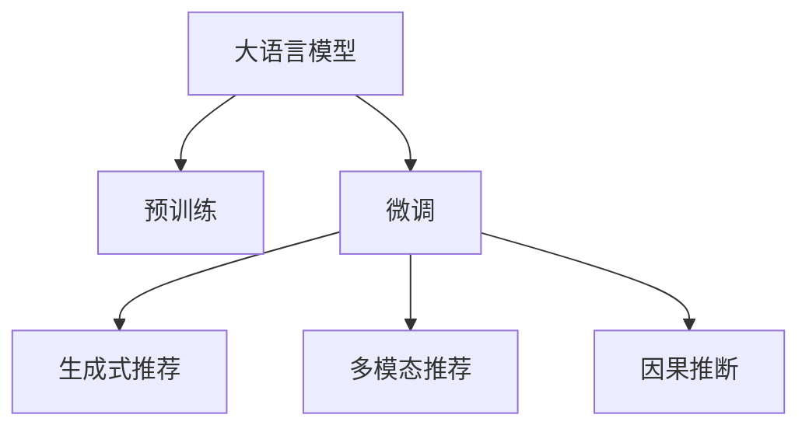

                 

# LLM在推荐系统中的技术创新

> 关键词：大语言模型(LLM),推荐系统,深度学习,强化学习,自然语言处理(NLP),用户行为分析,生成式推荐,多模态推荐,因果推断

## 1. 背景介绍

### 1.1 问题由来
随着电子商务的迅猛发展，推荐系统在提升用户体验、增加销售额方面发挥了越来越重要的作用。传统推荐系统主要依赖协同过滤、基于内容的推荐等算法，但存在数据稀疏性、冷启动问题，难以应对个性化需求。

深度学习技术的发展为推荐系统带来了新的思路。近年来，基于深度学习架构的推荐系统，如基于序列模型的CTR预估模型、基于矩阵分解的推荐模型等，在电商、视频等场景中取得了优异表现。然而，这些模型往往只关注用户行为的历史数据，忽略了用户描述、兴趣表达等文本信息，难以发挥语言模型的强大能力。

为此，研究人员在推荐系统领域引入了大语言模型(LLM)，如GPT-3、BERT等，通过预训练-微调范式，结合自然语言处理(NLP)技术，提升推荐系统的个性化、语义化能力，使之能够更好地理解用户的语义需求和情感倾向，提供更精准、多样化的推荐内容。

### 1.2 问题核心关键点
大语言模型在推荐系统中的应用，主要通过以下几个关键步骤实现：

1. **预训练**：利用大规模无标签文本数据，如维基百科、互联网评论等，训练一个强大的语言模型。
2. **微调**：结合特定领域的数据集，如电商平台的用户评论、商品描述等，通过有监督学习优化模型，使其适应特定推荐任务。
3. **推荐生成**：将用户的输入描述作为语言模型输入，生成商品或服务的推荐结果。
4. **多模态融合**：结合图像、音频、文本等多模态数据，提升推荐内容的丰富性和多样性。
5. **因果推断**：通过引入因果推断方法，提升推荐模型对用户行为的理解和预测能力。

通过这些步骤，大语言模型在推荐系统中充分发挥其强大的语言理解和生成能力，实现了推荐结果的语义化、个性化、多样化的目标。

## 2. 核心概念与联系

### 2.1 核心概念概述

为更好地理解大语言模型在推荐系统中的应用，本节将介绍几个密切相关的核心概念：

- 大语言模型(LLM)：以自回归(如GPT)或自编码(如BERT)模型为代表的大规模预训练语言模型。通过在大规模无标签文本语料上进行预训练，学习通用的语言表示，具备强大的语言理解和生成能力。

- 预训练(Pre-training)：指在大规模无标签文本语料上，通过自监督学习任务训练通用语言模型的过程。常见的预训练任务包括言语建模、遮挡语言模型等。预训练使得模型学习到语言的通用表示。

- 微调(Fine-tuning)：指在预训练模型的基础上，使用下游任务的少量标注数据，通过有监督学习优化模型在特定任务上的性能。通常只需要调整顶层分类器或解码器，并以较小的学习率更新全部或部分的模型参数。

- 生成式推荐(Generative Recommendation)：利用语言模型生成推荐结果，结合用户历史行为数据，实现更灵活、更个性化的推荐。

- 多模态推荐(Multimodal Recommendation)：结合文本、图像、音频等多种模态信息，提升推荐内容的多样性和准确性。

- 因果推断(Causal Inference)：通过建立用户行为和推荐结果之间的因果关系，提升推荐模型的解释性和可靠性。

这些核心概念之间的逻辑关系可以通过以下Mermaid流程图来展示：



这个流程图展示了大语言模型的核心概念及其之间的关系：

1. 大语言模型通过预训练获得基础能力。
2. 微调是对预训练模型进行任务特定的优化，可以为生成式推荐、多模态推荐、因果推断等任务提供更好的基础。
3. 生成式推荐利用语言模型生成推荐结果，提升推荐的灵活性和个性化。
4. 多模态推荐结合多种模态信息，丰富推荐内容，提升用户体验。
5. 因果推断通过因果关系提升推荐模型的解释性和鲁棒性。

这些概念共同构成了大语言模型在推荐系统中的应用框架，使其能够充分发挥其强大的语言理解和生成能力。通过理解这些核心概念，我们可以更好地把握大语言模型在推荐系统中的应用方向。

## 3. 核心算法原理 & 具体操作步骤
### 3.1 算法原理概述

基于深度学习的大语言模型在推荐系统中的应用，本质上是利用语言模型的强大语义理解和生成能力，提升推荐系统的个性化、语义化能力。其核心思想是：将预训练的大语言模型视作一个强大的"特征提取器"，通过在特定领域的标注数据上进行有监督的微调，使得模型能够根据用户输入的描述生成或预测推荐结果。

形式化地，假设预训练模型为 $M_{\theta}$，其中 $\theta$ 为预训练得到的模型参数。给定推荐任务 $T$ 的标注数据集 $D=\{(x_i,y_i)\}_{i=1}^N$，其中 $x_i$ 为用户输入的文本描述，$y_i$ 为用户对推荐结果的评分或其他指标。微调的目标是找到新的模型参数 $\hat{\theta}$，使得：

$$
\hat{\theta}=\mathop{\arg\min}_{\theta} \mathcal{L}(M_{\theta},D)
$$

其中 $\mathcal{L}$ 为针对任务 $T$ 设计的损失函数，用于衡量模型预测输出与真实标签之间的差异。常见的损失函数包括交叉熵损失、均方误差损失等。

通过梯度下降等优化算法，微调过程不断更新模型参数 $\theta$，最小化损失函数 $\mathcal{L}$，使得模型输出逼近真实标签。由于 $\theta$ 已经通过预训练获得了较好的初始化，因此即便在特定领域的小规模数据集 $D$ 上进行微调，也能较快收敛到理想的模型参数 $\hat{\theta}$。

### 3.2 算法步骤详解

基于深度学习的大语言模型在推荐系统中的应用，一般包括以下几个关键步骤：

**Step 1: 准备预训练模型和数据集**
- 选择合适的预训练语言模型 $M_{\theta}$ 作为初始化参数，如 BERT、GPT 等。
- 准备推荐任务 $T$ 的标注数据集 $D$，划分为训练集、验证集和测试集。一般要求标注数据与预训练数据的分布不要差异过大。

**Step 2: 添加任务适配层**
- 根据任务类型，在预训练模型顶层设计合适的输出层和损失函数。
- 对于评分预测任务，通常在顶层添加线性回归层和均方误差损失函数。
- 对于多标签分类任务，通常使用交叉熵损失函数。

**Step 3: 设置微调超参数**
- 选择合适的优化算法及其参数，如 AdamW、SGD 等，设置学习率、批大小、迭代轮数等。
- 设置正则化技术及强度，包括权重衰减、Dropout、Early Stopping等。
- 确定冻结预训练参数的策略，如仅微调顶层，或全部参数都参与微调。

**Step 4: 执行梯度训练**
- 将训练集数据分批次输入模型，前向传播计算损失函数。
- 反向传播计算参数梯度，根据设定的优化算法和学习率更新模型参数。
- 周期性在验证集上评估模型性能，根据性能指标决定是否触发 Early Stopping。
- 重复上述步骤直到满足预设的迭代轮数或 Early Stopping 条件。

**Step 5: 测试和部署**
- 在测试集上评估微调后模型 $M_{\hat{\theta}}$ 的性能，对比微调前后的精度提升。
- 使用微调后的模型对新样本进行推理预测，集成到实际的应用系统中。
- 持续收集新的数据，定期重新微调模型，以适应数据分布的变化。

以上是基于深度学习的大语言模型在推荐系统中的应用流程。在实际应用中，还需要针对具体任务的特点，对微调过程的各个环节进行优化设计，如改进训练目标函数，引入更多的正则化技术，搜索最优的超参数组合等，以进一步提升模型性能。

### 3.3 算法优缺点

基于深度学习的大语言模型在推荐系统中的应用，具有以下优点：

1. **提升推荐质量**：通过结合语言模型，推荐系统能够更准确地理解用户的语义需求和情感倾向，提供更个性化、多样化的推荐内容。

2. **适应多模态数据**：大语言模型不仅能够处理文本数据，还可以结合图像、音频等多种模态信息，提升推荐内容的丰富性和多样性。

3. **增强模型解释性**：语言模型生成的推荐结果，可以根据用户输入的文本描述进行解释，增强推荐系统的透明性和可解释性。

4. **应对冷启动问题**：对于新用户和新商品，语言模型可以通过用户输入的描述进行推荐，缓解冷启动问题。

5. **增强模型鲁棒性**：通过因果推断方法，推荐系统能够更好地理解用户行为背后的因果关系，提升模型的鲁棒性和可靠性。

同时，该方法也存在一定的局限性：

1. **数据标注成本高**：推荐任务的标注数据往往需要耗费大量时间和人力，标注成本较高。

2. **模型复杂度高**：大语言模型通常具有大规模参数，训练和推理速度较慢，资源消耗较大。

3. **泛化能力不足**：如果预训练数据与推荐数据分布差异较大，推荐模型的泛化性能可能受到限制。

4. **数据隐私问题**：推荐系统涉及大量用户数据，需要保证数据隐私和安全，避免泄露用户个人信息。

尽管存在这些局限性，但就目前而言，基于深度学习的大语言模型在推荐系统中的应用仍是推荐技术的重要方向。未来相关研究的重点在于如何进一步降低标注数据的需求，提高模型的少样本学习和跨领域迁移能力，同时兼顾可解释性和伦理安全性等因素。

### 3.4 算法应用领域

基于深度学习的大语言模型在推荐系统中的应用，已经在电商、视频、音乐、图书等多个领域取得了广泛的应用。具体包括：

- **电商平台**：结合用户评论、商品描述等文本数据，对商品进行推荐。通过微调大语言模型，能够生成更个性化、更具吸引力的商品推荐语。

- **视频平台**：结合用户观看记录、评论等数据，为用户推荐相关视频内容。通过引入自然语言处理技术，提升推荐结果的相关性和多样性。

- **音乐应用**：结合用户听歌记录、评论等数据，为用户推荐相关音乐。通过微调大语言模型，生成更符合用户兴趣的音乐推荐语。

- **图书推荐**：结合用户读书记录、书评等数据，为用户推荐相关书籍。通过结合文本信息，提升推荐结果的准确性和个性化。

除了这些经典应用场景外，大语言模型在推荐系统中还有许多创新性的应用，如可控文本生成、个性化生成、用户行为分析等，为推荐技术带来了新的突破。

## 4. 数学模型和公式 & 详细讲解  
### 4.1 数学模型构建

本节将使用数学语言对基于深度学习的大语言模型在推荐系统中的应用进行更加严格的刻画。

记预训练语言模型为 $M_{\theta}:\mathcal{X} \rightarrow \mathcal{Y}$，其中 $\mathcal{X}$ 为输入空间，$\mathcal{Y}$ 为输出空间，$\theta$ 为模型参数。假设推荐任务 $T$ 的训练集为 $D=\{(x_i,y_i)\}_{i=1}^N$，其中 $x_i \in \mathcal{X}$ 为用户输入的文本描述，$y_i \in \mathcal{Y}$ 为用户对推荐结果的评分或其他指标。

定义模型 $M_{\theta}$ 在数据样本 $(x,y)$ 上的损失函数为 $\ell(M_{\theta}(x),y)$，则在数据集 $D$ 上的经验风险为：

$$
\mathcal{L}(\theta) = \frac{1}{N} \sum_{i=1}^N \ell(M_{\theta}(x_i),y_i)
$$

微调的优化目标是最小化经验风险，即找到最优参数：

$$
\theta^* = \mathop{\arg\min}_{\theta} \mathcal{L}(\theta)
$$

在实践中，我们通常使用基于梯度的优化算法（如SGD、Adam等）来近似求解上述最优化问题。设 $\eta$ 为学习率，$\lambda$ 为正则化系数，则参数的更新公式为：

$$
\theta \leftarrow \theta - \eta \nabla_{\theta}\mathcal{L}(\theta) - \eta\lambda\theta
$$

其中 $\nabla_{\theta}\mathcal{L}(\theta)$ 为损失函数对参数 $\theta$ 的梯度，可通过反向传播算法高效计算。

### 4.2 公式推导过程

以下我们以评分预测任务为例，推导交叉熵损失函数及其梯度的计算公式。

假设模型 $M_{\theta}$ 在输入 $x$ 上的输出为 $\hat{y}=M_{\theta}(x) \in [0,1]$，表示用户对推荐结果的评分预测。真实评分 $y \in [0,1]$。则交叉熵损失函数定义为：

$$
\ell(M_{\theta}(x),y) = -y\log \hat{y} - (1-y)\log (1-\hat{y})
$$

将其代入经验风险公式，得：

$$
\mathcal{L}(\theta) = -\frac{1}{N}\sum_{i=1}^N [y_i\log M_{\theta}(x_i)+(1-y_i)\log(1-M_{\theta}(x_i))]
$$

根据链式法则，损失函数对参数 $\theta_k$ 的梯度为：

$$
\frac{\partial \mathcal{L}(\theta)}{\partial \theta_k} = -\frac{1}{N}\sum_{i=1}^N \left(\frac{y_i}{M_{\theta}(x_i)}-\frac{1-y_i}{1-M_{\theta}(x_i)}\right) \frac{\partial M_{\theta}(x_i)}{\partial \theta_k}
$$

其中 $\frac{\partial M_{\theta}(x_i)}{\partial \theta_k}$ 可进一步递归展开，利用自动微分技术完成计算。

在得到损失函数的梯度后，即可带入参数更新公式，完成模型的迭代优化。重复上述过程直至收敛，最终得到适应推荐任务的最优模型参数 $\theta^*$。

## 5. 项目实践：代码实例和详细解释说明
### 5.1 开发环境搭建

在进行推荐系统开发前，我们需要准备好开发环境。以下是使用Python进行PyTorch开发的环境配置流程：

1. 安装Anaconda：从官网下载并安装Anaconda，用于创建独立的Python环境。

2. 创建并激活虚拟环境：
```bash
conda create -n pytorch-env python=3.8 
conda activate pytorch-env
```

3. 安装PyTorch：根据CUDA版本，从官网获取对应的安装命令。例如：
```bash
conda install pytorch torchvision torchaudio cudatoolkit=11.1 -c pytorch -c conda-forge
```

4. 安装Transformers库：
```bash
pip install transformers
```

5. 安装各类工具包：
```bash
pip install numpy pandas scikit-learn matplotlib tqdm jupyter notebook ipython
```

完成上述步骤后，即可在`pytorch-env`环境中开始推荐系统开发。

### 5.2 源代码详细实现

下面我们以评分预测任务为例，给出使用Transformers库对BERT模型进行推荐系统微调的PyTorch代码实现。

首先，定义推荐任务的输入输出格式：

```python
from transformers import BertTokenizer
from torch.utils.data import Dataset
import torch

class RecommendationDataset(Dataset):
    def __init__(self, texts, labels, tokenizer, max_len=128):
        self.texts = texts
        self.labels = labels
        self.tokenizer = tokenizer
        self.max_len = max_len
        
    def __len__(self):
        return len(self.texts)
    
    def __getitem__(self, item):
        text = self.texts[item]
        label = self.labels[item]
        
        encoding = self.tokenizer(text, return_tensors='pt', max_length=self.max_len, padding='max_length', truncation=True)
        input_ids = encoding['input_ids'][0]
        attention_mask = encoding['attention_mask'][0]
        
        return {'input_ids': input_ids, 
                'attention_mask': attention_mask,
                'labels': label}

# 标签与id的映射
label2id = {0: 'Not Rated', 1: 'High Rated', 2: 'Low Rated'}
id2label = {v: k for k, v in label2id.items()}

# 创建dataset
tokenizer = BertTokenizer.from_pretrained('bert-base-cased')

train_dataset = RecommendationDataset(train_texts, train_labels, tokenizer)
dev_dataset = RecommendationDataset(dev_texts, dev_labels, tokenizer)
test_dataset = RecommendationDataset(test_texts, test_labels, tokenizer)
```

然后，定义模型和优化器：

```python
from transformers import BertForRegression, AdamW

model = BertForRegression.from_pretrained('bert-base-cased')

optimizer = AdamW(model.parameters(), lr=2e-5)
```

接着，定义训练和评估函数：

```python
from torch.utils.data import DataLoader
from tqdm import tqdm
from sklearn.metrics import mean_squared_error

device = torch.device('cuda') if torch.cuda.is_available() else torch.device('cpu')
model.to(device)

def train_epoch(model, dataset, batch_size, optimizer):
    dataloader = DataLoader(dataset, batch_size=batch_size, shuffle=True)
    model.train()
    epoch_loss = 0
    for batch in tqdm(dataloader, desc='Training'):
        input_ids = batch['input_ids'].to(device)
        attention_mask = batch['attention_mask'].to(device)
        label = batch['labels'].to(device)
        model.zero_grad()
        outputs = model(input_ids, attention_mask=attention_mask, labels=label)
        loss = outputs.loss
        epoch_loss += loss.item()
        loss.backward()
        optimizer.step()
    return epoch_loss / len(dataloader)

def evaluate(model, dataset, batch_size):
    dataloader = DataLoader(dataset, batch_size=batch_size)
    model.eval()
    preds, labels = [], []
    with torch.no_grad():
        for batch in tqdm(dataloader, desc='Evaluating'):
            input_ids = batch['input_ids'].to(device)
            attention_mask = batch['attention_mask'].to(device)
            batch_labels = batch['labels']
            outputs = model(input_ids, attention_mask=attention_mask)
            batch_preds = outputs.logits.sigmoid().tolist()
            batch_labels = batch_labels.to('cpu').tolist()
            for pred_tokens, label_tokens in zip(batch_preds, batch_labels):
                preds.append(pred_tokens)
                labels.append(label_tokens)
                
    print('Mean Squared Error:', mean_squared_error(labels, preds))
```

最后，启动训练流程并在测试集上评估：

```python
epochs = 5
batch_size = 16

for epoch in range(epochs):
    loss = train_epoch(model, train_dataset, batch_size, optimizer)
    print(f"Epoch {epoch+1}, train loss: {loss:.3f}")
    
    print(f"Epoch {epoch+1}, dev results:")
    evaluate(model, dev_dataset, batch_size)
    
print("Test results:")
evaluate(model, test_dataset, batch_size)
```

以上就是使用PyTorch对BERT进行评分预测任务微调的完整代码实现。可以看到，得益于Transformers库的强大封装，我们可以用相对简洁的代码完成BERT模型的加载和微调。

### 5.3 代码解读与分析

让我们再详细解读一下关键代码的实现细节：

**RecommendationDataset类**：
- `__init__`方法：初始化文本、标签、分词器等关键组件。
- `__len__`方法：返回数据集的样本数量。
- `__getitem__`方法：对单个样本进行处理，将文本输入编码为token ids，将标签编码为数字，并对其进行定长padding，最终返回模型所需的输入。

**label2id和id2label字典**：
- 定义了标签与数字id之间的映射关系，用于将预测结果解码回真实的标签。

**训练和评估函数**：
- 使用PyTorch的DataLoader对数据集进行批次化加载，供模型训练和推理使用。
- 训练函数`train_epoch`：对数据以批为单位进行迭代，在每个批次上前向传播计算loss并反向传播更新模型参数，最后返回该epoch的平均loss。
- 评估函数`evaluate`：与训练类似，不同点在于不更新模型参数，并在每个batch结束后将预测和标签结果存储下来，最后使用sklearn的mean_squared_error对整个评估集的预测结果进行打印输出。

**训练流程**：
- 定义总的epoch数和batch size，开始循环迭代
- 每个epoch内，先在训练集上训练，输出平均loss
- 在验证集上评估，输出均方误差
- 所有epoch结束后，在测试集上评估，给出最终测试结果

可以看到，PyTorch配合Transformers库使得BERT微调的代码实现变得简洁高效。开发者可以将更多精力放在数据处理、模型改进等高层逻辑上，而不必过多关注底层的实现细节。

当然，工业级的系统实现还需考虑更多因素，如模型的保存和部署、超参数的自动搜索、更灵活的任务适配层等。但核心的微调范式基本与此类似。

## 6. 实际应用场景
### 6.1 电商推荐系统

基于大语言模型的推荐系统，已经在电商领域得到了广泛的应用。传统电商推荐系统主要依靠用户历史行为数据，如浏览、点击、购买等，难以充分挖掘用户的兴趣和需求。通过引入大语言模型，电商推荐系统可以结合用户输入的文本描述，如商品评论、搜索查询等，生成更加个性化、多样化的推荐结果。

在技术实现上，可以收集电商平台的商品评论、搜索记录等数据，将用户输入的文本描述作为微调输入，训练大语言模型。微调后的模型可以根据用户描述生成商品的评分预测，从而更精准地推荐用户可能感兴趣的商品。对于用户提出的新商品，还可以结合搜索引擎和知识图谱，动态生成推荐语，提升用户体验。

### 6.2 视频推荐系统

视频推荐系统主要依靠用户观看历史和评分数据，难以充分理解视频内容的多样性和复杂性。通过引入大语言模型，视频推荐系统可以结合视频标题、描述、评分等文本信息，生成更加多样化的推荐结果。

在技术实现上，可以收集视频平台的标题、描述、评分等数据，将用户输入的文本描述作为微调输入，训练大语言模型。微调后的模型可以根据用户描述生成视频的评分预测，从而推荐用户可能感兴趣的视频内容。对于热门视频，还可以通过动态生成推荐语，提升推荐效果。

### 6.3 音乐推荐系统

音乐推荐系统主要依靠用户听歌记录和评分数据，难以充分理解音乐的情感和风格。通过引入大语言模型，音乐推荐系统可以结合歌曲标题、歌词、歌手等信息，生成更加个性化的推荐结果。

在技术实现上，可以收集音乐平台的标题、歌词、歌手等信息，将用户输入的文本描述作为微调输入，训练大语言模型。微调后的模型可以根据用户描述生成音乐的评分预测，从而推荐用户可能感兴趣的音乐。对于热门音乐，还可以通过动态生成推荐语，提升推荐效果。

### 6.4 新闻推荐系统

新闻推荐系统主要依靠用户阅读历史和点击数据，难以充分理解新闻内容的深度和广度。通过引入大语言模型，新闻推荐系统可以结合新闻标题、摘要、评论等信息，生成更加个性化、多样化的推荐结果。

在技术实现上，可以收集新闻平台的标题、摘要、评论等信息，将用户输入的文本描述作为微调输入，训练大语言模型。微调后的模型可以根据用户描述生成新闻的评分预测，从而推荐用户可能感兴趣的新闻内容。对于热门新闻，还可以通过动态生成推荐语，提升推荐效果。

## 7. 工具和资源推荐
### 7.1 学习资源推荐

为了帮助开发者系统掌握大语言模型在推荐系统中的应用，这里推荐一些优质的学习资源：

1. 《Transformers: From Discrete to Continuous》系列博文：由大模型技术专家撰写，深入浅出地介绍了Transformer原理、BERT模型、推荐系统范式等前沿话题。

2. CS448《推荐系统》课程：斯坦福大学开设的推荐系统明星课程，涵盖了推荐系统的基础理论、算法实现、系统部署等全链条知识。

3. 《Recommender Systems》书籍：推荐系统领域的经典著作，详细介绍了推荐系统的各类算法和应用场景，适合进一步深入学习。

4. Kaggle竞赛：参加推荐系统相关的Kaggle竞赛，如Amazon Product Recommendations、Netflix Prize等，能够实战练习，积累经验。

通过对这些资源的学习实践，相信你一定能够快速掌握大语言模型在推荐系统中的应用精髓，并用于解决实际的推荐问题。
###  7.2 开发工具推荐

高效的开发离不开优秀的工具支持。以下是几款用于大语言模型在推荐系统开发中的常用工具：

1. PyTorch：基于Python的开源深度学习框架，灵活动态的计算图，适合快速迭代研究。大部分预训练语言模型都有PyTorch版本的实现。

2. TensorFlow：由Google主导开发的开源深度学习框架，生产部署方便，适合大规模工程应用。同样有丰富的预训练语言模型资源。

3. Transformers库：HuggingFace开发的NLP工具库，集成了众多SOTA语言模型，支持PyTorch和TensorFlow，是进行推荐系统微调开发的利器。

4. Weights & Biases：模型训练的实验跟踪工具，可以记录和可视化模型训练过程中的各项指标，方便对比和调优。与主流深度学习框架无缝集成。

5. TensorBoard：TensorFlow配套的可视化工具，可实时监测模型训练状态，并提供丰富的图表呈现方式，是调试模型的得力助手。

6. Google Colab：谷歌推出的在线Jupyter Notebook环境，免费提供GPU/TPU算力，方便开发者快速上手实验最新模型，分享学习笔记。

合理利用这些工具，可以显著提升大语言模型在推荐系统中的应用开发效率，加快创新迭代的步伐。

### 7.3 相关论文推荐

大语言模型在推荐系统的发展源于学界的持续研究。以下是几篇奠基性的相关论文，推荐阅读：

1. Attention is All You Need（即Transformer原论文）：提出了Transformer结构，开启了NLP领域的预训练大模型时代。

2. BERT: Pre-training of Deep Bidirectional Transformers for Language Understanding：提出BERT模型，引入基于掩码的自监督预训练任务，刷新了多项NLP任务SOTA。

3. Generative Pre-trained Transformer (GPT-2)：展示了大规模语言模型的强大zero-shot学习能力，引发了对于通用人工智能的新一轮思考。

4. Generative Recommendation with Transformers: Is It Ready to Replace Matrix Factorization?：提出基于语言模型的生成式推荐方法，展示了其在推荐系统中的应用效果。

5. Improving Recommendation System with Causal Inference：引入因果推断方法，提升推荐系统的解释性和鲁棒性。

6. Sparse Deep Learning Models for Recommender Systems：提出基于稀疏化的深度学习推荐模型，提高推荐系统的可扩展性和效率。

这些论文代表了大语言模型在推荐系统的发展脉络。通过学习这些前沿成果，可以帮助研究者把握学科前进方向，激发更多的创新灵感。

## 8. 总结：未来发展趋势与挑战

### 8.1 总结

本文对基于深度学习的大语言模型在推荐系统中的应用进行了全面系统的介绍。首先阐述了大语言模型和推荐系统的研究背景和意义，明确了深度学习范式在推荐系统中的重要地位。其次，从原理到实践，详细讲解了深度学习在推荐系统中的应用流程，给出了微调任务开发的完整代码实例。同时，本文还广泛探讨了深度学习在推荐系统中的应用场景，展示了其在电商、视频、音乐、新闻等多个领域的创新应用。此外，本文精选了深度学习在推荐系统中的学习资源、开发工具和相关论文，力求为开发者提供全方位的技术指引。

通过本文的系统梳理，可以看到，基于深度学习的大语言模型在推荐系统中的应用前景广阔。它通过结合语言模型，提升了推荐系统的个性化、语义化能力，实现了推荐结果的语义化、个性化、多样化的目标。未来，随着预训练语言模型和微调方法的持续演进，基于深度学习的推荐系统必将在更多的领域得到应用，为推荐技术带来新的突破。

### 8.2 未来发展趋势

展望未来，大语言模型在推荐系统中的应用将呈现以下几个发展趋势：

1. **模型规模持续增大**：随着算力成本的下降和数据规模的扩张，预训练语言模型的参数量还将持续增长。超大规模语言模型蕴含的丰富语言知识，有望支撑更加复杂多变的推荐任务。

2. **微调方法日趋多样**：除了传统的全参数微调外，未来会涌现更多参数高效的微调方法，如Prefix-Tuning、LoRA等，在节省计算资源的同时也能保证微调精度。

3. **持续学习成为常态**：随着数据分布的不断变化，推荐模型也需要持续学习新知识以保持性能。如何在不遗忘原有知识的同时，高效吸收新样本信息，将成为重要的研究课题。

4. **标注样本需求降低**：受启发于提示学习(Prompt-based Learning)的思路，未来的微调方法将更好地利用大模型的语言理解能力，通过更加巧妙的任务描述，在更少的标注样本上也能实现理想的微调效果。

5. **多模态微调崛起**：当前的微调主要聚焦于纯文本数据，未来会进一步拓展到图像、视频、语音等多模态数据微调。多模态信息的融合，将显著提升推荐内容的丰富性和多样性。

6. **因果推断融合**：通过引入因果推断方法，推荐模型能够更好地理解用户行为背后的因果关系，提升模型的解释性和可靠性。

以上趋势凸显了大语言模型在推荐系统中的应用前景。这些方向的探索发展，必将进一步提升推荐系统的性能和应用范围，为推荐技术带来新的突破。

### 8.3 面临的挑战

尽管深度学习在推荐系统中的应用取得了瞩目成就，但在迈向更加智能化、普适化应用的过程中，它仍面临诸多挑战：

1. **数据标注成本高**：推荐任务的标注数据往往需要耗费大量时间和人力，标注成本较高。如何降低标注数据的需求，是推荐系统微调亟待解决的问题。

2. **模型复杂度高**：深度学习模型通常具有大规模参数，训练和推理速度较慢，资源消耗较大。如何在保持高精度的情况下，降低模型复杂度，提高推荐系统的可扩展性，还需要进一步探索。

3. **泛化能力不足**：如果预训练数据与推荐数据分布差异较大，推荐模型的泛化性能可能受到限制。如何在不同领域、不同任务上，提升推荐模型的泛化能力，是推荐系统微调的重要研究方向。

4. **数据隐私问题**：推荐系统涉及大量用户数据，需要保证数据隐私和安全，避免泄露用户个人信息。如何在保障隐私的同时，提升推荐系统的性能，是一个重要的研究课题。

尽管存在这些挑战，但深度学习在推荐系统中的应用，仍具有广阔的前景和重要的应用价值。未来，相关研究需要在数据获取、模型架构、算法设计等多个方面寻求新的突破，才能更好地应对挑战，提升推荐系统的性能和可解释性。

### 8.4 研究展望

面对深度学习在推荐系统面临的种种挑战，未来的研究需要在以下几个方面寻求新的突破：

1. **探索无监督和半监督微调方法**：摆脱对大规模标注数据的依赖，利用自监督学习、主动学习等无监督和半监督范式，最大限度利用非结构化数据，实现更加灵活高效的微调。

2. **研究参数高效和计算高效的微调范式**：开发更加参数高效的微调方法，在固定大部分预训练参数的同时，只更新极少量的任务相关参数。同时优化微调模型的计算图，减少前向传播和反向传播的资源消耗，实现更加轻量级、实时性的部署。

3. **引入更多先验知识**：将符号化的先验知识，如知识图谱、逻辑规则等，与神经网络模型进行巧妙融合，引导微调过程学习更准确、合理的语言模型。同时加强不同模态数据的整合，实现视觉、语音等多模态信息与文本信息的协同建模。

4. **结合因果分析和博弈论工具**：将因果分析方法引入微调模型，识别出模型决策的关键特征，增强输出解释的因果性和逻辑性。借助博弈论工具刻画人机交互过程，主动探索并规避模型的脆弱点，提高系统稳定性。

5. **纳入伦理道德约束**：在模型训练目标中引入伦理导向的评估指标，过滤和惩罚有偏见、有害的输出倾向。同时加强人工干预和审核，建立模型行为的监管机制，确保输出符合人类价值观和伦理道德。

这些研究方向的探索，必将引领深度学习在推荐系统迈向更高的台阶，为推荐技术带来新的突破。面向未来，深度学习在推荐系统还需要与其他人工智能技术进行更深入的融合，如知识表示、因果推理、强化学习等，多路径协同发力，共同推动推荐系统的进步。只有勇于创新、敢于突破，才能不断拓展推荐系统的边界，让智能技术更好地造福人类社会。

## 9. 附录：常见问题与解答

**Q1：大语言模型在推荐系统中是否需要重新训练？**

A: 在大语言模型在推荐系统中，通常不需要重新训练。推荐系统一般只需要对已有模型进行微调，以适应特定的推荐任务。微调只需要在少量标注数据上进行，资源消耗较小，且可以显著提升推荐系统的性能。

**Q2：大语言模型在推荐系统中如何避免过拟合？**

A: 避免过拟合是推荐系统微调的重要挑战。一般可以采用以下方法：
1. 数据增强：通过回译、近义替换等方式扩充训练集
2. 正则化：使用L2正则、Dropout、Early Stopping等避免过拟合
3. 对抗训练：加入对抗样本，提高模型鲁棒性
4. 参数高效微调：只调整少量参数(如Adapter、Prefix等)，减小过拟合风险

这些策略往往需要根据具体任务和数据特点进行灵活组合。只有在数据、模型、训练、推理等各环节进行全面优化，才能最大限度地发挥深度学习在推荐系统中的潜力。

**Q3：大语言模型在推荐系统中的计算效率如何？**

A: 大语言模型在推荐系统中的计算效率通常不如传统推荐算法。由于模型参数量大，训练和推理需要较高的计算资源。然而，通过优化模型结构和算法，可以显著提高计算效率。例如，使用稀疏化、量化、剪枝等技术，可以减少模型大小，提高推理速度。此外，通过多卡并行、分布式计算等方法，可以进一步提升计算效率。

**Q4：大语言模型在推荐系统中如何保证数据隐私？**

A: 推荐系统涉及大量用户数据，保证数据隐私和安全是一个重要问题。可以采用以下方法：
1. 数据脱敏：对用户数据进行匿名化、去标识化处理，确保数据无法被逆向识别。
2. 访问控制：设置严格的访问权限，只有授权用户才能访问数据。
3. 加密存储：使用加密技术对用户数据进行存储，确保数据在传输和存储过程中不会被泄露。
4. 差分隐私：在数据处理过程中引入噪声，确保模型输出不泄露个体信息。

这些方法可以结合使用，形成多层次的安全防护体系，确保推荐系统在保护用户隐私的同时，提供高质量的推荐服务。

**Q5：大语言模型在推荐系统中如何实现多模态融合？**

A: 实现多模态融合，可以通过以下方法：
1. 数据融合：将不同模态的数据进行拼接，形成统一的特征表示。
2. 特征融合：使用特征选择、特征组合等方法，将不同模态的特征进行融合。
3. 模型融合：使用集成学习方法，将不同模态的模型进行融合，形成更强大的推荐系统。

在实际应用中，可以通过结合不同模态的信息，提升推荐系统的表现。例如，结合视频标题、描述、评分等文本信息，提升视频推荐系统的效果。

---

作者：禅与计算机程序设计艺术 / Zen and the Art of Computer Programming

