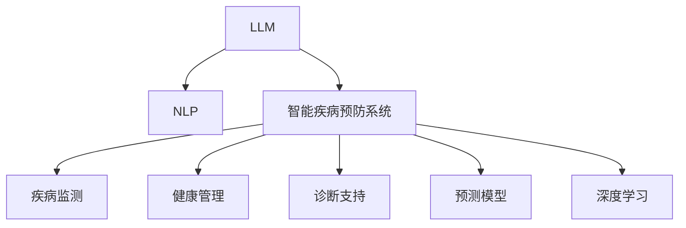

                 

# LLM在智能疾病预防系统中的潜在贡献

> 关键词：
- 大语言模型 (LLM)
- 智能疾病预防系统
- 自然语言处理 (NLP)
- 疾病监测
- 健康管理
- 诊断支持
- 预测模型
- 深度学习

## 1. 背景介绍

随着全球人口老龄化加剧以及生活方式的不断变化，各类慢性疾病和传染病的防治形势愈发严峻。如何有效监测疾病趋势、提高诊断准确性、优化健康管理方案，成为公共卫生事业和医疗系统面临的重大挑战。智能疾病预防系统作为一种新型的智能辅助手段，利用先进的人工智能技术，有望在疾病预防和健康管理中发挥重要作用。大语言模型(LLM)作为一种强大的人工智能技术，其在自然语言处理(NLP)、信息检索、智能推理等方面的能力，为智能疾病预防系统的构建提供了坚实的基础。本文将系统性地探讨LLM在智能疾病预防系统中的潜在贡献，从原理到应用，全方位解读其价值和未来方向。

## 2. 核心概念与联系

### 2.1 核心概念概述

为更好地理解LLM在智能疾病预防系统中的应用，本节将介绍几个关键概念：

- 大语言模型(LLM)：以自回归(如GPT)或自编码(如BERT)模型为代表的大规模预训练语言模型。通过在大规模无标签文本语料上进行预训练，学习通用的语言知识和常识，具备强大的语言理解和生成能力。

- 智能疾病预防系统：通过大数据分析、人工智能技术和物联网(IoT)设备的结合，实现对疾病的早期监测、诊断和治疗的智能化系统。

- 自然语言处理(NLP)：研究如何使计算机能够理解、解释和生成人类语言的技术，是智能疾病预防系统中重要的信息处理手段。

- 疾病监测：通过系统收集和分析各种健康数据，及时发现疾病爆发的趋势和风险。

- 健康管理：基于个体健康数据，提供个性化的健康监测和干预建议，预防疾病的发生和进展。

- 诊断支持：利用人工智能技术辅助医生进行疾病诊断，提高诊断准确性和效率。

- 预测模型：通过分析历史数据和当前数据，预测疾病的发展趋势和个体风险，指导预防和治疗策略。

- 深度学习：一类机器学习算法，通过多层次神经网络结构，从数据中自动提取特征并进行复杂任务处理。

这些核心概念之间的逻辑关系可以通过以下Mermaid流程图来展示：



这个流程图展示了大语言模型与智能疾病预防系统之间的关系：

1. LLM通过预训练学习语言知识和常识，为智能疾病预防系统的NLP任务提供基础能力。
2. 智能疾病预防系统利用LLM的能力，在疾病监测、健康管理、诊断支持、预测模型等多个环节提升效率和准确性。
3. 深度学习作为LLM的重要技术，在智能疾病预防系统中发挥着关键作用。

## 3. 核心算法原理 & 具体操作步骤
### 3.1 算法原理概述

LLM在智能疾病预防系统中的应用，主要体现在利用其强大的语言理解和生成能力，进行疾病相关信息的处理和分析。具体而言，LLM能够在以下几个方面发挥作用：

1. **疾病监测**：通过分析大量公共卫生数据和社交媒体信息，LLM能够识别出潜在的疾病爆发信号和趋势，为公共卫生决策提供支持。

2. **健康管理**：根据用户提供的健康数据和症状描述，LLM能够提供个性化的健康建议和治疗方案。

3. **诊断支持**：结合医学知识库和患者的历史数据，LLM能够辅助医生进行疾病诊断，提高诊断的准确性和效率。

4. **预测模型**：通过分析个体健康数据，LLM能够构建预测模型，预测疾病的发展趋势和个体风险。

5. **自然语言交互**：通过与用户的自然语言对话，LLM能够更便捷地获取健康信息，提升用户体验。

### 3.2 算法步骤详解

基于LLM在智能疾病预防系统中的作用，其应用过程一般包括以下几个关键步骤：

**Step 1: 数据准备和预处理**
- 收集疾病相关的健康数据、公共卫生数据和社交媒体信息。
- 对数据进行清洗和预处理，去除噪声和冗余信息。
- 将文本数据转化为适合LLM处理的格式，如进行分词、去除停用词等。

**Step 2: 构建任务适配层**
- 根据具体任务需求，在LLM的顶层设计合适的输出层和损失函数。
- 对于分类任务，通常添加线性分类器和交叉熵损失函数。
- 对于生成任务，使用语言模型的解码器输出概率分布，并以负对数似然为损失函数。

**Step 3: 模型训练和微调**
- 选择合适的优化算法及其参数，如AdamW、SGD等，设置学习率、批大小、迭代轮数等。
- 应用正则化技术，如L2正则、Dropout、Early Stopping等，防止过拟合。
- 使用标注数据对模型进行微调，优化模型在特定任务上的性能。
- 定期在验证集上评估模型性能，根据性能指标调整超参数。

**Step 4: 模型应用和效果评估**
- 将训练好的模型应用于疾病监测、健康管理、诊断支持、预测模型等多个任务中。
- 在实际应用场景中收集反馈数据，评估模型的效果和用户体验。
- 根据评估结果进一步优化模型，提升模型性能。

### 3.3 算法优缺点

基于LLM的智能疾病预防系统具有以下优点：

1. **高效处理文本数据**：LLM具备强大的语言理解能力，能够快速处理和分析大量文本数据，提升疾病监测和健康管理的效率。

2. **丰富知识融合**：LLM能够在不同领域知识库之间建立联系，将医学知识、流行病学数据和社交媒体信息融合，提供更全面的健康信息。

3. **个性化服务**：根据用户提供的健康数据，LLM能够提供个性化的健康建议和治疗方案，提升用户体验。

4. **实时性**：LLM能够实时分析数据，提供及时的疾病监测和诊断支持，增强公共卫生决策的时效性。

5. **可扩展性**：LLM可以通过微调，适应不同领域和任务的需求，具有较高的可扩展性。

同时，该方法也存在一定的局限性：

1. **数据质量依赖**：LLM的效果很大程度上依赖于输入数据的质量，数据的噪声和偏差可能影响模型的性能。

2. **计算资源需求高**：大语言模型的训练和推理需要较高的计算资源，对于资源受限的环境可能不适用。

3. **模型解释性不足**：LLM作为黑盒模型，其内部决策过程难以解释，增加了诊断和健康管理的透明度问题。

4. **伦理和安全问题**：LLM可能学习到有害信息，需要进行伦理审查和安全性测试，确保应用的道德和法律合规。

尽管存在这些局限性，但就目前而言，基于LLM的智能疾病预防系统仍是大数据时代的重要技术手段。未来相关研究的重点在于如何进一步降低对标注数据的依赖，提高模型的跨领域迁移能力，同时兼顾可解释性和伦理安全性等因素。

### 3.4 算法应用领域

基于LLM的智能疾病预防系统已经在多个领域得到了应用，例如：

1. **公共卫生监测**：通过分析社交媒体和公共卫生数据，识别潜在的疾病爆发信号，为公共卫生决策提供支持。

2. **个性化健康管理**：根据用户的健康数据和症状描述，提供个性化的健康建议和治疗方案。

3. **智能诊断系统**：结合医学知识库和患者的历史数据，辅助医生进行疾病诊断，提高诊断的准确性和效率。

4. **健康预测和干预**：通过分析个体健康数据，构建预测模型，预测疾病的发展趋势和个体风险，指导预防和治疗策略。

5. **医疗问答系统**：通过与用户的自然语言对话，解答健康相关问题，提供疾病预防和健康管理建议。

除了上述这些经典应用外，LLM还被创新性地应用于更多场景中，如可穿戴设备数据整合、智能咨询机器人等，为智能疾病预防系统的构建提供了新的思路。随着预训练模型和微调方法的不断进步，相信基于LLM的智能疾病预防系统将在更广泛的领域发挥作用，为公共卫生事业和医疗健康提供新的技术支持。

## 4. 数学模型和公式 & 详细讲解 & 举例说明
### 4.1 数学模型构建

本节将使用数学语言对基于LLM的智能疾病预防系统进行更加严格的刻画。

记LLM为 $M_{\theta}:\mathcal{X} \rightarrow \mathcal{Y}$，其中 $\mathcal{X}$ 为输入空间，$\mathcal{Y}$ 为输出空间，$\theta \in \mathbb{R}^d$ 为模型参数。假设智能疾病预防系统的训练集为 $D=\{(x_i,y_i)\}_{i=1}^N, x_i \in \mathcal{X}, y_i \in \mathcal{Y}$。

定义模型 $M_{\theta}$ 在数据样本 $(x,y)$ 上的损失函数为 $\ell(M_{\theta}(x),y)$，则在数据集 $D$ 上的经验风险为：

$$
\mathcal{L}(\theta) = \frac{1}{N} \sum_{i=1}^N \ell(M_{\theta}(x_i),y_i)
$$

微调的优化目标是最小化经验风险，即找到最优参数：

$$
\theta^* = \mathop{\arg\min}_{\theta} \mathcal{L}(\theta)
$$

在实践中，我们通常使用基于梯度的优化算法（如SGD、Adam等）来近似求解上述最优化问题。设 $\eta$ 为学习率，$\lambda$ 为正则化系数，则参数的更新公式为：

$$
\theta \leftarrow \theta - \eta \nabla_{\theta}\mathcal{L}(\theta) - \eta\lambda\theta
$$

其中 $\nabla_{\theta}\mathcal{L}(\theta)$ 为损失函数对参数 $\theta$ 的梯度，可通过反向传播算法高效计算。

### 4.2 公式推导过程

以下我们以疾病监测任务为例，推导交叉熵损失函数及其梯度的计算公式。

假设模型 $M_{\theta}$ 在输入 $x$ 上的输出为 $\hat{y}=M_{\theta}(x) \in [0,1]$，表示样本属于疾病的概率。真实标签 $y \in \{0,1\}$。则二分类交叉熵损失函数定义为：

$$
\ell(M_{\theta}(x),y) = -[y\log \hat{y} + (1-y)\log (1-\hat{y})]
$$

将其代入经验风险公式，得：

$$
\mathcal{L}(\theta) = -\frac{1}{N}\sum_{i=1}^N [y_i\log M_{\theta}(x_i)+(1-y_i)\log(1-M_{\theta}(x_i))]
$$

根据链式法则，损失函数对参数 $\theta_k$ 的梯度为：

$$
\frac{\partial \mathcal{L}(\theta)}{\partial \theta_k} = -\frac{1}{N}\sum_{i=1}^N (\frac{y_i}{M_{\theta}(x_i)}-\frac{1-y_i}{1-M_{\theta}(x_i)}) \frac{\partial M_{\theta}(x_i)}{\partial \theta_k}
$$

其中 $\frac{\partial M_{\theta}(x_i)}{\partial \theta_k}$ 可进一步递归展开，利用自动微分技术完成计算。

在得到损失函数的梯度后，即可带入参数更新公式，完成模型的迭代优化。重复上述过程直至收敛，最终得到适应下游任务的最优模型参数 $\theta^*$。

## 5. 项目实践：代码实例和详细解释说明
### 5.1 开发环境搭建

在进行智能疾病预防系统的微调实践前，我们需要准备好开发环境。以下是使用Python进行PyTorch开发的环境配置流程：

1. 安装Anaconda：从官网下载并安装Anaconda，用于创建独立的Python环境。

2. 创建并激活虚拟环境：
```bash
conda create -n pytorch-env python=3.8 
conda activate pytorch-env
```

3. 安装PyTorch：根据CUDA版本，从官网获取对应的安装命令。例如：
```bash
conda install pytorch torchvision torchaudio cudatoolkit=11.1 -c pytorch -c conda-forge
```

4. 安装Transformers库：
```bash
pip install transformers
```

5. 安装各类工具包：
```bash
pip install numpy pandas scikit-learn matplotlib tqdm jupyter notebook ipython
```

完成上述步骤后，即可在`pytorch-env`环境中开始微调实践。

### 5.2 源代码详细实现

下面我以疾病监测任务为例，给出使用Transformers库对BERT模型进行微调的PyTorch代码实现。

首先，定义疾病监测任务的数据处理函数：

```python
from transformers import BertTokenizer
from torch.utils.data import Dataset
import torch

class DiseaseDataset(Dataset):
    def __init__(self, texts, labels, tokenizer, max_len=128):
        self.texts = texts
        self.labels = labels
        self.tokenizer = tokenizer
        self.max_len = max_len
        
    def __len__(self):
        return len(self.texts)
    
    def __getitem__(self, item):
        text = self.texts[item]
        label = self.labels[item]
        
        encoding = self.tokenizer(text, return_tensors='pt', max_length=self.max_len, padding='max_length', truncation=True)
        input_ids = encoding['input_ids'][0]
        attention_mask = encoding['attention_mask'][0]
        
        # 对标签进行二值化
        label = torch.tensor(label, dtype=torch.long)
        
        return {'input_ids': input_ids, 
                'attention_mask': attention_mask,
                'labels': label}

# 创建dataset
tokenizer = BertTokenizer.from_pretrained('bert-base-cased')

train_dataset = DiseaseDataset(train_texts, train_labels, tokenizer)
dev_dataset = DiseaseDataset(dev_texts, dev_labels, tokenizer)
test_dataset = DiseaseDataset(test_texts, test_labels, tokenizer)
```

然后，定义模型和优化器：

```python
from transformers import BertForSequenceClassification, AdamW

model = BertForSequenceClassification.from_pretrained('bert-base-cased', num_labels=2)

optimizer = AdamW(model.parameters(), lr=2e-5)
```

接着，定义训练和评估函数：

```python
from torch.utils.data import DataLoader
from tqdm import tqdm
from sklearn.metrics import classification_report

device = torch.device('cuda') if torch.cuda.is_available() else torch.device('cpu')
model.to(device)

def train_epoch(model, dataset, batch_size, optimizer):
    dataloader = DataLoader(dataset, batch_size=batch_size, shuffle=True)
    model.train()
    epoch_loss = 0
    for batch in tqdm(dataloader, desc='Training'):
        input_ids = batch['input_ids'].to(device)
        attention_mask = batch['attention_mask'].to(device)
        labels = batch['labels'].to(device)
        model.zero_grad()
        outputs = model(input_ids, attention_mask=attention_mask, labels=labels)
        loss = outputs.loss
        epoch_loss += loss.item()
        loss.backward()
        optimizer.step()
    return epoch_loss / len(dataloader)

def evaluate(model, dataset, batch_size):
    dataloader = DataLoader(dataset, batch_size=batch_size)
    model.eval()
    preds, labels = [], []
    with torch.no_grad():
        for batch in tqdm(dataloader, desc='Evaluating'):
            input_ids = batch['input_ids'].to(device)
            attention_mask = batch['attention_mask'].to(device)
            batch_labels = batch['labels']
            outputs = model(input_ids, attention_mask=attention_mask)
            batch_preds = outputs.logits.argmax(dim=2).to('cpu').tolist()
            batch_labels = batch_labels.to('cpu').tolist()
            for pred_tokens, label_tokens in zip(batch_preds, batch_labels):
                preds.append(pred_tokens)
                labels.append(label_tokens)
                
    print(classification_report(labels, preds))
```

最后，启动训练流程并在测试集上评估：

```python
epochs = 5
batch_size = 16

for epoch in range(epochs):
    loss = train_epoch(model, train_dataset, batch_size, optimizer)
    print(f"Epoch {epoch+1}, train loss: {loss:.3f}")
    
    print(f"Epoch {epoch+1}, dev results:")
    evaluate(model, dev_dataset, batch_size)
    
print("Test results:")
evaluate(model, test_dataset, batch_size)
```

以上就是使用PyTorch对BERT进行疾病监测任务微调的完整代码实现。可以看到，得益于Transformers库的强大封装，我们可以用相对简洁的代码完成BERT模型的加载和微调。

### 5.3 代码解读与分析

让我们再详细解读一下关键代码的实现细节：

**DiseaseDataset类**：
- `__init__`方法：初始化文本、标签、分词器等关键组件。
- `__len__`方法：返回数据集的样本数量。
- `__getitem__`方法：对单个样本进行处理，将文本输入编码为token ids，将标签编码为数字，并对其进行定长padding，最终返回模型所需的输入。

**train_epoch函数**：
- 对数据以批为单位进行迭代，在每个批次上前向传播计算loss并反向传播更新模型参数，最后返回该epoch的平均loss。

**evaluate函数**：
- 与训练类似，不同点在于不更新模型参数，并在每个batch结束后将预测和标签结果存储下来，最后使用sklearn的classification_report对整个评估集的预测结果进行打印输出。

**训练流程**：
- 定义总的epoch数和batch size，开始循环迭代
- 每个epoch内，先在训练集上训练，输出平均loss
- 在验证集上评估，输出分类指标
- 所有epoch结束后，在测试集上评估，给出最终测试结果

可以看到，PyTorch配合Transformers库使得BERT微调的代码实现变得简洁高效。开发者可以将更多精力放在数据处理、模型改进等高层逻辑上，而不必过多关注底层的实现细节。

当然，工业级的系统实现还需考虑更多因素，如模型的保存和部署、超参数的自动搜索、更灵活的任务适配层等。但核心的微调范式基本与此类似。

## 6. 实际应用场景
### 6.1 智能疾病监测系统

智能疾病监测系统能够实时分析社交媒体、公共卫生数据和医疗记录，发现潜在的疾病爆发信号，为公共卫生决策提供支持。

在技术实现上，可以构建一个基于LLM的智能疾病监测系统，利用其在自然语言处理和信息检索方面的能力，自动抓取、分析和汇总健康数据，生成疾病监测报告。系统可以设置多种警报阈值，一旦监测到异常信号，及时触发预警，帮助公共卫生部门及时采取应对措施。

### 6.2 个性化健康管理平台

个性化健康管理平台能够根据用户提供的健康数据和症状描述，利用LLM进行个性化的健康分析和建议。

在平台设计上，可以引入健康问卷、生物传感器数据和在线问诊信息，通过自然语言处理技术，自动提取和分析用户的健康状态。系统根据用户的历史数据和当前状态，结合医学知识库，提供个性化的健康建议和治疗方案。

### 6.3 智能诊断支持系统

智能诊断支持系统能够结合医学知识库和用户的历史数据，利用LLM辅助医生进行疾病诊断。

在系统中，医生可以通过自然语言描述患者的症状和检查结果，系统自动将输入文本转化为疾病描述和诊断代码，推荐可能的疾病和诊断方案。系统还可以结合临床数据，提供专家诊断意见和病例参考，辅助医生进行决策。

### 6.4 健康预测模型

健康预测模型能够根据用户的健康数据，利用LLM构建预测模型，预测疾病的发展趋势和个体风险。

在模型训练中，可以使用用户的健康数据（如血压、血糖、体重等）和症状描述作为输入，利用LLM进行特征提取和关系推理，构建疾病预测模型。模型可以预测未来一定时间内疾病发展的概率，帮助用户制定健康管理计划。

### 6.5 健康问答机器人

健康问答机器人能够通过自然语言处理技术，自动解答用户的健康相关问题，提供疾病预防和健康管理建议。

在机器人设计中，可以引入LLM作为底层模型，利用其在问答和信息检索方面的能力，自动解答用户提出的健康问题。系统可以根据用户的提问，提供相关疾病的预防措施、治疗建议和健康知识，提升用户的健康意识和自我管理能力。

## 7. 工具和资源推荐
### 7.1 学习资源推荐

为了帮助开发者系统掌握LLM在智能疾病预防系统中的应用，这里推荐一些优质的学习资源：

1. 《Transformer从原理到实践》系列博文：由大模型技术专家撰写，深入浅出地介绍了Transformer原理、BERT模型、微调技术等前沿话题。

2. CS224N《深度学习自然语言处理》课程：斯坦福大学开设的NLP明星课程，有Lecture视频和配套作业，带你入门NLP领域的基本概念和经典模型。

3. 《Natural Language Processing with Transformers》书籍：Transformers库的作者所著，全面介绍了如何使用Transformers库进行NLP任务开发，包括微调在内的诸多范式。

4. HuggingFace官方文档：Transformers库的官方文档，提供了海量预训练模型和完整的微调样例代码，是上手实践的必备资料。

5. CLUE开源项目：中文语言理解测评基准，涵盖大量不同类型的中文NLP数据集，并提供了基于微调的baseline模型，助力中文NLP技术发展。

通过对这些资源的学习实践，相信你一定能够快速掌握LLM在智能疾病预防系统中的潜在贡献，并用于解决实际的NLP问题。
### 7.2 开发工具推荐

高效的开发离不开优秀的工具支持。以下是几款用于LLM在智能疾病预防系统中的应用开发的常用工具：

1. PyTorch：基于Python的开源深度学习框架，灵活动态的计算图，适合快速迭代研究。大部分预训练语言模型都有PyTorch版本的实现。

2. TensorFlow：由Google主导开发的开源深度学习框架，生产部署方便，适合大规模工程应用。同样有丰富的预训练语言模型资源。

3. Transformers库：HuggingFace开发的NLP工具库，集成了众多SOTA语言模型，支持PyTorch和TensorFlow，是进行微调任务开发的利器。

4. Weights & Biases：模型训练的实验跟踪工具，可以记录和可视化模型训练过程中的各项指标，方便对比和调优。与主流深度学习框架无缝集成。

5. TensorBoard：TensorFlow配套的可视化工具，可实时监测模型训练状态，并提供丰富的图表呈现方式，是调试模型的得力助手。

6. Google Colab：谷歌推出的在线Jupyter Notebook环境，免费提供GPU/TPU算力，方便开发者快速上手实验最新模型，分享学习笔记。

合理利用这些工具，可以显著提升LLM在智能疾病预防系统中的开发效率，加快创新迭代的步伐。

### 7.3 相关论文推荐

LLM在智能疾病预防系统中的应用源于学界的持续研究。以下是几篇奠基性的相关论文，推荐阅读：

1. Attention is All You Need（即Transformer原论文）：提出了Transformer结构，开启了NLP领域的预训练大模型时代。

2. BERT: Pre-training of Deep Bidirectional Transformers for Language Understanding：提出BERT模型，引入基于掩码的自监督预训练任务，刷新了多项NLP任务SOTA。

3. Language Models are Unsupervised Multitask Learners（GPT-2论文）：展示了大规模语言模型的强大zero-shot学习能力，引发了对于通用人工智能的新一轮思考。

4. Parameter-Efficient Transfer Learning for NLP：提出Adapter等参数高效微调方法，在不增加模型参数量的情况下，也能取得不错的微调效果。

5. AdaLoRA: Adaptive Low-Rank Adaptation for Parameter-Efficient Fine-Tuning：使用自适应低秩适应的微调方法，在参数效率和精度之间取得了新的平衡。

6. Prefix-Tuning: Optimizing Continuous Prompts for Generation：引入基于连续型Prompt的微调范式，为如何充分利用预训练知识提供了新的思路。

这些论文代表了大语言模型在智能疾病预防系统中的研究进展。通过学习这些前沿成果，可以帮助研究者把握学科前进方向，激发更多的创新灵感。

## 8. 总结：未来发展趋势与挑战
### 8.1 总结

本文对基于LLM的智能疾病预防系统进行了系统性的介绍。首先阐述了LLM在NLP领域的重要作用，以及其在智能疾病预防系统中的应用潜力。其次，从原理到应用，详细讲解了LLM在疾病监测、健康管理、诊断支持、预测模型等多个环节的潜力。最后，本文还探讨了LLM在智能疾病预防系统中的挑战和未来发展方向。

通过本文的系统梳理，可以看到，基于LLM的智能疾病预防系统已经在疾病监测、健康管理、诊断支持等多个领域取得了显著效果，为公共卫生事业和医疗健康提供了新的技术手段。未来，伴随预训练模型和微调方法的持续演进，基于LLM的智能疾病预防系统必将在更广泛的领域发挥作用，为人类健康事业做出更大的贡献。

### 8.2 未来发展趋势

展望未来，LLM在智能疾病预防系统中的应用将呈现以下几个发展趋势：

1. **计算资源优化**：随着计算资源的不断提升，大语言模型的训练和推理效率将进一步提升，为智能疾病预防系统的部署提供更大可能性。

2. **多模态融合**：未来，LLM将更多地与其他数据源（如图像、视频、生物传感器数据等）结合，实现多模态信息的融合，提供更全面的健康监测和诊断支持。

3. **个性化推荐**：利用LLM的推荐算法，根据用户的健康数据和行为习惯，提供个性化的健康建议和治疗方案，提升用户体验。

4. **实时性提升**：LLM将结合实时数据分析技术，实现对健康数据的实时监测和分析，提高疾病预防的及时性和准确性。

5. **模型可解释性**：未来的LLM将具备更强的可解释性，用户可以清楚地了解模型的决策过程，增强系统透明度和信任度。

6. **伦理和安全保障**：随着LLM应用的深入，其伦理和安全问题将受到更多关注。未来的系统将更加注重数据隐私保护和模型公平性，确保系统的合规性和安全性。

以上趋势凸显了LLM在智能疾病预防系统中的广阔前景。这些方向的探索发展，必将进一步提升智能疾病预防系统的性能和应用范围，为公共卫生事业和医疗健康带来新的变革。

### 8.3 面临的挑战

尽管基于LLM的智能疾病预防系统已经取得了显著进展，但在迈向更加智能化、普适化应用的过程中，它仍面临诸多挑战：

1. **数据隐私和安全**：智能疾病预防系统需要收集大量的个人健康数据，如何保护这些数据的隐私和安全，是一个重要的伦理和法律问题。

2. **计算资源限制**：大规模语言模型的训练和推理需要高昂的计算资源，对于资源受限的环境可能不适用，需要寻求更高效的技术解决方案。

3. **模型泛化能力**：LLM在特定领域的应用效果往往依赖于数据的丰富程度，如何提升模型的泛化能力，使其在更多领域和任务中取得优异表现，还需进一步研究。

4. **模型解释性**：LLM作为黑盒模型，其内部决策过程难以解释，增加了诊断和健康管理的透明度问题，需要更多的研究来解决。

5. **跨领域迁移**：LLM在不同领域之间的迁移能力仍有限，如何构建通用的疾病预测和健康管理模型，提升其在多个领域的适应性，是一个亟待解决的问题。

6. **伦理和法律合规**：随着LLM应用的深入，其伦理和法律问题将受到更多关注。未来的系统需要更加注重数据隐私保护和模型公平性，确保系统的合规性和安全性。

尽管存在这些挑战，但LLM在智能疾病预防系统中的潜力不容忽视。通过持续的研究和实践，相信这些难题都将逐步得到解决，LLM必将在智能疾病预防系统中发挥更大的作用。

### 8.4 研究展望

面向未来，LLM在智能疾病预防系统中的研究需要从以下几个方面进行突破：

1. **多模态数据融合**：如何更好地将文本数据与其他数据源（如图像、视频、生物传感器数据等）结合，实现多模态信息的融合，是未来的重要研究方向。

2. **跨领域迁移学习**：构建通用的疾病预测和健康管理模型，提升其在多个领域的适应性，是智能疾病预防系统未来的一个重要目标。

3. **可解释性和透明度**：提升LLM的可解释性，增强系统的透明度和信任度，是确保系统可靠性和安全性的重要保障。

4. **实时性优化**：如何通过优化计算资源和模型结构，提高系统的实时性和计算效率，是智能疾病预防系统大规模部署的关键。

5. **伦理和安全保护**：确保LLM应用的伦理和法律合规性，保护数据隐私和安全，是智能疾病预防系统应用推广的重要保障。

这些研究方向将推动LLM在智能疾病预防系统中的应用更加深入和全面，为公共卫生事业和医疗健康带来更大的变革和突破。

## 9. 附录：常见问题与解答
### 9.1 常见问题与解答

**Q1：智能疾病预防系统是否适用于所有疾病类型？**

A: 智能疾病预防系统在大多数疾病类型上都能取得显著效果，尤其是对于常见病和多发病。但对于一些罕见病和特殊病，由于数据样本较少，系统的效果可能有限。

**Q2：如何提升智能疾病预防系统的泛化能力？**

A: 提升智能疾病预防系统的泛化能力，主要依赖于数据的多样性和丰富性。可以通过收集更多的数据，尤其是跨领域和跨地域的数据，来增强系统的泛化能力。同时，引入更多领域的先验知识，构建多领域知识库，也能提升系统的泛化能力。

**Q3：智能疾病预防系统如何处理数据的隐私和安全问题？**

A: 处理数据的隐私和安全问题，是智能疾病预防系统设计中必须考虑的重要因素。可以通过数据匿名化、差分隐私等技术，保护用户数据的隐私。同时，建立严格的数据访问权限控制，确保只有授权人员能够访问敏感数据，增强系统的安全性。

**Q4：智能疾病预防系统如何提升实时性？**

A: 提升系统的实时性，需要从多个方面进行优化。首先，可以采用分布式计算和云计算等技术，提高系统的计算能力。其次，可以采用模型压缩和量化等技术，减小模型的计算量和存储空间。最后，可以通过优化算法和模型结构，提高系统的推理效率。

**Q5：智能疾病预防系统如何提升可解释性？**

A: 提升系统的可解释性，需要通过模型透明化和可解释性技术，增强系统的透明度。可以使用LIME、SHAP等可解释性工具，对模型的决策过程进行可视化，帮助用户理解系统的行为和输出。同时，引入先验知识和专家意见，增强系统的解释性。

通过以上问题的回答，可以更全面地了解智能疾病预防系统在实际应用中面临的挑战和解决方案，为系统的设计和实现提供指导。

---

作者：禅与计算机程序设计艺术 / Zen and the Art of Computer Programming

