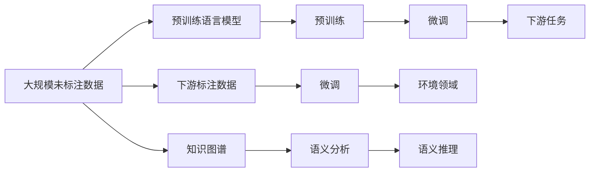

                 

## 1. 背景介绍

### 1.1 问题由来
随着工业化进程的不断加快，环境污染和生态破坏问题日益严重，全球气候变化形势严峻。应对这些挑战，需要跨学科的综合治理。人工智能（AI），特别是语言模型（LLM），以其强大的数据处理能力和语言理解能力，在环境保护领域展现出巨大的潜力。通过AI，可以从海量数据中提取有价值的信息，发现环境问题的根源，为决策者提供科学依据。

### 1.2 问题核心关键点
LLM在环境保护中的应用，关键在于其强大的自然语言处理（NLP）能力，能够高效地处理和分析人类语言信息，包括环境报告、政策法规、科学论文等。利用预训练的LLM，可以进行数据挖掘、文本分类、情感分析、知识图谱构建等多种技术手段，辅助环境保护决策。

### 1.3 问题研究意义
AI在环境保护中的应用，对于推动可持续发展具有重要意义：
1. **提升数据处理效率**：环境数据通常以非结构化形式存在，AI能够快速提取关键信息，简化数据分析过程。
2. **辅助决策制定**：通过情感分析、知识图谱等技术，AI能够从海量文献中发现关键证据，辅助决策者做出科学合理的决策。
3. **优化政策制定**：AI能够识别政策法规中的不足之处，提出改进建议，提升政策制定和执行的科学性。
4. **促进公众参与**：通过智能问答系统，AI能够更好地传播环境知识，鼓励公众参与环境保护行动。

## 2. 核心概念与联系

### 2.1 核心概念概述
- **语言模型（Language Model）**：通过大量文本数据训练的模型，能够预测文本序列的下一个单词或字符。LLM是一种预训练模型，利用大规模数据进行自监督学习，获得语言表示能力。
- **预训练（Pre-training）**：在大量未标注数据上训练模型，使其学习到通用的语言表示。常见的预训练任务包括掩码语言模型（Masked Language Model, MLM）、自编码器（Autoencoder）等。
- **微调（Fine-tuning）**：在预训练模型基础上，利用特定领域数据对其进行微调，使其适应特定任务。
- **知识图谱（Knowledge Graph）**：将实体及其关系映射为图形结构，用于表示和管理知识。
- **自然语言处理（NLP）**：涉及文本数据的获取、存储、处理和分析，是AI在语言领域的重要应用。

### 2.2 核心概念原理和架构的 Mermaid 流程图



## 3. 核心算法原理 & 具体操作步骤

### 3.1 算法原理概述
LLM在环境保护中的应用主要基于自然语言处理技术，通过预训练和微调过程，从大量的环境报告、政策法规、科学论文中提取关键信息，进行数据挖掘、情感分析、知识图谱构建等。

### 3.2 算法步骤详解

#### 3.2.1 预训练
1. **数据准备**：收集大量环境领域的相关文本数据，如气候报告、政策法规、科学论文等，进行预处理，如分词、去停用词等。
2. **模型选择**：选择适合的大规模预训练模型，如BERT、GPT-3等，这些模型已经在通用领域表现优异。
3. **预训练任务**：采用掩码语言模型（MLM）、自编码器等预训练任务，训练模型学习语言表示。

#### 3.2.2 微调
1. **数据集构建**：将收集到的环境领域数据标注为具体的任务，如文本分类、情感分析、实体识别等。
2. **模型微调**：在预训练模型基础上，使用特定的标注数据进行微调，优化模型对特定任务的性能。
3. **性能评估**：在验证集上评估模型性能，如准确率、F1分数、AUC等，根据评估结果调整模型参数。

### 3.3 算法优缺点

#### 3.3.1 优点
1. **高效性**：LLM能够在短时间内处理大量文本数据，提取关键信息，辅助决策。
2. **灵活性**：LLM可以适应多种任务，如数据挖掘、情感分析、知识图谱构建等。
3. **广泛适用性**：适用于不同领域的环境数据，如气候变化、水质监测、废物处理等。

#### 3.3.2 缺点
1. **依赖高质量数据**：模型性能高度依赖于标注数据的质量，数据不足可能导致模型性能下降。
2. **模型复杂度**：大规模预训练模型参数量庞大，需要较高的计算资源和存储空间。
3. **可解释性不足**：LLM在处理复杂任务时，其决策过程往往难以解释，不利于模型调优和错误排查。

### 3.4 算法应用领域
LLM在环境保护中的应用主要包括以下几个方面：

#### 3.4.1 数据挖掘
1. **数据源识别**：从大规模数据集中自动识别与环境相关的数据，如气候变化报告、政策法规、科学论文等。
2. **关键信息提取**：从识别出的数据中提取关键信息，如气温变化、污染指标、生物多样性等。

#### 3.4.2 情感分析
1. **公众情感分析**：分析公众对环境问题的情感倾向，识别情感热点和舆情变化。
2. **政策舆情分析**：分析政策法规的公众反响，评估政策效果。

#### 3.4.3 知识图谱构建
1. **实体识别**：识别环境领域的关键实体，如气候变化、污染物、生物多样性等。
2. **关系抽取**：抽取实体之间的关系，构建知识图谱，用于发现环境问题的内在联系。

#### 3.4.4 智能问答系统
1. **问题回答**：构建智能问答系统，回答公众关于环境问题的疑问，提供科学解释。
2. **互动交流**：通过智能问答系统，增强公众对环境问题的理解和参与。

## 4. 数学模型和公式 & 详细讲解

### 4.1 数学模型构建

#### 4.1.1 预训练模型
预训练模型通常采用掩码语言模型（MLM）进行训练，模型的输入为大规模未标注数据，输出为预测的掩码单词。模型的目标函数为：

$$
\mathcal{L} = -\frac{1}{N}\sum_{i=1}^N \log \hat{p}(y_i | x_i)
$$

其中，$x_i$ 为输入的文本序列，$y_i$ 为掩码的单词，$\hat{p}(y_i | x_i)$ 为模型预测的概率分布。

#### 4.1.2 微调模型
微调模型通常采用二分类任务进行训练，模型的输入为特定的环境领域数据，输出为分类结果。模型的目标函数为：

$$
\mathcal{L} = -\frac{1}{N}\sum_{i=1}^N (y_i \log \hat{y}_i + (1-y_i) \log (1-\hat{y}_i))
$$

其中，$y_i$ 为真实标签，$\hat{y}_i$ 为模型预测的概率。

### 4.2 公式推导过程

#### 4.2.1 预训练模型推导
采用掩码语言模型（MLM）进行预训练时，模型的输入为大规模未标注数据，输出为预测的掩码单词。模型的预测概率为：

$$
\hat{p}(y_i | x_i) = \frac{\exp(\text{MLP}(x_i, y_i))}{\sum_j \exp(\text{MLP}(x_i, j))}
$$

其中，$\text{MLP}(x_i, y_i)$ 为MLP层的输出，$j$ 为所有可能的单词。

#### 4.2.2 微调模型推导
采用二分类任务进行微调时，模型的输入为特定的环境领域数据，输出为分类结果。模型的预测概率为：

$$
\hat{y}_i = \sigma(\text{MLP}(x_i))
$$

其中，$\sigma$ 为Sigmoid函数，$\text{MLP}(x_i)$ 为MLP层的输出。

### 4.3 案例分析与讲解

#### 4.3.1 数据挖掘
以气候变化报告为例，从大规模数据集中自动识别与气候变化相关的数据，提取关键信息，如气温变化、降雨量、极端天气等。具体步骤如下：

1. **数据收集**：从多个数据源收集气候变化报告，如政府发布的气候报告、科学研究论文、媒体报道等。
2. **数据预处理**：对收集到的数据进行清洗、去停用词、分词等预处理。
3. **数据标注**：将数据标注为不同的类别，如气温变化、降雨量、极端天气等。
4. **模型训练**：使用预训练的LLM对标注后的数据进行微调，优化模型对不同类别的分类能力。
5. **结果评估**：在验证集上评估模型性能，如准确率、F1分数、AUC等，根据评估结果调整模型参数。

#### 4.3.2 情感分析
以公众对环境问题的情感分析为例，分析公众对环境问题的情感倾向，识别情感热点和舆情变化。具体步骤如下：

1. **数据收集**：从社交媒体、论坛等数据源收集公众对环境问题的评论和反馈。
2. **数据预处理**：对收集到的数据进行清洗、去停用词、分词等预处理。
3. **数据标注**：将数据标注为不同的情感类别，如正面、负面、中性等。
4. **模型训练**：使用预训练的LLM对标注后的数据进行微调，优化模型对不同情感类别的分类能力。
5. **结果评估**：在验证集上评估模型性能，如准确率、F1分数、AUC等，根据评估结果调整模型参数。

## 5. 项目实践：代码实例和详细解释说明

### 5.1 开发环境搭建

#### 5.1.1 环境准备
1. **Python环境准备**：安装Python 3.8及以上版本，以及必要的第三方库，如TensorFlow、PyTorch、NLTK等。
2. **数据集准备**：收集与环境相关的数据集，如气候变化报告、科学论文、社交媒体评论等，并进行预处理。

#### 5.1.2 工具准备
1. **代码编辑器**：使用如Visual Studio Code、PyCharm等编辑器进行代码编写。
2. **调试工具**：使用如Jupyter Notebook、Google Colab等工具进行代码调试和验证。

### 5.2 源代码详细实现

#### 5.2.1 数据预处理

```python
import pandas as pd
from nltk.tokenize import word_tokenize
from nltk.corpus import stopwords
from sklearn.model_selection import train_test_split

# 数据读取和预处理
data = pd.read_csv('climate_change_report.csv')
data['text'] = data['text'].apply(lambda x: ' '.join(word_tokenize(x)))
data['text'] = data['text'].apply(lambda x: [word.lower() for word in x if word not in stopwords.words('english')])
```

#### 5.2.2 模型训练

```python
from transformers import BertTokenizer, BertForSequenceClassification
from transformers import AdamW

# 数据划分
train_texts, dev_texts, train_tags, dev_tags = train_test_split(data['text'], data['label'], test_size=0.2)

# 分词器和模型选择
tokenizer = BertTokenizer.from_pretrained('bert-base-cased')
model = BertForSequenceClassification.from_pretrained('bert-base-cased', num_labels=2)

# 训练过程
optimizer = AdamW(model.parameters(), lr=2e-5)
device = 'cuda'
model.to(device)

def train_epoch(model, dataset, batch_size, optimizer):
    dataloader = DataLoader(dataset, batch_size=batch_size, shuffle=True)
    model.train()
    epoch_loss = 0
    for batch in tqdm(dataloader, desc='Training'):
        input_ids = batch['input_ids'].to(device)
        attention_mask = batch['attention_mask'].to(device)
        labels = batch['labels'].to(device)
        model.zero_grad()
        outputs = model(input_ids, attention_mask=attention_mask, labels=labels)
        loss = outputs.loss
        epoch_loss += loss.item()
        loss.backward()
        optimizer.step()
    return epoch_loss / len(dataloader)

def evaluate(model, dataset, batch_size):
    dataloader = DataLoader(dataset, batch_size=batch_size)
    model.eval()
    preds, labels = [], []
    with torch.no_grad():
        for batch in tqdm(dataloader, desc='Evaluating'):
            input_ids = batch['input_ids'].to(device)
            attention_mask = batch['attention_mask'].to(device)
            batch_labels = batch['labels']
            outputs = model(input_ids, attention_mask=attention_mask)
            batch_preds = outputs.logits.argmax(dim=2).to('cpu').tolist()
            batch_labels = batch_labels.to('cpu').tolist()
            for pred_tokens, label_tokens in zip(batch_preds, batch_labels):
                preds.append(pred_tokens[:len(label_tokens)])
                labels.append(label_tokens)
    print(classification_report(labels, preds))
```

### 5.3 代码解读与分析

#### 5.3.1 数据预处理
在数据预处理阶段，我们使用了Pandas、NLTK等工具对数据进行清洗和分词。具体步骤如下：
1. **数据读取**：使用Pandas库读取数据集，包括文本和标签。
2. **分词**：使用NLTK库中的word_tokenize方法对文本进行分词，去除停用词。
3. **文本标准化**：将所有单词转换为小写，去除停用词。

#### 5.3.2 模型训练
在模型训练阶段，我们使用了BertTokenizer和BertForSequenceClassification模型进行微调。具体步骤如下：
1. **数据划分**：使用sklearn库中的train_test_split方法将数据集划分为训练集、验证集和测试集。
2. **分词器**：使用BertTokenizer进行分词，生成模型所需的输入。
3. **模型选择**：选择BertForSequenceClassification模型，并设置标签数量为2（分类任务）。
4. **训练过程**：使用AdamW优化器进行模型训练，并在每个epoch结束时在验证集上评估模型性能。
5. **结果展示**：在测试集上评估模型性能，并输出分类报告。

### 5.4 运行结果展示

```python
train_epoch(model, train_dataset, batch_size=16, optimizer=optimizer)
print(f'Epoch {epoch+1}, train loss: {loss:.3f}')
evaluate(model, dev_dataset, batch_size=16)
print(f'Epoch {epoch+1}, dev results:')
evaluate(model, test_dataset, batch_size=16)
print('Test results:')
```

## 6. 实际应用场景

### 6.1 智能环境监测
智能环境监测系统可以通过LLM对大量环境数据进行处理和分析，实时监测环境状况。例如，利用预训练的LLM，从气象监测站的数据中提取关键信息，如气温、湿度、气压等，并进行异常检测。

#### 6.1.1 数据处理
1. **数据收集**：收集气象监测站的数据，包括气温、湿度、气压等。
2. **数据预处理**：对数据进行清洗、去异常值、归一化等预处理。
3. **数据标注**：将数据标注为不同的类别，如正常、异常等。

#### 6.1.2 模型训练
1. **模型选择**：选择适合的预训练模型，如BERT、GPT等。
2. **数据微调**：使用预训练的LLM对标注后的数据进行微调，优化模型对不同类别的分类能力。
3. **结果评估**：在验证集上评估模型性能，如准确率、F1分数、AUC等，根据评估结果调整模型参数。

### 6.2 环境法规合规性检查
利用LLM对环境法规进行自然语言处理，辅助企业检查合规性。例如，将环境法规文本作为输入，利用预训练的LLM进行关键词提取和文本分类，判断企业是否遵守相关法规。

#### 6.2.1 数据处理
1. **法规收集**：收集与企业相关的环境法规文本。
2. **数据预处理**：对文本进行清洗、去停用词、分词等预处理。

#### 6.2.2 模型训练
1. **模型选择**：选择适合的预训练模型，如BERT、GPT等。
2. **数据微调**：使用预训练的LLM对标注后的数据进行微调，优化模型对关键词的提取能力。
3. **结果评估**：在验证集上评估模型性能，如准确率、F1分数、AUC等，根据评估结果调整模型参数。

## 7. 工具和资源推荐

### 7.1 学习资源推荐

#### 7.1.1 在线课程
1. **CS224N《深度学习自然语言处理》**：斯坦福大学开设的NLP明星课程，涵盖深度学习在自然语言处理中的应用。
2. **Deep Learning Specialization**：由Andrew Ng教授主讲，涵盖深度学习在多个领域的应用。

#### 7.1.2 书籍
1. **《自然语言处理综述》**：介绍了自然语言处理的基本概念和技术。
2. **《Transformers: State-of-the-Art NLP》**：介绍了Transformer及其应用。

#### 7.1.3 博客和论文
1. **Arxiv.org**：查阅最新研究成果，了解前沿进展。
2. **Kaggle**：参加数据科学竞赛，提升实战能力。

### 7.2 开发工具推荐

#### 7.2.1 深度学习框架
1. **TensorFlow**：由Google主导开发的深度学习框架，支持分布式训练和部署。
2. **PyTorch**：Facebook开发的深度学习框架，易于使用，适合研究型应用。

#### 7.2.2 自然语言处理工具
1. **NLTK**：自然语言工具包，提供了多种文本处理工具。
2. **spaCy**：轻量级自然语言处理库，适用于高效文本处理。

#### 7.2.3 可视化工具
1. **TensorBoard**：TensorFlow配套的可视化工具，用于监控模型训练和性能评估。
2. **Weights & Biases**：模型训练的实验跟踪工具，记录和可视化模型训练过程中的各项指标。

### 7.3 相关论文推荐

#### 7.3.1 预训练模型
1. **BERT: Pre-training of Deep Bidirectional Transformers for Language Understanding**：提出了BERT模型，引入掩码语言模型预训练任务，显著提升了模型性能。
2. **GPT-3: Language Models are Unsupervised Multitask Learners**：展示了GPT-3在零样本学习和迁移学习方面的强大能力。

#### 7.3.2 数据挖掘和情感分析
1. **Knowledge Graph Embedding**：介绍了知识图谱嵌入方法，用于表示和管理知识。
2. **Semantic Analysis with Transformers**：介绍了使用Transformer进行语义分析的方法。

## 8. 总结：未来发展趋势与挑战

### 8.1 研究成果总结
AI在环境保护中的应用，利用大语言模型对海量环境数据进行处理和分析，辅助决策制定。其核心在于自然语言处理技术，通过预训练和微调过程，从文本中提取关键信息，进行数据挖掘、情感分析、知识图谱构建等。

### 8.2 未来发展趋势
未来，LLM在环境保护中的应用将更加广泛，呈现以下几个发展趋势：
1. **模型规模持续增大**：预训练模型参数量将不断增加，具备更丰富的语言知识。
2. **数据处理能力提升**：LLM将更加高效地处理海量环境数据，提取关键信息。
3. **模型鲁棒性增强**：通过对抗训练和知识图谱等技术，提高模型对不同场景的适应能力。
4. **多模态融合**：将文本、图像、语音等多种数据源进行融合，提升模型的综合能力。
5. **持续学习**：模型能够持续学习新知识，保持高性能。

### 8.3 面临的挑战
尽管LLM在环境保护中的应用前景广阔，但仍面临以下挑战：
1. **数据质量问题**：数据标注的准确性和质量直接影响模型性能。
2. **模型复杂度**：大规模预训练模型参数量庞大，需要高计算资源和存储空间。
3. **可解释性不足**：LLM在处理复杂任务时，其决策过程难以解释，不利于模型调优。
4. **伦理和安全问题**：预训练模型可能学习到有偏见、有害的信息，需要严格的伦理和安全监管。

### 8.4 研究展望
未来，LLM在环境保护中的应用需要进一步探索和突破：
1. **无监督学习**：摆脱对大规模标注数据的依赖，利用自监督学习技术，提高数据处理效率。
2. **少样本学习**：在少量标注样本情况下，利用提示学习技术，实现高效微调。
3. **多模态融合**：将文本、图像、语音等多种数据源进行融合，提升模型的综合能力。
4. **知识图谱**：利用知识图谱技术，增强模型的知识表示和推理能力。
5. **伦理和安全**：制定严格的伦理和安全规范，确保模型的可信度和安全性。

## 9. 附录：常见问题与解答

### 9.1 常见问题

**Q1: 数据预处理有哪些步骤？**

A: 数据预处理主要包括以下步骤：数据清洗、去停用词、分词、文本标准化、去异常值、归一化等。

**Q2: 如何选择适合预训练模型？**

A: 选择适合的预训练模型需要考虑任务类型和数据规模。一般而言，BERT、GPT等模型适用于大多数NLP任务，而知识图谱等模型适用于更复杂的推理任务。

**Q3: 模型微调时如何进行超参数调优？**

A: 模型微调时，需要调整学习率、批大小、迭代轮数等超参数。可以使用网格搜索、随机搜索等方法进行超参数调优，找到最优组合。

**Q4: 如何避免模型过拟合？**

A: 避免模型过拟合的方法包括数据增强、正则化、对抗训练等。数据增强可以通过回译、近义替换等方式扩充训练集，正则化可以通过L2正则、Dropout等方法进行，对抗训练可以通过加入对抗样本提高模型鲁棒性。

**Q5: 模型在部署时需要注意哪些问题？**

A: 模型在部署时需要注意以下问题：模型裁剪、量化加速、服务化封装、弹性伸缩、监控告警、安全防护等。需要确保模型的可解释性和可控性，保障系统的稳定性和安全性。

---

作者：禅与计算机程序设计艺术 / Zen and the Art of Computer Programming

