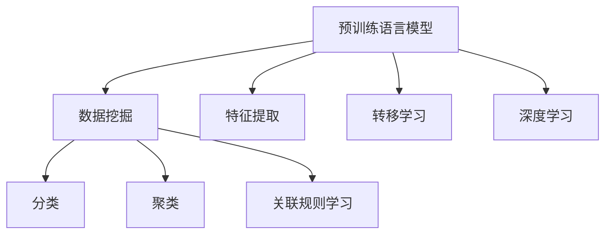

                 

# LLM对传统数据挖掘的革新

## 1. 背景介绍

### 1.1 问题由来

随着大数据时代的到来，数据挖掘技术在各个领域得到了广泛应用，包括市场分析、社交媒体分析、健康研究等。然而，传统的基于统计学方法的数据挖掘算法往往需要庞大的数据集和复杂的特征工程，才能获得较好的结果。与此同时，数据挖掘的结果往往缺乏解释性和可解释性，难以应用于实际业务决策中。

近年来，基于深度学习的方法在数据挖掘中逐渐崭露头角，尤其是自然语言处理领域的预训练语言模型(Pre-trained Language Model, LLM)，如BERT、GPT等，为数据挖掘带来了革命性的变化。LLM通过在大规模无标签文本语料上进行预训练，学习到了丰富的语言知识和表示，具备强大的语义理解和生成能力。这种预训练语言模型已经成为了NLP领域的基石，并逐渐被应用于其他领域的复杂数据挖掘任务中，为传统数据挖掘方法带来了新的活力和突破。

### 1.2 问题核心关键点

为了更好地理解LLM对传统数据挖掘的革新，本节将介绍几个密切相关的核心概念：

- 预训练语言模型(LLM)：以自回归(如GPT)或自编码(如BERT)模型为代表的大规模预训练语言模型。通过在大规模无标签文本语料上进行预训练，学习通用的语言表示，具备强大的语言理解和生成能力。

- 数据挖掘(Data Mining)：从大量数据中提取有用信息、发现知识、形成规律的过程。数据挖掘包括分类、聚类、关联规则学习等常见算法。

- 转移学习(Transfer Learning)：指将一个领域学习到的知识，迁移应用到另一个不同但相关的领域的学习范式。预训练模型即是一种典型的转移学习方式。

- 特征提取(Feature Extraction)：通过预处理和选择，提取数据中的关键特征，用于后续的分析和建模。传统数据挖掘方法依赖手工特征提取，工作量大且容易陷入特征空间维度灾难。

- 深度学习(Deep Learning)：一种基于神经网络的机器学习技术，具备很强的非线性建模能力。深度学习在计算机视觉、语音识别、自然语言处理等领域表现优异。

这些核心概念之间的逻辑关系可以通过以下Mermaid流程图来展示：



这个流程图展示了大语言模型的核心概念及其与数据挖掘的联系：

1. 大语言模型通过预训练获得基础能力。
2. 数据挖掘通过特征提取、分类、聚类、关联规则学习等方法，处理并提取数据中的有用信息。
3. 转移学习将预训练模型作为初始化参数，对数据挖掘任务进行优化，提升模型效果。
4. 深度学习作为高级方法，能处理非线性、高维数据，提升模型性能。

这些概念共同构成了数据挖掘的算法框架，使得深度学习与数据挖掘技术相得益彰，为数据挖掘带来了新的方法和思路。

## 2. 核心概念与联系

### 2.1 核心概念概述

为更好地理解LLM对传统数据挖掘的革新，本节将介绍几个密切相关的核心概念：

- 预训练语言模型(LLM)：以自回归(如GPT)或自编码(如BERT)模型为代表的大规模预训练语言模型。通过在大规模无标签文本语料上进行预训练，学习到了丰富的语言知识和表示，具备强大的语言理解和生成能力。

- 数据挖掘(Data Mining)：从大量数据中提取有用信息、发现知识、形成规律的过程。数据挖掘包括分类、聚类、关联规则学习等常见算法。

- 转移学习(Transfer Learning)：指将一个领域学习到的知识，迁移应用到另一个不同但相关的领域的学习范式。预训练模型即是一种典型的转移学习方式。

- 特征提取(Feature Extraction)：通过预处理和选择，提取数据中的关键特征，用于后续的分析和建模。传统数据挖掘方法依赖手工特征提取，工作量大且容易陷入特征空间维度灾难。

- 深度学习(Deep Learning)：一种基于神经网络的机器学习技术，具备很强的非线性建模能力。深度学习在计算机视觉、语音识别、自然语言处理等领域表现优异。

这些核心概念之间的逻辑关系可以通过以下Mermaid流程图来展示：


这个流程图展示了大语言模型的核心概念及其与数据挖掘的联系：

1. 大语言模型通过预训练获得基础能力。
2. 数据挖掘通过特征提取、分类、聚类、关联规则学习等方法，处理并提取数据中的有用信息。
3. 转移学习将预训练模型作为初始化参数，对数据挖掘任务进行优化，提升模型效果。
4. 深度学习作为高级方法，能处理非线性、高维数据，提升模型性能。

这些概念共同构成了数据挖掘的算法框架，使得深度学习与数据挖掘技术相得益彰，为数据挖掘带来了新的方法和思路。

## 3. 核心算法原理 & 具体操作步骤
### 3.1 算法原理概述

基于预训练语言模型的大规模数据挖掘，本质上是一个预训练-微调的深度学习过程。其核心思想是：将预训练的大语言模型视作一个强大的"特征提取器"，通过在数据挖掘任务的标注数据上进行有监督地微调，使得模型输出能够匹配任务标签，从而获得针对特定任务优化的模型。

形式化地，假设预训练语言模型为 $M_{\theta}$，其中 $\theta$ 为预训练得到的模型参数。给定数据挖掘任务 $T$ 的标注数据集 $D=\{(x_i,y_i)\}_{i=1}^N$，微调的目标是找到新的模型参数 $\hat{\theta}$，使得：

$$
\hat{\theta}=\mathop{\arg\min}_{\theta} \mathcal{L}(M_{\theta},D)
$$

其中 $\mathcal{L}$ 为针对任务 $T$ 设计的损失函数，用于衡量模型预测输出与真实标签之间的差异。常见的损失函数包括交叉熵损失、均方误差损失等。

通过梯度下降等优化算法，微调过程不断更新模型参数 $\theta$，最小化损失函数 $\mathcal{L}$，使得模型输出逼近真实标签。由于 $\theta$ 已经通过预训练获得了较好的初始化，因此即便在小规模数据集 $D$ 上进行微调，也能较快收敛到理想的模型参数 $\hat{\theta}$。

### 3.2 算法步骤详解

基于预训练语言模型的大规模数据挖掘，一般包括以下几个关键步骤：

**Step 1: 准备预训练模型和数据集**
- 选择合适的预训练语言模型 $M_{\theta}$ 作为初始化参数，如 BERT、GPT等。
- 准备数据挖掘任务的标注数据集 $D$，划分为训练集、验证集和测试集。一般要求标注数据与预训练数据的分布不要差异过大。

**Step 2: 添加任务适配层**
- 根据任务类型，在预训练模型顶层设计合适的输出层和损失函数。
- 对于分类任务，通常在顶层添加线性分类器和交叉熵损失函数。
- 对于生成任务，通常使用语言模型的解码器输出概率分布，并以负对数似然为损失函数。

**Step 3: 设置微调超参数**
- 选择合适的优化算法及其参数，如 AdamW、SGD 等，设置学习率、批大小、迭代轮数等。
- 设置正则化技术及强度，包括权重衰减、Dropout、Early Stopping 等。
- 确定冻结预训练参数的策略，如仅微调顶层，或全部参数都参与微调。

**Step 4: 执行梯度训练**
- 将训练集数据分批次输入模型，前向传播计算损失函数。
- 反向传播计算参数梯度，根据设定的优化算法和学习率更新模型参数。
- 周期性在验证集上评估模型性能，根据性能指标决定是否触发 Early Stopping。
- 重复上述步骤直到满足预设的迭代轮数或 Early Stopping 条件。

**Step 5: 测试和部署**
- 在测试集上评估微调后模型 $M_{\hat{\theta}}$ 的性能，对比微调前后的精度提升。
- 使用微调后的模型对新样本进行推理预测，集成到实际的应用系统中。
- 持续收集新的数据，定期重新微调模型，以适应数据分布的变化。

以上是基于预训练语言模型的大规模数据挖掘的一般流程。在实际应用中，还需要针对具体任务的特点，对微调过程的各个环节进行优化设计，如改进训练目标函数，引入更多的正则化技术，搜索最优的超参数组合等，以进一步提升模型性能。

### 3.3 算法优缺点

基于预训练语言模型的大规模数据挖掘，具有以下优点：

- 简单高效。只需准备少量标注数据，即可对预训练模型进行快速适配，获得较大的性能提升。
- 通用适用。适用于各种数据挖掘任务，包括分类、聚类、关联规则学习等，设计简单的任务适配层即可实现微调。
- 参数高效。利用参数高效微调技术，在固定大部分预训练参数的情况下，仍可取得不错的提升。
- 效果显著。在学术界和工业界的诸多任务上，基于微调的方法已经刷新了最先进的性能指标。

同时，该方法也存在一定的局限性：

- 依赖标注数据。微调的效果很大程度上取决于标注数据的质量和数量，获取高质量标注数据的成本较高。
- 迁移能力有限。当目标任务与预训练数据的分布差异较大时，微调的性能提升有限。
- 负面效果传递。预训练模型的固有偏见、有害信息等，可能通过微调传递到下游任务，造成负面影响。
- 可解释性不足。微调模型的决策过程通常缺乏可解释性，难以对其推理逻辑进行分析和调试。

尽管存在这些局限性，但就目前而言，基于预训练语言模型的微调方法仍是大数据挖掘任务的主流范式。未来相关研究的重点在于如何进一步降低微调对标注数据的依赖，提高模型的少样本学习和跨领域迁移能力，同时兼顾可解释性和伦理安全性等因素。

### 3.4 算法应用领域

基于预训练语言模型的大规模数据挖掘方法，在多个领域得到了广泛的应用，例如：

- 医疗数据挖掘：利用电子健康记录和临床试验数据，进行疾病诊断、药物发现、病人分类等任务。
- 金融数据挖掘：从交易记录和财务报告中，挖掘出潜在的欺诈行为、信用评分、投资组合优化等。
- 市场营销：通过社交媒体和销售记录，分析用户行为模式，优化广告投放、产品推荐等。
- 气象数据分析：从气象卫星和地面观测数据中，预测天气变化趋势，提高灾害预警能力。
- 网络安全：通过日志文件和异常行为检测数据，挖掘出潜在的安全威胁，保护网络安全。

除了上述这些经典任务外，基于预训练语言模型的大规模数据挖掘方法也被创新性地应用到更多场景中，如时间序列分析、异常检测、复杂事件识别等，为大数据挖掘技术带来了全新的突破。

## 4. 数学模型和公式 & 详细讲解  
### 4.1 数学模型构建

本节将使用数学语言对基于预训练语言模型的大规模数据挖掘过程进行更加严格的刻画。

记预训练语言模型为 $M_{\theta}$，其中 $\theta$ 为预训练得到的模型参数。假设数据挖掘任务 $T$ 的训练集为 $D=\{(x_i,y_i)\}_{i=1}^N, x_i \in \mathcal{X}, y_i \in \mathcal{Y}$。

定义模型 $M_{\theta}$ 在输入 $x$ 上的输出为 $\hat{y}=M_{\theta}(x) \in [0,1]$，表示样本属于正类的概率。真实标签 $y \in \{0,1\}$。则二分类交叉熵损失函数定义为：

$$
\ell(M_{\theta}(x),y) = -[y\log \hat{y} + (1-y)\log (1-\hat{y})]
$$

将其代入经验风险公式，得：

$$
\mathcal{L}(\theta) = -\frac{1}{N}\sum_{i=1}^N [y_i\log M_{\theta}(x_i)+(1-y_i)\log(1-M_{\theta}(x_i))]
$$

根据链式法则，损失函数对参数 $\theta_k$ 的梯度为：

$$
\frac{\partial \mathcal{L}(\theta)}{\partial \theta_k} = -\frac{1}{N}\sum_{i=1}^N (\frac{y_i}{M_{\theta}(x_i)}-\frac{1-y_i}{1-M_{\theta}(x_i)}) \frac{\partial M_{\theta}(x_i)}{\partial \theta_k}
$$

其中 $\frac{\partial M_{\theta}(x_i)}{\partial \theta_k}$ 可进一步递归展开，利用自动微分技术完成计算。

在得到损失函数的梯度后，即可带入参数更新公式，完成模型的迭代优化。重复上述过程直至收敛，最终得到适应下游任务的最优模型参数 $\theta^*$。

## 5. 项目实践：代码实例和详细解释说明
### 5.1 开发环境搭建

在进行数据挖掘实践前，我们需要准备好开发环境。以下是使用Python进行PyTorch开发的环境配置流程：

1. 安装Anaconda：从官网下载并安装Anaconda，用于创建独立的Python环境。

2. 创建并激活虚拟环境：
```bash
conda create -n pytorch-env python=3.8 
conda activate pytorch-env
```

3. 安装PyTorch：根据CUDA版本，从官网获取对应的安装命令。例如：
```bash
conda install pytorch torchvision torchaudio cudatoolkit=11.1 -c pytorch -c conda-forge
```

4. 安装Transformers库：
```bash
pip install transformers
```

5. 安装各类工具包：
```bash
pip install numpy pandas scikit-learn matplotlib tqdm jupyter notebook ipython
```

完成上述步骤后，即可在`pytorch-env`环境中开始数据挖掘实践。

### 5.2 源代码详细实现

这里我们以情感分析任务为例，给出使用Transformers库对BERT模型进行数据挖掘的PyTorch代码实现。

首先，定义情感分析任务的数据处理函数：

```python
from transformers import BertTokenizer
from torch.utils.data import Dataset
import torch

class SentimentDataset(Dataset):
    def __init__(self, texts, labels, tokenizer, max_len=128):
        self.texts = texts
        self.labels = labels
        self.tokenizer = tokenizer
        self.max_len = max_len
        
    def __len__(self):
        return len(self.texts)
    
    def __getitem__(self, item):
        text = self.texts[item]
        label = self.labels[item]
        
        encoding = self.tokenizer(text, return_tensors='pt', max_length=self.max_len, padding='max_length', truncation=True)
        input_ids = encoding['input_ids'][0]
        attention_mask = encoding['attention_mask'][0]
        
        # 对label进行one-hot编码
        encoded_labels = [0 if label == 'negative' else 1]
        encoded_labels.extend([0] * (self.max_len - len(encoded_labels)))
        labels = torch.tensor(encoded_labels, dtype=torch.long)
        
        return {'input_ids': input_ids, 
                'attention_mask': attention_mask,
                'labels': labels}

# 创建dataset
tokenizer = BertTokenizer.from_pretrained('bert-base-cased')

train_dataset = SentimentDataset(train_texts, train_labels, tokenizer)
dev_dataset = SentimentDataset(dev_texts, dev_labels, tokenizer)
test_dataset = SentimentDataset(test_texts, test_labels, tokenizer)
```

然后，定义模型和优化器：

```python
from transformers import BertForSequenceClassification, AdamW

model = BertForSequenceClassification.from_pretrained('bert-base-cased', num_labels=2)

optimizer = AdamW(model.parameters(), lr=2e-5)
```

接着，定义训练和评估函数：

```python
from torch.utils.data import DataLoader
from tqdm import tqdm
from sklearn.metrics import classification_report

device = torch.device('cuda') if torch.cuda.is_available() else torch.device('cpu')
model.to(device)

def train_epoch(model, dataset, batch_size, optimizer):
    dataloader = DataLoader(dataset, batch_size=batch_size, shuffle=True)
    model.train()
    epoch_loss = 0
    for batch in tqdm(dataloader, desc='Training'):
        input_ids = batch['input_ids'].to(device)
        attention_mask = batch['attention_mask'].to(device)
        labels = batch['labels'].to(device)
        model.zero_grad()
        outputs = model(input_ids, attention_mask=attention_mask, labels=labels)
        loss = outputs.loss
        epoch_loss += loss.item()
        loss.backward()
        optimizer.step()
    return epoch_loss / len(dataloader)

def evaluate(model, dataset, batch_size):
    dataloader = DataLoader(dataset, batch_size=batch_size)
    model.eval()
    preds, labels = [], []
    with torch.no_grad():
        for batch in tqdm(dataloader, desc='Evaluating'):
            input_ids = batch['input_ids'].to(device)
            attention_mask = batch['attention_mask'].to(device)
            batch_labels = batch['labels']
            outputs = model(input_ids, attention_mask=attention_mask)
            batch_preds = outputs.logits.argmax(dim=2).to('cpu').tolist()
            batch_labels = batch_labels.to('cpu').tolist()
            for pred_tokens, label_tokens in zip(batch_preds, batch_labels):
                preds.append(pred_tokens[:len(label_tokens)])
                labels.append(label_tokens)
                
    print(classification_report(labels, preds))
```

最后，启动训练流程并在测试集上评估：

```python
epochs = 5
batch_size = 16

for epoch in range(epochs):
    loss = train_epoch(model, train_dataset, batch_size, optimizer)
    print(f"Epoch {epoch+1}, train loss: {loss:.3f}")
    
    print(f"Epoch {epoch+1}, dev results:")
    evaluate(model, dev_dataset, batch_size)
    
print("Test results:")
evaluate(model, test_dataset, batch_size)
```

以上就是使用PyTorch对BERT进行情感分析任务数据挖掘的完整代码实现。可以看到，得益于Transformers库的强大封装，我们可以用相对简洁的代码完成BERT模型的加载和数据挖掘。

### 5.3 代码解读与分析

让我们再详细解读一下关键代码的实现细节：

**SentimentDataset类**：
- `__init__`方法：初始化文本、标签、分词器等关键组件。
- `__len__`方法：返回数据集的样本数量。
- `__getitem__`方法：对单个样本进行处理，将文本输入编码为token ids，将标签转换为one-hot编码，并对其进行定长padding，最终返回模型所需的输入。

**情感分析任务的训练和评估函数**：
- 使用PyTorch的DataLoader对数据集进行批次化加载，供模型训练和推理使用。
- 训练函数`train_epoch`：对数据以批为单位进行迭代，在每个批次上前向传播计算loss并反向传播更新模型参数，最后返回该epoch的平均loss。
- 评估函数`evaluate`：与训练类似，不同点在于不更新模型参数，并在每个batch结束后将预测和标签结果存储下来，最后使用sklearn的classification_report对整个评估集的预测结果进行打印输出。

**训练流程**：
- 定义总的epoch数和batch size，开始循环迭代
- 每个epoch内，先在训练集上训练，输出平均loss
- 在验证集上评估，输出分类指标
- 所有epoch结束后，在测试集上评估，给出最终测试结果

可以看到，PyTorch配合Transformers库使得BERT数据挖掘的代码实现变得简洁高效。开发者可以将更多精力放在数据处理、模型改进等高层逻辑上，而不必过多关注底层的实现细节。

当然，工业级的系统实现还需考虑更多因素，如模型的保存和部署、超参数的自动搜索、更灵活的任务适配层等。但核心的微调范式基本与此类似。

## 6. 实际应用场景
### 6.1 智能客服系统

基于大语言模型数据挖掘的对话技术，可以广泛应用于智能客服系统的构建。传统客服往往需要配备大量人力，高峰期响应缓慢，且一致性和专业性难以保证。而使用数据挖掘后的对话模型，可以7x24小时不间断服务，快速响应客户咨询，用自然流畅的语言解答各类常见问题。

在技术实现上，可以收集企业内部的历史客服对话记录，将问题和最佳答复构建成监督数据，在此基础上对预训练对话模型进行数据挖掘微调。数据挖掘微调后的对话模型能够自动理解用户意图，匹配最合适的答案模板进行回复。对于客户提出的新问题，还可以接入检索系统实时搜索相关内容，动态组织生成回答。如此构建的智能客服系统，能大幅提升客户咨询体验和问题解决效率。

### 6.2 金融舆情监测

金融机构需要实时监测市场舆论动向，以便及时应对负面信息传播，规避金融风险。传统的人工监测方式成本高、效率低，难以应对网络时代海量信息爆发的挑战。基于大语言模型数据挖掘的文本分类和情感分析技术，为金融舆情监测提供了新的解决方案。

具体而言，可以收集金融领域相关的新闻、报道、评论等文本数据，并对其进行主题标注和情感标注。在此基础上对预训练语言模型进行数据挖掘微调，使其能够自动判断文本属于何种主题，情感倾向是正面、中性还是负面。将数据挖掘微调后的模型应用到实时抓取的网络文本数据，就能够自动监测不同主题下的情感变化趋势，一旦发现负面信息激增等异常情况，系统便会自动预警，帮助金融机构快速应对潜在风险。

### 6.3 个性化推荐系统

当前的推荐系统往往只依赖用户的历史行为数据进行物品推荐，无法深入理解用户的真实兴趣偏好。基于大语言模型数据挖掘的个性化推荐系统，可以更好地挖掘用户行为背后的语义信息，从而提供更精准、多样的推荐内容。

在实践中，可以收集用户浏览、点击、评论、分享等行为数据，提取和用户交互的物品标题、描述、标签等文本内容。将文本内容作为模型输入，用户的后续行为（如是否点击、购买等）作为监督信号，在此基础上数据挖掘微调预训练语言模型。数据挖掘微调后的模型能够从文本内容中准确把握用户的兴趣点。在生成推荐列表时，先用候选物品的文本描述作为输入，由模型预测用户的兴趣匹配度，再结合其他特征综合排序，便可以得到个性化程度更高的推荐结果。

### 6.4 未来应用展望

随着大语言模型数据挖掘技术的发展，未来将在更多领域得到应用，为传统行业带来变革性影响。

在智慧医疗领域，基于数据挖掘的问答系统、病历分析、药物研发等应用将提升医疗服务的智能化水平，辅助医生诊疗，加速新药开发进程。

在智能教育领域，数据挖掘技术可应用于作业批改、学情分析、知识推荐等方面，因材施教，促进教育公平，提高教学质量。

在智慧城市治理中，数据挖掘技术可应用于城市事件监测、舆情分析、应急指挥等环节，提高城市管理的自动化和智能化水平，构建更安全、高效的未来城市。

此外，在企业生产、社会治理、文娱传媒等众多领域，基于大语言模型数据挖掘的人工智能应用也将不断涌现，为经济社会发展注入新的动力。相信随着技术的日益成熟，数据挖掘技术将成为人工智能落地应用的重要范式，推动人工智能向更广阔的领域加速渗透。

## 7. 工具和资源推荐
### 7.1 学习资源推荐

为了帮助开发者系统掌握大语言模型数据挖掘的理论基础和实践技巧，这里推荐一些优质的学习资源：

1. 《Transformer从原理到实践》系列博文：由大模型技术专家撰写，深入浅出地介绍了Transformer原理、BERT模型、数据挖掘技术等前沿话题。

2. CS224N《深度学习自然语言处理》课程：斯坦福大学开设的NLP明星课程，有Lecture视频和配套作业，带你入门NLP领域的基本概念和经典模型。

3. 《Natural Language Processing with Transformers》书籍：Transformers库的作者所著，全面介绍了如何使用Transformers库进行NLP任务开发，包括数据挖掘在内的诸多范式。

4. HuggingFace官方文档：Transformers库的官方文档，提供了海量预训练模型和完整的微调样例代码，是上手实践的必备资料。

5. CLUE开源项目：中文语言理解测评基准，涵盖大量不同类型的中文NLP数据集，并提供了基于数据挖掘的baseline模型，助力中文NLP技术发展。

通过对这些资源的学习实践，相信你一定能够快速掌握大语言模型数据挖掘的精髓，并用于解决实际的NLP问题。
###  7.2 开发工具推荐

高效的开发离不开优秀的工具支持。以下是几款用于大语言模型数据挖掘开发的常用工具：

1. PyTorch：基于Python的开源深度学习框架，灵活动态的计算图，适合快速迭代研究。大部分预训练语言模型都有PyTorch版本的实现。

2. TensorFlow：由Google主导开发的开源深度学习框架，生产部署方便，适合大规模工程应用。同样有丰富的预训练语言模型资源。

3. Transformers库：HuggingFace开发的NLP工具库，集成了众多SOTA语言模型，支持PyTorch和TensorFlow，是进行数据挖掘任务开发的利器。

4. Weights & Biases：模型训练的实验跟踪工具，可以记录和可视化模型训练过程中的各项指标，方便对比和调优。与主流深度学习框架无缝集成。

5. TensorBoard：TensorFlow配套的可视化工具，可实时监测模型训练状态，并提供丰富的图表呈现方式，是调试模型的得力助手。

6. Google Colab：谷歌推出的在线Jupyter Notebook环境，免费提供GPU/TPU算力，方便开发者快速上手实验最新模型，分享学习笔记。

合理利用这些工具，可以显著提升大语言模型数据挖掘的开发效率，加快创新迭代的步伐。

### 7.3 相关论文推荐

大语言模型和数据挖掘技术的发展源于学界的持续研究。以下是几篇奠基性的相关论文，推荐阅读：

1. Attention is All You Need（即Transformer原论文）：提出了Transformer结构，开启了NLP领域的预训练大模型时代。

2. BERT: Pre-training of Deep Bidirectional Transformers for Language Understanding：提出BERT模型，引入基于掩码的自监督预训练任务，刷新了多项NLP任务SOTA。

3. Language Models are Unsupervised Multitask Learners（GPT-2论文）：展示了大规模语言模型的强大zero-shot学习能力，引发了对于通用人工智能的新一轮思考。

4. Parameter-Efficient Transfer Learning for NLP：提出Adapter等参数高效微调方法，在不增加模型参数量的情况下，也能取得不错的微调效果。

5. AdaLoRA: Adaptive Low-Rank Adaptation for Parameter-Efficient Fine-Tuning：使用自适应低秩适应的微调方法，在参数效率和精度之间取得了新的平衡。

这些论文代表了大语言模型数据挖掘技术的发展脉络。通过学习这些前沿成果，可以帮助研究者把握学科前进方向，激发更多的创新灵感。

## 8. 总结：未来发展趋势与挑战

### 8.1 总结

本文对基于预训练语言模型的大规模数据挖掘方法进行了全面系统的介绍。首先阐述了大语言模型和数据挖掘技术的研究背景和意义，明确了数据挖掘在大规模预训练模型上的应用前景。其次，从原理到实践，详细讲解了基于预训练语言模型的大规模数据挖掘过程，给出了数据挖掘任务开发的完整代码实例。同时，本文还广泛探讨了数据挖掘方法在智能客服、金融舆情、个性化推荐等多个行业领域的应用前景，展示了数据挖掘技术在NLP领域的广泛应用。

通过本文的系统梳理，可以看到，基于预训练语言模型的数据挖掘方法正在成为NLP领域的重要范式，极大地拓展了数据挖掘算法的应用边界，催生了更多的落地场景。得益于大规模语料的预训练，数据挖掘模型以更低的时间和标注成本，在小样本条件下也能取得不俗的效果，有力推动了NLP技术的产业化进程。未来，伴随预训练语言模型和数据挖掘方法的持续演进，相信NLP技术将在更广阔的应用领域大放异彩，深刻影响人类的生产生活方式。

### 8.2 未来发展趋势

展望未来，大语言模型数据挖掘技术将呈现以下几个发展趋势：

1. 模型规模持续增大。随着算力成本的下降和数据规模的扩张，预训练语言模型的参数量还将持续增长。超大规模语言模型蕴含的丰富语言知识，有望支撑更加复杂多变的下游任务数据挖掘。

2. 数据挖掘方法日趋多样。除了传统的分类、聚类、关联规则学习外，未来将涌现更多高效的数据挖掘算法，如基于神经网络的模型，融合深度学习、因果推断等先进技术。

3. 持续学习成为常态。随着数据分布的不断变化，数据挖掘模型也需要持续学习新知识以保持性能。如何在不遗忘原有知识的同时，高效吸收新样本信息，将成为重要的研究课题。

4. 标注样本需求降低。受启发于提示学习(Prompt-based Learning)的思路，未来的数据挖掘方法将更好地利用大模型的语言理解能力，通过更加巧妙的任务描述，在更少的标注样本上也能实现理想的数据挖掘效果。

5. 少样本学习(Low-shot Learning)崛起。在大规模预训练模型的基础上，数据挖掘模型可以在更少的标注数据下，快速学习新任务。这一技术有望进一步提升数据挖掘模型的泛化能力和自动化水平。

6. 多模态数据挖掘(Multimodal Data Mining)崛起。当前的数据挖掘方法大多聚焦于单一模态数据，未来将进一步拓展到图像、视频、语音等多模态数据的挖掘。多模态信息的融合，将显著提升数据挖掘模型的感知能力和决策水平。

以上趋势凸显了大语言模型数据挖掘技术的广阔前景。这些方向的探索发展，必将进一步提升数据挖掘系统的性能和应用范围，为NLP技术带来新的变革性影响。

### 8.3 面临的挑战

尽管大语言模型数据挖掘技术已经取得了瞩目成就，但在迈向更加智能化、普适化应用的过程中，它仍面临着诸多挑战：

1. 标注成本瓶颈。虽然数据挖掘技术已经可以处理海量无标签数据，但部分任务仍需大量高质量标注数据，获取标注数据成本高昂。如何降低数据挖掘对标注样本的依赖，将是一大难题。

2. 模型鲁棒性不足。数据挖掘模型面对域外数据时，泛化性能往往大打折扣。对于测试样本的微小扰动，数据挖掘模型的预测也容易发生波动。如何提高数据挖掘模型的鲁棒性，避免灾难性遗忘，还需要更多理论和实践的积累。

3. 推理效率有待提高。尽管大语言模型数据挖掘技术已经取得了较好效果，但在实际部署时往往面临推理速度慢、内存占用大等效率问题。如何在保证性能的同时，简化模型结构，提升推理速度，优化资源占用，将是重要的优化方向。

4. 可解释性亟需加强。当前数据挖掘模型通常缺乏可解释性，难以解释其内部工作机制和决策逻辑。对于医疗、金融等高风险应用，算法的可解释性和可审计性尤为重要。如何赋予数据挖掘模型更强的可解释性，将是亟待攻克的难题。

5. 安全性有待保障。数据挖掘模型难免会学习到有偏见、有害的信息，通过微调传递到下游任务，产生误导性、歧视性的输出，给实际应用带来安全隐患。如何从数据和算法层面消除模型偏见，避免恶意用途，确保输出的安全性，也将是重要的研究课题。

6. 知识整合能力不足。现有的数据挖掘模型往往局限于任务内数据，难以灵活吸收和运用更广泛的先验知识。如何让数据挖掘过程更好地与外部知识库、规则库等专家知识结合，形成更加全面、准确的信息整合能力，还有很大的想象空间。

正视数据挖掘面临的这些挑战，积极应对并寻求突破，将是大语言模型数据挖掘走向成熟的必由之路。相信随着学界和产业界的共同努力，这些挑战终将一一被克服，大语言模型数据挖掘必将在构建人机协同的智能时代中扮演越来越重要的角色。

### 8.4 未来突破

面对大语言模型数据挖掘所面临的种种挑战，未来的研究需要在以下几个方面寻求新的突破：

1. 探索无监督和半监督数据挖掘方法。摆脱对大规模标注数据的依赖，利用自监督学习、主动学习等无监督和半监督范式，最大限度利用非结构化数据，实现更加灵活高效的数据挖掘。

2. 研究参数高效和计算高效的挖掘方法。开发更加参数高效的挖掘方法，在固定大部分预训练参数的同时，只更新极少量的任务相关参数。同时优化挖掘模型的计算图，减少前向传播和反向传播的资源消耗，实现更加轻量级、实时性的部署。

3. 融合因果和对比学习范式。通过引入因果推断和对比学习思想，增强数据挖掘模型建立稳定因果关系的能力，学习更加普适、鲁棒的语言表征，从而提升模型泛化性和抗干扰能力。

4. 引入更多先验知识。将符号化的先验知识，如知识图谱、逻辑规则等，与神经网络模型进行巧妙融合，引导数据挖掘过程学习更准确、合理的语言模型。同时加强不同模态数据的整合，实现视觉、语音等多模态信息与文本信息的协同建模。

5. 结合因果分析和博弈论工具。将因果分析方法引入数据挖掘模型，识别出模型决策的关键特征，增强输出解释的因果性和逻辑性。借助博弈论工具刻画人机交互过程，主动探索并规避模型的脆弱点，提高系统稳定性。

6. 纳入伦理道德约束。在模型训练目标中引入伦理导向的评估指标，过滤和惩罚有偏见、有害的输出倾向。同时加强人工干预和审核，建立模型行为的监管机制，确保输出符合人类价值观和伦理道德。

这些研究方向的探索，必将引领大语言模型数据挖掘技术迈向更高的台阶，为构建安全、可靠、可解释、可控的智能系统铺平道路。面向未来，大语言模型数据挖掘技术还需要与其他人工智能技术进行更深入的融合，如知识表示、因果推理、强化学习等，多路径协同发力，共同推动自然语言理解和智能交互系统的进步。只有勇于创新、敢于突破，才能不断拓展语言模型的边界，让智能技术更好地造福人类社会。

## 9. 附录：常见问题与解答

**Q1：数据挖掘与深度学习有什么不同？**

A: 数据挖掘和深度学习都是大数据分析的重要手段，但侧重点有所不同。深度学习主要通过神经网络模型从原始数据中学习特征和规律，依赖大量标注数据。而数据挖掘更注重发现数据中的有用信息，并不一定需要标注数据。数据挖掘方法包括分类、聚类、关联规则学习等，深度学习更多应用于图像、语音、自然语言处理等领域。

**Q2：如何选择合适的数据挖掘算法？**

A: 选择数据挖掘算法需要考虑多个因素，包括数据类型、数据规模、任务目标等。一般而言，如果数据以文本为主，可以使用基于文本的数据挖掘算法，如文本分类、情感分析、主题模型等。如果数据以数值为主，可以使用基于数值的数据挖掘算法，如回归分析、聚类分析等。如果数据需要预测未来趋势，可以使用时间序列分析等方法。

**Q3：数据挖掘中数据清洗的重要性？**

A: 数据清洗是数据挖掘的重要步骤，其作用在于提高数据质量，减少噪声和异常值。数据清洗包括去除重复数据、处理缺失值、处理异常值等操作。干净的原始数据有助于提升挖掘算法的性能和稳定性。

**Q4：如何在数据挖掘中应用大语言模型？**

A: 大语言模型可以作为数据挖掘中的特征提取工具，将文本数据转换为高维向量表示，用于后续的分类、聚类、关联规则学习等任务。同时，大语言模型也可以作为数据挖掘的监督学习工具，通过标注数据微调模型，提升挖掘效果。

**Q5：数据挖掘在实际应用中有哪些挑战？**

A: 数据挖掘在实际应用中面临多重挑战，包括数据清洗困难、数据分布不均衡、算法复杂度高、模型可解释性不足等。为应对这些挑战，需要结合业务场景进行算法优化和模型调参，同时引入先验知识、进行多模态融合等技术手段，提升数据挖掘的效果和可解释性。

通过本文的系统梳理，可以看到，大语言模型数据挖掘技术正在成为NLP领域的重要范式，极大地拓展了数据挖掘算法的应用边界，催生了更多的落地场景。得益于大规模语料的预训练，数据挖掘模型以更低的时间和标注成本，在小样本条件下也能取得不俗的效果，有力推动了NLP技术的产业化进程。未来，伴随预训练语言模型和数据挖掘方法的持续演进，相信NLP技术将在更广阔的应用领域大放异彩，深刻影响人类的生产生活方式。

---

作者：禅与计算机程序设计艺术 / Zen and the Art of Computer Programming

