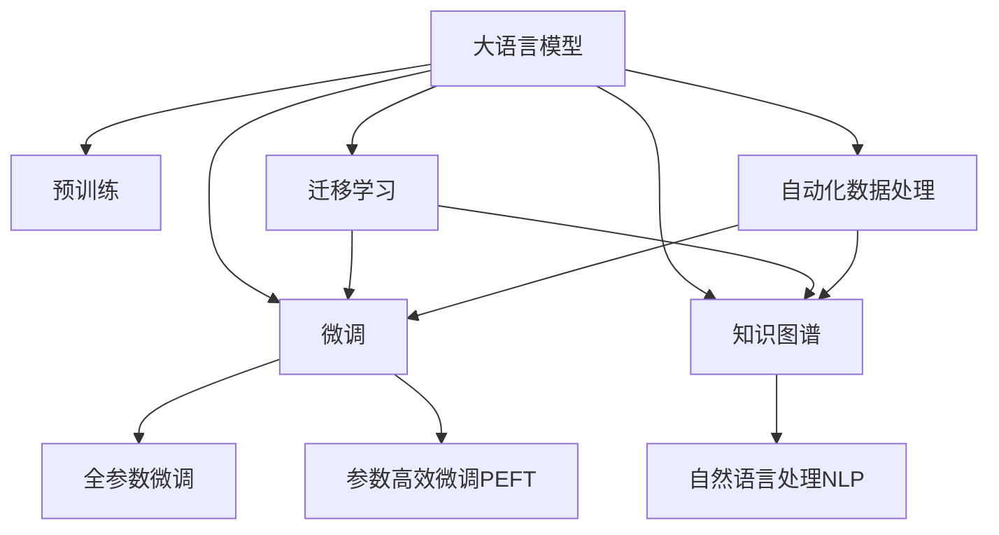

                 

# LLM对传统数据挖掘的革新

## 1. 背景介绍

### 1.1 问题由来
随着大数据时代的到来，数据挖掘技术在各个行业领域中的应用日益广泛。从商业数据分析到科学研究，从社交网络分析到医疗健康，数据挖掘作为数据驱动决策的重要工具，发挥着不可或缺的作用。然而，传统的数据挖掘技术在处理大规模、复杂、异构数据时，面临着数据量大、特征维度高、模型复杂等诸多挑战。

近年来，大语言模型(Large Language Models, LLM)作为预训练神经网络模型在自然语言处理(NLP)领域取得了巨大突破，成为机器学习和人工智能领域的热点研究话题。LLM通过在大规模无标签文本数据上进行预训练，学习到丰富的语言知识和常识，具备强大的语言理解和生成能力。随着技术的发展，LLM在数据挖掘领域的应用价值逐渐被挖掘，并成为革新传统数据挖掘技术的重要手段。

### 1.2 问题核心关键点
LLM在数据挖掘领域的应用主要集中在以下几个方面：

- **自动化数据处理**：LLM可以自动理解、解析和提取数据中的语义信息，从而实现数据清洗、去重、分类等功能。
- **数据关联分析**：通过语言模型，LLM能够将数据元素进行关联，发现数据之间的关系，支持模式发现和异常检测。
- **数据增强与生成**：LLM能够自动生成更多训练数据，提高数据样本的多样性，缓解数据匮乏问题。
- **知识驱动的挖掘**：LLM具备跨领域知识迁移能力，可以在特定领域预训练后，对数据挖掘任务进行微调，提升任务性能。
- **实时动态更新**：LLM可以持续学习和适应新数据，保持模型的时效性和泛化能力。

这些关键点凸显了LLM在数据挖掘领域的重要价值和潜在影响力。

## 2. 核心概念与联系

### 2.1 核心概念概述

为更好地理解LLM在数据挖掘领域的应用，本节将介绍几个密切相关的核心概念：

- **大语言模型(Large Language Model, LLM)**：以自回归(如GPT)或自编码(如BERT)模型为代表的大规模预训练语言模型。通过在大规模无标签文本语料上进行预训练，学习通用的语言表示，具备强大的语言理解和生成能力。

- **预训练(Pre-training)**：指在大规模无标签文本语料上，通过自监督学习任务训练通用语言模型的过程。常见的预训练任务包括言语建模、遮挡语言模型等。

- **微调(Fine-tuning)**：指在预训练模型的基础上，使用下游任务的少量标注数据，通过有监督地训练来优化模型在该任务上的性能。通常只需要调整顶层分类器或解码器，并以较小的学习率更新全部或部分的模型参数。

- **迁移学习(Transfer Learning)**：指将一个领域学习到的知识，迁移应用到另一个不同但相关的领域的学习范式。大模型的预训练-微调过程即是一种典型的迁移学习方式。

- **知识图谱(Knowledge Graph)**：用于存储和组织结构化知识的数据库，可以帮助模型更好地理解数据元素之间的关系，支持基于知识的数据挖掘。

- **自然语言处理(NLP)**：专注于使计算机能够理解、处理和生成自然语言的技术，涵盖文本预处理、词向量建模、情感分析、实体识别等多个方向。

这些核心概念之间的逻辑关系可以通过以下Mermaid流程图来展示：



这个流程图展示了大语言模型的核心概念及其之间的关系：

1. 大语言模型通过预训练获得基础能力。
2. 微调是对预训练模型进行任务特定的优化，可以分为全参数微调和参数高效微调（PEFT）。
3. 知识图谱和自然语言处理支持大语言模型的语言理解能力。
4. 迁移学习是连接预训练模型与下游任务的桥梁，可以通过微调或知识驱动的方法来实现。
5. 自动化数据处理利用大语言模型的语言能力，实现数据预处理。

## 3. 核心算法原理 & 具体操作步骤

### 3.1 算法原理概述

基于LLM的数据挖掘方法，本质上是一种有监督的细粒度迁移学习过程。其核心思想是：将LLM视作一个强大的"特征提取器"，通过在数据挖掘任务的标注数据上进行有监督地训练，使得模型能够理解数据中的语义信息，从而实现特定的数据挖掘功能。

形式化地，假设预训练语言模型为 $M_{\theta}$，其中 $\theta$ 为预训练得到的模型参数。给定数据挖掘任务 $T$ 的标注数据集 $D=\{(x_i, y_i)\}_{i=1}^N$，其中 $x_i$ 为数据样本，$y_i$ 为对应的标签或特征。微调的目标是找到新的模型参数 $\hat{\theta}$，使得模型在特定任务上的表现最佳。

在微调过程中，通常会将预训练模型当作初始化参数，通过小批量梯度下降等优化算法，不断更新模型参数 $\theta$，最小化经验风险 $\mathcal{L}(M_{\theta},D)$，使得模型输出逼近真实标签或特征。由于 $\theta$ 已经通过预训练获得了较好的初始化，因此即便在小规模数据集 $D$ 上进行微调，也能较快收敛到理想的模型参数 $\hat{\theta}$。

### 3.2 算法步骤详解

基于LLM的数据挖掘方法一般包括以下几个关键步骤：

**Step 1: 准备预训练模型和数据集**
- 选择合适的预训练语言模型 $M_{\theta}$ 作为初始化参数，如 BERT、GPT等。
- 准备数据挖掘任务 $T$ 的标注数据集 $D$，划分为训练集、验证集和测试集。一般要求标注数据与预训练数据的分布不要差异过大。

**Step 2: 添加任务适配层**
- 根据任务类型，在预训练模型顶层设计合适的输出层和损失函数。
- 对于分类任务，通常在顶层添加线性分类器或Softmax函数，并使用交叉熵损失。
- 对于生成任务，通常使用语言模型的解码器输出概率分布，并以负对数似然为损失函数。

**Step 3: 设置微调超参数**
- 选择合适的优化算法及其参数，如 AdamW、SGD 等，设置学习率、批大小、迭代轮数等。
- 设置正则化技术及强度，包括权重衰减、Dropout、Early Stopping等。
- 确定冻结预训练参数的策略，如仅微调顶层，或全部参数都参与微调。

**Step 4: 执行梯度训练**
- 将训练集数据分批次输入模型，前向传播计算损失函数。
- 反向传播计算参数梯度，根据设定的优化算法和学习率更新模型参数。
- 周期性在验证集上评估模型性能，根据性能指标决定是否触发 Early Stopping。
- 重复上述步骤直到满足预设的迭代轮数或 Early Stopping 条件。

**Step 5: 测试和部署**
- 在测试集上评估微调后模型 $M_{\hat{\theta}}$ 的性能，对比微调前后的精度提升。
- 使用微调后的模型对新数据进行挖掘，集成到实际的应用系统中。
- 持续收集新的数据，定期重新微调模型，以适应数据分布的变化。

以上是基于LLM的数据挖掘方法的一般流程。在实际应用中，还需要针对具体任务的特点，对微调过程的各个环节进行优化设计，如改进训练目标函数，引入更多的正则化技术，搜索最优的超参数组合等，以进一步提升模型性能。

### 3.3 算法优缺点

基于LLM的数据挖掘方法具有以下优点：
1. 简单高效。只需准备少量标注数据，即可对预训练模型进行快速适配，获得较大的性能提升。
2. 通用适用。适用于各种数据挖掘任务，包括分类、匹配、生成等，设计简单的任务适配层即可实现微调。
3. 参数高效。利用参数高效微调技术，在固定大部分预训练权重不变的情况下，仍可取得不错的微调效果。
4. 效果显著。在学术界和工业界的诸多任务上，基于微调的方法已经刷新了最先进的性能指标。

同时，该方法也存在一定的局限性：
1. 依赖标注数据。微调的效果很大程度上取决于标注数据的质量和数量，获取高质量标注数据的成本较高。
2. 迁移能力有限。当目标任务与预训练数据的分布差异较大时，微调的性能提升有限。
3. 负面效果传递。预训练模型的固有偏见、有害信息等，可能通过微调传递到下游任务，造成负面影响。
4. 可解释性不足。微调模型的决策过程通常缺乏可解释性，难以对其推理逻辑进行分析和调试。

尽管存在这些局限性，但就目前而言，基于LLM的微调方法仍是数据挖掘领域的主流范式。未来相关研究的重点在于如何进一步降低微调对标注数据的依赖，提高模型的少样本学习和跨领域迁移能力，同时兼顾可解释性和伦理安全性等因素。

## 4. 数学模型和公式 & 详细讲解 & 举例说明

### 4.1 数学模型构建

本节将使用数学语言对基于LLM的数据挖掘方法进行更加严格的刻画。

记预训练语言模型为 $M_{\theta}$，其中 $\theta$ 为预训练得到的模型参数。假设数据挖掘任务 $T$ 的训练集为 $D=\{(x_i,y_i)\}_{i=1}^N$，其中 $x_i$ 为数据样本，$y_i$ 为对应的标签或特征。

定义模型 $M_{\theta}$ 在数据样本 $(x,y)$ 上的损失函数为 $\ell(M_{\theta}(x),y)$，则在数据集 $D$ 上的经验风险为：

$$
\mathcal{L}(\theta) = \frac{1}{N} \sum_{i=1}^N \ell(M_{\theta}(x_i),y_i)
$$

微调的优化目标是最小化经验风险，即找到最优参数：

$$
\theta^* = \mathop{\arg\min}_{\theta} \mathcal{L}(\theta)
$$

在实践中，我们通常使用基于梯度的优化算法（如SGD、Adam等）来近似求解上述最优化问题。设 $\eta$ 为学习率，$\lambda$ 为正则化系数，则参数的更新公式为：

$$
\theta \leftarrow \theta - \eta \nabla_{\theta}\mathcal{L}(\theta) - \eta\lambda\theta
$$

其中 $\nabla_{\theta}\mathcal{L}(\theta)$ 为损失函数对参数 $\theta$ 的梯度，可通过反向传播算法高效计算。

### 4.2 公式推导过程

以下我们以二分类任务为例，推导交叉熵损失函数及其梯度的计算公式。

假设模型 $M_{\theta}$ 在输入 $x$ 上的输出为 $\hat{y}=M_{\theta}(x) \in [0,1]$，表示样本属于正类的概率。真实标签 $y \in \{0,1\}$。则二分类交叉熵损失函数定义为：

$$
\ell(M_{\theta}(x),y) = -[y\log \hat{y} + (1-y)\log (1-\hat{y})]
$$

将其代入经验风险公式，得：

$$
\mathcal{L}(\theta) = -\frac{1}{N}\sum_{i=1}^N [y_i\log M_{\theta}(x_i)+(1-y_i)\log(1-M_{\theta}(x_i))]
$$

根据链式法则，损失函数对参数 $\theta_k$ 的梯度为：

$$
\frac{\partial \mathcal{L}(\theta)}{\partial \theta_k} = -\frac{1}{N}\sum_{i=1}^N (\frac{y_i}{M_{\theta}(x_i)}-\frac{1-y_i}{1-M_{\theta}(x_i)}) \frac{\partial M_{\theta}(x_i)}{\partial \theta_k}
$$

其中 $\frac{\partial M_{\theta}(x_i)}{\partial \theta_k}$ 可进一步递归展开，利用自动微分技术完成计算。

在得到损失函数的梯度后，即可带入参数更新公式，完成模型的迭代优化。重复上述过程直至收敛，最终得到适应下游任务的最优模型参数 $\theta^*$。

## 5. 项目实践：代码实例和详细解释说明

### 5.1 开发环境搭建

在进行数据挖掘任务微调前，我们需要准备好开发环境。以下是使用Python进行PyTorch开发的环境配置流程：

1. 安装Anaconda：从官网下载并安装Anaconda，用于创建独立的Python环境。

2. 创建并激活虚拟环境：
```bash
conda create -n pytorch-env python=3.8 
conda activate pytorch-env
```

3. 安装PyTorch：根据CUDA版本，从官网获取对应的安装命令。例如：
```bash
conda install pytorch torchvision torchaudio cudatoolkit=11.1 -c pytorch -c conda-forge
```

4. 安装Transformers库：
```bash
pip install transformers
```

5. 安装各类工具包：
```bash
pip install numpy pandas scikit-learn matplotlib tqdm jupyter notebook ipython
```

完成上述步骤后，即可在`pytorch-env`环境中开始数据挖掘任务微调的实践。

### 5.2 源代码详细实现

下面我们以情感分析任务为例，给出使用Transformers库对BERT模型进行微调的PyTorch代码实现。

首先，定义情感分析任务的数据处理函数：

```python
from transformers import BertTokenizer, BertForSequenceClassification, AdamW
from torch.utils.data import Dataset, DataLoader
import torch

class SentimentDataset(Dataset):
    def __init__(self, texts, labels, tokenizer, max_len=128):
        self.texts = texts
        self.labels = labels
        self.tokenizer = tokenizer
        self.max_len = max_len
        
    def __len__(self):
        return len(self.texts)
    
    def __getitem__(self, item):
        text = self.texts[item]
        label = self.labels[item]
        
        encoding = self.tokenizer(text, return_tensors='pt', max_length=self.max_len, padding='max_length', truncation=True)
        input_ids = encoding['input_ids'][0]
        attention_mask = encoding['attention_mask'][0]
        
        # 对标签进行编码
        labels = torch.tensor(label, dtype=torch.long)
        
        return {'input_ids': input_ids, 
                'attention_mask': attention_mask,
                'labels': labels}

# 加载预训练模型
model = BertForSequenceClassification.from_pretrained('bert-base-cased', num_labels=2)

# 定义优化器
optimizer = AdamW(model.parameters(), lr=2e-5)

# 定义训练集和验证集
tokenizer = BertTokenizer.from_pretrained('bert-base-cased')
train_dataset = SentimentDataset(train_texts, train_labels, tokenizer)
dev_dataset = SentimentDataset(dev_texts, dev_labels, tokenizer)

# 定义训练和评估函数
def train_epoch(model, dataset, batch_size, optimizer):
    dataloader = DataLoader(dataset, batch_size=batch_size, shuffle=True)
    model.train()
    epoch_loss = 0
    for batch in dataloader:
        input_ids = batch['input_ids'].to(device)
        attention_mask = batch['attention_mask'].to(device)
        labels = batch['labels'].to(device)
        model.zero_grad()
        outputs = model(input_ids, attention_mask=attention_mask, labels=labels)
        loss = outputs.loss
        epoch_loss += loss.item()
        loss.backward()
        optimizer.step()
    return epoch_loss / len(dataloader)

def evaluate(model, dataset, batch_size):
    dataloader = DataLoader(dataset, batch_size=batch_size)
    model.eval()
    preds, labels = [], []
    with torch.no_grad():
        for batch in dataloader:
            input_ids = batch['input_ids'].to(device)
            attention_mask = batch['attention_mask'].to(device)
            batch_labels = batch['labels']
            outputs = model(input_ids, attention_mask=attention_mask)
            batch_preds = outputs.logits.argmax(dim=2).to('cpu').tolist()
            batch_labels = batch_labels.to('cpu').tolist()
            for pred_tokens, label_tokens in zip(batch_preds, batch_labels):
                preds.append(pred_tokens)
                labels.append(label_tokens)
                
    print(classification_report(labels, preds))
```

然后，定义训练和评估流程：

```python
epochs = 5
batch_size = 16

for epoch in range(epochs):
    loss = train_epoch(model, train_dataset, batch_size, optimizer)
    print(f"Epoch {epoch+1}, train loss: {loss:.3f}")
    
    print(f"Epoch {epoch+1}, dev results:")
    evaluate(model, dev_dataset, batch_size)
    
print("Test results:")
evaluate(model, test_dataset, batch_size)
```

以上就是使用PyTorch对BERT进行情感分析任务微调的完整代码实现。可以看到，得益于Transformers库的强大封装，我们可以用相对简洁的代码完成BERT模型的加载和微调。

### 5.3 代码解读与分析

让我们再详细解读一下关键代码的实现细节：

**SentimentDataset类**：
- `__init__`方法：初始化文本、标签、分词器等关键组件。
- `__len__`方法：返回数据集的样本数量。
- `__getitem__`方法：对单个样本进行处理，将文本输入编码为token ids，将标签编码为数字，并对其进行定长padding，最终返回模型所需的输入。

**训练和评估函数**：
- 使用PyTorch的DataLoader对数据集进行批次化加载，供模型训练和推理使用。
- 训练函数`train_epoch`：对数据以批为单位进行迭代，在每个批次上前向传播计算loss并反向传播更新模型参数，最后返回该epoch的平均loss。
- 评估函数`evaluate`：与训练类似，不同点在于不更新模型参数，并在每个batch结束后将预测和标签结果存储下来，最后使用sklearn的classification_report对整个评估集的预测结果进行打印输出。

**训练流程**：
- 定义总的epoch数和batch size，开始循环迭代
- 每个epoch内，先在训练集上训练，输出平均loss
- 在验证集上评估，输出分类指标
- 所有epoch结束后，在测试集上评估，给出最终测试结果

可以看到，PyTorch配合Transformers库使得BERT微调的代码实现变得简洁高效。开发者可以将更多精力放在数据处理、模型改进等高层逻辑上，而不必过多关注底层的实现细节。

当然，工业级的系统实现还需考虑更多因素，如模型的保存和部署、超参数的自动搜索、更灵活的任务适配层等。但核心的微调范式基本与此类似。

## 6. 实际应用场景

### 6.1 电子商务平台推荐系统

电子商务平台推荐系统是典型的数据挖掘应用场景。传统的推荐系统往往依赖于用户的历史行为数据进行物品推荐，无法充分挖掘用户真实兴趣。利用LLM的预训练-微调技术，推荐系统可以自动理解用户的文本描述、评论等，挖掘用户的兴趣和偏好，实现更加个性化和多样化的推荐。

具体而言，电商平台可以收集用户浏览、点击、评论等行为数据，提取和用户交互的物品标题、描述、标签等文本内容。将文本内容作为模型输入，用户的后续行为（如是否点击、购买等）作为监督信号，在此基础上微调预训练语言模型。微调后的模型能够从文本内容中准确把握用户的兴趣点。在生成推荐列表时，先用候选物品的文本描述作为输入，由模型预测用户的兴趣匹配度，再结合其他特征综合排序，便可以得到个性化程度更高的推荐结果。

### 6.2 医疗健康领域疾病预测

在医疗健康领域，数据挖掘技术应用广泛。通过分析患者的病历记录、检验报告、临床症状等文本数据，可以预测患者的疾病风险和健康状况。利用LLM的预训练-微调技术，可以构建更为精准的疾病预测模型。

具体而言，医院可以收集患者的电子病历、检验报告、临床症状等文本数据，构建包含疾病标签的标注数据集。在预训练模型的基础上，对标注数据集进行微调，训练模型学习疾病与症状之间的关联关系。微调后的模型能够自动理解病历文本，提取疾病风险因素，从而实现疾病预测和健康评估。

### 6.3 金融行业风险评估

金融行业需要实时监测市场风险，预测金融市场的走向。传统的数据挖掘技术往往依赖于大量人工特征工程，难以适应市场的快速变化。利用LLM的预训练-微调技术，金融行业可以构建更为灵活和高效的金融风险评估模型。

具体而言，金融机构可以收集金融市场的历史数据、新闻、报告等文本数据，构建包含金融指标、市场情绪等的标注数据集。在预训练模型的基础上，对标注数据集进行微调，训练模型学习金融市场与经济指标之间的关系。微调后的模型能够自动理解市场文本，提取市场情绪和金融指标，从而实现市场风险预测和投资建议。

### 6.4 未来应用展望

随着LLM技术的发展，其在数据挖掘领域的应用前景更加广阔。

在智慧城市治理中，LLM可以用于智能交通管理、公共安全监控等，通过分析城市数据，实现城市管理的智能化和自动化。

在智慧农业领域，LLM可以用于作物病虫害预测、产量评估等，通过分析农业数据，实现农业生产的智能化和精准化。

在智慧教育领域，LLM可以用于学习行为分析、教育资源推荐等，通过分析学生数据，实现个性化教育和资源推荐。

此外，在物联网、工业制造、能源管理等多个领域，LLM的预训练-微调技术也将得到广泛应用，为各行各业提供新的技术手段和解决方案。

## 7. 工具和资源推荐

### 7.1 学习资源推荐

为了帮助开发者系统掌握LLM在数据挖掘领域的应用，这里推荐一些优质的学习资源：

1. 《深度学习与大数据》系列博文：由AI领域知名专家撰写，深入浅出地介绍了深度学习和大数据技术在各个领域的应用，包括数据挖掘。

2. CS229《机器学习》课程：斯坦福大学开设的机器学习经典课程，涵盖各种数据挖掘算法和模型，理论实践兼备，适合进一步学习。

3. 《自然语言处理入门》书籍：全面介绍了自然语言处理的基本概念和核心技术，涵盖数据挖掘、文本分类、情感分析等多个方向。

4. Kaggle数据科学竞赛：平台上有大量的数据挖掘竞赛和项目，可以动手实践LLM在数据挖掘中的应用，积累实战经验。

5. Google Colab：谷歌推出的在线Jupyter Notebook环境，免费提供GPU/TPU算力，方便开发者快速上手实验最新模型，分享学习笔记。

通过对这些资源的学习实践，相信你一定能够快速掌握LLM在数据挖掘领域的应用，并用于解决实际的业务问题。

### 7.2 开发工具推荐

高效的开发离不开优秀的工具支持。以下是几款用于LLM数据挖掘任务开发的常用工具：

1. PyTorch：基于Python的开源深度学习框架，灵活动态的计算图，适合快速迭代研究。大部分预训练语言模型都有PyTorch版本的实现。

2. TensorFlow：由Google主导开发的开源深度学习框架，生产部署方便，适合大规模工程应用。同样有丰富的预训练语言模型资源。

3. Transformers库：HuggingFace开发的NLP工具库，集成了众多SOTA语言模型，支持PyTorch和TensorFlow，是进行数据挖掘任务开发的利器。

4. Weights & Biases：模型训练的实验跟踪工具，可以记录和可视化模型训练过程中的各项指标，方便对比和调优。与主流深度学习框架无缝集成。

5. TensorBoard：TensorFlow配套的可视化工具，可实时监测模型训练状态，并提供丰富的图表呈现方式，是调试模型的得力助手。

6. Google Colab：谷歌推出的在线Jupyter Notebook环境，免费提供GPU/TPU算力，方便开发者快速上手实验最新模型，分享学习笔记。

合理利用这些工具，可以显著提升LLM数据挖掘任务的开发效率，加快创新迭代的步伐。

### 7.3 相关论文推荐

LLM在数据挖掘领域的应用源于学界的持续研究。以下是几篇奠基性的相关论文，推荐阅读：

1. Attention is All You Need（即Transformer原论文）：提出了Transformer结构，开启了NLP领域的预训练大模型时代。

2. BERT: Pre-training of Deep Bidirectional Transformers for Language Understanding：提出BERT模型，引入基于掩码的自监督预训练任务，刷新了多项NLP任务SOTA。

3. Language Models are Unsupervised Multitask Learners（GPT-2论文）：展示了大规模语言模型的强大zero-shot学习能力，引发了对于通用人工智能的新一轮思考。

4. Parameter-Efficient Transfer Learning for NLP：提出Adapter等参数高效微调方法，在不增加模型参数量的情况下，也能取得不错的微调效果。

5. Sequence to Sequence Learning with Neural Networks：提出Seq2Seq模型，为序列生成任务（如文本摘要、机器翻译）提供了新的解决方案。

6. Transfer Learning via Cross-lingual Document Retrieval：提出跨语言文档检索方法，利用LLM的知识迁移能力，提升数据挖掘的性能和泛化能力。

这些论文代表了大语言模型在数据挖掘领域的应用基础和前沿研究方向。通过学习这些前沿成果，可以帮助研究者把握学科前进方向，激发更多的创新灵感。

## 8. 总结：未来发展趋势与挑战

### 8.1 总结

本文对基于LLM的数据挖掘方法进行了全面系统的介绍。首先阐述了LLM和微调技术的研究背景和意义，明确了LLM在数据挖掘领域的重要价值和潜在影响力。其次，从原理到实践，详细讲解了LLM在数据挖掘任务的微调方法，给出了微调任务开发的完整代码实例。同时，本文还广泛探讨了LLM在电子商务、医疗、金融等多个行业领域的应用前景，展示了LLM范式在数据挖掘领域的广阔应用空间。此外，本文精选了数据挖掘任务的各类学习资源，力求为开发者提供全方位的技术指引。

通过本文的系统梳理，可以看到，基于LLM的数据挖掘方法正在成为数据挖掘领域的重要范式，极大地拓展了数据挖掘任务的性能和应用范围，为各行各业带来了新的技术手段和解决方案。未来，伴随LLM技术的发展，数据挖掘领域将迎来新的变革，实现更为智能、高效、个性化的数据挖掘能力。

### 8.2 未来发展趋势

展望未来，LLM在数据挖掘领域的应用将呈现以下几个发展趋势：

1. 模型规模持续增大。随着算力成本的下降和数据规模的扩张，预训练语言模型的参数量还将持续增长。超大规模语言模型蕴含的丰富语言知识，有望支撑更加复杂多变的下游任务微调。

2. 微调方法日趋多样。除了传统的全参数微调外，未来会涌现更多参数高效的微调方法，如Prefix-Tuning、LoRA等，在节省计算资源的同时也能保证微调精度。

3. 持续学习成为常态。随着数据分布的不断变化，微调模型也需要持续学习新知识以保持性能。如何在不遗忘原有知识的同时，高效吸收新样本信息，将成为重要的研究课题。

4. 标注样本需求降低。受启发于提示学习(Prompt-based Learning)的思路，未来的微调方法将更好地利用LLM的语言理解能力，通过更加巧妙的任务描述，在更少的标注样本上也能实现理想的微调效果。

5. 模型通用性增强。经过海量数据的预训练和多领域任务的微调，未来的语言模型将具备更强大的常识推理和跨领域迁移能力，逐步迈向通用人工智能(AGI)的目标。

6. 多模态微调崛起。当前的微调主要聚焦于纯文本数据，未来会进一步拓展到图像、视频、语音等多模态数据微调。多模态信息的融合，将显著提升语言模型对现实世界的理解和建模能力。

以上趋势凸显了LLM在数据挖掘领域的重要价值和潜在影响力。这些方向的探索发展，必将进一步提升数据挖掘系统的性能和应用范围，为各行各业带来新的技术手段和解决方案。

### 8.3 面临的挑战

尽管LLM在数据挖掘领域已经取得了瞩目成就，但在迈向更加智能化、普适化应用的过程中，它仍面临着诸多挑战：

1. 标注成本瓶颈。虽然微调大大降低了标注数据的需求，但对于长尾应用场景，难以获得充足的高质量标注数据，成为制约微调性能的瓶颈。如何进一步降低微调对标注样本的依赖，将是一大难题。

2. 模型鲁棒性不足。当前微调模型面对域外数据时，泛化性能往往大打折扣。对于测试样本的微小扰动，微调模型的预测也容易发生波动。如何提高微调模型的鲁棒性，避免灾难性遗忘，还需要更多理论和实践的积累。

3. 推理效率有待提高。超大语言模型虽然精度高，但在实际部署时往往面临推理速度慢、内存占用大等效率问题。如何在保证性能的同时，简化模型结构，提升推理速度，优化资源占用，将是重要的优化方向。

4. 可解释性亟需加强。当前微调模型更像是"黑盒"系统，难以解释其内部工作机制和决策逻辑。对于医疗、金融等高风险应用，算法的可解释性和可审计性尤为重要。如何赋予微调模型更强的可解释性，将是亟待攻克的难题。

5. 安全性有待保障。预训练语言模型难免会学习到有偏见、有害的信息，通过微调传递到下游任务，产生误导性、歧视性的输出，给实际应用带来安全隐患。如何从数据和算法层面消除模型偏见，避免恶意用途，确保输出的安全性，也将是重要的研究课题。

6. 知识整合能力不足。现有的微调模型往往局限于任务内数据，难以灵活吸收和运用更广泛的先验知识。如何让微调过程更好地与外部知识库、规则库等专家知识结合，形成更加全面、准确的信息整合能力，还有很大的想象空间。

正视LLM在数据挖掘领域面临的这些挑战，积极应对并寻求突破，将是大规模语言模型微调走向成熟的必由之路。相信随着学界和产业界的共同努力，这些挑战终将一一被克服，LLM范式必将在构建智能数据挖掘系统中扮演越来越重要的角色。

### 8.4 研究展望

面对LLM在数据挖掘领域面临的挑战，未来的研究需要在以下几个方面寻求新的突破：

1. 探索无监督和半监督微调方法。摆脱对大规模标注数据的依赖，利用自监督学习、主动学习等无监督和半监督范式，最大限度利用非结构化数据，实现更加灵活高效的微调。

2. 研究参数高效和计算高效的微调范式。开发更加参数高效的微调方法，在固定大部分预训练参数的同时，只更新极少量的任务相关参数。同时优化微调模型的计算图，减少前向传播和反向传播的资源消耗，实现更加轻量级、实时性的部署。

3. 融合因果和对比学习范式。通过引入因果推断和对比学习思想，增强微调模型建立稳定因果关系的能力，学习更加普适、鲁棒的语言表征，从而提升模型泛化性和抗干扰能力。

4. 引入更多先验知识。将符号化的先验知识，如知识图谱、逻辑规则等，与神经网络模型进行巧妙融合，引导微调过程学习更准确、合理的语言模型。同时加强不同模态数据的整合，实现视觉、语音等多模态信息与文本信息的协同建模。

5. 结合因果分析和博弈论工具。将因果分析方法引入微调模型，识别出模型决策的关键特征，增强输出解释的因果性和逻辑性。借助博弈论工具刻画人机交互过程，主动探索并规避模型的脆弱点，提高系统稳定性。

6. 纳入伦理道德约束。在模型训练目标中引入伦理导向的评估指标，过滤和惩罚有偏见、有害的输出倾向。同时加强人工干预和审核，建立模型行为的监管机制，确保输出符合人类价值观和伦理道德。

这些研究方向的探索，必将引领LLM在数据挖掘领域迈向更高的台阶，为构建智能、可靠、可解释、可控的数据挖掘系统铺平道路。面向未来，LLM范式需要在与其他人工智能技术进行更深入的融合，如知识表示、因果推理、强化学习等，多路径协同发力，共同推动智能数据挖掘系统的进步。只有勇于创新、敢于突破，才能不断拓展语言模型的边界，让智能技术更好地造福人类社会。

## 9. 附录：常见问题与解答

**Q1：LLM在数据挖掘中是否适用于所有任务？**

A: 虽然LLM在数据挖掘领域的应用范围较广，但其并不是适用于所有任务。LLM在处理大规模文本数据和提取语义信息方面具有优势，但在某些特定领域如图像处理、声音识别等领域，可能需要结合其他深度学习模型才能达到更好的效果。此外，对于需要高度准确性和鲁棒性的任务，LLM的微调效果也可能存在一定的局限。

**Q2：如何选择适合的LLM模型？**

A: 选择合适的LLM模型需要考虑任务的具体需求和数据特征。对于文本处理任务，BERT、GPT等大模型通常表现较好。对于特定领域的任务，可以在特定领域预训练的模型如领域专用BERT、领域专用GPT上微调，以提升模型在该领域的表现。此外，考虑到模型的计算资源和推理效率，也可以根据实际应用场景选择参数量适中、推理速度快的模型。

**Q3：LLM的微调过程是否可以避免过拟合？**

A: 微调过程中过拟合是一个普遍存在的问题，特别是在数据量较小的情况下。为避免过拟合，可以采用以下策略：
1. 数据增强：通过回译、近义替换等方式扩充训练集
2. 正则化：使用L2正则、Dropout、Early Stopping等避免过拟合
3. 对抗训练：引入对抗样本，提高模型鲁棒性
4. 参数高效微调：只调整少量参数(如Adapter、Prefix等)，减小过拟合风险
5. 多模型集成：训练多个微调模型，取平均输出，抑制过拟合

这些策略往往需要根据具体任务和数据特点进行灵活组合。只有在数据、模型、训练、推理等各环节进行全面优化，才能最大限度地发挥LLM的潜力。

**Q4：LLM在微调过程中是否需要保存和迁移预训练模型？**

A: 在微调过程中，保存预训练模型可以避免重复训练，节省时间和计算资源。迁移预训练模型的知识可以提升微调模型的性能，特别是在标注数据匮乏的情况下。但需要注意的是，预训练模型的保存和迁移也需要考虑模型的大小和计算成本，避免不必要的资源消耗。

**Q5：LLM在微调过程中是否需要调整超参数？**

A: 微调过程中超参数的选择对模型性能影响较大，需要根据具体任务进行优化。一般建议从默认值开始调整，逐步减小学习率，直至收敛。同时，也可以采用学习率调度策略，如warmup、decay等，来进一步提升微调效果。此外，对于不同的优化器和模型结构，可能需要设置不同的超参数。

这些策略往往需要根据具体任务和数据特点进行灵活组合。只有在数据、模型、训练、推理等各环节进行全面优化，才能最大限度地发挥LLM的潜力。

---

作者：禅与计算机程序设计艺术 / Zen and the Art of Computer Programming

