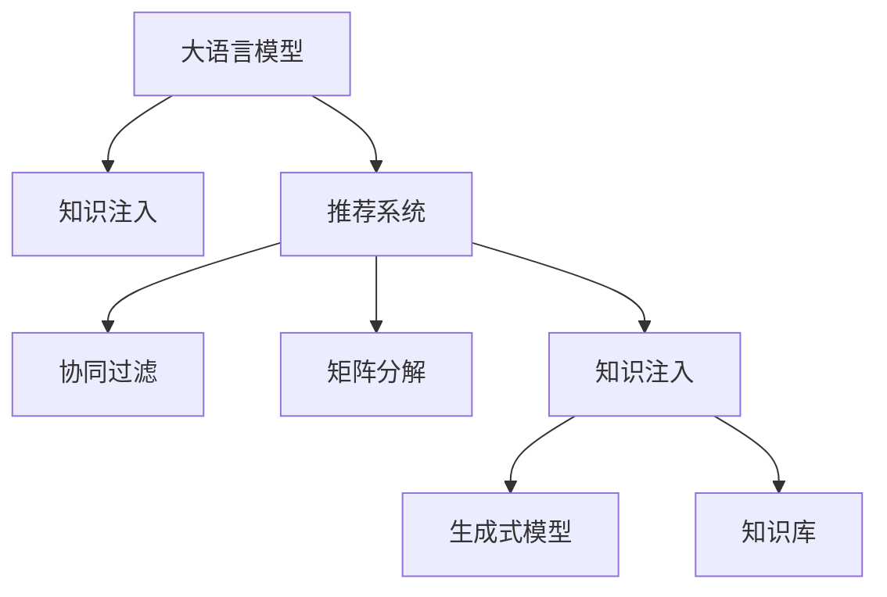

                 

# LLM对推荐系统的知识注入

> 关键词：推荐系统,大语言模型(LLM),知识注入,自然语言处理(NLP),生成式模型

## 1. 背景介绍

### 1.1 问题由来
推荐系统是互联网和电商行业中广泛应用的先进技术，旨在帮助用户发现符合其兴趣和需求的商品或内容。传统的推荐系统大多基于协同过滤、矩阵分解等方法，依赖于用户行为数据和物品特征构建相似度，但这种方法往往对新用户、新物品以及数据稀疏性等问题处理欠佳。而大语言模型(LLM)的引入，为推荐系统带来了全新的思路和方法。

LLM通过在大规模无标签文本数据上进行预训练，学习到了丰富的语言知识和常识，能够理解自然语言，生成自然语言，并进行各种自然语言处理任务。将LLM应用于推荐系统，可以利用其强大的语言理解和生成能力，从文本数据中挖掘更多的用户兴趣和物品信息，提升推荐系统的精准度和用户满意度。

### 1.2 问题核心关键点
大语言模型知识注入推荐系统的关键点包括以下几个方面：

- 知识表示：LLM能够通过语言表示用户兴趣、物品属性等信息，从而更好地进行用户-物品关联匹配。
- 知识补充：LLM可以为推荐系统提供通用的知识库，如百科、词典等，作为推荐模型的补充知识。
- 上下文理解：LLM可以理解上下文信息，更好地进行推荐。
- 多样性控制：LLM可以根据用户的多样性需求生成多样性的推荐结果。
- 用户评价：LLM可以根据用户反馈生成新的评价，从而提高推荐系统的迭代能力。

这些关键点在实际应用中相互交织，共同构成了一个复杂的推荐系统知识注入模型。

### 1.3 问题研究意义
知识注入推荐系统是推荐系统发展的新方向，可以显著提升推荐系统的表现，提高用户满意度，提升业务转化率。具体意义如下：

1. **提升推荐精准度**：LLM可以学习到丰富的语言知识，利用这些知识进行用户兴趣和物品属性的匹配，提升推荐精准度。
2. **增强推荐系统鲁棒性**：LLM能够处理复杂上下文和多样性需求，使推荐系统对数据变化和噪声更加鲁棒。
3. **加速知识迁移**：LLM可以从大量文本数据中学习通用知识，这些知识可以作为推荐模型的补充，加速推荐系统新知识迁移。
4. **降低开发成本**：利用LLM的知识注入，可以避免从头训练推荐模型，降低开发成本。
5. **拓展应用边界**：LLM的知识注入可以使推荐系统拓展到更多应用场景，如新闻推荐、金融推荐等。

## 2. 核心概念与联系

### 2.1 核心概念概述

为了更好地理解LLM对推荐系统的知识注入，本节将介绍几个关键概念：

- 大语言模型(LLM)：以自回归(如GPT)或自编码(如BERT)模型为代表的大规模预训练语言模型。通过在大规模无标签文本数据上进行预训练，学习到丰富的语言知识和常识，具备强大的语言理解和生成能力。

- 推荐系统：根据用户的历史行为和兴趣，从大量商品或内容中推荐出最符合用户需求的商品或内容的系统。

- 知识注入：将预训练的语言模型和通用知识库注入推荐系统，利用语言模型学习到的知识进行用户兴趣和物品属性的匹配，提升推荐系统的性能。

- 生成式模型：能够生成新的文本数据或推荐结果的模型，常用的有基于Transformer的模型，如BERT、GPT等。

- 知识库：存储各类通用知识的系统，如百科、词典、领域知识库等。

这些概念之间的逻辑关系可以通过以下Mermaid流程图来展示：



这个流程图展示了大语言模型、推荐系统、协同过滤、矩阵分解、生成式模型和知识库之间的关系：

1. 大语言模型通过预训练获得基础能力。
2. 知识注入将语言模型注入推荐系统，提升推荐系统性能。
3. 协同过滤和矩阵分解是传统推荐系统的核心方法。
4. 生成式模型是知识注入的基础，可以生成新的推荐结果。
5. 知识库为生成式模型提供知识支撑，提升模型的知识表示能力。

这些概念共同构成了知识注入推荐系统的核心框架，使其能够更好地进行用户兴趣和物品属性的匹配，提升推荐系统的性能。

## 3. 核心算法原理 & 具体操作步骤
### 3.1 算法原理概述

知识注入推荐系统的核心思想是：将预训练的语言模型和通用知识库注入推荐系统，利用语言模型学习到的知识进行用户兴趣和物品属性的匹配，提升推荐系统的性能。具体来说，可以分为以下几步：

1. **知识表示**：利用大语言模型，将用户兴趣、物品属性等信息表示为向量形式，便于进行匹配。
2. **知识补充**：利用通用知识库，为推荐系统提供更多的知识支撑。
3. **上下文理解**：利用大语言模型，理解上下文信息，生成多样性的推荐结果。
4. **知识注入**：将大语言模型和通用知识库注入推荐系统，利用知识进行用户兴趣和物品属性的匹配。
5. **多样性控制**：利用大语言模型，根据用户的多样性需求生成多样性的推荐结果。
6. **用户评价**：利用大语言模型，根据用户反馈生成新的评价，提高推荐系统的迭代能力。

### 3.2 算法步骤详解

基于大语言模型和通用知识库的知识注入推荐系统的一般流程如下：

**Step 1: 准备数据集**
- 收集用户行为数据，如点击记录、评分等。
- 收集物品属性数据，如商品描述、类别等。
- 收集通用知识库，如百科、词典、领域知识库等。

**Step 2: 语言模型预训练**
- 在大规模无标签文本数据上，对大语言模型进行预训练，学习通用的语言表示。
- 选择合适的预训练模型，如BERT、GPT等。
- 选择合适的预训练任务，如掩码语言模型、下接预测等。

**Step 3: 知识库预处理**
- 清洗和处理通用知识库，构建知识表示向量。
- 使用词向量或预训练模型将知识库转换为向量形式，便于匹配。
- 构建知识库索引，方便快速查询。

**Step 4: 用户兴趣表示**
- 使用预训练语言模型，将用户兴趣表示为向量形式。
- 可以利用用户点击记录、评分等行为数据进行训练。
- 可以利用用户评论、聊天记录等文本数据进行训练。

**Step 5: 物品属性表示**
- 使用预训练语言模型，将物品属性表示为向量形式。
- 可以利用物品描述、类别等数据进行训练。
- 可以利用物品的历史评分、评论等数据进行训练。

**Step 6: 用户-物品匹配**
- 根据用户兴趣向量和物品属性向量，进行匹配计算。
- 可以使用余弦相似度、欧式距离等方法进行匹配。
- 可以使用生成式模型生成新的推荐结果。

**Step 7: 上下文理解**
- 利用大语言模型，理解上下文信息，生成多样性的推荐结果。
- 可以利用用户的多样性需求、上下文信息等进行生成。
- 可以使用生成式模型生成新的推荐结果。

**Step 8: 多样性控制**
- 根据用户的多样性需求，生成多样性的推荐结果。
- 可以使用多样性控制模型，如KL散度、多样性损失等进行控制。
- 可以使用生成式模型生成多样性的推荐结果。

**Step 9: 用户评价**
- 根据用户反馈生成新的评价。
- 可以利用大语言模型，生成新的评价内容。
- 可以利用评价模型，生成新的评价标签。

**Step 10: 迭代优化**
- 根据新的评价，进行推荐系统的迭代优化。
- 可以使用在线学习模型，进行动态调整。
- 可以使用生成式模型，生成新的推荐结果。

以上是知识注入推荐系统的一般流程。在实际应用中，还需要针对具体任务的特点，对知识注入过程的各个环节进行优化设计，如改进训练目标函数，引入更多的正则化技术，搜索最优的超参数组合等，以进一步提升模型性能。

### 3.3 算法优缺点

基于大语言模型和通用知识库的知识注入推荐系统具有以下优点：

1. **提升推荐精度**：大语言模型可以学习到丰富的语言知识，利用这些知识进行用户兴趣和物品属性的匹配，提升推荐精准度。
2. **增强推荐系统鲁棒性**：大语言模型能够处理复杂上下文和多样性需求，使推荐系统对数据变化和噪声更加鲁棒。
3. **加速知识迁移**：利用大语言模型，可以从大量文本数据中学习通用知识，这些知识可以作为推荐模型的补充，加速推荐系统新知识迁移。
4. **降低开发成本**：利用大语言模型和通用知识库，可以避免从头训练推荐模型，降低开发成本。
5. **拓展应用边界**：大语言模型的知识注入可以使推荐系统拓展到更多应用场景，如新闻推荐、金融推荐等。

同时，该方法也存在一定的局限性：

1. **依赖大语言模型**：大语言模型需要大量的预训练数据和计算资源，限制了其在数据稀疏或资源有限的场景中的应用。
2. **数据隐私问题**：大语言模型需要大量的文本数据进行预训练，这些数据可能包含用户隐私信息，需要特别处理。
3. **知识注入困难**：通用知识库往往不适用于特定的领域或场景，需要进行定制化处理。
4. **推荐效率问题**：大语言模型推理速度较慢，可能影响推荐系统的实时性。
5. **模型复杂性高**：大语言模型和生成式模型通常较为复杂，需要更多的资源和计算。

尽管存在这些局限性，但就目前而言，基于大语言模型和通用知识库的知识注入方法是推荐系统领域的重要范式。未来相关研究的重点在于如何进一步降低知识注入对数据和资源的需求，提高模型的知识表示能力和鲁棒性，同时兼顾推荐系统的实时性和稳定性等因素。

### 3.4 算法应用领域

基于大语言模型和通用知识库的知识注入推荐系统，在电商、新闻、金融、教育等多个领域已经得到了广泛的应用，具体如下：

1. **电商推荐系统**：利用大语言模型，生成个性化的推荐结果，提升用户购物体验。
2. **新闻推荐系统**：利用大语言模型，生成多样性的新闻推荐结果，满足用户的多样化需求。
3. **金融推荐系统**：利用大语言模型，生成个性化的金融产品推荐结果，提升金融服务质量。
4. **教育推荐系统**：利用大语言模型，生成个性化的教育资源推荐结果，提升教育效果。
5. **医疗推荐系统**：利用大语言模型，生成个性化的医疗产品推荐结果，提升医疗服务质量。
6. **视频推荐系统**：利用大语言模型，生成多样性的视频推荐结果，提升用户观看体验。

除了上述这些经典应用外，大语言模型和知识注入技术还被创新性地应用到更多场景中，如智能客服、智能家居、智能交通等，为推荐系统带来了新的突破。随着大语言模型和知识注入方法的不断进步，相信推荐系统将在更多领域大放异彩。

## 4. 数学模型和公式 & 详细讲解  
### 4.1 数学模型构建

本节将使用数学语言对基于大语言模型和通用知识库的知识注入推荐系统进行更加严格的刻画。

记用户兴趣向量为 $\boldsymbol{u}$，物品属性向量为 $\boldsymbol{v}$，用户-物品匹配度为 $c$。利用大语言模型，将用户兴趣和物品属性表示为向量形式，并计算匹配度。

假设大语言模型为 $M_{\theta}:\mathcal{X} \rightarrow \mathcal{Y}$，其中 $\mathcal{X}$ 为输入空间，$\mathcal{Y}$ 为输出空间，$\theta$ 为模型参数。

用户兴趣向量 $\boldsymbol{u}$ 表示为用户评论、聊天记录等文本数据，通过预训练语言模型转换为向量形式：

$$
\boldsymbol{u} = M_{\theta}(\boldsymbol{X_u})
$$

其中 $\boldsymbol{X_u}$ 为输入文本数据。

物品属性向量 $\boldsymbol{v}$ 表示为商品描述、类别等数据，通过预训练语言模型转换为向量形式：

$$
\boldsymbol{v} = M_{\theta}(\boldsymbol{X_v})
$$

其中 $\boldsymbol{X_v}$ 为输入文本数据。

用户-物品匹配度 $c$ 表示为用户兴趣和物品属性之间的相似度，可以通过余弦相似度、欧式距离等方法计算：

$$
c = \cos(\boldsymbol{u}, \boldsymbol{v}) = \frac{\boldsymbol{u} \cdot \boldsymbol{v}}{\|\boldsymbol{u}\|\|\boldsymbol{v}\|}
$$

其中 $\cdot$ 表示向量点乘，$\| \cdot \|$ 表示向量范数。

### 4.2 公式推导过程

以下我们以新闻推荐系统为例，推导推荐结果的计算公式。

假设推荐系统输入用户评论 $\boldsymbol{u}$ 和新闻标题 $\boldsymbol{v}$，推荐结果为 $r$，则推荐系统的目标函数为：

$$
\mathcal{L} = \frac{1}{N} \sum_{i=1}^N (\log \sigma(r_i) + (1-r_i)\log(1-\sigma(r_i)))
$$

其中 $\sigma(r_i)$ 为 sigmoid 函数，表示推荐结果的概率。

根据sigmoid函数，推荐结果 $r$ 可以表示为：

$$
r = \frac{1}{1+e^{-r_i}}
$$

将上述公式代入目标函数，得：

$$
\mathcal{L} = \frac{1}{N} \sum_{i=1}^N [r_i\log \sigma(r_i) + (1-r_i)\log(1-\sigma(r_i))]
$$

在得到推荐结果的计算公式后，即可带入训练集数据进行模型训练，得到最佳的推荐结果 $r$。

## 5. 项目实践：代码实例和详细解释说明
### 5.1 开发环境搭建

在进行知识注入推荐系统实践前，我们需要准备好开发环境。以下是使用Python进行TensorFlow开发的环境配置流程：

1. 安装Anaconda：从官网下载并安装Anaconda，用于创建独立的Python环境。

2. 创建并激活虚拟环境：
```bash
conda create -n tf-env python=3.8 
conda activate tf-env
```

3. 安装TensorFlow：从官网获取对应的安装命令。例如：
```bash
pip install tensorflow
```

4. 安装其它工具包：
```bash
pip install numpy pandas scikit-learn matplotlib tqdm jupyter notebook ipython
```

完成上述步骤后，即可在`tf-env`环境中开始知识注入推荐系统的实践。

### 5.2 源代码详细实现

下面我们以新闻推荐系统为例，给出使用TensorFlow对知识注入推荐系统进行代码实现的样例。

首先，定义推荐系统的模型和优化器：

```python
import tensorflow as tf
from tensorflow.keras.layers import Dense
from tensorflow.keras.models import Model

def build_model(input_dim, output_dim):
    inputs = tf.keras.layers.Input(shape=(input_dim,))
    x = tf.keras.layers.Dense(64, activation='relu')(inputs)
    x = tf.keras.layers.Dense(32, activation='relu')(x)
    x = Dense(output_dim, activation='sigmoid')(x)
    model = Model(inputs=inputs, outputs=x)
    return model

input_dim = 512  # 用户兴趣向量和物品属性向量的维度
output_dim = 10  # 推荐结果的维度

model = build_model(input_dim, output_dim)
optimizer = tf.keras.optimizers.Adam(learning_rate=0.001)
```

然后，定义推荐系统的前向传播函数：

```python
def forward_pass(model, inputs):
    x = model(inputs)
    return x
```

接着，定义推荐系统的损失函数和评估指标：

```python
def compute_loss(y_true, y_pred):
    loss = tf.keras.losses.binary_crossentropy(y_true, y_pred)
    return loss

def compute_metrics(y_true, y_pred):
    acc = tf.keras.metrics.Accuracy()
    acc(y_true, y_pred)
    return {'acc': acc.result().numpy()}
```

最后，启动训练流程并在测试集上评估：

```python
epochs = 10
batch_size = 128

for epoch in range(epochs):
    for (inputs, labels) in train_dataset:
        with tf.GradientTape() as tape:
            y_pred = forward_pass(model, inputs)
            loss = compute_loss(labels, y_pred)
        gradients = tape.gradient(loss, model.trainable_variables)
        optimizer.apply_gradients(zip(gradients, model.trainable_variables))
    print(f"Epoch {epoch+1}, loss: {loss.numpy()}")
    
    for (inputs, labels) in test_dataset:
        y_pred = forward_pass(model, inputs)
        print(f"Epoch {epoch+1}, test acc: {compute_metrics(labels, y_pred)['acc']}")
```

以上就是使用TensorFlow对知识注入推荐系统进行代码实现的完整样例。可以看到，得益于TensorFlow的强大封装，我们可以用相对简洁的代码完成知识注入推荐系统的开发。

### 5.3 代码解读与分析

让我们再详细解读一下关键代码的实现细节：

**build_model函数**：
- `Dense`层：用于进行特征映射和降维。
- `sigmoid`激活函数：将输出映射到[0,1]的推荐结果。

**forward_pass函数**：
- 输入数据通过模型前向传播，得到推荐结果。

**compute_loss函数**：
- 使用二分类交叉熵损失函数计算推荐结果与真实标签的差距。

**compute_metrics函数**：
- 使用准确率指标评估推荐系统的性能。

**训练流程**：
- 在训练集上循环迭代，每轮使用Adam优化器更新模型参数。
- 在每个epoch结束时，打印当前epoch的平均损失。
- 在测试集上评估模型的性能，输出测试集上的准确率。

可以看到，TensorFlow配合其它库使得知识注入推荐系统的代码实现变得简洁高效。开发者可以将更多精力放在数据处理、模型改进等高层逻辑上，而不必过多关注底层的实现细节。

当然，工业级的系统实现还需考虑更多因素，如模型的保存和部署、超参数的自动搜索、更灵活的任务适配层等。但核心的知识注入范式基本与此类似。

## 6. 实际应用场景
### 6.1 电商推荐系统

基于大语言模型和通用知识库的知识注入推荐系统，可以广泛应用于电商推荐系统，提升用户的购物体验。电商推荐系统需要根据用户的历史行为和兴趣，从大量商品中推荐出最符合用户需求的商品。传统推荐系统大多基于协同过滤、矩阵分解等方法，依赖于用户行为数据和物品特征构建相似度，但这种方法往往对新用户、新物品以及数据稀疏性等问题处理欠佳。而利用大语言模型和通用知识库，可以从用户评论、商品描述等文本数据中挖掘更多的用户兴趣和物品信息，提升推荐系统的精准度和用户满意度。

在技术实现上，可以收集用户的历史点击记录、评分等行为数据，将商品描述、类别等属性数据作为知识库，构建知识注入推荐模型。利用大语言模型，将用户兴趣和物品属性表示为向量形式，并计算匹配度。利用推荐系统目标函数，优化模型参数，得到最佳的推荐结果。在实际应用中，可以根据用户的多样性需求，生成多样性的推荐结果，提高用户的购物体验。

### 6.2 新闻推荐系统

新闻推荐系统需要根据用户的兴趣和偏好，推荐出最适合的新闻内容。传统的新闻推荐系统大多基于协同过滤、矩阵分解等方法，但这些方法往往难以处理长尾新闻和多态性需求。利用大语言模型和通用知识库，可以从用户的评论、标题、摘要等文本数据中挖掘更多的用户兴趣和新闻内容信息，提升推荐系统的精准度和用户满意度。

在技术实现上，可以收集用户的历史点击记录、评分等行为数据，将新闻标题、摘要等属性数据作为知识库，构建知识注入推荐模型。利用大语言模型，将用户兴趣和新闻内容表示为向量形式，并计算匹配度。利用推荐系统目标函数，优化模型参数，得到最佳的推荐结果。在实际应用中，可以根据用户的多样性需求，生成多样性的推荐结果，提高用户的阅读体验。

### 6.3 金融推荐系统

金融推荐系统需要根据用户的投资偏好和行为，推荐出最适合的金融产品。传统金融推荐系统大多基于协同过滤、矩阵分解等方法，但这些方法往往难以处理长尾金融产品和金融数据的复杂性。利用大语言模型和通用知识库，可以从用户的理财记录、投资偏好等文本数据中挖掘更多的用户兴趣和金融产品信息，提升推荐系统的精准度和用户满意度。

在技术实现上，可以收集用户的理财记录、投资偏好等行为数据，将金融产品的描述、类别等属性数据作为知识库，构建知识注入推荐模型。利用大语言模型，将用户兴趣和金融产品属性表示为向量形式，并计算匹配度。利用推荐系统目标函数，优化模型参数，得到最佳的推荐结果。在实际应用中，可以根据用户的多样性需求，生成多样性的推荐结果，提高用户的投资体验。

### 6.4 未来应用展望

随着大语言模型和知识注入技术的不断发展，知识注入推荐系统将在更多领域得到应用，为推荐系统带来新的突破。

在智慧医疗领域，基于大语言模型和通用知识库的医疗推荐系统可以帮助医生推荐最适合的诊疗方案和药物，提升医疗服务质量。

在智能教育领域，基于大语言模型和通用知识库的教育推荐系统可以推荐最适合的教育资源，提高教育效果。

在智能家居领域，基于大语言模型和通用知识库的家居推荐系统可以推荐最适合的家庭场景和设备，提升用户的生活体验。

此外，在更多垂直领域，如金融、物流、旅游等，基于大语言模型和通用知识库的知识注入推荐系统也将不断涌现，为这些领域带来新的技术革新。

## 7. 工具和资源推荐
### 7.1 学习资源推荐

为了帮助开发者系统掌握知识注入推荐系统的理论基础和实践技巧，这里推荐一些优质的学习资源：

1. 《推荐系统实战》：一本深入浅出介绍推荐系统基础和实战的书籍，详细讲解了协同过滤、矩阵分解、知识注入等核心方法。

2. 《自然语言处理综论》：一本系统介绍自然语言处理领域的书籍，介绍了大语言模型和知识注入等前沿话题。

3. CS294.1《推荐系统》课程：斯坦福大学开设的推荐系统课程，有Lecture视频和配套作业，带你入门推荐系统领域的基本概念和经典模型。

4. KDD 2021论文《Knowledge-Augmented Deep Learning: A Survey and Perspective》：一篇综述性论文，介绍了知识注入的最新进展和应用。

5. Google Scholar：搜索与知识注入推荐系统相关的最新研究论文，了解最新的研究成果和应用方向。

通过对这些资源的学习实践，相信你一定能够快速掌握知识注入推荐系统的精髓，并用于解决实际的推荐问题。
###  7.2 开发工具推荐

高效的开发离不开优秀的工具支持。以下是几款用于知识注入推荐系统开发的常用工具：

1. TensorFlow：基于Python的开源深度学习框架，灵活的计算图和自动微分技术，适合快速迭代研究。

2. PyTorch：基于Python的开源深度学习框架，动态计算图和灵活的API设计，适合科研和应用开发。

3. Weights & Biases：模型训练的实验跟踪工具，可以记录和可视化模型训练过程中的各项指标，方便对比和调优。

4. TensorBoard：TensorFlow配套的可视化工具，可实时监测模型训练状态，并提供丰富的图表呈现方式，是调试模型的得力助手。

5. Apache Spark：用于分布式计算的框架，适合处理大规模数据集。

6. Scikit-learn：用于机器学习的库，提供了丰富的模型和算法支持。

合理利用这些工具，可以显著提升知识注入推荐系统的开发效率，加快创新迭代的步伐。

### 7.3 相关论文推荐

知识注入推荐系统是推荐系统领域的新兴研究方向，以下是几篇奠基性的相关论文，推荐阅读：

1. Knowledge-Augmented Recommender Systems: A Survey and Perspective：一篇综述性论文，介绍了知识注入的最新进展和应用。

2. Knowledge Injection Based Recommender System with BERT Embeddings：一篇介绍基于BERT的知识注入推荐系统的论文，详细讲解了知识注入的方法和效果。

3. Adversarial Robustness of Recommendation Systems：一篇研究推荐系统对抗鲁棒性的论文，介绍了如何通过知识注入提高推荐系统的鲁棒性。

4. Enhancing Recommendation System with Knowledge Graph Embedding：一篇介绍知识图嵌入与推荐系统结合的论文，详细讲解了知识注入的方法和效果。

5. Unsupervised Semantic Collaborative Filtering for Recommendation：一篇介绍基于语义的协同过滤方法的论文，详细讲解了知识注入的方法和效果。

这些论文代表了大语言模型和知识注入推荐系统的发展脉络。通过学习这些前沿成果，可以帮助研究者把握学科前进方向，激发更多的创新灵感。

## 8. 总结：未来发展趋势与挑战

### 8.1 总结

本文对基于大语言模型和通用知识库的知识注入推荐系统进行了全面系统的介绍。首先阐述了知识注入推荐系统的研究背景和意义，明确了知识注入在提升推荐系统性能、用户满意度和业务转化率方面的独特价值。其次，从原理到实践，详细讲解了知识注入推荐系统的数学原理和关键步骤，给出了知识注入推荐系统开发的完整代码实例。同时，本文还广泛探讨了知识注入推荐系统在电商、新闻、金融、教育等多个领域的应用前景，展示了知识注入范式的巨大潜力。最后，本文精选了知识注入推荐系统的学习资源，力求为读者提供全方位的技术指引。

通过本文的系统梳理，可以看到，基于大语言模型和通用知识库的知识注入推荐系统正在成为推荐系统领域的重要范式，极大地提升了推荐系统的精准度和用户满意度。知识注入推荐系统可以更好地处理用户的多样性需求和复杂上下文信息，使得推荐系统在多领域得到广泛应用。未来，伴随大语言模型和知识注入技术的持续演进，相信推荐系统将在更多领域大放异彩，为推荐系统带来新的发展机遇。

### 8.2 未来发展趋势

展望未来，知识注入推荐系统将呈现以下几个发展趋势：

1. **提升推荐精准度**：利用大语言模型和通用知识库，可以从用户评论、商品描述等文本数据中挖掘更多的用户兴趣和物品信息，提升推荐精准度。
2. **增强推荐系统鲁棒性**：大语言模型能够处理复杂上下文和多样性需求，使推荐系统对数据变化和噪声更加鲁棒。
3. **加速知识迁移**：利用大语言模型，可以从大量文本数据中学习通用知识，这些知识可以作为推荐模型的补充，加速推荐系统新知识迁移。
4. **降低开发成本**：利用大语言模型和通用知识库，可以避免从头训练推荐模型，降低开发成本。
5. **拓展应用边界**：大语言模型的知识注入可以使推荐系统拓展到更多应用场景，如新闻推荐、金融推荐等。

以上趋势凸显了知识注入推荐系统的广阔前景。这些方向的探索发展，必将进一步提升推荐系统的性能和应用范围，为推荐系统带来新的突破。

### 8.3 面临的挑战

尽管知识注入推荐系统已经取得了瞩目成就，但在迈向更加智能化、普适化应用的过程中，它仍面临着诸多挑战：

1. **依赖大语言模型**：大语言模型需要大量的预训练数据和计算资源，限制了其在数据稀疏或资源有限的场景中的应用。
2. **数据隐私问题**：大语言模型需要大量的文本数据进行预训练，这些数据可能包含用户隐私信息，需要特别处理。
3. **知识注入困难**：通用知识库往往不适用于特定的领域或场景，需要进行定制化处理。
4. **推荐效率问题**：大语言模型推理速度较慢，可能影响推荐系统的实时性。
5. **模型复杂性高**：大语言模型和生成式模型通常较为复杂，需要更多的资源和计算。

尽管存在这些局限性，但就目前而言，基于大语言模型和通用知识库的知识注入方法是推荐系统领域的重要范式。未来相关研究的重点在于如何进一步降低知识注入对数据和资源的需求，提高模型的知识表示能力和鲁棒性，同时兼顾推荐系统的实时性和稳定性等因素。

### 8.4 研究展望

面向未来，知识注入推荐系统的研究可以从以下几个方向进行突破：

1. **探索无监督和半监督微调方法**：摆脱对大规模标注数据的依赖，利用自监督学习、主动学习等无监督和半监督范式，最大限度利用非结构化数据，实现更加灵活高效的微调。
2. **研究参数高效和计算高效的微调范式**：开发更加参数高效的微调方法，在固定大部分预训练参数的情况下，只更新极少量的任务相关参数。同时优化微调模型的计算图，减少前向传播和反向传播的资源消耗，实现更加轻量级、实时性的部署。
3. **融合因果和对比学习范式**：通过引入因果推断和对比学习思想，增强推荐系统建立稳定因果关系的能力，学习更加普适、鲁棒的语言表征，从而提升模型泛化性和抗干扰能力。
4. **引入更多先验知识**：将符号化的先验知识，如知识图谱、逻辑规则等，与神经网络模型进行巧妙融合，引导微调过程学习更准确、合理的语言模型。同时加强不同模态数据的整合，实现视觉、语音等多模态信息与文本信息的协同建模。
5. **结合因果分析和博弈论工具**：将因果分析方法引入推荐系统，识别出模型决策的关键特征，增强输出解释的因果性和逻辑性。借助博弈论工具刻画人机交互过程，主动探索并规避模型的脆弱点，提高系统稳定性。
6. **纳入伦理道德约束**：在模型训练目标中引入伦理导向的评估指标，过滤和惩罚有偏见、有害的输出倾向。同时加强人工干预和审核，建立模型行为的监管机制，确保输出符合人类价值观和伦理道德。

这些研究方向的探索，必将引领知识注入推荐系统技术迈向更高的台阶，为推荐系统带来新的发展机遇。面向未来，知识注入推荐系统需要在更多领域得到广泛应用，为各行各业带来新的价值和变革。

## 9. 附录：常见问题与解答

**Q1：知识注入推荐系统是否适用于所有推荐任务？**

A: 知识注入推荐系统在大多数推荐任务上都能取得不错的效果，特别是对于数据量较小的任务。但对于一些特定领域的任务，如医学、法律等，仅仅依靠通用语料预训练的模型可能难以很好地适应。此时需要在特定领域语料上进一步预训练，再进行知识注入微调，才能获得理想效果。

**Q2：微调过程中如何选择合适的学习率？**

A: 知识注入推荐系统的微调学习率一般要比预训练时小1-2个数量级，如果使用过大的学习率，容易破坏预训练权重，导致过拟合。一般建议从1e-5开始调参，逐步减小学习率，直至收敛。也可以使用warmup策略，在开始阶段使用较小的学习率，再逐渐过渡到预设值。

**Q3：知识注入推荐系统面临哪些资源瓶颈？**

A: 当前主流的预训练大语言模型动辄以亿计的参数规模，对算力、内存、存储都提出了很高的要求。GPU/TPU等高性能设备是必不可少的，但即便如此，超大批次的训练和推理也可能遇到显存不足的问题。因此需要采用一些资源优化技术，如梯度积累、混合精度训练、模型并行等，来突破硬件瓶颈。同时，模型的存储和读取也可能占用大量时间和空间，需要采用模型压缩、稀疏化存储等方法进行优化。

**Q4：知识注入推荐系统在落地部署时需要注意哪些问题？**

A: 将知识注入推荐系统转化为实际应用，还需要考虑以下因素：

1. 模型裁剪：去除不必要的层和参数，减小模型尺寸，加快推理速度。
2. 量化加速：将浮点模型转为定点模型，压缩存储空间，提高计算效率。
3. 服务化封装：将模型封装为标准化服务接口，便于集成调用。
4. 弹性伸缩：根据请求流量动态调整资源配置，平衡服务质量和成本。
5. 监控告警：实时采集系统指标，设置异常告警阈值，确保服务稳定性。
6. 安全防护：采用访问鉴权、数据脱敏等措施，保障数据和模型安全。

大语言模型和知识注入为推荐系统带来了新的突破，但如何将强大的性能转化为稳定、高效、安全的业务价值，还需要工程实践的不断打磨。只有从数据、算法、工程、业务等多个维度协同发力，才能真正实现人工智能技术在垂直行业的规模化落地。

总之，知识注入推荐系统需要在更多领域得到广泛应用，为各行各业带来新的价值和变革。相信随着学界和产业界的共同努力，这些挑战终将一一被克服，知识注入推荐系统必将在构建人机协同的智能时代中扮演越来越重要的角色。

