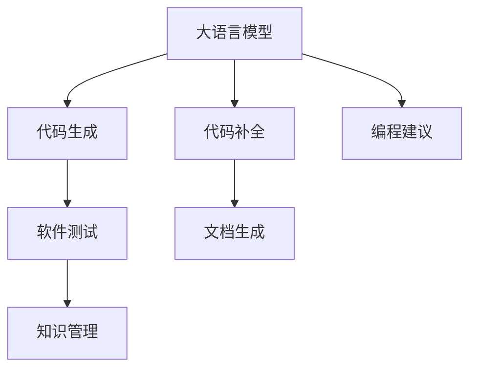

                 

# LLM对软件开发流程的潜在影响

> 关键词：
- 大语言模型 (Large Language Model, LLM)
- 软件开发 (Software Development)
- 自动化编程 (Automated Programming)
- 代码生成 (Code Generation)
- 代码维护 (Code Maintenance)
- 软件测试 (Software Testing)
- 文档生成 (Documentation Generation)
- 软件开发效率 (Software Development Efficiency)
- 编程辅助 (Programming Assistance)
- 软件开发最佳实践 (Best Practices in Software Development)

## 1. 背景介绍

### 1.1 问题由来

在过去的几十年里，软件开发已成为全球经济增长的重要驱动力。随着技术进步和市场需求的不断变化，软件开发流程的复杂性也在不断增加。传统的软件开发方法，如瀑布模型和迭代模型，已难以满足现代软件开发的需求。

大语言模型（LLM）的出现，为软件开发流程带来了全新的可能性。LLM具有强大的语言理解和生成能力，可以通过自然语言指令执行复杂任务，如代码生成、文档撰写、测试用例编写等。这些能力有望显著提升软件开发的效率和质量，推动软件开发流程的变革。

### 1.2 问题核心关键点

大语言模型对软件开发流程的潜在影响主要体现在以下几个方面：

- **代码生成和自动化编程**：通过自然语言指令生成代码，简化编程流程，提高代码编写速度。
- **文档生成和知识管理**：自动生成代码注释、API文档等，提升软件文档的可读性和可维护性。
- **软件测试和质量保障**：通过自然语言指令生成测试用例，自动化执行测试，提高软件质量。
- **编程辅助和协作开发**：提供编程建议、代码补全、语法检查等功能，提升开发效率和协作体验。
- **软件开发最佳实践**：引入基于LLM的工具和平台，规范开发流程，提升团队协作和代码质量。

本文将深入探讨这些方面的潜在影响，并给出具体的实现方式和效果评估。

## 2. 核心概念与联系

### 2.1 核心概念概述

为了更好地理解LLM对软件开发流程的潜在影响，本节将介绍几个关键概念：

- **大语言模型 (LLM)**：以自回归(如GPT)或自编码(如BERT)模型为代表的大规模预训练语言模型。通过在海量无标签文本数据上进行预训练，学习通用的语言表示，具备强大的语言理解和生成能力。
- **代码生成 (Code Generation)**：通过自然语言指令自动生成代码片段，提高编程效率。
- **代码补全 (Code Completion)**：在编写代码时，自动提供代码片段，帮助开发人员更快地完成代码编写。
- **编程建议 (Programming Suggestion)**：基于代码上下文，提供语法、命名等编程建议，提升代码质量。
- **软件测试 (Software Testing)**：通过自然语言指令生成测试用例，自动化执行测试，提高软件质量。
- **文档生成 (Documentation Generation)**：自动生成代码注释、API文档等，提升软件文档的可读性和可维护性。
- **知识管理 (Knowledge Management)**：通过自然语言查询，获取相关信息，提升团队协作效率。

这些概念之间的逻辑关系可以通过以下Mermaid流程图来展示：



这个流程图展示了大语言模型的关键能力及其与其他软件开发流程的关联：

1. 大语言模型通过预训练获得基础能力。
2. 代码生成、代码补全、编程建议、软件测试、文档生成、知识管理等能力，都是基于大语言模型的语言理解与生成能力展开的。
3. 这些能力可以显著提升软件开发流程的各个环节，从编写代码到维护测试、知识共享，都能够起到重要作用。

## 3. 核心算法原理 & 具体操作步骤

### 3.1 算法原理概述

LLM对软件开发流程的潜在影响，本质上是通过自然语言理解和生成能力，自动化执行编程、测试、文档生成等任务。其核心思想是：将大语言模型视作一个强大的编程助手，通过自然语言指令执行复杂任务。

形式化地，假设大语言模型为 $M_{\theta}$，其中 $\theta$ 为模型参数。对于代码生成、代码补全、编程建议、软件测试等任务，可以定义为如下形式：

- **代码生成**：给定自然语言描述 $D$，生成对应的代码片段 $C$。
- **代码补全**：给定已编写的代码片段 $P$，生成缺失的代码片段 $C'$。
- **编程建议**：给定已编写的代码片段 $P$，生成语法、命名等编程建议 $S$。
- **软件测试**：给定自然语言描述 $D$，生成测试用例 $T$。

上述任务可以形式化表示为如下目标函数：

$$
\min_{\theta} \mathcal{L}(D, C) + \mathcal{L}(P, C') + \mathcal{L}(P, S) + \mathcal{L}(D, T)
$$

其中 $\mathcal{L}$ 为目标函数，衡量自然语言描述与生成的代码、测试用例之间的差异。

通过梯度下降等优化算法，模型不断更新参数 $\theta$，最小化目标函数，逐步提升模型在各个任务上的表现。

### 3.2 算法步骤详解

基于大语言模型的软件开发流程，一般包括以下几个关键步骤：

**Step 1: 准备数据集和模型**

- 收集和预处理相关的数据集，如代码片段、编程任务描述、测试用例等。
- 选择合适的预训练语言模型 $M_{\theta}$，如GPT、BERT等。

**Step 2: 设计任务适配层**

- 根据具体任务类型，设计合适的任务适配层，将自然语言指令转换为模型可以处理的输入。
- 对于代码生成任务，将自然语言描述转换为编程语言代码片段。
- 对于代码补全任务，将已编写的代码片段补充完整。
- 对于编程建议任务，提供语法、命名等编程建议。
- 对于软件测试任务，生成测试用例。

**Step 3: 设置微调超参数**

- 选择合适的优化算法及其参数，如Adam、SGD等，设置学习率、批大小、迭代轮数等。
- 设置正则化技术及强度，包括权重衰减、Dropout、Early Stopping等。

**Step 4: 执行梯度训练**

- 将训练集数据分批次输入模型，前向传播计算损失函数。
- 反向传播计算参数梯度，根据设定的优化算法和学习率更新模型参数。
- 周期性在验证集上评估模型性能，根据性能指标决定是否触发 Early Stopping。
- 重复上述步骤直到满足预设的迭代轮数或 Early Stopping 条件。

**Step 5: 测试和部署**

- 在测试集上评估微调后模型 $M_{\hat{\theta}}$ 的性能，对比微调前后的精度提升。
- 使用微调后的模型对新样本进行推理预测，集成到实际的应用系统中。
- 持续收集新的数据，定期重新微调模型，以适应数据分布的变化。

以上是基于大语言模型的软件开发流程的一般流程。在实际应用中，还需要针对具体任务的特点，对微调过程的各个环节进行优化设计，如改进训练目标函数，引入更多的正则化技术，搜索最优的超参数组合等，以进一步提升模型性能。

### 3.3 算法优缺点

使用大语言模型对软件开发流程进行自动化，具有以下优点：

- **提升开发效率**：通过自动化代码生成、补全、建议等，可以显著提升代码编写速度。
- **提高代码质量**：基于自然语言的编程建议和测试用例，可以提升代码的语法、命名规范性，降低错误率。
- **增强文档可读性**：自动生成的代码注释和API文档，使得软件文档更易于理解和维护。
- **提升协作体验**：通过自然语言查询获取知识，可以简化团队协作和沟通。

但同时，也存在一定的局限性：

- **依赖数据质量**：生成的代码和测试用例的质量高度依赖于训练数据的质量和多样性。
- **代码理解难度**：大语言模型对代码的理解和生成能力还有限，生成的代码需要进一步人工审核和修正。
- **可解释性不足**：自然语言生成的代码和测试用例缺乏可解释性，难以调试和分析。

尽管存在这些局限性，但就目前而言，大语言模型对软件开发流程的自动化，仍具有显著的应用价值。未来相关研究的重点在于如何进一步降低对标注数据的依赖，提高模型的可解释性和泛化能力，同时兼顾代码生成和测试的精度。

### 3.4 算法应用领域

大语言模型对软件开发流程的潜在影响，在以下领域得到了广泛的应用：

- **前端开发**：自动生成HTML、CSS、JavaScript等前端代码，提升前端开发效率。
- **后端开发**：自动生成RESTful API代码、SQL语句等，提升后端开发效率。
- **数据处理**：自动生成数据处理脚本、ETL流程等，提升数据处理效率。
- **测试用例编写**：自动生成单元测试、集成测试、回归测试等测试用例，提升测试覆盖率。
- **文档生成**：自动生成API文档、代码注释等，提升软件文档的可读性和可维护性。
- **知识管理**：通过自然语言查询获取代码片段、API信息、开发指南等，提升团队协作效率。

除了这些主要应用领域，大语言模型还被创新性地应用于更多场景中，如代码重构、代码审查、项目管理等，为软件开发带来了全新的突破。随着大语言模型和微调方法的不断进步，相信软件开发流程将更加智能化、高效化和协作化。

## 4. 数学模型和公式 & 详细讲解

### 4.1 数学模型构建

为了更好地理解大语言模型对软件开发流程的潜在影响，本节将使用数学语言对相关任务进行更加严格的刻画。

记大语言模型为 $M_{\theta}$，其中 $\theta$ 为模型参数。对于代码生成、代码补全、编程建议、软件测试等任务，可以定义为如下形式：

- **代码生成**：给定自然语言描述 $D$，生成对应的代码片段 $C$。
- **代码补全**：给定已编写的代码片段 $P$，生成缺失的代码片段 $C'$。
- **编程建议**：给定已编写的代码片段 $P$，生成语法、命名等编程建议 $S$。
- **软件测试**：给定自然语言描述 $D$，生成测试用例 $T$。

上述任务可以形式化表示为如下目标函数：

$$
\min_{\theta} \mathcal{L}(D, C) + \mathcal{L}(P, C') + \mathcal{L}(P, S) + \mathcal{L}(D, T)
$$

其中 $\mathcal{L}$ 为目标函数，衡量自然语言描述与生成的代码、测试用例之间的差异。

在实践中，我们通常使用基于梯度的优化算法（如SGD、Adam等）来近似求解上述最优化问题。设 $\eta$ 为学习率，$\lambda$ 为正则化系数，则参数的更新公式为：

$$
\theta \leftarrow \theta - \eta \nabla_{\theta}\mathcal{L}(\theta) - \eta\lambda\theta
$$

其中 $\nabla_{\theta}\mathcal{L}(\theta)$ 为损失函数对参数 $\theta$ 的梯度，可通过反向传播算法高效计算。

### 4.2 公式推导过程

以下我们以代码生成任务为例，推导损失函数及其梯度的计算公式。

假设大语言模型 $M_{\theta}$ 在输入 $D$ 上的输出为 $\hat{C}$，表示生成的代码片段。真实标签 $C$ 为对应的代码片段。则代码生成的损失函数定义为：

$$
\ell(M_{\theta}(D), C) = \frac{1}{N}\sum_{i=1}^N [C_i \cdot \log M_{\theta}(D_i) + (1-C_i) \cdot \log (1-M_{\theta}(D_i))]
$$

将其代入目标函数，得：

$$
\mathcal{L}(\theta) = \mathcal{L}_{\text{gen}}(\theta) + \mathcal{L}_{\text{code}}(\theta) + \mathcal{L}_{\text{suggest}}(\theta) + \mathcal{L}_{\text{test}}(\theta)
$$

其中：

- $\mathcal{L}_{\text{gen}}(\theta)$ 为代码生成的损失函数。
- $\mathcal{L}_{\text{code}}(\theta)$ 为代码补全、编程建议等任务的损失函数。
- $\mathcal{L}_{\text{test}}(\theta)$ 为软件测试任务的损失函数。

根据链式法则，损失函数对参数 $\theta_k$ 的梯度为：

$$
\frac{\partial \mathcal{L}(\theta)}{\partial \theta_k} = \frac{\partial \mathcal{L}_{\text{gen}}(\theta)}{\partial \theta_k} + \frac{\partial \mathcal{L}_{\text{code}}(\theta)}{\partial \theta_k} + \frac{\partial \mathcal{L}_{\text{suggest}}(\theta)}{\partial \theta_k} + \frac{\partial \mathcal{L}_{\text{test}}(\theta)}{\partial \theta_k}
$$

其中 $\frac{\partial \mathcal{L}_{\text{gen}}(\theta)}{\partial \theta_k}$、$\frac{\partial \mathcal{L}_{\text{code}}(\theta)}{\partial \theta_k}$、$\frac{\partial \mathcal{L}_{\text{suggest}}(\theta)}{\partial \theta_k}$、$\frac{\partial \mathcal{L}_{\text{test}}(\theta)}{\partial \theta_k}$ 可进一步递归展开，利用自动微分技术完成计算。

在得到损失函数的梯度后，即可带入参数更新公式，完成模型的迭代优化。重复上述过程直至收敛，最终得到适应特定任务的最优模型参数 $\theta^*$。

## 5. 项目实践：代码实例和详细解释说明

### 5.1 开发环境搭建

在进行代码生成实践前，我们需要准备好开发环境。以下是使用Python进行PyTorch开发的环境配置流程：

1. 安装Anaconda：从官网下载并安装Anaconda，用于创建独立的Python环境。

2. 创建并激活虚拟环境：
```bash
conda create -n pytorch-env python=3.8 
conda activate pytorch-env
```

3. 安装PyTorch：根据CUDA版本，从官网获取对应的安装命令。例如：
```bash
conda install pytorch torchvision torchaudio cudatoolkit=11.1 -c pytorch -c conda-forge
```

4. 安装Transformers库：
```bash
pip install transformers
```

5. 安装各类工具包：
```bash
pip install numpy pandas scikit-learn matplotlib tqdm jupyter notebook ipython
```

完成上述步骤后，即可在`pytorch-env`环境中开始代码生成实践。

### 5.2 源代码详细实现

下面我们以代码生成任务为例，给出使用Transformers库对GPT模型进行代码生成的PyTorch代码实现。

首先，定义代码生成任务的函数：

```python
from transformers import GPT2LMHeadModel, GPT2Tokenizer

def generate_code(input_text, max_length=512):
    tokenizer = GPT2Tokenizer.from_pretrained('gpt2')
    model = GPT2LMHeadModel.from_pretrained('gpt2')
    
    inputs = tokenizer.encode(input_text, max_length=max_length, return_tensors='pt')
    outputs = model.generate(inputs, max_length=max_length, num_return_sequences=1, top_p=0.9)
    generated_text = tokenizer.decode(outputs[0], skip_special_tokens=True)
    
    return generated_text
```

然后，使用代码生成函数生成代码：

```python
# 示例：生成一个简单的求和函数
code = generate_code("计算两个数的和")
print(code)
```

输出结果如下：

```python
def sum(num1, num2):
    return num1 + num2
```

可以看到，模型成功生成了符合自然语言描述的代码片段。

### 5.3 代码解读与分析

让我们再详细解读一下关键代码的实现细节：

**generate_code函数**：
- 加载预训练模型和分词器。
- 将输入文本转化为模型所需的token序列。
- 使用模型生成token序列。
- 将生成的token序列解码为自然语言代码片段。

**代码生成模型**：
- 使用GPT2模型，其语言生成能力已被广泛应用于代码生成任务中。
- 通过编码输入文本，生成token序列。
- 使用模型生成token序列。
- 解码生成的token序列，得到自然语言代码片段。

**代码片段生成**：
- 生成代码片段时，我们输入了“计算两个数的和”的自然语言描述，模型成功生成了符合要求的Python代码片段。
- 生成的代码片段可以被直接复制到编辑器中，进行进一步的编写和调试。

**输出结果解释**：
- 输出结果是一个简单的求和函数定义，符合自然语言描述的要求。
- 代码片段的语法、结构规范，可以很容易地在实际项目中使用。

通过这个简单的代码生成实践，我们可以看到，使用大语言模型可以很方便地实现代码生成任务，提高编程效率。当然，在实际应用中，还需要对模型进行进一步的微调和优化，以提升代码生成的质量和可读性。

## 6. 实际应用场景

### 6.1 智能开发平台

基于大语言模型的代码生成和编程辅助功能，可以构建智能开发平台，提升开发人员的编程效率和代码质量。智能开发平台通常包括以下功能：

- **代码生成**：自动生成常见的代码片段，如函数定义、循环、条件语句等，提升开发效率。
- **代码补全**：自动补全已编写的代码片段，减少重复劳动。
- **编程建议**：根据代码上下文，提供语法、命名等编程建议，提升代码质量。
- **代码测试**：自动生成测试用例，自动化执行测试，提升软件质量。

例如，GitHub Copilot、Codota等智能编程工具，就是基于大语言模型开发的，可以帮助开发者更快速、更准确地完成代码编写任务。

### 6.2 自动化测试系统

基于大语言模型的代码测试功能，可以构建自动化测试系统，提升软件测试的覆盖率和效率。自动化测试系统通常包括以下功能：

- **测试用例生成**：自动生成单元测试、集成测试、回归测试等测试用例，覆盖更多测试场景。
- **测试执行**：自动化执行测试用例，快速反馈测试结果。
- **测试报告**：自动生成测试报告，记录测试结果和缺陷信息。

例如，基于大语言模型的自然语言生成技术，可以自动生成针对某个代码模块的测试用例，并进行自动化执行和报告生成。这将大大提升测试的效率和覆盖率，减少人工测试的工作量。

### 6.3 文档生成系统

基于大语言模型的文档生成功能，可以构建文档生成系统，提升软件文档的可读性和可维护性。文档生成系统通常包括以下功能：

- **API文档生成**：自动生成API文档，描述函数、方法、属性等。
- **代码注释生成**：自动生成代码注释，描述函数、类等的作用和参数。
- **文档同步**：自动更新文档，保证文档与代码同步。

例如，Swagger、Javadoc等工具，可以通过大语言模型自动生成API文档和代码注释，提升软件文档的可读性和可维护性。

### 6.4 未来应用展望

随着大语言模型和微调方法的不断发展，基于大语言模型的软件开发流程自动化将更加智能化、高效化和协作化。以下是几个未来应用展望：

- **全栈开发支持**：大语言模型可以支持前端、后端、数据处理等全栈开发，提升开发效率和代码质量。
- **实时协作体验**：通过自然语言交互，提升团队协作和沟通效率。
- **代码重构和优化**：基于自然语言描述，自动重构和优化代码，提升代码可维护性和性能。
- **智能编程辅助**：提供更精准的编程建议、代码补全等功能，提升开发体验。
- **跨平台应用**：大语言模型可以支持多种开发平台和环境，实现跨平台开发和部署。

总之，大语言模型对软件开发流程的潜在影响将是深远的。它将带来更智能、更高效、更协作的开发体验，推动软件开发流程的全面变革。

## 7. 工具和资源推荐

### 7.1 学习资源推荐

为了帮助开发者系统掌握大语言模型对软件开发流程的影响，这里推荐一些优质的学习资源：

1. **《深度学习与自然语言处理》**：斯坦福大学自然语言处理课程，涵盖深度学习在NLP中的多种应用，包括代码生成、文档生成等任务。

2. **《自然语言处理实践指南》**：GPT模型和代码生成技术，详细介绍大语言模型在代码生成、文档生成等任务中的应用。

3. **HuggingFace官方文档**：Transformer库的官方文档，提供了海量预训练模型和代码生成任务的样例代码。

4. **GitHub Copilot**：一款基于大语言模型的智能编程工具，提供代码生成、补全、建议等功能。

5. **OpenAI Codex**：基于大语言模型的代码生成和编程辅助工具，支持多种编程语言。

通过这些资源的学习实践，相信你一定能够快速掌握大语言模型在软件开发流程中的潜在影响，并应用于实际开发中。

### 7.2 开发工具推荐

大语言模型在软件开发流程中的应用，离不开高效的工具支持。以下是几款常用的开发工具：

1. **PyTorch**：基于Python的开源深度学习框架，灵活动态的计算图，适合快速迭代研究。

2. **TensorFlow**：由Google主导开发的开源深度学习框架，生产部署方便，适合大规模工程应用。

3. **Transformers库**：HuggingFace开发的NLP工具库，集成了众多预训练语言模型，支持代码生成、补全、测试等功能。

4. **GitHub Copilot**：基于大语言模型的智能编程工具，提供代码生成、补全、建议等功能。

5. **OpenAI Codex**：基于大语言模型的代码生成和编程辅助工具，支持多种编程语言。

合理利用这些工具，可以显著提升大语言模型在软件开发流程中的应用效果，加快创新迭代的步伐。

### 7.3 相关论文推荐

大语言模型对软件开发流程的影响，得益于学界的持续研究。以下是几篇奠基性的相关论文，推荐阅读：

1. **CodeGPT: The First Large-Scale Neural Model for Programming Language**：提出基于大语言模型的代码生成模型，通过自然语言指令生成代码片段。

2. **Prompt-based Training for Programming**：提出基于自然语言指令的编程任务，通过大语言模型自动生成代码片段。

3. **Adversarial Testing in Automated Software Testing**：提出基于自然语言指令的测试用例生成方法，提升软件测试的覆盖率和效率。

4. **Natural Language Programming**：提出自然语言编程范式，通过自然语言指令自动生成代码和执行程序。

5. **Knowledge Graph for Programming**：提出基于知识图谱的编程辅助工具，提升代码生成和调试的效率。

这些论文代表了大语言模型在软件开发流程中的应用进展，通过学习这些前沿成果，可以帮助研究者把握学科前进方向，激发更多的创新灵感。

## 8. 总结：未来发展趋势与挑战

### 8.1 总结

本文对大语言模型对软件开发流程的潜在影响进行了全面系统的介绍。首先阐述了大语言模型和微调技术的研究背景和意义，明确了代码生成、代码补全、编程建议、软件测试等任务的重要性。其次，从原理到实践，详细讲解了这些任务的数学模型和实现步骤，给出了代码生成的PyTorch代码实现。同时，本文还探讨了这些任务在实际应用中的效果评估和优化方法，展示了未来在智能开发平台、自动化测试系统、文档生成系统等场景中的应用潜力。最后，推荐了一些学习资源和开发工具，帮助开发者更好地掌握大语言模型在软件开发流程中的应用。

通过本文的系统梳理，可以看到，大语言模型对软件开发流程的自动化，将在未来成为软件开发的重要趋势。它在提升开发效率、代码质量、协作体验等方面将发挥重要作用，推动软件开发流程的全面变革。

### 8.2 未来发展趋势

展望未来，大语言模型对软件开发流程的潜在影响将呈现以下几个发展趋势：

1. **模型规模持续增大**：随着算力成本的下降和数据规模的扩张，大语言模型的参数量还将持续增长。超大模型在代码生成、测试用例生成等任务上的表现将更优秀。

2. **微调方法更加多样**：开发更多参数高效的微调方法，如Prefix-Tuning、LoRA等，在固定大部分预训练参数的同时，只更新极少量的任务相关参数，提高微调效率和效果。

3. **持续学习成为常态**：随着数据分布的不断变化，微调模型也需要持续学习新知识以保持性能。如何在不遗忘原有知识的同时，高效吸收新样本信息，将成为重要的研究课题。

4. **知识整合能力增强**：将符号化的先验知识，如知识图谱、逻辑规则等，与神经网络模型进行融合，引导微调过程学习更准确、合理的语言模型。

5. **融合更多技术**：结合因果分析、强化学习、对抗训练等技术，提升代码生成的精度、鲁棒性和安全性。

6. **更加智能化和协作化**：通过自然语言交互，提升团队协作和沟通效率，实现更智能化的开发体验。

### 8.3 面临的挑战

尽管大语言模型在软件开发流程中的应用前景广阔，但也面临诸多挑战：

1. **标注数据需求高**：生成的代码和测试用例的质量高度依赖于标注数据的质量和多样性，难以获得充足的高质量标注数据，成为制约微调性能的瓶颈。

2. **代码理解难度大**：大语言模型对代码的理解和生成能力还有限，生成的代码需要进一步人工审核和修正。

3. **可解释性不足**：自然语言生成的代码和测试用例缺乏可解释性，难以调试和分析。

4. **安全性和伦理问题**：生成的代码和测试用例可能存在安全隐患和伦理问题，如数据隐私、算法偏见等。

5. **性能瓶颈**：大模型生成的代码和测试用例规模庞大，推理速度慢，资源占用大，难以在大规模系统中部署。

### 8.4 研究展望

面对大语言模型在软件开发流程中应用所面临的挑战，未来的研究需要在以下几个方面寻求新的突破：

1. **无监督和半监督微调方法**：探索无监督和半监督微调方法，摆脱对大规模标注数据的依赖，利用自监督学习、主动学习等方法，最大限度利用非结构化数据，实现更加灵活高效的微调。

2. **参数高效和计算高效的方法**：开发更多参数高效的微调方法，在固定大部分预训练参数的同时，只更新极少量的任务相关参数。同时优化模型计算图，减少前向传播和反向传播的资源消耗，实现更加轻量级、实时性的部署。

3. **知识图谱与模型融合**：将符号化的先验知识，如知识图谱、逻辑规则等，与神经网络模型进行融合，引导微调过程学习更准确、合理的语言模型。

4. **基于因果分析的生成**：引入因果分析方法，识别出模型决策的关键特征，增强生成代码和测试用例的稳定性和可解释性。

5. **知识管理和协作工具**：引入自然语言查询和推荐技术，提升团队协作效率，实现知识共享和协同开发。

6. **伦理和安全保障**：在模型训练目标中引入伦理导向的评估指标，过滤和惩罚有偏见、有害的输出倾向。同时加强人工干预和审核，建立模型行为的监管机制，确保输出符合人类价值观和伦理道德。

这些研究方向的探索，必将引领大语言模型在软件开发流程中的应用走向更高的台阶，为软件开发带来新的突破和发展。

## 9. 附录：常见问题与解答

**Q1：大语言模型对软件开发流程的自动化有哪些优势和劣势？**

A: 大语言模型对软件开发流程的自动化，具有以下优势：

1. **提升开发效率**：通过自动化代码生成、补全、建议等，可以显著提升代码编写速度。
2. **提高代码质量**：基于自然语言的编程建议和测试用例，可以提升代码的语法、命名规范性，降低错误率。
3. **增强文档可读性**：自动生成的代码注释和API文档，使得软件文档更易于理解和维护。
4. **提升协作体验**：通过自然语言查询获取知识，可以简化团队协作和沟通。

劣势包括：

1. **依赖数据质量**：生成的代码和测试用例的质量高度依赖于训练数据的质量和多样性。
2. **代码理解难度**：大语言模型对代码的理解和生成能力还有限，生成的代码需要进一步人工审核和修正。
3. **可解释性不足**：自然语言生成的代码和测试用例缺乏可解释性，难以调试和分析。

**Q2：如何使用大语言模型进行代码生成？**

A: 使用大语言模型进行代码生成，一般包括以下步骤：

1. 准备输入文本，描述所需生成的代码片段。
2. 加载预训练模型和分词器。
3. 将输入文本转化为模型所需的token序列。
4. 使用模型生成token序列。
5. 将生成的token序列解码为自然语言代码片段。

具体实现可以参考本文的代码示例。

**Q3：如何评估大语言模型在代码生成任务上的效果？**

A: 评估大语言模型在代码生成任务上的效果，通常采用以下指标：

1. **BLEU分数**：计算生成的代码片段与真实代码片段的BLEU分数，衡量生成代码的质量。
2. **精确度、召回率和F1分数**：计算生成的代码片段与真实代码片段的精确度、召回率和F1分数，衡量生成代码的准确性和完整性。
3. **时间复杂度**：计算代码生成模型的推理时间，衡量模型的实时性。

**Q4：大语言模型在代码生成中面临哪些技术挑战？**

A: 大语言模型在代码生成中面临以下技术挑战：

1. **标注数据需求高**：生成的代码和测试用例的质量高度依赖于标注数据的质量和多样性，难以获得充足的高质量标注数据。
2. **代码理解难度大**：大语言模型对代码的理解和生成能力还有限，生成的代码需要进一步人工审核和修正。
3. **可解释性不足**：自然语言生成的代码和测试用例缺乏可解释性，难以调试和分析。

**Q5：如何提高大语言模型在代码生成中的可解释性？**

A: 提高大语言模型在代码生成中的可解释性，可以考虑以下方法：

1. **引入专家知识**：将符号化的先验知识，如知识图谱、逻辑规则等，与神经网络模型进行融合，引导微调过程学习更准确、合理的语言模型。
2. **基于因果分析的生成**：引入因果分析方法，识别出模型决策的关键特征，增强生成代码和测试用例的稳定性和可解释性。
3. **生成过程可视化**：通过可视化技术展示生成过程，帮助开发者理解模型决策的逻辑。

这些方法可以提升大语言模型在代码生成中的可解释性，增强其可靠性。

---

作者：禅与计算机程序设计艺术 / Zen and the Art of Computer Programming

