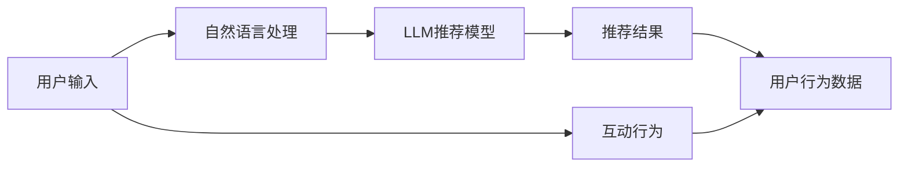

                 

# 《LLM推荐中的动态兴趣捕捉技术》

在当下智能推荐系统领域，用户兴趣的动态捕捉和个性化推荐已经成为了研究热点。随着自然语言处理（NLP）和深度学习（DL）技术的迅猛发展，基于大语言模型（Large Language Model，简称LLM）的推荐系统逐渐成为行业新趋势。本文将深入探讨LLM推荐中动态兴趣捕捉技术，并结合实际应用场景，阐述其核心概念、算法原理、操作步骤，以及优缺点和未来发展方向。

## 1. 背景介绍

随着互联网信息的爆炸式增长，如何让用户在海量信息中找到感兴趣的内容成为了一个重要问题。传统的推荐系统主要依赖于用户历史行为数据，如点击、购买、收藏等，这种基于数据驱动的推荐方法在初期效果显著，但随着用户行为的动态变化和多样化，传统的推荐方法逐渐显现出其局限性。特别是对于新用户或长期没有进行互动的用户，基于历史行为的推荐难以覆盖其兴趣。

而基于大语言模型的推荐系统，可以利用LLM的强大语言理解和生成能力，动态捕捉用户兴趣，实现更加个性化的推荐服务。LLM推荐系统通过预训练大模型（如GPT、BERT等），结合用户输入的语言描述和互动行为，进行实时推荐决策，极大地提升了推荐系统的个性化和动态性。

## 2. 核心概念与联系

### 2.1 核心概念概述

- **大语言模型（Large Language Model，LLM）**：通过自监督学习和大规模文本数据训练得到的模型，具备强大的语言理解和生成能力。常用的LLM包括GPT、BERT、T5等。
- **推荐系统（Recommendation System）**：利用用户行为数据，为用户推荐其可能感兴趣的内容的系统。传统推荐系统依赖于协同过滤、基于内容的推荐等方法，而基于LLM的推荐系统通过预训练模型捕捉用户兴趣，提供动态个性化的推荐服务。
- **动态兴趣捕捉（Dynamic Interest Capture）**：在用户与推荐系统的交互过程中，实时捕捉用户的兴趣变化，并动态调整推荐结果，以提升用户体验和满意度。
- **多模态数据融合（Multi-modal Data Fusion）**：结合用户行为数据（如点击、搜索历史）和语言描述（如用户输入的文本），进行数据融合，提升推荐系统的准确性和鲁棒性。
- **语义相似度计算（Semantic Similarity Computation）**：通过计算文本之间的语义相似度，发现相关内容，实现个性化推荐。

### 2.2 核心概念之间的联系

下图展示了基于LLM推荐系统中动态兴趣捕捉技术的基本架构：



用户输入经过自然语言处理（NLP）模块，转换成模型能够理解的形式，再输入到LLM推荐模型中进行处理。模型根据用户输入的语言描述和互动行为，结合多模态数据融合技术，动态捕捉用户兴趣，最终输出推荐结果。用户行为数据用于评估推荐效果，并作为反馈信号调整模型参数，实现持续学习和优化。

## 3. 核心算法原理 & 具体操作步骤

### 3.1 算法原理概述

基于LLM的推荐系统核心原理是利用预训练的LLM捕捉用户兴趣，结合用户行为数据，进行动态推荐。其算法流程如下：

1. **用户输入理解**：通过NLP技术，将用户输入的语言描述转换成模型能够理解的形式，如句子向量。
2. **LLM兴趣捕捉**：利用预训练的LLM，对用户输入进行语义理解和生成，捕捉用户兴趣。
3. **多模态数据融合**：结合用户行为数据（如点击、搜索历史）和语言描述，进行数据融合，得到综合兴趣特征。
4. **动态推荐**：根据用户兴趣特征，实时调整推荐策略，生成个性化推荐结果。
5. **推荐效果评估**：收集用户对推荐结果的反馈，如点击、购买等行为，评估推荐系统效果，并用于模型优化。

### 3.2 算法步骤详解

#### 3.2.1 用户输入理解

用户输入的语言描述需要通过NLP技术进行转换，常用的方法包括：

- **分词**：将用户输入的文本分成单词或词语，去除停用词，得到分词序列。
- **嵌入表示**：将分词序列转换成向量表示，常用的方法包括词嵌入（Word Embedding）和句子向量（Sentence Vectorization），如Word2Vec、GloVe、BERT等。

#### 3.2.2 LLM兴趣捕捉

利用预训练的LLM，对用户输入进行语义理解和生成，捕捉用户兴趣。具体步骤如下：

1. **编码器输入**：将用户输入的语言描述转换成句子向量，作为编码器的输入。
2. **模型生成**：利用预训练的LLM，对句子向量进行生成，得到用户兴趣相关的语言描述。
3. **解码器输出**：将生成后的语言描述输入到解码器，得到最终的推荐结果。

#### 3.2.3 多模态数据融合

多模态数据融合是指将用户行为数据和语言描述进行结合，得到综合兴趣特征。常用的方法包括：

- **向量拼接**：将用户行为数据和语言描述的向量表示进行拼接，得到综合向量。
- **注意力机制**：通过注意力机制，对不同模态的数据进行加权融合，提升兴趣特征的准确性。

#### 3.2.4 动态推荐

动态推荐是指根据用户兴趣特征，实时调整推荐策略，生成个性化推荐结果。常用的方法包括：

- **协同过滤**：结合用户的历史行为数据和兴趣特征，进行推荐。
- **基于内容的推荐**：利用物品的特征向量，与用户兴趣特征进行相似度计算，推荐相关物品。
- **混合推荐**：结合协同过滤和基于内容的推荐方法，提升推荐效果。

#### 3.2.5 推荐效果评估

推荐效果评估是指收集用户对推荐结果的反馈，如点击、购买等行为，评估推荐系统效果，并用于模型优化。常用的方法包括：

- **点击率（Click-Through Rate, CTR）**：用户点击推荐结果的概率。
- **转化率（Conversion Rate, CR）**：用户完成购买、注册等目标行为的概率。
- **NDCG（Normalized Discounted Cumulative Gain）**：推荐结果的排序准确度。
- **RMSE（Root Mean Square Error）**：推荐结果的预测准确度。

### 3.3 算法优缺点

#### 3.3.1 优点

1. **动态捕捉用户兴趣**：利用LLM的强大语言理解和生成能力，实时捕捉用户兴趣变化，提供动态个性化的推荐服务。
2. **泛化能力强**：LLM具备较强的泛化能力，可以处理多种自然语言，覆盖不同领域和语言的推荐需求。
3. **个性化推荐**：结合用户行为数据和语言描述，进行多模态数据融合，提升推荐系统的个性化和鲁棒性。

#### 3.3.2 缺点

1. **计算成本高**：预训练LLM的模型参数量巨大，计算资源消耗大。
2. **数据依赖性强**：推荐系统的性能高度依赖于用户行为数据和语言描述的质量，数据获取成本高。
3. **模型复杂度高**：结合多模态数据融合和动态推荐，模型复杂度高，需要精心设计优化策略。

### 3.4 算法应用领域

基于LLM的动态兴趣捕捉技术，已经在多个领域得到应用，主要包括：

- **电商推荐**：利用用户搜索历史和语言描述，实时生成个性化商品推荐。
- **内容推荐**：结合用户阅读行为和文本评论，生成个性化文章推荐。
- **广告推荐**：利用用户浏览记录和语言描述，动态生成个性化广告推荐。
- **旅游推荐**：结合用户旅游记录和语言描述，生成个性化旅游目的地推荐。

## 4. 数学模型和公式 & 详细讲解 & 举例说明

### 4.1 数学模型构建

基于LLM的推荐系统，其数学模型可以表示为：

$$
y = f(x; \theta)
$$

其中 $x$ 表示用户输入的语言描述，$y$ 表示推荐结果，$\theta$ 表示模型参数。模型的目标是通过 $f(x; \theta)$ 生成最符合用户兴趣的推荐结果。

### 4.2 公式推导过程

假设用户输入为 $x_i$，推荐结果为 $y_i$，推荐系统模型为 $f(x_i; \theta)$，其损失函数为 $L(y_i, f(x_i; \theta))$。常用的损失函数包括：

- **交叉熵损失（Cross-Entropy Loss）**：适用于分类推荐任务。
- **均方误差损失（Mean Squared Error Loss）**：适用于回归推荐任务。

#### 4.2.1 交叉熵损失

交叉熵损失函数可以表示为：

$$
L(y_i, f(x_i; \theta)) = -\sum_{j=1}^{K} y_{i,j} \log f(x_i; \theta)_j
$$

其中 $y_{i,j}$ 表示第 $i$ 个用户的第 $j$ 个标签，$f(x_i; \theta)_j$ 表示模型对第 $j$ 个标签的概率预测。

#### 4.2.2 均方误差损失

均方误差损失函数可以表示为：

$$
L(y_i, f(x_i; \theta)) = \frac{1}{2} \sum_{j=1}^{K} (y_{i,j} - f(x_i; \theta)_j)^2
$$

其中 $y_{i,j}$ 和 $f(x_i; \theta)_j$ 的含义同上。

### 4.3 案例分析与讲解

假设用户输入为“我想看一部科幻电影”，推荐结果为“星球大战”。首先，通过NLP技术将输入转换为句子向量 $x_i$。接着，利用预训练的LLM模型 $f(x_i; \theta)$ 生成推荐结果 $y_i$。最后，根据推荐结果的准确度和用户反馈，调整模型参数 $\theta$，进行模型优化。

## 5. 项目实践：代码实例和详细解释说明

### 5.1 开发环境搭建

开发环境搭建需要安装相应的深度学习框架和NLP库，常用的框架包括PyTorch、TensorFlow，NLP库包括HuggingFace的Transformers等。

```bash
pip install torch torchvision torchaudio transformers sklearn
```

### 5.2 源代码详细实现

以下是一个基于BERT的推荐系统代码实现示例：

```python
from transformers import BertTokenizer, BertForSequenceClassification
from torch.utils.data import DataLoader, Dataset
from sklearn.metrics import precision_recall_fscore_support

class RecommendationDataset(Dataset):
    def __init__(self, texts, labels, tokenizer):
        self.texts = texts
        self.labels = labels
        self.tokenizer = tokenizer
        
    def __len__(self):
        return len(self.texts)
    
    def __getitem__(self, item):
        text = self.texts[item]
        label = self.labels[item]
        
        encoding = self.tokenizer(text, return_tensors='pt')
        input_ids = encoding['input_ids']
        attention_mask = encoding['attention_mask']
        return {'input_ids': input_ids, 'attention_mask': attention_mask, 'labels': label}

tokenizer = BertTokenizer.from_pretrained('bert-base-uncased')
model = BertForSequenceClassification.from_pretrained('bert-base-uncased', num_labels=2)

train_dataset = RecommendationDataset(train_texts, train_labels, tokenizer)
val_dataset = RecommendationDataset(val_texts, val_labels, tokenizer)
test_dataset = RecommendationDataset(test_texts, test_labels, tokenizer)

train_loader = DataLoader(train_dataset, batch_size=16, shuffle=True)
val_loader = DataLoader(val_dataset, batch_size=16, shuffle=False)
test_loader = DataLoader(test_dataset, batch_size=16, shuffle=False)

optimizer = AdamW(model.parameters(), lr=2e-5)
device = torch.device('cuda') if torch.cuda.is_available() else torch.device('cpu')
model.to(device)

def train_epoch(model, dataset, batch_size, optimizer):
    model.train()
    for batch in train_loader:
        input_ids = batch['input_ids'].to(device)
        attention_mask = batch['attention_mask'].to(device)
        labels = batch['labels'].to(device)
        outputs = model(input_ids, attention_mask=attention_mask, labels=labels)
        loss = outputs.loss
        optimizer.zero_grad()
        loss.backward()
        optimizer.step()

def evaluate(model, dataset, batch_size):
    model.eval()
    preds, labels = [], []
    with torch.no_grad():
        for batch in val_loader:
            input_ids = batch['input_ids'].to(device)
            attention_mask = batch['attention_mask'].to(device)
            labels = batch['labels'].to(device)
            outputs = model(input_ids, attention_mask=attention_mask)
            preds.append(outputs.logits.argmax(dim=1).to('cpu').tolist())
            labels.append(labels.to('cpu').tolist())
    
    precision, recall, f1, _ = precision_recall_fscore_support(labels, preds, average='binary')
    return precision, recall, f1

for epoch in range(5):
    train_epoch(model, train_loader, batch_size, optimizer)
    precision, recall, f1 = evaluate(model, val_loader, batch_size)
    print(f"Epoch {epoch+1}, precision: {precision:.3f}, recall: {recall:.3f}, f1: {f1:.3f}")
```

### 5.3 代码解读与分析

在上述代码中，我们首先定义了一个基于BERT的推荐系统数据集 `RecommendationDataset`，并使用 `transformers` 库中的 `BertTokenizer` 和 `BertForSequenceClassification` 进行模型搭建。在训练过程中，我们使用了 `AdamW` 优化器，学习率为 $2e-5$。通过 `train_epoch` 函数进行模型训练，使用 `evaluate` 函数在验证集上评估模型性能。

## 6. 实际应用场景

### 6.1 电商推荐

电商推荐是LLM推荐系统的典型应用场景。用户可以在搜索中输入商品描述或关键词，系统会动态生成个性化商品推荐。

### 6.2 内容推荐

内容推荐系统利用用户阅读行为和语言描述，生成个性化文章或视频推荐。例如，用户阅读一篇关于旅游的文章后，系统会推荐类似的文章或视频。

### 6.3 广告推荐

广告推荐系统根据用户浏览记录和语言描述，动态生成个性化广告推荐。例如，用户浏览了一些关于运动装备的商品后，系统会推荐相关运动装备广告。

### 6.4 旅游推荐

旅游推荐系统结合用户旅游记录和语言描述，生成个性化旅游目的地推荐。例如，用户输入“我想去一个热带海滨城市”，系统会推荐类似的热带海滨城市。

## 7. 工具和资源推荐

### 7.1 学习资源推荐

- **《深度学习推荐系统》**：一本深度学习推荐系统的经典教材，介绍了推荐系统的基本原理和常见模型。
- **《自然语言处理综论》**：一本NLP领域权威教材，介绍了NLP的基本概念和常见模型。
- **Kaggle推荐系统竞赛**：Kaggle平台上多个推荐系统竞赛，提供丰富的学习资源和实践机会。

### 7.2 开发工具推荐

- **PyTorch**：深度学习框架，支持动态计算图，灵活高效。
- **TensorFlow**：深度学习框架，支持分布式计算，适用于大规模工程应用。
- **HuggingFace Transformers**：NLP领域最流行的库，支持多种预训练模型，方便微调。

### 7.3 相关论文推荐

- **“Scalable Parameter-Efficient Training of Large-Language Models”**：介绍了参数高效微调技术，支持大规模预训练模型的微调。
- **“Hierarchical Attention Networks for Document Classification”**：介绍了HAN模型，将NLP任务中的层次关系引入模型中，提升了推荐系统的效果。
- **“Dynamic Interest Modeling for Personalized Recommendation with Deep Learning”**：介绍了动态兴趣建模技术，提升推荐系统的个性化和动态性。

## 8. 总结：未来发展趋势与挑战

### 8.1 研究成果总结

基于LLM的推荐系统通过动态捕捉用户兴趣，提供了个性化的推荐服务。其核心技术包括用户输入理解、LLM兴趣捕捉、多模态数据融合和动态推荐等。

### 8.2 未来发展趋势

未来基于LLM的推荐系统将向以下几个方向发展：

1. **多模态融合**：结合图像、音频等多种模态数据，提升推荐系统的准确性。
2. **动态兴趣捕捉**：实时捕捉用户兴趣变化，提供动态个性化的推荐服务。
3. **跨领域推荐**：在不同领域之间进行知识迁移，提升推荐系统的泛化能力。
4. **隐私保护**：引入差分隐私、联邦学习等技术，保护用户隐私。

### 8.3 面临的挑战

尽管基于LLM的推荐系统取得了显著进展，但仍面临以下挑战：

1. **计算资源消耗大**：预训练LLM的模型参数量巨大，计算资源消耗大。
2. **数据获取难度高**：用户行为数据的获取成本高，且难以覆盖所有用户。
3. **模型复杂度高**：结合多模态数据融合和动态推荐，模型复杂度高，需要精心设计优化策略。

### 8.4 研究展望

未来，基于LLM的推荐系统需要在以下几个方面进行深入研究：

1. **小样本学习**：通过优化模型架构和训练策略，实现小样本条件下的高精推荐。
2. **多任务学习**：将不同推荐任务进行联合训练，提升推荐系统的效果和鲁棒性。
3. **因果推断**：引入因果推断技术，提升推荐系统的稳定性和可解释性。
4. **智能决策**：结合强化学习等技术，实现更加智能的推荐决策。

总之，基于LLM的推荐系统具有巨大的应用前景，但也面临诸多挑战。未来需要跨学科协同攻关，共同推动推荐技术的发展。

## 9. 附录：常见问题与解答

### Q1：预训练的LLM模型是否可以通用？

A：预训练的LLM模型虽然具有较强的泛化能力，但在不同领域和场景下的表现可能会有差异。因此，需要在特定领域进行微调，才能获得最佳的推荐效果。

### Q2：如何优化推荐系统的性能？

A：优化推荐系统性能可以从以下几个方面入手：
1. **数据质量提升**：收集和标注高质量的用户行为数据和语言描述，提高推荐系统的效果。
2. **模型架构优化**：设计合理的模型架构，提升推荐系统的泛化能力和准确性。
3. **算法优化**：引入先进的算法技术，如多任务学习、因果推断等，提升推荐系统的效果和鲁棒性。

### Q3：如何保护用户隐私？

A：保护用户隐私是推荐系统的重要问题，以下是几种常见的方法：
1. **差分隐私**：通过对数据进行噪声添加，保护用户隐私。
2. **联邦学习**：在用户端进行模型训练，保护数据隐私。
3. **匿名化**：对用户数据进行匿名化处理，保护用户隐私。

---

作者：禅与计算机程序设计艺术 / Zen and the Art of Computer Programming

