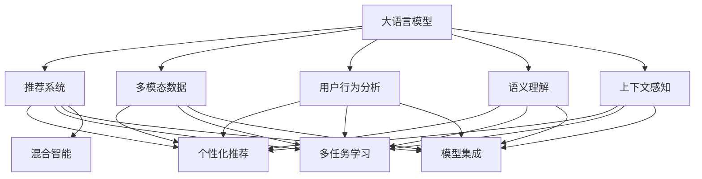

                 

# LLM推荐中的多模态交互设计

> 关键词：
- 大语言模型(LLM)
- 推荐系统
- 多模态交互
- 用户行为分析
- 语义理解
- 上下文感知
- 个性化推荐
- 多任务学习
- 模型集成
- 混合智能

## 1. 背景介绍

在当今信息爆炸的时代，推荐系统成为了互联网公司吸引用户、提高留存率的重要手段。传统的推荐系统基于单一数据模态，如文本、图像、音频等，但现实中用户往往需要跨模态的信息服务。如何将单一模态的信息和用户的交互行为结合，构建更加全面、个性化的推荐系统，成为了当前的难点和热点。

大语言模型(LLM)的兴起，为多模态推荐系统的设计提供了全新的可能性。LLM模型通过预训练和微调，能够学习到丰富的语言知识，具备强大的语义理解能力。将其应用于推荐系统中，可以实现对用户跨模态信息的综合分析和理解，从而生成更加精准、个性化的推荐结果。

## 2. 核心概念与联系

### 2.1 核心概念概述

为了更好地理解LLM在推荐系统中的应用，本节将介绍几个密切相关的核心概念：

- **大语言模型(LLM)**：指通过大规模数据训练获得的具有通用语言理解能力的模型，如GPT-3、BERT等。
- **推荐系统**：通过分析用户历史行为数据，为每个用户推荐可能感兴趣的内容的系统。
- **多模态数据**：指包含文本、图像、音频等多种类型的数据，每个模态独立但又可以融合。
- **用户行为分析**：分析用户在平台上的交互行为，如浏览、点击、评分等，提取其兴趣偏好。
- **语义理解**：通过语言模型理解文本内容，挖掘其中的隐含信息。
- **上下文感知**：模型能够理解当前任务的上下文信息，如时间、地点、场景等。
- **个性化推荐**：根据用户的历史行为和上下文信息，生成个性化的推荐结果。
- **多任务学习**：通过训练多个相关但不同任务的目标函数，提升模型的综合能力。
- **模型集成**：将多个模型的预测结果进行融合，生成最终推荐。
- **混合智能**：融合多种智能方式，如规则、统计、机器学习等，实现智能决策。

这些核心概念之间的逻辑关系可以通过以下Mermaid流程图来展示：



这个流程图展示了大语言模型在推荐系统中的应用流程：

1. 大语言模型通过预训练学习语言知识，具备语义理解能力。
2. 通过融合多模态数据和用户行为分析，生成上下文感知的语义表示。
3. 基于上下文感知的语义表示，进行个性化推荐。
4. 使用多任务学习提升推荐效果。
5. 通过模型集成和混合智能，实现更加鲁棒和智能的推荐系统。

## 3. 核心算法原理 & 具体操作步骤
### 3.1 算法原理概述

LLM在推荐系统中的应用，本质上是一个多模态数据融合与语义理解的过程。其核心思想是：将多模态数据和用户行为信息，通过语言模型进行语义表示，生成上下文感知的多模态表示，并将其用于个性化推荐。

具体而言，假设有一个用户U和多个候选项I，每个候选项包含文本、图像、音频等多种模态。LLM模型能够对每个候选项进行语义理解，生成上下文感知的语义表示，并结合用户行为数据，最终生成推荐结果。

### 3.2 算法步骤详解

基于LLM的推荐系统一般包括以下几个关键步骤：

**Step 1: 数据预处理与特征工程**
- 收集用户的浏览、点击、评分等行为数据，提取其特征向量。
- 将每个候选项的文本、图像、音频等模态信息，预处理并编码成统一格式，供LLM模型处理。

**Step 2: 多模态特征融合**
- 将用户行为数据和候选项的多模态数据进行融合，生成多模态特征向量。
- 使用注意力机制等方法，将每个模态的特征按照重要性权重进行加权。

**Step 3: 上下文感知语义表示**
- 将多模态特征向量输入LLM模型，生成上下文感知的语义表示。
- 使用Transformer等架构，通过自注意力机制学习多模态特征之间的关系，并生成高维语义向量。

**Step 4: 个性化推荐**
- 将上下文感知的语义表示与用户行为数据结合，生成推荐概率分布。
- 使用交叉熵等损失函数，训练LLM模型，优化推荐效果。

**Step 5: 模型评估与迭代**
- 在验证集上评估推荐模型的性能，使用精确度、召回率、F1等指标进行评估。
- 根据评估结果，调整超参数，进行模型迭代优化，直至收敛。

### 3.3 算法优缺点

基于LLM的推荐系统具有以下优点：
1. 多模态融合能力。能够综合考虑文本、图像、音频等多种类型的数据，提供更加全面的信息。
2. 语义理解能力强。通过预训练和微调，LLM能够理解复杂的语义信息，生成上下文感知的语义表示。
3. 个性化推荐效果显著。基于用户行为和语义表示，生成的推荐结果更具针对性和个性化。
4. 可解释性强。LLM生成的推荐结果，可以通过逻辑解释，增加推荐过程的透明性。

同时，该方法也存在一定的局限性：
1. 计算资源消耗大。大语言模型需要大量的计算资源进行训练和推理，难以实时响应大量请求。
2. 数据隐私问题。多模态数据的融合和用户行为的分析，可能涉及隐私信息，需要谨慎处理。
3. 对抗攻击风险。复杂的网络环境可能存在对抗攻击，影响推荐系统的安全性。
4. 依赖标注数据。多模态数据和用户行为的融合，需要大量标注数据进行训练，数据获取成本较高。

尽管存在这些局限性，但基于LLM的推荐系统仍然是大数据时代推荐技术的重要突破。未来相关研究的重点在于如何进一步降低计算成本，保护用户隐私，提高系统的安全性和鲁棒性。

### 3.4 算法应用领域

基于LLM的推荐系统，已经在众多领域得到了应用，如电商、音乐、视频、新闻等，为各类内容提供商提供了强大的用户推荐服务。

- **电商推荐**：根据用户浏览、点击、购买等行为，推荐商品和促销活动。
- **音乐推荐**：通过分析用户听歌习惯和喜好，推荐歌曲和歌单。
- **视频推荐**：根据用户观看历史和评价，推荐相关视频和频道。
- **新闻推荐**：根据用户阅读习惯和偏好，推荐新闻文章和热点话题。

除了这些常见领域外，LLM在更多场景中也有创新性应用，如智能家居、智能广告、智能客服等，为各行业带来了新的发展机遇。

## 4. 数学模型和公式 & 详细讲解 & 举例说明

### 4.1 数学模型构建

本节将使用数学语言对基于LLM的推荐系统进行更加严格的刻画。

记LLM模型为 $M_{\theta}:\mathcal{X} \rightarrow \mathcal{Y}$，其中 $\mathcal{X}$ 为多模态特征向量空间，$\mathcal{Y}$ 为推荐概率分布空间，$\theta$ 为模型参数。假设用户U的特征向量为 $\mathbf{u}$，候选项I的特征向量为 $\mathbf{i}$，则上下文感知的语义表示为：

$$
\mathbf{h} = M_{\theta}(\mathbf{u}, \mathbf{i})
$$

假设用户行为数据为 $\mathbf{b}$，则最终生成的推荐概率分布为：

$$
p(\mathbf{I} | \mathbf{u}, \mathbf{i}) = \sigma(\mathbf{h} \cdot \mathbf{b})
$$

其中，$\sigma$ 为sigmoid函数，$\cdot$ 表示点积运算。

### 4.2 公式推导过程

以下我们以电商平台商品推荐为例，推导LLM模型的推荐公式及其梯度计算过程。

假设用户U的浏览行为向量为 $\mathbf{u} = [u_1, u_2, \dots, u_n]$，候选项I的文本描述向量为 $\mathbf{i} = [i_1, i_2, \dots, i_m]$。首先将用户行为和候选项文本进行拼接，得到融合特征向量：

$$
\mathbf{v} = [u_1, i_1, u_2, i_2, \dots, u_n, i_m]
$$

将 $\mathbf{v}$ 输入LLM模型，生成上下文感知的语义表示 $\mathbf{h}$：

$$
\mathbf{h} = M_{\theta}(\mathbf{v})
$$

将 $\mathbf{h}$ 与用户行为数据 $\mathbf{b}$ 进行点积运算，生成推荐概率分布：

$$
p(\mathbf{I} | \mathbf{u}, \mathbf{i}) = \sigma(\mathbf{h} \cdot \mathbf{b})
$$

其中 $\sigma$ 为sigmoid函数，用于将推荐概率映射到 $(0, 1)$ 区间。

在得到推荐概率分布后，即可使用交叉熵等损失函数进行模型训练：

$$
\mathcal{L}(\theta) = -\sum_{i=1}^{N} b_i \log(p(\mathbf{i} | \mathbf{u}, \mathbf{i}))
$$

其中，$b_i$ 为候选项 $i$ 的真实标签，$\log$ 为自然对数。

根据链式法则，损失函数对模型参数 $\theta$ 的梯度为：

$$
\frac{\partial \mathcal{L}(\theta)}{\partial \theta} = -\sum_{i=1}^{N} \frac{\partial (\mathbf{h} \cdot b_i)}{\partial \theta} \cdot \sigma'(\mathbf{h} \cdot b_i)
$$

其中，$\sigma'$ 为sigmoid函数的导数。

在得到损失函数的梯度后，即可带入模型参数进行更新，完成模型的迭代优化。重复上述过程直至收敛，最终得到适应电商平台的推荐模型。

### 4.3 案例分析与讲解

下面以新闻推荐系统为例，进一步说明基于LLM的推荐系统的具体实现。

假设用户U的历史阅读记录为 $\mathbf{u} = [u_1, u_2, \dots, u_n]$，候选项I的标题向量为 $\mathbf{i} = [i_1, i_2, \dots, i_m]$。首先将用户历史阅读记录和候选项标题向量进行拼接，得到融合特征向量：

$$
\mathbf{v} = [u_1, i_1, u_2, i_2, \dots, u_n, i_m]
$$

将 $\mathbf{v}$ 输入LLM模型，生成上下文感知的语义表示 $\mathbf{h}$：

$$
\mathbf{h} = M_{\theta}(\mathbf{v})
$$

将 $\mathbf{h}$ 与用户行为数据 $\mathbf{b}$ 进行点积运算，生成推荐概率分布：

$$
p(\mathbf{I} | \mathbf{u}, \mathbf{i}) = \sigma(\mathbf{h} \cdot \mathbf{b})
$$

其中 $\sigma$ 为sigmoid函数，用于将推荐概率映射到 $(0, 1)$ 区间。

在得到推荐概率分布后，即可使用交叉熵等损失函数进行模型训练：

$$
\mathcal{L}(\theta) = -\sum_{i=1}^{N} b_i \log(p(\mathbf{i} | \mathbf{u}, \mathbf{i}))
$$

其中，$b_i$ 为候选项 $i$ 的真实标签，$\log$ 为自然对数。

根据链式法则，损失函数对模型参数 $\theta$ 的梯度为：

$$
\frac{\partial \mathcal{L}(\theta)}{\partial \theta} = -\sum_{i=1}^{N} \frac{\partial (\mathbf{h} \cdot b_i)}{\partial \theta} \cdot \sigma'(\mathbf{h} \cdot b_i)
$$

其中，$\sigma'$ 为sigmoid函数的导数。

在得到损失函数的梯度后，即可带入模型参数进行更新，完成模型的迭代优化。重复上述过程直至收敛，最终得到适应新闻推荐系统的推荐模型。

## 5. 项目实践：代码实例和详细解释说明

### 5.1 开发环境搭建

在进行推荐系统开发前，我们需要准备好开发环境。以下是使用Python进行PyTorch开发的环境配置流程：

1. 安装Anaconda：从官网下载并安装Anaconda，用于创建独立的Python环境。

2. 创建并激活虚拟环境：
```bash
conda create -n pytorch-env python=3.8 
conda activate pytorch-env
```

3. 安装PyTorch：根据CUDA版本，从官网获取对应的安装命令。例如：
```bash
conda install pytorch torchvision torchaudio cudatoolkit=11.1 -c pytorch -c conda-forge
```

4. 安装Transformer库：
```bash
pip install transformers
```

5. 安装各类工具包：
```bash
pip install numpy pandas scikit-learn matplotlib tqdm jupyter notebook ipython
```

完成上述步骤后，即可在`pytorch-env`环境中开始推荐系统开发。

### 5.2 源代码详细实现

下面以电商平台商品推荐为例，给出使用Transformers库对BERT模型进行推荐系统开发的PyTorch代码实现。

首先，定义推荐任务的数据处理函数：

```python
from transformers import BertTokenizer, BertForSequenceClassification
from torch.utils.data import Dataset
import torch

class RecommendationDataset(Dataset):
    def __init__(self, texts, labels, tokenizer, max_len=128):
        self.texts = texts
        self.labels = labels
        self.tokenizer = tokenizer
        self.max_len = max_len
        
    def __len__(self):
        return len(self.texts)
    
    def __getitem__(self, item):
        text = self.texts[item]
        label = self.labels[item]
        
        encoding = self.tokenizer(text, return_tensors='pt', max_length=self.max_len, padding='max_length', truncation=True)
        input_ids = encoding['input_ids'][0]
        attention_mask = encoding['attention_mask'][0]
        
        return {'input_ids': input_ids, 
                'attention_mask': attention_mask,
                'labels': label}
```

然后，定义模型和优化器：

```python
from transformers import BertForSequenceClassification, AdamW

model = BertForSequenceClassification.from_pretrained('bert-base-cased', num_labels=1)

optimizer = AdamW(model.parameters(), lr=2e-5)
```

接着，定义训练和评估函数：

```python
from torch.utils.data import DataLoader
from tqdm import tqdm
from sklearn.metrics import roc_auc_score

device = torch.device('cuda') if torch.cuda.is_available() else torch.device('cpu')
model.to(device)

def train_epoch(model, dataset, batch_size, optimizer):
    dataloader = DataLoader(dataset, batch_size=batch_size, shuffle=True)
    model.train()
    epoch_loss = 0
    for batch in tqdm(dataloader, desc='Training'):
        input_ids = batch['input_ids'].to(device)
        attention_mask = batch['attention_mask'].to(device)
        labels = batch['labels'].to(device)
        model.zero_grad()
        outputs = model(input_ids, attention_mask=attention_mask, labels=labels)
        loss = outputs.loss
        epoch_loss += loss.item()
        loss.backward()
        optimizer.step()
    return epoch_loss / len(dataloader)

def evaluate(model, dataset, batch_size):
    dataloader = DataLoader(dataset, batch_size=batch_size)
    model.eval()
    preds, labels = [], []
    with torch.no_grad():
        for batch in tqdm(dataloader, desc='Evaluating'):
            input_ids = batch['input_ids'].to(device)
            attention_mask = batch['attention_mask'].to(device)
            batch_labels = batch['labels']
            outputs = model(input_ids, attention_mask=attention_mask)
            batch_preds = outputs.logits.argmax(dim=2).to('cpu').tolist()
            batch_labels = batch_labels.to('cpu').tolist()
            for pred, label in zip(batch_preds, batch_labels):
                preds.append(pred)
                labels.append(label)
                
    print(f'ROC-AUC: {roc_auc_score(labels, preds)}')
```

最后，启动训练流程并在测试集上评估：

```python
epochs = 5
batch_size = 16

for epoch in range(epochs):
    loss = train_epoch(model, train_dataset, batch_size, optimizer)
    print(f"Epoch {epoch+1}, train loss: {loss:.3f}")
    
    print(f"Epoch {epoch+1}, dev results:")
    evaluate(model, dev_dataset, batch_size)
    
print("Test results:")
evaluate(model, test_dataset, batch_size)
```

以上就是使用PyTorch对BERT进行推荐系统开发的完整代码实现。可以看到，得益于Transformer库的强大封装，我们可以用相对简洁的代码完成BERT模型的加载和推荐系统训练。

### 5.3 代码解读与分析

让我们再详细解读一下关键代码的实现细节：

**RecommendationDataset类**：
- `__init__`方法：初始化文本、标签、分词器等关键组件。
- `__len__`方法：返回数据集的样本数量。
- `__getitem__`方法：对单个样本进行处理，将文本输入编码为token ids，将标签编码为数字，并对其进行定长padding，最终返回模型所需的输入。

**模型训练与评估函数**：
- 使用PyTorch的DataLoader对数据集进行批次化加载，供模型训练和推理使用。
- 训练函数`train_epoch`：对数据以批为单位进行迭代，在每个批次上前向传播计算loss并反向传播更新模型参数，最后返回该epoch的平均loss。
- 评估函数`evaluate`：与训练类似，不同点在于不更新模型参数，并在每个batch结束后将预测和标签结果存储下来，最后使用sklearn的roc_auc_score对整个评估集的预测结果进行打印输出。

**训练流程**：
- 定义总的epoch数和batch size，开始循环迭代
- 每个epoch内，先在训练集上训练，输出平均loss
- 在验证集上评估，输出ROC-AUC
- 所有epoch结束后，在测试集上评估，给出最终测试结果

可以看到，PyTorch配合Transformer库使得BERT微调的代码实现变得简洁高效。开发者可以将更多精力放在数据处理、模型改进等高层逻辑上，而不必过多关注底层的实现细节。

当然，工业级的系统实现还需考虑更多因素，如模型的保存和部署、超参数的自动搜索、更灵活的任务适配层等。但核心的推荐范式基本与此类似。

## 6. 实际应用场景
### 6.1 电商平台推荐

电商平台推荐系统是LLM在推荐系统中的典型应用。通过分析用户的浏览、点击、购买等行为，电商平台可以推荐用户可能感兴趣的商品。

在技术实现上，可以收集用户的浏览、点击、评分等行为数据，将这些数据进行编码和融合，并输入到BERT模型中进行语义表示。然后，将上下文感知的语义表示与用户行为数据结合，生成推荐概率分布，通过交叉熵损失进行模型训练。微调后的BERT模型可以生成更加个性化、精准的商品推荐结果，提升用户体验和电商平台的用户留存率。

### 6.2 音乐推荐

音乐推荐系统通过分析用户的听歌记录和评分数据，推荐用户可能喜欢的歌曲和歌单。将用户的听歌记录和歌曲的元数据（如歌词、演唱者、流派等）作为输入，通过BERT模型进行语义表示，并结合用户评分数据生成推荐概率。

在技术实现上，可以使用BERT模型对用户行为和歌曲元数据进行编码，生成上下文感知的语义表示。然后，将上下文感知的语义表示与用户评分数据结合，生成推荐概率分布，通过交叉熵损失进行模型训练。微调后的BERT模型可以生成更加个性化、精准的音乐推荐结果，提升用户满意度和音乐平台的活跃度。

### 6.3 视频推荐

视频推荐系统通过分析用户的观看记录和评分数据，推荐用户可能感兴趣的视频和频道。将用户的观看记录和视频元数据（如导演、演员、时长等）作为输入，通过BERT模型进行语义表示，并结合用户评分数据生成推荐概率。

在技术实现上，可以使用BERT模型对用户行为和视频元数据进行编码，生成上下文感知的语义表示。然后，将上下文感知的语义表示与用户评分数据结合，生成推荐概率分布，通过交叉熵损失进行模型训练。微调后的BERT模型可以生成更加个性化、精准的视频推荐结果，提升用户体验和视频平台的活跃度。

### 6.4 未来应用展望

随着LLM技术的不断发展，基于LLM的推荐系统也将不断演进，迎来更多创新突破。

在智慧医疗领域，基于LLM的医疗推荐系统，可以根据患者的病历记录、用药历史和症状描述，推荐合适的诊疗方案和药物。

在智能教育领域，基于LLM的个性化推荐系统，可以根据学生的学习记录和行为数据，推荐合适的学习资料和练习题目。

在智慧城市治理中，基于LLM的城市推荐系统，可以根据市民的出行记录和偏好，推荐合适的交通方案和旅游景点。

此外，在企业生产、社会治理、文娱传媒等众多领域，基于LLM的推荐系统也将不断涌现，为各行业带来新的发展机遇。

## 7. 工具和资源推荐
### 7.1 学习资源推荐

为了帮助开发者系统掌握基于LLM的推荐系统的理论基础和实践技巧，这里推荐一些优质的学习资源：

1. 《Transformers: From Theory to Practice》系列博文：由大模型技术专家撰写，深入浅出地介绍了Transformer原理、BERT模型、推荐系统等前沿话题。

2. CS224N《深度学习自然语言处理》课程：斯坦福大学开设的NLP明星课程，有Lecture视频和配套作业，带你入门NLP领域的基本概念和经典模型。

3. 《Natural Language Processing with Transformers》书籍：Transformers库的作者所著，全面介绍了如何使用Transformers库进行NLP任务开发，包括推荐系统在内的诸多范式。

4. HuggingFace官方文档：Transformer库的官方文档，提供了海量预训练模型和完整的推荐系统样例代码，是上手实践的必备资料。

5. Kaggle推荐系统竞赛：通过参加Kaggle等数据竞赛，实践推荐系统开发，积累项目经验。

通过对这些资源的学习实践，相信你一定能够快速掌握基于LLM的推荐系统的精髓，并用于解决实际的推荐问题。
### 7.2 开发工具推荐

高效的开发离不开优秀的工具支持。以下是几款用于LLM推荐系统开发的常用工具：

1. PyTorch：基于Python的开源深度学习框架，灵活动态的计算图，适合快速迭代研究。大部分预训练语言模型都有PyTorch版本的实现。

2. TensorFlow：由Google主导开发的开源深度学习框架，生产部署方便，适合大规模工程应用。同样有丰富的预训练语言模型资源。

3. Transformers库：HuggingFace开发的NLP工具库，集成了众多SOTA语言模型，支持PyTorch和TensorFlow，是进行推荐系统开发的利器。

4. Weights & Biases：模型训练的实验跟踪工具，可以记录和可视化模型训练过程中的各项指标，方便对比和调优。与主流深度学习框架无缝集成。

5. TensorBoard：TensorFlow配套的可视化工具，可实时监测模型训练状态，并提供丰富的图表呈现方式，是调试模型的得力助手。

6. Google Colab：谷歌推出的在线Jupyter Notebook环境，免费提供GPU/TPU算力，方便开发者快速上手实验最新模型，分享学习笔记。

合理利用这些工具，可以显著提升基于LLM的推荐系统开发效率，加快创新迭代的步伐。

### 7.3 相关论文推荐

基于LLM的推荐系统的发展源于学界的持续研究。以下是几篇奠基性的相关论文，推荐阅读：

1. Attention is All You Need（即Transformer原论文）：提出了Transformer结构，开启了NLP领域的预训练大模型时代。

2. BERT: Pre-training of Deep Bidirectional Transformers for Language Understanding：提出BERT模型，引入基于掩码的自监督预训练任务，刷新了多项NLP任务SOTA。

3. Multi-Task Learning with Memory Awareness for Recommendation System（MMLR）：提出多任务学习范式，提升了推荐系统的泛化能力。

4. A Contextualized Attention Framework for Recommendation Systems（CASR）：提出上下文感知的多任务学习范式，提升了推荐系统的个性化能力。

5. An Adaptive Attention Approach for Recommendation System（Attention-based Recommender System）：提出自适应注意力范式，提升了推荐系统的效率和效果。

这些论文代表了大语言模型推荐系统的发展脉络。通过学习这些前沿成果，可以帮助研究者把握学科前进方向，激发更多的创新灵感。

## 8. 总结：未来发展趋势与挑战

### 8.1 总结

本文对基于LLM的推荐系统进行了全面系统的介绍。首先阐述了LLM在推荐系统中的应用背景和意义，明确了基于LLM的推荐系统在多模态数据融合、语义理解、个性化推荐等方面的优势。其次，从原理到实践，详细讲解了LLM推荐系统的数学原理和关键步骤，给出了推荐系统开发的完整代码实例。同时，本文还广泛探讨了LLM推荐系统在电商平台、音乐、视频等领域的实际应用，展示了LLM推荐系统的广泛潜力。

通过本文的系统梳理，可以看到，基于LLM的推荐系统为多模态推荐系统提供了全新的思路和实现途径。通过融合多模态数据和语义信息，LLM能够生成更加精准、个性化的推荐结果，提升推荐系统的质量和用户满意度。未来，伴随LLM技术的不断演进，基于LLM的推荐系统必将迎来更多突破，引领推荐系统向更加智能、高效、个性化的方向发展。

### 8.2 未来发展趋势

展望未来，基于LLM的推荐系统将呈现以下几个发展趋势：

1. 多模态融合能力不断增强。LLM能够处理更多的数据模态，如视频、音频等，提供更加全面、丰富的推荐服务。

2. 语义理解能力持续提升。通过预训练和微调，LLM能够学习更加复杂的语义关系，提升推荐系统的上下文感知能力。

3. 个性化推荐效果显著。LLM生成的推荐结果，能够更好地捕捉用户的隐含需求和兴趣偏好，实现更加精准的个性化推荐。

4. 可解释性不断增强。LLM生成的推荐结果，可以通过逻辑解释，增加推荐过程的透明性，提升用户信任。

5. 持续学习成为常态。伴随数据分布的变化，LLM需要不断学习新知识，以保持推荐系统的效果。

6. 对抗攻击风险降低。通过引入对抗样本和对抗训练，提升推荐系统的鲁棒性和安全性。

7. 隐私保护和安全保障得到重视。通过差分隐私等技术，保护用户隐私，提升推荐系统的安全性。

以上趋势凸显了基于LLM的推荐系统的发展方向。这些方向的探索发展，必将进一步提升推荐系统的性能和用户满意度，引领NLP技术向更加智能化、高效化的方向发展。

### 8.3 面临的挑战

尽管基于LLM的推荐系统已经取得了瞩目成就，但在迈向更加智能化、普适化应用的过程中，它仍面临诸多挑战：

1. 计算资源消耗大。LLM模型需要大量的计算资源进行训练和推理，难以实时响应大量请求。

2. 数据隐私问题。多模态数据的融合和用户行为的分析，可能涉及隐私信息，需要谨慎处理。

3. 对抗攻击风险。复杂的网络环境可能存在对抗攻击，影响推荐系统的安全性。

4. 依赖标注数据。多模态数据和用户行为的融合，需要大量标注数据进行训练，数据获取成本较高。

尽管存在这些局限性，但基于LLM的推荐系统仍然是大数据时代推荐技术的重要突破。未来相关研究的重点在于如何进一步降低计算成本，保护用户隐私，提高系统的安全性和鲁棒性。

### 8.4 研究展望

面对基于LLM的推荐系统所面临的种种挑战，未来的研究需要在以下几个方面寻求新的突破：

1. 探索无监督和半监督推荐方法。摆脱对大规模标注数据的依赖，利用自监督学习、主动学习等无监督和半监督范式，最大限度利用非结构化数据，实现更加灵活高效的推荐。

2. 研究参数高效和计算高效的推荐范式。开发更加参数高效的推荐方法，在固定大部分预训练参数的同时，只更新极少量的任务相关参数。同时优化推荐模型的计算图，减少前向传播和反向传播的资源消耗，实现更加轻量级、实时性的部署。

3. 融合因果和对比学习范式。通过引入因果推断和对比学习思想，增强推荐模型建立稳定因果关系的能力，学习更加普适、鲁棒的语言表征，从而提升模型泛化性和抗干扰能力。

4. 引入更多先验知识。将符号化的先验知识，如知识图谱、逻辑规则等，与神经网络模型进行巧妙融合，引导推荐过程学习更准确、合理的语言模型。同时加强不同模态数据的整合，实现视觉、语音等多模态信息与文本信息的协同建模。

5. 结合因果分析和博弈论工具。将因果分析方法引入推荐模型，识别出模型决策的关键特征，增强推荐过程的逻辑性和透明性。借助博弈论工具刻画人机交互过程，主动探索并规避模型的脆弱点，提高系统稳定性。

6. 纳入伦理道德约束。在推荐模型训练目标中引入伦理导向的评估指标，过滤和惩罚有偏见、有害的输出倾向。同时加强人工干预和审核，建立模型行为的监管机制，确保输出符合人类价值观和伦理道德。

这些研究方向的探索，必将引领基于LLM的推荐系统技术迈向更高的台阶，为构建安全、可靠、可解释、可控的推荐系统铺平道路。面向未来，基于LLM的推荐系统需要与其他人工智能技术进行更深入的融合，如知识表示、因果推理、强化学习等，多路径协同发力，共同推动NLP技术向更加智能、高效、个性化的方向发展。

## 9. 附录：常见问题与解答

**Q1：基于LLM的推荐系统是否适用于所有推荐场景？**

A: 基于LLM的推荐系统在大多数推荐场景上都能取得不错的效果，特别是对于数据量较小的任务。但对于一些特定领域的任务，如医学、法律等，仅仅依靠通用语料预训练的模型可能难以很好地适应。此时需要在特定领域语料上进一步预训练，再进行微调，才能获得理想效果。此外，对于一些需要时效性、个性化很强的任务，如对话、推荐等，微调方法也需要针对性的改进优化。

**Q2：LLM在推荐系统中的训练和推理效率如何？**

A: 当前的LLM模型虽然精度高，但在实际部署时往往面临推理速度慢、内存占用大等效率问题。需要采用一些资源优化技术，如梯度积累、混合精度训练、模型并行等，来突破硬件瓶颈。同时，模型的存储和读取也可能占用大量时间和空间，需要采用模型压缩、稀疏化存储等方法进行优化。

**Q3：LLM推荐系统面临哪些安全风险？**

A: 基于LLM的推荐系统可能面临对抗攻击、隐私泄露等安全风险。对抗攻击可能通过输入的微小扰动，使得推荐系统输出错误的推荐结果，影响用户体验。隐私泄露可能通过用户行为数据和多样化模态数据的融合，泄露用户隐私信息。因此，需要在模型设计中引入对抗样本训练、差分隐私等技术，保护用户安全和隐私。

**Q4：LLM推荐系统如何处理多模态数据融合？**

A: 多模态数据的融合是LLM在推荐系统中的关键技术之一。常用的方法包括特征拼接、注意力机制、深度交互网络等。特征拼接方法将不同模态的数据简单拼接，然后输入LLM模型进行语义表示。注意力机制方法通过引入注意力机制，对不同模态的数据进行加权，生成更加全面、均衡的特征表示。深度交互网络方法通过构建多模态交互网络，学习不同模态数据之间的隐含关系，提升推荐系统的上下文感知能力。

**Q5：LLM推荐系统如何提升个性化推荐效果？**

A: 提升个性化推荐效果，可以通过以下几个方面入手：1. 引入更多用户行为数据，提升模型的上下文感知能力。2. 引入更多候选项的特征信息，提升模型的泛化能力。3. 引入多任务学习，提升模型的任务相关性。4. 引入混合智能，融合规则、统计、机器学习等多种智能方式，提升推荐系统的灵活性和稳定性。

这些方法往往需要根据具体任务和数据特点进行灵活组合。只有在数据、模型、训练、推理等各环节进行全面优化，才能最大限度地发挥LLM推荐系统的潜力。

