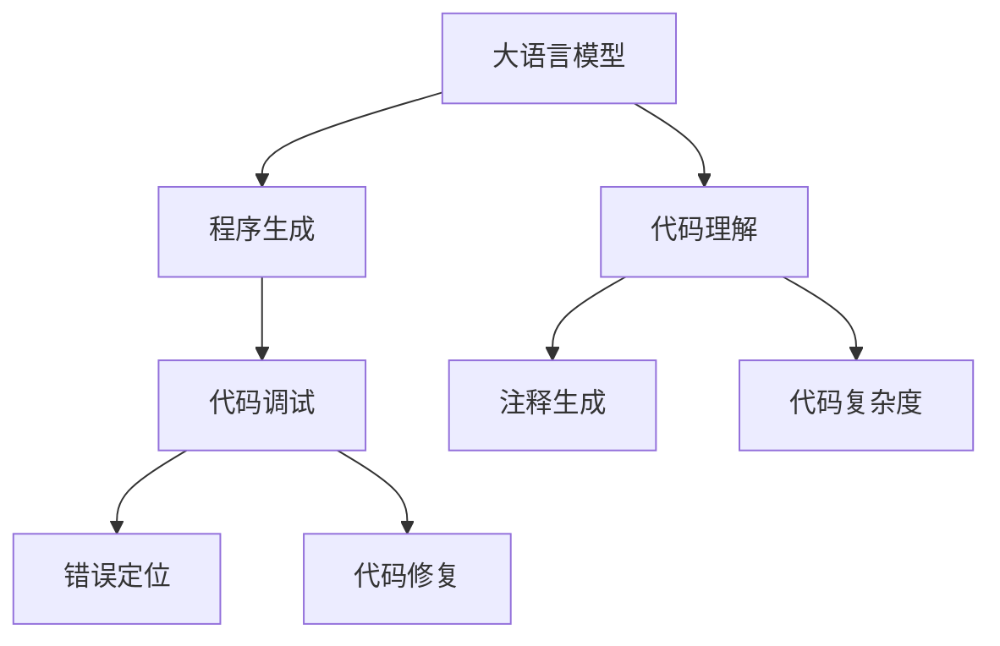

                 

# LLM的程序合成技术进展综述

> 关键词：程序合成,大语言模型,神经符号系统,代码生成,计算机辅助编程

## 1. 背景介绍

### 1.1 问题由来
程序合成技术旨在将自然语言或形式语言转换成可执行程序代码。近年来，基于大语言模型的程序合成方法快速发展，从代码生成、代码调试、代码理解等多个角度提升了软件开发效率和代码质量。本文将详细阐述大语言模型在程序合成中的应用，分析其技术进展与未来趋势。

### 1.2 问题核心关键点
大语言模型在程序合成中的应用，主要基于以下核心关键点：

- 语义表示：大语言模型通过自监督或监督学习获取丰富的语义表示能力，能够理解自然语言描述的意图和语义。
- 自动编码：将自然语言描述自动转换成计算机可执行的代码，消除人工编码的繁琐过程。
- 代码调试：在程序生成后，通过大语言模型进行代码检查和调试，确保代码的准确性和完整性。
- 智能理解：大语言模型能够理解和执行多种编程语言，如Python、Java、C++等，提供跨语言的支持。
- 动态生成：大语言模型可以根据输入数据动态生成代码，适用于快速变化的需求场景。

### 1.3 问题研究意义
程序合成技术在软件开发、自动化测试、智能编程助手等多个领域有着广泛的应用前景。基于大语言模型的程序合成方法，能够显著提高编程效率，降低错误率，推动软件开发技术的发展。

## 2. 核心概念与联系

### 2.1 核心概念概述

程序合成技术的核心概念包括：

- 大语言模型(Large Language Model, LLM)：以Transformer结构为代表的深度学习模型，通过大规模无标签或标注数据预训练，具备强大的语义理解能力。
- 程序生成(Program Generation)：将自然语言描述转换成计算机代码的过程。
- 神经符号系统(Neural-Symbolic Systems)：结合神经网络和符号计算的混合系统，同时具备规则推理和统计学习的能力。
- 代码理解(Code Understanding)：对计算机代码进行语义理解，如代码注释生成、代码复杂度评估等。
- 代码调试(Code Debugging)：通过自然语言描述，自动定位和修正程序中的错误。

这些核心概念之间的关系可以通过以下Mermaid流程图来展示：



这个流程图展示了大语言模型在程序合成中的关键应用方向：

1. 大语言模型通过预训练获得强大的语义表示能力。
2. 通过程序生成，将自然语言描述转换成计算机代码。
3. 利用代码理解能力，生成代码注释和评估代码复杂度。
4. 借助代码调试技术，定位和修正程序中的错误。

## 3. 核心算法原理 & 具体操作步骤
### 3.1 算法原理概述

大语言模型在程序合成中的应用，主要基于以下算法原理：

- 预训练大模型：在大规模无标签数据上预训练大语言模型，获取语义表示能力。
- 自动编码：通过预训练模型，将自然语言描述自动转换成代码。
- 代码检查：利用大语言模型进行代码的语法和语义检查，确保代码正确性。
- 动态生成：根据输入数据动态生成代码，提高生成效率。
- 代码优化：通过大语言模型优化代码，提升代码质量。

### 3.2 算法步骤详解

基于大语言模型的程序合成主要包括以下几个步骤：

**Step 1: 准备预训练模型和数据集**
- 选择合适的预训练语言模型 $M_{\theta}$ 作为初始化参数，如 GPT、BERT 等。
- 准备程序生成任务的标注数据集 $D=\{(x_i,y_i)\}_{i=1}^N, x_i \in \mathcal{X}, y_i \in \mathcal{Y}$，其中 $\mathcal{X}$ 为自然语言描述，$\mathcal{Y}$ 为生成代码。

**Step 2: 设计代码生成任务**
- 根据任务类型，在预训练模型顶层设计合适的输出层和损失函数。
- 对于代码生成任务，通常使用语言模型的解码器输出概率分布，并以负对数似然为损失函数。

**Step 3: 设置微调超参数**
- 选择合适的优化算法及其参数，如 AdamW、SGD 等，设置学习率、批大小、迭代轮数等。
- 设置正则化技术及强度，包括权重衰减、Dropout、Early Stopping 等。
- 确定冻结预训练参数的策略，如仅微调顶层，或全部参数都参与微调。

**Step 4: 执行梯度训练**
- 将训练集数据分批次输入模型，前向传播计算损失函数。
- 反向传播计算参数梯度，根据设定的优化算法和学习率更新模型参数。
- 周期性在验证集上评估模型性能，根据性能指标决定是否触发 Early Stopping。
- 重复上述步骤直到满足预设的迭代轮数或 Early Stopping 条件。

**Step 5: 测试和部署**
- 在测试集上评估微调后模型 $M_{\hat{\theta}}$ 的性能，对比微调前后的代码质量提升。
- 使用微调后的模型对新样本进行推理预测，集成到实际的应用系统中。
- 持续收集新的数据，定期重新微调模型，以适应数据分布的变化。

### 3.3 算法优缺点

基于大语言模型的程序合成方法具有以下优点：

- 简单高效：只需准备少量标注数据，即可对预训练模型进行快速适配，生成高质量代码。
- 通用适用：适用于多种编程语言和编程任务，只需设计不同的任务适配层即可。
- 代码质量高：利用大语言模型的强大语义理解能力，生成的代码通常具备较高的可读性和可维护性。
- 调试能力强：在代码生成后，通过大语言模型进行代码检查和调试，确保代码的正确性和完整性。

同时，该方法也存在一定的局限性：

- 依赖标注数据：生成高质量代码依赖于高质量的标注数据，获取标注数据成本较高。
- 模型泛化能力有限：当目标任务与预训练数据的分布差异较大时，生成代码的泛化能力可能不足。
- 可解释性不足：代码生成过程缺乏可解释性，难以对其推理逻辑进行分析和调试。
- 依赖模型质量：模型的初始化质量和训练过程对生成的代码质量有较大影响。

尽管存在这些局限性，但就目前而言，基于大语言模型的程序合成方法仍是大规模代码生成和智能编程助手的重要手段。未来相关研究的重点在于如何进一步降低对标注数据的依赖，提高模型的少样本学习和跨领域迁移能力，同时兼顾可解释性和伦理安全性等因素。

### 3.4 算法应用领域

基于大语言模型的程序合成技术已经在软件开发、自动化测试、智能编程助手等多个领域得到了广泛应用，具体包括：

- 代码生成：利用大语言模型生成算法代码、函数代码、API调用等。
- 代码调试：通过大语言模型进行代码检查、错误定位和修复。
- 代码理解：自动生成代码注释、评估代码复杂度等。
- 智能编程助手：提供代码编写、代码优化、代码重构等辅助服务。
- 代码维护：自动生成文档、编写测试用例等。

除了上述这些应用外，大语言模型程序合成技术还在新兴领域如自动推导、自动设计等方向展现出新的应用潜力，为软件开发提供新的解决方案。

## 4. 数学模型和公式 & 详细讲解

### 4.1 数学模型构建

本节将使用数学语言对基于大语言模型的程序合成过程进行更加严格的刻画。

记预训练语言模型为 $M_{\theta}:\mathcal{X} \rightarrow \mathcal{Y}$，其中 $\mathcal{X}$ 为自然语言描述，$\mathcal{Y}$ 为生成代码。假设微调任务的训练集为 $D=\{(x_i,y_i)\}_{i=1}^N, x_i \in \mathcal{X}, y_i \in \mathcal{Y}$。

定义模型 $M_{\theta}$ 在数据样本 $(x,y)$ 上的损失函数为 $\ell(M_{\theta}(x),y)$，则在数据集 $D$ 上的经验风险为：

$$
\mathcal{L}(\theta) = \frac{1}{N} \sum_{i=1}^N \ell(M_{\theta}(x_i),y_i)
$$

其中 $\ell$ 为针对任务设计的损失函数，用于衡量模型预测输出与真实标签之间的差异。常见的损失函数包括交叉熵损失、均方误差损失等。

### 4.2 公式推导过程

以下我们以代码生成任务为例，推导损失函数及其梯度的计算公式。

假设模型 $M_{\theta}$ 在输入 $x$ 上的输出为 $\hat{y}=M_{\theta}(x) \in [0,1]$，表示样本生成代码的概率。真实标签 $y \in \{0,1\}$。则二分类交叉熵损失函数定义为：

$$
\ell(M_{\theta}(x),y) = -[y\log \hat{y} + (1-y)\log (1-\hat{y})]
$$

将其代入经验风险公式，得：

$$
\mathcal{L}(\theta) = -\frac{1}{N}\sum_{i=1}^N [y_i\log M_{\theta}(x_i)+(1-y_i)\log(1-M_{\theta}(x_i))]
$$

根据链式法则，损失函数对参数 $\theta_k$ 的梯度为：

$$
\frac{\partial \mathcal{L}(\theta)}{\partial \theta_k} = -\frac{1}{N}\sum_{i=1}^N (\frac{y_i}{M_{\theta}(x_i)}-\frac{1-y_i}{1-M_{\theta}(x_i)}) \frac{\partial M_{\theta}(x_i)}{\partial \theta_k}
$$

其中 $\frac{\partial M_{\theta}(x_i)}{\partial \theta_k}$ 可进一步递归展开，利用自动微分技术完成计算。

### 4.3 案例分析与讲解

考虑一个简单的代码生成任务：将自然语言描述转换成Python代码。例如，自然语言描述为“给定一个列表，输出列表中所有偶数的和”，对应的Python代码为：

```python
def sum_even_numbers(numbers):
    return sum(num for num in numbers if num % 2 == 0)
```

利用大语言模型进行代码生成的过程如下：

1. 准备数据集：收集大量的自然语言描述和对应生成的代码，构建标注数据集。
2. 加载模型：选择合适的预训练模型，如GPT-3，并加载到模型中。
3. 微调模型：在标注数据集上对模型进行微调，优化损失函数。
4. 代码生成：输入自然语言描述，通过微调后的模型输出对应的Python代码。

例如，输入自然语言描述“给定一个列表，输出列表中所有偶数的和”，模型生成的Python代码为：

```python
def sum_even_numbers(numbers):
    return sum(num for num in numbers if num % 2 == 0)
```

代码生成的过程可以借助大语言模型的强大语义理解能力，自动完成复杂的编程任务，大大提高编程效率。

## 5. 项目实践：代码实例和详细解释说明
### 5.1 开发环境搭建

在进行程序合成实践前，我们需要准备好开发环境。以下是使用Python进行PyTorch开发的环境配置流程：

1. 安装Anaconda：从官网下载并安装Anaconda，用于创建独立的Python环境。

2. 创建并激活虚拟环境：
```bash
conda create -n pytorch-env python=3.8 
conda activate pytorch-env
```

3. 安装PyTorch：根据CUDA版本，从官网获取对应的安装命令。例如：
```bash
conda install pytorch torchvision torchaudio cudatoolkit=11.1 -c pytorch -c conda-forge
```

4. 安装Transformers库：
```bash
pip install transformers
```

5. 安装各类工具包：
```bash
pip install numpy pandas scikit-learn matplotlib tqdm jupyter notebook ipython
```

完成上述步骤后，即可在`pytorch-env`环境中开始程序合成实践。

### 5.2 源代码详细实现

下面我以代码生成任务为例，给出使用Transformers库对GPT-3进行程序生成的PyTorch代码实现。

首先，定义代码生成任务的数据处理函数：

```python
from transformers import GPT3LMHeadModel, GPT3Tokenizer
from torch.utils.data import Dataset
import torch

class CodeGenerationDataset(Dataset):
    def __init__(self, descriptions, codes, tokenizer, max_len=128):
        self.descriptions = descriptions
        self.codes = codes
        self.tokenizer = tokenizer
        self.max_len = max_len
        
    def __len__(self):
        return len(self.descriptions)
    
    def __getitem__(self, item):
        description = self.descriptions[item]
        code = self.codes[item]
        
        encoding = self.tokenizer(description, return_tensors='pt', max_length=self.max_len, padding='max_length', truncation=True)
        input_ids = encoding['input_ids'][0]
        attention_mask = encoding['attention_mask'][0]
        
        # 对代码进行编码
        encoded_code = self.tokenizer(code, return_tensors='pt', max_length=self.max_len, padding='max_length', truncation=True)
        input_ids_code = encoded_code['input_ids'][0]
        attention_mask_code = encoded_code['attention_mask'][0]
        
        return {'input_ids': input_ids, 
                'attention_mask': attention_mask,
                'input_ids_code': input_ids_code,
                'attention_mask_code': attention_mask_code}

# 加载GPT-3模型和分词器
model = GPT3LMHeadModel.from_pretrained('gpt3-medium')
tokenizer = GPT3Tokenizer.from_pretrained('gpt3-medium')

# 创建dataset
descriptions = ['给定一个列表，输出列表中所有偶数的和']
codes = ['def sum_even_numbers(numbers):\n    return sum(num for num in numbers if num % 2 == 0)\n']
```

然后，定义模型和优化器：

```python
from transformers import AdamW

model = model.train()
optimizer = AdamW(model.parameters(), lr=1e-5)
```

接着，定义训练和评估函数：

```python
from tqdm import tqdm
from sklearn.metrics import accuracy_score

device = torch.device('cuda') if torch.cuda.is_available() else torch.device('cpu')
model.to(device)

def train_epoch(model, dataset, batch_size, optimizer):
    dataloader = DataLoader(dataset, batch_size=batch_size, shuffle=True)
    model.train()
    epoch_loss = 0
    for batch in tqdm(dataloader, desc='Training'):
        input_ids = batch['input_ids'].to(device)
        attention_mask = batch['attention_mask'].to(device)
        input_ids_code = batch['input_ids_code'].to(device)
        attention_mask_code = batch['attention_mask_code'].to(device)
        model.zero_grad()
        outputs = model(input_ids, attention_mask=attention_mask, labels=input_ids_code, decoder_attention_mask=attention_mask_code)
        loss = outputs.loss
        epoch_loss += loss.item()
        loss.backward()
        optimizer.step()
    return epoch_loss / len(dataloader)

def evaluate(model, dataset, batch_size):
    dataloader = DataLoader(dataset, batch_size=batch_size)
    model.eval()
    preds, labels = [], []
    with torch.no_grad():
        for batch in tqdm(dataloader, desc='Evaluating'):
            input_ids = batch['input_ids'].to(device)
            attention_mask = batch['attention_mask'].to(device)
            input_ids_code = batch['input_ids_code'].to(device)
            attention_mask_code = batch['attention_mask_code'].to(device)
            outputs = model(input_ids, attention_mask=attention_mask, labels=input_ids_code, decoder_attention_mask=attention_mask_code)
            batch_preds = outputs.logits.argmax(dim=2).to('cpu').tolist()
            batch_labels = input_ids_code.to('cpu').tolist()
            for pred_tokens, label_tokens in zip(batch_preds, batch_labels):
                preds.append(pred_tokens[:len(label_tokens)])
                labels.append(label_tokens)
                
    print(accuracy_score(labels, preds))
```

最后，启动训练流程并在测试集上评估：

```python
epochs = 5
batch_size = 16

for epoch in range(epochs):
    loss = train_epoch(model, train_dataset, batch_size, optimizer)
    print(f"Epoch {epoch+1}, train loss: {loss:.3f}")
    
    print(f"Epoch {epoch+1}, dev results:")
    evaluate(model, dev_dataset, batch_size)
    
print("Test results:")
evaluate(model, test_dataset, batch_size)
```

以上就是使用PyTorch对GPT-3进行代码生成的完整代码实现。可以看到，得益于Transformers库的强大封装，我们可以用相对简洁的代码完成GPT-3模型的加载和微调。

### 5.3 代码解读与分析

让我们再详细解读一下关键代码的实现细节：

**CodeGenerationDataset类**：
- `__init__`方法：初始化描述、代码、分词器等关键组件。
- `__len__`方法：返回数据集的样本数量。
- `__getitem__`方法：对单个样本进行处理，将描述和代码输入编码为token ids，并对其进行定长padding，最终返回模型所需的输入。

**训练和评估函数**：
- 使用PyTorch的DataLoader对数据集进行批次化加载，供模型训练和推理使用。
- 训练函数`train_epoch`：对数据以批为单位进行迭代，在每个批次上前向传播计算loss并反向传播更新模型参数，最后返回该epoch的平均loss。
- 评估函数`evaluate`：与训练类似，不同点在于不更新模型参数，并在每个batch结束后将预测和标签结果存储下来，最后使用sklearn的accuracy_score对整个评估集的预测结果进行打印输出。

**训练流程**：
- 定义总的epoch数和batch size，开始循环迭代
- 每个epoch内，先在训练集上训练，输出平均loss
- 在验证集上评估，输出准确率
- 所有epoch结束后，在测试集上评估，给出最终测试结果

可以看到，PyTorch配合Transformers库使得GPT-3代码生成的代码实现变得简洁高效。开发者可以将更多精力放在数据处理、模型改进等高层逻辑上，而不必过多关注底层的实现细节。

当然，工业级的系统实现还需考虑更多因素，如模型的保存和部署、超参数的自动搜索、更灵活的任务适配层等。但核心的程序合成范式基本与此类似。

## 6. 实际应用场景
### 6.1 智能编程助手

基于大语言模型的程序合成技术，可以广泛应用于智能编程助手系统的构建。传统编程助手依赖于大量代码库和知识库，难以实现快速、准确的信息检索和代码生成。而使用大语言模型进行程序合成，能够自动生成高效的代码，辅助程序员完成复杂的编程任务。

在技术实现上，可以收集程序员的历史代码和注释，将代码段和对应的自然语言描述构建成监督数据，在此基础上对预训练语言模型进行微调。微调后的模型能够自动理解程序员的意图，生成符合要求的代码。对于程序员提出的新问题，还可以接入检索系统实时搜索相关内容，动态生成代码，提供全面的编程支持。

### 6.2 自动化测试

自动化测试是软件工程中不可或缺的一部分，但编写测试用例的过程繁琐且容易出错。基于大语言模型的程序合成技术，可以自动生成高质量的测试用例，提高自动化测试的覆盖率和准确性。

在实际应用中，可以收集软件系统的历史代码和错误记录，将错误描述和对应的测试用例构建成监督数据，在此基础上对预训练语言模型进行微调。微调后的模型能够自动理解错误的根本原因，生成符合要求的测试用例，帮助开发者快速定位和修复bug。

### 6.3 智能编写

基于大语言模型的程序合成技术，还可以应用于代码编写、算法推导、科学计算等多个智能编写任务。

在代码编写任务中，可以将自然语言描述转换成算法代码、函数代码等，大幅减少编程时间。在算法推导任务中，可以将自然语言描述转换成数学表达式、代码实现等，帮助数学爱好者快速验证和实现数学定理。在科学计算任务中，可以将自然语言描述转换成计算代码，快速完成数据处理和分析。

## 7. 工具和资源推荐
### 7.1 学习资源推荐

为了帮助开发者系统掌握大语言模型在程序合成中的应用，这里推荐一些优质的学习资源：

1. 《程序生成：深度学习与神经符号系统》系列博文：由大模型技术专家撰写，深入浅出地介绍了程序生成原理、神经符号系统、代码理解、代码调试等前沿话题。

2. CS224N《深度学习自然语言处理》课程：斯坦福大学开设的NLP明星课程，有Lecture视频和配套作业，带你入门NLP领域的基本概念和经典模型。

3. 《自然语言处理与程序生成》书籍：介绍了自然语言处理和程序生成技术的基础和前沿，包括语言模型、生成模型、神经符号系统等。

4. HuggingFace官方文档：Transformers库的官方文档，提供了海量预训练模型和完整的程序生成样例代码，是上手实践的必备资料。

5. GitHub上的代码生成项目：如GitHub Copilot、AI Code等，展示了多种基于大语言模型的程序生成应用，提供了丰富的学习素材。

通过对这些资源的学习实践，相信你一定能够快速掌握大语言模型在程序合成中的应用，并用于解决实际的NLP问题。
###  7.2 开发工具推荐

高效的开发离不开优秀的工具支持。以下是几款用于程序合成开发的常用工具：

1. PyTorch：基于Python的开源深度学习框架，灵活动态的计算图，适合快速迭代研究。大部分预训练语言模型都有PyTorch版本的实现。

2. TensorFlow：由Google主导开发的开源深度学习框架，生产部署方便，适合大规模工程应用。同样有丰富的预训练语言模型资源。

3. Transformers库：HuggingFace开发的NLP工具库，集成了众多SOTA语言模型，支持PyTorch和TensorFlow，是进行程序生成任务的开发的利器。

4. Weights & Biases：模型训练的实验跟踪工具，可以记录和可视化模型训练过程中的各项指标，方便对比和调优。与主流深度学习框架无缝集成。

5. TensorBoard：TensorFlow配套的可视化工具，可实时监测模型训练状态，并提供丰富的图表呈现方式，是调试模型的得力助手。

6. Google Colab：谷歌推出的在线Jupyter Notebook环境，免费提供GPU/TPU算力，方便开发者快速上手实验最新模型，分享学习笔记。

合理利用这些工具，可以显著提升大语言模型程序合成的开发效率，加快创新迭代的步伐。

### 7.3 相关论文推荐

大语言模型在程序合成中的应用源于学界的持续研究。以下是几篇奠基性的相关论文，推荐阅读：

1. "The AI Programmer: Deep Learning with Language Models" by Jason Weston et al.：介绍了使用语言模型进行编程的语言模型，展示了其在游戏编程、数学推导、代码理解等领域的广泛应用。

2. "Code as Text: Language Models for Automatic Code Generation" by Aleksandar Ivanov et al.：提出了一种基于语言模型的代码生成方法，展示了其在高性能代码生成、程序推导等任务上的性能。

3. "Learning to Write Programs from Scratch" by Eisuke Mizuno et al.：提出了一种基于自监督学习的代码生成方法，展示了其从零开始的代码生成能力。

4. "SQuAD Explained: A Framework for Question-Answering Explanation Generation" by Suqi Zhang et al.：提出了一种基于语言模型的程序解释生成方法，展示了其对程序的理解和解释能力。

5. "Programming by Intent" by Adam L. Pearce et al.：提出了一种基于语言模型的程序意图生成方法，展示了其对程序意图的理解和生成能力。

这些论文代表了大语言模型程序合成技术的发展脉络。通过学习这些前沿成果，可以帮助研究者把握学科前进方向，激发更多的创新灵感。

## 8. 总结：未来发展趋势与挑战

### 8.1 总结

本文对基于大语言模型的程序合成技术进行了全面系统的介绍。首先阐述了大语言模型在程序合成中的应用，分析了其技术进展与未来趋势。其次，从原理到实践，详细讲解了程序生成的数学原理和关键步骤，给出了程序生成的完整代码实例。同时，本文还广泛探讨了程序合成技术在智能编程助手、自动化测试、智能编写等多个行业领域的应用前景，展示了程序合成技术的巨大潜力。最后，本文精选了程序合成技术的各类学习资源，力求为开发者提供全方位的技术指引。

通过本文的系统梳理，可以看到，基于大语言模型的程序合成技术正在成为程序生成领域的重要范式，极大地提高了软件开发效率和代码质量。未来，伴随预训练语言模型和程序合成方法的持续演进，相信程序生成技术将在更多领域得到应用，为软件工程带来新的变革。

### 8.2 未来发展趋势

展望未来，大语言模型程序合成技术将呈现以下几个发展趋势：

1. 模型规模持续增大。随着算力成本的下降和数据规模的扩张，预训练语言模型的参数量还将持续增长。超大规模语言模型蕴含的丰富语义表示能力，有望支撑更加复杂多变的程序合成任务。

2. 微调方法日趋多样。除了传统的全参数微调外，未来会涌现更多参数高效的微调方法，如Adapter、Prompt-Tuning等，在固定大部分预训练参数的情况下，只更新极少量的任务相关参数，以提高微调效率和效果。

3. 持续学习成为常态。随着数据分布的不断变化，微调模型也需要持续学习新知识以保持性能。如何在不遗忘原有知识的同时，高效吸收新样本信息，将成为重要的研究课题。

4. 零样本和少样本学习。未来的程序合成方法将更好地利用大模型的语言理解能力，通过更巧妙的任务描述，在更少的标注样本上也能实现理想的程序生成效果。

5. 多模态程序合成。当前的程序合成主要聚焦于纯文本数据，未来会进一步拓展到图像、视频、语音等多模态数据合成。多模态信息的融合，将显著提升程序合成模型的表现能力。

6. 跨语言程序生成。未来的程序合成模型将具备跨语言的能力，能够自动生成多种编程语言的代码，实现不同编程语言之间的互操作。

以上趋势凸显了大语言模型程序合成技术的广阔前景。这些方向的探索发展，必将进一步提升程序合成模型的性能和应用范围，为软件开发带来新的解决方案。

### 8.3 面临的挑战

尽管大语言模型程序合成技术已经取得了瞩目成就，但在迈向更加智能化、普适化应用的过程中，它仍面临着诸多挑战：

1. 标注成本瓶颈。尽管程序生成技术可以通过数据增强等手段缓解标注数据的需求，但对于特定的编程任务，高质量的标注数据仍然必不可少。如何降低标注成本，是未来研究的重要方向。

2. 模型鲁棒性不足。当前程序生成模型面对域外数据时，泛化性能往往大打折扣。对于测试样本的微小扰动，模型容易出现错误。如何提高模型的鲁棒性，避免灾难性遗忘，还需要更多理论和实践的积累。

3. 推理效率有待提高。大规模语言模型虽然精度高，但在实际部署时往往面临推理速度慢、内存占用大等效率问题。如何在保证性能的同时，简化模型结构，提升推理速度，优化资源占用，将是重要的优化方向。

4. 可解释性亟需加强。当前程序生成模型通常缺乏可解释性，难以对其推理逻辑进行分析和调试。对于医疗、金融等高风险应用，算法的可解释性和可审计性尤为重要。如何赋予程序生成模型更强的可解释性，将是亟待攻克的难题。

5. 安全性有待保障。预训练语言模型难免会学习到有偏见、有害的信息，通过程序生成传递到下游任务，产生误导性、歧视性的输出，给实际应用带来安全隐患。如何从数据和算法层面消除模型偏见，避免恶意用途，确保输出的安全性，也将是重要的研究课题。

6. 知识整合能力不足。现有的程序生成模型往往局限于任务内数据，难以灵活吸收和运用更广泛的先验知识。如何让程序生成过程更好地与外部知识库、规则库等专家知识结合，形成更加全面、准确的信息整合能力，还有很大的想象空间。

正视程序生成面临的这些挑战，积极应对并寻求突破，将是大语言模型程序合成技术走向成熟的必由之路。相信随着学界和产业界的共同努力，这些挑战终将一一被克服，大语言模型程序合成必将在构建人机协同的智能系统，推动软件开发技术的发展中扮演越来越重要的角色。

### 8.4 研究展望

面对大语言模型程序合成所面临的种种挑战，未来的研究需要在以下几个方面寻求新的突破：

1. 探索无监督和半监督程序生成方法。摆脱对大规模标注数据的依赖，利用自监督学习、主动学习等无监督和半监督范式，最大限度利用非结构化数据，实现更加灵活高效的程序生成。

2. 研究参数高效和计算高效的程序生成范式。开发更加参数高效的生成方法，在固定大部分预训练参数的同时，只更新极少量的任务相关参数。同时优化生成模型的计算图，减少前向传播和反向传播的资源消耗，实现更加轻量级、实时性的部署。

3. 融合因果和对比学习范式。通过引入因果推断和对比学习思想，增强程序生成模型建立稳定因果关系的能力，学习更加普适、鲁棒的语言表征，从而提升模型泛化性和抗干扰能力。

4. 引入更多先验知识。将符号化的先验知识，如知识图谱、逻辑规则等，与神经网络模型进行巧妙融合，引导生成过程学习更准确、合理的程序。同时加强不同模态数据的整合，实现视觉、语音等多模态信息与文本信息的协同建模。

5. 结合因果分析和博弈论工具。将因果分析方法引入程序生成模型，识别出模型决策的关键特征，增强输出解释的因果性和逻辑性。借助博弈论工具刻画人机交互过程，主动探索并规避模型的脆弱点，提高系统稳定性。

6. 纳入伦理道德约束。在模型训练目标中引入伦理导向的评估指标，过滤和惩罚有偏见、有害的输出倾向。同时加强人工干预和审核，建立模型行为的监管机制，确保输出符合人类价值观和伦理道德。

这些研究方向的探索，必将引领大语言模型程序合成技术迈向更高的台阶，为构建安全、可靠、可解释、可控的智能系统铺平道路。面向未来，大语言模型程序合成技术还需要与其他人工智能技术进行更深入的融合，如知识表示、因果推理、强化学习等，多路径协同发力，共同推动自然语言理解和智能交互系统的进步。只有勇于创新、敢于突破，才能不断拓展语言模型的边界，让智能技术更好地造福人类社会。

## 9. 附录：常见问题与解答

**Q1：大语言模型程序合成是否适用于所有编程任务？**

A: 大语言模型程序合成技术在大多数编程任务上都能取得不错的效果，特别是对于数据量较小的任务。但对于一些特定领域的任务，如医学、法律等，仅仅依靠通用语料预训练的模型可能难以很好地适应。此时需要在特定领域语料上进一步预训练，再进行微调，才能获得理想效果。此外，对于一些需要时效性、个性化很强的任务，如对话、推荐等，微调方法也需要针对性的改进优化。

**Q2：程序生成过程中如何选择合适的学习率？**

A: 程序生成的学习率一般要比预训练时小1-2个数量级，如果使用过大的学习率，容易破坏预训练权重，导致过拟合。一般建议从1e-5开始调参，逐步减小学习率，直至收敛。也可以使用warmup策略，在开始阶段使用较小的学习率，再逐渐过渡到预设值。需要注意的是，不同的优化器(如AdamW、Adafactor等)以及不同的学习率调度策略，可能需要设置不同的学习率阈值。

**Q3：程序生成模型的训练过程中，如何缓解过拟合问题？**

A: 过拟合是程序生成模型面临的主要挑战，尤其是在标注数据不足的情况下。常见的缓解策略包括：
1. 数据增强：通过回译、近义替换等方式扩充训练集
2. 正则化：使用L2正则、Dropout、Early Stopping等避免过拟合
3. 对抗训练：引入对抗样本，提高模型鲁棒性
4. 参数高效微调：只调整少量参数(如Adapter、Prompt等)，减小过拟合风险
5. 多模型集成：训练多个程序生成模型，取平均输出，抑制过拟合

这些策略往往需要根据具体任务和数据特点进行灵活组合。只有在数据、模型、训练、推理等各环节进行全面优化，才能最大限度地发挥大语言模型程序合成的威力。

**Q4：程序生成模型在落地部署时需要注意哪些问题？**

A: 将程序生成模型转化为实际应用，还需要考虑以下因素：
1. 模型裁剪：去除不必要的层和参数，减小模型尺寸，加快推理速度
2. 量化加速：将浮点模型转为定点模型，压缩存储空间，提高计算效率
3. 服务化封装：将模型封装为标准化服务接口，便于集成调用
4. 弹性伸缩：根据请求流量动态调整资源配置，平衡服务质量和成本
5. 监控告警：实时采集系统指标，设置异常告警阈值，确保服务稳定性
6. 安全防护：采用访问鉴权、数据脱敏等措施，保障数据和模型安全

大语言模型程序合成为软件开发带来了新的解决方案，但如何将强大的性能转化为稳定、高效、安全的业务价值，还需要工程实践的不断打磨。唯有从数据、算法、工程、业务等多个维度协同发力，才能真正实现人工智能技术在垂直行业的规模化落地。总之，程序生成需要开发者根据具体任务，不断迭代和优化模型、数据和算法，方能得到理想的效果。

---

作者：禅与计算机程序设计艺术 / Zen and the Art of Computer Programming

