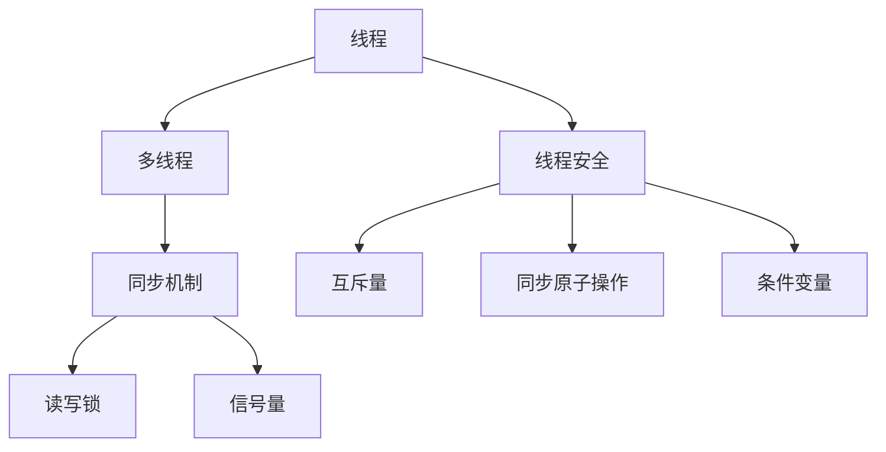

                 

# LLM的线程安全问题：分析与对策

> 关键词：多线程安全, 深度学习, LLM, 线程安全问题, 同步机制

## 1. 背景介绍

在现代计算机系统中，多线程（Multithreading）是一种常见的并行编程技术，通过同时执行多个任务来提升系统的性能和响应速度。在深度学习领域，多线程模型也日益得到广泛应用，尤其是在训练大规模深度学习模型（Large Language Models, LLMs）时，通过并行计算可以大大缩短模型训练时间。

然而，多线程模型的一个关键问题是如何保证线程间的同步与互斥，确保模型参数和中间计算结果的一致性和正确性。特别是对于大语言模型，由于其参数量巨大，数据流复杂，线程安全问题更加凸显。例如，在推理阶段，一个线程的计算结果可能被另一个线程破坏，导致输出错误。

本文将对多线程中的线程安全问题进行详细分析，并提出一些有效的对策，为使用大语言模型的开发者提供实用的参考。

## 2. 核心概念与联系

### 2.1 核心概念概述

为更好地理解多线程中的线程安全问题，本节将介绍几个关键概念：

- 线程（Thread）：一个轻量级的执行单元，可以并行执行任务，与进程类似，但共享同一个进程的资源。

- 多线程（Multithreading）：在一个进程中同时执行多个线程，以提高计算效率和响应速度。

- 线程安全（Thread-Safe）：指多个线程在访问共享资源时，不会出现竞争条件和数据不一致的问题。

- 同步机制（Synchronization Mechanism）：通过锁（Lock）、信号量（Semaphore）、条件变量（Condition Variable）等机制，确保多个线程按序执行，防止数据不一致。

- 互斥量（Mutex）：一种同步机制，用于保护共享资源的访问，确保同一时刻只有一个线程能够访问。

- 读写锁（Read-Write Lock）：一种优化机制，针对读多写少的场景，通过读写锁提高并发性能。

这些概念之间的逻辑关系可以通过以下Mermaid流程图来展示：



这个流程图展示了大语言模型中线程安全问题的核心概念及其之间的关系：

1. 线程是并行执行的基本单位。
2. 多线程通过并行执行多个线程来提升系统效率。
3. 线程安全问题指的是多个线程在访问共享资源时，如何保证数据一致性。
4. 同步机制通过锁、信号量等手段，避免多个线程之间的数据竞争。
5. 互斥量是同步机制的一种实现方式。
6. 读写锁是针对读多写少场景的一种优化机制。
7. 同步原子操作保证关键操作的原子和一致性。
8. 条件变量用于等待某个条件满足。

这些概念共同构成了线程安全问题的理论基础，为大语言模型在多线程环境下的运行提供了指导。

## 3. 核心算法原理 & 具体操作步骤

### 3.1 算法原理概述

线程安全问题本质上是一个并发控制问题。在大语言模型中，线程安全问题可能出现在以下几个场景：

- 模型参数更新。多个线程同时修改模型参数，导致数据不一致。
- 中间计算结果的读写。多个线程同时读写中间计算结果，可能导致数据覆盖或丢失。
- 共享资源的访问。多个线程同时访问共享资源，如内存、文件、网络等，可能产生竞争条件。

针对这些问题，多线程模型需要采用一系列同步机制来保证数据一致性。常见的同步机制包括：

- 互斥锁（Mutex Lock）：通过互斥量确保同一时刻只有一个线程能够访问共享资源。
- 读写锁（Read-Write Lock）：针对读多写少的场景，通过读写锁提高并发性能。
- 条件变量（Condition Variable）：用于等待某个条件满足，确保多个线程之间的协同执行。

这些同步机制通常通过操作系统提供的API实现，例如C++11中的std::mutex、std::shared_mutex等。在大语言模型中，通常采用C++并行库如OpenMP、MPI、CUDA等来实现线程安全和同步控制。

### 3.2 算法步骤详解

以下是多线程环境中大语言模型线程安全问题的详细步骤：

**Step 1: 初始化共享资源**
- 使用std::mutex、std::shared_mutex等同步机制初始化共享资源的访问权限。

**Step 2: 设计任务并行化方案**
- 将大语言模型的任务拆分为多个子任务，每个子任务由一个线程执行。
- 对共享资源（如模型参数、中间结果）使用同步机制进行保护。

**Step 3: 执行并行计算**
- 创建多个线程，将任务分配给各个线程执行。
- 通过互斥锁、读写锁等机制，保护共享资源的访问，确保线程安全。
- 使用条件变量协调不同线程之间的执行顺序。

**Step 4: 计算结果合并**
- 每个线程计算完成后，将结果合并到共享内存中。
- 使用同步机制确保每个线程计算结果的一致性。

**Step 5: 结果输出**
- 最终计算结果通过互斥锁等机制确保输出线程的安全访问。

### 3.3 算法优缺点

使用多线程技术可以显著提高大语言模型的训练和推理效率，但其也存在一些局限性：

**优点：**
- 提升计算效率：通过并行计算，模型训练和推理速度大大提升。
- 降低内存消耗：多个线程共享同一个进程的内存，减少了内存分配和复制的开销。
- 增强系统弹性：多个线程可以动态调整，适应不同的任务负载。

**缺点：**
- 线程间同步开销：线程安全问题的同步机制增加了系统的复杂性和开销。
- 潜在竞争条件：多个线程同时访问共享资源，可能产生竞争条件和数据不一致。
- 系统资源消耗：多线程模型对CPU、内存等系统资源的要求更高。

### 3.4 算法应用领域

在大语言模型的训练和推理过程中，多线程技术得到了广泛应用。以下是几个主要的应用场景：

- 分布式训练：使用多线程技术可以加速大规模模型在分布式环境下的并行训练，提高训练速度。
- 推理加速：通过多线程并行计算，可以显著提升大语言模型的推理速度，满足实时应用的性能需求。
- 模型优化：多线程技术可以用于优化模型结构，减少不必要的计算和内存分配。

此外，多线程技术还可以应用于大语言模型的资源管理和内存优化，进一步提升系统的效率和性能。

## 4. 数学模型和公式 & 详细讲解  
### 4.1 数学模型构建

在多线程模型中，线程安全的核心在于同步机制的设计和应用。以下是一些常见的同步机制及其数学模型：

- 互斥锁（Mutex）：通过保护共享资源的访问权限，确保同一时刻只有一个线程能够访问。
- 读写锁（Read-Write Lock）：用于读多写少的场景，提高并发性能。
- 条件变量（Condition Variable）：用于等待某个条件满足，协调不同线程之间的执行顺序。

这些同步机制可以通过操作系统提供的API实现，例如C++11中的std::mutex、std::shared_mutex等。

### 4.2 公式推导过程

以下是对互斥锁和读写锁的基本操作及其数学模型进行推导：

**互斥锁的基本操作**
- 加锁（Locking）：
  $Lock(x)$

- 解锁（Unlocking）：
  $UnLock(x)$

**互斥锁的推导公式**
- 加锁过程：
  $$
  x \leftarrow Lock(x)
  $$
- 解锁过程：
  $$
  UnLock(x) = Lock(x)
  $$

**读写锁的基本操作**
- 加读锁（Locking）：
  $ReadLock(x)$

- 解锁读锁（Unlocking）：
  $UnLockRead(x)$

- 加写锁（Locking）：
  $WriteLock(x)$

- 解锁写锁（Unlocking）：
  $UnLockWrite(x)$

**读写锁的推导公式**
- 加读锁过程：
  $$
  x \leftarrow ReadLock(x)
  $$
- 解锁读锁过程：
  $$
  UnLockRead(x) = WriteLock(x)
  $$
- 加写锁过程：
  $$
  x \leftarrow WriteLock(x)
  $$
- 解锁写锁过程：
  $$
  UnLockWrite(x) = UnLockRead(x)
  $$

### 4.3 案例分析与讲解

以大语言模型的分布式训练为例，讨论如何实现线程安全的同步机制。

**分布式训练的同步机制**
- 使用MPI（Message Passing Interface）实现分布式计算。
- 使用std::mutex保护模型参数的更新。
- 使用std::condition_variable协调不同进程之间的执行顺序。

**分布式训练的代码实现**
- 使用MPI分配计算任务：
  ```python
  MPI_Init(&argc, &argv)
  MPI_Comm_rank(MPI_COMM_WORLD, &rank)
  MPI_Comm_size(MPI_COMM_WORLD, &size)
  ```
- 使用互斥锁保护模型参数的更新：
  ```python
  std::mutex model_mutex;
  std::lock_guard<std::mutex> lock(model_mutex);
  // 更新模型参数
  ```
- 使用条件变量协调不同进程之间的执行顺序：
  ```python
  std::condition_variable cv;
  std::unique_lock<std::mutex> lock(model_mutex);
  // 等待某个条件满足
  cv.wait(lock, []{ return condition_variable(); });
  ```

## 5. 项目实践：代码实例和详细解释说明
### 5.1 开发环境搭建

在进行多线程模型开发前，我们需要准备好开发环境。以下是使用C++进行多线程编程的环境配置流程：

1. 安装Anaconda：从官网下载并安装Anaconda，用于创建独立的Python环境。

2. 创建并激活虚拟环境：
```bash
conda create -n cpp-env python=3.8 
conda activate cpp-env
```

3. 安装C++并行库：
```bash
conda install mkl mkl-include mkl-devel libomp
```

4. 安装MPI库：
```bash
conda install mpir
```

5. 安装CUDA和CUDA Toolkit：
```bash
conda install cudatoolkit cudatoolkit-11.1 -c pytorch -c conda-forge
```

完成上述步骤后，即可在`cpp-env`环境中开始多线程模型的开发。

### 5.2 源代码详细实现

下面我们以大语言模型的分布式训练为例，给出使用C++进行多线程编程的代码实现。

首先，定义一个简单的分布式训练函数：

```cpp
#include <iostream>
#include <mpi.h>

void train_model(int rank, int size) {
    // 初始化MPI环境
    MPI_Init(NULL, NULL);
    int world_size, world_rank;
    MPI_Comm_size(MPI_COMM_WORLD, &world_size);
    MPI_Comm_rank(MPI_COMM_WORLD, &world_rank);
    
    // 输出进程信息
    std::cout << "Rank " << world_rank << " out of " << world_size << "\n";
    
    // 执行分布式训练
    // ...
}
```

然后，定义分布式训练的同步机制：

```cpp
#include <iostream>
#include <thread>
#include <mutex>
#include <condition_variable>

void train_model(int rank, int size) {
    // 初始化MPI环境
    MPI_Init(NULL, NULL);
    int world_size, world_rank;
    MPI_Comm_size(MPI_COMM_WORLD, &world_size);
    MPI_Comm_rank(MPI_COMM_WORLD, &world_rank);
    
    // 输出进程信息
    std::cout << "Rank " << world_rank << " out of " << world_size << "\n";
    
    // 创建互斥锁和条件变量
    std::mutex model_mutex;
    std::condition_variable cv;
    
    // 定义训练函数
    auto train_fn = [rank](int size) {
        // 加锁
        std::unique_lock<std::mutex> lock(model_mutex);
        
        // 执行训练
        // ...
        
        // 解锁
        lock.unlock();
        
        // 等待条件变量
        cv.wait(lock, []{ return condition_variable(); });
    };
    
    // 创建多个线程
    std::vector<std::thread> threads;
    for (int i = 0; i < size; ++i) {
        threads.emplace_back(train_fn, size);
    }
    
    // 等待所有线程完成
    for (auto& thread : threads) {
        thread.join();
    }
    
    // 释放资源
    MPI_Finalize();
}
```

最后，启动分布式训练：

```cpp
int main(int argc, char* argv[]) {
    train_model(0, 4);
    return 0;
}
```

以上就是使用C++进行多线程分布式训练的完整代码实现。可以看到，通过使用互斥锁和条件变量，可以有效地保护共享资源的访问，确保线程安全。

### 5.3 代码解读与分析

让我们再详细解读一下关键代码的实现细节：

**train_model函数**：
- 初始化MPI环境，获取进程信息和系统大小。
- 输出进程信息，确认进程编号和系统大小。
- 创建互斥锁和条件变量，用于保护模型参数的更新和同步。
- 定义训练函数train_fn，使用互斥锁保护模型参数的更新，使用条件变量协调不同线程之间的执行顺序。
- 创建多个线程，并执行训练函数。
- 等待所有线程完成，释放MPI资源。

**互斥锁和条件变量的使用**：
- 通过std::mutex创建互斥锁，用于保护共享资源的访问。
- 通过std::condition_variable创建条件变量，用于等待某个条件满足。
- 使用std::unique_lock<std::mutex>保护加锁和解锁操作的原子性。
- 在等待条件变量时，使用std::condition_variable::wait等待某个条件满足，确保线程安全。

以上代码实现展示了如何使用互斥锁和条件变量实现线程安全的多线程分布式训练。通过合理设计同步机制，可以确保模型参数和中间计算结果的一致性和正确性，避免数据不一致和竞争条件。

## 6. 实际应用场景

### 6.1 智能客服系统

智能客服系统是多线程模型的一个重要应用场景。在智能客服系统中，多个客服机器人需要同时处理客户咨询，确保系统稳定性和响应速度。多线程模型可以显著提升系统的并发处理能力，满足客户咨询的需求。

在技术实现上，可以采用C++并行库如OpenMP、MPI、CUDA等，将客服机器人的计算任务分配到多个线程中，并使用互斥锁和条件变量保护共享资源的访问，确保系统安全。

### 6.2 金融舆情监测

金融舆情监测是多线程模型在金融领域的重要应用。在金融舆情监测系统中，多个舆情分析模块需要同时处理大量数据，确保系统高效性和稳定性。多线程模型可以加速舆情分析过程，提高系统响应速度。

在技术实现上，可以使用C++并行库和MPI库，将舆情分析任务分配到多个线程中，并使用互斥锁和条件变量保护共享资源的访问，确保系统安全。

### 6.3 个性化推荐系统

个性化推荐系统是多线程模型在电子商务领域的重要应用。在个性化推荐系统中，多个推荐算法需要同时处理用户数据，确保系统实时性和准确性。多线程模型可以显著提升推荐算法的处理速度，提高用户体验。

在技术实现上，可以使用C++并行库和MPI库，将推荐算法的计算任务分配到多个线程中，并使用互斥锁和条件变量保护共享资源的访问，确保系统安全。

### 6.4 未来应用展望

随着多线程模型和大语言模型的不断发展，其在更多领域的应用将不断涌现，为传统行业带来变革性影响。

在智慧医疗领域，多线程模型可以应用于医学影像分析、医疗问答等场景，提高医疗服务的智能化水平，辅助医生诊疗，加速新药开发进程。

在智能教育领域，多线程模型可以应用于在线教育平台，提高教学质量和学生体验，因材施教，促进教育公平。

在智慧城市治理中，多线程模型可以应用于城市事件监测、舆情分析、应急指挥等环节，提高城市管理的自动化和智能化水平，构建更安全、高效的未来城市。

此外，在企业生产、社会治理、文娱传媒等众多领域，多线程模型和分布式计算技术的应用也将不断提升人工智能系统的性能和应用范围。相信随着技术的发展和应用的推广，多线程模型必将在更多领域带来颠覆性影响。

## 7. 工具和资源推荐
### 7.1 学习资源推荐

为了帮助开发者系统掌握多线程模型和线程安全的理论基础和实践技巧，这里推荐一些优质的学习资源：

1. 《深入理解计算机系统》：计算机体系结构经典教材，详细介绍了多线程和并发控制的基本原理。
2. 《并发编程的艺术》：C++11并行编程权威指南，讲解了多线程模型和同步机制的实现细节。
3. 《C++并行编程指南》：介绍C++并行库如OpenMP、MPI、CUDA的使用方法和实践技巧。
4. 《Linux多线程编程》：讲解了在Linux环境下使用C++和POSIX线程库实现多线程编程。
5. 《TensorFlow并发编程指南》：讲解了在TensorFlow中使用多线程模型进行分布式训练和推理的实践技巧。

通过对这些资源的学习实践，相信你一定能够快速掌握多线程模型和线程安全的精髓，并用于解决实际的并发问题。

### 7.2 开发工具推荐

高效的开发离不开优秀的工具支持。以下是几款用于多线程模型开发的常用工具：

1. Visual Studio：Microsoft开发的IDE，支持C++和CUDA开发，提供了丰富的并行编程工具。
2. Code::Blocks：开源的IDE，支持C++开发，提供多线程编程和并发控制的支持。
3. Eclipse：开源的IDE，支持C++开发，提供了丰富的并发控制和同步机制的支持。
4. Clion：JetBrains开发的IDE，支持C++和CUDA开发，提供了丰富的并行编程工具和调试支持。
5. CMake：开源的构建系统，支持C++多线程模型和并发控制的构建。

合理利用这些工具，可以显著提升多线程模型的开发效率，加快创新迭代的步伐。

### 7.3 相关论文推荐

多线程模型和线程安全技术的发展源于学界的持续研究。以下是几篇奠基性的相关论文，推荐阅读：

1. "Concurrency and Parallel Programming: Principles and Paradigms" by Maletic and Lomont。
2. "Programming Concurrent and Parallel Programs: A Practical Introduction using Java" by Trappe。
3. "Multithreaded Programming in Java: Effective Use of Java's Concurrency APIs" by Chandramouli and Turja。
4. "Multithreaded and Concurrent Programming: Practical Design Principles and Patterns" by DeMott。
5. "The Concurrent Programming Parallelization Guide" by Anthony Williams。

这些论文代表了大语言模型多线程模型的发展脉络。通过学习这些前沿成果，可以帮助研究者把握学科前进方向，激发更多的创新灵感。

## 8. 总结：未来发展趋势与挑战

### 8.1 总结

本文对大语言模型中的线程安全问题进行了全面系统的介绍。首先阐述了多线程模型和大语言模型的相关概念，明确了线程安全在多线程环境中的重要性和复杂性。其次，从原理到实践，详细讲解了多线程模型中的同步机制和具体步骤，给出了多线程模型开发的完整代码实例。同时，本文还广泛探讨了多线程模型在多个行业领域的应用前景，展示了多线程模型和分布式计算技术的前景。

通过本文的系统梳理，可以看到，多线程模型在大语言模型的训练和推理过程中扮演了重要角色，极大地提升了计算效率和系统性能。未来，伴随多线程模型的持续演进，必将为人工智能技术带来更广阔的应用空间，深刻影响人类生产生活方式。

### 8.2 未来发展趋势

展望未来，多线程模型和大语言模型的发展趋势将呈现以下几个方向：

1. 更高的并发性能。随着多核CPU和GPU的不断发展，多线程模型的并发性能将进一步提升，支持更大规模的分布式计算。
2. 更灵活的同步机制。未来的同步机制将更加灵活多样，能够适应更多复杂场景和应用需求。
3. 更高效的数据传输。多线程模型将探索新的数据传输方式，如网络传输、内存传输等，提高数据传输的效率和可靠性。
4. 更严格的线程安全保证。未来的多线程模型将更加注重线程安全，提供更严格的数据一致性和可靠性保证。
5. 更广泛的行业应用。多线程模型将在更多领域得到应用，如金融、医疗、教育、城市管理等，推动各行各业的智能化升级。

以上趋势凸显了多线程模型和大语言模型的广阔前景。这些方向的探索发展，必将进一步提升大语言模型的计算效率和系统性能，为人工智能技术带来新的突破。

### 8.3 面临的挑战

尽管多线程模型和大语言模型已经取得了瞩目成就，但在迈向更加智能化、普适化应用的过程中，仍面临诸多挑战：

1. 数据分布异构性。不同进程的数据分布可能存在差异，如何保证数据一致性和同步性，仍是一个难题。
2. 数据传输瓶颈。多线程模型需要频繁进行数据传输，尤其是在分布式环境中，传输效率和带宽仍是关键问题。
3. 计算资源消耗。多线程模型对CPU、内存等计算资源的要求更高，如何在保证性能的同时，优化资源利用，是一个重要的研究方向。
4. 线程安全保障。多线程模型的线程安全问题仍然存在，如何在高并发环境中保证数据一致性，是一个重要的研究方向。
5. 系统复杂度增加。多线程模型增加了系统的复杂性，如何在保证性能的同时，减少系统复杂度，是一个重要的研究方向。

正视多线程模型和大语言模型所面临的这些挑战，积极应对并寻求突破，将是大语言模型向更广泛应用迈进的重要步骤。相信随着技术的发展和应用的推广，多线程模型必将在更多领域带来颠覆性影响，推动人工智能技术的快速发展。

### 8.4 研究展望

面对多线程模型和大语言模型所面临的挑战，未来的研究需要在以下几个方面寻求新的突破：

1. 探索更高效的数据传输机制。如网络传输、内存传输、文件传输等，提高数据传输效率。
2. 研究更灵活的同步机制。如读写锁、分布式锁、无锁数据结构等，适应更多复杂场景。
3. 探索更优的资源管理策略。如内存管理、任务调度、线程池等，优化资源利用。
4. 研究更高效的分布式计算模型。如DAG计算、任务依赖图等，提高分布式计算效率。
5. 研究更可靠的数据一致性保障。如分布式事务、一致性哈希等，提高数据一致性。

这些研究方向将推动多线程模型和大语言模型向更高的水平发展，为人工智能技术带来更多的创新和突破。总之，多线程模型和大语言模型必将带来新的突破，推动人工智能技术迈向新的高峰。

## 9. 附录：常见问题与解答

**Q1：多线程模型与单线程模型的区别是什么？**

A: 多线程模型与单线程模型的区别在于同时执行任务的线程数。单线程模型在同一时刻只有一个线程在执行任务，而多线程模型可以在同一时刻执行多个线程任务。多线程模型可以显著提升系统的并发处理能力，提高系统的响应速度和处理效率。

**Q2：多线程模型中常见的同步机制有哪些？**

A: 多线程模型中常见的同步机制包括互斥锁、读写锁、条件变量、信号量等。互斥锁用于保护共享资源的访问，确保同一时刻只有一个线程能够访问；读写锁用于读多写少的场景，提高并发性能；条件变量用于等待某个条件满足，确保多个线程之间的协同执行；信号量用于控制多个线程之间的访问顺序，避免竞争条件。

**Q3：多线程模型中如何避免死锁？**

A: 死锁是多线程模型中常见的问题，可以通过以下方法避免：
1. 避免循环等待：确保所有线程按照相同的顺序获取锁。
2. 使用超时机制：设置锁的获取超时时间，避免长时间等待。
3. 避免使用锁链：确保同一时刻只有一个线程持有某个锁。
4. 使用资源分配图：分析资源分配图，避免死锁的发生。

**Q4：多线程模型中如何优化性能？**

A: 优化多线程模型的性能可以从以下几个方面入手：
1. 使用并行库和框架：如OpenMP、MPI、CUDA等，提升并发性能。
2. 使用读写锁和互斥锁：针对不同的场景选择合适的锁类型，提高并发性能。
3. 使用异步任务和线程池：优化任务调度和线程管理，提高系统效率。
4. 使用负载均衡和任务分配：合理分配计算任务，避免资源浪费和负载不均。

**Q5：多线程模型在分布式计算中的应用场景有哪些？**

A: 多线程模型在分布式计算中的应用场景包括：
1. 分布式训练：在多台机器上并行训练深度学习模型，提高训练速度。
2. 分布式推理：在多台机器上并行推理深度学习模型，提高推理速度。
3. 分布式数据处理：在多台机器上并行处理大规模数据，提高数据处理效率。
4. 分布式任务调度：在多台机器上并行执行任务，优化资源利用。

以上多线程模型在分布式计算中的应用场景，展示了其在多个领域的应用潜力。相信随着技术的发展和应用的推广，多线程模型必将在更多领域带来颠覆性影响，推动人工智能技术的快速发展。

---

作者：禅与计算机程序设计艺术 / Zen and the Art of Computer Programming

