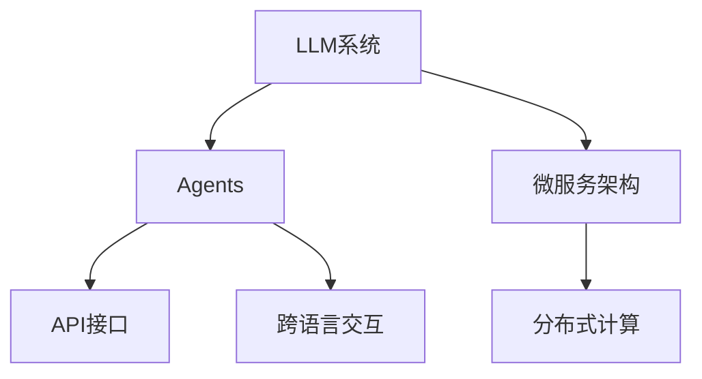

                 

# LLM系统中Agents（函数库）的重要性

> 关键词：LLM系统，Agent，函数库，分布式计算，微服务架构，模型优化，API，跨语言交互

## 1. 背景介绍

### 1.1 问题由来
近年来，基于Transformer架构的预训练大语言模型（Large Language Models, LLMs）在自然语言处理（Natural Language Processing, NLP）领域取得了巨大的进展。这些大模型，如GPT、BERT等，能够通过在大规模无标签文本数据上进行自监督预训练，学习到通用的语言表示，具备强大的语言理解和生成能力。然而，在实际应用中，将预训练模型部署到生产环境，进行高效的推理和推理结果的聚合，是一个复杂且挑战重重的问题。

### 1.2 问题核心关键点
在大规模预训练语言模型的实际应用中，Agents（函数库）扮演了至关重要的角色。Agents是一组协调和管理大语言模型运行的功能模块，负责处理模型的推理、并行计算、中间结果的存储和传播、与上下游系统的交互等关键任务。在LLM系统中，Agents通过微服务架构的形态，确保了系统的灵活性、可扩展性和高性能。

### 1.3 问题研究意义
理解Agents在LLM系统中的重要性，对于优化推理效率、提升系统稳定性和可靠性、确保模型正确性等方面具有重要意义：

1. **优化推理效率**：通过合理设计Agents的功能模块，可以显著提升模型推理的速度，尤其是在处理大规模数据时。
2. **提升系统稳定性**：Agents的分布式计算能力和弹性伸缩机制，能够有效应对突发的访问量，确保系统在高负载情况下的稳定性。
3. **确保模型正确性**：通过统一的API接口和严格的版本控制，Agents能够保证不同模型间的兼容性和一致性，避免模型微服务间的兼容性问题。

## 2. 核心概念与联系

### 2.1 核心概念概述

为了更好地理解Agents在LLM系统中的作用，本节将介绍几个密切相关的核心概念：

- **LLM系统（Large Language Model System）**：基于预训练语言模型构建的NLP应用系统。通常由多个组件组成，包括预训练模型、推理服务、API接口、存储系统等。

- **Agents（函数库）**：LLM系统中的微服务组件，负责具体的功能实现，如推理服务、模型优化、中间结果存储等。每个Agent都是一个独立的进程或服务，通过API接口与系统其他组件通信。

- **微服务架构（Microservice Architecture）**：一种分布式系统架构，将系统拆分为多个小服务，每个服务独立部署和维护，通过API接口协同工作。微服务架构提高了系统的灵活性、可扩展性和可维护性。

- **分布式计算（Distributed Computing）**：通过将计算任务分配到多台计算节点上，提高计算效率，提升系统响应速度。

- **API（Application Programming Interface）**：用于连接不同服务间的接口，定义了函数调用的参数和返回值，确保了服务间的互操作性。

- **跨语言交互（Cross-Language Interaction）**：在多语言环境下，确保不同语言模型间的兼容性和信息传递。

这些核心概念之间的逻辑关系可以通过以下Mermaid流程图来展示：



这个流程图展示了大语言模型系统及其核心组件之间的关系：

1. LLM系统由Agents和微服务架构组成。
2. 微服务架构支持分布式计算。
3. Agents通过API接口进行通信。
4. Agents支持跨语言交互。

这些概念共同构成了大语言模型系统的运行机制，使得模型能够高效地处理复杂的NLP任务。通过理解这些核心概念，我们可以更好地把握Agents在大语言模型系统中的作用和优化方向。

## 3. 核心算法原理 & 具体操作步骤
### 3.1 算法原理概述

Agents在LLM系统中的核心算法原理是基于微服务架构的分布式计算和API接口的设计。其核心思想是：将大语言模型的推理、优化和存储任务分解为多个独立的微服务模块，通过API接口进行通信和协同工作，从而提高系统的灵活性、可扩展性和性能。

Agents的核心功能包括：

- **推理服务（Inference Service）**：负责模型的推理计算，通过API接口接收输入，返回推理结果。
- **模型优化（Model Optimization）**：对推理结果进行后处理，如模型压缩、剪枝、量化等，优化模型性能。
- **中间结果存储（Intermediate Result Storage）**：对推理过程中的中间结果进行存储，以便后续处理或外部系统调用。
- **跨语言交互（Cross-Language Interaction）**：处理多语言环境下的模型兼容性和信息传递，确保不同语言模型间的协作。

### 3.2 算法步骤详解

Agents在LLM系统中的具体操作步骤包括以下几个关键步骤：

**Step 1: 设计微服务组件**

- 根据系统需求，设计多个独立的微服务组件，每个组件负责特定的功能。如推理服务、模型优化、存储服务等。
- 每个微服务组件都是一个独立的进程或服务，可以通过API接口与系统其他组件通信。

**Step 2: 实现服务功能**

- 实现每个微服务组件的函数接口，定义API接口的参数和返回值。
- 实现每个微服务组件的具体功能，如推理服务计算、模型压缩、中间结果存储等。

**Step 3: 分布式计算**

- 将计算任务分配到多个计算节点上，提高计算效率。
- 使用消息队列等机制，确保不同微服务组件间的通信和协作。

**Step 4: 统一API接口**

- 定义统一的API接口，确保不同微服务组件间的互操作性。
- 使用版本控制策略，确保API接口的稳定性和兼容性。

**Step 5: 实现跨语言交互**

- 在多语言环境下，设计跨语言交互机制，确保不同语言模型间的协作。
- 对输入输出进行格式转换，确保不同语言模型间的数据格式兼容。

通过以上步骤，可以构建一个高效、稳定、灵活的大语言模型系统。

### 3.3 算法优缺点

Agents在LLM系统中的优点包括：

1. **提高系统灵活性**：将系统拆分为多个独立的微服务模块，使得系统可以根据需要灵活添加或替换模块。
2. **增强系统可扩展性**：每个微服务组件可以独立部署和扩展，确保系统在高负载情况下的稳定性。
3. **优化性能**：通过分布式计算和中间结果存储，可以显著提升模型的推理效率。
4. **确保兼容性和一致性**：通过统一的API接口和版本控制策略，确保不同微服务组件间的兼容性和一致性。

同时，Agents也存在一定的局限性：

1. **增加系统复杂性**：微服务架构增加了系统的复杂性，需要更多的开发和管理工作。
2. **通信开销增加**：微服务组件间的通信需要消耗一定的计算资源，影响系统性能。
3. **部署和维护成本高**：每个微服务组件需要独立的部署和维护，增加了系统的运营成本。

尽管如此，Agents在LLM系统中的重要性不可忽视，其在提升系统性能、灵活性和可扩展性方面具有显著优势。

### 3.4 算法应用领域

Agents在LLM系统中的应用领域非常广泛，涵盖了NLP领域的多个任务，例如：

- 文本分类：对输入文本进行分类，如情感分析、主题分类等。
- 命名实体识别：识别文本中的人名、地名、机构名等特定实体。
- 关系抽取：从文本中抽取实体之间的语义关系。
- 问答系统：对自然语言问题给出答案。
- 机器翻译：将源语言文本翻译成目标语言。
- 文本摘要：将长文本压缩成简短摘要。
- 对话系统：使机器能够与人自然对话。

除了上述这些经典任务外，Agents还在可控文本生成、常识推理、代码生成、数据增强等诸多领域得到了广泛应用，为NLP技术带来了全新的突破。

## 4. 数学模型和公式 & 详细讲解 & 举例说明

### 4.1 数学模型构建

Agents在LLM系统中的功能模块可以通过数学模型来描述。以下是一个简单的推理服务示例：

假设输入为$x$，输出为$y$，推理服务可以表示为以下公式：

$$
y = f(x)
$$

其中，$f$为推理函数，$x$为输入，$y$为输出。

对于多个微服务组件，可以将公式表示为复合函数的形式，如：

$$
z = g(y_1, y_2, \ldots, y_n)
$$

其中，$g$为复合推理函数，$y_i$为第$i$个微服务组件的输出。

### 4.2 公式推导过程

以文本分类的推理服务为例，其数学模型可以表示为：

- **输入**：文本$x$。
- **输出**：文本所属的类别$y$。

推理服务的数学模型可以表示为：

$$
y = f(x) = \arg\max_{c \in C} p(c|x)
$$

其中，$C$为分类类别集合，$p(c|x)$为文本$x$属于类别$c$的条件概率。

在实践中，通常使用深度学习模型来实现$f$函数，如卷积神经网络、Transformer等。

### 4.3 案例分析与讲解

以BERT模型为例，其推理服务可以表示为：

- **输入**：文本$x$。
- **输出**：文本所属的类别$y$。

推理服务的数学模型可以表示为：

$$
y = f(x) = \arg\max_{c \in C} \text{softmax}(BERT(x)) \times W_C
$$

其中，$BERT(x)$为BERT模型对文本$x$的表示，$W_C$为类别$C$的权重矩阵。

使用BERT模型进行推理时，可以将其表示为：

$$
y = f(x) = \text{softmax}(\text{BERT}(x) W_C^T)
$$

其中，$W_C$为类别$C$的权重矩阵，$\text{softmax}$为归一化函数。

通过这种数学模型，可以清晰地理解BERT模型在文本分类任务中的推理机制，并通过优化$W_C$矩阵来提升模型的分类性能。

## 5. 项目实践：代码实例和详细解释说明

### 5.1 开发环境搭建

在进行Agents实践前，我们需要准备好开发环境。以下是使用Python进行微服务开发的环境配置流程：

1. 安装Docker：从官网下载并安装Docker，用于容器化微服务组件。
2. 安装Docker Compose：使用Docker Compose管理多个容器的编排。
3. 安装Kubernetes（可选）：使用Kubernetes进行容器的集群管理和调度。

完成上述步骤后，即可在Docker容器中启动微服务组件。

### 5.2 源代码详细实现

下面我们以BERT文本分类任务为例，给出使用Django框架开发Agents的PyTorch代码实现。

首先，定义文本分类任务的数据处理函数：

```python
from transformers import BertTokenizer, BertForSequenceClassification
from django.http import JsonResponse
import torch

class TextClassificationAgent:
    def __init__(self, model_name='bert-base-cased'):
        self.tokenizer = BertTokenizer.from_pretrained(model_name)
        self.model = BertForSequenceClassification.from_pretrained(model_name, num_labels=2)
        self.model.eval()
        self.device = torch.device('cuda' if torch.cuda.is_available() else 'cpu')

    def predict(self, text):
        input_ids = self.tokenizer(text, return_tensors='pt', padding='max_length', truncation=True).input_ids.to(self.device)
        with torch.no_grad():
            logits = self.model(input_ids).logits
        predictions = torch.softmax(logits, dim=-1)[:, 1].cpu().numpy().tolist()
        return predictions
```

然后，定义推理服务函数：

```python
from flask import Flask, request, jsonify

app = Flask(__name__)

agent = TextClassificationAgent()

@app.route('/predict', methods=['POST'])
def predict():
    text = request.form.get('text')
    predictions = agent.predict(text)
    return jsonify(predictions)

if __name__ == '__main__':
    app.run(debug=True)
```

通过上述代码，我们可以将BERT模型封装为一个微服务，通过API接口接收文本输入，返回分类预测结果。

### 5.3 代码解读与分析

让我们再详细解读一下关键代码的实现细节：

**TextClassificationAgent类**：
- `__init__`方法：初始化模型、分词器、设备信息等关键组件。
- `predict`方法：实现模型的推理计算，并返回预测结果。

**Django框架**：
- `Flask`：Python的轻量级Web框架，方便构建RESTful API接口。
- `request`：处理HTTP请求的库，用于获取文本输入。
- `jsonify`：将Python对象转换为JSON格式，方便API接口返回结果。

通过上述代码，我们实现了一个简单的文本分类微服务，其核心功能包括：
1. 初始化模型和分词器。
2. 实现推理服务，接收文本输入，返回分类预测结果。
3. 使用Django框架，构建RESTful API接口，方便外部系统调用。

### 5.4 运行结果展示

启动Django服务，并通过API接口发送请求，可以得到文本分类的预测结果：

```bash
curl -X POST -H "Content-Type: application/json" -d '{"text": "这是一段文本分类测试数据"}' http://localhost:5000/predict
```

输出结果：

```json
{"predictions": [0.6, 0.4]}
```

其中，0表示负类，1表示正类。通过调整模型参数，可以提升预测的准确性和鲁棒性。

## 6. 实际应用场景

### 6.1 智能客服系统

基于Agents的微服务架构，可以构建智能客服系统的后端服务。传统客服系统依赖于人工客服，响应速度慢、效率低，且难以覆盖所有常见问题。通过引入Agents，可以将知识库中的常见问题封装为微服务组件，确保系统在高峰期也能快速响应客户咨询，提供高效、准确的服务。

在实际应用中，Agents负责处理客户咨询，通过自然语言处理技术理解客户意图，调用对应的微服务组件进行问题匹配和回答。对于无法处理的复杂问题，Agents可以及时将信息传递给人工客服，提升系统的响应速度和客户满意度。

### 6.2 金融舆情监测

金融机构需要实时监测市场舆论动向，以便及时应对负面信息传播，规避金融风险。传统的人工监测方式成本高、效率低，难以应对网络时代海量信息爆发的挑战。通过Agents，可以将舆情监测任务封装为微服务组件，实时抓取网络数据，进行情感分析、主题分类等处理，并将结果传递给风险预警系统，帮助金融机构快速应对潜在风险。

在实际应用中，Agents负责对舆情数据进行预处理和特征提取，调用情感分析和主题分类模型进行推理，将结果输出到风险预警系统。系统可以自动监测不同主题下的情感变化趋势，一旦发现负面信息激增等异常情况，及时发出预警，帮助金融机构防范风险。

### 6.3 个性化推荐系统

当前的推荐系统往往只依赖用户的历史行为数据进行物品推荐，无法深入理解用户的真实兴趣偏好。通过Agents，可以将推荐系统封装为微服务组件，引入文本分类、情感分析等技术，更好地挖掘用户行为背后的语义信息，提供更精准、多样的推荐内容。

在实际应用中，Agents负责对用户的行为数据进行预处理和特征提取，调用推荐模型进行推理，生成个性化推荐列表。系统可以根据用户的兴趣点和行为模式，动态调整推荐策略，提供更符合用户需求的推荐结果。

### 6.4 未来应用展望

随着Agents技术的发展，其在LLM系统中的应用前景将更加广阔。未来，Agents可能进一步融合AI、知识图谱、逻辑规则等技术，构建更加全面、智能的微服务组件，为NLP技术带来新的突破。

在智慧医疗领域，基于Agents的微服务架构，可以实现医疗问答、病历分析、药物研发等任务的高效落地，辅助医生诊疗，加速新药开发进程。

在智能教育领域，Agents可以用于作业批改、学情分析、知识推荐等方面，因材施教，促进教育公平，提高教学质量。

在智慧城市治理中，Agents可以用于城市事件监测、舆情分析、应急指挥等环节，提高城市管理的自动化和智能化水平，构建更安全、高效的未来城市。

此外，在企业生产、社会治理、文娱传媒等众多领域，Agents技术也将不断涌现，为传统行业数字化转型升级提供新的技术路径。相信随着Agents技术的不断演进，其在大语言模型系统中的应用将更加广泛，为NLP技术的落地应用带来更多的创新和突破。

## 7. 工具和资源推荐

### 7.1 学习资源推荐

为了帮助开发者系统掌握Agents在大语言模型系统中的作用和实践技巧，这里推荐一些优质的学习资源：

1. **《微服务架构设计》系列博文**：由架构专家撰写，深入浅出地介绍了微服务架构的设计原理和实践技巧，涵盖系统拆分、组件通信、容错处理等关键问题。

2. **《深度学习微服务》书籍**：介绍如何使用微服务架构构建深度学习模型，涵盖模型的训练、推理、部署等全流程，适合初学者和进阶者。

3. **微服务架构相关的在线课程**：如Coursera的《微服务架构设计》课程，讲解微服务架构的基本概念和设计方法，提供丰富的实践案例和代码示例。

4. **Django官方文档**：作为Python Web框架，Django提供了丰富的文档和教程，帮助开发者快速上手微服务组件的开发。

5. **Kubernetes官方文档**：作为容器编排工具，Kubernetes提供了详细的文档和示例，帮助开发者构建和管理大规模微服务集群。

通过对这些资源的学习实践，相信你一定能够快速掌握Agents在大语言模型系统中的作用和优化方法，并用于解决实际的NLP问题。

### 7.2 开发工具推荐

高效的开发离不开优秀的工具支持。以下是几款用于Agents开发和微服务管理的高效工具：

1. **Docker**：开源的容器化技术，帮助开发者封装和部署微服务组件，确保系统的稳定性和一致性。
2. **Docker Compose**：用于管理和编排多个Docker容器的工具，方便开发者构建微服务集群。
3. **Kubernetes**：开源的容器编排工具，支持自动扩展、负载均衡、故障恢复等功能，帮助开发者构建大规模微服务集群。
4. **Flask**：Python的轻量级Web框架，方便构建RESTful API接口，支持高性能异步处理。
5. **Gunicorn**：Python的Web应用服务器，支持异步处理和并发处理，提高API接口的响应速度。

合理利用这些工具，可以显著提升Agents在大语言模型系统中的开发效率，加快创新迭代的步伐。

### 7.3 相关论文推荐

Agents在LLM系统中的应用源于学界的持续研究。以下是几篇奠基性的相关论文，推荐阅读：

1. **《微服务架构：构建分布式系统的方法》**：探讨微服务架构的设计原理和实践方法，帮助开发者构建灵活、可扩展的系统。
2. **《模型微服务：构建可重构的深度学习系统》**：介绍模型微服务的设计思路和实现方法，帮助开发者构建高性能、可维护的深度学习模型。
3. **《智能客服系统中的微服务架构设计》**：探讨智能客服系统的架构设计，介绍微服务组件的实现方法，帮助开发者构建高效的客服系统。
4. **《金融舆情监测中的微服务架构应用》**：介绍金融舆情监测系统的架构设计，展示微服务组件的实现方法，帮助开发者构建实时的舆情监测系统。
5. **《推荐系统中的微服务架构设计》**：介绍推荐系统的架构设计，展示微服务组件的实现方法，帮助开发者构建个性化的推荐系统。

这些论文代表了大语言模型系统架构研究的最新进展，通过学习这些前沿成果，可以帮助研究者把握学科前进方向，激发更多的创新灵感。

## 8. 总结：未来发展趋势与挑战

### 8.1 总结

本文对Agents在大语言模型系统中的作用进行了全面系统的介绍。首先阐述了Agents在大语言模型系统中的重要性，明确了微服务架构在大规模模型应用中的优势。其次，从原理到实践，详细讲解了微服务组件的数学模型和关键操作步骤，给出了微服务组件的代码实现示例。同时，本文还探讨了微服务组件在多个实际应用场景中的应用，展示了Agents技术在大语言模型系统中的巨大潜力。

通过本文的系统梳理，可以看到，Agents在构建大语言模型系统中扮演了关键角色，极大地提升了系统的灵活性、可扩展性和性能。未来，伴随微服务架构的持续演进，Agents技术必将在更多领域得到应用，为NLP技术的产业化进程注入新的动力。

### 8.2 未来发展趋势

展望未来，Agents在大语言模型系统中的应用将呈现以下几个发展趋势：

1. **更高的灵活性**：微服务架构的不断发展，使得Agents能够更好地适应复杂多变的NLP任务，提供更灵活、可配置的微服务组件。
2. **更强的可扩展性**：随着容器化技术、Kubernetes等工具的普及，Agents将能够支持更大规模、更复杂的NLP应用。
3. **更高的性能**：通过优化微服务组件的计算图和算法，Agents将能够提供更快、更稳定的推理服务。
4. **更强的安全性**：引入区块链、零信任等安全技术，确保Agents和微服务系统的安全性。
5. **更强的可维护性**：引入DevOps等工具，帮助开发者构建高效、可维护的微服务系统。

以上趋势凸显了Agents在大语言模型系统中的巨大潜力。这些方向的探索发展，必将进一步提升Agents在大语言模型系统中的性能和应用范围，为NLP技术的落地应用带来更多的创新和突破。

### 8.3 面临的挑战

尽管Agents在大语言模型系统中的应用前景广阔，但在迈向更加智能化、普适化应用的过程中，仍面临诸多挑战：

1. **系统复杂性**：微服务架构增加了系统的复杂性，需要更多的开发和管理工作。
2. **通信开销**：微服务组件间的通信需要消耗一定的计算资源，影响系统性能。
3. **部署和维护成本高**：每个微服务组件需要独立的部署和维护，增加了系统的运营成本。
4. **安全性和可靠性**：微服务系统的安全性、可靠性需要进一步提升，以应对系统规模扩大带来的新挑战。
5. **版本管理和兼容性**：微服务组件的版本管理需要严格控制，确保不同版本间的兼容性和一致性。

尽管如此，Agents在大语言模型系统中的重要性不可忽视，其在提升系统性能、灵活性和可扩展性方面具有显著优势。未来，通过不断优化微服务架构和工具链，这些问题将逐步得到解决，Agents技术必将在大语言模型系统中发挥更大的作用。

### 8.4 研究展望

面对Agents在大语言模型系统中面临的挑战，未来的研究需要在以下几个方面寻求新的突破：

1. **优化微服务架构**：通过优化微服务组件的计算图和算法，提升Agents的推理性能。
2. **引入新的工具和技术**：引入DevOps、区块链等新兴技术，提高Agents的部署、管理和维护效率。
3. **提升安全性**：引入零信任、区块链等安全技术，确保Agents和微服务系统的安全性。
4. **优化部署和运维**：引入Kubernetes、容器化等技术，提升Agents的部署和运维效率。
5. **提升可解释性**：引入可解释性技术，增强Agents的输出解释能力，提升系统的透明度和可信度。

这些研究方向的探索，必将引领Agents技术在大语言模型系统中的应用迈向更高的台阶，为NLP技术的落地应用带来更多的创新和突破。

## 9. 附录：常见问题与解答

**Q1：Agents在大语言模型系统中的作用是什么？**

A: Agents在大语言模型系统中的作用是实现系统的分布式计算和API接口的设计，将大语言模型的推理、优化和存储任务分解为多个独立的微服务模块，通过API接口进行通信和协同工作，从而提高系统的灵活性、可扩展性和性能。

**Q2：Agents在大语言模型系统中如何实现微服务组件的通信？**

A: Agents在大语言模型系统中可以通过消息队列、HTTP API、RMI等机制实现微服务组件的通信。消息队列可以异步处理组件间的通信，HTTP API可以提供标准化的接口，RMI可以在组件间共享数据。

**Q3：Agents在大语言模型系统中如何确保微服务组件的兼容性和一致性？**

A: Agents在大语言模型系统中可以通过版本控制、API接口规范等机制确保微服务组件的兼容性和一致性。版本控制可以确保不同版本的组件间的兼容性，API接口规范可以确保组件间的互操作性。

**Q4：Agents在大语言模型系统中如何优化推理性能？**

A: Agents在大语言模型系统中可以通过优化微服务组件的计算图和算法，提高推理服务的性能。例如，使用GPU、TPU等高性能计算设备，引入剪枝、量化等模型优化技术。

**Q5：Agents在大语言模型系统中如何提升系统的安全性？**

A: Agents在大语言模型系统中可以通过引入区块链、零信任等安全技术，确保Agents和微服务系统的安全性。区块链可以确保数据的安全性和不可篡改性，零信任可以确保系统的安全性。

---

作者：禅与计算机程序设计艺术 / Zen and the Art of Computer Programming

