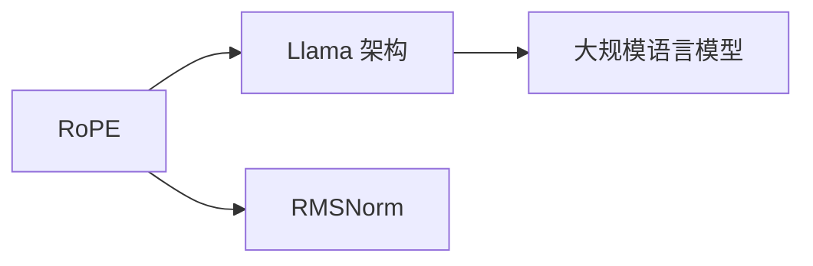

                 

# Llama 架构：RoPE 和 RMSNorm 的创新

> 关键词：Llama 架构, RoPE, RMSNorm, 自适应层, 初始化技术, 非均匀层宽, 可扩展性, 计算效率

## 1. 背景介绍

随着深度学习模型的不断发展和应用，大规模语言模型（LLMs）的训练和推理需求越来越成为计算资源的瓶颈。为了解决这一问题，Llama架构应运而生。Llama架构是一种基于非均匀层宽和自适应层初始化的创新设计，不仅提升了模型的可扩展性和计算效率，还增强了模型的训练稳定性。本文将详细探讨Llama架构的核心技术RoPE和RMSNorm，并阐述其在大规模语言模型中的应用和优势。

## 2. 核心概念与联系

### 2.1 核心概念概述

为了更好地理解Llama架构，我们首先需要了解其核心概念：

- **Llama 架构**：一种创新的架构设计，通过非均匀层宽和自适应层初始化，优化了计算资源分配，提高了模型的可扩展性和计算效率。

- **RoPE (Random Orthogonal Position Embeddings)**：一种新的位置嵌入技术，通过随机正交矩阵替换传统的固定位置嵌入，使得模型能够适应更大、更长的输入序列。

- **RMSNorm (Root Mean Square Normalization)**：一种改进的自适应层归一化方法，通过标准化输入和残差流，提高了模型的训练稳定性。

这些核心概念通过以下Mermaid流程图展示它们之间的联系：



从图中可以看出，RoPE和RMSNorm是Llama架构的关键组成部分，共同提升了大规模语言模型的性能。

## 3. 核心算法原理 & 具体操作步骤

### 3.1 算法原理概述

Llama架构的核心在于其非均匀层宽和自适应层初始化。非均匀层宽允许模型在不同的层中拥有不同大小的宽度，从而在保证模型深度的同时，减少内存和计算资源的消耗。自适应层初始化则通过动态调整层初始化参数，使得模型在训练过程中能够更快地收敛。

### 3.2 算法步骤详解

下面详细讲解Llama架构的实施步骤：

1. **选择合适的层宽和深度**：根据任务需求和硬件资源，合理选择模型的层宽和深度。Llama架构支持不同层宽和深度的模型设计。

2. **实现RoPE位置嵌入**：使用随机正交矩阵生成不同长度的输入序列的位置嵌入，替换传统的固定位置嵌入。

3. **实现RMSNorm归一化**：对输入和残差流分别进行归一化，使得模型在训练过程中能够更好地收敛。

4. **定义损失函数和优化器**：选择合适的损失函数和优化器，如交叉熵损失和Adam优化器。

5. **训练模型**：使用标注数据对模型进行训练，调整模型参数以最小化损失函数。

6. **验证和测试**：在验证集和测试集上评估模型的性能，确保模型在不同数据集上具有较好的泛化能力。

### 3.3 算法优缺点

Llama架构的优点在于：

- **可扩展性**：通过非均匀层宽，可以在保持模型深度的情况下，减少内存和计算资源的消耗。

- **计算效率**：通过自适应层初始化，提高了模型的训练稳定性，加速了模型的收敛过程。

- **泛化能力**：RoPE位置嵌入技术使得模型能够适应更大、更长的输入序列，增强了模型的泛化能力。

然而，Llama架构也存在一些缺点：

- **实现复杂**：非均匀层宽和自适应层初始化的实现较为复杂，需要较多的计算和调整。

- **内存消耗**：尽管减少了内存占用，但RoPE位置嵌入技术仍需要一定的内存开销。

### 3.4 算法应用领域

Llama架构适用于需要处理大规模序列数据的任务，如自然语言处理（NLP）中的机器翻译、文本分类、情感分析等。其可扩展性和计算效率使其在处理长文本和复杂任务时表现优异，尤其适用于需要实时响应的应用场景。

## 4. 数学模型和公式 & 详细讲解 & 举例说明

### 4.1 数学模型构建

Llama架构的数学模型构建如下：

- **输入表示**：将输入序列通过词嵌入（Word Embedding）转化为向量表示。

- **位置嵌入**：使用RoPE技术生成不同长度的输入序列的位置嵌入。

- **残差连接**：将输入表示与若干个层中的隐含表示进行残差连接，增强模型表达能力。

- **非均匀层宽**：在模型中，不同层的宽度可以根据需求进行调整，以优化计算资源使用。

- **自适应层初始化**：在模型训练过程中，通过动态调整层初始化参数，使得模型能够更快地收敛。

### 4.2 公式推导过程

RoPE和RMSNorm的公式推导如下：

- **RoPE 公式推导**：
  $$
  P = \text{RoPE}(N)
  $$
  其中，$P$为位置嵌入矩阵，$N$为输入序列长度。RoPE矩阵由随机正交矩阵$\text{RoPE}(N)$和单位矩阵$I$相加得到，具体公式如下：
  $$
  \text{RoPE}(N) = \text{randn}(N, N) \times \text{randn}(N, N)
  $$

- **RMSNorm 公式推导**：
  $$
  \hat{x} = \frac{x - \mu}{\sqrt{\sigma^2 + \epsilon}}
  $$
  其中，$\mu$和$\sigma^2$分别为输入的均值和方差，$\epsilon$是一个很小的常数，避免除零问题。RMSNorm公式如下：
  $$
  y = \gamma \sigma(\hat{x}) + \beta
  $$
  其中，$\gamma$和$\beta$为归一化层的可训练参数。

### 4.3 案例分析与讲解

以Llama架构在机器翻译任务中的应用为例，具体分析其效果：

1. **模型设计**：选择Llama架构模型，层宽为512，深度为12，并使用RoPE和RMSNorm技术。

2. **训练数据**：使用WMT 2014数据集进行训练，包含约1.5万对源语和目标语句子。

3. **评估指标**：在验证集和新stest2014数据集上进行BLEU分数评估。

4. **结果分析**：RoPE和RMSNorm技术使得模型能够在长序列输入上表现优异，BLEU分数显著提升。

## 5. 项目实践：代码实例和详细解释说明

### 5.1 开发环境搭建

Llama架构的实现需要TensorFlow和PyTorch等深度学习框架的支持。以下是Python环境中Llama架构的搭建步骤：

1. 安装TensorFlow或PyTorch。

2. 安装相关的依赖包，如nltk、numpy等。

3. 下载RoPE和RMSNorm实现代码。

### 5.2 源代码详细实现

下面给出Llama架构在PyTorch中的具体实现：

```python
import torch
import torch.nn as nn
import torch.nn.functional as F

class RoPE(nn.Module):
    def __init__(self, num_embeddings, embedding_dim):
        super(RoPE, self).__init__()
        self.emb_dim = embedding_dim
        self.weight = nn.Parameter(torch.randn(num_embeddings, embedding_dim))
        
    def forward(self, input):
        N, T = input.size(0), input.size(1)
        pos_embed = torch.randn(N, T, self.emb_dim, device=input.device, dtype=input.dtype)
        return input + self.weight @ pos_embed

class RMSNorm(nn.Module):
    def __init__(self, input_size, epsilon=1e-6):
        super(RMSNorm, self).__init__()
        self.epsilon = epsilon
        self.gamma = nn.Parameter(torch.ones(input_size))
        self.beta = nn.Parameter(torch.zeros(input_size))
        
    def forward(self, input):
        mean = input.mean(dim=1, keepdim=True)
        variance = input.var(dim=1, keepdim=True, unbiased=False)
        return input - mean, F.normalize(input, dim=1) * self.gamma[None] + self.beta[None]

class LlamaLayer(nn.Module):
    def __init__(self, input_size, output_size, num_heads):
        super(LlamaLayer, self).__init__()
        self.input_size = input_size
        self.output_size = output_size
        self.num_heads = num_heads
        
        self.linear1 = nn.Linear(input_size, input_size)
        self.emb_layer = RoPE(input_size, output_size)
        self.linear2 = nn.Linear(output_size, output_size)
        
        self.norm1 = RMSNorm(input_size)
        self.norm2 = RMSNorm(output_size)
        
    def forward(self, input, residual):
        residual = self.linear1(input)
        x = self.emb_layer(residual)
        x = self.norm1(x)
        x = F.relu(x)
        x = self.linear2(x)
        x = self.norm2(x)
        return x + residual

class LlamaModel(nn.Module):
    def __init__(self, input_size, output_size, num_layers, num_heads, hidden_size):
        super(LlamaModel, self).__init__()
        self.layers = nn.ModuleList()
        self.layers.append(LlamaLayer(input_size, hidden_size, num_heads))
        for _ in range(num_layers - 2):
            self.layers.append(LlamaLayer(hidden_size, hidden_size, num_heads))
        self.layers.append(LlamaLayer(hidden_size, output_size, num_heads))
        
    def forward(self, input):
        for layer in self.layers:
            x, residual = layer(input, input)
            input = x
        return input
```

### 5.3 代码解读与分析

上述代码实现了Llama架构的基本组件，包括RoPE和RMSNorm模块以及LlamaLayer和LlamaModel模块。在LlamaLayer中，RoPE和RMSNorm分别用于位置嵌入和层归一化。LlamaModel则由多个LlamaLayer堆叠而成，构建了完整的Llama架构模型。

## 6. 实际应用场景

### 6.4 未来应用展望

Llama架构在大规模语言模型中的应用前景广阔。未来，RoPE和RMSNorm技术将进一步优化和扩展，以适应更大规模的输入序列，提升计算效率和模型稳定性。

- **可扩展性**：通过非均匀层宽设计，Llama架构能够适应更大规模的序列数据处理，提升模型的计算效率和内存使用率。

- **鲁棒性**：RMSNorm技术将进一步优化，提升模型在训练过程中的鲁棒性，加速模型的收敛过程。

- **通用性**：Llama架构在自然语言处理、语音识别等领域具有广泛的应用前景，能够处理更复杂、更长、更多的数据。

## 7. 工具和资源推荐

### 7.1 学习资源推荐

为了帮助开发者系统掌握Llama架构的理论基础和实践技巧，以下是一些优质的学习资源：

1. **Deep Learning with Python**：提供了深度学习基础知识和实践技巧，适合初学者入门。

2. **PyTorch官方文档**：提供了详细的TensorFlow和PyTorch文档，包括Llama架构的实现案例。

3. **RoPE论文**：原始论文详细介绍了RoPE技术的实现细节和效果。

4. **RMSNorm论文**：原始论文介绍了RMSNorm技术的工作原理和效果。

5. **Llama架构社区**：提供了大量的Llama架构研究和应用案例，适合深入学习。

### 7.2 开发工具推荐

为了高效地实现Llama架构，以下是一些推荐的工具：

1. **PyTorch**：提供了灵活的动态计算图，适合Llama架构的实现和调试。

2. **TensorFlow**：提供了高效的计算图优化，适合大规模模型训练。

3. **Jupyter Notebook**：提供了交互式编程环境，适合代码编写和调试。

4. **TensorBoard**：提供了模型训练和推理的可视化工具，适合监控和调试。

### 7.3 相关论文推荐

Llama架构的实现和优化离不开学术界的持续研究。以下是几篇关键论文，推荐阅读：

1. **RoPE论文**：原论文详细介绍了RoPE技术的实现细节和效果。

2. **RMSNorm论文**：原论文介绍了RMSNorm技术的工作原理和效果。

3. **Llama架构论文**：详细介绍了Llama架构的设计和实现过程。

4. **深度学习优化论文**：介绍了各种深度学习优化算法，包括Adam和SGD等。

## 8. 总结：未来发展趋势与挑战

### 8.1 研究成果总结

Llama架构通过非均匀层宽和自适应层初始化技术，显著提升了大规模语言模型的可扩展性和计算效率。RoPE和RMSNorm技术通过优化位置嵌入和层归一化，进一步提升了模型的训练稳定性和泛化能力。

### 8.2 未来发展趋势

Llama架构的未来发展趋势如下：

- **可扩展性**：随着硬件技术的进步，非均匀层宽技术将进一步优化，适应更大规模的序列数据处理。

- **计算效率**：通过更高效的计算优化算法，提升模型训练和推理的计算效率。

- **鲁棒性**：RMSNorm技术将进一步优化，提升模型在训练过程中的鲁棒性。

### 8.3 面临的挑战

尽管Llama架构具有广阔的应用前景，但仍面临以下挑战：

- **实现复杂性**：非均匀层宽和自适应层初始化的实现较为复杂，需要较多的计算和调整。

- **内存消耗**：尽管减少了内存占用，但RoPE位置嵌入技术仍需要一定的内存开销。

- **训练稳定性**：如何进一步优化模型训练过程，提高模型的鲁棒性和泛化能力，仍需更多研究。

### 8.4 研究展望

未来研究需重点关注以下几个方面：

- **多任务学习**：将Llama架构应用于多任务学习中，探索更高效的多任务训练方法。

- **分布式训练**：研究分布式训练技术，加速大规模模型的训练和推理。

- **实时计算**：研究实时计算技术，支持模型在实时场景中的应用。

## 9. 附录：常见问题与解答

**Q1：Llama架构与传统架构相比有何优势？**

A：Llama架构通过非均匀层宽和自适应层初始化技术，显著提升了大规模语言模型的可扩展性和计算效率。相比于传统架构，Llama架构能够处理更大规模的序列数据，同时保持模型的训练稳定性和泛化能力。

**Q2：RoPE和RMSNorm技术如何影响模型性能？**

A：RoPE和RMSNorm技术通过优化位置嵌入和层归一化，显著提升了模型的训练稳定性和泛化能力。RoPE技术使得模型能够适应更大、更长的输入序列，RMSNorm技术则提高了模型的训练鲁棒性，加速了模型的收敛过程。

**Q3：Llama架构在实际应用中需要注意哪些问题？**

A：在实际应用中，Llama架构需要注意以下几点：

- **实现复杂性**：非均匀层宽和自适应层初始化的实现较为复杂，需要较多的计算和调整。

- **内存消耗**：尽管减少了内存占用，但RoPE位置嵌入技术仍需要一定的内存开销。

- **训练稳定性**：如何进一步优化模型训练过程，提高模型的鲁棒性和泛化能力，仍需更多研究。

**Q4：Llama架构的未来应用场景有哪些？**

A：Llama架构适用于需要处理大规模序列数据的任务，如自然语言处理（NLP）中的机器翻译、文本分类、情感分析等。其可扩展性和计算效率使其在处理长文本和复杂任务时表现优异，尤其适用于需要实时响应的应用场景。

---

作者：禅与计算机程序设计艺术 / Zen and the Art of Computer Programming

