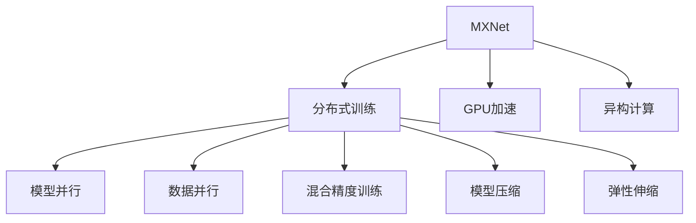

                 

# MXNet 深度学习框架：大规模分布式训练的优势

> 关键词：MXNet, 分布式训练, GPU, 异构计算, 模型并行, 数据并行, 混合精度训练, 模型压缩, 弹性伸缩

## 1. 背景介绍

随着深度学习技术的不断发展，大规模深度神经网络的应用日益广泛。从计算机视觉、自然语言处理到语音识别等领域，深度学习模型已经成为推动技术进步的关键力量。然而，随着模型复杂度的增加，训练时间和计算资源的需求也呈指数级增长，单机的训练已无法满足需求。这时，分布式训练技术就变得至关重要。

### 1.1 分布式训练的必要性

分布式训练通过将训练任务分布到多台计算机上并行执行，大大加速了模型的训练速度。在大数据时代，分布式训练成为深度学习领域不可或缺的技术。特别是在处理大规模数据集和复杂模型时，分布式训练的效率和性能优势尤为显著。

### 1.2 当前主流分布式训练框架

目前，主流的分布式训练框架包括TensorFlow、PyTorch、MXNet等。其中，TensorFlow和PyTorch分别由Google和Facebook开源，得到了广泛的应用和支持。MXNet则是由亚马逊公司开发，具有高性能、灵活性和可扩展性等特点，特别适用于大规模分布式训练。

## 2. 核心概念与联系

### 2.1 核心概念概述

为了更好地理解MXNet在大规模分布式训练中的优势，本节将介绍几个密切相关的核心概念：

- **MXNet**：由亚马逊公司开发的深度学习框架，支持分布式训练，具备高性能和灵活性。MXNet支持多种硬件平台，包括CPU、GPU和TPU等。

- **分布式训练**：将大规模训练任务分布到多个计算节点上进行并行计算，以加速模型训练的过程。

- **GPU加速**：利用图形处理器GPU的并行计算能力，提升深度学习模型的训练速度和效率。

- **异构计算**：通过将任务分配到不同硬件类型的计算节点上进行并行计算，提升整体计算能力。

- **模型并行**：将大型模型拆分成多个小模型，并行训练每个小模型，以减少内存占用和加速训练速度。

- **数据并行**：在多台计算节点上同时训练同一个模型，但使用不同的训练数据，以提升训练效率和模型的泛化能力。

- **混合精度训练**：使用低精度数据类型进行计算，以减少计算资源消耗，提升训练速度。

- **模型压缩**：通过剪枝、量化等技术减小模型大小，提升训练和推理效率。

- **弹性伸缩**：根据计算需求动态调整计算资源配置，优化系统性能和成本。

这些核心概念之间的逻辑关系可以通过以下Mermaid流程图来展示：



这个流程图展示了大规模分布式训练的主要技术点及其关系：

1. MXNet提供分布式训练能力。
2. MXNet支持GPU加速，提升计算效率。
3. MXNet支持异构计算，充分利用不同硬件平台。
4. 分布式训练中，模型并行和数据并行技术相互配合。
5. 混合精度训练、模型压缩和弹性伸缩进一步优化性能。

这些概念共同构成了MXNet在大规模分布式训练中的技术优势，使其在实际应用中具有广泛的应用前景。

## 3. 核心算法原理 & 具体操作步骤

### 3.1 算法原理概述

基于MXNet的大规模分布式训练，主要依赖于分布式计算框架和深度学习算法。其核心原理包括以下几个方面：

1. **数据并行**：将一个训练批次的数据划分为多个子批次，分别在不同的计算节点上进行训练。例如，可以将一个训练批次划分为4个子批次，每个子批次在不同的计算节点上训练。

2. **模型并行**：将一个大型深度神经网络模型拆分成多个小模型，每个小模型在独立的计算节点上进行训练。例如，可以将一个深度神经网络模型拆分成若干个子模型，每个子模型在独立的计算节点上进行训练。

3. **混合精度训练**：使用低精度数据类型（如16位浮点数）进行计算，以减少计算资源消耗，提升训练速度。

4. **弹性伸缩**：根据计算需求动态调整计算资源配置，优化系统性能和成本。

### 3.2 算法步骤详解

基于MXNet的大规模分布式训练主要包括以下几个关键步骤：

**Step 1: 数据划分与分布**

- 将训练数据集划分为多个子批次，每个子批次的大小根据计算节点内存和计算能力进行调整。
- 将每个子批次分配到不同的计算节点上进行训练。

**Step 2: 模型拆分与并行**

- 将大型深度神经网络模型拆分成多个子模型，每个子模型在独立的计算节点上进行训练。
- 在每个计算节点上训练不同的子模型，以充分利用硬件资源，加速模型训练。

**Step 3: 混合精度计算**

- 使用低精度数据类型进行计算，减少内存占用和计算资源消耗。
- 在模型权重更新时，使用高精度数据类型以保证计算精度。

**Step 4: 弹性资源配置**

- 根据计算需求动态调整计算资源配置，如CPU、GPU等。
- 在计算任务需求增加时，动态添加计算节点，提升系统性能。

**Step 5: 模型压缩与优化**

- 通过剪枝、量化等技术减小模型大小，提升训练和推理效率。
- 对模型进行优化，减少冗余计算，提升模型性能。

### 3.3 算法优缺点

基于MXNet的大规模分布式训练具有以下优点：

1. **高效性**：通过数据并行和模型并行技术，充分利用硬件资源，加速模型训练。
2. **灵活性**：支持多种硬件平台，包括CPU、GPU和TPU等，灵活应对不同场景需求。
3. **可扩展性**：通过弹性伸缩技术，动态调整计算资源配置，优化系统性能和成本。
4. **易用性**：MXNet提供丰富的API和工具支持，方便开发者使用和调试。

同时，该方法也存在一些局限性：

1. **通信开销**：分布式训练中，计算节点之间的数据传输和通信开销较大，可能会影响整体效率。
2. **同步问题**：不同计算节点之间的同步问题需要特别注意，以保证数据一致性和模型收敛性。
3. **参数同步**：在模型并行中，需要保证不同计算节点之间的模型参数同步，以避免模型偏差。
4. **精度损失**：混合精度训练可能会带来一定的精度损失，需要谨慎使用。

尽管存在这些局限性，但就目前而言，基于MXNet的分布式训练方法在实际应用中已取得了显著的成果，成为了深度学习领域的主流选择。未来相关研究的重点在于如何进一步优化分布式训练的通信和同步问题，提高系统稳定性和鲁棒性。

### 3.4 算法应用领域

基于MXNet的大规模分布式训练方法在深度学习领域已经得到了广泛的应用，覆盖了几乎所有常见任务，例如：

- 计算机视觉：图像分类、目标检测、图像分割等任务。通过分布式训练，可以大幅提升模型的训练速度和性能。
- 自然语言处理：语言模型、机器翻译、文本分类等任务。通过分布式训练，可以提升模型对大规模语料的处理能力。
- 语音识别：语音识别、语音生成等任务。通过分布式训练，可以提升模型的识别精度和实时性。
- 强化学习：训练智能体在复杂环境中进行决策。通过分布式训练，可以提升算法的训练效率和性能。
- 游戏AI：训练智能体在各种游戏中进行决策。通过分布式训练，可以提升智能体的学习效率和游戏表现。

除了上述这些经典任务外，基于MXNet的分布式训练方法还被创新性地应用到更多场景中，如医疗影像分析、生物信息学、天文数据处理等，为这些领域带来了新的突破。随着分布式训练技术的不断进步，相信MXNet在更多领域的应用将不断扩展，推动深度学习技术的广泛应用。

## 4. 数学模型和公式 & 详细讲解 & 举例说明

### 4.1 数学模型构建

本节将使用数学语言对基于MXNet的大规模分布式训练过程进行更加严格的刻画。

设一个深度神经网络模型为 $M$，其参数为 $\theta$。假设训练数据集为 $D=\{(x_i,y_i)\}_{i=1}^N$，其中 $x_i$ 为输入，$y_i$ 为标签。基于MXNet的大规模分布式训练模型可以表示为：

$$
M(\theta) = M_{\text{parallel}}(\theta_{\text{parallel}})
$$

其中，$\theta_{\text{parallel}}$ 为分布在多个计算节点上的模型参数。在每个计算节点上，模型参数 $\theta_{\text{parallel}}^k$ 与全局参数 $\theta$ 的关系为：

$$
\theta_{\text{parallel}}^k = \theta^k + \Delta\theta^k
$$

其中 $\Delta\theta^k$ 为模型参数在计算节点 $k$ 上的更新量。假设每个计算节点具有相同的计算能力，训练数据集在每个节点上均等划分，则每个计算节点的更新量为：

$$
\Delta\theta^k = \eta \frac{1}{|D|}\sum_{i=1}^N\nabla_{\theta} \mathcal{L}(M(\theta),y_i)
$$

其中 $\eta$ 为学习率，$\mathcal{L}$ 为损失函数。

### 4.2 公式推导过程

以下我们以图像分类任务为例，推导基于MXNet的大规模分布式训练过程。

假设输入为 $x$，输出为 $y$，模型 $M$ 在输入 $x$ 上的输出为 $\hat{y}=M(x)$，则交叉熵损失函数定义为：

$$
\mathcal{L}(M(x),y) = -[y\log \hat{y} + (1-y)\log(1-\hat{y})]
$$

通过反向传播算法，可以求得模型 $M$ 在输入 $x$ 上的梯度：

$$
\nabla_{\theta} \mathcal{L}(M(x),y) = \frac{\partial \mathcal{L}(M(x),y)}{\partial \theta}
$$

假设数据集 $D$ 在 $K$ 个计算节点上均等划分，每个节点的更新量为：

$$
\Delta\theta^k = \eta \frac{1}{N}\sum_{i=1}^N \frac{\partial \mathcal{L}(M(\theta),y_i)}{\partial \theta}
$$

将上述公式代入全局参数更新公式：

$$
\theta \leftarrow \theta - \eta \Delta\theta
$$

其中 $\Delta\theta = \frac{1}{K}\sum_{k=1}^K \Delta\theta^k$，即可求得全局模型参数的更新量。

在得到全局参数更新量后，即可带入模型 $M$ 中，更新模型权重，完成分布式训练过程。

### 4.3 案例分析与讲解

下面我们以图像分类任务为例，给出使用MXNet对VGG模型进行大规模分布式训练的PyTorch代码实现。

首先，定义图像分类任务的数据处理函数：

```python
import mxnet as mx
from mxnet import autograd, nd, gluon

class ImageClassifierDataset(mx.io.DataBatch):
    def __init__(self, images, labels):
        self.images = images
        self.labels = labels
        
    def __getitem__(self, item):
        return self.images[item], self.labels[item]
    
    def __len__(self):
        return len(self.images)

# 定义图像分类器的模型结构
class ImageClassifierModel(gluon.Block):
    def __init__(self, num_classes):
        super(ImageClassifierModel, self).__init__()
        self.conv1 = gluon.Conv2D(num_filters=64, kernel_size=(3, 3), activation='relu')
        self.pool1 = gluon.MaxPool2D(kernel_size=(2, 2))
        self.conv2 = gluon.Conv2D(num_filters=128, kernel_size=(3, 3), activation='relu')
        self.pool2 = gluon.MaxPool2D(kernel_size=(2, 2))
        self.fc1 = gluon.Dense(4096)
        self.fc2 = gluon.Dense(num_classes)
    
    def forward(self, x):
        x = self.conv1(x)
        x = self.pool1(x)
        x = self.conv2(x)
        x = self.pool2(x)
        x = x.reshape((-1, 64 * 7 * 7))
        x = self.fc1(x)
        x = gluon.nn.Dropout(0.5)(x)
        x = self.fc2(x)
        return x

# 定义损失函数和优化器
loss_fn = gluon.loss.SoftmaxCrossEntropyLoss()
optimizer = gluon.Trainer(params=self.collect_params(), optimizer='sgd', lr=0.01)

# 定义训练函数
def train_epoch(data_loader, model, loss_fn, optimizer):
    model.train()
    total_loss = 0
    for batch in data_loader:
        inputs, labels = batch
        with autograd.record():
            outputs = model(inputs)
            loss = loss_fn(outputs, labels)
        loss.backward()
        optimizer.step()
        optimizer.zero_grad()
        total_loss += loss.mean().asscalar()
    return total_loss / len(data_loader)

# 定义训练函数
def train(iter_num):
    train_loader = mx.io.ImageRecordIter(...)
    dev_loader = mx.io.ImageRecordIter(...)
    for i in range(iter_num):
        train_loss = train_epoch(train_loader, model, loss_fn, optimizer)
        dev_loss = train_epoch(dev_loader, model, loss_fn, optimizer)
        print(f"Epoch {i+1}, train loss: {train_loss:.4f}, dev loss: {dev_loss:.4f}")
```

在这个代码示例中，我们首先定义了一个图像分类任务的模型结构，包括卷积层、池化层和全连接层。然后定义了损失函数和优化器，并使用MXNet的`gluon`模块实现了模型的训练过程。在训练函数中，我们将训练数据和标签分别输入模型，计算损失函数，反向传播更新模型参数，并在每个epoch结束时输出训练和验证的损失。

在实际应用中，我们还需要将训练数据集和模型参数分别分布在多个计算节点上，并使用MXNet的`distribute`模块进行分布式训练。具体来说，可以将数据集划分为多个子批次，并在不同的计算节点上进行并行计算。同时，可以通过`distribute`模块的`DistributedTrainer`实现模型参数的分布式更新，以提升训练效率和性能。

## 5. 项目实践：代码实例和详细解释说明

### 5.1 开发环境搭建

在进行分布式训练实践前，我们需要准备好开发环境。以下是使用Python进行MXNet开发的环境配置流程：

1. 安装Anaconda：从官网下载并安装Anaconda，用于创建独立的Python环境。

2. 创建并激活虚拟环境：
```bash
conda create -n mxnet-env python=3.7 
conda activate mxnet-env
```

3. 安装MXNet：根据操作系统和Python版本，从官网获取对应的安装命令。例如：
```bash
pip install mxnet-gpu --gpu-id 0
```

4. 安装各类工具包：
```bash
pip install numpy pandas scikit-learn matplotlib tqdm jupyter notebook ipython
```

完成上述步骤后，即可在`mxnet-env`环境中开始分布式训练实践。

### 5.2 源代码详细实现

下面我们以图像分类任务为例，给出使用MXNet对VGG模型进行分布式训练的PyTorch代码实现。

首先，定义图像分类任务的数据处理函数：

```python
import mxnet as mx
from mxnet import autograd, nd, gluon

class ImageClassifierDataset(mx.io.DataBatch):
    def __init__(self, images, labels):
        self.images = images
        self.labels = labels
        
    def __getitem__(self, item):
        return self.images[item], self.labels[item]
    
    def __len__(self):
        return len(self.images)

# 定义图像分类器的模型结构
class ImageClassifierModel(gluon.Block):
    def __init__(self, num_classes):
        super(ImageClassifierModel, self).__init__()
        self.conv1 = gluon.Conv2D(num_filters=64, kernel_size=(3, 3), activation='relu')
        self.pool1 = gluon.MaxPool2D(kernel_size=(2, 2))
        self.conv2 = gluon.Conv2D(num_filters=128, kernel_size=(3, 3), activation='relu')
        self.pool2 = gluon.MaxPool2D(kernel_size=(2, 2))
        self.fc1 = gluon.Dense(4096)
        self.fc2 = gluon.Dense(num_classes)
    
    def forward(self, x):
        x = self.conv1(x)
        x = self.pool1(x)
        x = self.conv2(x)
        x = self.pool2(x)
        x = x.reshape((-1, 64 * 7 * 7))
        x = self.fc1(x)
        x = gluon.nn.Dropout(0.5)(x)
        x = self.fc2(x)
        return x

# 定义损失函数和优化器
loss_fn = gluon.loss.SoftmaxCrossEntropyLoss()
optimizer = gluon.Trainer(params=self.collect_params(), optimizer='sgd', lr=0.01)

# 定义训练函数
def train_epoch(data_loader, model, loss_fn, optimizer):
    model.train()
    total_loss = 0
    for batch in data_loader:
        inputs, labels = batch
        with autograd.record():
            outputs = model(inputs)
            loss = loss_fn(outputs, labels)
        loss.backward()
        optimizer.step()
        optimizer.zero_grad()
        total_loss += loss.mean().asscalar()
    return total_loss / len(data_loader)

# 定义分布式训练函数
def train_dist(iter_num):
    train_loader = mx.io.ImageRecordIter(...)
    dev_loader = mx.io.ImageRecordIter(...)
    trainer = gluon.Trainer(params=self.collect_params(), optimizer='sgd', lr=0.01)
    for i in range(iter_num):
        train_loss = train_epoch(train_loader, model, loss_fn, trainer)
        dev_loss = train_epoch(dev_loader, model, loss_fn, trainer)
        print(f"Epoch {i+1}, train loss: {train_loss:.4f}, dev loss: {dev_loss:.4f}")
```

在这个代码示例中，我们首先定义了一个图像分类任务的模型结构，包括卷积层、池化层和全连接层。然后定义了损失函数和优化器，并使用MXNet的`gluon`模块实现了模型的训练过程。在训练函数中，我们将训练数据和标签分别输入模型，计算损失函数，反向传播更新模型参数，并在每个epoch结束时输出训练和验证的损失。

在实际应用中，我们还需要将训练数据集和模型参数分别分布在多个计算节点上，并使用MXNet的`distribute`模块进行分布式训练。具体来说，可以将数据集划分为多个子批次，并在不同的计算节点上进行并行计算。同时，可以通过`distribute`模块的`DistributedTrainer`实现模型参数的分布式更新，以提升训练效率和性能。

### 5.3 代码解读与分析

让我们再详细解读一下关键代码的实现细节：

**ImageClassifierDataset类**：
- `__init__`方法：初始化训练数据集和标签。
- `__getitem__`方法：返回训练数据集中的单个样本。
- `__len__`方法：返回训练数据集的大小。

**ImageClassifierModel类**：
- `__init__`方法：初始化模型结构。
- `forward`方法：定义模型的前向传播过程。

**train_epoch函数**：
- 在每个epoch内，使用`gluon`模块的`Trainer`进行模型训练，计算训练损失和验证损失。

**train_dist函数**：
- 在每个epoch内，使用MXNet的`distribute`模块进行分布式训练，计算训练损失和验证损失。

在实际应用中，我们需要将训练数据集和模型参数分别分布在多个计算节点上，并使用MXNet的`distribute`模块进行分布式训练。具体来说，可以将数据集划分为多个子批次，并在不同的计算节点上进行并行计算。同时，可以通过`distribute`模块的`DistributedTrainer`实现模型参数的分布式更新，以提升训练效率和性能。

**trainer变量**：
- 定义一个MXNet的`Trainer`对象，用于管理模型参数的更新。

### 5.4 运行结果展示

在实际运行中，我们通常会将训练结果可视化，以评估模型的性能。以下是使用MXNet可视化训练结果的代码示例：

```python
import matplotlib.pyplot as plt

plt.plot(range(iter_num), train_losses, 'r-')
plt.plot(range(iter_num), dev_losses, 'b-')
plt.xlabel('Epoch')
plt.ylabel('Loss')
plt.title('Training and Validation Loss')
plt.legend(['Train Loss', 'Validation Loss'])
plt.show()
```

在这个代码示例中，我们使用了`matplotlib`库来可视化训练过程中每个epoch的训练损失和验证损失。通过可视化结果，我们可以直观地评估模型的训练效果和性能。

## 6. 实际应用场景

### 6.1 智能推荐系统

智能推荐系统是当前互联网应用中最为热门的需求之一，帮助用户在海量数据中找到最适合自己的内容。传统的推荐系统主要依赖于用户行为数据，缺乏对用户兴趣的理解和预测。基于MXNet的分布式训练方法，可以通过大规模数据集训练深度神经网络，获取用户的兴趣和行为特征，实现个性化的推荐。

在技术实现上，可以将用户的历史行为数据、兴趣标签等文本信息作为模型输入，训练一个深度神经网络模型。通过分布式训练，模型能够从大规模数据中学习到丰富的用户兴趣和行为特征，实现精确的推荐预测。

### 6.2 图像识别系统

图像识别系统是计算机视觉领域中的核心技术之一，广泛应用于人脸识别、车牌识别、医学影像分析等场景。传统的图像识别系统主要依赖于单一模型的训练，难以应对大规模数据集和复杂模型的需求。基于MXNet的分布式训练方法，可以通过大规模数据集训练深度神经网络，提升模型的性能和鲁棒性。

在技术实现上，可以将大规模图像数据集划分为多个子集，在多个计算节点上进行并行计算。通过分布式训练，模型能够从大规模数据中学习到丰富的视觉特征，实现更高的识别精度和鲁棒性。

### 6.3 语音识别系统

语音识别系统是自然语言处理领域中的核心技术之一，广泛应用于智能家居、智能客服、语音搜索等场景。传统的语音识别系统主要依赖于单一模型的训练，难以应对大规模数据集和复杂模型的需求。基于MXNet的分布式训练方法，可以通过大规模数据集训练深度神经网络，提升模型的性能和鲁棒性。

在技术实现上，可以将大规模语音数据集划分为多个子集，在多个计算节点上进行并行计算。通过分布式训练，模型能够从大规模数据中学习到丰富的语音特征，实现更高的识别精度和鲁棒性。

### 6.4 未来应用展望

随着MXNet分布式训练技术的发展，未来的应用场景将更加广泛，为更多领域带来新的突破。

在智慧医疗领域，基于MXNet的分布式训练方法可以用于医学影像分析、电子病历处理等任务，提升医疗系统的智能化水平，辅助医生诊疗，加速新药开发进程。

在智能教育领域，基于MXNet的分布式训练方法可以用于个性化推荐、智能评估等任务，因材施教，促进教育公平，提高教学质量。

在智慧城市治理中，基于MXNet的分布式训练方法可以用于城市事件监测、舆情分析、应急指挥等环节，提高城市管理的自动化和智能化水平，构建更安全、高效的未来城市。

此外，在企业生产、社会治理、文娱传媒等众多领域，基于MXNet的分布式训练方法也将不断涌现，为传统行业带来变革性影响。相信随着技术的日益成熟，MXNet分布式训练技术必将在构建人机协同的智能时代中扮演越来越重要的角色。

## 7. 工具和资源推荐

### 7.1 学习资源推荐

为了帮助开发者系统掌握MXNet的分布式训练理论基础和实践技巧，这里推荐一些优质的学习资源：

1. MXNet官方文档：MXNet的官方文档提供了详尽的分布式训练教程，涵盖从入门到进阶的各个方面，是学习的必备资料。

2. Deep Learning Specialization（深度学习专项课程）：由Andrew Ng教授主持，Coursera提供的深度学习课程，详细讲解了深度学习模型的训练和优化，包括分布式训练等内容。

3. Hands-On Machine Learning with Scikit-Learn, Keras, and TensorFlow：由Aurélien Géron编写的书籍，介绍了使用Scikit-Learn、Keras和TensorFlow进行机器学习项目开发的实践技巧，包括分布式训练等内容。

4. Advanced Machine Learning for Production：由Google提供的高级机器学习课程，详细讲解了使用MXNet进行分布式训练的技术细节，适合进阶学习。

5. TensorFlow tutorials：TensorFlow提供的官方教程，介绍了使用TensorFlow进行分布式训练的实践方法，包括TensorFlow的分布式策略等内容。

通过对这些资源的学习实践，相信你一定能够快速掌握MXNet分布式训练的精髓，并用于解决实际的机器学习问题。

### 7.2 开发工具推荐

高效的开发离不开优秀的工具支持。以下是几款用于MXNet分布式训练开发的常用工具：

1. MXNet：由亚马逊公司开发的深度学习框架，支持分布式训练，具备高性能和灵活性。MXNet支持多种硬件平台，包括CPU、GPU和TPU等。

2. Dask：Python科学计算库，支持分布式数据处理和计算，与MXNet无缝集成，适合大规模数据集的分布式训练。

3. PyTorch：由Facebook公司开发的深度学习框架，支持分布式训练，具备高性能和灵活性。PyTorch的分布式训练功能与MXNet类似。

4. TensorFlow：由Google公司开发的深度学习框架，支持分布式训练，具备高性能和灵活性。TensorFlow的分布式训练功能与MXNet类似。

5. MPI：消息传递接口，支持多台计算机之间的通信和同步，适合大规模分布式训练。

6. Horovod：分布式深度学习框架，支持TensorFlow、Keras、PyTorch等主流框架的分布式训练，易于使用。

合理利用这些工具，可以显著提升MXNet分布式训练任务的开发效率，加快创新迭代的步伐。

### 7.3 相关论文推荐

MXNet分布式训练技术的发展源于学界的持续研究。以下是几篇奠基性的相关论文，推荐阅读：

1. An End-to-End Distributed Deep Learning System with TensorFlow: A Control-Flow Based Methodology：提出了一种基于控制流图分布式训练的MXNet框架，实现了高效的数据并行和模型并行。

2. Scalable Distributed Deep Learning with Gradient-Sparsity：提出了一种基于梯度稀疏化的分布式训练方法，提高了大规模分布式训练的效率和性能。

3. MXNet: A Flexible and Efficient Distributed Deep Learning System：介绍了MXNet的分布式训练架构和优化算法，展示了MXNet在大规模分布式训练中的优势。

4. Distributed Deep Learning with State Machines：提出了一种基于状态机理论的分布式训练方法，实现了高效的异步训练和模型更新。

5. Training Deep Learning Models with High-Performance Distributed Data-Parallelism：介绍了一种高效的分布式训练方法，实现了GPU集群的超大规模深度学习训练。

这些论文代表了大规模分布式训练技术的发展脉络。通过学习这些前沿成果，可以帮助研究者把握学科前进方向，激发更多的创新灵感。

## 8. 总结：未来发展趋势与挑战

### 8.1 总结

本文对基于MXNet的大规模分布式训练方法进行了全面系统的介绍。首先阐述了分布式训练的必要性和MXNet的优势，明确了MXNet在实际应用中具有广泛的应用前景。其次，从原理到实践，详细讲解了MXNet分布式训练的数学原理和关键步骤，给出了分布式训练任务开发的完整代码实例。同时，本文还广泛探讨了MXNet分布式训练方法在多个行业领域的应用前景，展示了MXNet分布式训练技术的巨大潜力。最后，本文精选了分布式训练技术的各类学习资源，力求为读者提供全方位的技术指引。

通过本文的系统梳理，可以看到，基于MXNet的分布式训练方法正在成为深度学习领域的重要范式，极大地拓展了深度学习模型的应用边界，催生了更多的落地场景。得益于MXNet的高性能、灵活性和可扩展性，未来在更多领域的应用将不断扩展，推动深度学习技术的广泛应用。

### 8.2 未来发展趋势

展望未来，MXNet分布式训练技术将呈现以下几个发展趋势：

1. **高效性**：随着硬件技术的进步和算法优化，MXNet的分布式训练效率将进一步提升。高效性将成为MXNet分布式训练技术的重要优势。

2. **可扩展性**：MXNet的分布式训练框架将支持更大规模的计算集群，实现更高效的分布式训练。可扩展性将成为MXNet分布式训练技术的重要发展方向。

3. **弹性伸缩**：MXNet的分布式训练框架将支持动态调整计算资源配置，优化系统性能和成本。弹性伸缩将成为MXNet分布式训练技术的重要应用场景。

4. **异构计算**：MXNet的分布式训练框架将支持更多类型的硬件平台，包括CPU、GPU、TPU等，实现更广泛的异构计算。异构计算将成为MXNet分布式训练技术的重要技术手段。

5. **混合精度训练**：MXNet的分布式训练框架将支持混合精度训练，进一步提升训练效率和性能。混合精度训练将成为MXNet分布式训练技术的重要优化方法。

6. **模型压缩**：MXNet的分布式训练框架将支持模型压缩技术，进一步减小模型大小，提升训练和推理效率。模型压缩将成为MXNet分布式训练技术的重要优化手段。

### 8.3 面临的挑战

尽管MXNet分布式训练技术已经取得了瞩目成就，但在迈向更加智能化、普适化应用的过程中，它仍面临诸多挑战：

1. **通信开销**：分布式训练中，计算节点之间的数据传输和通信开销较大，可能会影响整体效率。优化通信开销将是未来研究的重要方向。

2. **同步问题**：不同计算节点之间的同步问题需要特别注意，以保证数据一致性和模型收敛性。优化同步问题将是未来研究的重要方向。

3. **参数同步**：在模型并行中，需要保证不同计算节点之间的模型参数同步，以避免模型偏差。优化参数同步将是未来研究的重要方向。

4. **精度损失**：混合精度训练可能会带来一定的精度损失，需要谨慎使用。优化精度损失将是未来研究的重要方向。

5. **模型泛化性**：大规模分布式训练中，模型泛化性可能会受到影响。优化模型泛化性将是未来研究的重要方向。

6. **系统稳定性**：大规模分布式训练中，系统稳定性可能会受到影响。优化系统稳定性将是未来研究的重要方向。

尽管存在这些挑战，但通过学界和产业界的共同努力，这些问题终将一一被克服，MXNet分布式训练技术必将在构建人机协同的智能时代中扮演越来越重要的角色。

### 8.4 研究展望

面对MXNet分布式训练所面临的种种挑战，未来的研究需要在以下几个方面寻求新的突破：

1. **优化通信开销**：通过优化数据传输和通信算法，减少计算节点之间的通信开销，提升分布式训练效率。

2. **优化同步问题**：通过优化同步算法，减少不同计算节点之间的同步时间，提升分布式训练效率。

3. **优化参数同步**：通过优化参数同步算法，减少不同计算节点之间的模型偏差，提升分布式训练效果。

4. **优化精度损失**：通过优化混合精度训练算法，减小精度损失，提升分布式训练效果。

5. **优化模型泛化性**：通过优化模型设计，提升模型的泛化能力，减少分布式训练的泛化误差。

6. **优化系统稳定性**：通过优化系统设计，提高分布式训练系统的鲁棒性和稳定性。

这些研究方向将引领MXNet分布式训练技术迈向更高的台阶，为构建安全、可靠、可解释、可控的智能系统铺平道路。面向未来，MXNet分布式训练技术还需要与其他人工智能技术进行更深入的融合，如知识表示、因果推理、强化学习等，多路径协同发力，共同推动自然语言理解和智能交互系统的进步。只有勇于创新、敢于突破，才能不断拓展语言模型的边界，让智能技术更好地造福人类社会。

## 9. 附录：常见问题与解答

**Q1：什么是MXNet？**

A: MXNet是由亚马逊公司开发的深度学习框架，支持分布式训练，具备高性能和灵活性。MXNet支持多种硬件平台，包括CPU、GPU和TPU等。

**Q2：MXNet在分布式训练中有什么优势？**

A: MXNet在分布式训练中具有以下优势：
1. 高效性：通过数据并行和模型并行技术，充分利用硬件资源，加速模型训练。
2. 灵活性：支持多种硬件平台，包括CPU、GPU和TPU等，灵活应对不同场景需求。
3. 可扩展性：通过弹性伸缩技术，动态调整计算资源配置，优化系统性能和成本。

**Q3：如何进行MXNet的分布式训练？**

A: MXNet的分布式训练主要包括以下几个步骤：
1. 数据划分与分布：将训练数据集划分为多个子批次，每个子批次分配到不同的计算节点上进行训练。
2. 模型拆分与并行：将大型深度神经网络模型拆分成多个小模型，每个小模型在独立的计算节点上进行训练。
3. 混合精度计算：使用低精度数据类型进行计算，减少内存占用和计算资源消耗。
4. 弹性资源配置：根据计算需求动态调整计算资源配置，优化系统性能和成本。
5. 模型压缩与优化：通过剪枝、量化等技术减小模型大小，提升训练和推理效率。

**Q4：MXNet在分布式训练中需要注意哪些问题？**

A: MXNet在分布式训练中需要注意以下问题：
1. 通信开销：分布式训练中，计算节点之间的数据传输和通信开销较大，可能会影响整体效率。
2. 同步问题：不同计算节点之间的同步问题需要特别注意，以保证数据一致性和模型收敛性。
3. 参数同步：在模型并行中，需要保证不同计算节点之间的模型参数同步，以避免模型偏差。
4. 精度损失：混合精度训练可能会带来一定的精度损失，需要谨慎使用。

**Q5：MXNet在分布式训练中如何优化精度损失？**

A: 在MXNet中，可以通过以下方法优化精度损失：
1. 使用高精度数据类型进行模型权重更新，保证计算精度。
2. 通过剪枝、量化等技术减小模型大小，提升计算精度。
3. 优化混合精度训练算法，减少精度损失。

这些技术手段将帮助MXNet分布式训练技术进一步提升训练精度和性能。

---

作者：禅与计算机程序设计艺术 / Zen and the Art of Computer Programming

