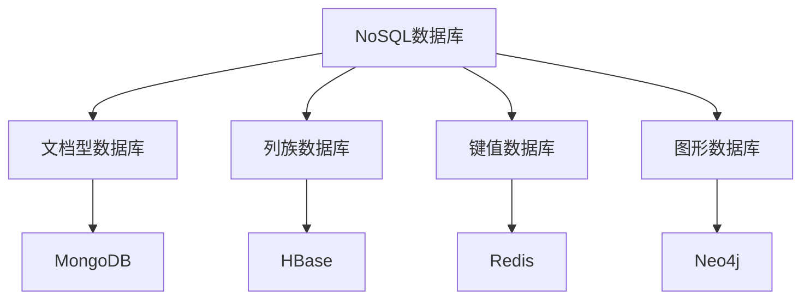

                 

# NoSQL数据库：处理非结构化数据的解决方案

> 关键词：NoSQL数据库, 非结构化数据, 数据库设计, 数据一致性, 性能优化, 分布式系统

## 1. 背景介绍

### 1.1 问题由来
在过去的几十年里，关系型数据库（RDBMS）一直是处理结构化数据的主流选择。然而，随着互联网和数据科技的飞速发展，尤其是移动互联网、大数据和云计算的崛起，传统的RDBMS已经逐渐暴露出其局限性。非结构化数据（如JSON、XML、图形数据等）的急剧增加，以及用户需求的多样化和个性化，使得传统的RDBMS不再能够完全满足数据存储和处理的需求。

### 1.2 问题核心关键点
本节将重点介绍NoSQL数据库的概念、起源和它与传统RDBMS的区别。同时，还会概述当前主流的NoSQL数据库类型，并详细分析NoSQL数据库在处理非结构化数据方面的优势。

## 2. 核心概念与联系

### 2.1 核心概念概述
NoSQL数据库是指不同于传统关系型数据库（RDBMS）的非结构化或半结构化数据存储解决方案。它不依赖于预定义的表结构和数据类型，能够灵活地存储和处理不同类型的数据。NoSQL数据库的类型主要包括文档型数据库、列族数据库、键值数据库和图形数据库等。

### 2.2 核心概念原理和架构的 Mermaid 流程图



### 2.3 核心概念联系
NoSQL数据库的出现是为了解决传统RDBMS在处理非结构化数据方面的不足。与RDBMS相比，NoSQL数据库提供了更高的灵活性、可扩展性和性能，能够更好地支持大数据和高并发的应用场景。

## 3. 核心算法原理 & 具体操作步骤

### 3.1 算法原理概述
NoSQL数据库的核心算法原理主要体现在以下几个方面：

- **数据模型**：NoSQL数据库采用非结构化或半结构化数据模型，如文档、键值对、列族和图形等，与RDBMS的表格结构相比，具有更大的灵活性和多样性。
- **分布式系统**：NoSQL数据库通常采用分布式架构，通过水平扩展而非垂直扩展来提高系统的性能和可扩展性。
- **数据一致性**：NoSQL数据库提供了多种数据一致性模型，如最终一致性、强一致性和软一致性等，以适应不同应用场景的需求。
- **性能优化**：NoSQL数据库通过索引、缓存、负载均衡等技术手段，显著提高了系统的读写性能和吞吐量。

### 3.2 算法步骤详解
NoSQL数据库的典型操作步骤包括数据模型设计、数据存储和访问、性能调优和安全管理等。以下是详细的操作步骤：

1. **数据模型设计**：根据应用需求选择合适的NoSQL数据库类型，并设计相应的数据模型，如文档型数据库的集合（Collection）、列族数据库的列族（Column Family）等。
2. **数据存储和访问**：使用NoSQL数据库提供的API和工具，进行数据的存储、检索、更新和删除等操作。
3. **性能调优**：通过索引优化、缓存策略、分区策略等技术手段，提高系统的性能和可用性。
4. **安全管理**：实施访问控制、数据加密、审计日志等安全措施，保障数据安全和系统稳定。

### 3.3 算法优缺点
NoSQL数据库相较于传统RDBMS，具有以下优点：

- **高可扩展性**：NoSQL数据库能够水平扩展，支持海量数据的存储和处理。
- **高性能**：采用分布式架构和优化算法，能够提供更高的并发和吞吐量。
- **灵活性**：非结构化或半结构化数据模型，适合存储多样化的数据类型。

同时，NoSQL数据库也存在一些缺点：

- **数据一致性问题**：强一致性和弱一致性的选择会影响系统性能和可用性。
- **复杂性高**：缺乏标准化的SQL查询语言，使用和维护难度较大。
- **缺乏事务支持**：部分NoSQL数据库不支持ACID事务，可能影响数据一致性。

### 3.4 算法应用领域
NoSQL数据库的应用领域非常广泛，涵盖了大数据、实时分析、云计算、物联网、社交媒体等多个领域。以下是几个典型应用场景：

- **大数据存储**：适用于处理大规模非结构化数据，如日志、文档、图像等。
- **实时数据处理**：适用于需要高并发、低延迟的数据处理任务，如实时流处理、实时查询等。
- **云计算平台**：在云环境中提供高效的存储和计算服务，支持弹性伸缩和资源共享。
- **社交媒体**：用于存储和处理社交网络数据，支持用户关系分析和内容推荐等。

## 4. 数学模型和公式 & 详细讲解 & 举例说明

### 4.1 数学模型构建
本节将通过具体的数学模型来解释NoSQL数据库的核心原理。以文档型数据库为例，其核心数据模型可以表示为：

$$
\text{Data} = \{\text{document}_1, \text{document}_2, ..., \text{document}_n\}
$$

其中，每个文档（Document）可以表示为一个键值对的集合：

$$
\text{Document}_i = \{(k_1,v_1), (k_2,v_2), ..., (k_m,v_m)\}
$$

### 4.2 公式推导过程
假设有一个包含100万条记录的文档集合，需要设计一个索引来加速查询。假定使用B树索引，每个节点包含50个键值对，则整个索引树的高度为：

$$
\text{Height} = \lceil \log_2 (1000000) \rceil = 20
$$

计算一个查询需要遍历的节点数：

$$
\text{Nodes} = 2^{Height} = 2^{20} \approx 1048576
$$

对于其他NoSQL数据库，如列族数据库和键值数据库，其数学模型和索引设计也有各自的特点和优化算法。

### 4.3 案例分析与讲解
以MongoDB为例，MongoDB是一个流行的文档型数据库，支持灵活的数据模型和丰富的查询语言。其核心数据模型和查询操作如下：

- **数据模型**：MongoDB使用BSON格式存储文档，每个文档由多个字段组成。例如：

  ```json
  {
      "name": "John",
      "age": 30,
      "address": {
          "city": "New York",
          "country": "USA"
      }
  }
  ```

- **查询操作**：MongoDB支持多种查询语言，如SQL-like查询、正则表达式查询、聚合查询等。例如：

  ```python
  # SQL-like查询
  db.collection.find({ "age": { "$gt": 30 } })

  # 正则表达式查询
  db.collection.find({ "name": /^Joh/ })

  # 聚合查询
  db.collection.aggregate([
      { "$match": { "age": { "$gt": 30 } },
      { "$group": { "_id": "$name", "count": { "$sum": 1 } }
  ])
  ```

通过这些查询操作，MongoDB能够灵活地处理各种数据类型和查询需求。

## 5. 项目实践：代码实例和详细解释说明

### 5.1 开发环境搭建
在开始NoSQL数据库的开发实践之前，需要先准备好开发环境。以下是在Python中进行MongoDB开发的环境配置流程：

1. 安装MongoDB：从官网下载安装MongoDB二进制文件，并进行安装。
2. 安装PyMongo：使用pip安装PyMongo库，它是Python官方提供的MongoDB客户端。

```bash
pip install pymongo
```

3. 创建MongoDB数据库和集合：

```python
from pymongo import MongoClient

client = MongoClient("mongodb://localhost:27017")
db = client["mydatabase"]
collection = db["mycollection"]
```

### 5.2 源代码详细实现
以下是一个使用PyMongo对MongoDB进行文档型数据存储和查询的Python代码实现：

```python
from pymongo import MongoClient
from bson.objectid import ObjectId

# 连接MongoDB数据库
client = MongoClient("mongodb://localhost:27017")
db = client["mydatabase"]
collection = db["mycollection"]

# 插入一条文档
document = {
    "name": "John",
    "age": 30,
    "address": {
        "city": "New York",
        "country": "USA"
    }
}
_id = ObjectId()
collection.insert_one(document, {"_id": _id})

# 查询所有文档
documents = collection.find()
for doc in documents:
    print(doc)

# 查询特定文档
query = {"name": "John"}
document = collection.find_one(query)
print(document)

# 更新文档
query = {"name": "John"}
new_values = {"$set": {"age": 31}}
collection.update_one(query, new_values)

# 删除文档
query = {"name": "John"}
collection.delete_one(query)
```

### 5.3 代码解读与分析
上述代码展示了MongoDB的基本操作，包括文档插入、查询、更新和删除等。其中，`ObjectId`用于生成唯一的文档ID，`find`和`find_one`用于查询文档，`insert_one`和`update_one`用于插入和更新文档，`delete_one`用于删除文档。

### 5.4 运行结果展示
运行上述代码，可以在MongoDB中创建一个名为`mycollection`的集合，并插入一条文档。然后，通过查询操作获取所有文档和特定文档，并进行更新和删除。

```python
# 插入一条文档
{
    "_id": ObjectId("5e24aab1b7f6c9d88b9c12af"),
    "name": "John",
    "age": 30,
    "address": {
        "city": "New York",
        "country": "USA"
    }
}

# 查询所有文档
{
    "_id": ObjectId("5e24aab1b7f6c9d88b9c12af"),
    "name": "John",
    "age": 30,
    "address": {
        "city": "New York",
        "country": "USA"
    }
}

# 查询特定文档
{
    "_id": ObjectId("5e24aab1b7f6c9d88b9c12af"),
    "name": "John",
    "age": 30,
    "address": {
        "city": "New York",
        "country": "USA"
    }
}

# 更新文档
{
    "_id": ObjectId("5e24aab1b7f6c9d88b9c12af"),
    "name": "John",
    "age": 31,
    "address": {
        "city": "New York",
        "country": "USA"
    }
}

# 删除文档
None
```

## 6. 实际应用场景

### 6.1 电子商务平台

电子商务平台需要处理大量的用户行为数据，包括购买记录、商品评价、搜索历史等。使用NoSQL数据库可以有效地存储和处理这些非结构化数据，支持快速的查询和分析，提高平台的运营效率和用户体验。

在实践中，可以使用MongoDB等文档型数据库来存储用户的订单信息，使用Redis等键值数据库来存储用户的实时访问数据。通过这些NoSQL数据库的灵活查询和聚合操作，平台可以实时生成推荐商品、分析用户行为等应用。

### 6.2 金融数据处理

金融行业需要处理海量的交易数据和用户数据，数据类型包括结构化和非结构化数据。传统的RDBMS难以满足高并发、高吞吐量的需求，而NoSQL数据库能够提供高效的存储和处理能力。

具体而言，可以使用HBase等列族数据库来存储交易数据，使用Redis等键值数据库来缓存实时数据，使用Neo4j等图形数据库来存储用户关系网络。这些NoSQL数据库的结合使用，可以有效地支持金融数据的存储、查询和分析。

### 6.3 物联网设备数据

物联网设备产生的数据种类繁多，包括传感器数据、视频数据、音频数据等。这些非结构化数据需要高效、实时的存储和处理，以支持设备管理和智能分析。

在实践中，可以使用MongoDB等文档型数据库来存储传感器数据，使用HDFS等分布式文件系统来存储大量数据，使用Apache Kafka等消息队列来处理实时数据。通过这些NoSQL数据库的结合使用，可以有效地支持物联网设备的实时数据处理和分析。

### 6.4 未来应用展望

未来，随着数据科技和人工智能的进一步发展，NoSQL数据库的应用领域将更加广泛。以下是一些未来应用展望：

- **实时数据分析**：支持实时数据流处理和实时查询，适用于实时数据分析和决策支持。
- **大数据存储**：支持海量数据的存储和处理，适用于大数据应用和云存储。
- **物联网数据管理**：支持物联网设备的实时数据存储和处理，支持智能分析和设备管理。
- **社交媒体分析**：支持社交媒体数据的存储和分析，适用于用户关系分析和内容推荐。

## 7. 工具和资源推荐

### 7.1 学习资源推荐
为了帮助开发者系统掌握NoSQL数据库的理论基础和实践技巧，这里推荐一些优质的学习资源：

1. 《NoSQL数据库原理与技术》：详细介绍了NoSQL数据库的核心原理和实现技术。
2. MongoDB官方文档：提供了MongoDB的详细API和查询语言，是学习MongoDB的必备资料。
3. Redis官方文档：提供了Redis的详细API和数据类型，是学习Redis的必备资料。
4. Apache Hadoop官方文档：提供了Hadoop的详细架构和数据处理技术，是学习Hadoop的必备资料。
5. Apache Kafka官方文档：提供了Kafka的详细API和消息队列技术，是学习Kafka的必备资料。

通过对这些资源的学习实践，相信你一定能够快速掌握NoSQL数据库的精髓，并用于解决实际的存储和处理问题。

### 7.2 开发工具推荐
以下是几款用于NoSQL数据库开发的常用工具：

1. PyMongo：Python官方提供的MongoDB客户端，提供了丰富的API和工具，方便开发者进行MongoDB的开发。
2. Redis：Redis是一款高性能的键值数据库，提供了丰富的数据类型和操作，支持分布式部署。
3. Hadoop：Apache Hadoop是一个开源的分布式计算框架，支持大规模数据的存储和处理。
4. Kafka：Apache Kafka是一个开源的消息队列系统，支持高吞吐量的数据流处理。

合理利用这些工具，可以显著提升NoSQL数据库的开发效率，加快创新迭代的步伐。

### 7.3 相关论文推荐
NoSQL数据库的研究涉及多个领域，以下是几篇奠基性的相关论文，推荐阅读：

1. "A Survey on NoSQL Database Management Systems"：概述了NoSQL数据库的研究现状和未来趋势。
2. "Design Patterns for NoSQL"：介绍了NoSQL数据库的设计模式和优化技术。
3. "An Overview of Data Models in NoSQL Databases"：详细介绍了NoSQL数据库的数据模型和特点。
4. "NoSQL Databases for Storage and Real-time Processing"：介绍了NoSQL数据库在存储和实时处理方面的应用。

这些论文代表了大规模数据处理技术的发展脉络，通过学习这些前沿成果，可以帮助研究者把握学科前进方向，激发更多的创新灵感。

## 8. 总结：未来发展趋势与挑战

### 8.1 总结
本文对NoSQL数据库的概念、原理和应用进行了全面系统的介绍。首先阐述了NoSQL数据库的起源和与传统RDBMS的区别，明确了NoSQL数据库在处理非结构化数据方面的独特优势。其次，从原理到实践，详细讲解了NoSQL数据库的数学模型和核心算法，给出了NoSQL数据库的完整代码实现。同时，本文还探讨了NoSQL数据库在实际应用中的各种场景和未来发展趋势。

通过本文的系统梳理，可以看到，NoSQL数据库是处理非结构化数据的重要工具，具有高可扩展性、高性能和灵活性等显著优势。未来，随着数据科技和人工智能的进一步发展，NoSQL数据库的应用将更加广泛，成为推动数据存储和处理技术发展的重要力量。

### 8.2 未来发展趋势

展望未来，NoSQL数据库的发展趋势将体现在以下几个方面：

1. **多模型融合**：未来的NoSQL数据库将不再局限于单一数据模型，而是融合多种数据模型和技术，提供更加灵活和全面的数据存储和处理能力。
2. **自动化管理**：随着AI和机器学习技术的发展，NoSQL数据库将实现自动化的管理，包括自动分区、自动负载均衡和自动故障恢复等。
3. **分布式计算**：NoSQL数据库将进一步扩展分布式计算能力，支持大规模数据的分布式存储和处理，适应大规模计算环境的需求。
4. **安全性和隐私保护**：未来的NoSQL数据库将更加注重数据安全和隐私保护，通过访问控制、数据加密和审计日志等技术手段，保障数据安全。

### 8.3 面临的挑战

尽管NoSQL数据库在非结构化数据处理方面具有显著优势，但在实际应用中也面临一些挑战：

1. **数据一致性问题**：NoSQL数据库在强一致性和弱一致性之间存在平衡，如何根据应用需求选择合适的一致性模型是一个挑战。
2. **性能优化**：尽管NoSQL数据库性能优异，但在高并发和低延迟场景下，仍需进行性能调优，避免数据访问瓶颈。
3. **复杂性高**：NoSQL数据库缺乏统一的查询语言和标准化的管理工具，使用和维护难度较大。
4. **缺乏事务支持**：部分NoSQL数据库不支持ACID事务，可能影响数据一致性。

### 8.4 研究展望
未来，NoSQL数据库的研究方向将更加多样化和深入，主要集中在以下几个方面：

1. **多模型融合**：研究多种数据模型的融合技术，提供更全面和灵活的数据存储和处理能力。
2. **自动管理**：研究自动化管理技术，包括自动分区、负载均衡和故障恢复等，提高系统的可操作性和可靠性。
3. **分布式计算**：研究分布式计算技术，提高大规模数据处理能力，支持云平台和大数据应用。
4. **安全性和隐私保护**：研究数据安全和隐私保护技术，保障数据安全，防止数据泄露和滥用。

这些研究方向将进一步推动NoSQL数据库技术的成熟和发展，使其更好地服务于数据存储和处理需求。

## 9. 附录：常见问题与解答

**Q1：NoSQL数据库是否适用于所有非结构化数据存储需求？**

A: NoSQL数据库适用于非结构化或半结构化数据的存储，如JSON、XML、图形数据等。但对于结构化数据，传统RDBMS仍然是更好的选择。

**Q2：NoSQL数据库支持事务吗？**

A: 部分NoSQL数据库（如Cassandra、HBase）支持弱一致性事务，而另一部分（如MongoDB、Redis）不支持事务。选择支持事务的NoSQL数据库时，需根据具体应用需求进行评估。

**Q3：NoSQL数据库如何进行性能优化？**

A: NoSQL数据库的性能优化主要包括以下几个方面：
1. 使用索引：优化查询性能，支持快速的数据检索。
2. 使用缓存：减少数据库的I/O操作，提高读写效率。
3. 使用分区：支持水平扩展，提高系统的可扩展性。
4. 使用负载均衡：平衡负载，避免单点故障。

这些优化策略需要根据具体应用场景进行选择和调整。

**Q4：如何选择合适的NoSQL数据库？**

A: 选择合适的NoSQL数据库需要考虑以下因素：
1. 数据模型：根据数据类型和存储需求选择合适的数据模型。
2. 性能需求：根据数据读写需求和并发量选择合适的数据库。
3. 扩展性：根据数据量和业务发展选择合适的数据库。
4. 成本和维护：考虑数据库的部署成本、维护难度和社区支持。

综合考虑以上因素，选择最符合需求的NoSQL数据库。

**Q5：NoSQL数据库是否需要进行备份和恢复？**

A: NoSQL数据库同样需要进行数据备份和恢复，以防止数据丢失和系统故障。通常，备份和恢复操作与传统RDBMS类似，需要定期进行数据备份，并测试恢复过程。

通过对这些常见问题的解答，可以更好地理解NoSQL数据库的适用场景和实际应用。

