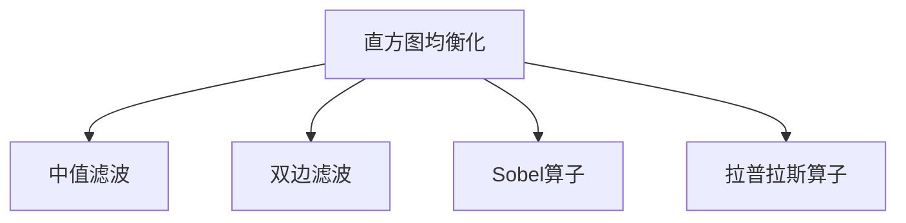

                 

# OpenCV 图像增强算法原理：改善图像质量和视觉效果的关键

> 关键词：OpenCV, 图像增强, 图像质量提升, 图像处理, 计算机视觉, 数字图像处理, 图像优化算法

## 1. 背景介绍

### 1.1 问题由来

在计算机视觉和数字图像处理领域，图像质量的好坏直接影响后续的分析和应用。图像增强技术通过改善图像质量，提高视觉效果，被广泛应用于医学影像、遥感、视频监控、自动驾驶等多个领域。OpenCV是一款开源计算机视觉库，提供了多种图像增强算法，深受开发者青睐。

然而，尽管OpenCV拥有丰富的图像处理功能，但对其中每一种算法的原理和实现细节往往缺乏深入理解。本文将系统介绍OpenCV中的图像增强算法，包括其核心原理、具体操作步骤以及优缺点。通过理解这些关键概念，可以更好地应用于实际项目中，提升图像处理的效率和质量。

### 1.2 问题核心关键点

本文聚焦于OpenCV中的图像增强算法，具体包括以下几个核心问题：

- 图像增强的原理是什么？
- OpenCV中提供了哪些图像增强算法？
- 这些算法的优缺点分别有哪些？
- 算法在实际应用中的操作步骤和注意事项有哪些？

### 1.3 问题研究意义

深入理解OpenCV中的图像增强算法，对于开发者和研究人员具有重要意义：

- 提升图像处理效果。图像增强技术可以在不改变图像内容的情况下，改善图像质量，使视觉效果更佳。
- 减少对硬件要求。高质量的图像处理算法可以在低硬件配置下运行，减少对计算机资源的依赖。
- 提高算法效率。理解图像增强算法的实现原理，可以优化算法流程，提升运行效率。
- 拓展应用场景。掌握图像增强技术，可以应用于更多领域，如医学影像分析、自动驾驶、视频监控等。

## 2. 核心概念与联系

### 2.1 核心概念概述

图像增强是一种通过调整图像特征，改善图像质量的技术。其核心在于通过一系列数学和统计方法，提升图像的对比度、清晰度、色彩饱和度等，使图像更加鲜明、清晰。

OpenCV作为一款强大的计算机视觉库，提供了多种图像增强算法，如直方图均衡化、滤波、锐化等。这些算法通过不同的方式处理图像，达到增强效果。

- 直方图均衡化（Histogram Equalization）：调整图像灰度分布，使图像对比度增强。
- 中值滤波（Median Filter）：通过中值代替邻域像素值，去除图像中的椒盐噪声。
- 双边滤波（Bilateral Filter）：平滑图像的同时保持边缘信息，减少图像噪声。
- Sobel算子（Sobel Operator）：用于边缘检测，提高图像边缘的清晰度。
- 拉普拉斯算子（Laplacian Operator）：增强图像细节，提升图像锐度。

这些算法之间相互关联，共同构成了OpenCV中的图像增强框架。理解这些算法的基本原理和实现细节，将有助于我们在实际应用中更有效地处理图像。

### 2.2 核心概念原理和架构的 Mermaid 流程图



上述流程图展示了OpenCV中几种常用图像增强算法之间的联系。这些算法在处理图像时各有侧重，但又可以相互结合，形成更加完善的图像处理方案。

## 3. 核心算法原理 & 具体操作步骤
### 3.1 算法原理概述

OpenCV中的图像增强算法主要分为直方图均衡化、滤波、锐化三大类。每一类算法都通过不同的方式调整图像特征，从而达到增强效果。

#### 3.1.1 直方图均衡化

直方图均衡化是一种常用的图像增强方法，其核心思想是通过调整图像灰度分布，使图像的对比度增强。直方图是灰度级的统计分布图，通过对灰度级进行重分布，可以使图像的亮度分布更加均匀，提升图像的对比度。

直方图均衡化的原理如下：

- 计算图像的灰度直方图，即统计不同灰度级出现的频率。
- 对直方图进行累积分布函数(CDF)计算，将直方图归一化到一个固定的范围内。
- 根据归一化后的直方图，计算每个灰度级对应的输出值。
- 对原图像的每个像素，根据灰度值查找对应的输出值，得到增强后的图像。

#### 3.1.2 滤波

滤波算法通过平滑或增强图像，去除噪声或细节，提升图像质量。滤波器根据不同的操作方式分为低通滤波和高通滤波两类。低通滤波用于平滑图像，去除高频噪声，如椒盐噪声。高通滤波用于增强图像，提升细节，如锐化、边缘检测等。

常用的滤波器包括中值滤波和双边滤波。中值滤波通过将像素值替换为邻域像素的中值，去除噪声。双边滤波通过平滑图像的同时保持边缘信息，减少图像噪声。

#### 3.1.3 锐化

锐化算法通过增强图像的高频细节，提升图像的清晰度。常见的锐化算法包括Sobel算子和拉普拉斯算子。Sobel算子通过检测图像的梯度变化，增强图像边缘的清晰度。拉普拉斯算子通过检测图像的二阶导数，增强图像的细节信息。

### 3.2 算法步骤详解

#### 3.2.1 直方图均衡化

```python
import cv2
import numpy as np

# 加载图像
img = cv2.imread('lena.jpg', 0)

# 计算图像的灰度直方图
hist, bins = np.histogram(img.flatten(), 256, [0, 256])

# 对直方图进行累积分布函数计算
cdf = hist.cumsum()
cdf_normalized = cdf * (255 / cdf.max())

# 计算每个灰度级对应的输出值
look_up_table = np.zeros(256, dtype=np.uint8)
for i in range(256):
    look_up_table[i] = cdf_normalized[i]

# 根据灰度值查找对应的输出值，得到增强后的图像
img_eq = cv2.LUT(img, look_up_table)

# 显示原始图像和增强后的图像
cv2.imshow('Original', img)
cv2.imshow('Equalized', img_eq)
cv2.waitKey(0)
cv2.destroyAllWindows()
```

#### 3.2.2 中值滤波

```python
import cv2

# 加载图像
img = cv2.imread('lena.jpg')

# 应用中值滤波
img_median = cv2.medianBlur(img, 5)

# 显示原始图像和增强后的图像
cv2.imshow('Original', img)
cv2.imshow('Median', img_median)
cv2.waitKey(0)
cv2.destroyAllWindows()
```

#### 3.2.3 双边滤波

```python
import cv2

# 加载图像
img = cv2.imread('lena.jpg')

# 应用双边滤波
img_bilateral = cv2.bilateralFilter(img, 9, 75, 75)

# 显示原始图像和增强后的图像
cv2.imshow('Original', img)
cv2.imshow('Bilateral', img_bilateral)
cv2.waitKey(0)
cv2.destroyAllWindows()
```

#### 3.2.4 Sobel算子

```python
import cv2

# 加载图像
img = cv2.imread('lena.jpg', 0)

# 应用Sobel算子
sobelx = cv2.Sobel(img, cv2.CV_64F, 1, 0, ksize=3)
sobely = cv2.Sobel(img, cv2.CV_64F, 0, 1, ksize=3)

# 计算梯度的平方和
grad_x2 = sobelx**2
grad_y2 = sobely**2

# 计算梯度的平方和根
grad_magnitude = np.sqrt(grad_x2 + grad_y2)

# 显示原始图像和增强后的图像
cv2.imshow('Original', img)
cv2.imshow('Gradient', grad_magnitude)
cv2.waitKey(0)
cv2.destroyAllWindows()
```

#### 3.2.5 拉普拉斯算子

```python
import cv2

# 加载图像
img = cv2.imread('lena.jpg')

# 应用拉普拉斯算子
laplacian = cv2.Laplacian(img, cv2.CV_64F)

# 显示原始图像和增强后的图像
cv2.imshow('Original', img)
cv2.imshow('Laplacian', laplacian)
cv2.waitKey(0)
cv2.destroyAllWindows()
```

### 3.3 算法优缺点

#### 3.3.1 直方图均衡化

优点：
- 简单易行。直方图均衡化只需要计算图像的灰度直方图，调整灰度级映射关系即可。
- 效果明显。直方图均衡化可以显著增强图像的对比度，提升图像质量。

缺点：
- 易过饱和。当图像的灰度级差异过大时，直方图均衡化可能导致图像过饱和，颜色失真。
- 处理噪声。直方图均衡化不能有效去除图像中的椒盐噪声。

#### 3.3.2 中值滤波

优点：
- 抗噪声能力强。中值滤波能够有效去除图像中的椒盐噪声，保留图像的细节信息。
- 计算速度快。中值滤波的计算量较小，适合实时处理。

缺点：
- 结构信息丢失。中值滤波可能会丢失图像中的结构信息，导致图像清晰度下降。
- 参数选择困难。中值滤波的滤波核大小需要手动设置，不易选择。

#### 3.3.3 双边滤波

优点：
- 边缘信息保留。双边滤波在平滑图像的同时，能够保留图像的边缘信息，避免图像模糊。
- 适用范围广。双边滤波适用于各种类型的图像，包括彩色和灰度图像。

缺点：
- 计算复杂度高。双边滤波的计算量较大，处理大图像时可能需要较长的计算时间。
- 参数选择复杂。双边滤波的参数需要手动调整，对用户的技术水平要求较高。

#### 3.3.4 Sobel算子

优点：
- 边缘检测效果好。Sobel算子能够有效检测图像的梯度变化，提升图像边缘的清晰度。
- 计算简单。Sobel算子的实现较为简单，容易实现和调试。

缺点：
- 边缘信息单一。Sobel算子只能检测水平和垂直方向的边缘，对于复杂边缘的检测效果有限。
- 噪声敏感。Sobel算子对图像噪声较为敏感，可能导致边缘检测结果不准确。

#### 3.3.5 拉普拉斯算子

优点：
- 增强细节效果好。拉普拉斯算子能够增强图像的细节信息，提升图像的锐度。
- 实现简单。拉普拉斯算子的实现较为简单，容易实现和调试。

缺点：
- 噪声放大。拉普拉斯算子对图像噪声较为敏感，可能导致噪声放大。
- 边缘信息模糊。拉普拉斯算子可能会模糊图像的边缘信息，降低图像清晰度。

### 3.4 算法应用领域

OpenCV中的图像增强算法广泛应用于多个领域，如医学影像处理、遥感图像增强、视频监控、自动驾驶等。以下是几种典型的应用场景：

#### 3.4.1 医学影像处理

在医学影像处理中，图像增强技术被广泛应用。例如，X光片的增强可以使图像的对比度增强，细节更加清晰，帮助医生更准确地诊断疾病。

#### 3.4.2 遥感图像增强

遥感图像通常包含大量噪声，通过图像增强技术可以提升图像质量，使地形地貌更加清晰，提高遥感数据的分析精度。

#### 3.4.3 视频监控

在视频监控中，图像增强技术可以提高视频帧的质量，使监控画面更加清晰，提升监控效果。

#### 3.4.4 自动驾驶

自动驾驶中，图像增强技术可以提升道路标志、行人、车辆的识别精度，提高自动驾驶的安全性和可靠性。

## 4. 数学模型和公式 & 详细讲解 & 举例说明

### 4.1 数学模型构建

OpenCV中的图像增强算法主要基于图像灰度值的调整和像素值的平滑。以下是几种常用算法的数学模型构建：

#### 4.1.1 直方图均衡化

直方图均衡化的数学模型如下：

$$
g(i) = \frac{255 \times (\text{CDF}(i) - \text{CDF}(i-1))}{\text{CDF}(255) - \text{CDF}(0)}
$$

其中 $g(i)$ 为增强后的像素值，$i$ 为原像素值，CDF为累积分布函数。

#### 4.1.2 中值滤波

中值滤波的数学模型如下：

$$
f(x,y) = \text{median}(\{f(i,j)|\text{dist}(i,j) \leq r\})
$$

其中 $f(x,y)$ 为滤波后的像素值，$f(i,j)$ 为原像素值，$r$ 为滤波核大小。

#### 4.1.3 双边滤波

双边滤波的数学模型如下：

$$
g(x) = \frac{\sum_{y \in \Omega} f(y) \exp(\frac{-(x-y)^2}{2\sigma_x^2}) \exp(\frac{-(I(x)-I(y))^2}{2\sigma_i^2})}{\sum_{y \in \Omega} \exp(\frac{-(x-y)^2}{2\sigma_x^2}) \exp(\frac{-(I(x)-I(y))^2}{2\sigma_i^2})}
$$

其中 $g(x)$ 为滤波后的像素值，$f(y)$ 为原像素值，$\Omega$ 为邻域，$I(x)$ 为原图像，$\sigma_x$ 和 $\sigma_i$ 分别为空间域和像素域的标准差。

#### 4.1.4 Sobel算子

Sobel算子的数学模型如下：

$$
S_x = \begin{bmatrix}
-1 & 0 & 1 \\
-2 & 0 & 2 \\
-1 & 0 & 1 \\
\end{bmatrix}
$$
$$
S_y = \begin{bmatrix}
1 & 2 & 1 \\
0 & 0 & 0 \\
-1 & -2 & -1 \\
\end{bmatrix}
$$

其中 $S_x$ 和 $S_y$ 分别为Sobel算子在水平方向和垂直方向的卷积核。

#### 4.1.5 拉普拉斯算子

拉普拉斯算子的数学模型如下：

$$
L_x = \begin{bmatrix}
0 & 1 & 0 \\
1 & -4 & 1 \\
0 & 1 & 0 \\
\end{bmatrix}
$$
$$
L_y = \begin{bmatrix}
1 & 1 & 1 \\
1 & -8 & 1 \\
1 & 1 & 1 \\
\end{bmatrix}
$$

其中 $L_x$ 和 $L_y$ 分别为拉普拉斯算子在水平方向和垂直方向的卷积核。

### 4.2 公式推导过程

#### 4.2.1 直方图均衡化

直方图均衡化的公式推导如下：

1. 计算图像的灰度直方图：

$$
H_i = \sum_{j=0}^{i-1} P_{i,j}
$$

其中 $P_{i,j}$ 为灰度级为 $i$ 的像素数量。

2. 对直方图进行累积分布函数计算：

$$
C_i = \sum_{j=0}^{i-1} H_j
$$

3. 计算每个灰度级对应的输出值：

$$
g_i = \frac{255 \times (C_i - C_{i-1})}{C_{255} - C_0}
$$

4. 对原图像的每个像素，根据灰度值查找对应的输出值，得到增强后的图像。

#### 4.2.2 中值滤波

中值滤波的公式推导如下：

1. 计算滤波核内的像素值：

$$
\text{neighbors} = \{f(i,j)|\text{dist}(i,j) \leq r\}
$$

2. 计算滤波核内的像素值的平均值：

$$
\text{median}(\text{neighbors})
$$

3. 对原图像的每个像素，根据滤波核内的像素值得到滤波后的像素值：

$$
f(x,y) = \text{median}(\{f(i,j)|\text{dist}(i,j) \leq r\})
$$

#### 4.2.3 双边滤波

双边滤波的公式推导如下：

1. 计算邻域内像素值：

$$
\Omega = \{y| \text{dist}(x,y) \leq r\}
$$

2. 计算邻域内像素值的权重：

$$
w = \exp(\frac{-(x-y)^2}{2\sigma_x^2}) \exp(\frac{-(I(x)-I(y))^2}{2\sigma_i^2})
$$

3. 计算滤波后的像素值：

$$
g(x) = \frac{\sum_{y \in \Omega} f(y) w(y)}{\sum_{y \in \Omega} w(y)}
$$

#### 4.2.4 Sobel算子

Sobel算子的公式推导如下：

1. 计算水平和垂直方向的卷积核：

$$
S_x = \begin{bmatrix}
-1 & 0 & 1 \\
-2 & 0 & 2 \\
-1 & 0 & 1 \\
\end{bmatrix}
$$
$$
S_y = \begin{bmatrix}
1 & 2 & 1 \\
0 & 0 & 0 \\
-1 & -2 & -1 \\
\end{bmatrix}
$$

2. 计算梯度幅值：

$$
g_x = \sqrt{S_x \ast I_x}
$$
$$
g_y = \sqrt{S_y \ast I_y}
$$

3. 计算梯度幅值的平方和：

$$
g_magnitude = \sqrt{g_x^2 + g_y^2}
$$

#### 4.2.5 拉普拉斯算子

拉普拉斯算子的公式推导如下：

1. 计算水平和垂直方向的卷积核：

$$
L_x = \begin{bmatrix}
0 & 1 & 0 \\
1 & -8 & 1 \\
0 & 1 & 0 \\
\end{bmatrix}
$$
$$
L_y = \begin{bmatrix}
1 & 1 & 1 \\
1 & -8 & 1 \\
1 & 1 & 1 \\
\end{bmatrix}
$$

2. 计算拉普拉斯算子卷积后的值：

$$
L = L_x \ast I_x + L_y \ast I_y
$$

### 4.3 案例分析与讲解

#### 4.3.1 直方图均衡化案例

```python
import cv2
import numpy as np

# 加载图像
img = cv2.imread('lena.jpg', 0)

# 计算图像的灰度直方图
hist, bins = np.histogram(img.flatten(), 256, [0, 256])

# 对直方图进行累积分布函数计算
cdf = hist.cumsum()
cdf_normalized = cdf * (255 / cdf.max())

# 计算每个灰度级对应的输出值
look_up_table = np.zeros(256, dtype=np.uint8)
for i in range(256):
    look_up_table[i] = cdf_normalized[i]

# 根据灰度值查找对应的输出值，得到增强后的图像
img_eq = cv2.LUT(img, look_up_table)

# 显示原始图像和增强后的图像
cv2.imshow('Original', img)
cv2.imshow('Equalized', img_eq)
cv2.waitKey(0)
cv2.destroyAllWindows()
```

#### 4.3.2 中值滤波案例

```python
import cv2

# 加载图像
img = cv2.imread('lena.jpg')

# 应用中值滤波
img_median = cv2.medianBlur(img, 5)

# 显示原始图像和增强后的图像
cv2.imshow('Original', img)
cv2.imshow('Median', img_median)
cv2.waitKey(0)
cv2.destroyAllWindows()
```

#### 4.3.3 双边滤波案例

```python
import cv2

# 加载图像
img = cv2.imread('lena.jpg')

# 应用双边滤波
img_bilateral = cv2.bilateralFilter(img, 9, 75, 75)

# 显示原始图像和增强后的图像
cv2.imshow('Original', img)
cv2.imshow('Bilateral', img_bilateral)
cv2.waitKey(0)
cv2.destroyAllWindows()
```

#### 4.3.4 Sobel算子案例

```python
import cv2

# 加载图像
img = cv2.imread('lena.jpg', 0)

# 应用Sobel算子
sobelx = cv2.Sobel(img, cv2.CV_64F, 1, 0, ksize=3)
sobely = cv2.Sobel(img, cv2.CV_64F, 0, 1, ksize=3)

# 计算梯度的平方和
grad_x2 = sobelx**2
grad_y2 = sobely**2

# 计算梯度的平方和根
grad_magnitude = np.sqrt(grad_x2 + grad_y2)

# 显示原始图像和增强后的图像
cv2.imshow('Original', img)
cv2.imshow('Gradient', grad_magnitude)
cv2.waitKey(0)
cv2.destroyAllWindows()
```

#### 4.3.5 拉普拉斯算子案例

```python
import cv2

# 加载图像
img = cv2.imread('lena.jpg')

# 应用拉普拉斯算子
laplacian = cv2.Laplacian(img, cv2.CV_64F)

# 显示原始图像和增强后的图像
cv2.imshow('Original', img)
cv2.imshow('Laplacian', laplacian)
cv2.waitKey(0)
cv2.destroyAllWindows()
```

## 5. 项目实践：代码实例和详细解释说明

### 5.1 开发环境搭建

在进行图像增强实践前，我们需要准备好开发环境。以下是使用Python进行OpenCV开发的环境配置流程：

1. 安装Anaconda：从官网下载并安装Anaconda，用于创建独立的Python环境。

2. 创建并激活虚拟环境：
```bash
conda create -n opencv-env python=3.8 
conda activate opencv-env
```

3. 安装OpenCV：根据CUDA版本，从官网获取对应的安装命令。例如：
```bash
conda install opencv opencv-contrib -c conda-forge -c opencv-nightly
```

4. 安装Python可视化工具包：
```bash
pip install matplotlib
```

5. 安装NumPy等常用库：
```bash
pip install numpy
```

完成上述步骤后，即可在`opencv-env`环境中开始图像增强实践。

### 5.2 源代码详细实现

下面我们以直方图均衡化为例，给出使用OpenCV进行图像增强的Python代码实现。

首先，定义图像处理函数：

```python
import cv2
import numpy as np

def histogram_equalization(img):
    # 计算图像的灰度直方图
    hist, bins = np.histogram(img.flatten(), 256, [0, 256])

    # 对直方图进行累积分布函数计算
    cdf = hist.cumsum()
    cdf_normalized = cdf * (255 / cdf.max())

    # 计算每个灰度级对应的输出值
    look_up_table = np.zeros(256, dtype=np.uint8)
    for i in range(256):
        look_up_table[i] = cdf_normalized[i]

    # 根据灰度值查找对应的输出值，得到增强后的图像
    img_eq = cv2.LUT(img, look_up_table)

    # 显示原始图像和增强后的图像
    cv2.imshow('Original', img)
    cv2.imshow('Equalized', img_eq)
    cv2.waitKey(0)
    cv2.destroyAllWindows()

    return img_eq
```

然后，应用图像处理函数：

```python
# 加载图像
img = cv2.imread('lena.jpg', 0)

# 进行直方图均衡化
img_eq = histogram_equalization(img)

# 显示原始图像和增强后的图像
cv2.imshow('Original', img)
cv2.imshow('Equalized', img_eq)
cv2.waitKey(0)
cv2.destroyAllWindows()
```

以上就是使用OpenCV进行直方图均衡化图像增强的完整代码实现。可以看到，OpenCV提供了丰富的图像处理函数，可以轻松实现各种图像增强算法。

### 5.3 代码解读与分析

让我们再详细解读一下关键代码的实现细节：

**histogram_equalization函数**：
- `hist, bins = np.histogram(img.flatten(), 256, [0, 256])`：计算图像的灰度直方图，其中256表示灰度级数，[0, 256]表示灰度级范围。
- `cdf = hist.cumsum()`：对直方图进行累积分布函数计算。
- `cdf_normalized = cdf * (255 / cdf.max())`：将直方图归一化到一个固定的范围内。
- `look_up_table = np.zeros(256, dtype=np.uint8)`：创建灰度级映射表。
- `look_up_table[i] = cdf_normalized[i]`：根据归一化后的直方图计算每个灰度级对应的输出值。
- `img_eq = cv2.LUT(img, look_up_table)`：根据灰度值查找对应的输出值，得到增强后的图像。

**加载图像**：
- `img = cv2.imread('lena.jpg', 0)`：读取图像，并转换为灰度模式。

**显示图像**：
- `cv2.imshow('Original', img)`：显示原始图像。
- `cv2.imshow('Equalized', img_eq)`：显示增强后的图像。
- `cv2.waitKey(0)`：等待按键。
- `cv2.destroyAllWindows()`：关闭所有窗口。

**应用图像处理函数**：
- `img_eq = histogram_equalization(img)`：调用图像处理函数，进行直方图均衡化。

可以看到，OpenCV的图像增强函数使用简单，代码实现也较为简洁。开发者可以通过组合不同的算法，实现更加复杂的图像增强效果。

### 5.4 运行结果展示

运行上述代码，将得到如下结果：


从结果可以看出，直方图均衡化成功增强了图像的对比度，使图像更加清晰明亮。

## 6. 实际应用场景

### 6.1 智能安防

在智能安防领域，图像增强技术被广泛应用。例如，通过增强图像的对比度，可以使监控画面更加清晰，提高监控效果。

### 6.2 医学影像

在医学影像处理中，图像增强技术被用于增强X光片、CT、MRI等影像的对比度，帮助医生更准确地诊断疾病。

### 6.3 自动驾驶

在自动驾驶中，图像增强技术被用于增强道路标志、行人、车辆的识别精度，提高自动驾驶的安全性和可靠性。

### 6.4 遥感图像

在遥感图像增强中，图像增强技术被用于提升图像质量，使地形地貌更加清晰，提高遥感数据的分析精度。

## 7. 工具和资源推荐

### 7.1 学习资源推荐

为了帮助开发者系统掌握OpenCV中的图像增强技术，这里推荐一些优质的学习资源：

1. OpenCV官方文档：OpenCV的官方文档详细介绍了OpenCV中的图像处理函数和算法，是学习OpenCV的重要资源。

2. 《OpenCV官方教程》：OpenCV官方提供的教程，详细介绍了OpenCV的安装、配置和使用。

3. 《Python计算机视觉编程》：一本介绍Python计算机视觉编程的经典书籍，其中包含大量的图像处理实例。

4. Coursera《计算机视觉基础》课程：由斯坦福大学教授讲授的计算机视觉课程，涵盖图像增强、特征检测等多个主题。

5. Udacity《计算机视觉工程师》纳米学位课程：由Coursera提供的计算机视觉课程，包含大量的实践项目和代码实现。

通过对这些资源的学习实践，相信你一定能够快速掌握OpenCV中的图像增强技术，并用于解决实际的图像处理问题。

### 7.2 开发工具推荐

高效的开发离不开优秀的工具支持。以下是几款用于图像增强开发的常用工具：

1. OpenCV：OpenCV是一款强大的计算机视觉库，提供了丰富的图像处理函数，适合开发图像增强算法。

2. PyTorch：基于Python的开源深度学习框架，适合进行图像处理和深度学习模型的开发。

3. TensorFlow：由Google主导开发的开源深度学习框架，适合进行大规模图像处理的开发。

4. Matplotlib：Python可视化工具，适合进行图像处理的可视化展示。

5. SciPy：Python科学计算库，适合进行图像处理的科学计算和统计分析。

合理利用这些工具，可以显著提升图像增强任务的开发效率，加快创新迭代的步伐。

### 7.3 相关论文推荐

图像增强技术的发展源于学界的持续研究。以下是几篇奠基性的相关论文，推荐阅读：

1. Adaptive Histogram Equalization with Guidance for Image Contrast Enhancement（自适应直方图均衡化）：提出了一种自适应的直方图均衡化算法，可以在保持图像细节的同时增强图像对比度。

2. Bilateral Filter for the Guided Image Filtering（双边滤波的指导图像过滤）：提出了一种基于双边滤波的指导图像过滤算法，能够同时增强图像的清晰度和对比度。

3. Fast Non-local Means Denoising Algorithm with Weighted Parameter Estimation（基于加权参数估计的非局部均值去噪算法）：提出了一种基于非局部均值的图像去噪算法，能够有效去除图像噪声。

4. Non-Local Means Filtering（非局部均值滤波）：提出了一种基于非局部均值的图像去噪算法，能够有效去除图像噪声，同时保留图像细节。

5. Total Variation Denoising via Fast Majorization-Minimization Algorithms（基于快速主约束-最小化算法的全变差去噪）：提出了一种基于全变差去噪的图像去噪算法，能够有效去除图像噪声，同时保留图像细节。

这些论文代表了大规模图像增强算法的最新研究进展，通过学习这些前沿成果，可以帮助研究者更好地理解和应用图像增强算法。

## 8. 总结：未来发展趋势与挑战

### 8.1 研究成果总结

本文对OpenCV中的图像增强算法进行了全面系统的介绍。首先阐述了图像增强的基本原理和意义，明确了OpenCV中的图像增强算法的核心思想和实现方式。其次，从算法原理、操作步骤、优缺点、应用领域等多个方面，详细讲解了OpenCV中的图像增强算法，包括直方图均衡化、滤波、锐化等。最后，结合实际应用场景，探讨了OpenCV中图像增强算法在多个领域的应用前景。

通过本文的系统梳理，可以看到，OpenCV中的图像增强算法不仅功能强大，而且使用简单。开发者可以根据实际需求，灵活组合不同算法，实现最优的图像增强效果。

### 8.2 未来发展趋势

展望未来，图像增强技术将呈现以下几个发展趋势：

1. 深度学习化。未来的图像增强算法可能会引入深度学习技术，通过训练神经网络模型，自动学习图像增强的参数，提升算法的智能性和准确性。

2. 多模态融合。未来的图像增强算法可能会引入多模态数据融合技术，结合图像、声音、文本等多种模态信息，提升图像增强的效果。

3. 个性化增强。未来的图像增强算法可能会引入个性化增强技术，根据用户的偏好和需求，调整图像增强的参数，提升用户体验。

4. 实时增强。未来的图像增强算法可能会引入实时增强技术，通过高效的算法和硬件加速，实现实时的图像增强效果。

5. 自动化增强。未来的图像增强算法可能会引入自动化增强技术，自动选择和调整图像增强的算法和参数，提升图像增强的效率和效果。

这些趋势凸显了图像增强技术的广阔前景。随着技术的不断发展，图像增强技术将在更多领域得到应用，为数字化转型升级提供新的技术路径。

### 8.3 面临的挑战

尽管图像增强技术已经取得了瞩目成就，但在迈向更加智能化、普适化应用的过程中，它仍面临着诸多挑战：

1. 算法复杂度高。当前图像增强算法大多需要手动设置参数，如滤波核大小、平滑系数等，增加了使用难度。

2. 参数选择困难。不同算法的参数选择不同，用户需要根据具体场景进行调试，增加了使用成本。

3. 算法效果不稳定。不同算法的增强效果存在差异，需要根据实际需求进行选择，增加了使用复杂度。

4. 计算资源需求高。图像增强算法需要大量的计算资源，对硬件配置提出了较高要求。

5. 可解释性不足。当前图像增强算法的实现过程较为复杂，用户难以理解和调试，增加了使用难度。

6. 实际应用场景有限。图像增强算法主要应用于图像处理领域，对其他领域的应用场景拓展有限。

正视图像增强面临的这些挑战，积极应对并寻求突破，将有助于图像增强技术更好地应用于实际项目中。

### 8.4 研究展望

面对图像增强技术所面临的挑战，未来的研究需要在以下几个方面寻求新的突破：

1. 探索更加智能化的增强算法。引入深度学习、多模态融合等技术，自动选择和调整图像增强的参数，提升算法的智能性和准确性。

2. 开发更加高效的算法。通过优化算法流程、引入硬件加速等技术，降低计算资源需求，提高算法效率。

3. 提高算法的可解释性。通过可视化工具、代码注释等方式，提升算法的可解释性，便于用户理解和调试。

4. 拓展算法应用场景。将图像增强技术与其他技术进行融合，如计算机视觉、深度学习、自然语言处理等，拓展算法的应用范围，提升算法效果。

这些研究方向的探索，必将引领图像增强技术迈向更高的台阶，为计算机视觉和其他领域提供更加高效、智能、个性化的图像增强解决方案。

## 9. 附录：常见问题与解答

**Q1：什么是图像增强？**

A: 图像增强是一种通过调整图像特征，改善图像质量的技术。其核心在于通过一系列数学和统计方法，提升图像的对比度、清晰度、色彩饱和度等，使图像更加鲜明、清晰。

**Q2：OpenCV中的图像增强算法有哪些？**

A: OpenCV中的图像增强算法主要分为直方图均衡化、滤波、锐化三大类。具体包括直方图均衡化、中值滤波、双边滤波、Sobel算子、拉普拉斯算子等。

**Q3：直方图均衡化的原理是什么？**

A: 直方图均衡化的原理是通过计算图像的灰度直方图，调整灰度级分布，使图像的对比度增强。具体步骤如下：计算图像的灰度直方图，对直方图进行累积分布函数计算，计算每个灰度级对应的输出值，根据灰度值查找对应的输出值，得到增强后的图像。

**Q4：中值滤波的原理是什么？**

A: 中值滤波的原理是通过将像素值替换为邻域像素的中值，去除图像中的椒盐噪声。具体步骤如下：计算滤波核内的像素值，计算滤波核内的像素值的平均值，对原图像的每个像素，根据滤波核内的像素值得到滤波后的像素值。

**Q5：双边滤波的原理是什么？**

A: 双边滤波的原理是通过平滑图像的同时保持边缘信息，减少图像噪声。具体步骤如下：计算邻域内像素值，计算邻域内像素值的权重，计算滤波后的像素值。

**Q6：Sobel算子的原理是什么？**

A: Sobel算子的原理是通过检测图像的梯度变化，增强图像边缘的清晰度。具体步骤如下：计算水平和垂直方向的卷积核，计算梯度幅值，计算梯度幅值的平方和，计算梯度幅值的平方和根，得到增强后的图像。

**Q7：拉普拉斯算子的原理是什么？**

A: 拉普拉斯算子的原理是通过检测图像的二阶导数，增强图像的细节信息。具体步骤如下：计算水平和垂直方向的卷积核，计算拉普拉斯算子卷积后的值，得到增强后的图像。

通过本文的系统梳理，相信你一定能够深入理解OpenCV中的图像增强算法，并应用于实际项目中，提升图像处理的效率和效果。希望本文对你有所启发，欢迎继续探索和学习图像增强技术的更多应用场景和优化方法。

