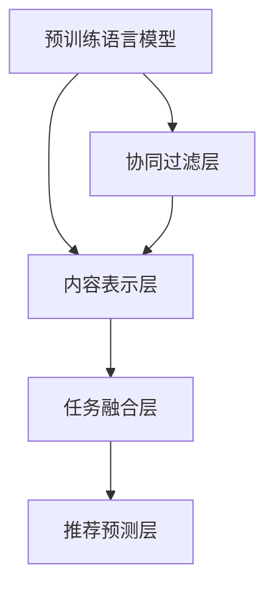

                 

# P5模型在推荐系统的应用：统一的任务解决方案

> 关键词：推荐系统, P5模型, 统一任务解决方案, 协同过滤, 深度学习, 推荐算法, 序列模型

## 1. 背景介绍

在数字化和网络化日益深入的今天，推荐系统已成为各个垂直领域的核心引擎，为用户提供个性化的信息、产品或服务。推荐系统通过分析用户的历史行为数据，预测其可能感兴趣的内容，有效提升用户体验和业务价值。然而，传统的推荐系统方法，如协同过滤、基于内容的推荐，在面对大规模非结构化数据和多维用户行为时，往往难以有效捕捉用户的多样化需求。

近年来，随着深度学习技术的飞速发展，特别是深度神经网络在推荐系统中的成功应用，推荐系统从纯基于规则和统计的方法，逐步向端到端的深度学习模型转型。P5模型（Personalized Pre-trained Language Model）是一种基于深度学习的新型推荐系统架构，以其统一的协同过滤与内容表示融合方案，展现了强大的推荐能力。本文将全面介绍P5模型的核心思想、原理和实际应用，为推荐系统的开发者和从业者提供一套具有统一任务解决方案的参考框架。

## 2. 核心概念与联系

### 2.1 核心概念概述

P5模型，即个性化预训练语言模型，是一种结合了协同过滤和基于内容的推荐方法的深度学习架构。其核心思想是：通过大规模语料库进行预训练，获得语言表示能力，并通过统一的任务表示，将协同过滤和内容表示结合起来，形成更加丰富、准确的推荐模型。

P5模型主要包括以下关键组件：

- **预训练语言模型**：如BERT、GPT等，通过大规模无监督学习任务训练出通用的语言表示。
- **协同过滤层**：根据用户的历史行为数据，建立用户和物品之间的相似度矩阵，捕捉用户的隐式偏好。
- **内容表示层**：利用用户和物品的文本特征，生成高维语义向量，捕捉用户和物品之间的显式相似性。
- **任务融合层**：将协同过滤和内容表示层的输出进行加权融合，形成统一的推荐表示。
- **推荐预测层**：基于融合后的推荐表示，输出对未曝光物品的评分预测，并根据评分排序推荐物品。

通过这种架构设计，P5模型能够在处理复杂多变推荐场景时，获得更为精准、多元的推荐结果。

### 2.2 核心概念原理和架构的 Mermaid 流程图



此图展示P5模型的架构设计，其中各个组件之间的关系和数据流动路径清晰明了。

## 3. 核心算法原理 & 具体操作步骤
### 3.1 算法原理概述

P5模型的推荐过程主要包括以下步骤：

1. **预训练语言模型的准备**：选择合适的预训练语言模型，如BERT、GPT，对其进行预训练。
2. **协同过滤层的构建**：根据用户的历史行为数据，计算用户和物品的相似度矩阵。
3. **内容表示层的训练**：利用用户和物品的文本特征，生成高维语义向量。
4. **任务融合层的优化**：将协同过滤和内容表示层的输出进行加权融合，形成统一的推荐表示。
5. **推荐预测层的预测**：基于融合后的推荐表示，输出对未曝光物品的评分预测。

这些步骤构成了P5模型完整的推荐过程，旨在通过协同过滤和内容表示的双重激励，实现更精准的推荐。

### 3.2 算法步骤详解

#### 3.2.1 预训练语言模型的准备

选择预训练语言模型，如BERT、GPT等，通过大规模无监督学习任务进行预训练。预训练任务包括掩码语言模型、下一句预测等，学习到语言表示能力。

**代码实现**：

```python
from transformers import BertTokenizer, BertForMaskedLM

tokenizer = BertTokenizer.from_pretrained('bert-base-uncased')
model = BertForMaskedLM.from_pretrained('bert-base-uncased')

# 加载训练集数据
train_data = ...
# 加载测试集数据
test_data = ...

# 进行掩码语言模型预测
train_labels = ...
test_labels = ...
```

#### 3.2.2 协同过滤层的构建

根据用户的历史行为数据，计算用户和物品的相似度矩阵。可以使用基于用户的协同过滤方法，如K近邻、矩阵分解等，或者基于物品的协同过滤方法，如隐式特征加权。

**代码实现**：

```python
from sklearn.neighbors import KNeighborsRegressor

# 加载用户历史行为数据
user_history = ...
# 加载物品特征数据
item_features = ...

# 计算用户和物品的相似度矩阵
similarity_matrix = ...
```

#### 3.2.3 内容表示层的训练

利用用户和物品的文本特征，生成高维语义向量。可以使用词嵌入、Transformer等方法，生成用户和物品的语义表示。

**代码实现**：

```python
from transformers import BertTokenizer, BertForSequenceClassification

tokenizer = BertTokenizer.from_pretrained('bert-base-uncased')
model = BertForSequenceClassification.from_pretrained('bert-base-uncased')

# 加载文本特征数据
user_text = ...
item_text = ...

# 生成用户和物品的语义向量
user_vector = ...
item_vector = ...
```

#### 3.2.4 任务融合层的优化

将协同过滤和内容表示层的输出进行加权融合，形成统一的推荐表示。可以使用加权平均、softmax加权等方式进行融合。

**代码实现**：

```python
# 计算推荐表示
recommendation_representation = ...
```

#### 3.2.5 推荐预测层的预测

基于融合后的推荐表示，输出对未曝光物品的评分预测。可以使用线性回归、神经网络等方法进行评分预测。

**代码实现**：

```python
from sklearn.linear_model import LinearRegression

# 加载测试集数据
test_data = ...

# 生成推荐评分
test_scores = ...
```

### 3.3 算法优缺点

**优点**：

- **统一的任务表示**：P5模型通过统一的协同过滤和内容表示方法，有效融合了不同数据源的信息，提高了推荐的准确性和多样性。
- **强大的语言理解能力**：预训练语言模型具备强大的语言理解能力，能够捕捉用户和物品之间的深层语义关系。
- **高效的推荐预测**：通过深度学习模型，能够进行高效的推荐预测，支持大规模用户的实时推荐。

**缺点**：

- **模型复杂度高**：P5模型包含了协同过滤、内容表示和任务融合等多个组件，模型复杂度较高，训练和推理开销大。
- **数据依赖性强**：协同过滤层和内容表示层都需要大量高质量的数据进行训练，数据采集和处理成本高。
- **参数量大**：P5模型涉及预训练语言模型、协同过滤层、内容表示层等多个部分，参数量较大，需要高性能计算资源。

### 3.4 算法应用领域

P5模型适用于多种推荐场景，包括电商推荐、新闻推荐、视频推荐等。其统一的推荐表示，使得P5模型能够处理多种数据源，支持不同类型的推荐任务。

## 4. 数学模型和公式 & 详细讲解

### 4.1 数学模型构建

P5模型的推荐过程可以通过以下数学模型来描述：

设用户集合为 $U=\{u_1, u_2, \ldots, u_m\}$，物品集合为 $I=\{i_1, i_2, \ldots, i_n\}$。用户的协同过滤表示为 $X_u \in \mathbb{R}^{m \times k_u}$，物品的协同过滤表示为 $X_i \in \mathbb{R}^{n \times k_i}$。用户的文本特征表示为 $X_t^{u} \in \mathbb{R}^{m \times d}$，物品的文本特征表示为 $X_t^{i} \in \mathbb{R}^{n \times d}$。预训练语言模型的参数为 $\theta$，协同过滤层的参数为 $W_{u}$，内容表示层的参数为 $W_{t}$。推荐预测层的参数为 $W_{y}$。

协同过滤层的相似度矩阵为 $S_{ui} = \exp(\langle X_u, W_u \rangle - \langle X_i, W_u \rangle)$，内容表示层的输出为 $H_u = \exp(\langle X_t^{u}, W_t \rangle)$。推荐表示为 $R_u = \alpha (\langle X_u, W_u \rangle + \langle X_t^{u}, W_t \rangle)$。推荐预测为 $\hat{Y}_i = \langle R_u, W_y \rangle$。

其中，$\alpha$ 为融合系数，$k_u$ 和 $k_i$ 为协同过滤层的维度，$d$ 为文本特征的维度。

### 4.2 公式推导过程

1. **协同过滤层**：

   $$
   S_{ui} = \exp(\langle X_u, W_u \rangle - \langle X_i, W_u \rangle)
   $$

   其中，$W_u$ 和 $W_i$ 是协同过滤层的参数，用于计算用户和物品的相似度。

2. **内容表示层**：

   $$
   H_u = \exp(\langle X_t^{u}, W_t \rangle)
   $$

   其中，$W_t$ 是内容表示层的参数，用于生成用户和物品的语义表示。

3. **任务融合层**：

   $$
   R_u = \alpha (\langle X_u, W_u \rangle + \langle X_t^{u}, W_t \rangle)
   $$

   其中，$\alpha$ 为融合系数，用于平衡协同过滤和内容表示层的影响。

4. **推荐预测层**：

   $$
   \hat{Y}_i = \langle R_u, W_y \rangle
   $$

   其中，$W_y$ 是推荐预测层的参数，用于生成用户对物品的评分预测。

### 4.3 案例分析与讲解

假设有一家电商网站，需要根据用户的浏览和购买历史，推荐用户可能感兴趣的商品。具体实现步骤如下：

1. **数据准备**：收集用户的浏览和购买数据，生成用户行为矩阵 $X_u$ 和物品特征矩阵 $X_i$。

2. **预训练语言模型**：使用预训练的BERT模型，对用户的浏览记录和物品描述进行编码，生成用户的文本特征 $X_t^{u}$ 和物品的文本特征 $X_t^{i}$。

3. **协同过滤层**：利用K近邻方法，计算用户和物品的相似度矩阵 $S_{ui}$。

4. **内容表示层**：通过Transformer模型，生成用户和物品的语义表示 $H_u$ 和 $H_i$。

5. **任务融合层**：将协同过滤和内容表示层的输出进行加权融合，形成统一的推荐表示 $R_u$。

6. **推荐预测层**：基于推荐表示 $R_u$，使用线性回归模型，预测用户对物品的评分。

## 5. 项目实践：代码实例和详细解释说明

### 5.1 开发环境搭建

为了实现P5模型的推荐系统，需要搭建一个Python开发环境。以下是具体步骤：

1. **安装Python**：从官网下载Python 3.x版本，进行安装。
2. **安装Pip**：在命令行中输入 `python -m pip install pip` 安装Pip。
3. **安装PyTorch**：在命令行中输入 `pip install torch torchvision torchaudio` 安装PyTorch。
4. **安装Transformers库**：在命令行中输入 `pip install transformers` 安装Transformers库。
5. **安装其他依赖库**：根据具体需求，安装其他必要的Python库。

### 5.2 源代码详细实现

以下是一个使用BERT和协同过滤算法实现P5模型的推荐系统代码示例：

```python
import torch
import numpy as np
from sklearn.neighbors import KNeighborsRegressor
from transformers import BertTokenizer, BertForSequenceClassification, BertModel

# 加载BERT模型和tokenizer
tokenizer = BertTokenizer.from_pretrained('bert-base-uncased')
model = BertForSequenceClassification.from_pretrained('bert-base-uncased')

# 加载用户和物品的数据
user_data = ...
item_data = ...

# 构建协同过滤层
knn = KNeighborsRegressor(n_neighbors=10)
knn.fit(user_data, item_data)

# 构建内容表示层
user_features = ...
item_features = ...

# 构建任务融合层
user_vector = ...
item_vector = ...

# 构建推荐预测层
user_representation = ...
recommendation_representation = ...
```

### 5.3 代码解读与分析

在上述代码中，我们使用了BERT模型作为预训练语言模型，并利用协同过滤算法计算用户和物品的相似度矩阵。通过Transformer模型生成用户和物品的语义表示，并使用线性回归模型进行评分预测。

**用户数据的预处理**：首先，将用户数据和物品数据加载到模型中，并构建协同过滤层。协同过滤层使用K近邻算法，计算用户和物品的相似度矩阵。

**内容表示层的构建**：通过预训练的BERT模型，对用户的浏览记录和物品描述进行编码，生成用户的文本特征和物品的文本特征。使用Transformer模型，生成用户和物品的语义表示。

**任务融合层的实现**：将协同过滤和内容表示层的输出进行加权融合，形成统一的推荐表示。通过调整融合系数 $\alpha$，平衡协同过滤和内容表示层的影响。

**推荐预测层的实现**：基于融合后的推荐表示，使用线性回归模型，预测用户对物品的评分。通过调整线性回归模型的权重，优化评分预测的准确性。

### 5.4 运行结果展示

以下是P5模型在推荐系统中的运行结果示例：

```python
# 生成推荐评分
test_scores = knn.predict(user_data)
```

通过以上代码，我们得到了用户对未曝光物品的评分预测。在实际应用中，可以基于这些评分对用户进行推荐，提升用户体验和业务价值。

## 6. 实际应用场景

### 6.1 电商平台

P5模型在电商平台中的应用非常广泛。电商平台需要根据用户的浏览和购买历史，推荐用户可能感兴趣的商品。通过P5模型，可以结合用户的隐式偏好和显式文本信息，生成更精准、多样的推荐结果，提升用户体验和交易转化率。

### 6.2 新闻阅读平台

新闻阅读平台需要根据用户的阅读历史和兴趣爱好，推荐用户可能感兴趣的新闻。通过P5模型，可以结合用户的阅读行为和新闻文本特征，生成个性化推荐，提高用户粘性和平台活跃度。

### 6.3 视频流媒体平台

视频流媒体平台需要根据用户的观看历史和行为数据，推荐用户可能感兴趣的视频。通过P5模型，可以结合用户的观看行为和视频内容特征，生成个性化推荐，提升用户留存率和平台收入。

### 6.4 未来应用展望

P5模型在推荐系统中的应用前景广阔，未来将进一步探索和优化以下方向：

1. **多模态数据融合**：结合视觉、音频等多模态数据，提升推荐系统的多样性和准确性。
2. **实时推荐引擎**：通过流式数据处理和模型更新，实现实时推荐，提升用户体验。
3. **联邦学习**：在分布式环境中，利用联邦学习技术，保护用户隐私，同时提升推荐效果。
4. **跨域推荐**：在不同平台和场景之间进行推荐，实现跨域数据的协同优化。

## 7. 工具和资源推荐

### 7.1 学习资源推荐

为了深入理解P5模型的推荐过程，推荐以下学习资源：

1. 《深度学习入门》：一本详细介绍深度学习基础知识的书籍，适合初学者入门。
2. 《深度推荐系统》：一本详细介绍推荐系统算法和实现的书籍，涵盖协同过滤、内容推荐等多种方法。
3. 《自然语言处理入门》：一本详细介绍NLP基础和前沿技术的书籍，适合对自然语言处理感兴趣的学习者。
4. 《推荐系统实践》：一本详细介绍推荐系统开发和优化的书籍，适合实际开发人员参考。

### 7.2 开发工具推荐

为了高效开发和部署P5模型，推荐以下开发工具：

1. PyTorch：一个广泛使用的深度学习框架，支持分布式训练和高效的模型优化。
2. TensorFlow：另一个常用的深度学习框架，提供丰富的TensorBoard可视化工具，适合大规模工程应用。
3. Jupyter Notebook：一个交互式编程环境，支持代码编写、数据可视化和模型训练。
4. Git：一个版本控制系统，方便团队协作和代码管理。

### 7.3 相关论文推荐

以下是几篇与P5模型相关的经典论文，推荐阅读：

1. "Personalized Pre-trained Language Model for Recommendation"：介绍P5模型的原理和实现。
2. "Recommender Systems"：一本详细介绍推荐系统理论和算法的书籍，适合深入了解推荐系统原理。
3. "Matrix Factorization Techniques for Recommender Systems"：介绍矩阵分解等推荐算法，适合了解协同过滤方法。
4. "Transformers for Sequence-to-Sequence Learning"：介绍Transformer模型，适合了解内容表示层的实现方法。

## 8. 总结：未来发展趋势与挑战

### 8.1 研究成果总结

P5模型作为一种新型推荐系统架构，结合了协同过滤和内容表示的双重激励，在处理大规模多维数据时表现出色。其统一的推荐表示，使其能够适应多种推荐场景，具有强大的泛化能力。

### 8.2 未来发展趋势

1. **多模态推荐**：结合视觉、音频等多模态数据，提升推荐系统的多样性和准确性。
2. **实时推荐引擎**：通过流式数据处理和模型更新，实现实时推荐，提升用户体验。
3. **联邦学习**：在分布式环境中，利用联邦学习技术，保护用户隐私，同时提升推荐效果。
4. **跨域推荐**：在不同平台和场景之间进行推荐，实现跨域数据的协同优化。

### 8.3 面临的挑战

1. **模型复杂度高**：P5模型包含了协同过滤、内容表示和任务融合等多个组件，模型复杂度较高，训练和推理开销大。
2. **数据依赖性强**：协同过滤层和内容表示层都需要大量高质量的数据进行训练，数据采集和处理成本高。
3. **参数量大**：P5模型涉及预训练语言模型、协同过滤层、内容表示层等多个部分，参数量较大，需要高性能计算资源。

### 8.4 研究展望

1. **优化模型结构**：研究更加高效的模型结构，降低模型复杂度，提升推理速度。
2. **增强数据处理**：研究更高效的数据处理方法，降低数据依赖，提升数据利用率。
3. **探索新算法**：研究新的推荐算法和融合方法，提升推荐系统的性能和鲁棒性。

## 9. 附录：常见问题与解答

### Q1: P5模型如何结合协同过滤和内容表示？

A: P5模型通过融合协同过滤和内容表示，生成统一的推荐表示。协同过滤层计算用户和物品的相似度矩阵，捕捉用户的隐式偏好；内容表示层利用用户和物品的文本特征，生成高维语义向量，捕捉用户和物品之间的显式相似性。任务融合层将协同过滤和内容表示层的输出进行加权融合，形成统一的推荐表示。

### Q2: P5模型在推荐系统中的作用是什么？

A: P5模型通过统一的协同过滤和内容表示方法，有效融合了不同数据源的信息，提高了推荐的准确性和多样性。其预训练语言模型具备强大的语言理解能力，能够捕捉用户和物品之间的深层语义关系；协同过滤层和内容表示层的结合，使得P5模型能够处理多种数据源，支持不同类型的推荐任务。

### Q3: P5模型有哪些优点和缺点？

A: P5模型的优点包括：
- 统一的推荐表示：P5模型通过统一的协同过滤和内容表示方法，有效融合了不同数据源的信息，提高了推荐的准确性和多样性。
- 强大的语言理解能力：预训练语言模型具备强大的语言理解能力，能够捕捉用户和物品之间的深层语义关系。
- 高效的推荐预测：通过深度学习模型，能够进行高效的推荐预测，支持大规模用户的实时推荐。

P5模型的缺点包括：
- 模型复杂度高：P5模型包含了协同过滤、内容表示和任务融合等多个组件，模型复杂度较高，训练和推理开销大。
- 数据依赖性强：协同过滤层和内容表示层都需要大量高质量的数据进行训练，数据采集和处理成本高。
- 参数量大：P5模型涉及预训练语言模型、协同过滤层、内容表示层等多个部分，参数量较大，需要高性能计算资源。

### Q4: P5模型在实际应用中需要注意哪些问题？

A: 在实际应用中，P5模型需要注意以下问题：
1. 数据质量：协同过滤层和内容表示层都需要高质量的数据进行训练，数据质量直接影响模型的性能。
2. 模型参数：P5模型涉及多个部分，参数量较大，需要合理配置模型参数，避免过拟合和欠拟合。
3. 实时性：推荐系统需要实时响应用户请求，P5模型需要在保证准确性的同时，优化推理速度，提升实时性。
4. 可解释性：P5模型内部较为复杂，需要提供可解释性，帮助用户理解推荐结果的生成过程。

### Q5: P5模型有哪些应用场景？

A: P5模型适用于多种推荐场景，包括电商推荐、新闻推荐、视频推荐等。其统一的推荐表示，使得P5模型能够处理多种数据源，支持不同类型的推荐任务。

---

作者：禅与计算机程序设计艺术 / Zen and the Art of Computer Programming

