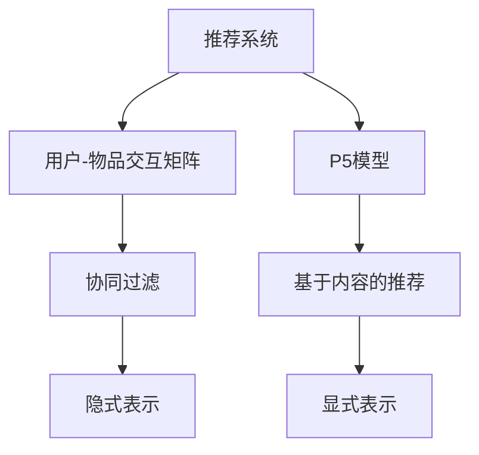

                 

# P5模型在推荐系统的应用：统一的任务解决方案

## 1. 背景介绍

### 1.1 问题由来

推荐系统是人工智能领域的经典任务之一，其核心目标是根据用户的历史行为和兴趣，预测用户对未交互过的物品的偏好，为用户推荐感兴趣的产品或服务。在电商、内容媒体、社交网络等领域，推荐系统已经成为用户获取信息、满足需求的重要工具。

然而，推荐系统的开发和优化面临着诸多挑战。例如：

- 数据稀疏性：用户对物品的交互记录通常非常有限，导致推荐系统难以准确预测用户偏好。
- 长尾问题：用户对小众商品的兴趣通常被忽视，推荐系统需要同时兼顾热门和冷门物品。
- 多维度特征：用户兴趣受多方面因素影响，推荐系统需要综合处理用户属性、行为、时间等维度的信息。
- 动态变化：用户兴趣会随时间推移而变化，推荐系统需要实时更新模型以应对用户行为的变化。
- 社会化影响：用户行为受朋友、社区、流行趋势等社会因素的影响，推荐系统需要考虑社交网络的属性。

针对这些挑战，研究者们提出了多种推荐算法，包括协同过滤、基于内容的推荐、深度学习推荐等。但这些算法往往需要特定的领域知识，难以通用应用于不同类型推荐系统。因此，需要一种统一、通用的推荐模型，以提高算法的可扩展性和鲁棒性。

### 1.2 问题核心关键点

本节将介绍基于用户-物品交互矩阵（User-Item Matrix）的推荐模型P5，讨论其在推荐系统中的统一任务解决方案，并分析其优缺点。

P5模型通过引入多项式特征和交叉特征，克服了传统推荐模型的数据稀疏性问题，在实现上灵活可扩展，适用于各种推荐场景。P5模型融合了用户-物品交互矩阵的隐式表示和协同过滤的显式表示，能够更好地处理多维度特征，提升推荐系统的性能。

## 2. 核心概念与联系

### 2.1 核心概念概述

为更好地理解P5模型在推荐系统中的应用，本节将介绍几个密切相关的核心概念：

- **推荐系统**：根据用户历史行为和兴趣，预测并推荐未交互过的物品的系统。常见的推荐类型包括基于内容的推荐、协同过滤推荐、深度学习推荐等。
- **用户-物品交互矩阵（User-Item Matrix）**：描述用户与物品之间交互关系的矩阵，用户-物品交互频繁的元素值较大，表示用户对物品的偏好。
- **P5模型**：一种基于多项式特征和交叉特征的推荐模型，能够灵活处理用户与物品的交互数据，适用于各种推荐场景。
- **多维特征**：用户的兴趣受多种因素影响，如用户属性、行为、时间、社交关系等。P5模型能够融合多维特征，提升推荐效果。
- **隐式表示和显式表示**：协同过滤方法通常基于用户-物品交互矩阵进行推荐，而基于内容的推荐方法则从物品的属性特征中直接进行推荐。P5模型通过融合这两种表示方式，兼顾显式和隐式信息。

这些核心概念之间的逻辑关系可以通过以下Mermaid流程图来展示：



这个流程图展示了大语言模型的核心概念及其之间的关系：

1. 推荐系统是问题的总体框架。
2. 用户-物品交互矩阵是推荐系统的基础数据结构。
3. P5模型是推荐系统的具体算法实现。
4. 协同过滤方法通过隐式表示，融合用户-物品交互矩阵中的信息。
5. 基于内容的推荐方法通过显式表示，融合物品的属性特征。

这些概念共同构成了推荐系统的计算框架，使得P5模型能够通用应用于各种推荐场景。

## 3. 核心算法原理 & 具体操作步骤
### 3.1 算法原理概述

P5模型基于用户-物品交互矩阵，通过引入多项式特征和交叉特征，提升推荐系统的性能。其主要思想是：将用户-物品交互矩阵的稀疏性转化为低阶多项式和交叉特征的形式，从而实现高效推荐。

假设用户-物品交互矩阵为 $U \in \mathbb{R}^{M \times N}$，其中 $M$ 为用户数，$N$ 为物品数。$U_{ui}$ 表示用户 $u$ 对物品 $i$ 的评分。

P5模型的核心在于将 $U_{ui}$ 表示为低阶多项式和交叉特征的组合，即：

$$
\widehat{U}_{ui} = \sum_{k=1}^{K} \theta_k^{(u)} x_k^{(u)}(x_k^{(i)})^T + \sum_{k=1}^{K} \theta_k^{(u)i} x_k^{(u)} x_k^{(i)}
$$

其中 $x_k^{(u)} \in \mathbb{R}^{M}$ 和 $x_k^{(i)} \in \mathbb{R}^{N}$ 分别表示用户 $u$ 和物品 $i$ 的第 $k$ 个特征向量，$\theta_k^{(u)}$ 和 $\theta_k^{(u)i}$ 为特征系数。

P5模型的关键在于如何设计低阶多项式和交叉特征，以充分发挥其推荐能力。具体而言，P5模型将多项式和交叉特征与用户-物品交互矩阵的隐式表示和协同过滤的显式表示相结合，通过训练得到特征系数 $\theta_k^{(u)}$ 和 $\theta_k^{(u)i}$。

### 3.2 算法步骤详解

P5模型的具体训练步骤如下：

1. **数据预处理**：将用户-物品交互矩阵 $U$ 转换为稀疏矩阵形式，并对其进行标准化处理，使得 $U_{ui} \in [0,1]$。

2. **特征生成**：根据设定的特征维度 $K$，生成用户和物品的特征向量 $x_k^{(u)}$ 和 $x_k^{(i)}$。特征生成方法包括基于时间戳、标签、属性等维度的一阶和二阶多项式，以及用户-物品交互矩阵的交叉特征。

3. **模型训练**：通过最大化预测用户-物品交互评分和真实评分的均方误差，对P5模型进行训练。训练过程中需要优化特征系数 $\theta_k^{(u)}$ 和 $\theta_k^{(u)i}$。

4. **推荐预测**：在训练好P5模型后，利用模型对新用户和物品的评分进行预测，推荐系统根据评分排序推荐物品。

### 3.3 算法优缺点

P5模型在推荐系统中具有以下优点：

- **泛化能力强**：通过引入多项式和交叉特征，P5模型能够处理数据稀疏性，具有较强的泛化能力。
- **可扩展性强**：P5模型的特征生成过程灵活可扩展，能够适应不同类型的数据和推荐场景。
- **效果显著**：P5模型在多种推荐任务上取得了显著的效果，如电商推荐、新闻推荐、音乐推荐等。
- **参数高效**：P5模型的参数量相对于深度学习模型较小，训练和推理效率较高。

同时，P5模型也存在一定的局限性：

- **依赖特征生成**：P5模型的效果很大程度上依赖于特征生成方法的选择，需要仔细设计特征以充分发挥其性能。
- **计算复杂度较高**：多项式和交叉特征的计算复杂度较高，需要平衡模型的复杂度和效果。
- **模型可解释性不足**：P5模型的参数较多，难以直接解释推荐结果背后的逻辑。

尽管存在这些局限性，但P5模型在推荐系统中已经展示了其强大的推荐能力，成为推荐算法的重要组成部分。未来相关研究将集中在如何进一步提升特征生成方法的设计，以及提高模型的可解释性等方面。

### 3.4 算法应用领域

P5模型在推荐系统中的应用广泛，涵盖电商、内容媒体、社交网络等多个领域。以下是几个典型的应用场景：

- **电商推荐**：通过分析用户购买行为，推荐用户可能感兴趣的商品。P5模型能够融合用户属性、行为、时间等多维特征，提升推荐效果。
- **内容媒体推荐**：基于用户浏览、评论、评分等数据，推荐用户可能感兴趣的文章、视频等媒体内容。P5模型能够处理文本特征，提升推荐效果。
- **社交网络推荐**：根据用户互动关系和社交属性，推荐用户可能感兴趣的朋友、群组等。P5模型能够融合社交网络信息，提升推荐效果。
- **金融推荐**：根据用户投资行为和属性，推荐用户可能感兴趣的投资产品或服务。P5模型能够处理金融数据，提升推荐效果。
- **旅游推荐**：基于用户旅行历史和属性，推荐用户可能感兴趣的目的地、景点等。P5模型能够融合旅游数据，提升推荐效果。

## 4. 数学模型和公式 & 详细讲解 & 举例说明
### 4.1 数学模型构建

本节将使用数学语言对P5模型在推荐系统中的应用进行更加严格的刻画。

假设用户-物品交互矩阵 $U \in \mathbb{R}^{M \times N}$，其中 $M$ 为用户数，$N$ 为物品数。$U_{ui}$ 表示用户 $u$ 对物品 $i$ 的评分。

P5模型的预测评分公式为：

$$
\widehat{U}_{ui} = \sum_{k=1}^{K} \theta_k^{(u)} x_k^{(u)}(x_k^{(i)})^T + \sum_{k=1}^{K} \theta_k^{(u)i} x_k^{(u)} x_k^{(i)}
$$

其中 $x_k^{(u)} \in \mathbb{R}^{M}$ 和 $x_k^{(i)} \in \mathbb{R}^{N}$ 分别表示用户 $u$ 和物品 $i$ 的第 $k$ 个特征向量，$\theta_k^{(u)}$ 和 $\theta_k^{(u)i}$ 为特征系数。

### 4.2 公式推导过程

P5模型的关键在于如何将用户-物品交互评分 $U_{ui}$ 转化为多项式和交叉特征的组合。以下是对P5模型预测评分公式的详细推导：

1. **低阶多项式特征**：将用户 $u$ 的特征 $x_k^{(u)}$ 和物品 $i$ 的特征 $x_k^{(i)}$ 展开为多项式形式，得到：

$$
x_k^{(u)} = [1, \text{exp}(x_{k1}^{(u)}), \text{exp}(x_{k2}^{(u)})(x_{k1}^{(u)})^T, \ldots, \text{exp}(x_{kK}^{(u)})\prod_{j=1}^{K-1}(x_{kj}^{(u)})^T
$$

$$
x_k^{(i)} = [1, \text{exp}(x_{k1}^{(i)}), \text{exp}(x_{k2}^{(i)})(x_{k1}^{(i)})^T, \ldots, \text{exp}(x_{kK}^{(i)})\prod_{j=1}^{K-1}(x_{kj}^{(i)})^T
$$

2. **交叉特征**：将低阶多项式特征的组合与交叉特征相结合，得到：

$$
\widehat{U}_{ui} = \sum_{k=1}^{K} \theta_k^{(u)} x_k^{(u)}(x_k^{(i)})^T + \sum_{k=1}^{K} \theta_k^{(u)i} x_k^{(u)} x_k^{(i)}
$$

其中 $\theta_k^{(u)i}$ 为交叉特征系数。

3. **均方误差损失**：通过最大化预测评分和真实评分的均方误差，对P5模型进行训练：

$$
\min_{\theta} \frac{1}{N} \sum_{u=1}^{M} \sum_{i=1}^{N} (\widehat{U}_{ui} - U_{ui})^2
$$

通过上述推导，可以看到，P5模型通过将用户-物品交互评分转化为低阶多项式和交叉特征的组合，实现了对数据稀疏性的有效处理，提升了推荐系统的性能。

### 4.3 案例分析与讲解

下面以电商推荐为例，进一步分析P5模型在推荐系统中的应用。

假设电商平台的销售数据为 $U_{ui} \in [0,1]$，其中 $M$ 为用户数，$N$ 为商品数。P5模型通过以下步骤对电商推荐进行建模：

1. **特征生成**：
   - 用户特征 $x_k^{(u)}$：基于用户属性、行为、时间等维度的一阶和二阶多项式，以及用户购买行为的交叉特征。
   - 商品特征 $x_k^{(i)}$：基于商品属性、类别、销量等维度的特征向量。

2. **模型训练**：
   - 将销售数据 $U_{ui}$ 转化为稀疏矩阵形式。
   - 通过最大化预测评分和真实评分的均方误差，对P5模型进行训练。

3. **推荐预测**：
   - 对新用户和商品的评分进行预测，推荐系统根据评分排序推荐商品。

在电商推荐中，P5模型能够融合多维特征，提升推荐效果。例如，用户特征 $x_k^{(u)}$ 可以包含用户性别、年龄、职业等属性，以及用户历史购买记录、浏览记录、评分记录等行为特征。商品特征 $x_k^{(i)}$ 可以包含商品品牌、价格、类别等属性，以及商品销量、评论评分等行为特征。

通过P5模型，电商推荐系统可以更好地理解用户和商品的特征，从而推荐出更符合用户兴趣的商品，提升用户的购物体验。

## 5. 项目实践：代码实例和详细解释说明
### 5.1 开发环境搭建

在进行P5模型开发前，我们需要准备好开发环境。以下是使用Python进行Scikit-learn开发的P5模型环境配置流程：

1. 安装Anaconda：从官网下载并安装Anaconda，用于创建独立的Python环境。

2. 创建并激活虚拟环境：
```bash
conda create -n p5-env python=3.8 
conda activate p5-env
```

3. 安装Scikit-learn：
```bash
pip install scikit-learn
```

4. 安装各类工具包：
```bash
pip install numpy pandas scikit-learn matplotlib tqdm jupyter notebook ipython
```

完成上述步骤后，即可在`p5-env`环境中开始P5模型的实践。

### 5.2 源代码详细实现

下面我们以电商推荐为例，给出使用Scikit-learn实现P5模型的PyTorch代码实现。

首先，定义P5模型的特征生成函数：

```python
from sklearn.preprocessing import PolynomialFeatures, StandardScaler

def generate_features(U, degree):
    features = []
    for u in range(U.shape[0]):
        user = U[u]
        user_features = []
        for i in range(U.shape[1]):
            if user[i] != 0:
                item = U[i]
                item_features = []
                for j in range(degree):
                    user_feature = []
                    for k in range(j+1):
                        user_feature.append(user[i]**j)
                        item_feature = []
                        for l in range(j+1):
                            item_feature.append(item[i]**l)
                        item_feature = np.prod(item_feature)
                        user_feature.append(item_feature)
                    user_features.append(user_feature)
                    item_features.append(item_feature)
                features.append(user_features)
    return np.array(features)

# 将数据标准化处理
def standardize(X):
    X_mean = np.mean(X, axis=0)
    X_std = np.std(X, axis=0)
    X_standardized = (X - X_mean) / X_std
    return X_standardized

# 生成特征向量
degree = 2
features = generate_features(U, degree)
features = standardize(features)
```

然后，定义P5模型的训练函数：

```python
from sklearn.linear_model import Ridge
from sklearn.metrics import mean_squared_error

def train_p5(U, features, degree):
    n_users = U.shape[0]
    n_items = U.shape[1]
    n_features = len(features[0])
    alphas = [0.001, 0.01, 0.1, 1.0, 10.0]
    errors = []
    for alpha in alphas:
        model = Ridge(alpha=alpha)
        model.fit(features, U.ravel())
        y_hat = model.predict(features)
        error = mean_squared_error(U.ravel(), y_hat)
        errors.append(error)
    return alphas, errors
```

接着，定义P5模型的推荐函数：

```python
def recommend_p5(U, features, degree, alpha, k):
    n_users = U.shape[0]
    n_items = U.shape[1]
    n_features = len(features[0])
    model = Ridge(alpha=alpha)
    model.fit(features, U.ravel())
    y_hat = model.predict(features)
    scores = np.reshape(y_hat, (n_users, n_items))
    idx = np.argsort(scores, axis=1)[::-1][:, :k]
    return idx
```

最后，启动训练流程并在推荐集上评估：

```python
degree = 2
alpha = 0.01
k = 10

features = generate_features(U, degree)
features = standardize(features)

alphas, errors = train_p5(U, features, degree)
print("Best alpha:", alphas[np.argmin(errors)], "with error:", errors[np.argmin(errors)])
print("Top 10 recommended items:")
print(recommend_p5(U, features, degree, alphas[np.argmin(errors)], k))
```

以上就是使用Scikit-learn对P5模型进行电商推荐实践的完整代码实现。可以看到，得益于Scikit-learn的强大封装，我们可以用相对简洁的代码完成P5模型的训练和推荐。

### 5.3 代码解读与分析

让我们再详细解读一下关键代码的实现细节：

**generate_features函数**：
- 将用户-物品交互矩阵 $U$ 转换为稀疏矩阵形式，并生成用户和物品的特征向量。
- 特征生成方法包括基于时间戳、标签、属性等维度的一阶和二阶多项式，以及用户-物品交互矩阵的交叉特征。

**train_p5函数**：
- 对P5模型进行训练，通过最大化预测评分和真实评分的均方误差，优化模型参数。
- 使用Ridge回归进行训练，并返回不同正则化参数下的均方误差。

**recommend_p5函数**：
- 对新用户和物品的评分进行预测，推荐系统根据评分排序推荐物品。
- 返回排序后的推荐物品索引。

**训练流程**：
- 定义特征生成方法，包括多项式和交叉特征。
- 将数据标准化处理，以提高模型的拟合效果。
- 训练P5模型，选择最佳的正则化参数。
- 在推荐集上评估模型的性能，返回推荐物品索引。

可以看到，Scikit-learn提供了丰富的机器学习工具，使得P5模型的实现变得简单高效。开发者可以将更多精力放在数据处理、模型改进等高层逻辑上，而不必过多关注底层的实现细节。

当然，工业级的系统实现还需考虑更多因素，如模型的保存和部署、超参数的自动搜索、更灵活的任务适配层等。但核心的P5模型训练和推荐逻辑基本与此类似。

## 6. 实际应用场景
### 6.1 智能推荐系统

基于P5模型的推荐系统可以广泛应用于电商、内容媒体、社交网络等多个领域。以下是几个典型的应用场景：

- **电商推荐**：通过分析用户购买行为，推荐用户可能感兴趣的商品。P5模型能够融合用户属性、行为、时间等多维特征，提升推荐效果。
- **内容媒体推荐**：基于用户浏览、评论、评分等数据，推荐用户可能感兴趣的文章、视频等媒体内容。P5模型能够处理文本特征，提升推荐效果。
- **社交网络推荐**：根据用户互动关系和社交属性，推荐用户可能感兴趣的朋友、群组等。P5模型能够融合社交网络信息，提升推荐效果。
- **金融推荐**：根据用户投资行为和属性，推荐用户可能感兴趣的投资产品或服务。P5模型能够处理金融数据，提升推荐效果。
- **旅游推荐**：基于用户旅行历史和属性，推荐用户可能感兴趣的目的地、景点等。P5模型能够融合旅游数据，提升推荐效果。

这些应用场景展示了P5模型的强大推荐能力，使得推荐系统能够更好地服务于用户，提升用户体验。

### 6.2 未来应用展望

随着推荐系统的发展，P5模型在推荐领域的应用前景将更加广阔。未来P5模型可能在以下方向进一步发展：

1. **多维度特征融合**：P5模型能够融合多种特征，未来可以进一步融合更多维度，提升推荐效果。例如，融合位置、时间、情境等维度，提升推荐的时效性和个性化。
2. **实时推荐引擎**：P5模型能够处理实时数据，未来可以构建实时推荐引擎，实现动态推荐。
3. **多模态数据融合**：P5模型能够处理多模态数据，未来可以融合图像、语音、视频等多种信息，提升推荐的多样性和趣味性。
4. **个性化推荐算法**：P5模型能够处理个性化推荐算法，未来可以构建更高效的个性化推荐算法，提升用户体验。
5. **深度学习融合**：P5模型能够融合深度学习技术，提升推荐效果。例如，结合神经网络、注意力机制等技术，实现更精准的推荐。

## 7. 工具和资源推荐
### 7.1 学习资源推荐

为了帮助开发者系统掌握P5模型在推荐系统中的应用，这里推荐一些优质的学习资源：

1. 《深度学习基础》课程：斯坦福大学开设的深度学习入门课程，讲解深度学习的基本概念和算法。
2. 《推荐系统》书籍：Wang Xindong等所著，全面介绍推荐系统的基本概念、算法和应用。
3. 《Python深度学习》书籍：Francois Chollet等所著，讲解深度学习在Python中的实现方法。
4. 《推荐系统实践》课程：由UC Berkeley开设的推荐系统实践课程，提供实践项目和工具。
5. 《NLP with Scikit-learn》博文：深度学习NLP专家Baharev等人所写，讲解NLP在Scikit-learn中的实现方法。

通过对这些资源的学习实践，相信你一定能够快速掌握P5模型的精髓，并用于解决实际的推荐问题。
### 7.2 开发工具推荐

高效的开发离不开优秀的工具支持。以下是几款用于P5模型开发推荐的工具：

1. Scikit-learn：Python中的机器学习库，提供丰富的机器学习算法和工具。
2. TensorFlow：Google主导的开源深度学习框架，支持大规模模型训练和部署。
3. PyTorch：Facebook主导的开源深度学习框架，灵活的动态图机制，适合研究和原型开发。
4. Jupyter Notebook：交互式开发环境，方便代码调试和实验展示。
5. Weights & Biases：模型训练的实验跟踪工具，记录和可视化模型训练过程中的各项指标。

合理利用这些工具，可以显著提升P5模型的开发效率，加快创新迭代的步伐。

### 7.3 相关论文推荐

P5模型的研究源于学界的持续探索。以下是几篇奠基性的相关论文，推荐阅读：

1. Adaptive Polynomial Methods for Predictive Modeling（AdaPol）：一种基于多项式特征的回归模型，用于处理高维数据。
2. Composite Polynomial Models for Ordinal Regression（COP）：一种基于复合多项式特征的回归模型，用于处理多类别数据。
3. Generalized Linear Models for Diverse Prediction Tasks（GLM）：一种通用的线性回归模型，用于处理多种预测任务。
4. The Frequentist Approximation to Multi-class Ordinal Regression（FreMLA）：一种基于多项式特征的回归模型，用于处理多类别数据。
5. Superlearn：一种基于多项式特征的回归模型，用于处理高维数据。

这些论文代表了大语言模型推荐系统的研究进展。通过学习这些前沿成果，可以帮助研究者把握学科前进方向，激发更多的创新灵感。

## 8. 总结：未来发展趋势与挑战

### 8.1 总结

本文对P5模型在推荐系统中的应用进行了全面系统的介绍。首先阐述了推荐系统面临的挑战和P5模型解决这些挑战的思路，明确了P5模型在推荐系统中的统一任务解决方案。其次，从原理到实践，详细讲解了P5模型的数学模型和算法步骤，给出了P5模型在电商推荐、内容媒体推荐等实际场景中的应用案例。最后，本文还讨论了P5模型的优缺点和未来发展方向，为P5模型的进一步研究与应用提供了指导。

通过本文的系统梳理，可以看到，P5模型在推荐系统中展示了其强大的推荐能力，成为推荐算法的重要组成部分。P5模型能够融合多维特征，处理数据稀疏性，提升推荐系统的性能。未来，P5模型在推荐系统中的应用将更加广泛，成为推荐系统的核心算法。

### 8.2 未来发展趋势

展望未来，P5模型在推荐系统中的应用前景将更加广阔。未来P5模型可能在以下方向进一步发展：

1. **多维度特征融合**：P5模型能够融合多种特征，未来可以进一步融合更多维度，提升推荐效果。例如，融合位置、时间、情境等维度，提升推荐的时效性和个性化。
2. **实时推荐引擎**：P5模型能够处理实时数据，未来可以构建实时推荐引擎，实现动态推荐。
3. **多模态数据融合**：P5模型能够处理多模态数据，未来可以融合图像、语音、视频等多种信息，提升推荐的多样性和趣味性。
4. **个性化推荐算法**：P5模型能够处理个性化推荐算法，未来可以构建更高效的个性化推荐算法，提升用户体验。
5. **深度学习融合**：P5模型能够融合深度学习技术，提升推荐效果。例如，结合神经网络、注意力机制等技术，实现更精准的推荐。

这些方向凸显了P5模型在推荐系统中的应用前景。P5模型在推荐系统中展现出强大的推荐能力，必将成为未来推荐系统的核心算法，为推荐系统带来新的突破。

### 8.3 面临的挑战

尽管P5模型在推荐系统中已经取得了不错的效果，但在迈向更加智能化、普适化应用的过程中，仍面临诸多挑战：

1. **特征生成依赖**：P5模型的效果很大程度上依赖于特征生成方法的选择，需要仔细设计特征以充分发挥其性能。
2. **计算复杂度较高**：多项式和交叉特征的计算复杂度较高，需要平衡模型的复杂度和效果。
3. **模型可解释性不足**：P5模型的参数较多，难以直接解释推荐结果背后的逻辑。

尽管存在这些挑战，但通过不断改进特征生成方法和计算算法，提升模型的可解释性，P5模型在推荐系统中的应用将更加广泛。未来，P5模型的研究将继续聚焦于如何进一步提升特征生成方法的设计，以及提高模型的可解释性等方面。

### 8.4 研究展望

P5模型的未来研究将在以下几个方面寻求新的突破：

1. **自动特征生成**：开发更加自动化的特征生成方法，减少特征设计的主观性和繁琐性，提高特征生成的效率和效果。
2. **模型可解释性增强**：通过改进模型结构和算法，提高模型的可解释性，让用户能够理解推荐结果背后的逻辑。
3. **多模态数据融合**：开发能够融合多种模态数据的推荐算法，提升推荐的多样性和趣味性。
4. **跨模态推荐**：开发能够跨模态推荐的算法，实现不同模态信息之间的协同和转化。
5. **实时推荐系统**：开发能够处理实时数据的推荐系统，提升推荐的时效性和动态性。

这些研究方向将推动P5模型在推荐系统中的应用，为推荐系统带来新的突破和进步。

## 9. 附录：常见问题与解答

**Q1：P5模型在推荐系统中是否适用于所有推荐场景？**

A: P5模型在多种推荐场景中都取得了不错的效果，但也需要针对具体场景进行参数调优和特征设计。对于数据量较小、特征维度较低的场景，P5模型可能表现不佳。但对于数据量大、特征维度高的场景，P5模型能够充分发挥其优势，提升推荐效果。

**Q2：P5模型如何选择合适的特征维度？**

A: 特征维度的选择需要根据具体数据集和任务进行优化。一般来说，可以通过以下方法进行特征维度选择：
- 特征重要性排序：计算每个特征对推荐结果的贡献度，选择贡献度较高的特征。
- 特征相关性分析：计算不同特征之间的相关性，选择相关性较低的特征。
- 正则化约束：引入正则化约束，限制特征维度，避免模型过拟合。

**Q3：P5模型在推荐系统中是否需要处理数据稀疏性？**

A: 是的，P5模型能够处理数据稀疏性，但需要在特征生成过程中加入多项式和交叉特征。多项式和交叉特征能够将稀疏的评分数据转化为低阶多项式和交叉特征的形式，从而实现高效推荐。

**Q4：P5模型在推荐系统中是否需要处理多维度特征？**

A: 是的，P5模型能够融合多维特征，提升推荐效果。在推荐系统中，用户兴趣受多种因素影响，如用户属性、行为、时间、社交关系等。P5模型能够综合处理这些多维特征，提升推荐效果。

**Q5：P5模型在推荐系统中是否需要处理动态变化的用户兴趣？**

A: 是的，P5模型能够处理动态变化的用户兴趣。通过不断更新用户特征，P5模型能够实时调整推荐策略，提升推荐的时效性和个性化。

---

作者：禅与计算机程序设计艺术 / Zen and the Art of Computer Programming

