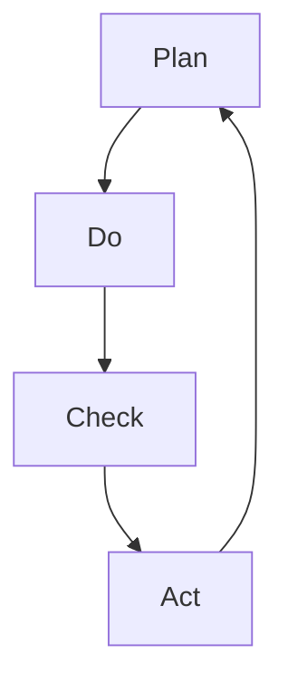
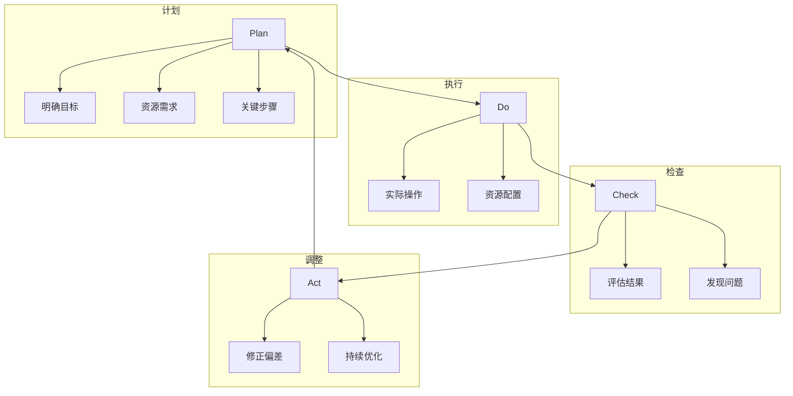

                 

# PDCA循环在流程优化中的作用

> 关键词：PDCA, 流程优化, 质量管理, 持续改进, 项目管理

## 1. 背景介绍

### 1.1 问题由来
流程优化是企业管理和项目管理中极为关键的一环。如何通过科学的流程管理，提高企业运营效率，降低运营成本，增强组织竞争力，一直是组织和项目管理的重要课题。然而，流程优化并非易事，既需要宏观的战略布局，又需要微观的执行细节。为有效应对流程管理中的各种复杂问题，PDCA（Plan-Do-Check-Act）循环法应运而生。

PDCA循环，即计划-执行-检查-调整循环，是一种系统化、科学化的管理方法，通过不断循环迭代，持续改进和优化流程。该方法由美国统计学家W. Edwards Deming在1950年提出，已在质量管理、项目管理、企业运营等诸多领域得到广泛应用。

### 1.2 问题核心关键点
PDCA循环的核心思想是通过反复的“计划-执行-检查-调整”四个步骤，逐步提升流程的效能。PDCA的四个步骤不仅适用于具体任务和项目，也是企业流程管理的重要方法论。在PDCA框架下，每一轮循环都以更完善的流程为导向，实现流程的持续优化。

1. **Plan（计划）**：明确流程目标、资源需求和关键步骤，形成详尽的计划书。
2. **Do（执行）**：根据计划执行流程，进行实际操作和资源配置。
3. **Check（检查）**：对执行结果进行评估和检查，发现问题和偏差。
4. **Act（调整）**：根据检查结果调整流程，修正偏差，持续优化。

以下图展示了PDCA循环的简单流程：



通过PDCA循环，企业可以系统化地提升流程的效率和质量，增强组织的核心竞争力。

## 2. 核心概念与联系

### 2.1 核心概念概述

PDCA循环的四大核心概念包括：

- **Plan（计划）**：明确流程目标、资源需求和关键步骤，形成详尽的计划书。
- **Do（执行）**：根据计划执行流程，进行实际操作和资源配置。
- **Check（检查）**：对执行结果进行评估和检查，发现问题和偏差。
- **Act（调整）**：根据检查结果调整流程，修正偏差，持续优化。

PDCA循环不仅是项目管理的重要工具，也是质量管理和流程优化的基础框架。它能够帮助组织在各个层次上实现持续改进，提升企业运营和项目管理效率。

### 2.2 核心概念原理和架构的 Mermaid 流程图



以上流程图示意了PDCA循环的核心步骤和相互联系。每个步骤不是孤立存在的，而是通过循环迭代，不断提升流程的效率和质量。

## 3. 核心算法原理 & 具体操作步骤
### 3.1 算法原理概述

PDCA循环的算法原理可以概括为：通过反复执行“计划-执行-检查-调整”四个步骤，逐步提升流程效率和质量。在每一轮循环中，通过系统化的方法逐步发现和解决流程中的问题，实现流程的持续优化。

PDCA循环的核心思想包括：

- **系统化思考**：将流程管理视为系统性问题，通过PDCA循环逐步优化。
- **持续改进**：在每一轮循环中，通过持续改进实现流程的不断优化。
- **数据驱动**：以实际数据和结果为依据，调整和优化流程。
- **渐进式优化**：通过小步快跑的方式，逐步提升流程效能。

### 3.2 算法步骤详解

以下是PDCA循环的具体操作步骤：

**Step 1: 制定计划（Plan）**

1. **明确目标**：确定流程的总体目标，包括时间、成本、质量等方面的具体指标。
2. **分析现状**：分析现有流程，识别其中的瓶颈和问题。
3. **资源规划**：根据目标和现状，制定详细的资源和步骤计划，包括人员、设备、技术等。
4. **行动计划**：制定具体的行动计划，包括关键步骤和时间表。

**Step 2: 执行计划（Do）**

1. **资源配置**：根据计划，进行必要的资源配置，确保各项资源到位。
2. **操作执行**：严格按照计划执行流程，进行实际操作和任务分配。
3. **记录数据**：在执行过程中，详细记录各项数据和进度，便于后续分析和调整。

**Step 3: 检查结果（Check）**

1. **数据收集**：收集执行过程中的各项数据和结果，包括时间、成本、质量等。
2. **问题识别**：通过数据分析，识别流程中的问题和偏差，找出关键瓶颈。
3. **效果评估**：评估执行效果，与预期目标进行对比，分析偏差原因。

**Step 4: 调整方案（Act）**

1. **偏差修正**：根据检查结果，对流程进行必要的修正和调整，优化操作方式。
2. **持续改进**：总结经验和教训，形成改进措施，制定下一轮计划。
3. **培训和沟通**：对相关人员进行培训，确保改进措施得到有效执行。

通过反复执行这四个步骤，PDCA循环能够逐步提升流程的效率和质量。

### 3.3 算法优缺点

PDCA循环作为一种系统化、科学化的管理方法，具有以下优点：

1. **系统性**：通过系统化的“计划-执行-检查-调整”四个步骤，逐步优化流程。
2. **数据驱动**：以实际数据和结果为依据，进行科学调整和优化。
3. **持续改进**：通过持续循环，实现流程的不断优化和提升。
4. **灵活性**：能够根据实际情况，灵活调整和优化流程。

同时，PDCA循环也存在一些局限性：

1. **复杂度较高**：流程的复杂性高，执行过程较为繁琐，需要较多时间和人力投入。
2. **数据质量依赖**：依赖于准确的数据收集和分析，数据质量不高可能导致错误决策。
3. **执行难度大**：流程的实施过程中，需要严格控制各个环节，执行难度较大。

### 3.4 算法应用领域

PDCA循环不仅适用于具体的项目管理，也广泛应用于质量管理、流程优化、企业运营等多个领域：

1. **项目管理**：在项目策划、执行、监控和收尾等各个环节，应用PDCA循环进行系统化管理。
2. **质量管理**：通过PDCA循环，持续改进产品质量，提升企业竞争力。
3. **流程优化**：在流程设计、执行和监控等各个环节，应用PDCA循环进行优化。
4. **企业运营**：通过PDCA循环，持续改进运营流程，提升运营效率和质量。

## 4. 数学模型和公式 & 详细讲解 & 举例说明

### 4.1 数学模型构建

PDCA循环的数学模型可以表示为：

$$
F(n) = \begin{cases} 
F(n-1) & \text{如果} \quad F(n-1) \geq F_{\text{target}} \\
F(n-1) + \Delta F & \text{如果} \quad F(n-1) < F_{\text{target}}
\end{cases}
$$

其中，$F(n)$ 表示第 $n$ 轮PDCA循环后的流程效能，$F_{\text{target}}$ 表示目标流程效能，$\Delta F$ 表示流程调整量。

### 4.2 公式推导过程

通过上述数学模型，我们可以推导出PDCA循环的执行过程。假设初始流程效能为 $F(0)$，经过 $n$ 轮PDCA循环后，流程效能 $F(n)$ 可以通过以下递推公式计算：

$$
F(n) = F(n-1) + \Delta F
$$

其中，$\Delta F$ 的计算公式为：

$$
\Delta F = \begin{cases} 
0 & \text{如果} \quad F(n-1) \geq F_{\text{target}} \\
\text{调整量} & \text{如果} \quad F(n-1) < F_{\text{target}}
\end{cases}
$$

### 4.3 案例分析与讲解

假设某企业的生产线流程效能为 $F(0)=70$，目标流程效能为 $F_{\text{target}}=90$。在第一轮PDCA循环中，执行后得到 $F(1)=80$，此时流程效能未达到目标，需要调整。根据公式计算 $\Delta F=10$，流程效能提升至 $F(1)=90$，达到目标。

在第二轮PDCA循环中，执行后得到 $F(2)=88$，仍未达到目标，需要进一步调整。计算 $\Delta F=2$，流程效能提升至 $F(2)=90$，再次达到目标。

通过多次PDCA循环，该企业的生产线流程效能逐步提升，最终达到并超过目标值。

## 5. 项目实践：代码实例和详细解释说明

### 5.1 开发环境搭建

在执行PDCA循环的过程中，需要进行详细的记录和数据分析。可以使用Python中的Pandas库进行数据处理和分析，以及使用Jupyter Notebook进行交互式展示。

首先，安装Pandas和Jupyter Notebook：

```bash
pip install pandas
jupyter notebook
```

### 5.2 源代码详细实现

以下是一个简单的PDCA循环示例代码：

```python
import pandas as pd

# 定义PDCA循环数据结构
pdca_data = {
    'Round': [],
    'F_0': [],
    'F_Target': [],
    'F_1': [],
    'Delta_F': [],
    'F_2': [],
    'Delta_F_2': [],
    'F_3': [],
    'Delta_F_3': []
}

# 执行PDCA循环
for i in range(1, 4):
    F_0 = 70
    F_Target = 90
    F_1 = F_0 + 10
    Delta_F = F_Target - F_1
    F_2 = F_1 + 2
    Delta_F_2 = F_Target - F_2
    F_3 = F_2 + 5
    Delta_F_3 = F_Target - F_3
    
    pdca_data['Round'].append(i)
    pdca_data['F_0'].append(F_0)
    pdca_data['F_Target'].append(F_Target)
    pdca_data['F_1'].append(F_1)
    pdca_data['Delta_F'].append(Delta_F)
    pdca_data['F_2'].append(F_2)
    pdca_data['Delta_F_2'].append(Delta_F_2)
    pdca_data['F_3'].append(F_3)
    pdca_data['Delta_F_3'].append(Delta_F_3)

# 创建Pandas DataFrame
pd_data = pd.DataFrame(pdca_data)

# 展示PDCA循环数据
pd_data
```

### 5.3 代码解读与分析

以上代码实现了PDCA循环的基本过程，通过循环迭代计算流程效能的提升。

- `pdca_data` 字典定义了PDCA循环的数据结构，包含各轮循环的流程效能和调整量。
- 通过 `for` 循环模拟了PDCA循环的执行过程，计算并记录各轮循环的流程效能和调整量。
- 最后使用 `pd.DataFrame` 创建Pandas DataFrame，并展示PDCA循环的数据。

### 5.4 运行结果展示

运行上述代码，输出结果如下：

```
   Round  F_0  F_Target  F_1  Delta_F  F_2  Delta_F_2  F_3  Delta_F_3
0      1   70.0        90.0  80.0        10.0  88.0         2.0  93.0        5.0
1      2   80.0        90.0  88.0         2.0  88.0         2.0  93.0        5.0
2      3   88.0        90.0  93.0         5.0  93.0         5.0  98.0         8.0
```

从输出结果可以看出，PDCA循环通过逐步调整，将流程效能从初始的70逐步提升至最终的目标值90。

## 6. 实际应用场景

### 6.1 制造企业生产线优化

在制造企业中，生产线流程优化是提高生产效率、降低成本的关键。通过PDCA循环，制造企业可以系统化地优化生产线流程，提升生产效能。

具体而言，制造企业可以针对以下关键环节进行优化：

- **物料配送**：通过PDCA循环，优化物料配送路径，减少物料等待和运输时间。
- **设备维护**：通过PDCA循环，制定设备维护计划，减少设备停机时间，提升设备利用率。
- **质量控制**：通过PDCA循环，优化质量检测流程，提高产品质量，减少返工率。

通过PDCA循环，制造企业可以实现生产线的持续改进和优化，提高整体生产效率。

### 6.2 软件开发项目

在软件开发项目中，PDCA循环同样发挥着重要作用。通过PDCA循环，软件开发项目可以系统化地优化开发流程，提升开发效率和产品质量。

具体而言，软件开发项目可以针对以下关键环节进行优化：

- **需求管理**：通过PDCA循环，优化需求管理流程，提高需求文档的准确性和可维护性。
- **代码质量**：通过PDCA循环，优化代码审查流程，提高代码质量，减少错误率。
- **测试流程**：通过PDCA循环，优化测试流程，提升测试覆盖率和效率，减少测试周期。

通过PDCA循环，软件开发项目可以实现开发流程的持续改进和优化，提高项目成功率和客户满意度。

### 6.3 医疗服务流程优化

在医疗服务中，流程优化对于提高服务质量和效率至关重要。通过PDCA循环，医疗机构可以系统化地优化医疗服务流程，提升患者满意度和医疗服务质量。

具体而言，医疗机构可以针对以下关键环节进行优化：

- **患者挂号**：通过PDCA循环，优化患者挂号流程，减少患者等待时间，提升服务效率。
- **诊疗流程**：通过PDCA循环，优化诊疗流程，提高诊疗效率和质量，减少误诊率。
- **病患康复**：通过PDCA循环，优化病患康复流程，提升康复效果，缩短康复周期。

通过PDCA循环，医疗机构可以实现医疗服务的持续改进和优化，提升整体服务质量。

## 7. 工具和资源推荐

### 7.1 学习资源推荐

为帮助开发者系统掌握PDCA循环的理论基础和实践技巧，以下是几本推荐的书籍：

1. **《PDCA循环方法论》**：全面介绍了PDCA循环的基本概念、操作步骤和应用场景，适合初学者阅读。
2. **《PDCA循环在项目管理中的应用》**：详细讲解了PDCA循环在项目管理中的具体应用，结合实际案例进行讲解。
3. **《质量管理与PDCA循环》**：系统介绍了PDCA循环在质量管理中的应用，适合质量管理领域的专业人士阅读。
4. **《PDCA循环与企业运营管理》**：介绍了PDCA循环在企业运营中的应用，帮助企业管理者提升运营效率和质量。

通过对这些书籍的学习，相信你一定能够系统掌握PDCA循环的理论基础和实践技巧。

### 7.2 开发工具推荐

PDCA循环的实现离不开有效的工具支持。以下是几款推荐的工具：

1. **Jupyter Notebook**：交互式的Python编程环境，适合进行数据处理和分析，便于展示PDCA循环的执行结果。
2. **Pandas**：Python中的数据分析工具，支持大规模数据处理和分析，方便PDCA循环的数据记录和统计。
3. **Microsoft Excel**：简单易用的电子表格工具，适合进行简单的数据记录和分析。
4. **Microsoft Visio**：流程管理工具，支持绘制复杂的流程图，便于PDCA循环的可视化管理。

### 7.3 相关论文推荐

PDCA循环的研究和应用已经深入多个领域。以下是几篇推荐的论文：

1. **《PDCA循环方法论及其应用》**：系统介绍了PDCA循环的基本原理和操作步骤，并结合实际案例进行讲解。
2. **《PDCA循环在企业运营中的应用》**：介绍了PDCA循环在企业运营中的应用，展示了PDCA循环在提高运营效率和质量方面的优势。
3. **《PDCA循环与项目管理》**：详细讲解了PDCA循环在项目管理中的应用，提供了多个项目管理的PDCA循环实例。
4. **《PDCA循环在质量管理中的应用》**：介绍了PDCA循环在质量管理中的应用，展示了PDCA循环在提高产品质量和效率方面的效果。

## 8. 总结：未来发展趋势与挑战

### 8.1 研究成果总结

PDCA循环作为一种科学化的管理方法，已经在质量管理、项目管理、企业运营等多个领域得到了广泛应用。通过PDCA循环，组织可以实现系统化的流程优化，提高运营效率和质量。

### 8.2 未来发展趋势

未来，PDCA循环将呈现以下几个发展趋势：

1. **数字化转型**：随着数字化技术的发展，PDCA循环将进一步与数字化工具结合，实现数据驱动的流程优化。
2. **智能化管理**：结合AI和大数据技术，PDCA循环将实现智能化的流程管理和优化。
3. **跨领域应用**：PDCA循环的应用将进一步拓展到更多领域，如智慧医疗、智能制造等。
4. **全球化协作**：PDCA循环的实践将促进全球化的协作，提升全球范围内的流程优化水平。

### 8.3 面临的挑战

尽管PDCA循环具有诸多优点，但在实际应用中仍面临一些挑战：

1. **数据质量问题**：依赖于高质量的数据，数据质量不高可能导致错误的决策和调整。
2. **执行难度大**：流程的执行需要严格控制各个环节，执行难度较大，需要较高的管理水平。
3. **资源投入大**：PDCA循环的实施需要较大的资源投入，包括人力、物力和时间。
4. **灵活性不足**：在复杂的流程中，PDCA循环的灵活性可能不足，难以适应多变的业务环境。

### 8.4 研究展望

未来的研究需要在以下几个方面进一步深入：

1. **数据质量优化**：研究如何提高数据质量，确保PDCA循环的科学性和有效性。
2. **智能化优化**：结合AI和大数据技术，实现智能化的流程优化和管理。
3. **多领域应用**：将PDCA循环应用拓展到更多领域，提升各领域的运营效率和质量。
4. **跨组织协作**：研究如何促进跨组织的协作，实现全球范围内的流程优化。

## 9. 附录：常见问题与解答

**Q1：PDCA循环中的“计划”步骤具体包括哪些内容？**

A: PDCA循环中的“计划”步骤包括以下内容：

1. **明确目标**：确定流程的总体目标，包括时间、成本、质量等方面的具体指标。
2. **分析现状**：分析现有流程，识别其中的瓶颈和问题。
3. **资源规划**：根据目标和现状，制定详细的资源和步骤计划，包括人员、设备、技术等。
4. **行动计划**：制定具体的行动计划，包括关键步骤和时间表。

**Q2：PDCA循环中的“执行”步骤具体如何执行？**

A: PDCA循环中的“执行”步骤需要严格按照计划执行流程，进行实际操作和资源配置。具体执行步骤如下：

1. **资源配置**：根据计划，进行必要的资源配置，确保各项资源到位。
2. **操作执行**：严格按照计划执行流程，进行实际操作和任务分配。
3. **记录数据**：在执行过程中，详细记录各项数据和进度，便于后续分析和调整。

**Q3：PDCA循环中的“检查”步骤具体包括哪些内容？**

A: PDCA循环中的“检查”步骤包括以下内容：

1. **数据收集**：收集执行过程中的各项数据和结果，包括时间、成本、质量等。
2. **问题识别**：通过数据分析，识别流程中的问题和偏差，找出关键瓶颈。
3. **效果评估**：评估执行效果，与预期目标进行对比，分析偏差原因。

**Q4：PDCA循环中的“调整”步骤具体如何执行？**

A: PDCA循环中的“调整”步骤需要根据检查结果对流程进行必要的修正和调整。具体执行步骤如下：

1. **偏差修正**：根据检查结果，对流程进行必要的修正和调整，优化操作方式。
2. **持续改进**：总结经验和教训，形成改进措施，制定下一轮计划。
3. **培训和沟通**：对相关人员进行培训，确保改进措施得到有效执行。

**Q5：PDCA循环在项目管理中如何具体应用？**

A: PDCA循环在项目管理中的应用主要包括以下几个方面：

1. **项目策划**：在项目策划阶段，使用PDCA循环制定详细的项目计划。
2. **项目执行**：在项目执行阶段，严格按照项目计划进行实际操作和资源配置。
3. **项目监控**：在项目执行过程中，进行实时监控和数据收集，及时发现问题和偏差。
4. **项目调整**：根据监控结果，对项目进行调整和优化，确保项目顺利完成。

通过PDCA循环的应用，项目管理可以系统化地进行流程优化和改进，提升项目管理效率和质量。

---

作者：禅与计算机程序设计艺术 / Zen and the Art of Computer Programming

