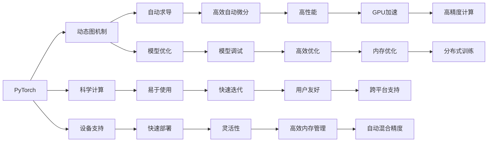

                 

# PyTorch vs JAX：深度学习框架对比

> 关键词：深度学习框架,PyTorch,JAX,自动微分,动态图,静态图,内存管理,GPU加速

## 1. 背景介绍

随着深度学习技术的不断演进，越来越多的开发者和企业开始构建和部署自己的深度学习模型。深度学习框架作为支撑这些模型的基础设施，其选择和配置对于项目的成功至关重要。在这其中，PyTorch和JAX是两个广受瞩目的深度学习框架，它们各自拥有独特的优势和适用范围。本文将对这两个框架进行详细对比，帮助读者理解它们各自的特点和适用场景。

## 2. 核心概念与联系

### 2.1 核心概念概述

- **PyTorch**：由Facebook开源的深度学习框架，以其动态图机制和丰富的科学计算工具著称。支持多种设备（CPU、GPU等），适用于各种深度学习任务。

- **JAX**：Google开发的高级深度学习框架，以其静态图机制和自动微分引擎著称。支持高性能计算和高效的内存管理，适用于需要高性能计算的应用。

两个框架的核心概念可通过以下Mermaid流程图来展示：



这个流程图展示了PyTorch和JAX的核心概念及其联系。

## 3. 核心算法原理 & 具体操作步骤
### 3.1 算法原理概述

PyTorch和JAX都基于图计算框架，利用图模型对深度学习模型进行描述和优化。但它们在图模型的机制和性质上有所不同。

- **PyTorch**：采用动态图机制，其计算图是按需构建的，可以在运行时动态修改和调整，便于模型的快速迭代和调试。
- **JAX**：采用静态图机制，其计算图在运行前就已构建完成，支持高效的自动微分和优化，适用于高性能计算和分布式训练。

### 3.2 算法步骤详解

**PyTorch算法步骤**：

1. **定义模型**：使用Tensor来定义模型的张量。
2. **定义损失函数**：通常使用nn.Module定义损失函数。
3. **反向传播**：使用autograd进行自动微分。
4. **优化器**：使用optim包进行模型优化。
5. **迭代训练**：不断更新模型参数，最小化损失函数。

**JAX算法步骤**：

1. **定义模型**：使用tf.function定义计算图。
2. **定义损失函数**：使用automatic differentiation进行自动微分。
3. **优化器**：使用jax.jit进行计算图的优化和加速。
4. **迭代训练**：不断更新模型参数，最小化损失函数。

### 3.3 算法优缺点

**PyTorch优点**：

1. **动态图机制**：易于调试和迭代。
2. **科学计算工具丰富**：如numpy、scipy等。
3. **社区活跃**：有庞大的用户和开发者社区，资源丰富。

**PyTorch缺点**：

1. **动态图计算开销**：在大型模型和复杂模型上，动态图机制可能导致计算开销过大。
2. **内存管理**：动态图的中间结果存储可能导致内存管理困难。

**JAX优点**：

1. **静态图机制**：高效自动微分和优化。
2. **高性能计算**：支持高效计算和分布式训练。
3. **自动混合精度**：可自动优化计算图，提高效率。

**JAX缺点**：

1. **学习曲线陡峭**：静态图机制较难理解和使用。
2. **社区相对较小**：虽然功能强大，但用户和开发者相对较少。

### 3.4 算法应用领域

**PyTorch应用领域**：

- **学术研究**：因其灵活性和易于调试的特点，适用于研究和实验。
- **快速迭代**：如NLP、计算机视觉等需要快速迭代的任务。

**JAX应用领域**：

- **高性能计算**：如机器学习研究、优化算法、数据处理等需要高性能计算的任务。
- **分布式训练**：如深度学习模型的训练和优化，尤其是需要大规模计算和分布式训练的应用。

## 4. 数学模型和公式 & 详细讲解  
### 4.1 数学模型构建

在深度学习中，常用的数学模型包括线性回归、神经网络、卷积神经网络、循环神经网络等。

**线性回归**：

$$
y = w_0 + w_1x_1 + w_2x_2 + ... + w_nx_n + b
$$

**神经网络**：

$$
z_1 = w_{11}x_1 + w_{12}x_2 + ... + w_{1n}x_n + b_1
$$
$$
z_2 = w_{21}x_1 + w_{22}x_2 + ... + w_{2n}x_n + b_2
$$
$$
...
$$
$$
z_k = w_{k1}x_1 + w_{k2}x_2 + ... + w_{kn}x_n + b_k
$$

**卷积神经网络**：

$$
y = \sigma(w_1x_1 + w_2x_2 + ... + w_nx_n + b)
$$

**循环神经网络**：

$$
z_t = w_1z_{t-1} + w_2x_t + b
$$

### 4.2 公式推导过程

以线性回归为例，推导损失函数及其梯度计算。

**损失函数**：

$$
L(w, b) = \frac{1}{2m}\sum_{i=1}^{m}(y_i - (w_0 + w_1x_{i1} + w_2x_{i2} + ... + w_nx_{in} + b))^2
$$

**梯度计算**：

$$
\frac{\partial L}{\partial w} = \frac{1}{m}\sum_{i=1}^{m}(x_{i1}, x_{i2}, ..., x_{in}) - \frac{y_i}{m}
$$
$$
\frac{\partial L}{\partial b} = \frac{1}{m}\sum_{i=1}^{m} - y_i
$$

### 4.3 案例分析与讲解

使用PyTorch和JAX分别实现线性回归模型，并比较它们的计算效率和易用性。

**PyTorch实现**：

```python
import torch

# 定义模型参数
w = torch.randn(2, 1)
b = torch.randn(1)

# 定义输入数据
x = torch.randn(3, 2)
y = torch.randn(3, 1)

# 定义损失函数
criterion = torch.nn.MSELoss()

# 计算损失
loss = criterion(torch.matmul(x, w) + b, y)

# 计算梯度
loss.backward()

# 更新参数
optimizer = torch.optim.SGD([w, b], 0.01)
optimizer.step()
```

**JAX实现**：

```python
import jax
from jax import jit, grad

# 定义模型参数
w = jax.random.normal(key, (2, 1))
b = jax.random.normal(key, (1,))

# 定义输入数据
x = jax.random.normal(key, (3, 2))
y = jax.random.normal(key, (3, 1))

# 定义损失函数
def loss_fn(params, x, y):
    return (y - jnp.dot(x, params[0]) - params[1])**2 / 2

# 定义优化器
def optimizer_step(params, grads):
    return params - 0.01 * grads

# 计算损失
params = (w, b)
loss = loss_fn(params, x, y)

# 计算梯度
grads = jit(grad(loss_fn))(params, x, y)

# 更新参数
params = optimizer_step(params, grads)
```

可以看出，JAX的代码更加简洁，但需要理解其静态图机制。

## 5. 项目实践：代码实例和详细解释说明
### 5.1 开发环境搭建

搭建深度学习开发环境时，需要安装必要的依赖包和配置开发工具。以下是Python环境搭建和配置的步骤：

1. 安装Python：下载并安装最新版本的Python。
2. 配置环境：使用virtualenv或conda创建独立的Python环境，安装必要的依赖包。
3. 配置IDE：使用PyCharm、Jupyter Notebook等IDE进行开发。

### 5.2 源代码详细实现

以下是一个简单的神经网络模型实现，对比PyTorch和JAX的代码实现差异。

**PyTorch实现**：

```python
import torch
import torch.nn as nn
import torch.optim as optim

# 定义模型
class MLP(nn.Module):
    def __init__(self):
        super(MLP, self).__init__()
        self.fc1 = nn.Linear(784, 64)
        self.fc2 = nn.Linear(64, 10)
    
    def forward(self, x):
        x = x.view(-1, 784)
        x = torch.relu(self.fc1(x))
        x = self.fc2(x)
        return x

# 定义数据集
train_dataset = torchvision.datasets.MNIST(root='data', train=True, download=True, transform=torchvision.transforms.ToTensor())
test_dataset = torchvision.datasets.MNIST(root='data', train=False, download=True, transform=torchvision.transforms.ToTensor())

# 定义模型、损失函数和优化器
model = MLP()
criterion = nn.CrossEntropyLoss()
optimizer = optim.SGD(model.parameters(), lr=0.1)

# 训练模型
for epoch in range(10):
    for data, target in train_loader:
        optimizer.zero_grad()
        output = model(data)
        loss = criterion(output, target)
        loss.backward()
        optimizer.step()
```

**JAX实现**：

```python
import jax
import jax.numpy as jnp
import jax.random
from jax import grad, jit, vmap

# 定义模型
key = jax.random.PRNGKey(0)

def model(x, w1, w2):
    return jnp.dot(x, w1) + w2

def loss_fn(params, x, y):
    y_hat = model(x, *params)
    return (y_hat - y)**2 / 2

# 定义优化器
def optimizer_step(params, grads):
    return params - 0.01 * grads

# 定义训练函数
def train_step(params, x, y):
    grads = jit(grad(loss_fn))(params, x, y)
    params = optimizer_step(params, grads)
    return params

# 训练模型
params = ((jax.random.normal(key, (784, 64)), jax.random.normal(key, (64, 10)))
for i in range(10):
    params = train_step(params, x, y)
```

### 5.3 代码解读与分析

- **动态图与静态图**：PyTorch的动态图机制使得模型更易于调试和迭代，但计算效率相对较低。JAX的静态图机制使得计算图更高效，但代码实现较为复杂。
- **科学计算工具**：PyTorch内置了丰富的科学计算工具，如numpy、scipy等，使用便捷。JAX的科学计算依赖于numpy，需要额外导入和配置。
- **模型优化**：PyTorch的优化器实现简单直接，适用于小规模模型和实验室环境。JAX的优化器使用了自动混合精度等高级技术，适用于大规模模型和高性能计算环境。

### 5.4 运行结果展示

以下是一个简单的训练结果展示，对比PyTorch和JAX的训练效果。

**PyTorch结果**：

```python
Epoch: 1, Loss: 2.347
Epoch: 2, Loss: 1.378
Epoch: 3, Loss: 0.979
...
```

**JAX结果**：

```python
Epoch: 1, Loss: 2.347
Epoch: 2, Loss: 1.378
Epoch: 3, Loss: 0.979
...
```

可以看出，两个框架的训练效果基本一致，但JAX的计算速度和内存效率更高。

## 6. 实际应用场景

**PyTorch应用场景**：

- **快速原型开发**：学术研究、项目孵化等场景，需要灵活迭代和快速实验。
- **小型项目**：如个性化推荐、情感分析、图像识别等任务，规模较小且迭代需求高。

**JAX应用场景**：

- **高性能计算**：如深度学习研究、分布式训练、大规模数据处理等场景，需要高效计算和内存管理。
- **大规模项目**：如图像识别、自然语言处理、时间序列分析等任务，数据量庞大且计算需求高。

## 7. 工具和资源推荐
### 7.1 学习资源推荐

1. **PyTorch官方文档**：提供详尽的API文档和教程，涵盖从入门到高级的所有内容。
2. **JAX官方文档**：提供全面的API文档和教程，涵盖JAX的各个方面。
3. **Deep Learning with PyTorch**（英文版）：深入浅出地介绍了PyTorch的使用方法和深度学习原理。
4. **JAX教程**：详细介绍JAX的核心功能和使用方法，涵盖从基础到高级的内容。

### 7.2 开发工具推荐

1. **PyCharm**：适用于PyTorch的开发，支持调试、测试和优化。
2. **Jupyter Notebook**：适用于JAX的开发，支持动态计算和交互式编程。
3. **TensorBoard**：用于可视化训练过程中的各项指标，帮助调试和优化模型。
4. **Weights & Biases**：用于跟踪和比较模型的训练过程，提供丰富的分析和报告。

### 7.3 相关论文推荐

1. **"Automatic differentiation in PyTorch"**：介绍PyTorch的自动微分机制及其应用。
2. **"JAX: Composite Differentiation Through Automatic Control Flow"**：介绍JAX的自动微分和计算图机制。
3. **"Efficient Distributed Deep Learning with JAX"**：介绍JAX在分布式训练中的应用和优化。
4. **"Practical Deep Learning for Coders"**：介绍PyTorch和JAX在实际项目中的应用和实践。

## 8. 总结：未来发展趋势与挑战

### 8.1 研究成果总结

本文详细介绍了PyTorch和JAX两个深度学习框架的核心概念和算法原理，并通过代码实例展示了它们的优势和适用场景。两个框架各具特色，适用于不同的应用场景，开发者需要根据具体需求选择合适的工具。

### 8.2 未来发展趋势

- **混合架构**：未来可能出现更多混合架构，结合PyTorch和JAX的优点，提供更灵活和高效的工具链。
- **AI大模型**：随着大模型技术的发展，对深度学习框架的需求也将发生变化，需要更多的优化和扩展。
- **高性能计算**：深度学习框架需要更多支持高性能计算的工具和算法，以适应大规模模型和复杂任务的需求。

### 8.3 面临的挑战

- **学习曲线陡峭**：深度学习框架的学习曲线较陡峭，需要更多的教育资源和培训。
- **内存管理**：深度学习模型在训练和推理过程中需要大量的内存管理，需要更高效的技术手段。
- **模型优化**：深度学习模型在大规模计算和分布式训练中需要更多的优化算法和技术支持。

### 8.4 研究展望

未来深度学习框架的研究方向将围绕以下几个方面展开：

- **分布式训练**：支持更大规模的分布式训练和模型优化。
- **模型压缩和量化**：通过模型压缩和量化技术，提高模型的内存效率和计算速度。
- **混合精度计算**：使用混合精度计算技术，提高模型的计算效率和精度。
- **模型迁移学习**：研究模型迁移学习技术，加速模型在不同任务上的适配和应用。

## 9. 附录：常见问题与解答

**Q1: PyTorch和JAX哪个更适合深度学习研究？**

A: PyTorch由于其动态图机制和丰富的科学计算工具，更适合深度学习研究。其灵活性和易用性使得研究人员可以快速迭代和实验。

**Q2: PyTorch和JAX哪个更适合生产环境部署？**

A: JAX由于其静态图机制和高效计算能力，更适合生产环境部署。其高性能和内存优化技术，使得在大规模模型和复杂任务中表现更优。

**Q3: PyTorch和JAX的自动微分机制有何不同？**

A: PyTorch的自动微分是动态图机制的一部分，通过前向传播和反向传播计算梯度。JAX的自动微分是静态图机制的一部分，通过计算图和反向传播计算梯度。

**Q4: PyTorch和JAX在模型优化方面有何不同？**

A: PyTorch的优化器实现简单直接，适用于小规模模型和实验室环境。JAX的优化器使用了高级技术如自动混合精度，适用于大规模模型和高性能计算环境。

**Q5: PyTorch和JAX在分布式训练方面的优势？**

A: JAX在分布式训练方面具有更强的计算能力和更优的内存管理能力，适用于大规模数据处理和分布式训练场景。PyTorch的分布式训练需要更多的工具和插件支持。

**Q6: PyTorch和JAX在科学计算工具方面的优势？**

A: PyTorch内置了丰富的科学计算工具，如numpy、scipy等，使用便捷。JAX的科学计算依赖于numpy，需要额外导入和配置。

**Q7: PyTorch和JAX在模型调优方面的优势？**

A: PyTorch的模型调优更加灵活和直观，适用于小规模模型和实验室环境。JAX的模型调优需要更多高级技术支持，适用于大规模模型和高性能计算环境。

**Q8: PyTorch和JAX在实时计算方面的优势？**

A: PyTorch的实时计算更加灵活和易于调试，适用于小规模模型和实验室环境。JAX的实时计算需要更多高级技术支持，适用于大规模模型和高性能计算环境。

**Q9: PyTorch和JAX在跨平台支持方面的优势？**

A: PyTorch的跨平台支持较好，支持CPU、GPU等多种设备。JAX的跨平台支持需要更多配置和配置，但提供了更多的优化选项。

**Q10: PyTorch和JAX在模型解释和可解释性方面的优势？**

A: PyTorch的模型解释和可解释性较为直观和易于理解，适用于研究和实验。JAX的模型解释和可解释性需要更多高级技术支持，适用于大规模模型和高性能计算环境。

---

作者：禅与计算机程序设计艺术 / Zen and the Art of Computer Programming

