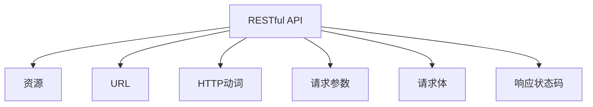

                 

# RESTful API设计：为AI模型构建接口

> 关键词：RESTful API, AI模型, API设计, 接口优化, 服务集成

## 1. 背景介绍

### 1.1 问题由来
随着人工智能技术的快速发展，越来越多的企业开始将AI模型部署到生产环境中，以实现自动化决策、个性化推荐、智能客服等功能。然而，这些AI模型的部署和集成往往面临诸多挑战，其中最核心的问题之一是如何构建一个高效、稳定、易于维护的API接口。本文将深入探讨RESTful API设计的基本原理和实践技巧，为AI模型接口的构建提供专业的指导。

### 1.2 问题核心关键点
RESTful API设计是构建可扩展、可维护、高可用的微服务架构的核心，对于将AI模型部署到生产环境中至关重要。有效的API设计能够使得服务集成变得简单、高效，从而大大提升系统的整体性能和用户体验。

本文将聚焦于RESTful API设计的基本概念和最佳实践，从理论到实践，系统地梳理了API设计的过程和方法。将深入讲解如何选择合适的HTTP动词、构建资源路径、定义请求和响应格式、实现数据序列化、应用API版本控制等关键点，以及如何通过这些手段构建高效、可靠、易于维护的API接口。

## 2. 核心概念与联系

### 2.1 核心概念概述

REST（Representational State Transfer）是一套架构风格，用于构建基于HTTP的Web服务。RESTful API是遵循REST架构风格的API接口设计规范，采用无状态、统一资源定位符（URL）、HTTP动词等概念，旨在提供简单、轻量、高效的服务交互方式。

以下是RESTful API设计中一些关键概念的概述：

- **资源**（Resource）：是API接口的基本单位，对应数据库中的表或文档。
- **URL**（Uniform Resource Locator）：用于定位资源的位置，如`/users/123`表示获取ID为123的用户的资源。
- **HTTP动词**：用于描述对资源的操作，如`GET`表示获取资源，`POST`表示创建资源，`PUT`表示更新资源，`DELETE`表示删除资源。
- **请求参数**：用于传递查询条件、过滤规则等，如`/users?name=john`表示获取名为John的用户。
- **请求体**（Request Body）：用于传递复杂的数据结构，如JSON、XML格式。
- **响应状态码**：用于表示请求的处理结果，如`200 OK`表示请求成功，`404 Not Found`表示资源未找到。

这些核心概念构成了RESTful API设计的基石，帮助开发者构建简单、灵活、易于维护的服务接口。

### 2.2 核心概念原理和架构的 Mermaid 流程图



以上流程图展示了RESTful API设计的基本架构：

1. **资源（A）**：对应数据库中的数据结构。
2. **URL（C）**：用于唯一标识资源。
3. **HTTP动词（D）**：用于描述对资源的操作。
4. **请求参数（E）**：用于传递查询条件。
5. **请求体（F）**：用于传递复杂数据结构。
6. **响应状态码（G）**：表示请求的处理结果。

这些元素通过合理的设计和组合，可以构建出高效、可靠的API接口，满足不同的业务需求。

## 3. 核心算法原理 & 具体操作步骤

### 3.1 算法原理概述

RESTful API设计的核心原理是基于HTTP协议进行无状态资源操作。其基本思想是通过URL定位资源，使用HTTP动词描述操作，利用请求参数传递查询条件，通过响应状态码返回操作结果。这种设计方式简单、高效，适用于构建可扩展、可维护、高可用的微服务架构。

### 3.2 算法步骤详解

RESTful API设计的基本步骤如下：

1. **定义资源**：确定API接口中的主要资源，以及它们之间的关系。
2. **设计URL路径**：根据资源定义，设计URL路径，确保URL路径的语义明确、简洁。
3. **选择HTTP动词**：根据资源操作，选择合适的HTTP动词，如`GET`、`POST`、`PUT`、`DELETE`等。
4. **定义请求参数**：确定哪些参数需要传递给API接口，以及这些参数的含义。
5. **实现数据序列化**：选择合适的数据序列化格式，如JSON、XML等，以便在请求和响应中进行数据交换。
6. **应用API版本控制**：根据需要，定义API的版本控制机制，以确保API的稳定性和兼容性。

以下是对各个步骤的详细讲解。

### 3.3 算法优缺点

#### 优点：

- **简单易用**：RESTful API设计基于HTTP协议，使得API接口的访问和使用非常简单。
- **高效稳定**：通过URL路径和HTTP动词的合理设计，可以构建出高效、稳定的服务接口。
- **易于扩展**：RESTful API设计支持资源的嵌套和关联，便于构建复杂的服务体系。
- **标准规范**：遵循RESTful API设计规范，可以与其他服务系统无缝集成。

#### 缺点：

- **限制较多**：RESTful API设计需要遵循一些严格的规范，如无状态、使用HTTP动词等，可能会限制API的灵活性。
- **状态管理复杂**：由于RESTful API是无状态的，所有请求都需要包含所有必要的信息，导致状态管理较为复杂。
- **并发性能较低**：RESTful API通常使用HTTP请求，单次请求的并发性能较低。

### 3.4 算法应用领域

RESTful API设计广泛应用于各种Web服务和微服务架构中，尤其是在AI模型的部署和集成场景中，其高效、稳定、灵活的特性使其成为首选。例如：

- **智能客服**：通过API接口提供自动回复、意图识别、语义分析等服务，实现智能客服系统。
- **推荐系统**：通过API接口提供用户行为分析、个性化推荐、评分预测等服务，提升推荐效果。
- **图像识别**：通过API接口提供图像分类、物体检测、人脸识别等服务，支持图像处理和识别应用。
- **语音识别**：通过API接口提供语音转文本、情感分析、语种识别等服务，支持语音处理和识别应用。

以上场景中，RESTful API设计的高效性和稳定性，使得AI模型能够顺利集成到服务体系中，提供稳定的服务接口。

## 4. 数学模型和公式 & 详细讲解 & 举例说明

### 4.1 数学模型构建

RESTful API设计不需要使用复杂的数学模型，其主要依赖于HTTP协议的规范和标准的URL路径设计。但为了更好地理解API接口的访问流程，我们可以使用数学模型来描述API接口的访问过程。

假设一个API接口用于获取用户信息，API路径为`/users/{id}`，其中`id`为用户ID。API接口使用`GET`动词，请求参数为`id`，响应数据为JSON格式的用户信息。API接口的访问过程可以建模为以下步骤：

1. 客户端向服务器发送HTTP GET请求，请求路径为`/users/{id}`。
2. 服务器根据请求路径提取用户ID，并根据ID在数据库中查询用户信息。
3. 服务器将查询结果以JSON格式返回给客户端。
4. 客户端解析JSON数据，显示用户信息。

### 4.2 公式推导过程

假设API接口返回的用户信息包含以下字段：

- `name`：用户姓名
- `age`：用户年龄
- `gender`：用户性别
- `email`：用户邮箱

API接口的访问过程可以建模为以下数学公式：

$$
\text{用户信息} = \text{查询数据库}(\text{用户ID})
$$

其中，查询数据库函数接收用户ID作为输入，返回包含用户信息的JSON数据。

### 4.3 案例分析与讲解

以一个简单的示例来说明RESTful API设计的实现过程。假设我们有一个API接口用于获取用户信息，API路径为`/users/{id}`，其中`id`为用户ID。API接口使用`GET`动词，请求参数为`id`，响应数据为JSON格式的用户信息。

1. **定义资源**：
   - 资源：用户信息
   - 关系：单表结构，包含用户ID、姓名、年龄、性别、邮箱等字段

2. **设计URL路径**：
   - URL路径：`/users/{id}`，其中`{id}`为用户ID占位符

3. **选择HTTP动词**：
   - HTTP动词：`GET`

4. **定义请求参数**：
   - 请求参数：`id`，用于指定要获取的用户ID

5. **实现数据序列化**：
   - 数据序列化：JSON格式，响应数据包含用户ID、姓名、年龄、性别、邮箱等字段

6. **应用API版本控制**：
   - API版本控制：使用`/v1/users/{id}`路径，表示API版本为1.0

完整的API接口定义如下：

```
GET /v1/users/{id}
Accept: application/json
```

客户端向服务器发送HTTP GET请求，请求路径为`/v1/users/{id}`，其中`id`为用户ID。服务器根据请求路径提取用户ID，并根据ID在数据库中查询用户信息。服务器将查询结果以JSON格式返回给客户端。客户端解析JSON数据，显示用户信息。

## 5. 项目实践：代码实例和详细解释说明

### 5.1 开发环境搭建

在RESTful API设计的实践中，我们需要使用一些常用的工具和框架。以下是Python环境中RESTful API开发的常用工具和框架：

- **Flask**：一个轻量级的Web框架，用于快速开发RESTful API接口。
- **SQLAlchemy**：一个ORM框架，用于处理数据库操作，支持多种数据库。
- **Flask-RESTful**：一个扩展库，用于简化RESTful API接口的开发。
- **Flask-Marshmallow**：一个扩展库，用于处理数据序列化，支持JSON、XML格式。

以下是在Python中使用Flask和Flask-RESTful开发RESTful API接口的示例：

```python
from flask import Flask
from flask_restful import Resource, Api
from flask_sqlalchemy import SQLAlchemy
from flask_marshmallow import Marshmallow

app = Flask(__name__)
app.config['SQLALCHEMY_DATABASE_URI'] = 'sqlite:////tmp/test.db'
app.config['SQLALCHEMY_TRACK_MODIFICATIONS'] = False

db = SQLAlchemy(app)
ma = Marshmallow(app)

# 定义用户模型
class User(db.Model):
    id = db.Column(db.Integer, primary_key=True)
    name = db.Column(db.String(100))
    age = db.Column(db.Integer)
    gender = db.Column(db.String(10))
    email = db.Column(db.String(100))

# 定义用户序列化器
class UserSchema(ma.SQLAlchemyAutoSchema):
    class Meta:
        model = User
        fields = ('id', 'name', 'age', 'gender', 'email')

# 定义资源类
class UserResource(Resource):
    def get(self, user_id):
        user = User.query.get(user_id)
        if user is None:
            return {'message': 'User not found'}, 404
        return UserSchema().dump(user)

# 创建API接口
api = Api(app)
api.add_resource(UserResource, '/users/<int:user_id>')

if __name__ == '__main__':
    app.run(debug=True)
```

### 5.2 源代码详细实现

上述代码演示了如何通过Flask和Flask-RESTful实现一个简单的RESTful API接口。具体实现过程如下：

1. **导入依赖**：
   - 导入Flask、Flask-RESTful、SQLAlchemy和Flask-Marshmallow等常用库。

2. **配置Flask应用**：
   - 设置SQLAlchemy数据库连接字符串和追踪修改开关。

3. **定义用户模型**：
   - 定义一个SQLAlchemy模型类，用于表示用户信息。

4. **定义用户序列化器**：
   - 定义一个Flask-Marshmallow序列化器，用于将用户模型转换为JSON格式。

5. **定义资源类**：
   - 定义一个Flask-RESTful资源类，用于处理用户信息的获取请求。

6. **创建API接口**：
   - 使用Flask-RESTful创建API接口，将资源类绑定到指定URL路径上。

7. **启动应用**：
   - 启动Flask应用，监听指定端口。

### 5.3 代码解读与分析

#### 代码解读

1. **数据库连接**：
   - `app.config['SQLALCHEMY_DATABASE_URI'] = 'sqlite:////tmp/test.db'`：设置SQLAlchemy数据库连接字符串，使用SQLite数据库。

2. **用户模型**：
   - `class User(db.Model):`：定义SQLAlchemy模型类，表示用户信息。

3. **用户序列化器**：
   - `class UserSchema(ma.SQLAlchemyAutoSchema):`：定义Flask-Marshmallow序列化器，用于将用户模型转换为JSON格式。

4. **资源类**：
   - `class UserResource(Resource):`：定义Flask-RESTful资源类，用于处理用户信息的获取请求。
   - `def get(self, user_id):`：实现资源类的`get`方法，用于获取指定ID的用户信息。

5. **API接口**：
   - `api = Api(app)`：创建Flask-RESTful API接口。
   - `api.add_resource(UserResource, '/users/<int:user_id>')`：将用户资源类绑定到`/users/<int:user_id>`URL路径上。

#### 代码分析

1. **数据库操作**：
   - `User.query.get(user_id)`：从数据库中获取指定ID的用户信息。

2. **序列化转换**：
   - `UserSchema().dump(user)`：将用户模型转换为JSON格式。

3. **API接口设计**：
   - `@app.route('/users/<int:user_id>')`：将资源类绑定到指定URL路径上。

4. **异常处理**：
   - `return {'message': 'User not found'}, 404`：处理用户ID不存在的情况，返回404错误。

### 5.4 运行结果展示

启动应用后，可以通过浏览器访问`http://127.0.0.1:5000/users/1`获取ID为1的用户信息。响应结果为JSON格式的JSON数据，包含用户的姓名、年龄、性别和邮箱信息。

## 6. 实际应用场景

### 6.1 智能客服

智能客服系统通过RESTful API接口，将用户的问题和历史对话数据传递给AI模型进行分析和回复。API接口可以提供意图识别、实体抽取、对话管理等服务，使得智能客服系统能够自动处理用户咨询，提高客服效率和用户满意度。

### 6.2 推荐系统

推荐系统通过RESTful API接口，将用户的历史行为数据和实时数据传递给AI模型进行分析和推荐。API接口可以提供用户画像、物品推荐、评分预测等服务，使得推荐系统能够提供个性化推荐，提升用户体验。

### 6.3 图像识别

图像识别系统通过RESTful API接口，将图像数据传递给AI模型进行分析和识别。API接口可以提供图像分类、物体检测、人脸识别等服务，使得图像识别系统能够广泛应用于安防、医疗、自动驾驶等领域。

### 6.4 语音识别

语音识别系统通过RESTful API接口，将语音数据传递给AI模型进行分析和识别。API接口可以提供语音转文本、情感分析、语种识别等服务，使得语音识别系统能够广泛应用于智能家居、语音助手、电话客服等领域。

## 7. 工具和资源推荐

### 7.1 学习资源推荐

为了帮助开发者系统掌握RESTful API设计的理论基础和实践技巧，这里推荐一些优质的学习资源：

1. **RESTful API设计指南**：深入讲解RESTful API设计的原理和最佳实践，涵盖URL路径设计、HTTP动词选择、数据序列化等关键点。

2. **Flask官方文档**：Flask框架的官方文档，详细介绍了Flask的使用方法，包括RESTful API接口的开发和部署。

3. **Flask-RESTful官方文档**：Flask-RESTful扩展库的官方文档，详细介绍了RESTful API接口的开发和部署。

4. **SQLAlchemy官方文档**：SQLAlchemy ORM框架的官方文档，详细介绍了SQLAlchemy的使用方法，包括数据库操作和模型设计。

5. **Flask-Marshmallow官方文档**：Flask-Marshmallow扩展库的官方文档，详细介绍了数据序列化的方法和格式。

6. **RESTful API设计案例分析**：通过实际案例分析，讲解RESTful API设计的具体实现过程和优化技巧。

### 7.2 开发工具推荐

RESTful API设计需要依赖于一些常用的开发工具和框架。以下是一些常用的开发工具和框架：

1. **Postman**：API接口测试工具，用于测试和调试RESTful API接口。
2. **Swagger**：API接口文档生成工具，用于生成API接口的文档和测试工具。
3. **JIRA**：项目管理工具，用于跟踪API接口的开发和部署。
4. **GitLab**：代码托管平台，用于版本控制和代码管理。
5. **Docker**：容器化平台，用于部署和运行RESTful API接口。

### 7.3 相关论文推荐

RESTful API设计已经成为Web服务架构的重要组成部分，以下几篇经典的论文推荐阅读：

1. **RESTful Web Services**：提出RESTful Web服务的概念和原则，奠定了RESTful API设计的理论基础。

2. **Hypermedia as the Engine of Application State**：提出RESTful架构的核心思想，强调Web资源的统一资源定位符（URL）和无状态操作。

3. **RESTful Web API Design**：系统讲解RESTful API设计的原理和最佳实践，涵盖URL路径设计、HTTP动词选择、数据序列化等关键点。

4. **RESTful API Security**：讲解RESTful API接口的安全性设计，包括身份验证、授权、加密等技术。

5. **RESTful API Best Practices**：总结RESTful API设计的最佳实践，涵盖API接口的命名规范、错误处理、版本控制等。

## 8. 总结：未来发展趋势与挑战

### 8.1 研究成果总结

RESTful API设计已经成为Web服务架构的重要组成部分，广泛应用于各种Web服务和微服务架构中。通过RESTful API接口，AI模型可以高效、稳定地集成到生产环境中，提供稳定的服务接口。

### 8.2 未来发展趋势

1. **微服务架构**：RESTful API设计在微服务架构中具有重要的作用，未来将更多地应用于微服务架构的开发和部署。
2. **云原生技术**：RESTful API设计将更多地结合云原生技术，如Kubernetes、Docker等，实现API接口的自动化部署和运维。
3. **自动化测试**：RESTful API接口的测试将成为自动化测试的重要内容，提高测试效率和质量。
4. **API版本控制**：API版本控制将更加严格，确保API的稳定性和兼容性，避免API接口的兼容性问题。

### 8.3 面临的挑战

尽管RESTful API设计已经取得了一定的成就，但未来仍面临一些挑战：

1. **接口设计复杂**：RESTful API接口的设计需要考虑多个因素，如URL路径、HTTP动词、数据序列化等，设计复杂度较高。
2. **安全性问题**：API接口的访问和数据传输需要考虑安全性问题，如身份验证、授权、加密等，安全性问题需要严格处理。
3. **性能瓶颈**：RESTful API接口的性能瓶颈需要优化，如单次请求的并发性能、API接口的响应时间等。
4. **数据存储问题**：RESTful API接口的数据存储和同步需要优化，确保数据的一致性和可靠性。

### 8.4 研究展望

未来RESTful API设计需要进一步优化和改进，以应对新的挑战和需求：

1. **自动化设计工具**：开发自动化设计工具，辅助API接口的设计和测试，提高API接口的设计效率和质量。
2. **API接口监控**：开发API接口监控工具，实时监控API接口的访问和响应情况，及时发现和解决问题。
3. **API接口文档**：开发API接口文档工具，自动生成API接口的文档，便于开发者和用户的使用。

## 9. 附录：常见问题与解答

### Q1：RESTful API接口和传统Web接口有什么区别？

A: RESTful API接口和传统Web接口的主要区别在于其设计理念和规范。RESTful API接口强调资源的统一资源定位符（URL）和无状态操作，而传统Web接口则更多地依赖于HTML页面和表单提交等交互方式。RESTful API接口通过HTTP动词描述资源操作，而传统Web接口则更多地依赖于表单提交等交互方式。

### Q2：如何设计RESTful API接口的URL路径？

A: RESTful API接口的URL路径设计需要遵循一些基本原则：

1. **语义明确**：URL路径应该语义明确，便于理解和维护。
2. **简洁明了**：URL路径应该简洁明了，便于记忆和使用。
3. **层级结构**：URL路径应该具有良好的层级结构，便于组织和管理。

例如，获取用户信息的URL路径可以设计为`/users/{id}`，其中`{id}`为用户ID占位符。

### Q3：如何选择RESTful API接口的HTTP动词？

A: RESTful API接口的HTTP动词需要根据资源操作进行选择，常见的HTTP动词包括：

- `GET`：用于获取资源。
- `POST`：用于创建资源。
- `PUT`：用于更新资源。
- `DELETE`：用于删除资源。

例如，获取用户信息的API接口可以使用`GET`动词，而创建用户信息的API接口可以使用`POST`动词。

### Q4：如何使用Flask开发RESTful API接口？

A: 使用Flask开发RESTful API接口需要以下几个步骤：

1. **导入依赖**：导入Flask、Flask-RESTful、SQLAlchemy和Flask-Marshmallow等常用库。
2. **配置Flask应用**：设置SQLAlchemy数据库连接字符串和追踪修改开关。
3. **定义模型和序列化器**：定义SQLAlchemy模型类和Flask-Marshmallow序列化器。
4. **定义资源类**：定义Flask-RESTful资源类，实现API接口的方法。
5. **创建API接口**：使用Flask-RESTful创建API接口，将资源类绑定到指定URL路径上。
6. **启动应用**：启动Flask应用，监听指定端口。

例如，以下代码演示了使用Flask和Flask-RESTful开发RESTful API接口的示例：

```python
from flask import Flask
from flask_restful import Resource, Api
from flask_sqlalchemy import SQLAlchemy
from flask_marshmallow import Marshmallow

app = Flask(__name__)
app.config['SQLALCHEMY_DATABASE_URI'] = 'sqlite:////tmp/test.db'
app.config['SQLALCHEMY_TRACK_MODIFICATIONS'] = False

db = SQLAlchemy(app)
ma = Marshmallow(app)

# 定义用户模型
class User(db.Model):
    id = db.Column(db.Integer, primary_key=True)
    name = db.Column(db.String(100))
    age = db.Column(db.Integer)
    gender = db.Column(db.String(10))
    email = db.Column(db.String(100))

# 定义用户序列化器
class UserSchema(ma.SQLAlchemyAutoSchema):
    class Meta:
        model = User
        fields = ('id', 'name', 'age', 'gender', 'email')

# 定义资源类
class UserResource(Resource):
    def get(self, user_id):
        user = User.query.get(user_id)
        if user is None:
            return {'message': 'User not found'}, 404
        return UserSchema().dump(user)

# 创建API接口
api = Api(app)
api.add_resource(UserResource, '/users/<int:user_id>')

if __name__ == '__main__':
    app.run(debug=True)
```

### Q5：RESTful API接口的性能瓶颈如何优化？

A: RESTful API接口的性能瓶颈需要从多个方面进行优化：

1. **单次请求的并发性能**：通过增加服务器并发处理能力、优化请求处理流程、减少数据库查询时间等手段，提高单次请求的并发性能。
2. **API接口的响应时间**：通过优化API接口的设计、减少API接口的响应时间、使用缓存技术等手段，提高API接口的响应时间。
3. **数据存储和同步**：通过优化数据存储和同步机制，减少数据传输时间和延迟，提高数据存储和同步的效率。

通过以上优化手段，可以有效地提升RESTful API接口的性能，满足高并发、高响应、高可靠性的需求。

---

作者：禅与计算机程序设计艺术 / Zen and the Art of Computer Programming

