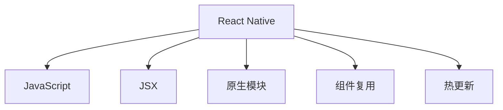

                 

# React Native跨平台移动应用开发

> 关键词：React Native, 跨平台移动应用, 前端技术, JavaScript, 原生应用, 性能优化, 组件复用, 混合应用开发

## 1. 背景介绍

### 1.1 问题由来
在移动互联网时代，开发一个跨平台的应用变得至关重要。随着智能手机、平板电脑等移动设备的普及，用户对移动应用的需求日益增加，而且这些设备具有多种不同的操作系统，如iOS、Android和Windows等。因此，为了节省时间和成本，开发人员通常希望使用一种技术来开发跨平台应用程序。在这个背景下，React Native作为一款快速发展的跨平台移动应用开发框架，逐渐成为开发者的首选。

React Native是由Facebook在2015年推出的一个开源框架，允许开发人员使用JavaScript和React来开发iOS和Android平台的原生应用程序。React Native允许开发人员使用JavaScript和React编写代码，并将代码编译为原生代码，从而实现跨平台开发。React Native不仅在开发速度上有优势，而且能够提供与原生应用相同的用户体验。

### 1.2 问题核心关键点
React Native的核心优势在于其灵活性和高效性。它允许开发人员使用同一份代码库来构建iOS和Android应用程序，大大缩短了开发周期，降低了开发成本。同时，React Native的组件复用和热更新功能，提高了开发效率，支持快速迭代和版本更新。

但React Native也存在一些问题，例如性能瓶颈、组件差异、原生模块集成等问题。在实际开发中，开发人员需要掌握这些核心问题，才能更好地利用React Native的优势。

### 1.3 问题研究意义
研究React Native的跨平台移动应用开发方法，对于开发高质量的跨平台应用程序具有重要意义：

1. 提高开发效率：使用React Native可以节省开发时间，降低开发成本，并且支持快速迭代和版本更新。
2. 提升用户体验：React Native提供与原生应用相同的用户体验，通过组件复用和热更新功能，保持应用程序的更新和优化。
3. 实现跨平台：React Native允许使用同一份代码库来构建iOS和Android应用程序，从而实现跨平台开发。
4. 支持原生模块：React Native支持集成原生模块，能够访问设备硬件和软件功能。
5. 快速迭代开发：React Native的热更新功能支持实时更新，实现快速迭代开发。

## 2. 核心概念与联系

### 2.1 核心概念概述

为了更好地理解React Native的跨平台移动应用开发方法，本节将介绍几个密切相关的核心概念：

- React Native：由Facebook推出的跨平台移动应用开发框架，允许开发人员使用JavaScript和React编写代码，并将代码编译为原生代码。
- JavaScript：一种高级的编程语言，广泛应用于Web前端开发和移动应用开发。
- JSX：一种用于构建React组件的标记语言，将JavaScript和HTML结合使用，增强代码可读性。
- 原生模块：允许React Native应用程序访问设备硬件和软件功能的模块，例如相机、地理位置等。
- 组件复用：通过组件复用，可以大大减少代码量，提高开发效率。
- 热更新：允许开发人员在运行时更新代码，无需重新编译和部署应用程序。

这些核心概念之间的逻辑关系可以通过以下Mermaid流程图来展示：



这个流程图展示了一些核心概念之间的联系：

1. React Native使用JavaScript和React作为开发语言。
2. JSX是一种用于构建React组件的标记语言。
3. 原生模块允许React Native应用程序访问设备硬件和软件功能。
4. 组件复用和热更新功能提高了开发效率和用户体验。

## 3. 核心算法原理 & 具体操作步骤
### 3.1 算法原理概述

React Native的跨平台移动应用开发主要基于JavaScript和React技术栈。开发人员可以使用React来构建组件，并使用JavaScript编写逻辑。React Native使用原生模块桥接JavaScript和原生代码，从而实现跨平台功能。

React Native的核心算法原理包括以下几个方面：

1. JavaScript和React的语法：React Native使用JavaScript和React技术栈，这意味着开发人员需要熟悉这些语言的语法和特性。
2. 组件复用：React Native使用组件复用技术，允许开发人员在不同平台上使用相同的组件。
3. 原生模块桥接：React Native使用原生模块桥接技术，允许开发人员访问设备硬件和软件功能。
4. 热更新：React Native使用热更新技术，允许开发人员在运行时更新代码，无需重新编译和部署应用程序。

### 3.2 算法步骤详解

React Native的跨平台移动应用开发一般包括以下几个关键步骤：

**Step 1: 准备开发环境**

- 安装Node.js和React Native的依赖。
- 安装Android Studio和Xcode，用于开发iOS和Android平台的应用程序。

**Step 2: 创建React Native项目**

- 使用React Native CLI创建新的React Native项目。
- 运行项目，确保一切正常工作。

**Step 3: 编写React组件**

- 使用JSX编写React组件。
- 编写逻辑，例如数据处理、路由等。

**Step 4: 集成原生模块**

- 使用原生模块桥接技术，将JavaScript代码与原生代码连接起来。
- 编写原生模块代码，实现设备硬件和软件功能。

**Step 5: 组件复用**

- 将React组件复用到不同平台上。
- 调整组件以适应不同平台的UI和UX需求。

**Step 6: 热更新**

- 在运行时更新代码，使用热更新技术。
- 调整代码，并在运行时更新。

### 3.3 算法优缺点

React Native的跨平台移动应用开发方法具有以下优点：

1. 开发效率高：使用React Native可以节省开发时间，降低开发成本。
2. 性能优异：React Native使用原生组件和原生模块桥接技术，提供与原生应用相同的性能。
3. 组件复用：React Native使用组件复用技术，允许开发人员在不同平台上使用相同的组件。
4. 热更新：React Native使用热更新技术，允许开发人员在运行时更新代码，无需重新编译和部署应用程序。
5. 跨平台：React Native允许开发人员使用同一份代码库来构建iOS和Android应用程序。

同时，React Native也存在一些缺点：

1. 学习曲线较陡：对于JavaScript和React不熟悉的人可能需要时间来学习React Native。
2. 性能瓶颈：React Native在处理复杂动画和大量数据时可能遇到性能瓶颈。
3. 组件差异：不同平台上的组件可能存在差异，需要进行调整。
4. 原生模块集成：需要了解原生模块和原生API，集成原生模块可能会比较复杂。
5. 调试难度：由于React Native运行在原生平台上，调试可能比Web应用更复杂。

### 3.4 算法应用领域

React Native的跨平台移动应用开发方法适用于以下应用领域：

- 社交网络：例如WhatsApp、Facebook等。
- 电商应用：例如Shopify、Etsy等。
- 游戏应用：例如Angry Birds、Flicker等。
- 金融应用：例如Bank of America、PayPal等。
- 教育应用：例如Duolingo、Khan Academy等。

除了这些典型应用外，React Native还可以应用于更多场景中，例如物联网、智能家居、车联网等。随着React Native的不断发展和完善，相信其在更多领域的应用也会不断扩大。

## 4. 数学模型和公式 & 详细讲解 & 举例说明
### 4.1 数学模型构建

React Native的跨平台移动应用开发主要基于JavaScript和React技术栈。因此，开发人员需要熟悉JavaScript和React的数学模型。

**JavaScript数学模型**

- 基本数据类型：JavaScript中的基本数据类型包括数字、字符串、布尔值、null、undefined和Symbol等。
- 数学函数：JavaScript中的数学函数包括Math对象提供的所有函数，例如Math.abs、Math.sqrt、Math.sin等。
- 数组和对象：JavaScript中的数组和对象也提供了数学运算，例如数组的sum、平均值、最大值和最小值等。

**React数学模型**

- 组件生命周期：React中的组件生命周期包括三个阶段：挂载、更新和卸载。
- 状态管理：React中的状态管理通过setState方法来实现，用于更新组件的状态。
- 事件处理：React中的事件处理使用addEventListener方法来实现，用于处理用户交互事件。

### 4.2 公式推导过程

以下是React Native中一些常用的公式推导过程：

**JavaScript数组求和**

- 定义一个数组，例如arr = [1, 2, 3, 4, 5]。
- 使用sum = arr.reduce((acc, cur) => acc + cur, 0)来计算数组的总和。
- 推导过程如下：

$$
\begin{align*}
sum &= arr.reduce((acc, cur) => acc + cur, 0) \\
&= [1, 2, 3, 4, 5].reduce((acc, cur) => acc + cur, 0) \\
&= (0 + 1) + (1 + 2) + (3 + 4) + (7 + 5) \\
&= 15
\end{align*}
$$

**React组件生命周期**

- React组件的生命周期包括以下三个阶段：
  - Mounting（挂载）：组件被创建并插入DOM。
  - Updating（更新）：组件的状态或属性发生变化。
  - Unmounting（卸载）：组件从DOM中移除。
- 组件生命周期的函数包括：
  - Constructor（构造函数）：在组件创建时执行。
  - componentDidMount（挂载后）：在组件挂载到DOM后执行。
  - componentWillUnmount（卸载前）：在组件从DOM中移除前执行。

**React事件处理**

- React中的事件处理使用addEventListener方法来实现，用于处理用户交互事件。
- 例如，在一个按钮组件中，使用onClick事件来处理按钮点击事件：

```javascript
<button onClick={() => console.log('Button clicked!')}>
  Click me
</button>
```

### 4.3 案例分析与讲解

以下是React Native中的一个具体案例分析：

**React Native中的地理位置**

- 使用React Native的Permissions库获取设备的位置权限。
- 在组件中调用Permissions.request方法获取位置信息。
- 使用Geolocation库获取当前位置信息。
- 在组件中显示当前位置信息。

```javascript
import Permissions from 'react-native-permissions';
import Geolocation from 'react-native-geolocation-service';

class LocationComponent extends React.Component {
  constructor(props) {
    super(props);
    this.state = {
      latitude: null,
      longitude: null
    };
  }

  componentDidMount() {
    Permissions.check('location').then(response => {
      if (response === 'granted') {
        Geolocation.getCurrentPosition(position => {
          this.setState({
            latitude: position.latitude,
            longitude: position.longitude
          });
        });
      } else {
        Permissions.request('location');
      }
    });
  }

  render() {
    return (
      <View>
        <Text>Latitude: {this.state.latitude}</Text>
        <Text>Longitude: {this.state.longitude}</Text>
      </View>
    );
  }
}

export default LocationComponent;
```

## 5. 项目实践：代码实例和详细解释说明
### 5.1 开发环境搭建

在进行React Native项目开发前，需要准备好开发环境。以下是使用React Native进行iOS应用开发的环境配置流程：

1. 安装Node.js和React Native的依赖。
2. 安装Xcode，用于开发iOS平台的应用程序。
3. 创建React Native项目。
4. 运行项目，确保一切正常工作。

### 5.2 源代码详细实现

这里我们以React Native开发一个简单的计数器应用为例，给出完整的代码实现。

首先，创建一个名为Counter的组件：

```javascript
import React, { Component } from 'react';
import { Text, View, Button } from 'react-native';

export default class Counter extends Component {
  constructor(props) {
    super(props);
    this.state = {
      count: 0
    };
  }

  increment() {
    this.setState({ count: this.state.count + 1 });
  }

  decrement() {
    this.setState({ count: this.state.count - 1 });
  }

  render() {
    return (
      <View>
        <Text>Count: {this.state.count}</Text>
        <Button title="Increment" onPress={() => this.increment()} />
        <Button title="Decrement" onPress={() => this.decrement()} />
      </View>
    );
  }
}
```

然后，创建一个名为App的组件：

```javascript
import React, { Component } from 'react';
import { AppRegistry } from 'react-native';
import Counter from './Counter';

export default class App extends Component {
  render() {
    return (
      <Counter />
    );
  }
}

AppRegistry.registerComponent('App', () => App);
```

最后，将Counter组件添加到App组件中，并运行项目。

### 5.3 代码解读与分析

让我们再详细解读一下关键代码的实现细节：

**Counter组件**

- 在构造函数中初始化组件状态，包括计数器count。
- 在increment方法中，使用setState更新计数器值。
- 在decrement方法中，使用setState更新计数器值。
- 在render方法中，使用<Text>组件显示计数器值，使用<Button>组件添加计数器按钮。

**App组件**

- 在render方法中，返回Counter组件，将计数器组件显示在App组件中。

### 5.4 运行结果展示

运行项目后，可以看到一个简单的计数器应用，可以通过点击两个按钮来增加或减少计数器值。

## 6. 实际应用场景
### 6.1 智能家居应用

React Native的跨平台移动应用开发方法可以应用于智能家居领域，例如开发一个智能灯泡控制应用。使用React Native可以大大缩短开发时间，并且可以在iOS和Android平台上实现相同的功能。开发人员可以使用原生模块桥接技术，访问设备硬件和软件功能，例如灯泡的亮度控制、颜色调节等功能。

### 6.2 金融应用

React Native的跨平台移动应用开发方法可以应用于金融领域，例如开发一个理财应用。使用React Native可以大大缩短开发时间，并且可以在iOS和Android平台上实现相同的功能。开发人员可以使用原生模块桥接技术，访问设备硬件和软件功能，例如查看账户余额、转账等功能。

### 6.3 教育应用

React Native的跨平台移动应用开发方法可以应用于教育领域，例如开发一个学习应用。使用React Native可以大大缩短开发时间，并且可以在iOS和Android平台上实现相同的功能。开发人员可以使用原生模块桥接技术，访问设备硬件和软件功能，例如视频播放、笔记记录等功能。

### 6.4 未来应用展望

随着React Native的不断发展和完善，相信在更多领域的应用也会不断扩大。例如，React Native可以应用于医疗领域，开发一个健康监测应用；可以应用于旅游领域，开发一个旅游指南应用；可以应用于游戏领域，开发一个游戏应用等。

React Native的跨平台移动应用开发方法也将不断进化，支持更多的功能和组件，提高开发效率和用户体验。未来，React Native的应用场景将会更加广阔，为开发者提供更多的机会和挑战。

## 7. 工具和资源推荐
### 7.1 学习资源推荐

为了帮助开发者系统掌握React Native的跨平台移动应用开发方法，这里推荐一些优质的学习资源：

1. React Native官方文档：React Native官方文档提供了详细的API和组件介绍，是开发者学习React Native的必备资源。
2. React Native中文网：React Native中文网提供了丰富的教程和实例，适合初学者入门学习。
3. React Native开发手册：React Native开发手册提供了详细的开发步骤和最佳实践，适合开发者参考学习。
4. React Native教程：React Native教程提供了丰富的视频和文章教程，适合开发者全面学习。

通过这些学习资源的学习实践，相信你一定能够快速掌握React Native的跨平台移动应用开发方法，并用于解决实际的开发问题。

### 7.2 开发工具推荐

高效的开发离不开优秀的工具支持。以下是几款用于React Native开发的工具：

1. React Native CLI：React Native命令行工具，用于创建和管理React Native项目。
2. Xcode：苹果官方的IDE，用于开发iOS平台的应用程序。
3. Android Studio：谷歌官方的IDE，用于开发Android平台的应用程序。
4. Visual Studio Code：微软推出的轻量级编辑器，支持React Native开发。
5. React Native Debugger：React Native调试工具，用于调试React Native应用程序。

合理利用这些工具，可以显著提升React Native应用的开发效率，加快创新迭代的步伐。

### 7.3 相关论文推荐

React Native的跨平台移动应用开发方法源于学界的持续研究。以下是几篇奠基性的相关论文，推荐阅读：

1. "React Native: A Framework for Building Native Applications with JavaScript and React"：论文介绍了React Native的核心思想和技术栈，适合开发者全面了解。
2. "React Native: Cross-Platform Development for Mobile Apps"：论文介绍了React Native的跨平台移动应用开发方法，适合开发者深入研究。
3. "React Native: An Overview and Future Directions"：论文介绍了React Native的未来方向和技术发展，适合开发者前瞻性了解。

这些论文代表了大语言模型微调技术的发展脉络。通过学习这些前沿成果，可以帮助研究者把握学科前进方向，激发更多的创新灵感。

## 8. 总结：未来发展趋势与挑战
### 8.1 总结

本文对React Native的跨平台移动应用开发方法进行了全面系统的介绍。首先阐述了React Native和跨平台移动应用开发的背景和意义，明确了React Native在跨平台开发中的核心优势。其次，从原理到实践，详细讲解了React Native的数学模型和关键步骤，给出了React Native应用的完整代码实现。同时，本文还广泛探讨了React Native方法在智能家居、金融、教育等众多领域的应用前景，展示了React Native方法的巨大潜力。此外，本文精选了React Native的学习资源，力求为开发者提供全方位的技术指引。

通过本文的系统梳理，可以看到，React Native的跨平台移动应用开发方法正在成为移动应用开发的重要范式，极大地拓展了移动应用开发边界，催生了更多的落地场景。受益于React Native技术的不断发展和完善，相信其在更多领域的应用也会不断扩大。

### 8.2 未来发展趋势

展望未来，React Native的跨平台移动应用开发方法将呈现以下几个发展趋势：

1. 性能优化：React Native将不断优化性能，提高用户体验。
2. 组件复用：React Native将支持更多的组件复用，提高开发效率。
3. 热更新：React Native将支持更多的热更新功能，提高迭代速度。
4. 原生模块：React Native将支持更多的原生模块，提供更多的功能。
5. 社区发展：React Native的社区将不断发展壮大，提供更多的资源和支持。

以上趋势凸显了React Native跨平台移动应用开发方法的广泛应用前景。这些方向的探索发展，必将进一步提升React Native的应用性能和开发效率，为开发者提供更多的机会和挑战。

### 8.3 面临的挑战

尽管React Native的跨平台移动应用开发方法已经取得了瞩目成就，但在迈向更加智能化、普适化应用的过程中，它仍面临着诸多挑战：

1. 性能瓶颈：React Native在处理复杂动画和大量数据时可能遇到性能瓶颈。
2. 组件差异：不同平台上的组件可能存在差异，需要进行调整。
3. 原生模块集成：需要了解原生模块和原生API，集成原生模块可能会比较复杂。
4. 调试难度：由于React Native运行在原生平台上，调试可能比Web应用更复杂。
5. 学习曲线陡峭：对于JavaScript和React不熟悉的人可能需要时间来学习React Native。

### 8.4 研究展望

面对React Native面临的这些挑战，未来的研究需要在以下几个方面寻求新的突破：

1. 性能优化：React Native将不断优化性能，提高用户体验。
2. 组件复用：React Native将支持更多的组件复用，提高开发效率。
3. 热更新：React Native将支持更多的热更新功能，提高迭代速度。
4. 原生模块：React Native将支持更多的原生模块，提供更多的功能。
5. 社区发展：React Native的社区将不断发展壮大，提供更多的资源和支持。

这些研究方向将引领React Native跨平台移动应用开发方法迈向更高的台阶，为开发者提供更多的机会和挑战。只有勇于创新、敢于突破，才能不断拓展React Native的边界，让跨平台移动应用开发技术更好地造福人类社会。

## 9. 附录：常见问题与解答
**Q1：React Native中的性能瓶颈如何解决？**

A: React Native中的性能瓶颈可以通过以下方式解决：

1. 使用原生组件：尽量使用原生组件，避免使用Web组件。
2. 使用动画优化：使用动画优化库，例如React Native提供的动画API，优化动画性能。
3. 使用PureComponent：使用PureComponent优化组件渲染性能。
4. 使用数据缓存：使用数据缓存技术，减少不必要的数据加载。

**Q2：React Native中的组件差异如何解决？**

A: React Native中的组件差异可以通过以下方式解决：

1. 使用Platform模块：使用Platform模块判断设备平台，选择不同的组件实现。
2. 使用第三方库：使用第三方库解决不同平台上的组件差异问题。
3. 自定义组件：自定义原生组件，解决不同平台上的组件差异问题。

**Q3：React Native中的原生模块集成有哪些注意事项？**

A: React Native中的原生模块集成需要注意以下几点：

1. 使用原生模块桥接：使用原生模块桥接技术，将JavaScript代码与原生代码连接起来。
2. 了解原生API：了解原生API，熟悉原生模块的使用方法。
3. 避免依赖问题：避免原生模块之间的依赖问题，确保模块之间的协同工作。

**Q4：React Native中的调试难度如何解决？**

A: React Native中的调试难度可以通过以下方式解决：

1. 使用React Native Debugger：使用React Native Debugger工具进行调试。
2. 使用Chrome DevTools：使用Chrome DevTools进行调试。
3. 使用Native模块调试：使用Native模块调试工具，例如Xcode调试器或Android Studio调试器。

通过这些方式，可以更好地解决React Native中的调试问题，提高开发效率和用户体验。

