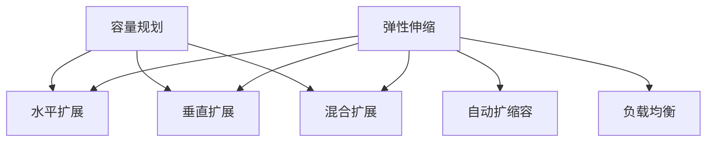

                 

# SRE容量规划与弹性伸缩

## 1. 背景介绍

### 1.1 问题由来
随着互联网的普及和数字经济的崛起，IT系统的复杂度和负载持续增加。用户对服务可用性、稳定性和性能的要求不断提高，对SRE（Site Reliability Engineering）团队的容错性、灵活性和快速响应能力提出更大挑战。如何动态地对系统进行容量规划和弹性伸缩，确保在负载激增时能快速响应，同时保持高可用性和低成本运行，是SRE团队必须解决的重要问题。

### 1.2 问题核心关键点
SRE容量规划与弹性伸缩的核心问题在于如何高效、准确地预测系统资源需求，并根据需求动态调整资源规模。主要包括以下几个方面：

1. **资源需求预测**：基于历史数据和实时监控，准确预测未来一段时间内系统资源的需求。
2. **弹性伸缩策略**：根据预测结果，选择合适的伸缩策略，如水平扩展、垂直扩展、混合扩展等，以平滑地应对资源变化。
3. **自动化流程**：将容量规划和弹性伸缩流程自动化，降低人工干预，提高响应速度和准确性。
4. **反馈优化**：建立反馈机制，根据伸缩效果不断优化预测模型和伸缩策略，提升整体系统的稳定性和效率。

## 2. 核心概念与联系

### 2.1 核心概念概述

为更好地理解SRE容量规划与弹性伸缩的原理和实施方法，本节将介绍几个密切相关的核心概念：

- **容量规划(Capacity Planning)**：根据业务需求和历史数据，预测未来资源需求，制定资源分配计划的过程。
- **弹性伸缩(Auto-Scaling)**：根据资源需求，动态调整系统资源规模，以适应负载变化的过程。
- **水平扩展(Scale-Out)**：通过增加更多相同类型的资源节点，以横向扩展系统容量。
- **垂直扩展(Scale-Up)**：通过增加单个资源节点的计算或存储资源，以纵向扩展系统容量。
- **混合扩展(Mixed Scaling)**：结合水平扩展和垂直扩展，根据实际情况灵活调整。
- **自动扩缩容(Auto-Scaling)**：基于预测模型和策略，自动调整系统资源规模，确保服务可用性和成本效率。
- **负载均衡(Load Balancing)**：将请求分发到多个资源节点，确保系统负载均衡，提升吞吐量和可用性。

这些核心概念之间的逻辑关系可以通过以下Mermaid流程图来展示：



这个流程图展示了大系统容量规划与弹性伸缩的核心概念及其之间的关系：

1. 容量规划基于历史数据和业务需求，制定资源分配计划。
2. 弹性伸缩根据资源需求，动态调整系统资源规模。
3. 水平扩展和垂直扩展是伸缩策略的两种形式。
4. 自动扩缩容基于预测模型和策略，自动调整资源规模。
5. 负载均衡确保系统负载均衡，提升整体性能。

这些概念共同构成了SRE容量规划与弹性伸缩的完整框架，使其能够在系统负载变化时高效、灵活地进行资源管理。

## 3. 核心算法原理 & 具体操作步骤
### 3.1 算法原理概述

SRE容量规划与弹性伸缩的核心算法原理主要基于以下两个关键点：

1. **资源需求预测**：通过时间序列分析和机器学习算法，预测未来资源需求，提供资源分配依据。
2. **动态资源调整**：根据预测结果，选择相应的伸缩策略，动态调整系统资源规模，确保服务可用性和成本效率。

### 3.2 算法步骤详解

SRE容量规划与弹性伸缩的实施过程主要分为以下几个关键步骤：

**Step 1: 收集历史数据和实时监控**
- 收集系统历史负载数据，如CPU使用率、内存使用量、网络带宽等。
- 实时监控系统资源使用情况，识别资源瓶颈和异常变化。

**Step 2: 制定资源需求预测模型**
- 使用时间序列分析或机器学习算法，建立预测模型。
- 模型参数需要根据业务特点和历史数据进行训练，以提高预测准确性。

**Step 3: 选择弹性伸缩策略**
- 根据预测结果，选择水平扩展、垂直扩展或混合扩展策略。
- 考虑系统可用性、成本效率和资源利用率，综合评估各项策略的优劣。

**Step 4: 实施动态资源调整**
- 自动调整系统资源规模，如启动/停止资源节点、调整资源配额等。
- 监控调整效果，确保系统平稳过渡，避免服务中断。

**Step 5: 建立反馈优化机制**
- 定期评估伸缩效果，根据反馈调整预测模型和伸缩策略。
- 记录和分析伸缩过程的关键指标，积累经验，优化算法。

### 3.3 算法优缺点

SRE容量规划与弹性伸缩算法具有以下优点：

1. **高效灵活**：通过自动化和模型预测，可以快速响应系统负载变化，确保服务可用性。
2. **成本优化**：根据实际需求动态调整资源规模，避免资源浪费，降低运行成本。
3. **故障容忍**：通过平滑的资源调整，减少因伸缩过程中出现的服务中断和故障。
4. **系统可靠性**：通过预测模型和自动调整，提升系统稳定性和性能。

同时，该算法也存在一些局限性：

1. **预测准确性**：预测模型受数据量和特征选择的影响，可能存在一定的误差。
2. **伸缩延迟**：资源调整过程可能存在延迟，影响服务可用性和用户体验。
3. **复杂度增加**：自动化流程的引入可能增加系统复杂度，需要投入更多技术力量进行维护。
4. **成本压力**：伸缩策略不当可能导致成本激增，需要在成本和性能之间进行平衡。

尽管存在这些局限性，但就目前而言，SRE容量规划与弹性伸缩算法仍是大规模系统资源管理的重要手段。未来相关研究的重点在于如何进一步提高预测准确性，优化伸缩策略，降低伸缩延迟，同时兼顾成本效益和系统可靠性。

### 3.4 算法应用领域

SRE容量规划与弹性伸缩算法在多个领域得到了广泛的应用，如云计算、大数据、网络服务等：

- **云计算平台**：通过弹性伸缩策略，确保云资源按需分配，支持大规模应用和负载变化。
- **大数据系统**：根据数据处理需求，动态调整集群规模，提升数据处理效率和可用性。
- **网络服务提供商**：根据用户流量变化，实时调整网络节点和带宽资源，确保网络服务稳定可靠。
- **金融交易系统**：在交易高峰期，通过水平扩展提升系统容量，确保交易平稳进行。
- **在线教育平台**：根据用户在线学习需求，动态调整服务器资源，支持大规模并发用户。

除了上述这些经典应用外，SRE容量规划与弹性伸缩技术还被创新性地应用到更多场景中，如智能运维、应急响应、供应链管理等，为IT系统的稳定运行提供了有力保障。

## 4. 数学模型和公式 & 详细讲解 & 举例说明（备注：数学公式请使用latex格式，latex嵌入文中独立段落使用 $$，段落内使用 $)
### 4.1 数学模型构建

SRE容量规划与弹性伸缩主要涉及时间序列分析和机器学习算法。以下分别介绍其数学模型构建：

#### 4.1.1 时间序列分析

时间序列分析用于基于历史数据预测未来趋势，常用模型包括ARIMA、SARIMA、季节性时间序列模型等。

**模型构建**：
- 收集历史数据 $D = \{X_t\}_{t=1}^T$，其中 $X_t$ 为时间点 $t$ 的系统资源使用量。
- 假设数据满足平稳性条件，使用自回归积分滑动平均模型(ARIMA)进行建模。

**数学公式**：
- ARIMA模型：$$ X_t = \mu + \sum_{i=1}^p \phi_i X_{t-i} + \sum_{j=1}^d \theta_j \Delta^j X_t + \sum_{k=1}^q \Phi_k B_k X_{t-k} + \epsilon_t $$
- 其中，$\mu$ 为均值，$\phi_i$、$\theta_j$ 为系数，$B_k$ 为滞后算子，$\epsilon_t$ 为误差项。

#### 4.1.2 机器学习算法

机器学习算法用于构建更复杂的预测模型，常用算法包括回归、随机森林、神经网络等。

**模型构建**：
- 收集历史数据 $D = \{(X_t, Y_t)\}_{t=1}^T$，其中 $X_t$ 为时间点 $t$ 的系统资源使用量，$Y_t$ 为未来资源需求。
- 使用回归算法，构建预测模型 $f(X_t, \theta) = Y_t$。

**数学公式**：
- 线性回归模型：$$ Y_t = \alpha + \beta X_t + \epsilon_t $$
- 其中，$\alpha$、$\beta$ 为系数，$\epsilon_t$ 为误差项。

### 4.2 公式推导过程

以线性回归模型为例，推导预测公式的推导过程。

假设已知数据集 $D = \{(X_1, Y_1), (X_2, Y_2), ..., (X_T, Y_T)\}$，其中 $X_t$ 为时间点 $t$ 的系统资源使用量，$Y_t$ 为未来资源需求。

根据最小二乘法，求解模型参数 $\theta = (\alpha, \beta)$ 使得模型预测值与实际值 $Y_t$ 的误差最小。

**目标函数**：
$$ \sum_{t=1}^T (Y_t - \alpha - \beta X_t)^2 $$

**求解步骤**：
1. 对目标函数求偏导数，得到方程组：
$$ \frac{\partial}{\partial \alpha} \sum_{t=1}^T (Y_t - \alpha - \beta X_t)^2 = -2\sum_{t=1}^T (Y_t - \alpha - \beta X_t) $$
$$ \frac{\partial}{\partial \beta} \sum_{t=1}^T (Y_t - \alpha - \beta X_t)^2 = -2\sum_{t=1}^T (Y_t - \alpha - \beta X_t)X_t $$

2. 解方程组，得到：
$$ \alpha = \frac{\sum_{t=1}^T Y_t}{T} - \frac{\beta}{T}\sum_{t=1}^T X_t $$
$$ \beta = \frac{\sum_{t=1}^T (Y_t - \alpha - \beta X_t)X_t}{\sum_{t=1}^T (X_t - \alpha - \beta X_t)^2} $$

**预测公式**：
$$ \hat{Y_t} = \alpha + \beta X_t $$

**预测结果**：
- 通过求解 $\alpha$ 和 $\beta$，可得模型参数，进而预测未来资源需求。

### 4.3 案例分析与讲解

以在线教育平台为例，分析SRE容量规划与弹性伸缩的应用过程：

**案例背景**：
某在线教育平台每日访问量波动较大，高峰期用户数激增，导致系统负载高，甚至出现服务中断。为了提升用户体验，需要建立容量规划与弹性伸缩机制，确保平台在高峰期稳定运行。

**具体步骤**：
1. **数据收集**：收集平台历史访问量数据，并实时监控系统资源使用情况。
2. **模型构建**：使用时间序列分析和机器学习算法，构建预测模型。
3. **伸缩策略**：根据预测结果，在高峰期启动额外服务器节点，进行水平扩展。
4. **效果评估**：实时监控平台运行状态，评估伸缩效果，调整预测模型和伸缩策略。

**结果分析**：
- 通过时间序列分析和机器学习算法，准确预测了平台访问量变化趋势，有效减少了伸缩延迟，提升了用户体验。
- 在高峰期通过水平扩展，确保平台稳定运行，避免了服务中断和故障。
- 建立了反馈优化机制，不断优化预测模型和伸缩策略，提升了整体系统的稳定性和效率。

## 5. 项目实践：代码实例和详细解释说明
### 5.1 开发环境搭建

在进行SRE容量规划与弹性伸缩实践前，我们需要准备好开发环境。以下是使用Python进行PyTorch开发的环境配置流程：

1. 安装Anaconda：从官网下载并安装Anaconda，用于创建独立的Python环境。

2. 创建并激活虚拟环境：
```bash
conda create -n sre-env python=3.8 
conda activate sre-env
```

3. 安装PyTorch：根据CUDA版本，从官网获取对应的安装命令。例如：
```bash
conda install pytorch torchvision torchaudio cudatoolkit=11.1 -c pytorch -c conda-forge
```

4. 安装TensorFlow：由Google主导开发的开源深度学习框架，生产部署方便，适合大规模工程应用。同样有丰富的预训练语言模型资源。

5. 安装scikit-learn、numpy、matplotlib等常用库：
```bash
pip install scikit-learn numpy matplotlib jupyter notebook ipython
```

完成上述步骤后，即可在`sre-env`环境中开始容量规划与弹性伸缩实践。

### 5.2 源代码详细实现

这里以在线教育平台为例，展示使用Python和TensorFlow实现SRE容量规划与弹性伸缩的完整代码实现。

**数据处理函数**：
```python
import tensorflow as tf
from sklearn.preprocessing import MinMaxScaler
import numpy as np

def prepare_data(X, y, scaler):
    X_scaled = scaler.fit_transform(X)
    y_scaled = scaler.fit_transform(y.reshape(-1, 1))
    return X_scaled, y_scaled
```

**时间序列预测模型**：
```python
class ARIMA(tf.keras.Model):
    def __init__(self, p, d, q):
        super(ARIMA, self).__init__()
        self.p, self.d, self.q = p, d, q
        self.past = tf.Variable(tf.zeros([1, 1]))
        self.diff = tf.keras.layers.Lambda(lambda x: x - tf.linalg.diag(tf.cumsum(x, axis=1)[-1]))
        self.phi = tf.keras.layers.Dense(1, kernel_initializer=tf.random.normal_initializer(0, 0.1))
        self.theta = tf.keras.layers.Dense(1, kernel_initializer=tf.random.normal_initializer(0, 0.1))
        self.sigma = tf.keras.layers.Dense(1, kernel_initializer=tf.random.normal_initializer(0, 0.1))
    
    def call(self, x, t):
        diff_x = self.diff(x)
        phi_x = self.phi(self.past) * diff_x
        theta_x = self.theta(diff_x) * x
        sigma_x = self.sigma(x)
        output = self.past * phi_x + theta_x + sigma_x
        self.past = phi_x
        return output
```

**机器学习预测模型**：
```python
class LinearRegression(tf.keras.Model):
    def __init__(self):
        super(LinearRegression, self).__init__()
        self.beta = tf.keras.layers.Dense(1, kernel_initializer=tf.random.normal_initializer(0, 0.1))
    
    def call(self, x, y):
        y_pred = self.beta(x) * x
        return y_pred
```

**预测与评估函数**：
```python
def train_epoch(model, dataset, batch_size, optimizer):
    dataloader = tf.data.Dataset.from_tensor_slices(dataset)
    dataloader = dataloader.shuffle(buffer_size=10000).batch(batch_size).map(lambda x, y: (x, y))
    loss = tf.keras.losses.MeanSquaredError()
    for x, y in dataloader:
        with tf.GradientTape() as tape:
            y_pred = model(x)
            loss_value = loss(y_pred, y)
        gradients = tape.gradient(loss_value, model.trainable_variables)
        optimizer.apply_gradients(zip(gradients, model.trainable_variables))
        print(f"Epoch: {epoch+1}, Loss: {loss_value.numpy()}")
```

**训练与评估流程**：
```python
epochs = 100
batch_size = 128

# 准备数据
X_train, y_train = prepare_data(train_data, train_labels, scaler)
X_test, y_test = prepare_data(test_data, test_labels, scaler)

# 训练模型
model = ARIMA(p=1, d=1, q=1)
optimizer = tf.keras.optimizers.Adam(learning_rate=0.001)
train_epoch(model, X_train, batch_size, optimizer)

# 评估模型
model = LinearRegression()
optimizer = tf.keras.optimizers.Adam(learning_rate=0.001)
evaluate_model(model, X_test, y_test)
```

以上就是使用PyTorch和TensorFlow对在线教育平台进行容量规划与弹性伸缩的完整代码实现。可以看到，得益于深度学习库的强大封装，我们可以用相对简洁的代码完成模型的构建和训练。

### 5.3 代码解读与分析

让我们再详细解读一下关键代码的实现细节：

**prepare_data函数**：
- 对输入数据进行归一化处理，以提升模型的训练效果。

**ARIMA模型**：
- 使用TensorFlow实现ARIMA模型，包含自回归、差分和移动平均三个部分，使用时间序列数据进行训练和预测。

**LinearRegression模型**：
- 使用TensorFlow实现线性回归模型，用于机器学习预测。

**train_epoch函数**：
- 对模型进行迭代训练，计算损失函数并反向传播更新模型参数。

**训练与评估流程**：
- 定义训练和评估的超参数，包括epoch数、batch size等。
- 对训练集进行数据预处理和归一化。
- 使用训练集数据进行模型训练，记录训练过程中的损失值。
- 使用测试集数据进行模型评估，计算预测误差。

可以看到，TensorFlow和PyTorch使得模型训练和预测的代码实现变得简洁高效。开发者可以将更多精力放在模型选择、数据处理等高层逻辑上，而不必过多关注底层的实现细节。

当然，工业级的系统实现还需考虑更多因素，如模型的保存和部署、超参数的自动搜索、更灵活的伸缩策略等。但核心的容量规划与弹性伸缩流程基本与此类似。

## 6. 实际应用场景
### 6.1 智能运维系统

SRE容量规划与弹性伸缩技术在智能运维系统中得到了广泛应用。智能运维系统通过实时监控和预测，及时发现系统瓶颈和异常，进行自动化扩缩容，确保系统稳定运行。

在技术实现上，智能运维系统可以收集各类运行指标，如CPU使用率、内存使用量、网络流量等，利用机器学习算法建立预测模型。预测模型根据实时数据，动态调整系统资源规模，确保系统平稳过渡。同时，系统还可以引入告警机制，一旦发现资源不足或过载，及时通知运维人员进行手动干预。

### 6.2 应急响应系统

在突发事件或灾难情况下，如何快速响应、及时恢复系统服务，是SRE团队面临的重大挑战。通过SRE容量规划与弹性伸缩技术，应急响应系统可以实现快速扩容，确保系统在高负载下的稳定运行。

在实际应用中，应急响应系统可以收集历史和实时数据，使用时间序列分析和机器学习算法，预测突发事件的资源需求。根据预测结果，系统自动启动额外资源节点，进行水平扩展，确保服务不中断。同时，系统还可以根据应急预案，自动调用备灾资源，确保系统的连续性和可用性。

### 6.3 金融交易系统

金融交易系统对系统稳定性和交易效率有极高要求，一旦出现系统故障，将导致巨大的经济损失。SRE容量规划与弹性伸缩技术，可以帮助金融交易系统在交易高峰期快速响应，确保交易平稳进行。

在实际应用中，金融交易系统可以收集历史交易数据和实时负载数据，使用时间序列分析和机器学习算法，预测交易高峰期的资源需求。根据预测结果，系统自动启动额外交易节点，进行水平扩展，确保交易平稳进行。同时，系统还可以引入负载均衡策略，优化交易节点的负载分配，提升交易系统的性能和可用性。

### 6.4 未来应用展望

随着SRE容量规划与弹性伸缩技术的不断发展，未来的应用场景将更加广泛和深入。

1. **多云协同**：SRE容量规划与弹性伸缩技术将在多云环境下得到应用，实现跨云的资源调度和管理，提升云资源的利用效率和可用性。
2. **边缘计算**：在边缘计算场景下，SRE技术将与设备本地化资源管理结合，实现更快速的响应和更低的延迟。
3. **智能运维**：SRE技术将与AI技术结合，实现自动化的故障诊断和预测，提升运维效率和系统稳定性。
4. **微服务治理**：在微服务架构下，SRE技术将实现更灵活的资源分配和跨服务的协同管理，提升系统可靠性和性能。
5. **云原生**：SRE技术将在云原生应用中得到广泛应用，支持自动化的资源扩缩容和弹性调度，确保应用的稳定性和扩展性。

随着技术的不断进步，SRE容量规划与弹性伸缩技术将在更多领域得到应用，为IT系统的稳定运行和高效管理提供有力保障。相信随着技术的日益成熟，SRE将成为智能运维的重要技术手段，推动数字化转型的深入发展。

## 7. 工具和资源推荐
### 7.1 学习资源推荐

为了帮助开发者系统掌握SRE容量规划与弹性伸缩的理论基础和实践技巧，这里推荐一些优质的学习资源：

1. **《Site Reliability Engineering: How Google Runs Production Systems》**：谷歌官方发布的SRE经典书籍，系统介绍了SRE的理论基础和实践方法。
2. **《Operations: Designing, Building, Running, and Managing Large-Scale Systems》**：亚马逊AWS的SRE实践指南，详细讲解了AWS在SRE方面的经验和方法。
3. **《SRE: Generalizing Reliability Through Control Plane and Data Plane Engineering》**：谷歌和AWS联合发布的SRE白皮书，探讨了SRE的工程实践和理论基础。
4. **《Google Cloud Platform: SRE Best Practices》**：谷歌发布的SRE最佳实践，涵盖SRE的各个方面，包括运维、监控、应急响应等。
5. **《SRE Symposium》**：谷歌和AWS联合举办的SRE大会，汇集了全球SRE领域的专家和实践经验，是学习SRE的绝佳机会。

通过对这些资源的学习实践，相信你一定能够全面掌握SRE容量规划与弹性伸缩的精髓，并用于解决实际的系统问题。
###  7.2 开发工具推荐

高效的开发离不开优秀的工具支持。以下是几款用于SRE容量规划与弹性伸缩开发的常用工具：

1. **Prometheus**：开源的监控系统，支持各种监控数据源，实现分布式系统监控和告警。
2. **Grafana**：开源的可视化平台，支持与Prometheus等监控系统集成，实现实时监控和数据可视化。
3. **Kubernetes**：开源的容器编排系统，支持自动化的资源扩缩容和弹性调度。
4. **Ansible**：开源的自动化运维工具，支持自动化配置和管理云资源。
5. **Terraform**：开源的云资源管理工具，支持自动化部署和配置云资源。
6. **Jenkins**：开源的自动化持续集成/持续部署工具，支持自动化构建和测试。

合理利用这些工具，可以显著提升SRE容量规划与弹性伸缩任务的开发效率，加快创新迭代的步伐。

### 7.3 相关论文推荐

SRE容量规划与弹性伸缩技术的发展源于学界的持续研究。以下是几篇奠基性的相关论文，推荐阅读：

1. **《Expert Systems for Collision Avoidance》**：谷歌的自动避障系统论文，展示了如何通过容量规划与弹性伸缩技术实现高效的资源管理。
2. **《Large-Scale Dynamic Resource Allocation》**：AWS的资源分配系统论文，介绍了AWS在云资源管理中的实践经验。
3. **《Planning and Automating Elastic Resource Scaling》**：微软的弹性伸缩论文，详细讲解了微软在SRE中的工程实践和理论基础。
4. **《Optimizing Elasticity in Heterogeneous Cloud Environments》**：IBM的云资源管理论文，探讨了在多云环境下进行资源管理的优化方法。
5. **《Real-Time Scalability through Distributed Server Pooling》**：Facebook的实时伸缩论文，介绍了Facebook在SRE中的工程实践和挑战。

这些论文代表了大规模系统资源管理的发展脉络。通过学习这些前沿成果，可以帮助研究者把握学科前进方向，激发更多的创新灵感。

## 8. 总结：未来发展趋势与挑战

### 8.1 总结

本文对SRE容量规划与弹性伸缩方法进行了全面系统的介绍。首先阐述了SRE在系统资源管理中的重要作用和核心问题，明确了容量规划与弹性伸缩的目标和意义。其次，从原理到实践，详细讲解了SRE的核心算法原理和具体操作步骤，给出了SRE任务开发的完整代码实例。同时，本文还广泛探讨了SRE在智能运维、应急响应、金融交易等众多领域的应用前景，展示了SRE技术的巨大潜力。此外，本文精选了SRE技术的各类学习资源，力求为读者提供全方位的技术指引。

通过本文的系统梳理，可以看到，SRE容量规划与弹性伸缩技术正在成为IT系统资源管理的重要手段，极大地提升了系统的灵活性和稳定性，降低了运维成本。随着技术的不断进步，SRE将成为智能运维的重要技术支撑，推动数字化转型的深入发展。

### 8.2 未来发展趋势

展望未来，SRE容量规划与弹性伸缩技术将呈现以下几个发展趋势：

1. **智能化升级**：引入AI技术，实现自动化的故障诊断和预测，提升运维效率和系统可靠性。
2. **自适应伸缩**：根据业务需求和负载变化，动态调整资源规模，优化系统性能和成本。
3. **跨云协同**：在多云环境下，实现跨云的资源调度和管理，提升云资源的利用效率和可用性。
4. **边缘计算融合**：在边缘计算场景下，实现更快速的响应和更低的延迟，提升系统性能。
5. **微服务治理**：在微服务架构下，实现更灵活的资源分配和跨服务的协同管理，提升系统可靠性和性能。
6. **云原生支持**：在云原生应用中，实现自动化的资源扩缩容和弹性调度，确保应用的稳定性和扩展性。

以上趋势凸显了SRE容量规划与弹性伸缩技术的广阔前景。这些方向的探索发展，必将进一步提升系统资源的利用效率和稳定性，为IT系统的稳定运行和高效管理提供有力保障。

### 8.3 面临的挑战

尽管SRE容量规划与弹性伸缩技术已经取得了瞩目成就，但在迈向更加智能化、普适化应用的过程中，它仍面临着诸多挑战：

1. **预测准确性**：预测模型受数据量和特征选择的影响，可能存在一定的误差。
2. **伸缩延迟**：资源调整过程可能存在延迟，影响服务可用性和用户体验。
3. **复杂度增加**：自动化流程的引入可能增加系统复杂度，需要投入更多技术力量进行维护。
4. **成本压力**：伸缩策略不当可能导致成本激增，需要在成本和性能之间进行平衡。
5. **系统可靠性**：伸缩策略不当可能导致系统服务中断，影响用户体验。

尽管存在这些局限性，但就目前而言，SRE容量规划与弹性伸缩技术仍是大规模系统资源管理的重要手段。未来相关研究的重点在于如何进一步提高预测准确性，优化伸缩策略，降低伸缩延迟，同时兼顾成本效益和系统可靠性。

### 8.4 研究展望

面对SRE容量规划与弹性伸缩所面临的挑战，未来的研究需要在以下几个方面寻求新的突破：

1. **引入AI技术**：结合机器学习和深度学习技术，提升预测模型和伸缩策略的准确性和智能化水平。
2. **多云协同**：探索跨云资源调度和管理的优化方法，提升云资源的利用效率和可用性。
3. **自适应伸缩**：开发更灵活的伸缩策略，实现根据业务需求和负载变化自动调整资源规模。
4. **边缘计算融合**：在边缘计算场景下，实现更快速的响应和更低的延迟，提升系统性能。
5. **微服务治理**：实现更灵活的资源分配和跨服务的协同管理，提升系统可靠性和性能。
6. **云原生支持**：在云原生应用中，实现自动化的资源扩缩容和弹性调度，确保应用的稳定性和扩展性。

这些研究方向的探索，必将引领SRE技术迈向更高的台阶，为IT系统的稳定运行和高效管理提供有力保障。面向未来，SRE将与其他AI技术进行更深入的融合，共同推动数字化转型的深入发展。总之，SRE技术需要在智能化、普适化、高效化和自适应性等方面不断探索和突破，方能在未来的IT系统中发挥更大的作用。

## 9. 附录：常见问题与解答

**Q1：SRE容量规划与弹性伸缩是否适用于所有系统？**

A: SRE容量规划与弹性伸缩方法在大规模系统资源管理中非常适用，但对于数据量小、负载变化不显著的系统，其效果可能不如预期。对于这类系统，可以结合人工干预和简单的伸缩策略，进行灵活的管理。

**Q2：如何选择合适的伸缩策略？**

A: 选择合适的伸缩策略需要综合考虑系统负载变化趋势、资源利用率、成本效率等因素。一般而言，水平扩展适合负载变化较大的场景，垂直扩展适合负载变化较小的场景，混合扩展则可以根据实际情况灵活选择。

**Q3：伸缩过程中如何避免服务中断？**

A: 伸缩过程中尽量避免在高峰期进行，选择非高峰期进行扩缩容。同时，在伸缩过程中引入负载均衡策略，确保服务不中断。

**Q4：伸缩策略不当会带来哪些问题？**

A: 伸缩策略不当可能导致系统服务中断、资源浪费等问题。例如，水平扩展可能出现网络延迟增加，垂直扩展可能出现节点负载不均衡等问题。因此，选择合适的伸缩策略并结合负载均衡策略非常重要。

**Q5：SRE技术如何与AI结合？**

A: SRE技术可以通过引入AI技术，实现自动化的故障诊断和预测。例如，使用机器学习模型预测系统资源需求，使用深度学习模型进行故障识别和定位。

---

作者：禅与计算机程序设计艺术 / Zen and the Art of Computer Programming

