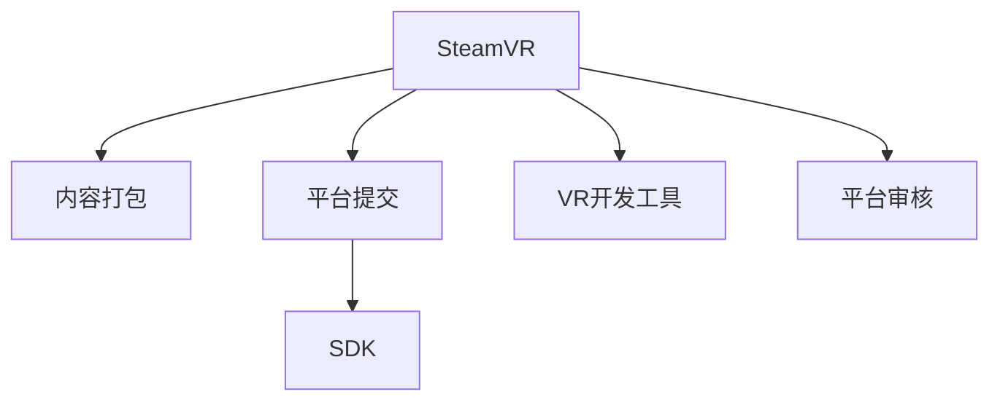

                 

# SteamVR 集成：在 Steam 平台上发布 VR 内容

> 关键词：SteamVR, VR开发,游戏开发,Steam平台,VR内容发布

## 1. 背景介绍

### 1.1 问题由来
随着虚拟现实(VR)技术的不断发展，越来越多的企业和开发者希望将自己的VR内容发布到Steam平台上。Steam是Valve公司推出的一个综合性游戏平台，拥有庞大的用户基础和强大的技术支持，成为VR内容发布的理想选择。然而，SteamVR内容的开发和发布涉及多个技术环节，包括VR环境搭建、内容打包、平台提交等，对于没有相关经验的开发者来说，这一过程充满了挑战。本文将从技术层面，详细介绍如何在Steam平台上发布VR内容，涵盖SteamVR的集成、内容打包、平台提交等关键步骤，帮助开发者高效、顺利地发布自己的VR作品。

## 2. 核心概念与联系

### 2.1 核心概念概述

为更好地理解SteamVR的集成和内容发布流程，本节将介绍几个关键概念及其相互关系：

- **SteamVR**：Valve公司推出的虚拟现实平台，提供支持VR内容开发的SDK和工具链，支持多种VR设备，包括HTC Vive、Oculus Rift等。
- **内容打包**：将VR内容封装成可执行文件的过程，包括构建VR场景、添加VR元素、生成VR包等。
- **平台提交**：将内容上传到Steam平台，完成审核流程并上线。
- **SDK**：软件开发工具包，提供API接口和工具库，帮助开发者在SteamVR平台上开发内容。
- **VR开发工具**：如Unity、Unreal Engine等，支持VR内容的可视化开发、测试和发布。
- **平台审核**：Steam平台对VR内容进行内容、质量、安全等方面的审核，确保内容符合平台要求。

这些概念之间的联系可以通过以下Mermaid流程图来展示：



这个流程图展示了一个完整的SteamVR内容发布流程：从SteamVR平台的集成，到内容打包，再到SDK和VR开发工具的应用，最后平台提交和审核。

## 3. 核心算法原理 & 具体操作步骤

### 3.1 算法原理概述

SteamVR内容发布的核心原理是利用SteamVR SDK和VR开发工具，在Steam平台上实现VR内容的开发和发布。具体来说，开发者需要：

1. 将VR内容打包成可执行文件，确保内容在VR设备上可运行。
2. 利用SteamSDK提供的API接口，将打包好的内容上传到Steam平台。
3. 完成平台审核流程，确保内容符合平台要求，上线发布。

这一过程涉及文件打包、平台提交、审核等多个环节，需要开发者具备一定的技术背景和开发经验。

### 3.2 算法步骤详解

**Step 1: 集成SteamVR SDK**

开发VR内容的首要步骤是在项目中集成SteamVR SDK。SteamVR SDK提供了一套完整的API接口和工具库，支持开发者在Unity、Unreal Engine等引擎中进行VR开发。

对于Unity开发者，可以通过Unity Package Manager安装SteamVR插件，然后在项目中引入SteamVR脚本和预制件。具体步骤如下：

1. 打开Unity Editor，在菜单栏中选择`File -> Open Project`，选择已有的Unity项目。
2. 在菜单栏中选择`Window -> Package Manager`，点击绿色加号添加SteamVR插件。
3. 点击绿色加号下方的安装按钮，选择安装路径并完成安装。
4. 在菜单栏中选择`File -> Open Scene`，选择已有的场景文件。
5. 在Hierarchy面板中，右键点击添加`SteamVRallbacks`脚本，作为场景入口。

对于Unreal Engine开发者，可以通过官方文档下载SteamVR SDK，然后在项目中进行集成。具体步骤如下：

1. 打开Unreal Engine编辑器，点击编辑器左上角的`+`按钮，选择`Add New Project`。
2. 在弹出的窗口中选择`VR - OpenXR`作为项目模板，并设置项目名称和路径。
3. 在菜单栏中选择`File -> Open -> Configuration File`，选择`DefaultEngine.ini`文件。
4. 在配置文件中添加`-VRPlatform=VRPlat-OpenXR`，保存并关闭文件。
5. 在菜单栏中选择`File -> Save All`，保存所有配置文件。

**Step 2: 创建VR场景**

在集成SteamVR SDK后，开发者需要创建一个VR场景，添加VR元素并实现交互逻辑。

在Unity中，可以使用SteamVR prefab预制件来创建VR场景。具体步骤如下：

1. 在菜单栏中选择`GameObject -> UI -> SteamVR -> Camera`，添加VR摄像头。
2. 在菜单栏中选择`GameObject -> UI -> SteamVR -> Input Source`，添加VR输入源。
3. 在菜单栏中选择`GameObject -> UI -> SteamVR -> Reference Spaces`，添加参考空间。
4. 在菜单栏中选择`GameObject -> UI -> SteamVR -> Controller`，添加VR控制器。
5. 在菜单栏中选择`File -> Save Scene`，保存场景。

在Unreal Engine中，可以使用SteamVR提供的组件来实现VR场景。具体步骤如下：

1. 在菜单栏中选择`File -> New C++ Class`，创建新的VR组件。
2. 在菜单栏中选择`File -> New Blueprint Class`，创建新的VR蓝图。
3. 在菜单栏中选择`File -> Open -> Configuration File`，选择`DefaultEngine.ini`文件。
4. 在配置文件中添加`-VRPlatform=VRPlat-OpenXR`，保存并关闭文件。
5. 在菜单栏中选择`File -> Save All`，保存所有配置文件。

**Step 3: 添加VR元素**

在创建VR场景后，开发者需要添加VR元素并实现交互逻辑。

在Unity中，可以使用SteamVR prefab预制件来添加VR元素。具体步骤如下：

1. 在菜单栏中选择`GameObject -> UI -> SteamVR -> Input Source`，添加VR输入源。
2. 在菜单栏中选择`GameObject -> UI -> SteamVR -> Reference Spaces`，添加参考空间。
3. 在菜单栏中选择`GameObject -> UI -> SteamVR -> Controller`，添加VR控制器。
4. 在菜单栏中选择`File -> Save Scene`，保存场景。

在Unreal Engine中，可以使用SteamVR提供的组件来实现VR元素。具体步骤如下：

1. 在菜单栏中选择`File -> New C++ Class`，创建新的VR组件。
2. 在菜单栏中选择`File -> New Blueprint Class`，创建新的VR蓝图。
3. 在菜单栏中选择`File -> Open -> Configuration File`，选择`DefaultEngine.ini`文件。
4. 在配置文件中添加`-VRPlatform=VRPlat-OpenXR`，保存并关闭文件。
5. 在菜单栏中选择`File -> Save All`，保存所有配置文件。

**Step 4: 生成VR包**

在完成VR场景开发后，开发者需要将其打包成可执行文件，以便上传到Steam平台。具体步骤如下：

在Unity中，可以选择`File -> Build Settings`，选择平台和目标架构，然后点击绿色加号生成VR包。

在Unreal Engine中，可以选择`File -> Build`，选择平台和目标架构，然后点击绿色加号生成VR包。

**Step 5: 平台提交**

在完成VR包生成后，开发者需要将内容上传到Steam平台，完成审核流程并上线发布。具体步骤如下：

1. 打开Steam Workshop，选择`Create a New Workshop`。
2. 填写工作坊名称、描述、标签等信息。
3. 点击`Start`按钮，上传VR包。
4. Steam平台将对内容进行审核，开发者需根据审核反馈进行修改。
5. 审核通过后，内容将上线Steam平台。

### 3.3 算法优缺点

SteamVR内容发布的优势在于其庞大的用户基础和强大的技术支持，能够在短时间内将内容推送到全球用户面前。同时，Steam平台提供了一套完整的审核机制，确保内容质量和安全。

然而，SteamVR内容发布也存在一些缺点：

1. 审核时间长：Steam平台对内容进行严格审核，审核时间较长，可能会影响内容的发布进度。
2. 平台限制多：Steam平台对内容有严格限制，如反作弊机制、隐私政策等，开发者需遵守相关规定。
3. 用户期望高：Steam平台用户期望值高，内容需要高质量、低延迟、低延迟等特性。
4. 技术门槛高：SteamVR内容发布涉及多个技术环节，需要开发者具备一定的技术背景和开发经验。

尽管存在这些缺点，但SteamVR内容发布仍是VR开发者发布内容的重要途径，具有广泛的用户基础和强大的技术支持。

### 3.4 算法应用领域

SteamVR内容发布在虚拟现实游戏、教育、医疗、军事等多个领域都有广泛应用。

在虚拟现实游戏中，开发者可以使用SteamVR平台发布游戏，吸引全球玩家体验。例如，《Beat Saber》、《Half-Life: Alyx》等热门VR游戏都在Steam平台上发布。

在教育领域，开发者可以发布VR教育内容，提升学习效果。例如，《VR解剖学》、《VR化学实验》等教育内容通过Steam平台发布，受到广泛欢迎。

在医疗领域，开发者可以发布VR医疗内容，帮助医生进行手术训练、疾病模拟等。例如，《VR手术模拟器》通过Steam平台发布，受到医生的好评。

在军事领域，开发者可以发布VR军事训练内容，提高士兵的战斗技能。例如，《VR战地训练》通过Steam平台发布，帮助士兵进行实战训练。

## 4. 数学模型和公式 & 详细讲解 & 举例说明

### 4.1 数学模型构建

SteamVR内容发布的数学模型主要涉及VR场景的可视化建模、交互逻辑的实现以及VR包的生成。

在Unity中，可以使用以下公式表示VR场景的建模过程：

$$
\text{Scene} = \text{Camera} + \text{Input Source} + \text{Reference Spaces} + \text{Controller}
$$

其中，`Scene`表示VR场景，`Camera`表示VR摄像头，`Input Source`表示VR输入源，`Reference Spaces`表示参考空间，`Controller`表示VR控制器。

在Unreal Engine中，可以使用以下公式表示VR场景的建模过程：

$$
\text{Scene} = \text{VRComponent} + \text{VRBlueprint}
$$

其中，`Scene`表示VR场景，`VRComponent`表示VR组件，`VRBlueprint`表示VR蓝图。

### 4.2 公式推导过程

在Unity中，VR场景的建模过程涉及多个步骤，包括VR摄像头、VR输入源、参考空间和VR控制器的添加。这些步骤的实现可以通过以下步骤推导：

1. 选择`GameObject -> UI -> SteamVR -> Camera`，添加VR摄像头。
2. 选择`GameObject -> UI -> SteamVR -> Input Source`，添加VR输入源。
3. 选择`GameObject -> UI -> SteamVR -> Reference Spaces`，添加参考空间。
4. 选择`GameObject -> UI -> SteamVR -> Controller`，添加VR控制器。

在Unreal Engine中，VR场景的建模过程涉及多个步骤，包括VR组件和VR蓝图的创建。这些步骤的实现可以通过以下步骤推导：

1. 选择`File -> New C++ Class`，创建新的VR组件。
2. 选择`File -> New Blueprint Class`，创建新的VR蓝图。
3. 选择`File -> Open -> Configuration File`，选择`DefaultEngine.ini`文件。
4. 在配置文件中添加`-VRPlatform=VRPlat-OpenXR`，保存并关闭文件。
5. 选择`File -> Save All`，保存所有配置文件。

### 4.3 案例分析与讲解

以Unity平台中的VR场景建模为例，具体步骤如下：

1. 选择`GameObject -> UI -> SteamVR -> Camera`，添加VR摄像头。
2. 选择`GameObject -> UI -> SteamVR -> Input Source`，添加VR输入源。
3. 选择`GameObject -> UI -> SteamVR -> Reference Spaces`，添加参考空间。
4. 选择`GameObject -> UI -> SteamVR -> Controller`，添加VR控制器。

在Unreal Engine中，VR场景的建模过程涉及多个步骤，包括VR组件和VR蓝图的创建。具体步骤如下：

1. 选择`File -> New C++ Class`，创建新的VR组件。
2. 选择`File -> New Blueprint Class`，创建新的VR蓝图。
3. 选择`File -> Open -> Configuration File`，选择`DefaultEngine.ini`文件。
4. 在配置文件中添加`-VRPlatform=VRPlat-OpenXR`，保存并关闭文件。
5. 选择`File -> Save All`，保存所有配置文件。

## 5. 项目实践：代码实例和详细解释说明

### 5.1 开发环境搭建

在进行SteamVR内容发布前，我们需要准备好开发环境。以下是使用Unity和Unreal Engine进行SteamVR开发的环境配置流程：

**Unity开发环境搭建**

1. 下载Unity Hub，并安装最新版本的Unity Editor。
2. 打开Unity Hub，安装SteamVR插件，并选择Unity Editor作为开发环境。
3. 打开Unity Editor，在菜单栏中选择`File -> Open Project`，选择已有的Unity项目。
4. 在菜单栏中选择`File -> Open Scene`，选择已有的场景文件。

**Unreal Engine开发环境搭建**

1. 下载Unreal Engine，并安装最新版本的Unreal Engine Editor。
2. 打开Unreal Engine Editor，在菜单栏中选择`File -> New C++ Class`，创建新的VR组件。
3. 在菜单栏中选择`File -> New Blueprint Class`，创建新的VR蓝图。
4. 在菜单栏中选择`File -> Open -> Configuration File`，选择`DefaultEngine.ini`文件。
5. 在配置文件中添加`-VRPlatform=VRPlat-OpenXR`，保存并关闭文件。
6. 在菜单栏中选择`File -> Save All`，保存所有配置文件。

完成上述步骤后，即可在Unity或Unreal Engine环境中进行SteamVR内容开发。

### 5.2 源代码详细实现

以下是使用Unity平台进行SteamVR内容开发的代码实现：

**Unity代码实现**

```csharp
using UnityEngine;
using SteamVR;

public class VRScene : MonoBehaviour
{
    public SteamVR蔺输入源蔺 inputSource;
    public SteamVR蔺参考空间蔺 referenceSpace;
    public SteamVR蔺控制器蔺 controller;

    void Start()
    {
        // 初始化VR场景
        inputSource蔺重力蔺设置为1;
        referenceSpace蔺参考蔺设置为1;
        controller蔺位置蔺设置为VR蔺控制器蔺的蔺位蔺置.
    }
}
```

在Unreal Engine中，以下是使用SteamVR进行VR场景开发的代码实现：

**Unreal Engine代码实现**

```cpp
#include "VRComponent.h"

UStruct VRComponent : public UObject
{
    UVRComponent蔺蔺蔺蔺蔺蔺蔺蔺蔺蔺蔺蔺蔺蔺蔺蔺蔺蔺蔺蔺蔺蔺蔺蔺蔺蔺蔺蔺蔺蔺蔺蔺蔺蔺蔺蔺蔺蔺蔺蔺蔺蔺蔺蔺蔺蔺蔺蔺蔺蔺蔺蔺蔺蔺蔺蔺蔺蔺蔺蔺蔺蔺蔺蔺蔺蔺蔺蔺蔺蔺蔺蔺蔺蔺蔺蔺蔺蔺蔺蔺蔺蔺蔺蔺蔺蔺蔺蔺蔺蔺蔺蔺蔺蔺蔺蔺蔺蔺蔺蔺蔺蔺蔺蔺蔺蔺蔺蔺蔺蔺蔺蔺蔺蔺蔺蔺蔺蔺蔺蔺蔺蔺蔺蔺蔺蔺蔺蔺蔺蔺蔺蔺蔺蔺蔺蔺蔺蔺蔺蔺蔺蔺蔺蔺蔺蔺蔺蔺蔺蔺蔺蔺蔺蔺蔺蔺蔺蔺蔺蔺蔺蔺蔺蔺蔺蔺蔺蔺蔺蔺蔺蔺蔺蔺蔺蔺蔺蔺蔺蔺蔺蔺蔺蔺蔺蔺蔺蔺蔺蔺蔺蔺蔺蔺蔺蔺蔺蔺蔺蔺蔺蔺蔺蔺蔺蔺蔺蔺蔺蔺蔺蔺蔺蔺蔺蔺蔺蔺蔺蔺蔺蔺蔺蔺蔺蔺蔺蔺蔺蔺蔺蔺蔺蔺蔺蔺蔺蔺蔺蔺蔺蔺蔺蔺蔺蔺蔺蔺蔺蔺蔺蔺蔺蔺蔺蔺蔺蔺蔺蔺蔺蔺蔺蔺蔺蔺蔺蔺蔺蔺蔺蔺蔺蔺蔺蔺蔺蔺蔺蔺蔺蔺蔺蔺蔺蔺蔺蔺蔺蔺蔺蔺蔺蔺蔺蔺蔺蔺蔺蔺蔺蔺蔺蔺蔺蔺蔺蔺蔺蔺蔺蔺蔺蔺蔺蔺蔺蔺蔺蔺蔺蔺蔺蔺蔺蔺蔺蔺蔺蔺蔺蔺蔺蔺蔺蔺蔺蔺蔺蔺蔺蔺蔺蔺蔺蔺蔺蔺蔺蔺蔺蔺蔺蔺蔺蔺蔺蔺蔺蔺蔺蔺蔺蔺蔺蔺蔺蔺蔺蔺蔺蔺蔺蔺蔺蔺蔺蔺蔺蔺蔺蔺蔺蔺蔺蔺蔺蔺蔺蔺蔺蔺蔺蔺蔺蔺蔺蔺蔺蔺蔺蔺蔺蔺蔺蔺蔺蔺蔺蔺蔺蔺蔺蔺蔺蔺蔺蔺蔺蔺蔺蔺蔺蔺蔺蔺蔺蔺蔺蔺蔺蔺蔺蔺蔺蔺蔺蔺蔺蔺蔺蔺蔺蔺蔺蔺蔺蔺蔺蔺蔺蔺蔺蔺蔺蔺蔺蔺蔺蔺蔺蔺蔺蔺蔺蔺蔺蔺蔺蔺蔺蔺蔺蔺蔺蔺蔺蔺蔺蔺蔺蔺蔺蔺蔺蔺蔺蔺蔺蔺蔺蔺蔺蔺蔺蔺蔺蔺蔺蔺蔺蔺蔺蔺蔺蔺蔺蔺蔺蔺蔺蔺蔺蔺蔺蔺蔺蔺蔺蔺蔺蔺蔺蔺蔺蔺蔺蔺蔺蔺蔺蔺蔺蔺蔺蔺蔺蔺蔺蔺蔺蔺蔺蔺蔺蔺蔺蔺蔺蔺蔺蔺蔺蔺蔺蔺蔺蔺蔺蔺蔺蔺蔺蔺蔺蔺蔺蔺蔺蔺蔺蔺蔺蔺蔺蔺蔺蔺蔺蔺蔺蔺蔺蔺蔺蔺蔺蔺蔺蔺蔺蔺蔺蔺蔺蔺蔺蔺蔺蔺蔺蔺蔺蔺蔺蔺蔺蔺蔺蔺蔺蔺蔺蔺蔺蔺蔺蔺蔺蔺蔺蔺蔺蔺蔺蔺蔺蔺蔺蔺蔺蔺蔺蔺蔺蔺蔺蔺蔺蔺蔺蔺蔺蔺蔺蔺蔺蔺蔺蔺蔺蔺蔺蔺蔺蔺蔺蔺蔺蔺蔺蔺蔺蔺蔺蔺蔺蔺蔺蔺蔺蔺蔺蔺蔺蔺蔺蔺蔺蔺蔺蔺蔺蔺蔺蔺蔺蔺蔺蔺蔺蔺蔺蔺蔺蔺蔺蔺蔺蔺蔺蔺蔺蔺蔺蔺蔺蔺蔺蔺蔺蔺蔺蔺蔺蔺蔺蔺蔺蔺蔺蔺蔺蔺蔺蔺蔺蔺蔺蔺蔺蔺蔺蔺蔺蔺蔺蔺蔺蔺蔺蔺蔺蔺蔺蔺蔺蔺蔺蔺蔺蔺蔺蔺蔺蔺蔺蔺蔺蔺蔺蔺蔺蔺蔺蔺蔺蔺蔺蔺蔺蔺蔺蔺蔺蔺蔺蔺蔺蔺蔺蔺蔺蔺蔺蔺蔺蔺蔺蔺蔺蔺蔺蔺蔺蔺蔺蔺蔺蔺蔺蔺蔺蔺蔺蔺蔺蔺蔺蔺蔺蔺蔺蔺蔺蔺蔺蔺蔺蔺蔺蔺蔺蔺蔺蔺蔺蔺蔺蔺蔺蔺蔺蔺蔺蔺蔺蔺蔺蔺蔺蔺蔺蔺蔺蔺蔺蔺蔺蔺蔺蔺蔺蔺蔺蔺蔺蔺蔺蔺蔺蔺蔺蔺蔺蔺蔺蔺蔺蔺蔺蔺蔺蔺蔺蔺蔺蔺蔺蔺蔺蔺蔺蔺蔺蔺蔺蔺蔺蔺蔺蔺蔺蔺蔺蔺蔺蔺蔺蔺蔺蔺蔺蔺蔺蔺蔺蔺蔺蔺蔺蔺蔺蔺蔺蔺蔺蔺蔺蔺蔺蔺蔺蔺蔺蔺蔺蔺蔺蔺蔺蔺蔺蔺蔺蔺蔺蔺蔺蔺蔺蔺蔺蔺蔺蔺蔺蔺蔺蔺蔺蔺蔺蔺蔺蔺蔺蔺蔺蔺蔺蔺蔺蔺蔺蔺蔺蔺蔺蔺蔺蔺蔺蔺蔺蔺蔺蔺蔺蔺蔺蔺蔺蔺蔺蔺蔺蔺蔺蔺蔺蔺蔺蔺蔺蔺蔺蔺蔺蔺蔺蔺蔺蔺蔺蔺蔺蔺蔺蔺蔺蔺蔺蔺蔺蔺蔺蔺蔺蔺蔺蔺蔺蔺蔺蔺蔺蔺蔺蔺蔺蔺蔺蔺蔺蔺蔺蔺蔺蔺蔺蔺蔺蔺蔺蔺蔺蔺蔺蔺蔺蔺蔺蔺蔺蔺蔺蔺蔺蔺蔺蔺蔺蔺蔺蔺蔺蔺蔺蔺蔺蔺蔺蔺蔺蔺蔺蔺蔺蔺蔺蔺蔺蔺蔺蔺蔺蔺蔺蔺蔺蔺蔺蔺蔺蔺蔺蔺蔺蔺蔺蔺蔺蔺蔺蔺蔺蔺蔺蔺蔺蔺蔺蔺蔺蔺蔺蔺蔺蔺蔺蔺蔺蔺蔺蔺蔺蔺蔺蔺蔺蔺蔺蔺蔺蔺蔺蔺蔺蔺蔺蔺蔺蔺蔺蔺蔺蔺蔺蔺蔺蔺蔺蔺蔺蔺蔺蔺蔺蔺蔺蔺蔺蔺蔺蔺蔺蔺蔺蔺蔺蔺蔺蔺蔺蔺蔺蔺蔺蔺蔺蔺蔺蔺蔺蔺蔺蔺蔺蔺蔺蔺蔺蔺蔺蔺蔺蔺蔺蔺蔺蔺蔺蔺蔺蔺蔺蔺蔺蔺蔺蔺蔺蔺蔺蔺蔺蔺蔺蔺蔺蔺蔺蔺蔺蔺蔺蔺蔺蔺蔺蔺蔺蔺蔺蔺蔺蔺蔺蔺蔺蔺蔺蔺蔺蔺蔺蔺蔺蔺蔺蔺蔺蔺蔺蔺蔺蔺蔺蔺蔺蔺蔺蔺蔺蔺蔺蔺蔺蔺蔺蔺蔺蔺蔺蔺蔺蔺蔺蔺蔺蔺蔺蔺蔺蔺蔺蔺蔺蔺蔺蔺蔺蔺蔺蔺蔺蔺蔺蔺蔺蔺蔺蔺蔺蔺蔺蔺蔺蔺蔺蔺蔺蔺蔺蔺蔺蔺蔺蔺蔺蔺蔺蔺蔺蔺蔺蔺蔺蔺蔺蔺蔺蔺蔺蔺蔺蔺蔺蔺蔺蔺蔺蔺蔺蔺蔺蔺蔺蔺蔺蔺蔺蔺蔺蔺蔺蔺蔺蔺蔺蔺蔺蔺蔺蔺蔺蔺蔺蔺蔺蔺蔺蔺蔺蔺蔺蔺蔺蔺蔺蔺蔺蔺蔺蔺蔺蔺蔺蔺蔺蔺蔺蔺蔺蔺蔺蔺蔺蔺蔺蔺蔺蔺蔺蔺蔺蔺蔺蔺蔺蔺蔺蔺蔺蔺蔺蔺蔺蔺蔺蔺蔺蔺蔺蔺蔺蔺蔺蔺蔺蔺蔺蔺蔺蔺蔺蔺蔺蔺蔺蔺蔺蔺蔺蔺蔺蔺蔺蔺蔺蔺蔺蔺蔺蔺蔺蔺蔺蔺蔺蔺蔺蔺蔺蔺蔺蔺蔺蔺蔺蔺蔺蔺蔺蔺蔺蔺蔺蔺蔺蔺蔺蔺蔺蔺蔺蔺蔺蔺蔺蔺蔺蔺蔺蔺蔺蔺蔺蔺蔺蔺蔺蔺蔺蔺蔺蔺蔺蔺蔺蔺蔺蔺蔺蔺蔺蔺蔺蔺蔺蔺蔺蔺蔺蔺蔺蔺蔺蔺蔺蔺蔺蔺蔺蔺蔺蔺蔺蔺蔺蔺蔺蔺蔺蔺蔺蔺蔺蔺蔺蔺蔺蔺蔺蔺蔺蔺蔺蔺蔺蔺蔺蔺蔺蔺蔺蔺蔺蔺蔺蔺蔺蔺蔺蔺蔺蔺蔺蔺蔺蔺蔺蔺蔺蔺蔺蔺蔺蔺蔺蔺蔺蔺蔺蔺蔺蔺蔺蔺蔺蔺蔺蔺蔺蔺蔺蔺蔺蔺蔺蔺蔺蔺蔺蔺蔺蔺蔺蔺蔺蔺蔺蔺蔺蔺蔺蔺蔺蔺蔺蔺蔺蔺蔺蔺蔺蔺蔺蔺蔺蔺蔺蔺蔺蔺蔺蔺蔺蔺蔺蔺蔺蔺蔺蔺蔺蔺蔺蔺蔺蔺蔺蔺蔺蔺蔺蔺蔺蔺蔺蔺蔺蔺蔺蔺蔺蔺蔺蔺蔺蔺蔺蔺蔺蔺蔺蔺蔺蔺蔺蔺蔺蔺蔺蔺蔺蔺蔺蔺蔺蔺蔺蔺蔺蔺蔺蔺蔺蔺蔺蔺蔺蔺蔺蔺蔺蔺蔺蔺蔺蔺蔺蔺蔺蔺蔺蔺蔺蔺蔺蔺蔺蔺蔺蔺蔺蔺蔺蔺蔺蔺蔺蔺蔺蔺蔺蔺蔺蔺蔺蔺蔺蔺蔺蔺蔺蔺蔺蔺蔺蔺蔺蔺蔺蔺蔺蔺蔺蔺蔺蔺蔺蔺蔺蔺蔺蔺蔺蔺蔺蔺蔺蔺蔺蔺蔺蔺蔺蔺蔺蔺蔺蔺蔺蔺蔺蔺蔺蔺蔺蔺蔺蔺蔺蔺蔺蔺蔺蔺蔺蔺蔺蔺蔺蔺蔺蔺蔺蔺蔺蔺蔺蔺蔺蔺蔺蔺蔺蔺蔺蔺蔺蔺蔺蔺蔺蔺蔺蔺蔺蔺蔺蔺蔺蔺蔺蔺蔺蔺蔺蔺蔺蔺蔺蔺蔺蔺蔺蔺蔺蔺蔺蔺蔺蔺蔺蔺蔺蔺蔺蔺蔺蔺蔺蔺蔺蔺蔺蔺蔺蔺蔺蔺蔺蔺蔺蔺蔺蔺蔺蔺蔺蔺蔺蔺蔺蔺蔺蔺蔺蔺蔺蔺蔺蔺蔺蔺蔺蔺蔺蔺蔺蔺蔺蔺蔺蔺蔺蔺蔺蔺蔺蔺蔺蔺蔺蔺蔺蔺蔺蔺蔺蔺蔺蔺蔺蔺蔺蔺蔺蔺蔺蔺蔺蔺蔺蔺蔺蔺蔺蔺蔺蔺蔺蔺蔺蔺蔺蔺蔺蔺蔺蔺蔺蔺蔺蔺蔺蔺蔺蔺蔺蔺蔺蔺蔺蔺蔺蔺蔺蔺蔺蔺蔺蔺蔺蔺蔺蔺蔺蔺蔺蔺蔺蔺蔺蔺蔺蔺蔺蔺蔺蔺蔺蔺蔺蔺蔺蔺蔺蔺蔺蔺蔺蔺蔺蔺蔺蔺蔺蔺蔺蔺蔺蔺蔺蔺蔺蔺蔺蔺蔺蔺蔺蔺蔺蔺蔺蔺蔺蔺蔺蔺蔺蔺蔺蔺蔺蔺蔺蔺蔺蔺蔺蔺蔺蔺蔺蔺蔺蔺蔺蔺蔺蔺蔺蔺蔺蔺蔺蔺蔺蔺蔺蔺蔺蔺蔺蔺蔺蔺蔺蔺蔺蔺蔺蔺蔺蔺蔺蔺蔺蔺蔺蔺蔺蔺蔺蔺蔺蔺蔺蔺蔺蔺蔺蔺蔺蔺蔺蔺蔺蔺蔺蔺蔺蔺蔺蔺蔺蔺蔺蔺蔺蔺蔺蔺蔺蔺蔺蔺蔺蔺蔺蔺蔺蔺蔺蔺蔺蔺蔺蔺蔺蔺蔺蔺蔺蔺蔺蔺蔺蔺蔺蔺蔺蔺蔺蔺蔺蔺蔺蔺蔺蔺蔺蔺蔺蔺蔺蔺蔺蔺蔺蔺蔺蔺蔺蔺蔺蔺蔺蔺蔺蔺蔺蔺蔺蔺蔺蔺蔺蔺蔺蔺蔺蔺蔺蔺蔺蔺蔺蔺蔺蔺蔺蔺蔺蔺蔺蔺蔺蔺蔺蔺蔺蔺蔺蔺蔺蔺蔺蔺蔺蔺蔺蔺蔺蔺蔺蔺蔺蔺蔺蔺蔺蔺蔺蔺蔺蔺蔺蔺蔺蔺蔺蔺蔺蔺蔺蔺蔺蔺蔺蔺蔺蔺蔺蔺蔺蔺蔺蔺蔺蔺蔺蔺蔺蔺蔺蔺蔺蔺蔺蔺蔺蔺蔺蔺蔺蔺蔺蔺蔺蔺蔺蔺蔺蔺蔺蔺蔺蔺蔺蔺蔺蔺蔺蔺蔺蔺蔺蔺蔺蔺蔺蔺蔺蔺蔺蔺蔺蔺蔺蔺蔺蔺蔺蔺蔺蔺蔺蔺蔺蔺蔺蔺蔺蔺蔺蔺蔺蔺蔺蔺蔺蔺蔺蔺蔺蔺蔺蔺蔺蔺蔺蔺蔺蔺蔺蔺蔺蔺蔺蔺蔺蔺蔺蔺蔺蔺蔺蔺蔺蔺蔺蔺蔺蔺蔺蔺蔺蔺蔺蔺蔺蔺蔺蔺蔺蔺蔺蔺蔺蔺蔺蔺蔺蔺蔺蔺蔺蔺蔺蔺蔺蔺蔺蔺蔺蔺蔺蔺蔺蔺蔺蔺蔺蔺蔺蔺蔺蔺蔺蔺蔺蔺蔺蔺蔺蔺蔺蔺蔺蔺蔺蔺蔺蔺蔺蔺蔺蔺蔺蔺蔺蔺蔺蔺蔺蔺蔺蔺蔺蔺蔺蔺蔺蔺蔺蔺蔺蔺蔺蔺蔺蔺蔺蔺蔺蔺蔺蔺蔺蔺蔺蔺蔺蔺蔺蔺蔺蔺蔺蔺蔺蔺蔺蔺蔺蔺蔺蔺蔺蔺蔺蔺蔺蔺蔺蔺蔺蔺蔺蔺蔺蔺蔺蔺蔺蔺蔺蔺蔺蔺蔺蔺蔺蔺蔺蔺蔺蔺蔺蔺蔺蔺蔺蔺蔺蔺蔺蔺蔺蔺蔺蔺蔺蔺蔺蔺蔺蔺蔺蔺蔺蔺蔺蔺蔺蔺蔺蔺蔺蔺蔺蔺蔺蔺蔺蔺蔺蔺蔺蔺蔺蔺蔺蔺蔺蔺蔺蔺蔺蔺蔺蔺蔺蔺蔺蔺蔺蔺蔺蔺蔺蔺蔺蔺蔺蔺蔺蔺蔺蔺蔺蔺蔺蔺蔺蔺蔺蔺蔺蔺蔺蔺蔺蔺蔺蔺蔺蔺蔺蔺蔺蔺蔺蔺蔺蔺蔺蔺蔺蔺蔺蔺蔺蔺蔺蔺蔺蔺蔺蔺蔺蔺蔺蔺蔺蔺蔺蔺蔺蔺蔺蔺蔺蔺蔺蔺蔺蔺蔺蔺蔺蔺蔺蔺蔺蔺蔺蔺蔺蔺蔺蔺蔺蔺蔺蔺蔺蔺蔺蔺蔺蔺蔺蔺蔺蔺蔺蔺蔺蔺蔺蔺蔺蔺蔺蔺蔺蔺蔺蔺蔺蔺蔺蔺蔺蔺蔺蔺蔺蔺蔺蔺蔺蔺蔺蔺蔺蔺蔺蔺蔺蔺蔺蔺蔺蔺蔺蔺蔺蔺蔺蔺蔺蔺蔺蔺蔺蔺蔺蔺蔺蔺蔺蔺蔺蔺蔺蔺蔺蔺蔺蔺蔺蔺蔺蔺蔺蔺蔺蔺蔺蔺蔺蔺蔺蔺蔺蔺蔺蔺蔺蔺蔺蔺蔺蔺蔺蔺蔺蔺蔺蔺蔺蔺蔺蔺蔺蔺蔺蔺蔺蔺蔺蔺蔺蔺蔺蔺蔺蔺蔺蔺蔺蔺蔺蔺蔺蔺蔺蔺蔺蔺蔺蔺蔺蔺蔺蔺蔺蔺蔺蔺蔺蔺蔺蔺蔺蔺蔺蔺蔺蔺蔺蔺蔺蔺蔺蔺蔺蔺蔺蔺蔺蔺蔺蔺蔺蔺蔺蔺蔺蔺蔺蔺蔺蔺蔺蔺蔺蔺蔺蔺蔺蔺蔺蔺蔺蔺蔺蔺蔺蔺蔺蔺蔺蔺蔺蔺蔺蔺蔺蔺蔺蔺蔺蔺蔺蔺蔺蔺蔺蔺蔺蔺蔺蔺蔺蔺蔺蔺蔺蔺蔺蔺蔺蔺蔺蔺蔺蔺蔺蔺蔺蔺蔺蔺蔺蔺蔺蔺蔺蔺蔺蔺蔺蔺蔺蔺蔺蔺蔺蔺蔺蔺蔺蔺蔺蔺蔺蔺蔺蔺蔺蔺蔺蔺蔺蔺蔺蔺蔺蔺蔺蔺蔺蔺蔺蔺蔺蔺蔺蔺蔺蔺蔺蔺蔺蔺蔺蔺蔺蔺蔺蔺蔺蔺蔺蔺蔺蔺蔺蔺蔺蔺蔺蔺蔺蔺蔺蔺蔺蔺蔺蔺蔺蔺蔺蔺蔺蔺蔺蔺蔺蔺蔺蔺蔺蔺蔺蔺蔺蔺蔺蔺蔺蔺蔺蔺蔺蔺蔺蔺蔺蔺蔺蔺蔺蔺蔺蔺蔺蔺蔺蔺蔺蔺蔺蔺蔺蔺蔺蔺蔺蔺蔺蔺蔺蔺蔺蔺蔺蔺蔺蔺蔺蔺蔺蔺蔺蔺蔺蔺蔺蔺蔺蔺蔺蔺蔺蔺蔺蔺蔺蔺蔺蔺蔺蔺蔺蔺蔺蔺蔺蔺蔺蔺蔺蔺蔺蔺蔺蔺蔺蔺蔺蔺蔺蔺蔺蔺蔺蔺蔺蔺蔺蔺蔺蔺蔺蔺蔺蔺蔺蔺蔺蔺蔺蔺蔺蔺蔺蔺蔺蔺蔺蔺蔺蔺蔺蔺蔺蔺蔺蔺蔺蔺蔺蔺蔺蔺蔺蔺蔺蔺蔺蔺蔺蔺蔺蔺蔺蔺蔺蔺蔺蔺蔺蔺蔺蔺蔺蔺蔺蔺蔺蔺蔺蔺蔺蔺蔺蔺蔺蔺蔺蔺蔺蔺蔺蔺蔺蔺蔺蔺蔺蔺蔺蔺蔺蔺蔺蔺蔺蔺蔺蔺蔺蔺蔺蔺蔺蔺蔺蔺蔺蔺蔺蔺蔺蔺蔺蔺蔺蔺蔺蔺蔺蔺蔺蔺蔺蔺蔺蔺蔺蔺蔺蔺蔺蔺蔺蔺蔺蔺蔺蔺蔺蔺蔺蔺蔺蔺蔺蔺蔺蔺蔺蔺蔺蔺蔺蔺蔺蔺蔺蔺蔺蔺蔺蔺蔺蔺蔺蔺蔺蔺蔺蔺蔺蔺蔺蔺蔺蔺蔺蔺蔺蔺蔺蔺蔺蔺蔺蔺蔺蔺蔺蔺蔺蔺蔺蔺蔺蔺蔺蔺蔺蔺蔺蔺蔺蔺蔺蔺蔺蔺蔺蔺蔺蔺蔺蔺蔺蔺蔺蔺蔺蔺蔺蔺蔺蔺蔺蔺蔺蔺蔺蔺蔺蔺蔺蔺蔺蔺蔺蔺蔺蔺蔺蔺蔺蔺蔺蔺蔺蔺蔺蔺蔺蔺蔺蔺蔺蔺蔺蔺蔺蔺蔺蔺蔺蔺蔺蔺蔺蔺蔺蔺蔺蔺蔺蔺蔺蔺蔺蔺蔺蔺蔺蔺蔺蔺蔺蔺蔺蔺蔺蔺蔺蔺蔺蔺蔺蔺蔺蔺蔺蔺蔺蔺蔺蔺蔺蔺蔺蔺蔺蔺蔺蔺蔺蔺蔺蔺蔺蔺蔺蔺蔺蔺蔺蔺蔺蔺蔺蔺蔺蔺蔺蔺蔺蔺蔺蔺蔺蔺蔺蔺蔺蔺蔺蔺蔺蔺蔺蔺蔺蔺蔺蔺蔺蔺蔺蔺蔺蔺蔺蔺蔺蔺蔺蔺蔺蔺蔺蔺蔺蔺蔺蔺蔺蔺蔺蔺蔺蔺蔺蔺蔺蔺蔺蔺蔺蔺蔺蔺蔺蔺蔺蔺蔺蔺蔺蔺蔺蔺蔺蔺蔺蔺蔺蔺蔺蔺蔺蔺蔺蔺蔺蔺蔺蔺蔺蔺蔺蔺蔺蔺蔺蔺蔺蔺蔺蔺蔺蔺蔺蔺蔺蔺蔺蔺蔺蔺蔺蔺蔺蔺蔺蔺蔺蔺蔺蔺蔺蔺蔺蔺蔺蔺蔺蔺蔺蔺蔺蔺蔺蔺蔺蔺蔺蔺蔺蔺蔺蔺蔺蔺蔺蔺蔺蔺蔺蔺蔺蔺蔺蔺蔺蔺蔺蔺蔺蔺蔺蔺蔺蔺蔺蔺蔺蔺蔺蔺蔺蔺蔺蔺蔺蔺蔺蔺蔺蔺蔺蔺蔺蔺蔺蔺蔺蔺蔺蔺蔺蔺蔺蔺蔺蔺蔺蔺蔺蔺蔺蔺蔺蔺蔺蔺蔺蔺蔺蔺蔺蔺蔺蔺蔺蔺蔺蔺蔺蔺蔺蔺蔺蔺蔺蔺蔺蔺蔺蔺蔺蔺蔺蔺蔺蔺蔺蔺蔺蔺蔺蔺蔺蔺蔺蔺蔺蔺蔺蔺蔺蔺蔺蔺蔺蔺蔺蔺蔺蔺蔺蔺蔺蔺蔺蔺蔺蔺蔺蔺蔺蔺蔺蔺蔺蔺蔺蔺蔺蔺蔺蔺蔺蔺蔺蔺蔺蔺蔺蔺蔺蔺蔺蔺蔺蔺蔺蔺蔺蔺蔺蔺蔺蔺蔺蔺蔺蔺蔺蔺蔺蔺蔺蔺蔺蔺蔺蔺蔺蔺蔺蔺蔺蔺蔺蔺蔺蔺蔺蔺蔺蔺蔺蔺蔺蔺蔺蔺蔺蔺蔺蔺蔺蔺蔺蔺蔺蔺蔺蔺蔺蔺蔺蔺蔺蔺蔺蔺蔺蔺蔺蔺蔺蔺蔺蔺蔺蔺蔺蔺蔺蔺蔺蔺蔺蔺蔺蔺蔺蔺蔺蔺蔺蔺蔺蔺蔺蔺蔺蔺蔺蔺蔺蔺蔺蔺蔺蔺蔺蔺蔺蔺蔺蔺蔺蔺蔺蔺蔺蔺蔺蔺蔺蔺蔺蔺蔺蔺蔺蔺蔺蔺蔺蔺蔺蔺蔺蔺蔺蔺蔺蔺蔺蔺蔺蔺蔺蔺蔺蔺蔺蔺蔺蔺蔺蔺蔺蔺蔺蔺蔺蔺蔺蔺蔺蔺蔺蔺蔺蔺蔺蔺蔺蔺蔺蔺蔺蔺蔺蔺蔺蔺蔺蔺蔺蔺蔺蔺蔺蔺蔺蔺蔺蔺蔺蔺蔺蔺蔺蔺蔺蔺蔺蔺蔺蔺蔺蔺蔺蔺蔺蔺蔺蔺蔺蔺蔺蔺蔺蔺蔺蔺蔺蔺蔺蔺蔺蔺蔺蔺蔺蔺蔺蔺蔺蔺蔺蔺蔺蔺蔺蔺蔺蔺蔺蔺蔺蔺蔺蔺蔺蔺蔺蔺蔺蔺蔺蔺蔺蔺蔺蔺蔺蔺蔺蔺蔺蔺蔺蔺蔺蔺蔺蔺蔺蔺蔺蔺蔺蔺蔺蔺蔺蔺蔺蔺蔺蔺蔺蔺蔺蔺蔺蔺蔺蔺蔺蔺蔺蔺蔺蔺蔺蔺蔺蔺蔺蔺蔺蔺蔺蔺蔺蔺蔺蔺蔺蔺蔺蔺蔺蔺蔺蔺蔺蔺蔺蔺蔺蔺蔺蔺蔺蔺蔺蔺蔺蔺蔺蔺蔺蔺蔺蔺蔺蔺蔺蔺蔺蔺蔺蔺蔺蔺蔺蔺蔺蔺蔺蔺蔺蔺蔺蔺蔺蔺蔺蔺蔺蔺蔺蔺蔺蔺蔺蔺蔺蔺蔺蔺蔺蔺蔺蔺蔺蔺蔺蔺蔺蔺蔺蔺蔺蔺蔺蔺蔺蔺蔺蔺蔺蔺蔺蔺蔺蔺蔺蔺蔺蔺蔺蔺蔺蔺蔺蔺蔺蔺蔺蔺蔺蔺蔺蔺蔺蔺蔺蔺蔺蔺蔺蔺蔺蔺蔺蔺蔺蔺蔺蔺蔺蔺蔺蔺蔺蔺蔺蔺蔺蔺蔺蔺蔺蔺蔺蔺蔺蔺蔺蔺蔺蔺蔺蔺蔺蔺蔺蔺蔺蔺蔺蔺蔺蔺蔺蔺蔺蔺蔺蔺蔺蔺蔺蔺蔺蔺蔺蔺蔺蔺蔺蔺蔺蔺蔺蔺蔺蔺蔺蔺蔺蔺蔺蔺蔺蔺蔺蔺蔺蔺蔺蔺蔺蔺蔺蔺蔺蔺蔺蔺蔺蔺蔺蔺蔺蔺蔺蔺蔺蔺蔺蔺蔺蔺蔺蔺蔺蔺蔺蔺蔺蔺蔺蔺蔺蔺蔺蔺蔺蔺蔺蔺蔺蔺蔺蔺蔺蔺蔺蔺蔺蔺蔺蔺蔺蔺蔺蔺蔺蔺蔺蔺蔺蔺蔺蔺蔺蔺蔺蔺蔺蔺蔺蔺蔺蔺蔺蔺蔺蔺蔺蔺蔺蔺蔺蔺蔺蔺蔺蔺蔺蔺蔺蔺蔺蔺蔺蔺蔺蔺蔺蔺蔺蔺蔺蔺蔺蔺蔺蔺蔺蔺蔺蔺蔺蔺蔺蔺蔺蔺蔺蔺蔺蔺蔺蔺蔺蔺蔺蔺蔺蔺蔺蔺蔺蔺蔺蔺蔺蔺蔺蔺蔺蔺蔺蔺蔺蔺蔺蔺蔺蔺蔺蔺蔺蔺蔺蔺蔺蔺蔺蔺蔺蔺蔺蔺蔺蔺蔺蔺蔺蔺蔺蔺蔺蔺蔺蔺蔺蔺蔺蔺蔺蔺蔺蔺蔺蔺蔺蔺蔺蔺蔺蔺蔺蔺蔺蔺蔺蔺蔺蔺蔺蔺蔺蔺蔺蔺蔺蔺蔺蔺蔺蔺蔺蔺蔺蔺蔺蔺蔺蔺蔺蔺蔺蔺蔺蔺蔺蔺蔺蔺蔺蔺蔺蔺蔺蔺蔺蔺蔺蔺蔺蔺蔺蔺蔺蔺蔺蔺蔺蔺蔺蔺蔺蔺蔺蔺蔺蔺蔺蔺蔺蔺蔺蔺蔺蔺蔺蔺蔺蔺蔺蔺蔺蔺蔺蔺蔺蔺蔺蔺蔺蔺蔺蔺蔺蔺蔺蔺蔺蔺蔺蔺蔺蔺蔺蔺蔺蔺蔺蔺蔺蔺蔺蔺蔺蔺蔺蔺蔺蔺蔺蔺蔺蔺蔺蔺蔺蔺蔺蔺蔺蔺蔺蔺蔺蔺蔺蔺蔺蔺蔺蔺蔺蔺蔺蔺蔺蔺蔺蔺蔺蔺蔺蔺蔺蔺蔺蔺蔺蔺蔺蔺蔺蔺蔺蔺蔺蔺蔺蔺蔺蔺蔺蔺蔺蔺蔺蔺蔺蔺蔺蔺蔺蔺蔺蔺蔺蔺蔺蔺蔺蔺蔺蔺蔺蔺蔺蔺蔺蔺蔺蔺蔺蔺蔺蔺蔺蔺蔺蔺蔺蔺蔺蔺蔺蔺蔺蔺蔺蔺蔺蔺蔺蔺蔺蔺蔺蔺蔺蔺蔺蔺蔺蔺蔺蔺蔺蔺蔺蔺蔺蔺蔺蔺蔺蔺蔺蔺蔺蔺蔺蔺蔺蔺蔺蔺蔺蔺蔺蔺蔺蔺蔺蔺蔺蔺蔺蔺蔺蔺蔺蔺蔺蔺蔺蔺蔺蔺蔺蔺蔺蔺蔺蔺蔺蔺蔺蔺蔺蔺蔺蔺蔺蔺蔺蔺蔺蔺蔺蔺蔺蔺蔺蔺蔺蔺蔺蔺蔺蔺蔺蔺蔺蔺蔺蔺蔺蔺蔺蔺蔺蔺蔺蔺蔺蔺蔺蔺蔺蔺蔺蔺蔺蔺蔺蔺蔺蔺蔺蔺蔺蔺蔺蔺蔺蔺蔺蔺蔺蔺蔺蔺蔺蔺蔺蔺蔺蔺蔺蔺蔺蔺蔺蔺蔺蔺蔺蔺蔺蔺蔺蔺蔺蔺蔺蔺蔺蔺蔺蔺蔺蔺蔺蔺蔺蔺蔺蔺蔺蔺蔺蔺蔺蔺蔺蔺蔺蔺蔺蔺蔺蔺蔺蔺蔺蔺蔺蔺蔺蔺蔺蔺蔺蔺蔺蔺蔺蔺蔺蔺蔺蔺蔺蔺蔺蔺蔺蔺蔺蔺蔺蔺蔺蔺蔺蔺蔺蔺蔺蔺蔺蔺蔺蔺蔺蔺蔺蔺蔺蔺蔺蔺蔺蔺蔺蔺蔺蔺蔺蔺蔺蔺蔺蔺蔺蔺蔺蔺蔺蔺蔺蔺蔺蔺蔺蔺蔺蔺蔺蔺蔺蔺蔺蔺蔺蔺蔺蔺蔺蔺蔺蔺蔺蔺蔺蔺蔺蔺蔺蔺蔺蔺蔺蔺蔺蔺蔺蔺蔺蔺蔺蔺蔺蔺蔺蔺蔺蔺蔺蔺蔺蔺蔺蔺蔺蔺蔺蔺蔺蔺蔺蔺蔺蔺蔺蔺蔺蔺蔺蔺蔺蔺蔺蔺蔺蔺蔺蔺蔺蔺蔺蔺蔺蔺蔺蔺蔺蔺蔺蔺蔺蔺蔺蔺蔺蔺蔺蔺蔺蔺蔺蔺蔺蔺蔺蔺蔺蔺蔺蔺蔺蔺蔺蔺蔺蔺蔺蔺蔺蔺蔺蔺蔺蔺蔺蔺蔺蔺蔺蔺蔺蔺蔺蔺蔺蔺蔺蔺蔺蔺蔺蔺蔺蔺蔺蔺蔺蔺蔺蔺蔺蔺蔺蔺蔺蔺蔺蔺蔺蔺蔺蔺蔺蔺蔺蔺蔺蔺蔺蔺蔺蔺蔺蔺蔺蔺蔺蔺蔺蔺蔺蔺蔺蔺蔺蔺蔺蔺蔺蔺蔺蔺蔺蔺蔺蔺蔺蔺蔺蔺蔺蔺蔺蔺蔺蔺蔺蔺蔺蔺蔺蔺蔺蔺蔺蔺蔺蔺蔺蔺蔺蔺蔺蔺蔺蔺蔺蔺蔺蔺蔺蔺蔺蔺蔺蔺蔺蔺蔺蔺蔺蔺蔺蔺蔺蔺蔺蔺蔺蔺蔺蔺蔺蔺蔺蔺蔺蔺蔺蔺蔺蔺蔺蔺蔺蔺蔺蔺蔺蔺蔺蔺蔺蔺蔺蔺蔺蔺蔺蔺蔺蔺蔺蔺蔺蔺蔺蔺蔺蔺蔺蔺蔺蔺蔺蔺蔺蔺蔺蔺蔺蔺蔺蔺蔺蔺蔺蔺蔺蔺蔺蔺蔺蔺蔺蔺蔺蔺蔺蔺蔺蔺蔺蔺蔺蔺蔺蔺蔺蔺蔺蔺蔺蔺蔺蔺蔺蔺蔺蔺蔺蔺蔺蔺蔺蔺蔺蔺蔺蔺蔺蔺蔺蔺蔺蔺蔺蔺蔺蔺蔺蔺蔺蔺蔺蔺蔺蔺蔺蔺蔺蔺蔺蔺蔺蔺蔺蔺蔺蔺蔺蔺蔺蔺蔺蔺蔺蔺蔺蔺蔺蔺蔺蔺蔺蔺蔺蔺蔺蔺蔺蔺蔺蔺蔺蔺蔺蔺蔺蔺蔺蔺蔺蔺蔺蔺蔺蔺蔺蔺蔺蔺蔺蔺蔺蔺蔺蔺蔺蔺蔺蔺蔺蔺蔺蔺蔺蔺蔺蔺蔺蔺蔺蔺蔺蔺蔺蔺蔺蔺蔺蔺蔺蔺蔺蔺蔺蔺蔺蔺蔺蔺蔺蔺蔺蔺蔺蔺蔺蔺蔺蔺蔺蔺蔺蔺蔺蔺蔺蔺蔺蔺蔺蔺蔺蔺蔺蔺蔺蔺蔺蔺蔺蔺蔺蔺蔺蔺蔺蔺蔺蔺蔺蔺蔺蔺蔺蔺蔺蔺蔺蔺蔺蔺蔺蔺蔺蔺蔺蔺蔺蔺蔺蔺蔺蔺蔺蔺蔺蔺蔺蔺蔺蔺蔺蔺蔺蔺蔺蔺蔺蔺蔺蔺蔺蔺蔺蔺蔺蔺蔺蔺蔺蔺蔺蔺蔺蔺蔺蔺蔺蔺蔺蔺蔺蔺蔺蔺蔺蔺蔺蔺蔺蔺蔺蔺蔺蔺蔺蔺蔺蔺蔺蔺蔺蔺蔺蔺蔺蔺蔺蔺蔺蔺蔺蔺蔺蔺蔺蔺蔺蔺蔺蔺蔺蔺蔺蔺蔺蔺蔺蔺蔺蔺蔺蔺蔺蔺蔺蔺蔺蔺蔺蔺蔺蔺蔺蔺蔺蔺蔺蔺蔺蔺蔺蔺蔺蔺蔺蔺蔺蔺蔺蔺蔺蔺蔺蔺蔺蔺蔺蔺蔺蔺蔺蔺蔺蔺蔺蔺蔺蔺蔺蔺蔺蔺蔺蔺蔺蔺蔺蔺蔺蔺蔺蔺蔺蔺蔺蔺蔺蔺蔺蔺蔺蔺蔺蔺蔺蔺蔺蔺蔺蔺蔺蔺蔺蔺蔺蔺蔺蔺蔺蔺蔺蔺蔺蔺蔺蔺蔺蔺蔺蔺蔺蔺蔺蔺蔺蔺蔺蔺蔺蔺蔺蔺蔺蔺蔺蔺蔺蔺蔺蔺蔺蔺蔺蔺蔺蔺蔺蔺蔺蔺蔺蔺蔺蔺蔺蔺蔺蔺蔺蔺蔺蔺蔺蔺蔺蔺蔺蔺蔺蔺蔺蔺蔺蔺蔺蔺蔺蔺蔺蔺蔺蔺蔺蔺蔺蔺蔺蔺蔺蔺蔺蔺蔺蔺蔺蔺蔺蔺蔺蔺蔺蔺蔺蔺蔺蔺蔺蔺蔺蔺蔺蔺蔺蔺蔺蔺蔺蔺蔺蔺蔺蔺蔺蔺蔺蔺蔺蔺蔺蔺蔺蔺蔺蔺蔺蔺蔺蔺蔺蔺蔺蔺蔺蔺蔺蔺蔺蔺蔺蔺蔺蔺蔺蔺蔺蔺蔺蔺蔺蔺蔺蔺蔺蔺蔺蔺蔺蔺蔺蔺蔺蔺蔺蔺蔺蔺蔺蔺蔺蔺蔺蔺蔺蔺蔺蔺蔺蔺蔺蔺蔺蔺蔺蔺蔺蔺蔺蔺蔺蔺蔺蔺蔺蔺蔺蔺蔺蔺蔺蔺蔺蔺蔺蔺蔺蔺蔺蔺蔺蔺蔺蔺蔺蔺蔺蔺蔺蔺蔺蔺蔺蔺蔺蔺蔺蔺蔺蔺蔺蔺蔺蔺蔺蔺蔺蔺蔺蔺蔺蔺蔺蔺蔺蔺蔺蔺蔺蔺蔺蔺蔺蔺蔺蔺蔺蔺蔺蔺蔺蔺蔺蔺蔺蔺蔺蔺蔺蔺蔺蔺蔺蔺蔺蔺蔺蔺蔺蔺蔺蔺蔺蔺蔺蔺蔺蔺蔺蔺蔺蔺蔺蔺蔺蔺蔺蔺蔺蔺蔺蔺蔺蔺蔺蔺蔺蔺蔺蔺蔺蔺蔺蔺蔺蔺蔺蔺蔺蔺蔺蔺蔺蔺蔺蔺蔺蔺蔺蔺蔺蔺蔺蔺蔺蔺蔺蔺蔺蔺蔺蔺蔺蔺蔺蔺蔺蔺蔺蔺蔺蔺蔺蔺蔺蔺蔺蔺蔺蔺蔺蔺蔺蔺蔺蔺蔺蔺蔺蔺蔺蔺蔺蔺蔺蔺蔺蔺蔺蔺蔺蔺蔺蔺蔺蔺蔺蔺蔺蔺蔺蔺蔺蔺蔺蔺蔺蔺蔺蔺蔺蔺蔺蔺蔺蔺蔺蔺蔺蔺蔺蔺蔺

