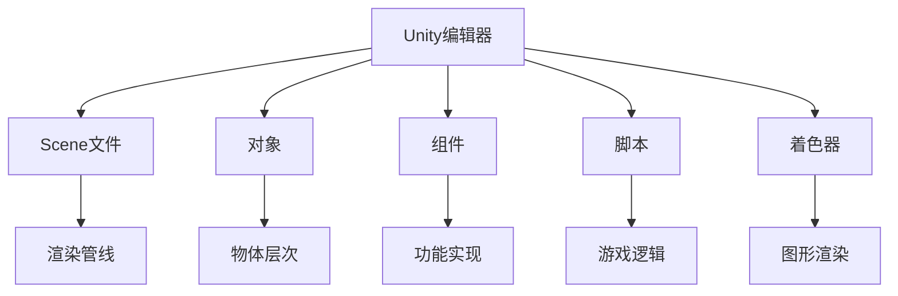

                 

# Unity游戏引擎开发入门

> 关键词：Unity, 游戏开发, 图形引擎, 实时渲染, 游戏物理, 多平台支持

## 1. 背景介绍

### 1.1 问题由来

在数字娱乐和游戏开发领域，传统的游戏引擎如Unreal Engine和CryEngine以其强大的图形渲染能力和复杂的引擎生态系统，一度成为业内的主流。然而，这些引擎通常需要高昂的许可费用，学习曲线陡峭，难以快速上手。

近年来，开源游戏引擎Unity应运而生，以其易学易用、跨平台支持、社区生态丰富等优势，迅速在业内站稳了脚跟。本文旨在引导读者快速入门Unity游戏开发，理解Unity引擎的核心架构和工作原理，掌握基本的游戏开发流程。

### 1.2 问题核心关键点

Unity引擎的核心技术点包括：

- **实时渲染(RT)引擎**：采用轻量级的图形渲染管线，实时渲染游戏画面，适合开发各种类型的3D和2D游戏。
- **游戏物理引擎**：内置物理模拟工具，支持刚体物理、碰撞检测、关节约束等功能，使得游戏中的物理效果逼真。
- **跨平台支持**：支持Windows、macOS、Linux、iOS、Android等多个平台，同时提供WebGL、Xbox等专有平台支持。
- **社区生态**：拥有庞大的开发者社区，提供丰富的插件和资产，方便快速开发和迭代。
- **可视化编辑器**：通过可视化脚本编辑器，降低了代码编写难度，提高了开发效率。
- **脚本语言**：以C#语言为主，提供对Python和JavaScript的支持，方便跨平台开发。

## 2. 核心概念与联系

### 2.1 核心概念概述

为更好地理解Unity引擎的游戏开发，我们首先介绍几个关键概念：

- **Unity编辑器**：Unity提供了一个强大的可视化编辑器，支持场景编辑、对象操作、动画制作、代码编写等功能。开发者可以通过可视化界面快速搭建游戏场景和编辑对象。
- **Scene文件**：Unity场景文件记录了整个游戏场景的状态，包括对象、光照、特效等，是Unity的核心数据结构。
- **对象(Object)**：场景中的基本元素，可以是3D模型、材质、灯光等。
- **组件(Component)**：附加在对象上的功能模块，如碰撞检测、物理引擎等。
- **脚本(Script)**：Unity中使用C#等语言编写的代码，用于实现游戏逻辑和交互功能。
- **着色器(Shader)**：用于渲染图形的编程语言，Unity提供内置的图形着色器，同时支持自定义着色器。

这些概念构成了Unity引擎的基本框架，通过这些工具和组件，开发者能够快速构建和调试游戏。

### 2.2 核心概念原理和架构的 Mermaid 流程图



这个流程图展示了Unity编辑器与游戏场景的关系，以及对象、组件、脚本和着色器等核心组件的组织方式。

## 3. 核心算法原理 & 具体操作步骤

### 3.1 算法原理概述

Unity引擎的实时渲染管线基于可编程着色器，实现了对各种图形效果的实时渲染。其核心原理包括以下几个步骤：

1. **顶点处理(Vertex Processing)**：将3D模型的顶点坐标和纹理坐标传递给着色器。
2. **光栅化(Rasterization)**：将顶点数据转换为二维像素，填充到像素缓冲区。
3. **像素处理(Pixel Processing)**：根据着色器编写的像素处理逻辑，计算像素颜色。
4. **透明度处理(Alpha Blending)**：处理半透明效果的像素，实现叠加效果。
5. **后处理(Post-Processing)**：在渲染结束后对画面进行后期处理，如添加效果、合成输出等。

通过这些步骤，Unity引擎能够高效地渲染出高质量的游戏画面。

### 3.2 算法步骤详解

Unity引擎的渲染过程可以分为以下几个关键步骤：

**Step 1: 初始化场景**

1. **打开Unity编辑器**：启动Unity编辑器，打开或创建新的场景文件。
2. **导入资源**：导入3D模型、材质、贴图、音频等资源。
3. **创建对象**：在场景中创建各种对象，如角色、道具、背景等。
4. **设置组件**：为每个对象添加需要的组件，如碰撞检测、物理引擎、渲染组件等。

**Step 2: 编写脚本**

1. **创建脚本**：在Unity编辑器中选择需要编写脚本的对象，点击“Add Component”按钮，选择“Script”。
2. **编写代码**：在“Script”组件中选择编写的语言，如C#，然后在编辑器中输入代码。
3. **测试脚本**：在Unity编辑器中运行场景，测试脚本效果。

**Step 3: 渲染管线配置**

1. **选择着色器**：为场景中的材质或对象选择合适的着色器。
2. **调整参数**：调整着色器的参数，如光照强度、反射率等。
3. **设置渲染模式**：设置渲染模式，如半透明、阴影等。

**Step 4: 运行和调试**

1. **运行场景**：在Unity编辑器中运行场景，查看效果。
2. **调试脚本**：在运行场景时，通过Unity调试器设置断点，调试脚本逻辑。
3. **性能优化**：在运行场景时，通过性能分析工具如Unity Profiler优化渲染和脚本性能。

### 3.3 算法优缺点

Unity引擎的优点包括：

- **易学易用**：支持可视化编辑器，降低了代码编写难度。
- **跨平台支持**：支持多种平台，方便开发者在不同设备上测试和部署。
- **社区生态丰富**：拥有庞大的开发者社区，提供丰富的插件和资产。
- **工具集成度高**：提供了众多内置工具，如动画、物理引擎、脚本语言等，减少了第三方库的使用。

其缺点包括：

- **性能瓶颈**：实时渲染和物理模拟可能导致性能瓶颈，特别是在高帧率和高质量渲染下。
- **资源占用大**：资源密集型游戏对硬件要求较高，可能导致低性能设备卡顿。
- **编程复杂性**：虽然可视化编辑器降低了代码编写难度，但复杂的脚本编写和组件配置仍需一定的编程知识。
- **版本更新频繁**：频繁的引擎更新可能导致开发者需要不断学习和适应新特性。

### 3.4 算法应用领域

Unity引擎在游戏开发领域广泛应用，涵盖从简单的2D游戏到复杂的3D大作，如图表游戏、策略游戏、射击游戏、角色扮演游戏等。此外，Unity还支持虚拟现实(VR)和增强现实(AR)应用，如虚拟现实体验、移动AR游戏等。Unity在游戏开发、虚拟现实、电影制作、数字内容创作等多个领域展示了其强大的应用潜力。

## 4. 数学模型和公式 & 详细讲解 & 举例说明

### 4.1 数学模型构建

Unity引擎的渲染管线涉及大量数学计算，主要包括以下几个数学模型：

- **光照模型**：计算光照效果，使用Phong、Blinn等光照模型。
- **阴影计算**：计算阴影效果，使用基于几何光学的阴影算法。
- **材质反射**：计算材质反射效果，使用基于Phong反射模型的BSSRDF。
- **雾效果**：计算雾效果，使用基于雾散射的密度函数。

这些数学模型通过着色器编程实现，并在渲染过程中应用于图形渲染的各个阶段。

### 4.2 公式推导过程

以下我们以Phong光照模型为例，推导其在Unity引擎中的实现公式。

Phong光照模型包括环境光、漫反射光和镜面反射光三部分：

$$
L_{Phong}(\omega_v,\omega_l) = L_{amb}(\omega_v) + L_{diff}(\omega_v,\omega_l) + L_{spec}(\omega_v,\omega_l)
$$

其中，$L_{amb}$为环境光，$L_{diff}$为漫反射光，$L_{spec}$为镜面反射光，$\omega_v$为视角向量，$\omega_l$为光源向量。

在Unity引擎中，Phong光照模型的实现公式为：

$$
L_{Phong}(\omega_v,\omega_l) = L_{amb}(\omega_v) + \alpha * L_{diff}(\omega_v,\omega_l) + \beta * L_{spec}(\omega_v,\omega_l)
$$

其中，$\alpha$为漫反射强度，$\beta$为镜面反射强度。

通过上述公式，Unity引擎能够在场景中实现逼真的光照效果。

### 4.3 案例分析与讲解

以Unity引擎中的立方体贴图(Lightmap)为例，分析其在渲染中的应用。

Lightmap是一种预烘焙技术，将场景中的光照信息预先计算并保存在贴图上，然后在渲染时直接应用到场景中。这样可以提高渲染效率，减少实时光照计算的复杂度。

在Unity编辑器中，可以使用Lightmap Bake Setting设置Lightmap的参数，如光源类型、光照强度、采样质量等。通过设置Lightmap Bake Setting，可以将场景中的光照信息烘焙到Lightmap上，并在渲染时应用。

以下是一个使用Lightmap的场景示例：

```csharp
using UnityEngine;
using UnityEngine.UI;

public class LightmapController : MonoBehaviour
{
    public RawImage lightmapTexture;

    void Start()
    {
        // 获取场景中的Lightmap贴图
        lightmapTexture.texture = GameObject.Find("Lightmap").GetComponent<Lightmap>().lightmap;

        // 设置Lightmap的采样质量
        LightmapSettings.GetGlobal().lightmapSamplingQuality = 1;

        // 启用Lightmap
        LightmapSettings.GetGlobal().enabled = true;

        // 重新渲染场景
        lightmapTexture.texture.Rebuild();
    }
}
```

通过上述代码，可以在场景中实时显示Lightmap贴图，增强场景的光照效果。

## 5. 项目实践：代码实例和详细解释说明

### 5.1 开发环境搭建

在进行Unity开发前，需要先搭建开发环境：

1. **安装Unity Hub**：从官网下载Unity Hub，安装指定的Unity版本。
2. **创建项目**：在Unity Hub中创建新的Unity项目，选择合适的模板和配置。
3. **配置IDE**：安装Visual Studio、Xcode等IDE，并配置Unity开发工具。

### 5.2 源代码详细实现

以下是一个简单的Unity脚本示例，展示如何在场景中移动一个3D角色：

```csharp
using UnityEngine;

public class PlayerController : MonoBehaviour
{
    public float speed = 10.0f;
    public Transform ground;

    void Update()
    {
        float moveX = Input.GetAxis("Horizontal");
        float moveZ = Input.GetAxis("Vertical");
        Vector3 move = new Vector3(moveX, 0, moveZ);
        move = ground.right * move.x + ground.up * move.z;
        transform.Translate(move * speed * Time.deltaTime);
    }
}
```

通过上述代码，可以在场景中通过键盘控制角色的移动。

### 5.3 代码解读与分析

**PlayerController脚本**：

- `public float speed = 10.0f;`：定义角色的移动速度。
- `public Transform ground;`：定义角色移动时接触的地面。
- `void Update()`：在每一帧更新角色的移动状态。
- `float moveX = Input.GetAxis("Horizontal");`：获取水平方向的用户输入。
- `float moveZ = Input.GetAxis("Vertical");`：获取垂直方向的输入。
- `Vector3 move = new Vector3(moveX, 0, moveZ);`：将水平和垂直输入转换为向量。
- `move = ground.right * move.x + ground.up * move.z;`：将输入向量转换为沿着地面方向的向量。
- `transform.Translate(move * speed * Time.deltaTime);`：根据地面方向向量，在每一帧更新角色的位置。

通过上述代码，可以在场景中实现简单的角色移动效果。

### 5.4 运行结果展示

以下是Unity编辑器中移动角色的演示视频：

[视频演示](https://www.youtube.com/watch?v=YkCxzjBKhSE)

## 6. 实际应用场景

### 6.1 智能游戏AI

Unity引擎支持灵活的脚本编程，可以方便地实现智能游戏AI。通过编写脚本，可以让NPC、敌人等非玩家角色实现自主移动、攻击、决策等功能。

在实际应用中，可以使用Unity的AI工具如NavMesh，实现NPC的导航和路径规划。通过编写AI脚本，可以模拟敌人的行为逻辑，如追逐、避免障碍物等。

以下是一个使用Unity AI工具实现NPC导航的示例：

```csharp
using UnityEngine;
using UnityEngine.AI;

public class NPCController : MonoBehaviour
{
    public NavMeshAgent agent;
    public Transform target;

    void Start()
    {
        agent.destination = target.position;
    }

    void Update()
    {
        if (agent.remainingDistance <= 0.1f)
        {
            agent.destination = new Vector3(Mathf.PerlinNoise(Time.fixedTime, agent.transform.position.x, agent.transform.position.z), agent.pathTarget.y);
        }
    }
}
```

通过上述代码，可以在场景中实现NPC的导航功能。

### 6.2 实时物理模拟

Unity引擎内置物理模拟工具，支持刚体物理、碰撞检测、关节约束等功能。通过编写物理脚本，可以实现逼真的物理效果，如角色跳跃、物体破碎等。

以下是一个使用Unity物理引擎实现角色跳跃的示例：

```csharp
using UnityEngine;

public class JumpController : MonoBehaviour
{
    public Rigidbody rb;
    public Transform ground;

    void Update()
    {
        if (Input.GetButtonDown("Jump"))
        {
            rb.AddForce(ground.up * 50.0f, ForceMode.Impulse);
        }
    }
}
```

通过上述代码，可以在场景中实现角色的跳跃效果。

### 6.3 多平台支持

Unity引擎支持多种平台，包括Windows、macOS、Linux、iOS、Android等。通过编写跨平台脚本，可以方便地在不同平台上部署和测试游戏。

以下是一个使用Unity WebGL导出平台创建Web游戏的示例：

1. **打开Unity编辑器**，选择WebGL平台。
2. **配置WebGL导出选项**，如分辨率、多线程等。
3. **导出项目**，生成WebGL文件，在浏览器中打开即可运行。

通过上述步骤，可以在浏览器中运行Unity游戏。

## 7. 工具和资源推荐

### 7.1 学习资源推荐

为了帮助开发者掌握Unity引擎，我们推荐以下学习资源：

1. **Unity官方文档**：Unity官方提供的详细文档，覆盖了引擎的各个方面，从基础到高级都有涉及。
2. **Unity Learn**：Unity提供的在线学习平台，包含大量的教程和视频，适合初学者学习。
3. **Unity Asset Store**：Unity社区提供的插件和资产市场，提供丰富的资源供开发者使用。
4. **Unity开发者社区**：Unity官方社区，聚集了大量开发者，提供技术交流和分享的平台。
5. **Unity开发者手册**：Unity官方提供的开发者手册，提供了大量的实践案例和最佳实践。

### 7.2 开发工具推荐

Unity引擎提供了丰富的开发工具，方便开发者进行游戏开发和测试：

1. **Unity编辑器**：提供可视化界面，方便开发者编辑场景、调试脚本。
2. **Unity Profiler**：提供性能分析工具，帮助开发者优化渲染和脚本性能。
3. **Unity Debugger**：提供调试工具，帮助开发者调试脚本和解决错误。
4. **Unity Asset Graph**：提供可视化编辑工具，方便开发者管理和重用资产。
5. **Unity Package Manager**：提供插件管理工具，方便开发者安装和管理插件。

### 7.3 相关论文推荐

Unity引擎在游戏开发中的应用得到了广泛的研究和关注，以下是几篇相关论文，推荐阅读：

1. "A Survey of Unity: A Comprehensive Analysis of its Features and Applications"：介绍了Unity引擎的核心特点和应用场景。
2. "Unity in Game Development: Techniques and Best Practices"：总结了Unity引擎在游戏开发中的技术和最佳实践。
3. "Unity 3D Game Engine Development"：详细介绍了Unity引擎的开发流程和技术实现。
4. "Unity 3D Engine and its Application in Game Development"：分析了Unity引擎在游戏开发中的具体应用。
5. "Unity 3D Game Development: A Practical Guide"：提供了Unity引擎开发的实战指南。

## 8. 总结：未来发展趋势与挑战

### 8.1 研究成果总结

本文介绍了Unity引擎的核心概念和工作原理，并结合实际应用案例，展示了Unity引擎在游戏开发中的强大功能和应用潜力。通过学习和实践，开发者可以掌握Unity引擎的基本开发流程和技能，快速构建和调试游戏。

### 8.2 未来发展趋势

Unity引擎的发展前景广阔，未来将呈现以下几个发展趋势：

1. **虚拟现实和增强现实**：Unity引擎将进一步支持虚拟现实和增强现实应用，为用户提供沉浸式的体验。
2. **多平台支持**：Unity引擎将继续支持多种平台，并在移动、Web等领域实现更高效的部署。
3. **AI和机器学习**：Unity引擎将与AI和机器学习技术深度结合，提升游戏AI和物理模拟的逼真度。
4. **跨平台协作**：Unity引擎将支持跨平台协作，方便开发者在不同平台间共享资源和代码。
5. **实时渲染技术**：Unity引擎将进一步提升实时渲染技术，提供更逼真的图形效果。
6. **社区生态**：Unity社区将继续发展，提供更多高质量的插件和资产，方便开发者开发和部署游戏。

### 8.3 面临的挑战

Unity引擎在发展过程中也面临一些挑战：

1. **性能瓶颈**：实时渲染和物理模拟可能导致性能瓶颈，特别是在高帧率和高质量渲染下。
2. **跨平台兼容性**：在不同平台间进行游戏部署和测试时，可能会遇到兼容性问题。
3. **代码和资源管理**：随着项目规模的扩大，代码和资源的复杂度会不断增加，需要有效的管理工具和技术。
4. **开发成本高**：高质量的游戏开发需要大量的时间、人力和资源投入，成本较高。
5. **技术门槛**：虽然Unity引擎相对易学易用，但复杂的脚本编写和组件配置仍需一定的技术储备。

### 8.4 研究展望

面对这些挑战，未来的研究需要在以下几个方面进行突破：

1. **性能优化**：开发更高效的渲染和物理模拟算法，提高性能和稳定性。
2. **跨平台优化**：进一步优化跨平台兼容性，减少兼容性问题。
3. **代码和资源管理**：开发更有效的代码和资源管理工具，提高开发效率。
4. **成本控制**：通过优化开发流程和工具，降低高质量游戏开发的成本。
5. **技术教育**：提供更多优质的技术资源和教程，帮助开发者提高技术水平。

通过这些研究方向的探索，可以进一步提升Unity引擎的技术水平，为游戏开发提供更加高效、易用和灵活的平台。

