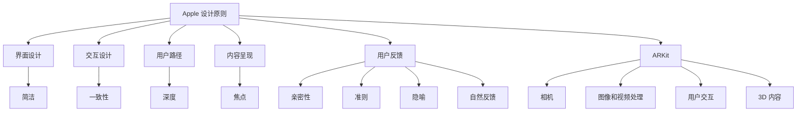

                 

# iOS 进阶：Apple 设计原则和 ARKit

> 关键词：Apple 设计原则, ARKit, iOS, 游戏开发, 增强现实, 用户交互, 用户体验

## 1. 背景介绍

### 1.1 问题由来

随着iOS设备的普及，开发者对于在移动平台上开发高质量应用程序的需求日益增长。尤其是增强现实(AR)技术的崛起，为iOS应用开发带来了新的机遇和挑战。Apple 推出了 ARKit，旨在帮助开发者轻松创建丰富、沉浸式的 AR 体验。但要想充分利用 ARKit，深入理解 Apple 的设计原则是至关重要的。Apple 的设计原则不仅指导了 iOS 和 macOS 系统的设计，还贯穿于整个 Apple 生态系统的开发实践中，涵盖了从界面布局、交互设计到用户路径的每一个细节。

### 1.2 问题核心关键点

理解并遵循 Apple 的设计原则，是确保应用在 iOS 和 AR 环境中良好表现的关键。通过遵循 Apple 的设计原则，开发者可以提升应用的用户体验，吸引并留住更多用户。同时，利用 ARKit 创造创新的 AR 应用，可以大幅拓展应用的功能和价值，满足用户的多样化需求。

## 2. 核心概念与联系

### 2.1 核心概念概述

Apple 的设计原则是指导 iOS 和 AR 应用设计的核心准则。这些原则涵盖了界面设计、交互设计、用户路径等多个方面，旨在创建直观、一致、易于使用的界面和体验。ARKit 则是一个基于 iOS 的增强现实框架，提供了丰富的工具和功能，使得开发者能够创建高度互动、沉浸式的 AR 应用。

Apple 的设计原则包括简洁、一致性、深度、焦点、亲密性、准则、隐喻和自然反馈等。ARKit 提供了相机、图像和视频处理、用户交互、3D 内容等基础功能，可以帮助开发者实现这些设计原则，打造出色的 AR 体验。

### 2.2 核心概念原理和架构的 Mermaid 流程图(Mermaid 流程节点中不要有括号、逗号等特殊字符)



这个流程图展示了 Apple 设计原则与 ARKit 框架之间的联系。可以看出，开发者需要综合运用 Apple 的设计原则，结合 ARKit 提供的基础功能，才能创造出优秀的 AR 应用。

## 3. 核心算法原理 & 具体操作步骤

### 3.1 算法原理概述

ARKit 提供了一套简单易用的 API，使得开发者能够快速构建增强现实应用。这些 API 涵盖了图像和视频处理、用户交互、3D 内容渲染等多个方面。ARKit 的算法原理主要基于计算机视觉和图形学，通过将现实世界的图像和 3D 模型相结合，创造出逼真的 AR 场景。

### 3.2 算法步骤详解

1. **环境理解**：
   - 使用 ARKit 的摄像头捕捉现实世界的图像，并通过计算机视觉算法将图像与虚拟 3D 模型进行匹配。
   - 使用图像处理算法对现实世界图像进行增强和优化，如颜色校正、图像裁剪等。

2. **用户交互**：
   - 使用手势识别和触摸事件处理，响应用户的交互行为，如点击、滑动、旋转等。
   - 使用语音识别和自然语言处理，与用户进行自然的对话和交互。

3. **3D 内容渲染**：
   - 使用 GPU 渲染 3D 模型，并将其与现实世界图像进行合成，创建逼真的 AR 场景。
   - 使用光照、阴影、透明度等效果，提升 3D 内容的真实感和沉浸感。

### 3.3 算法优缺点

#### 优点：

- **易用性**：ARKit 提供了简单易用的 API，使得开发者能够快速上手，创建高质量的 AR 应用。
- **跨平台支持**：ARKit 支持 iOS、iPadOS、macOS 等多个平台，具有广泛的兼容性。
- **丰富的功能**：ARKit 提供了相机、图像和视频处理、用户交互、3D 内容渲染等多种功能，支持开发者创建多样化、沉浸式的 AR 体验。

#### 缺点：

- **性能要求高**：创建高质量的 AR 应用需要高性能设备，可能会影响设备的电池寿命和发热。
- **算法复杂**：ARKit 的计算机视觉和图形学算法较为复杂，需要一定的技术积累和优化。
- **用户教育成本**：用户需要一定的学习成本，才能充分利用 AR 应用的功能和特性。

### 3.4 算法应用领域

ARKit 的应用领域非常广泛，包括游戏开发、医疗、教育、旅游、房地产等多个行业。开发者可以利用 ARKit 创造丰富的 AR 应用，满足不同领域的需求，提升用户体验和应用价值。

## 4. 数学模型和公式 & 详细讲解 & 举例说明

### 4.1 数学模型构建

ARKit 的核心算法包括图像处理、深度感知和图像分割等。这些算法的数学模型构建涉及图像处理、计算机视觉和机器学习等多个领域。以下是一个简单的数学模型构建示例：

1. **图像处理**：
   - 使用灰度化、二值化等算法，对输入图像进行预处理。
   - 使用滤波算法（如高斯滤波），对图像进行平滑处理。

2. **深度感知**：
   - 使用深度传感器获取深度图像，并通过计算机视觉算法进行深度计算。
   - 使用三维点云模型，对现实世界场景进行三维重建。

3. **图像分割**：
   - 使用像素聚类算法（如K-means），对图像进行像素级别的分割。
   - 使用语义分割算法（如U-Net），对图像进行语义级别的分割。

### 4.2 公式推导过程

以深度感知为例，公式推导过程如下：

- **深度计算公式**：
$$
D = \frac{1}{f} \cdot z \cdot \frac{1 - \tan(\theta)}{1 + \tan(\theta)}
$$

其中 $D$ 为深度，$f$ 为焦距，$z$ 为像素在图像平面上的距离，$\theta$ 为视场角。

- **三维重建公式**：
$$
x = z \cdot \cos(\theta) \cdot \sin(\phi)
$$
$$
y = z \cdot \sin(\theta) \cdot \sin(\phi)
$$
$$
z = z \cdot \cos(\phi)
$$

其中 $x$、$y$、$z$ 为三维坐标，$\theta$、$\phi$ 为旋转角度。

### 4.3 案例分析与讲解

以下是一个简单的深度感知案例：

1. **输入**：
   - 深度传感器捕捉现实世界的深度图像。

2. **处理**：
   - 使用高斯滤波对深度图像进行平滑处理。
   - 使用边缘检测算法（如Canny），检测深度图像的边缘。

3. **输出**：
   - 将深度图像转换为三维点云模型。

## 5. 项目实践：代码实例和详细解释说明

### 5.1 开发环境搭建

1. **安装 Xcode**：
   - 下载并安装 Xcode，选择适合您的操作系统和设备的版本。

2. **创建项目**：
   - 在 Xcode 中创建一个新的 iOS 或 macOS 项目，选择对应的模板。
   - 在项目设置中启用 ARKit 支持。

3. **添加依赖**：
   - 在项目中添加 ARKit 依赖，确保应用能够使用 ARKit 提供的功能。

### 5.2 源代码详细实现

以下是一个简单的 AR 应用代码示例：

```swift
import UIKit
import ARKit

class ViewController: UIViewController, ARSCNViewDelegate {

    let scene = ARSCNView()

    override func viewDidLoad() {
        super.viewDidLoad()

        scene.delegate = self
        view = scene

        // 设置场景大小和背景颜色
        scene.frame = view.bounds
        scene.backgroundColor = UIColor.black

        // 创建 AR 场景
        let configuration = ARWorldTrackingConfiguration()
        scene.session.run(configuration)
    }

    // ARSCNViewDelegate 方法
    func view(_ view: ARSCNView, renderMode: ARRenderMode) {
        // 绘制 3D 模型
        let node = SCNNode()
        node.position = SCNVector3(0, -0.5, 0)
        node.scale = SCNVector3(1, 1, 1)
        node.addChildNode(SCNNode())
        view.scene.rootNode.addChildNode(node)
    }

    func view(_ view: ARSCNView, didUpdate view: SCNView) {
        // 更新 3D 模型
        let matrix = view.worldViewTransform
        node.rotation = SCNVector4(matrix.columns[3])
    }

    func view(_ view: ARSCNView, didFailWithError error: Error) {
        // 处理错误
        print("ARKit session failed: \(error)")
    }
}
```

### 5.3 代码解读与分析

上述代码实现了创建一个简单的 AR 场景，包括加载 3D 模型和更新模型旋转。

1. **视图初始化**：
   - 在视图中创建一个 ARSCNView 对象，并将其设置为当前视图。

2. **场景创建**：
   - 创建一个 ARWorldTrackingConfiguration 对象，用于配置 AR 场景。
   - 调用 scene.session.run(configuration) 启动 AR 会话。

3. **绘制 3D 模型**：
   - 创建一个 SCNNode 对象，并设置其位置和比例。
   - 将节点添加到视图的场景根节点中。

4. **更新 3D 模型**：
   - 使用 view.worldViewTransform 获取视图的世界变换矩阵。
   - 根据变换矩阵更新 3D 模型的旋转角度。

### 5.4 运行结果展示

运行上述代码，您将在 iOS 或 macOS 模拟器中看到一个简单的 AR 场景，其中包含一个旋转的 3D 模型。

## 6. 实际应用场景

### 6.1 智能家居控制

利用 ARKit，开发者可以创建智能家居控制应用，通过手势和语音指令，控制家中的智能设备。用户可以通过 AR 界面直观地看到家中各个设备的位置和状态，并通过手势进行控制，如开关灯光、调节温度等。

### 6.2 教育培训

ARKit 可以用于创建互动式教育应用，通过增强现实技术，使学习内容更加生动有趣。开发者可以创建虚拟实验室、历史场景等，让学生在虚拟环境中进行互动式学习，提升学习效果。

### 6.3 旅游导览

旅游导览应用可以通过 ARKit 展示虚拟导览信息，如历史遗迹、景点介绍等。用户可以通过 AR 界面直接看到景点的全景图，并听到讲解员的语音介绍，提升旅游体验。

### 6.4 未来应用展望

随着 ARKit 的不断更新和优化，其应用领域将更加广泛。未来，ARKit 将支持更多平台和设备，提供更加丰富的功能，满足开发者和用户的多样化需求。开发者可以利用 ARKit 创建更加沉浸式、互动式的 AR 应用，提升用户体验和应用价值。

## 7. 工具和资源推荐

### 7.1 学习资源推荐

1. **Apple 开发者文档**：
   - 访问 [Apple 开发者文档](https://developer.apple.com/documentation/arkit)，了解 ARKit 的详细 API 和使用方法。

2. **《iOS 开发实战》**：
   - 这本书详细介绍了 iOS 和 AR 应用开发的实战经验，适合初学者和有经验的开发者阅读。

3. **ARKit 入门教程**：
   - 在 [Apple Developer](https://developer.apple.com/library/archive/documentation/ARKit/Conceptual/ARKit_Guide) 上，查看 ARKit 的入门教程，快速上手 AR 开发。

### 7.2 开发工具推荐

1. **Xcode**：
   - 苹果公司提供的集成开发环境，支持 iOS、macOS、watchOS 等多个平台的应用开发。

2. **Unity**：
   - 一款功能强大的游戏引擎，支持创建复杂的 AR 应用和虚拟场景。

3. **CocoaPods**：
   - 一款强大的 Swift 包管理工具，可以方便地管理项目依赖和库文件。

### 7.3 相关论文推荐

1. **《Augmented Reality: Principles and Design》**：
   - 这本书详细介绍了增强现实技术的基本原理和设计原则，适合开发者和研究人员阅读。

2. **《Apple's Human Interface Guidelines》**：
   - Apple 官方的人类界面指南，详细介绍了 iOS 和 macOS 的设计原则和最佳实践。

3. **《ARKit 3.0 - Apple's AR SDK for iOS》**：
   - 这篇文章详细介绍了 ARKit 3.0 的新特性和改进，适合开发者了解最新的 AR 开发工具。

## 8. 总结：未来发展趋势与挑战

### 8.1 总结

本文对 Apple 设计原则和 ARKit 进行了全面系统的介绍。首先阐述了 Apple 设计原则的基本概念和设计理念，明确了在 iOS 和 AR 应用开发中遵循这些原则的重要性。其次，从原理到实践，详细讲解了 ARKit 的核心功能和使用方法，给出了完整的代码实例和详细解释。同时，本文还探讨了 ARKit 在智能家居、教育培训、旅游导览等实际应用场景中的应用前景，展示了 ARKit 的强大潜力。

通过本文的系统梳理，可以看到，Apple 设计原则和 ARKit 为 iOS 和 AR 应用开发提供了坚实的理论基础和丰富的工具支持，使得开发者能够轻松创建高质量的 AR 应用，提升用户体验。未来，伴随 ARKit 的不断更新和优化，其应用领域将更加广泛，为开发者和用户带来更多的创新和价值。

### 8.2 未来发展趋势

展望未来，Apple 设计原则和 ARKit 将呈现以下几个发展趋势：

1. **更加智能化**：
   - 随着 AI 技术的发展，ARKit 将支持更多的智能交互和自然语言处理功能，提升应用的智能化水平。

2. **更加沉浸式**：
   - ARKit 将支持更多的传感器和设备，如深度传感器、手势识别器等，创建更加沉浸式的 AR 体验。

3. **更加通用化**：
   - ARKit 将支持更多的平台和设备，提供更加通用的 AR 开发工具，方便开发者创建跨平台的 AR 应用。

4. **更加自动化**：
   - ARKit 将支持更多的自动化工具和流程，如自动化测试、自动化部署等，提升开发效率和应用质量。

5. **更加安全可靠**：
   - ARKit 将支持更多的安全保障措施，如数据加密、设备认证等，确保应用的安全性和可靠性。

### 8.3 面临的挑战

尽管 Apple 设计原则和 ARKit 已经取得了显著进展，但在迈向更加智能化、普适化应用的过程中，仍面临诸多挑战：

1. **性能瓶颈**：
   - 创建高质量的 AR 应用需要高性能设备，可能会影响设备的电池寿命和发热。

2. **算法复杂**：
   - ARKit 的计算机视觉和图形学算法较为复杂，需要更多的技术积累和优化。

3. **用户体验**：
   - 用户需要一定的学习成本，才能充分利用 AR 应用的功能和特性。

4. **安全和隐私**：
   - ARKit 需要处理大量的用户数据，如何保护用户隐私和数据安全，还需要更多的研究和实践。

5. **跨平台支持**：
   - 尽管 ARKit 支持多个平台，但在不同平台上的体验和表现可能存在差异。

### 8.4 研究展望

面对 ARKit 和 Apple 设计原则面临的挑战，未来的研究需要在以下几个方面寻求新的突破：

1. **提升算法性能**：
   - 开发更加高效和鲁棒的计算机视觉和图形学算法，提升 AR 应用的性能和稳定性。

2. **优化用户体验**：
   - 通过优化用户界面和交互设计，提升用户体验，降低学习成本。

3. **强化安全保障**：
   - 引入更多的安全保障措施，如数据加密、设备认证等，确保应用的安全性和可靠性。

4. **增强跨平台支持**：
   - 优化 ARKit 在不同平台上的性能和表现，提供更加一致和无缝的 AR 体验。

5. **拓展应用场景**：
   - 探索 ARKit 在更多领域的应用场景，如医疗、教育、娱乐等，拓展 AR 应用的价值和市场。

这些研究方向将为 Apple 设计原则和 ARKit 带来更多的创新和突破，推动其在各行各业的广泛应用。面向未来，ARKit 和 Apple 设计原则将继续引领 AR 应用开发，成为构建高质量 iOS 和 AR 应用的基石。

## 9. 附录：常见问题与解答

**Q1：如何在 iOS 或 macOS 中启用 ARKit？**

A: 在 Xcode 项目中添加 ARKit 框架，并配置 ARWorldTrackingConfiguration 对象。在应用启动时，调用 scene.session.run(configuration) 启动 AR 会话。

**Q2：如何优化 AR 应用性能？**

A: 优化 AR 应用性能的关键在于减少计算量和内存占用。可以使用 GPU 加速，使用纹理压缩，减少渲染复杂度，优化数据流。同时，使用 ARKit 提供的优化工具，如 ARKitCameraPrefetching、ARScenegraphPurge、ARScenegraphSceneRefinement 等，减少资源消耗。

**Q3：如何在 AR 应用中实现手势识别？**

A: 使用 ARKit 提供的手势识别功能，通过设置手势识别器，监听用户的手势事件。在手势识别回调函数中，获取用户的手势信息，并根据手势信息进行相应的操作。

**Q4：如何在 AR 应用中实现自然语言处理？**

A: 使用 ARKit 提供的语音识别和自然语言处理功能，通过设置语音识别器，监听用户的语音输入。在语音识别回调函数中，解析用户的语音输入，并根据输入进行相应的操作。

**Q5：如何在 AR 应用中实现多用户交互？**

A: 使用 ARKit 提供的用户输入和互动功能，通过设置用户输入器，监听用户的手势、触摸、语音等输入。在用户输入回调函数中，获取用户的输入信息，并根据输入进行相应的操作。

---

作者：禅与计算机程序设计艺术 / Zen and the Art of Computer Programming

