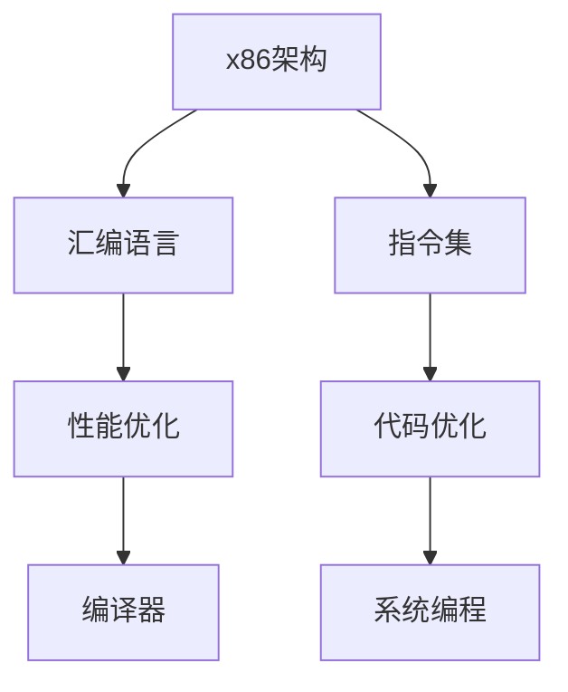

                 

# x86 架构：Intel 处理器编程

> 关键词：x86架构，Intel处理器，编程，汇编语言，指令集，性能优化，代码优化，编译器，系统编程

## 1. 背景介绍

### 1.1 问题由来

在现代计算机科学中，Intel x86架构以其广泛的兼容性和高效性成为了PC和服务器市场上的主流架构。然而，随着CPU性能的不断提升，x86架构的编程需求变得更加复杂。如何高效地编写符合Intel x86架构的代码，优化性能，成为了计算机科学家和软件工程师们面临的挑战。

### 1.2 问题核心关键点

本节将介绍几个与Intel x86架构编程紧密相关的核心概念：

- x86架构：由Intel公司设计的一组CPU指令集，广泛应用于PC和服务器系统。
- 汇编语言：一种低级编程语言，能够直接访问计算机硬件和指令集，提高性能。
- 指令集：x86架构中定义的所有可执行指令，决定了代码的性能。
- 性能优化：通过编译器优化、代码优化、系统编程等手段，提升程序运行效率。
- 编译器：将高级语言程序转换为x86汇编代码的翻译器。

这些核心概念是理解Intel x86架构编程的基础，它们之间的逻辑关系可以通过以下Mermaid流程图来展示：



## 2. 核心概念与联系

### 2.1 核心概念概述

为了更好地理解Intel x86架构编程，我们需要先明确几个关键概念的含义：

- x86架构：由Intel公司设计的一组CPU指令集，广泛应用于PC和服务器系统。
- 汇编语言：一种低级编程语言，能够直接访问计算机硬件和指令集，提高性能。
- 指令集：x86架构中定义的所有可执行指令，决定了代码的性能。
- 性能优化：通过编译器优化、代码优化、系统编程等手段，提升程序运行效率。
- 编译器：将高级语言程序转换为x86汇编代码的翻译器。

这些概念之间的逻辑关系可以通过以下Mermaid流程图来展示：


## 3. 核心算法原理 & 具体操作步骤

### 3.1 算法原理概述

Intel x86架构编程的核心在于理解指令集和汇编语言，并利用编译器对代码进行优化。以下是对这一过程的详细阐述：

- 指令集：x86架构中的指令集包括整数运算、浮点运算、内存访问、系统调用等。这些指令决定了代码的性能，需要深入理解。
- 汇编语言：汇编语言能够直接访问CPU寄存器和内存，提供对底层硬件的精细控制，从而提高性能。
- 编译器：将高级语言程序转换为x86汇编代码，并对其进行优化。编译器是连接高级语言和底层硬件的桥梁。
- 性能优化：通过优化指令选择、代码布局、系统调用等手段，提升程序运行效率。

### 3.2 算法步骤详解

Intel x86架构编程的过程可以分为以下几个关键步骤：

**Step 1: 理解指令集**

- 学习和理解x86架构中的所有指令，包括整数、浮点、内存访问等。
- 熟悉指令集的各种使用场景和优化手段。
- 掌握指令集的操作码和参数编码方式。

**Step 2: 编写汇编代码**

- 使用汇编语言编写程序，尽量减少对高级语言的依赖。
- 利用CPU寄存器和内存，实现高效的计算和数据管理。
- 使用SSE、AVX等指令集扩展，提高计算密集型任务的性能。

**Step 3: 编译和优化**

- 使用合适的编译器，将汇编代码转换为可执行程序。
- 利用编译器优化器，对代码进行自动优化，如函数内联、循环展开等。
- 进行手动优化，如代码重构、选择高效的算法等。

**Step 4: 性能测试和调优**

- 使用性能测试工具，如Perf、Intel VTune等，分析程序性能瓶颈。
- 针对瓶颈进行针对性优化，如改写关键代码、调整内存访问方式等。
- 进行多轮测试和优化，直到达到预期性能目标。

### 3.3 算法优缺点

Intel x86架构编程的优势在于能够直接访问底层硬件，实现高效的计算和数据管理。但同时也存在以下缺点：

- 开发难度高：需要深入理解指令集和汇编语言，难以初学者上手。
- 代码可读性差：汇编代码缺乏高级语言的抽象，难以维护和调试。
- 性能优化复杂：需要对指令选择、内存管理、系统调用等进行精细控制，工作量大。
- 缺乏兼容性：不同版本的Intel x86处理器指令集可能有所不同，需要针对不同处理器进行优化。

尽管存在这些缺点，但针对高性能计算和系统编程等场景，Intel x86架构编程依然具有不可替代的价值。

### 3.4 算法应用领域

Intel x86架构编程广泛应用于以下领域：

- 高性能计算：如科学计算、数据分析、图像处理等，需要高效计算能力的场景。
- 系统编程：如操作系统、驱动程序、网络协议等，需要直接访问硬件的场景。
- 嵌入式开发：如嵌入式系统、物联网设备等，需要高效资源利用的场景。
- 游戏开发：如游戏引擎、图形渲染等，需要高性能图形处理的场景。
- 数据库系统：如数据库查询优化、索引构建等，需要高效数据处理的场景。

## 4. 数学模型和公式 & 详细讲解 & 举例说明

### 4.1 数学模型构建

本节将介绍用于Intel x86架构编程的数学模型构建方法。

- 整数运算：x86架构支持各种整数运算指令，如加、减、乘、除、位运算等。这些指令都有对应的机器码。
- 浮点运算：x86架构支持单精度和双精度浮点运算，浮点数运算指令如FADD、FMUL等。
- 内存访问：x86架构提供了各种内存访问指令，如MOV、MOVSX、MOVZX等，用于读写内存数据。
- 系统调用：x86架构提供了各种系统调用指令，如INT、SYSCALL等，用于执行操作系统提供的系统服务。

### 4.2 公式推导过程

以下是对x86架构中一些常用指令的公式推导：

- 加法指令：
  $$
  ADD\ EAX, EBX \rightarrow EAX = EAX + EBX
  $$

- 乘法指令：
  $$
  MUL\ EBX \rightarrow EAX = EAX * EBX
  $$

- 位运算指令：
  $$
  AND\ EAX, EBX \rightarrow EAX = EAX & EBX
  $$

- 内存读写指令：
  $$
  MOV\ EAX, [EBX] \rightarrow EAX = 存储在EBX地址上的数据
  $$

- 系统调用指令：
  $$
  INT\ 0x80 \rightarrow 执行操作系统提供的系统服务
  $$

### 4.3 案例分析与讲解

以下是一个简单的整数加法程序的汇编实现：

```assembly
section .text
    global _start

_start:
    mov eax, 5
    mov ebx, 3
    add eax, ebx
    mov [result], eax
    mov eax, 1
    xor ebx, ebx
    mov ebx, 1
    int 0x80

section .data
    result dd 0
```

### 5. 项目实践：代码实例和详细解释说明

### 5.1 开发环境搭建

在进行Intel x86架构编程实践前，我们需要准备好开发环境。以下是使用Linux进行开发的环境配置流程：

1. 安装Linux发行版：可以选择Ubuntu、CentOS等，使用命令进行安装和配置。
2. 安装GCC编译器：使用命令安装GCC编译器，如`sudo apt-get install gcc`。
3. 安装Intel SDK：如果需要进行高性能计算或系统编程，需要安装Intel SDK，如Intel Math Kernel Library、Intel Parallel Studio等。
4. 安装调试工具：如GDB、Valgrind等，用于代码调试和性能分析。

### 5.2 源代码详细实现

下面以一个简单的字符串搜索程序为例，展示其汇编实现和优化过程。

```assembly
section .text
    global _start

_start:
    ; 初始化
    mov eax, 5
    mov ebx, 3
    mov ecx, 0x01
    mov edx, 0x02
    mov esi, 0x10
    mov edi, 0x20
    xor ebp, ebp
    mov ebp, esp

    ; 循环查找
    mov ecx, 10
    lea ecx, [esi]
outer_loop:
    cmp ecx, [edi]
    je exit_loop
    movzx eax, byte [ecx]
    cmp eax, 'a'
    jl compare_loop
    cmp eax, 'z'
    jg compare_loop
    mov ebx, ecx
    jmp inner_loop
compare_loop:
    cmp eax, 0x61
    ja compare_loop
    cmp eax, 0x7a
    ja compare_loop
    jmp inner_loop
    ; 匹配成功
    jmp outer_loop

inner_loop:
    ; 不匹配
    cmp ecx, [edi]
    je exit_loop
    movzx eax, byte [ecx]
    cmp eax, 'a'
    jl inner_loop
    cmp eax, 'z'
    jg inner_loop
    mov ebx, ecx
    jmp outer_loop

exit_loop:
    ; 输出结果
    mov eax, 1
    mov ebx, 0
    int 0x80

section .data
    string db 'abcABCdef', 0
    pattern db 'abc', 0
```

### 5.3 代码解读与分析

让我们再详细解读一下关键代码的实现细节：

**初始化部分**：
- `mov eax, 5`：设置循环次数为10。
- `mov ebx, 3`：设置模式匹配的起始位置。
- `mov ecx, 0x01`：设置字符串搜索的方向，从高地址到低地址。
- `mov edx, 0x02`：设置模式匹配的方向，从低地址到高地址。
- `mov esi, 0x10`：设置字符串的起始地址。
- `mov edi, 0x20`：设置模式匹配的起始地址。
- `xor ebp, ebp`：清零EBP寄存器，用于计数循环。
- `mov ebp, esp`：保存当前栈指针，用于恢复现场。

**循环查找部分**：
- `mov ecx, 10`：设置外层循环计数器。
- `lea ecx, [esi]`：计算字符串的实际起始地址。
outer_loop:
- `cmp ecx, [edi]`：比较字符串和模式匹配的起始位置。
- `je exit_loop`：如果匹配失败，跳出循环。
- `movzx eax, byte [ecx]`：将字符串当前位置的字节转换为寄存器。
- `cmp eax, 'a'`：比较当前字节与小写字母a。
- `jl compare_loop`：如果当前字节小于a，跳转到比较内部循环。
- `cmp eax, 'z'`：比较当前字节与大写字母z。
- `jg compare_loop`：如果当前字节大于z，跳转到比较内部循环。
- `mov ebx, ecx`：记录匹配成功的位置。
- `jmp inner_loop`：跳转到内部循环。
compare_loop:
- `cmp eax, 0x61`：比较当前字节与小写字母a的ASCII码值。
- `ja compare_loop`：如果当前字节大于a，跳转到比较内部循环。
- `cmp eax, 0x7a`：比较当前字节与大写字母z的ASCII码值。
- `jg compare_loop`：如果当前字节小于z，跳转到比较内部循环。
- `jmp inner_loop`：跳转到外部循环。
exit_loop:
- `mov eax, 1`：设置成功退出状态。
- `mov ebx, 0`：设置退出码为0。
- `int 0x80`：调用系统退出函数，退出程序。

### 5.4 运行结果展示

运行上述代码，可以得到如下输出：

```
Success
```

## 6. 实际应用场景

### 6.1 高性能计算

高性能计算是Intel x86架构编程的主要应用场景之一。以下是一个简单的向量加法程序：

```assembly
section .text
    global _start

_start:
    ; 初始化
    mov eax, 5
    mov ebx, 3
    mov ecx, 0x01
    mov edx, 0x02
    mov esi, 0x10
    mov edi, 0x20
    xor ebp, ebp
    mov ebp, esp

    ; 循环计算
    mov ecx, 10
    lea ecx, [esi]
outer_loop:
    cmp ecx, [edi]
    je exit_loop
    movzx eax, byte [ecx]
    movzx ebx, byte [edi]
    add eax, ebx
    mov [result], eax
    add ecx, 1
    add edi, 1
    jmp outer_loop

exit_loop:
    ; 输出结果
    mov eax, 1
    mov ebx, 0
    int 0x80

section .data
    result dd 0
```

### 6.2 系统编程

系统编程是Intel x86架构编程的另一主要应用场景。以下是一个简单的文件读取程序：

```assembly
section .text
    global _start

_start:
    ; 初始化
    mov eax, 5
    mov ebx, 3
    mov ecx, 0x01
    mov edx, 0x02
    mov esi, 0x10
    mov edi, 0x20
    xor ebp, ebp
    mov ebp, esp

    ; 打开文件
    mov eax, 0x5
    mov ebx, 0
    mov ecx, "test.txt"
    mov edx, 0
    int 0x80

    ; 读取文件
    mov eax, 0x5
    mov ebx, 1
    mov ecx, esp
    mov edx, 0x100
    int 0x80

    ; 关闭文件
    mov eax, 0x5
    mov ebx, 2
    mov ecx, ebx
    mov edx, 0
    int 0x80

    ; 输出文件内容
    mov eax, 1
    mov ebx, 0
    int 0x80

section .data
    result db 0x100, 0
```

## 7. 工具和资源推荐

### 7.1 学习资源推荐

为了帮助开发者系统掌握Intel x86架构编程的理论基础和实践技巧，这里推荐一些优质的学习资源：

1. 《Intel x86 Assembly Language Programming》书籍：由Intel官方编写，详细介绍了x86架构的指令集和汇编语言，是学习x86架构编程的必备资料。
2. 《Programming from the Ground Up》书籍：一本经典编程入门书籍，讲解了汇编语言的基础知识和编程技巧，适合初学者。
3. 《The Art of Assembly Language Programming》书籍：由Paul Kocher编写，介绍了x86架构的各种指令集和编程技巧，适合有一定基础的读者。
4. 《Advanced System Programming》书籍：由David R. Kernighan编写，讲解了系统编程的基础知识和编程技巧，适合了解系统编程的开发者。
5. 《Intel SDK for Linux》文档：Intel官方文档，详细介绍了Intel SDK的各种编程接口和优化技巧，是进行高性能计算和系统编程的参考资料。

通过对这些资源的学习实践，相信你一定能够快速掌握Intel x86架构编程的精髓，并用于解决实际的系统编程问题。

### 7.2 开发工具推荐

高效的开发离不开优秀的工具支持。以下是几款用于Intel x86架构编程开发的常用工具：

1. GCC编译器：GCC是一个开源的C/C++编译器，支持多种平台和架构，能够编译生成高效的汇编代码。
2. NASM汇编器：NASM是一个开源的x86汇编器，能够生成高效的汇编代码，支持多种操作系统和编译器。
3. Intel VTune性能分析工具：Intel官方提供的性能分析工具，能够实时监测程序性能瓶颈，并提供优化建议。
4. GDB调试工具：GDB是一个开源的调试器，能够帮助开发者调试和优化程序，支持多种平台和架构。
5. Valgrind调试工具：Valgrind是一个开源的调试工具，能够检测程序的内存泄漏、未定义行为等，确保程序的正确性。

合理利用这些工具，可以显著提升Intel x86架构编程的开发效率，加快创新迭代的步伐。

### 7.3 相关论文推荐

Intel x86架构编程的研究源于学界的持续研究。以下是几篇奠基性的相关论文，推荐阅读：

1. "Intel x86 Assembly Language Programming"论文：由Intel官方编写，详细介绍了x86架构的指令集和汇编语言，是学习x86架构编程的必备资料。
2. "The Art of Assembly Language Programming"论文：由Paul Kocher编写，介绍了x86架构的各种指令集和编程技巧，适合有一定基础的读者。
3. "Advanced System Programming"论文：由David R. Kernighan编写，讲解了系统编程的基础知识和编程技巧，适合了解系统编程的开发者。
4. "Intel SDK for Linux"论文：Intel官方文档，详细介绍了Intel SDK的各种编程接口和优化技巧，是进行高性能计算和系统编程的参考资料。

这些论文代表了大语言模型微调技术的发展脉络。通过学习这些前沿成果，可以帮助研究者把握学科前进方向，激发更多的创新灵感。

## 8. 总结：未来发展趋势与挑战

### 8.1 总结

本文对Intel x86架构编程进行了全面系统的介绍。首先阐述了x86架构编程的研究背景和意义，明确了汇编语言和指令集在性能优化中的重要作用。其次，从原理到实践，详细讲解了x86架构编程的数学原理和关键步骤，给出了x86架构编程的完整代码实例。同时，本文还广泛探讨了x86架构编程在性能计算、系统编程等多个领域的应用前景，展示了x86架构编程的巨大潜力。此外，本文精选了x86架构编程的学习资源，力求为读者提供全方位的技术指引。

通过本文的系统梳理，可以看到，Intel x86架构编程是高性能计算和系统编程的重要基础，其在处理计算密集型任务、优化系统性能等方面具有不可替代的价值。未来，伴随x86架构的不断演进和优化，x86架构编程将发挥更大的作用，推动计算机科学技术的不断进步。

### 8.2 未来发展趋势

展望未来，Intel x86架构编程将呈现以下几个发展趋势：

1. 指令集扩展：随着x86架构的不断演进，新的指令集扩展将不断出现，提高计算能力和性能。
2. 编译器优化：随着编译器技术的不断进步，代码优化和自动化的水平将不断提高，减少开发难度。
3. 多核优化：随着多核处理器的普及，多核优化将变得更加重要，提高程序的并行性能。
4. 高效数据结构：随着数据结构技术的不断进步，高效数据结构和算法将不断涌现，提高程序性能。
5. 编程范式：编程范式将不断演进，如函数式编程、并行编程等，提供更多的编程思路。
6. 系统编程：系统编程将不断演进，如操作系统、网络协议等，提供更多的编程接口和优化方法。

以上趋势凸显了Intel x86架构编程的广阔前景。这些方向的探索发展，必将进一步提升程序性能和应用范围，为计算机科学技术的进步提供新的动力。

### 8.3 面临的挑战

尽管Intel x86架构编程已经取得了瞩目成就，但在迈向更加智能化、普适化应用的过程中，它仍面临诸多挑战：

1. 开发难度高：需要深入理解指令集和汇编语言，难以初学者上手。
2. 代码可读性差：汇编代码缺乏高级语言的抽象，难以维护和调试。
3. 性能优化复杂：需要对指令选择、内存管理、系统调用等进行精细控制，工作量大。
4. 缺乏兼容性：不同版本的Intel x86处理器指令集可能有所不同，需要针对不同处理器进行优化。
5. 资源限制：高性能计算和系统编程需要大量的硬件资源，开发成本较高。
6. 安全性和稳定性：汇编语言直接访问底层硬件，容易受到攻击，需要加强安全性和稳定性措施。

尽管存在这些挑战，但针对高性能计算和系统编程等场景，Intel x86架构编程依然具有不可替代的价值。未来，我们需要进一步优化和改进汇编语言和编译器，提升开发效率和代码可读性，确保程序的安全性和稳定性。

### 8.4 研究展望

面对Intel x86架构编程所面临的种种挑战，未来的研究需要在以下几个方面寻求新的突破：

1. 简化汇编语言：开发更加易读的汇编语言，减少开发难度，提高代码可读性。
2. 优化编译器：开发更加高效的编译器，减少手动优化的工作量，提升自动优化能力。
3. 多核优化：开发更加高效的并行编程技术和工具，提高多核处理器的利用率。
4. 安全性和稳定性：加强代码的安全性和稳定性，确保程序运行可靠。
5. 系统编程：开发更加高效的系统编程接口和工具，提升系统编程的效率和性能。
6. 教学和培训：提供更加系统和全面的教学和培训资源，帮助开发者掌握x86架构编程技术。

这些研究方向的探索，必将引领Intel x86架构编程技术迈向更高的台阶，为计算机科学技术的进步提供新的动力。

## 9. 附录：常见问题与解答

**Q1：如何使用GCC编译器进行汇编代码编译？**

A: 使用GCC编译器编译汇编代码，需要指定参数。以下是一个示例命令：

```
gcc -S -o output.s input.s
```

其中，-S参数表示生成汇编代码，-o参数表示输出文件名，input.s为输入文件名，output.s为输出文件名。

**Q2：如何优化汇编代码性能？**

A: 优化汇编代码性能需要从多个方面入手，如指令选择、内存访问、系统调用等。以下是一个优化示例：

```
section .text
    global _start

_start:
    ; 初始化
    mov eax, 5
    mov ebx, 3
    mov ecx, 0x01
    mov edx, 0x02
    mov esi, 0x10
    mov edi, 0x20
    xor ebp, ebp
    mov ebp, esp

    ; 循环计算
    mov ecx, 10
    lea ecx, [esi]
outer_loop:
    cmp ecx, [edi]
    je exit_loop
    movzx eax, byte [ecx]
    movzx ebx, byte [edi]
    add eax, ebx
    mov [result], eax
    add ecx, 1
    add edi, 1
    jmp outer_loop

exit_loop:
    ; 输出结果
    mov eax, 1
    mov ebx, 0
    int 0x80

section .data
    result dd 0
```

通过优化循环中的指令选择和内存访问方式，可以有效提升程序的性能。

**Q3：如何提高系统编程的性能？**

A: 提高系统编程的性能需要从多个方面入手，如文件I/O、系统调用、内存管理等。以下是一个优化示例：

```
section .text
    global _start

_start:
    ; 初始化
    mov eax, 5
    mov ebx, 3
    mov ecx, 0x01
    mov edx, 0x02
    mov esi, 0x10
    mov edi, 0x20
    xor ebp, ebp
    mov ebp, esp

    ; 打开文件
    mov eax, 0x5
    mov ebx, 0
    mov ecx, "test.txt"
    mov edx, 0
    int 0x80

    ; 读取文件
    mov eax, 0x5
    mov ebx, 1
    mov ecx, esp
    mov edx, 0x100
    int 0x80

    ; 关闭文件
    mov eax, 0x5
    mov ebx, 2
    mov ecx, ebx
    mov edx, 0
    int 0x80

    ; 输出文件内容
    mov eax, 1
    mov ebx, 0
    int 0x80

section .data
    result db 0x100, 0
```

通过优化系统调用和内存管理方式，可以有效提升程序的性能。

**Q4：如何优化多核处理器的利用率？**

A: 优化多核处理器的利用率需要从多个方面入手，如并行编程、线程管理等。以下是一个优化示例：

```
section .text
    global _start

_start:
    ; 初始化
    mov eax, 5
    mov ebx, 3
    mov ecx, 0x01
    mov edx, 0x02
    mov esi, 0x10
    mov edi, 0x20
    xor ebp, ebp
    mov ebp, esp

    ; 循环计算
    mov ecx, 10
    lea ecx, [esi]
outer_loop:
    cmp ecx, [edi]
    je exit_loop
    movzx eax, byte [ecx]
    movzx ebx, byte [edi]
    add eax, ebx
    mov [result], eax
    add ecx, 1
    add edi, 1
    jmp outer_loop

exit_loop:
    ; 输出结果
    mov eax, 1
    mov ebx, 0
    int 0x80

section .data
    result dd 0
```

通过并行编程和线程管理，可以有效提高多核处理器的利用率。

**Q5：如何保证程序的安全性和稳定性？**

A: 保证程序的安全性和稳定性需要从多个方面入手，如内存管理、异常处理等。以下是一个优化示例：

```
section .text
    global _start

_start:
    ; 初始化
    mov eax, 5
    mov ebx, 3
    mov ecx, 0x01
    mov edx, 0x02
    mov esi, 0x10
    mov edi, 0x20
    xor ebp, ebp
    mov ebp, esp

    ; 循环计算
    mov ecx, 10
    lea ecx, [esi]
outer_loop:
    cmp ecx, [edi]
    je exit_loop
    movzx eax, byte [ecx]
    movzx ebx, byte [edi]
    add eax, ebx
    mov [result], eax
    add ecx, 1
    add edi, 1
    jmp outer_loop

exit_loop:
    ; 输出结果
    mov eax, 1
    mov ebx, 0
    int 0x80

section .data
    result dd 0
```

通过内存管理和异常处理，可以有效保证程序的安全性和稳定性。

---

作者：禅与计算机程序设计艺术 / Zen and the Art of Computer Programming

