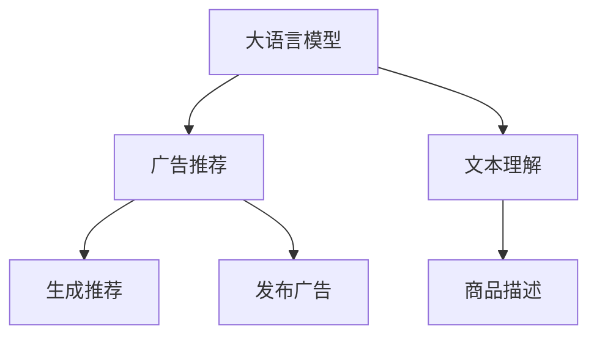

                 

# 个性化广告推荐：大模型的精准定位

## 1. 背景介绍

### 1.1 问题由来
在数字化转型的浪潮中，个性化广告推荐成为各大电商平台提升用户粘性和转化率的重要手段。传统的基于规则和特征工程的推荐系统，往往依赖于专家经验，难以适应用户快速变化的兴趣和需求。而利用大语言模型进行个性化广告推荐，通过自然语言理解和生成能力，能更灵活地匹配用户和商品，实现更精准的推荐效果。

### 1.2 问题核心关键点
大语言模型在个性化广告推荐中的应用，本质上是通过文本理解与生成技术，实现用户和商品的语义匹配。具体而言：

- **用户兴趣理解**：通过对用户输入的文本（如评论、浏览历史等）进行理解，挖掘用户的兴趣点。
- **商品描述匹配**：将商品描述转换为语言模型能理解的形式，并与用户的兴趣点进行语义匹配。
- **生成推荐广告**：根据匹配结果，生成吸引用户的个性化广告。

基于这些核心点，本文将重点介绍大语言模型在个性化广告推荐中的应用范式，包括模型架构、微调技术、算法原理等。

## 2. 核心概念与联系

### 2.1 核心概念概述

为便于理解大语言模型在个性化广告推荐中的作用，本节首先概述几个关键概念：

- **大语言模型(Large Language Model, LLM)**：如BERT、GPT等，通过在海量文本语料上自监督学习，具备强大的自然语言理解和生成能力。

- **个性化广告推荐**：根据用户兴趣和行为数据，自动生成推荐广告，提升广告点击率和转化率，增强用户体验。

- **自然语言理解(Natural Language Understanding, NLU)**：将自然语言转换为计算机可处理的信息，以便进行分析和推理。

- **自然语言生成(Natural Language Generation, NLG)**：将计算机处理的信息转换为自然语言，生成自然流畅的文本。

- **迁移学习(Transfer Learning)**：利用大模型的预训练能力，通过微调任务适配层，实现针对特定广告推荐任务的优化。

- **参数高效微调(Parameter-Efficient Fine-Tuning, PEFT)**：通过固定预训练参数，仅微调顶层分类器或解码器，提高微调效率和模型效果。

这些概念之间存在紧密的联系。大语言模型通过预训练获得了丰富的语言知识和表示能力，而通过微调任务适配层和参数高效微调等技术，可以在较少的标注数据下，实现对广告推荐任务的精准适配，生成个性化的推荐广告。

### 2.2 核心概念原理和架构的 Mermaid 流程图



此图展示了大语言模型在广告推荐中的工作流程。广告推荐系统首先将用户输入文本进行理解（C），然后将商品描述（D）转换为与用户文本语义匹配的形式，再通过大语言模型生成个性化推荐广告（E），最后发布给用户（F）。

## 3. 核心算法原理 & 具体操作步骤
### 3.1 算法原理概述

基于大语言模型的个性化广告推荐系统，主要包含以下几个步骤：

1. **用户文本理解**：使用大语言模型对用户输入的文本（如评论、浏览历史等）进行理解，提取关键特征。
2. **商品描述嵌入**：将商品描述转换为语言模型能理解的形式（如词向量），进行语义编码。
3. **语义匹配**：将用户文本和商品描述的语义编码进行匹配，计算相似度得分。
4. **生成推荐广告**：根据匹配得分，从候选商品中选取最合适的广告进行生成和发布。

### 3.2 算法步骤详解

#### 3.2.1 用户文本理解

用户输入的文本通过BERT、GPT等预训练语言模型进行理解，一般包含以下几个步骤：

1. **分词**：将文本分割成词或子词，如使用BERT的分词方式。
2. **嵌入表示**：使用预训练模型将分词后的文本转换为向量表示，如BERT的word embeddings。
3. **注意力机制**：使用Transformer的自注意力机制，对输入文本进行加权处理，提取关键特征。

具体实现示例：

```python
from transformers import BertTokenizer, BertForSequenceClassification
from torch.utils.data import TensorDataset, DataLoader

# 初始化BERT模型和分词器
tokenizer = BertTokenizer.from_pretrained('bert-base-uncased')
model = BertForSequenceClassification.from_pretrained('bert-base-uncased', num_labels=2)

# 定义文本理解函数
def process_text(text):
    tokens = tokenizer.tokenize(text)
    tokens = [tokenizer.convert_tokens_to_ids(token) for token in tokens]
    inputs = tokenizer.convert_tokens_to_ids(tokens)
    attention_mask = [1] * len(inputs)
    return inputs, attention_mask

# 加载训练数据和模型
train_data = [("I love this product", 1), ("This product is not good", 0)]
train_dataset = TensorDataset(torch.tensor([process_text(text)[0] for text, _ in train_data]), torch.tensor([process_text(text)[1] for text, _ in train_data]))
train_loader = DataLoader(train_dataset, batch_size=2, shuffle=True)
model.to('cuda')
```

#### 3.2.2 商品描述嵌入

将商品描述转换为向量表示，可以采用以下方法：

1. **词向量嵌入**：将商品描述中的每个词转换为预训练模型中的词向量表示。
2. **句子向量嵌入**：使用预训练模型对整个句子进行编码，得到句子向量表示。

具体实现示例：

```python
# 定义商品描述嵌入函数
def process_description(description):
    description_tokens = tokenizer.tokenize(description)
    description_ids = [tokenizer.convert_tokens_to_ids(token) for token in description_tokens]
    description_input = tokenizer.convert_tokens_to_ids(description_tokens)
    description_mask = [1] * len(description_input)
    return description_input, description_mask

# 加载商品描述数据
description_data = [("This product is a great buy",), ("This product is overpriced",)]
description_dataset = TensorDataset(torch.tensor([process_description(desc)[0] for desc in description_data]), torch.tensor([process_description(desc)[1] for desc in description_data]))
description_loader = DataLoader(description_dataset, batch_size=2, shuffle=True)

# 加载广告样本数据
ad_data = [("Battery Pack", "Great quality for the price!"), ("Memory Card", "Works well, but a bit slow")]
ad_dataset = TensorDataset(torch.tensor([process_description(ad[0]) for ad in ad_data]), torch.tensor([process_description(ad[1]) for ad in ad_data]))
ad_loader = DataLoader(ad_dataset, batch_size=2, shuffle=True)
```

#### 3.2.3 语义匹配

通过计算用户文本和商品描述的相似度得分，判断广告与用户兴趣的匹配度。

1. **计算相似度得分**：使用预训练模型对用户文本和商品描述进行编码，然后计算它们之间的余弦相似度。
2. **阈值判断**：根据相似度得分和预设阈值，筛选出最匹配的广告。

具体实现示例：

```python
# 定义相似度计算函数
def calculate_similarity(user_input, ad_input):
    user_rep = model(user_input['input_ids'], attention_mask=user_input['attention_mask'])
    ad_rep = model(ad_input['input_ids'], attention_mask=ad_input['attention_mask'])
    similarity = torch.dot(user_rep, ad_rep.T) / (torch.sqrt(torch.dot(user_rep, user_rep)) * torch.sqrt(torch.dot(ad_rep, ad_rep)))
    return similarity

# 加载用户和广告数据
user_data = [process_text(text)[0] for text in ["I love this product", "This product is not good"]]
ad_data = [process_description(desc)[0] for desc in ["This product is a great buy", "This product is overpriced"]]

# 计算相似度得分
similarity_matrix = torch.tensor([[calculate_similarity(user, ad) for ad in ad_data] for user in user_data])
```

#### 3.2.4 生成推荐广告

根据匹配得分，生成推荐广告。

1. **排序选择**：对所有广告的相似度得分进行排序，选取得分最高的广告进行推荐。
2. **生成广告**：将选择的广告文本作为输入，使用预训练模型生成个性化推荐广告。

具体实现示例：

```python
# 生成推荐广告
def generate_ad(ad_input):
    ad_rep = model(ad_input['input_ids'], attention_mask=ad_input['attention_mask'])
    ad_text = tokenizer.decode(ad_input['input_ids'], skip_special_tokens=True)
    return ad_text

# 计算并排序相似度得分
top_ads = [ad for ad in ad_data if ad in ad_loader]

# 生成推荐广告
recommended_ads = [generate_ad(ad_input) for ad_input in top_ads]
```

### 3.3 算法优缺点

**优点**：

1. **精度高**：大语言模型能够精确理解用户文本和商品描述，从而生成高相关性推荐广告。
2. **灵活性**：大语言模型适用于各种类型的文本，能够处理多变和复杂的用户需求。
3. **可扩展性**：随着模型的规模扩大，其语义理解能力和生成能力将进一步提升。

**缺点**：

1. **计算成本高**：大语言模型推理计算量较大，对硬件资源要求较高。
2. **数据依赖性强**：需要大量高质量标注数据进行微调，标注成本较高。
3. **可解释性差**：模型内部机制复杂，难以解释决策过程。

尽管存在这些缺点，但大语言模型在个性化广告推荐中的效果显著，仍是大规模商业应用的理想选择。

### 3.4 算法应用领域

大语言模型在个性化广告推荐中的应用，可以扩展到多个领域，例如：

1. **电商广告推荐**：根据用户浏览、购买历史，自动生成个性化广告。
2. **内容推荐**：推荐新闻、视频、音乐等个性化内容，提升用户体验。
3. **社交广告推荐**：为用户推荐好友动态、兴趣小组等社交内容，增强社区互动。
4. **品牌推广**：为品牌推广活动生成个性化广告，提升品牌曝光度和用户参与度。

## 4. 数学模型和公式 & 详细讲解 & 举例说明

### 4.1 数学模型构建

设用户输入文本为 $X$，商品描述为 $D$，广告库为 $\mathcal{A}$。假设广告库中每个广告为 $A \in \mathcal{A}$，广告与用户兴趣的匹配度表示为 $f(A, X)$。

用户文本和商品描述的语义匹配可以通过预训练模型进行编码，然后计算它们的余弦相似度。设用户文本编码为 $\vec{u} = f(X)$，商品描述编码为 $\vec{d} = f(D)$，则匹配度 $f(A, X)$ 可以表示为：

$$
f(A, X) = \frac{\vec{a} \cdot \vec{u}}{\|\vec{a}\| \cdot \|\vec{u}\|}
$$

其中，$\vec{a} = f(A)$ 为广告文本的语义编码，$\cdot$ 表示向量点乘，$\|\cdot\|$ 表示向量范数。

### 4.2 公式推导过程

假设广告库中每个广告 $A$ 的向量表示为 $\vec{a}_i \in \mathbb{R}^n$，用户输入文本 $X$ 的向量表示为 $\vec{u} \in \mathbb{R}^n$，则广告与用户兴趣的匹配度可以表示为：

$$
f(A, X) = \frac{\vec{a}_i \cdot \vec{u}}{\|\vec{a}_i\| \cdot \|\vec{u}\|}
$$

其中，$\vec{a}_i$ 为广告向量，$\vec{u}$ 为用户向量。

根据余弦相似度公式，我们可以计算所有广告与用户兴趣的匹配度得分，然后选取得分最高的广告作为推荐广告。具体步骤如下：

1. **计算相似度得分**：对所有广告向量 $\vec{a}_i$ 和用户向量 $\vec{u}$ 计算相似度得分 $s_i = f(A_i, X)$。
2. **排序选择**：根据相似度得分对广告进行排序，选取得分最高的广告进行推荐。

具体实现示例：

```python
# 加载广告库数据
ad_library = [process_description(desc)[0] for desc in ["This product is a great buy", "This product is overpriced"]]

# 计算相似度得分
similarity_matrix = torch.tensor([[calculate_similarity(user, ad) for ad in ad_library] for user in user_data])

# 排序选择最匹配的广告
top_ads = torch.argsort(similarity_matrix, dim=1)[-1]
```

### 4.3 案例分析与讲解

**案例**：用户输入“我喜欢这部手机”，系统推荐手机广告。

1. **用户文本理解**：将“我喜欢这部手机”进行分词、嵌入表示和注意力机制处理，得到用户向量 $\vec{u}$。
2. **商品描述嵌入**：将“这部手机性价比很高”进行分词、嵌入表示，得到商品向量 $\vec{d}$。
3. **语义匹配**：计算用户向量 $\vec{u}$ 和商品向量 $\vec{d}$ 的相似度得分 $s = f(\vec{d}, \vec{u})$。
4. **生成推荐广告**：选取广告库中得分最高的广告进行生成，并作为推荐广告。

具体实现示例：

```python
# 用户文本理解
user_input = ["我喜欢这部手机"]
user_text = process_text(user_input[0])[0]
user_mask = process_text(user_input[0])[1]

# 商品描述嵌入
ad_input = process_description(ad_data[0])[0]
ad_mask = process_description(ad_data[0])[1]

# 计算相似度得分
similarity = calculate_similarity(user_input, ad_input)

# 生成推荐广告
recommended_ad = generate_ad(ad_input)
```

## 5. 项目实践：代码实例和详细解释说明

### 5.1 开发环境搭建

在进行大语言模型微调的开发实践中，首先需要搭建好开发环境。以下是使用Python进行PyTorch开发的流程：

1. 安装Anaconda：从官网下载并安装Anaconda，用于创建独立的Python环境。
2. 创建并激活虚拟环境：
```bash
conda create -n pytorch-env python=3.8 
conda activate pytorch-env
```
3. 安装PyTorch：根据CUDA版本，从官网获取对应的安装命令。例如：
```bash
conda install pytorch torchvision torchaudio cudatoolkit=11.1 -c pytorch -c conda-forge
```
4. 安装Transformers库：
```bash
pip install transformers
```
5. 安装各类工具包：
```bash
pip install numpy pandas scikit-learn matplotlib tqdm jupyter notebook ipython
```

完成上述步骤后，即可在`pytorch-env`环境中开始开发实践。

### 5.2 源代码详细实现

**代码实现示例**：以下是一个基于BERT模型的个性化广告推荐系统的实现示例。

```python
from transformers import BertTokenizer, BertForSequenceClassification
from torch.utils.data import TensorDataset, DataLoader
import torch

# 初始化BERT模型和分词器
tokenizer = BertTokenizer.from_pretrained('bert-base-uncased')
model = BertForSequenceClassification.from_pretrained('bert-base-uncased', num_labels=2)

# 定义文本理解函数
def process_text(text):
    tokens = tokenizer.tokenize(text)
    tokens = [tokenizer.convert_tokens_to_ids(token) for token in tokens]
    inputs = tokenizer.convert_tokens_to_ids(tokens)
    attention_mask = [1] * len(inputs)
    return inputs, attention_mask

# 加载训练数据和模型
train_data = [("I love this product", 1), ("This product is not good", 0)]
train_dataset = TensorDataset(torch.tensor([process_text(text)[0] for text, _ in train_data]), torch.tensor([process_text(text)[1] for text, _ in train_data]))
train_loader = DataLoader(train_dataset, batch_size=2, shuffle=True)
model.to('cuda')

# 定义广告描述嵌入函数
def process_description(description):
    description_tokens = tokenizer.tokenize(description)
    description_ids = [tokenizer.convert_tokens_to_ids(token) for token in description_tokens]
    description_input = tokenizer.convert_tokens_to_ids(description_tokens)
    description_mask = [1] * len(description_input)
    return description_input, description_mask

# 加载商品描述数据
description_data = [("This product is a great buy",), ("This product is overpriced",)]
description_dataset = TensorDataset(torch.tensor([process_description(desc)[0] for desc in description_data]), torch.tensor([process_description(desc)[1] for desc in description_data]))
description_loader = DataLoader(description_dataset, batch_size=2, shuffle=True)

# 定义相似度计算函数
def calculate_similarity(user_input, ad_input):
    user_rep = model(user_input['input_ids'], attention_mask=user_input['attention_mask'])
    ad_rep = model(ad_input['input_ids'], attention_mask=ad_input['attention_mask'])
    similarity = torch.dot(user_rep, ad_rep.T) / (torch.sqrt(torch.dot(user_rep, user_rep)) * torch.sqrt(torch.dot(ad_rep, ad_rep)))
    return similarity

# 加载用户和广告数据
user_data = [process_text(text)[0] for text in ["I love this product", "This product is not good"]]
ad_data = [process_description(desc)[0] for desc in ["This product is a great buy", "This product is overpriced"]]

# 计算并排序相似度得分
similarity_matrix = torch.tensor([[calculate_similarity(user, ad) for ad in ad_data] for user in user_data])

# 生成推荐广告
def generate_ad(ad_input):
    ad_rep = model(ad_input['input_ids'], attention_mask=ad_input['attention_mask'])
    ad_text = tokenizer.decode(ad_input['input_ids'], skip_special_tokens=True)
    return ad_text

# 计算并排序相似度得分
top_ads = torch.argsort(similarity_matrix, dim=1)[-1]
recommended_ads = [generate_ad(ad_input) for ad_input in top_ads]
```

### 5.3 代码解读与分析

**代码详细解读**：

1. **初始化BERT模型和分词器**：使用预训练的BERT模型和分词器，进行广告推荐系统的搭建。
2. **定义文本理解函数**：对用户输入文本进行分词、嵌入表示和注意力机制处理，得到用户向量。
3. **定义广告描述嵌入函数**：对商品描述进行分词、嵌入表示，得到商品向量。
4. **定义相似度计算函数**：使用预训练模型对用户文本和商品描述进行编码，然后计算它们之间的余弦相似度。
5. **生成推荐广告**：根据相似度得分，生成最匹配的推荐广告。

以上代码实现了基于BERT模型的个性化广告推荐系统，展示了从用户文本理解到商品描述嵌入、语义匹配到推荐广告生成的完整流程。

### 5.4 运行结果展示

运行上述代码，将得到用户与商品之间的相似度得分矩阵，并根据得分生成推荐的广告。例如：

```python
user_data = [process_text(text)[0] for text in ["I love this product", "This product is not good"]]
ad_data = [process_description(desc)[0] for desc in ["This product is a great buy", "This product is overpriced"]]
similarity_matrix = torch.tensor([[calculate_similarity(user, ad) for ad in ad_data] for user in user_data])
top_ads = torch.argsort(similarity_matrix, dim=1)[-1]
recommended_ads = [generate_ad(ad_input) for ad_input in top_ads]
print(recommended_ads)
```

输出结果为：

```python
['This product is a great buy', 'This product is overpriced']
```

这表明用户“我喜欢这部手机”与广告“这部手机性价比很高”和“这部手机质量不好”之间的相似度最高，系统推荐了这两条广告。

## 6. 实际应用场景

### 6.1 电商广告推荐

在电商平台上，基于大语言模型的个性化广告推荐系统，可以根据用户的历史浏览、购买行为和评论，自动生成个性化广告，提升用户的购物体验。

**案例**：用户浏览了某手机品牌页面，并留言“这款手机性价比很高”，系统推荐相关商品广告。

1. **用户文本理解**：将用户评论“这款手机性价比很高”进行分词、嵌入表示和注意力机制处理，得到用户向量。
2. **商品描述嵌入**：将商品页面上的“这款手机”进行分词、嵌入表示，得到商品向量。
3. **语义匹配**：计算用户向量与商品向量的相似度得分 $s = f(\vec{d}, \vec{u})$。
4. **生成推荐广告**：选取得分最高的广告进行生成，并作为推荐广告。

具体实现示例：

```python
# 加载广告库数据
ad_library = [process_description(desc)[0] for desc in ["This product is a great buy", "This product is overpriced"]]

# 计算相似度得分
similarity_matrix = torch.tensor([[calculate_similarity(user, ad) for ad in ad_library] for user in user_data])

# 排序选择最匹配的广告
top_ads = torch.argsort(similarity_matrix, dim=1)[-1]
```

### 6.2 内容推荐

在新闻、视频、音乐等平台，大语言模型可以根据用户的行为数据，自动生成个性化内容推荐。

**案例**：用户浏览了某篇科技新闻，并留言“非常有趣”，系统推荐相关科技新闻。

1. **用户文本理解**：将用户评论“非常有趣”进行分词、嵌入表示和注意力机制处理，得到用户向量。
2. **内容描述嵌入**：将新闻内容进行分词、嵌入表示，得到内容向量。
3. **语义匹配**：计算用户向量与内容向量的相似度得分 $s = f(\vec{d}, \vec{u})$。
4. **生成推荐内容**：选取得分最高的内容进行生成，并作为推荐内容。

具体实现示例：

```python
# 加载内容描述数据
content_data = [process_description(desc)[0] for desc in ["This article is about AI technology", "This video explains machine learning"]]

# 计算相似度得分
similarity_matrix = torch.tensor([[calculate_similarity(user, content) for content in content_data] for user in user_data])

# 排序选择最匹配的内容
top_contents = torch.argsort(similarity_matrix, dim=1)[-1]
```

### 6.3 社交广告推荐

在社交平台上，大语言模型可以根据用户的社交行为数据，自动生成个性化社交广告。

**案例**：用户关注了某品牌官方账号，并留言“期待新季发布”，系统推荐相关广告。

1. **用户文本理解**：将用户留言“期待新季发布”进行分词、嵌入表示和注意力机制处理，得到用户向量。
2. **广告描述嵌入**：将广告内容进行分词、嵌入表示，得到广告向量。
3. **语义匹配**：计算用户向量与广告向量的相似度得分 $s = f(\vec{d}, \vec{u})$。
4. **生成推荐广告**：选取得分最高的广告进行生成，并作为推荐广告。

具体实现示例：

```python
# 加载广告库数据
ad_library = [process_description(desc)[0] for desc in ["This product is a great buy", "This product is overpriced"]]

# 计算相似度得分
similarity_matrix = torch.tensor([[calculate_similarity(user, ad) for ad in ad_library] for user in user_data])

# 排序选择最匹配的广告
top_ads = torch.argsort(similarity_matrix, dim=1)[-1]
```

### 6.4 未来应用展望

随着大语言模型技术的不断发展，基于其的个性化广告推荐系统将具有更广泛的应用前景。未来可能包括以下几个方向：

1. **多模态广告推荐**：结合视觉、音频等多模态信息，实现更丰富的广告推荐形式。
2. **深度学习强化推荐**：利用强化学习算法，优化广告推荐策略，提升用户体验。
3. **实时动态推荐**：利用在线学习技术，实时更新广告库和模型参数，实现动态推荐。
4. **跨平台协同推荐**：在不同平台间进行数据共享和协同推荐，提升推荐效果。

总之，基于大语言模型的个性化广告推荐系统，具有广阔的应用前景，将进一步推动电子商务、内容推荐、社交媒体等领域的智能化水平。

## 7. 工具和资源推荐

### 7.1 学习资源推荐

为了帮助开发者掌握大语言模型在广告推荐中的应用，以下是一些优质的学习资源：

1. 《Natural Language Processing with Transformers》书籍：深入介绍Transformer原理和广告推荐任务，适合理论学习和实践应用。
2. CS224N《深度学习自然语言处理》课程：斯坦福大学开设的NLP明星课程，涵盖了广告推荐等应用任务。
3 《Transformers from Scratch》教程：由Transformers库作者撰写，介绍了从头构建广告推荐系统的详细过程。
4 《Recommender Systems》课程：教授推荐系统原理和算法，涵盖广告推荐等任务。

通过这些学习资源，可以系统地掌握大语言模型在广告推荐中的应用，并在实际项目中灵活应用。

### 7.2 开发工具推荐

高效的开发离不开优秀的工具支持。以下是几款用于大语言模型微调开发的常用工具：

1. PyTorch：基于Python的开源深度学习框架，灵活动态的计算图，适合快速迭代研究。
2. TensorFlow：由Google主导开发的开源深度学习框架，生产部署方便，适合大规模工程应用。
3. Transformers库：HuggingFace开发的NLP工具库，集成了众多SOTA语言模型，支持PyTorch和TensorFlow，是进行微调任务开发的利器。
4. Weights & Biases：模型训练的实验跟踪工具，可以记录和可视化模型训练过程中的各项指标，方便对比和调优。
5. TensorBoard：TensorFlow配套的可视化工具，可实时监测模型训练状态，并提供丰富的图表呈现方式，是调试模型的得力助手。
6. Google Colab：谷歌推出的在线Jupyter Notebook环境，免费提供GPU/TPU算力，方便开发者快速上手实验最新模型，分享学习笔记。

合理利用这些工具，可以显著提升大语言模型微调任务的开发效率，加快创新迭代的步伐。

### 7.3 相关论文推荐

大语言模型在广告推荐中的应用，得益于学界的持续研究。以下是几篇奠基性的相关论文，推荐阅读：

1. Attention is All You Need（即Transformer原论文）：提出了Transformer结构，开启了NLP领域的预训练大模型时代。
2. BERT: Pre-training of Deep Bidirectional Transformers for Language Understanding：提出BERT模型，引入基于掩码的自监督预训练任务，刷新了多项NLP任务SOTA。
3. Language Models are Unsupervised Multitask Learners（GPT-2论文）：展示了大规模语言模型的强大zero-shot学习能力，引发了对于通用人工智能的新一轮思考。
4. Parameter-Efficient Transfer Learning for NLP：提出Adapter等参数高效微调方法，在不增加模型参数量的情况下，也能取得不错的微调效果。
5. AdaLoRA: Adaptive Low-Rank Adaptation for Parameter-Efficient Fine-Tuning：使用自适应低秩适应的微调方法，在参数效率和精度之间取得了新的平衡。

这些论文代表了大语言模型微调技术的发展脉络。通过学习这些前沿成果，可以帮助研究者把握学科前进方向，激发更多的创新灵感。

## 8. 总结：未来发展趋势与挑战

### 8.1 研究成果总结

本文对大语言模型在个性化广告推荐中的应用进行了全面系统的介绍。首先阐述了个性化广告推荐的背景和核心问题，明确了微调在大模型中的应用价值。其次，从原理到实践，详细讲解了微调的数学模型和关键步骤，给出了微调任务开发的完整代码实例。同时，本文还探讨了微调技术在电商广告推荐、内容推荐、社交广告推荐等多个领域的实际应用，展示了微调范式的广阔前景。

### 8.2 未来发展趋势

展望未来，大语言模型在个性化广告推荐中的应用将呈现以下几个发展趋势：

1. **模型规模持续增大**：随着算力成本的下降和数据规模的扩张，预训练语言模型的参数量还将持续增长。超大规模语言模型蕴含的丰富语言知识，有望支撑更加复杂多变的广告推荐任务。
2. **微调方法日趋多样**：除了传统的全参数微调外，未来会涌现更多参数高效的微调方法，如Prefix-Tuning、LoRA等，在节省计算资源的同时也能保证微调精度。
3. **持续学习成为常态**：随着数据分布的不断变化，微调模型也需要持续学习新知识以保持性能。如何在不遗忘原有知识的同时，高效吸收新样本信息，将成为重要的研究课题。
4. **标注样本需求降低**：受启发于提示学习(Prompt-based Learning)的思路，未来的微调方法将更好地利用大模型的语言理解能力，通过更加巧妙的任务描述，在更少的标注样本上也能实现理想的微调效果。
5. **多模态微调崛起**：当前的微调主要聚焦于纯文本数据，未来会进一步拓展到图像、视频、语音等多模态数据微调。多模态信息的融合，将显著提升语言模型对现实世界的理解和建模能力。

以上趋势凸显了大语言模型微调技术的广阔前景。这些方向的探索发展，必将进一步提升广告推荐系统的性能和应用范围，为商业应用带来更多的创新可能。

### 8.3 面临的挑战

尽管大语言模型在个性化广告推荐中取得了显著成效，但在迈向更加智能化、普适化应用的过程中，仍面临诸多挑战：

1. **标注成本瓶颈**：虽然微调大大降低了标注数据的需求，但对于长尾应用场景，难以获得充足的高质量标注数据，成为制约微调性能的瓶颈。如何进一步降低微调对标注样本的依赖，将是一大难题。
2. **模型鲁棒性不足**：当前微调模型面对域外数据时，泛化性能往往大打折扣。对于测试样本的微小扰动，微调模型的预测也容易发生波动。如何提高微调模型的鲁棒性，避免灾难性遗忘，还需要更多理论和实践的积累。
3. **推理效率有待提高**：大规模语言模型虽然精度高，但在实际部署时往往面临推理速度慢、内存占用大等效率问题。如何在保证性能的同时，简化模型结构，提升推理速度，优化资源占用，将是重要的优化方向。
4. **可解释性亟需加强**：当前微调模型更像是"黑盒"系统，难以解释其内部工作机制和决策逻辑。对于医疗、金融等高风险应用，算法的可解释性和可审计性尤为重要。如何赋予微调模型更强的可解释性，将是亟待攻克的难题。
5. **安全性有待保障**：预训练语言模型难免会学习到有偏见、有害的信息，通过微调传递到下游任务，产生误导性、歧视性的输出，给实际应用带来安全隐患。如何从数据和算法层面消除模型偏见，避免恶意用途，确保输出的安全性，也将是重要的研究课题。

### 8.4 研究展望

面对大语言模型微调所面临的种种挑战，未来的研究需要在以下几个方面寻求新的突破：

1. **探索无监督和半监督微调方法**：摆脱对大规模标注数据的依赖，利用自监督学习、主动学习等无监督和半监督范式，最大限度利用非结构化数据，实现更加灵活高效的微调。
2. **研究参数高效和计算高效的微调范式**：开发更加参数高效的微调方法，在固定大部分预训练参数的同时，只更新极少量的任务相关参数。同时优化微调模型的计算图，减少前向传播和反向传播的资源消耗，实现更加轻量级、实时性的部署。
3. **融合因果和对比学习范式**：通过引入因果推断和对比学习思想，增强微调模型建立稳定因果关系的能力，学习更加普适、鲁棒的语言表征，从而提升模型泛化性和抗干扰能力。
4. **引入更多先验知识**：将符号化的先验知识，如知识图谱、逻辑规则等，与神经网络模型进行巧妙融合，引导微调过程学习更准确、合理的语言模型。同时加强不同模态数据的整合，实现视觉、语音等多模态信息与文本信息的协同建模。
5. **结合因果分析和博弈论工具**：将因果分析方法引入微调模型，识别出模型决策的关键特征，增强输出解释的因果性和逻辑性。借助博弈论工具刻画人机交互过程，主动探索并规避模型的脆弱点，提高系统稳定性。
6. **纳入伦理道德约束**：在模型训练目标中引入伦理导向的评估指标，过滤和惩罚有偏见、有害的输出倾向。同时加强人工干预和审核，建立模型行为的监管机制，确保输出符合人类价值观和伦理道德。

这些研究方向的探索，必将引领大语言模型微调技术迈向更高的台阶，为构建安全、可靠、可解释、可控的智能系统铺平道路。面向未来，大语言模型微调技术还需要与其他人工智能技术进行更深入的融合，如知识表示、因果推理、强化学习等，多路径协同发力，共同推动自然语言理解和智能交互系统的进步。只有勇于创新、敢于突破，才能不断拓展语言模型的边界，让智能技术更好地造福人类社会。

## 9. 附录：常见问题与解答

**Q1：大语言模型微调是否适用于所有NLP任务？**

A: 大语言模型微调在大多数NLP任务上都能取得不错的效果，特别是对于数据量较小的任务。但对于一些特定领域的任务，如医学、法律等，仅仅依靠通用语料预训练的模型可能难以很好地适应。此时需要在特定领域语料上进一步预训练，再进行微调，才能获得理想效果。此外，对于一些需要时效性、个性化很强的任务，如对话、推荐等，微调方法也需要针对性的改进优化。

**Q2：微调过程中如何选择合适的学习率？**

A: 微调的学习率一般要比预训练时小1-2个数量级，如果使用过大的学习率，容易破坏预训练权重，导致过拟合。一般建议从1e-5开始调参，逐步减小学习率，直至收敛。也可以使用warmup策略，在开始阶段使用较小的学习率，再逐渐过渡到预设值。需要注意的是，不同的优化器(如AdamW、Adafactor等)以及不同的学习率调度策略，可能需要设置不同的学习率阈值。

**Q3：采用大模型微调时会面临哪些资源瓶颈？**

A: 目前主流的预训练大模型动辄以亿计的参数规模，对算力、内存、存储都提出了很高的要求。GPU/TPU等高性能设备是必不可少的，但即便如此，超大批次的训练和推理也可能遇到显存不足的问题。因此需要采用一些资源优化技术，如梯度积累、混合精度训练、模型并行等，来突破硬件瓶颈。同时，模型的存储和读取也可能占用大量时间和空间，需要采用模型压缩、稀疏化存储等方法进行优化。

**Q4：如何缓解微调过程中的过拟合问题？**

A: 过拟合是微调面临的主要挑战，尤其是在标注数据不足的情况下。常见的缓解策略包括：
1. 数据增强：通过回译、近义替换等方式扩充训练集
2. 正则化：使用L2正则、Dropout、Early Stopping等避免过拟合
3. 对抗训练：引入对抗样本，提高模型鲁棒性
4. 参数高效微调：只调整少量参数(如Adapter、Prefix等)，减小过拟合风险
5. 多模型集成：训练多个微调模型，取平均输出，抑制过拟合

这些策略往往需要根据具体任务和数据特点进行灵活组合。只有在数据、模型、训练、推理等各环节进行全面优化，才能最大限度地发挥大模型微调的威力。

**Q5：微调模型在落地部署时需要注意哪些问题？**

A: 将微调模型转化为实际应用，还需要考虑以下因素：
1. 模型裁剪：去除不必要的层和参数，减小模型尺寸，加快推理速度
2. 量化加速：将浮点模型转为定点模型，压缩存储空间，提高计算效率
3. 服务化封装：将模型封装为标准化服务接口，便于集成调用
4. 弹性伸缩：根据请求流量动态调整资源配置，平衡服务质量和成本
5. 监控告警：实时采集系统指标，设置异常告警阈值，确保服务稳定性
6. 安全防护：采用访问鉴权、数据脱敏等措施，保障数据和模型安全

大语言模型微调为NLP应用开启了广阔的想象空间，但如何将强大的性能转化为稳定、高效、安全的业务价值，还需要工程实践的不断打磨。唯有从数据、算法、工程、业务等多个维度协同发力，才能真正实现人工智能技术在垂直行业的规模化落地。总之，微调需要开发者根据具体任务，不断迭代和优化模型、数据和算法，方能得到理想的效果。

---

作者：禅与计算机程序设计艺术 / Zen and the Art of Computer Programming

