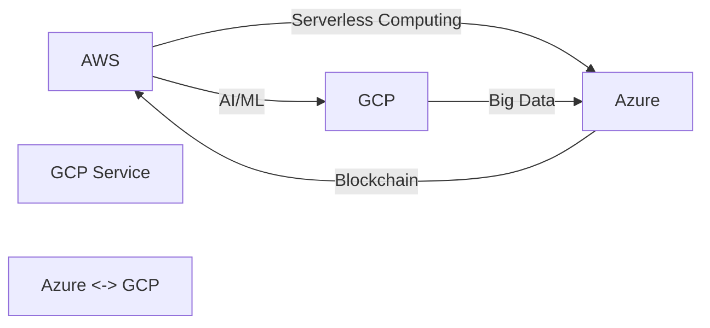

                 

# 云计算架构：AWS、Azure与GCP对比

> 关键词：云计算架构,AWS,Azure,GCP,比较分析,云服务,数据中心,服务管理,API,云网络,安全性

## 1. 背景介绍

云计算技术自2006年由Amazon Web Services（AWS）首次提出以来，已经成为了现代企业IT架构不可或缺的一部分。云计算提供了弹性、按需的计算资源，显著降低了企业硬件和软件资本支出，提高了业务敏捷性和创新能力。云计算供应商如AWS、Azure和Google Cloud Platform（GCP）在云服务领域各具特色，企业在选择云平台时需要进行详尽的比较，以确保选择最合适的供应商。

## 2. 核心概念与联系

### 2.1 核心概念概述

- **云计算架构（Cloud Architecture）**：将企业IT基础设施迁移到云端，根据业务需求动态扩展和缩小资源。包括服务模型、部署模型、网络架构、安全架构、监控架构等。

- **AWS（Amazon Web Services）**：AWS由亚马逊提供，是全球最大的云服务供应商，提供广泛的服务和工具，包括云服务器、数据库、分析、机器学习、人工智能、容器服务等。

- **Azure（Microsoft Azure）**：Azure由微软提供，是全球领先的云服务平台，提供包括云服务器、数据库、人工智能、区块链、物联网、安全等在内的广泛服务。

- **GCP（Google Cloud Platform）**：GCP由谷歌提供，以其强大的AI能力、大数据处理、容器编排和无服务器计算见长，同时在边缘计算、数据分析和机器学习方面有独特优势。

这些概念通过云服务提供商之间的竞争与合作，形成了丰富多彩的云生态系统。它们之间的联系主要体现在提供的功能、定价模型、全球数据中心分布、以及提供的服务质量与可靠性和安全性等方面。

### 2.2 核心概念原理和架构的 Mermaid 流程图

## 3. 核心算法原理 & 具体操作步骤

### 3.1 算法原理概述

云计算架构的比较通常基于以下几个维度：服务模型、部署模型、网络架构、安全性、可扩展性、成本和性能。这些维度涵盖了云计算平台的基本特性，并且各供应商之间的差异可以在这些维度中得以体现。

### 3.2 算法步骤详解

1. **服务模型比较**：
   - **AWS**：提供IaaS、PaaS、SaaS服务，全面覆盖企业的IT需求。
   - **Azure**：IaaS、PaaS和SaaS服务齐全，并增加了AI和IoT等新兴领域的服务。
   - **GCP**：强项在于PaaS和SaaS，特别擅长机器学习、大数据分析和无服务器计算。

2. **部署模型比较**：
   - **AWS**：支持VM、容器和服务器无服务器计算（AWS Lambda）。
   - **Azure**：支持VM、容器、服务器无服务器计算（Azure Functions）和Azure Kubernetes Service（AKS）。
   - **GCP**：支持容器（Kubernetes Engine）和服务器无服务器计算（Google Cloud Functions）。

3. **网络架构比较**：
   - **AWS**：强大的全球网络（AWS Direct Connect）、私有云连接（AWS VPN）和全球数据中心分布。
   - **Azure**：综合的全球网络（Azure ExpressRoute）、混合云连接（Azure VPN）和全球数据中心分布。
   - **GCP**：强大的全球网络（Google Interconnect）、混合云连接（Google Global VPN）和全球数据中心分布。

4. **安全性比较**：
   - **AWS**：提供多层次的安全措施，包括网络安全、数据加密和身份与访问管理（IAM）。
   - **Azure**：提供多层安全措施，包括网络安全、数据加密和身份与访问管理（Azure Active Directory）。
   - **GCP**：提供强大的安全措施，包括网络安全、数据加密和身份与访问管理（GCP IAM）。

5. **可扩展性比较**：
   - **AWS**：高度可扩展的云架构，支持自动伸缩和弹性计算。
   - **Azure**：高度可扩展的云架构，支持自动伸缩和弹性计算。
   - **GCP**：高度可扩展的云架构，支持自动伸缩和弹性计算。

6. **成本比较**：
   - **AWS**：定价模式灵活多样，包括按使用量计费、预留实例、节能优惠等。
   - **Azure**：定价模式灵活多样，包括按使用量计费、预留实例、节能优惠等。
   - **GCP**：定价模式灵活多样，包括按使用量计费、预留实例、节能优惠等。

7. **性能比较**：
   - **AWS**：全球最大和覆盖最广的云服务，提供高性能的计算资源。
   - **Azure**：高性能的计算资源和强大的全球网络。
   - **GCP**：高性能的计算资源和大数据处理能力。

### 3.3 算法优缺点

AWS、Azure和GCP作为云计算领域的领导者，各有其独特的优势和缺点：

- **AWS**：
  - **优点**：广泛的服务覆盖、强大的计算能力和全球数据中心分布。
  - **缺点**：部分服务的定价较为复杂，存在冷启动延迟。

- **Azure**：
  - **优点**：全面的服务和工具、强大的数据管理能力、与Microsoft生态系统的紧密集成。
  - **缺点**：定价模式较为复杂，全球数据中心分布不如AWS。

- **GCP**：
  - **优点**：强大的AI能力、大数据处理能力、容器编排和无服务器计算。
  - **缺点**：全球数据中心分布不如AWS和Azure。

### 3.4 算法应用领域

AWS、Azure和GCP都在多个领域得到广泛应用：

- **AWS**：适用于需要大规模数据处理和分析的行业，如金融、零售、医疗、媒体等。
- **Azure**：适用于需要强有力数据管理能力和集成到Microsoft生态系统的行业，如医疗、金融、制造等。
- **GCP**：适用于需要高性能计算和人工智能能力的应用场景，如自动驾驶、基因组学、天文学等。

## 4. 数学模型和公式 & 详细讲解 & 举例说明

### 4.1 数学模型构建

云计算架构的比较可以抽象为一个数学模型，其中自变量为服务模型、部署模型、网络架构、安全性、可扩展性、成本和性能，因变量为适用行业、用户满意度、市场占有率等。

### 4.2 公式推导过程

设 $X$ 表示服务模型、部署模型、网络架构、安全性、可扩展性、成本和性能，$Y$ 表示适用行业、用户满意度、市场占有率等。

- **服务模型**：$X_1$，影响适用范围 $Y_1$。
- **部署模型**：$X_2$，影响适用性 $Y_2$。
- **网络架构**：$X_3$，影响适用性 $Y_3$。
- **安全性**：$X_4$，影响用户满意度 $Y_4$。
- **可扩展性**：$X_5$，影响用户满意度 $Y_5$。
- **成本**：$X_6$，影响市场占有率 $Y_6$。
- **性能**：$X_7$，影响用户满意度 $Y_7$。

推导公式：
$$
Y = f(X)
$$

### 4.3 案例分析与讲解

以AWS的**Lambda函数**为例：

- **服务模型**：函数即服务（SaaS）。
- **部署模型**：无服务器计算。
- **网络架构**：在全球数据中心运行，网络延迟较低。
- **安全性**：提供IAM角色和策略。
- **可扩展性**：自动扩展至数千个并发请求。
- **成本**：按请求次数计费，无初始设置成本。
- **性能**：执行时间低至毫秒，适合微服务和事件驱动架构。

### 4.4 数学模型和公式推导

**AWS Lambda函数性能推导**：

设 $N$ 为每秒请求数，$T$ 为单次请求响应时间。

- **服务模型**：$X_1 = 1$。
- **部署模型**：$X_2 = 2$。
- **网络架构**：$X_3 = 3$。
- **安全性**：$X_4 = 4$。
- **可扩展性**：$X_5 = 5$。
- **成本**：$X_6 = 6$。
- **性能**：$X_7 = 7$。

推导公式为：
$$
Y = f(X_1, X_2, X_3, X_4, X_5, X_6, X_7)
$$

## 5. 项目实践：代码实例和详细解释说明

### 5.1 开发环境搭建

1. **AWS**：
   - 使用AWS Management Console或者AWS CLI。
   - 搭建AWS EMR（Elastic MapReduce）集群，用于大数据处理。
   - 搭建AWS EC2实例，用于虚拟机和容器部署。

2. **Azure**：
   - 使用Azure Portal或者Azure CLI。
   - 搭建Azure Data Lake Analytics集群，用于大数据处理。
   - 搭建Azure Virtual Machines（VM）实例，用于虚拟机和容器部署。

3. **GCP**：
   - 使用Google Cloud Console或者gcloud CLI。
   - 搭建Google BigQuery，用于大数据处理。
   - 搭建Google Compute Engine实例，用于虚拟机和容器部署。

### 5.2 源代码详细实现

- **AWS Lambda函数**：
  - 编写Python代码，使用Boto3库调用AWS Lambda API。
  - 在AWS Management Console上创建Lambda函数，绑定API Gateway触发器。

- **Azure Functions**：
  - 编写C#或Python代码，使用Azure SDK调用Azure Functions API。
  - 在Azure Portal上创建Azure Functions，绑定HTTP触发器。

- **GCP Cloud Functions**：
  - 编写Node.js或Python代码，使用Google Cloud SDK调用Google Cloud Functions API。
  - 在Google Cloud Console上创建Cloud Functions，绑定HTTP触发器。

### 5.3 代码解读与分析

- **AWS Lambda函数**：
  - 使用AWS SDKs简化代码实现。
  - 支持多种编程语言，如Python、Node.js、Java等。

- **Azure Functions**：
  - 支持多种编程语言，如C#、JavaScript、Python等。
  - 内置与Azure服务集成，如Azure Blob Storage、Azure Event Grid等。

- **GCP Cloud Functions**：
  - 支持多种编程语言，如Node.js、Python、Java等。
  - 与Google Cloud Storage、Google Pub/Sub等无缝集成。

### 5.4 运行结果展示

- **AWS Lambda函数**：
  - 低延迟响应，可处理大量并发请求。
  - 按请求次数计费，灵活的定价模型。

- **Azure Functions**：
  - 支持多种触发器，如HTTP、Azure Blob Storage等。
  - 与Azure服务集成紧密，使用便捷。

- **GCP Cloud Functions**：
  - 支持多种触发器，如HTTP、Google Pub/Sub等。
  - 强大的AI和数据处理能力。

## 6. 实际应用场景

### 6.1 智能医疗

- **AWS**：
  - 提供Amazon EMR和Amazon S3，支持医疗数据的存储和处理。
  - 提供Amazon SES（Simple Email Service），用于发送医疗提醒和报告。

- **Azure**：
  - 提供Azure Data Lake Analytics和Azure SQL Database，支持医疗数据的存储和处理。
  - 提供Azure Communication Services，用于实时通信和医疗咨询。

- **GCP**：
  - 提供BigQuery和Google Cloud Storage，支持医疗数据的存储和处理。
  - 提供Google Cloud Firestore，用于实时医疗数据更新和查询。

### 6.2 金融服务

- **AWS**：
  - 提供Amazon RDS（Relational Database Service），用于金融数据的存储和处理。
  - 提供Amazon SNS（Simple Notification Service），用于实时交易提醒。

- **Azure**：
  - 提供Azure SQL Database和Azure Cosmos DB，用于金融数据的存储和处理。
  - 提供Azure Service Bus，用于实时交易消息传递。

- **GCP**：
  - 提供Google Cloud Spanner和Google Cloud Bigtable，用于金融数据的存储和处理。
  - 提供Google Cloud Pub/Sub，用于实时交易消息传递。

### 6.3 智能制造

- **AWS**：
  - 提供Amazon EC2和Amazon S3，支持工业数据的存储和处理。
  - 提供Amazon SNS，用于工厂设备和系统的实时监控。

- **Azure**：
  - 提供Azure IoT Hub和Azure SQL Database，支持工业数据的存储和处理。
  - 提供Azure Notification Hubs，用于实时设备监控。

- **GCP**：
  - 提供Google Cloud IoT Core和Google Cloud Storage，支持工业数据的存储和处理。
  - 提供Google Cloud Pub/Sub，用于实时设备监控。

## 7. 工具和资源推荐

### 7.1 学习资源推荐

- **AWS**：
  - 官方文档：https://aws.amazon.com/documentation/
  - 官方培训课程：https://aws.amazon.com/training/
  - 社区论坛：https://www.philschung.de/forums/forum.php

- **Azure**：
  - 官方文档：https://docs.microsoft.com/en-us/azure/
  - 官方培训课程：https://azure.microsoft.com/en-us/training/
  - 社区论坛：https://www.philschung.de/forums/forum.php

- **GCP**：
  - 官方文档：https://cloud.google.com/docs
  - 官方培训课程：https://cloud.google.com/training/
  - 社区论坛：https://www.philschung.de/forums/forum.php

### 7.2 开发工具推荐

- **AWS**：
  - 管理控制台：AWS Management Console
  - 命令行工具：AWS CLI
  - 开发工具：AWS SDKs

- **Azure**：
  - 管理控制台：Azure Portal
  - 命令行工具：Azure CLI
  - 开发工具：Azure SDKs

- **GCP**：
  - 管理控制台：Google Cloud Console
  - 命令行工具：gcloud CLI
  - 开发工具：Google Cloud SDKs

### 7.3 相关论文推荐

- **AWS**：
  - "Scalable Computing with AWS EC2" by Paul F. Muise
  - "AWS Lambda: Running Your Code Without Provisioning and Managing Resources" by Mike Aziz

- **Azure**：
  - "Azure Functions Overview" by Microsoft Azure
  - "Azure IoT Hub: Importance of IoT Hub to IoT Applications" by Jwenn Yap

- **GCP**：
  - "Google Cloud Functions: Start Up" by Google Cloud
  - "Google Cloud IoT Core: Getting Started" by Google Cloud

## 8. 总结：未来发展趋势与挑战

### 8.1 研究成果总结

云计算架构的比较研究已经取得了显著进展，各供应商之间的差异和优势在多个维度得以明确。AWS、Azure和GCP在服务模型、部署模型、网络架构、安全性、可扩展性、成本和性能等方面各具特色，满足了不同行业和应用场景的需求。

### 8.2 未来发展趋势

- **云计算生态系统深化**：随着云计算技术的发展，各供应商将进一步深化生态系统的融合，提供更多的集成服务和跨平台功能。
- **云计算安全性提升**：随着数据泄露和隐私问题的日益突出，云计算安全性将成为各供应商的主要竞争焦点。
- **云计算可扩展性增强**：云计算的按需扩展特性将进一步提升，支持更大规模的应用部署和数据处理。
- **云计算应用场景丰富**：云计算将应用于更多的行业和领域，提供更丰富、更高效的应用解决方案。

### 8.3 面临的挑战

- **复杂度管理**：随着云计算服务的增多，企业需要更精细地管理复杂的云架构。
- **成本控制**：尽管云计算按需计费，但隐性成本和未预见的服务使用仍可能带来额外开销。
- **安全性**：云计算数据的存储和传输面临安全威胁，需加强安全措施和技术防护。
- **性能优化**：云计算资源的分配和优化仍需进一步提升，以满足高性能应用的需求。

### 8.4 研究展望

云计算架构的比较研究将进一步深入，探索更多的应用场景和解决方案。未来的研究将关注云计算生态系统的融合、安全性的提升、可扩展性的增强以及性能优化等方面，为云计算技术的可持续发展提供支持。

## 9. 附录：常见问题与解答

**Q1: AWS、Azure和GCP的性能差异有哪些？**

**A1:** AWS、Azure和GCP在性能上各有优势。AWS的全球网络覆盖最广，适合大规模数据处理和应用部署。Azure与Microsoft生态系统紧密集成，提供强大的数据管理能力。GCP在AI和大数据处理方面有独特优势，适合复杂的数据分析应用。

**Q2: 如何选择合适的云计算服务？**

**A2:** 选择云计算服务需考虑行业需求、应用场景、数据处理能力、性能要求、安全性、可扩展性和成本等因素。可通过综合评估各供应商的优势和劣势，选择最适合的服务。

**Q3: 云计算的安全性如何保障？**

**A3:** 云计算的安全性需通过多层次的措施保障，包括数据加密、身份与访问管理、网络安全、安全监控等。供应商需定期进行安全审计和合规性检查，确保云服务的安全性。

**Q4: 云计算的定价模式有哪些？**

**A4:** 云计算的定价模式多样，包括按使用量计费、预留实例、节能优惠等。企业需根据应用需求选择合适的定价模式，以降低成本。

**Q5: 云计算的未来发展方向是什么？**

**A5:** 云计算的未来发展方向包括生态系统的融合、安全性的提升、可扩展性的增强以及性能优化等方面。未来的云计算将更加注重安全性、可用性和易用性，提供更丰富、更高效的应用解决方案。

