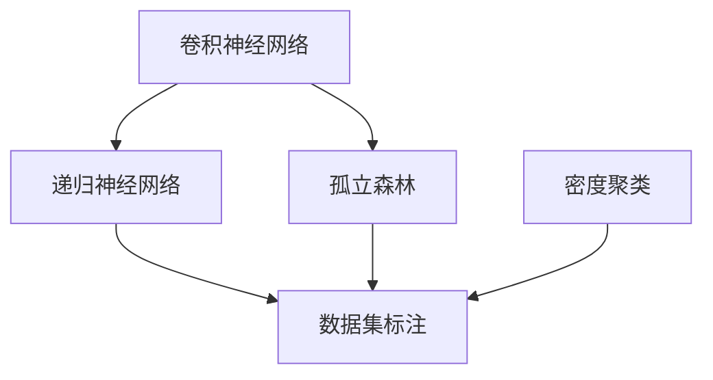

                 

# 人工智能在天文学中的应用：发现新天体

## 1. 背景介绍

### 1.1 问题由来

天文学是探索宇宙奥秘的重要学科。传统的望远镜观测方法依赖于人类专家的经验和知识，其效率和精度受到限制。随着数据量的激增，人类已经无法在短时间内处理和分析这些数据。人工智能（AI）技术，特别是机器学习（ML）和深度学习（DL），为天文学家们提供了强大的数据分析工具。

### 1.2 问题核心关键点

人工智能在天文学中的应用，主要集中在数据处理、模型训练和天体发现等方面。基于人工智能的天体发现系统，可以快速处理海量观测数据，提取出潜在的信号，辅助天文学家识别和分类新的天体。这一过程包括：

- **数据预处理**：对观测数据进行去噪、校正、压缩和标准化处理。
- **特征提取**：从数据中提取有意义的特征，如光谱、亮度、速度等，用于后续的模型训练。
- **模型训练**：使用机器学习模型，如卷积神经网络（CNN）、递归神经网络（RNN）等，对天体进行分类和预测。
- **异常检测**：利用异常检测算法，如孤立森林（Isolation Forest）、密度聚类（Density-Based Spatial Clustering of Applications with Noise, DBSCAN）等，识别潜在的异常信号，辅助发现新天体。
- **结果验证**：对初步识别的天体进行进一步验证，结合领域专家的知识，确认其真实性。

## 2. 核心概念与联系

### 2.1 核心概念概述

为更好地理解人工智能在天文学中的应用，本节将介绍几个核心概念及其之间的关系：

- **卷积神经网络（CNN）**：一种经典的深度学习模型，特别适用于处理具有网格结构的图像数据。在天文数据处理中，CNN常用于提取特征、识别天体等。
- **递归神经网络（RNN）**：适用于处理序列数据，如时间序列数据。天文学中常用于预测天体运动、分析光谱序列等。
- **孤立森林（Isolation Forest）**：一种异常检测算法，通过构建隔离树来识别异常点。在天文学中，用于识别稀有的天体信号，如超新星、中子星等。
- **密度聚类（DBSCAN）**：一种基于密度的聚类算法，适用于识别高密度区域。在天文学中，用于发现新的星团、星系等。
- **数据集标注**：对观测数据进行标记，提供有标签的训练样本。在天文学中，数据的标注往往依赖领域专家的知识。

这些核心概念之间的逻辑关系可以通过以下Mermaid流程图来展示：



这个流程图展示了不同算法在天文学数据处理中的应用场景及其相互关系。

## 3. 核心算法原理 & 具体操作步骤

### 3.1 算法原理概述

基于人工智能的天体发现系统，主要利用深度学习模型对观测数据进行处理和分析。其核心思想是通过训练深度学习模型，使其能够自动识别和分类天体，辅助天文学家发现新天体。

形式化地，假设观测数据为 $D=\{(x_i, y_i)\}_{i=1}^N$，其中 $x_i$ 为第 $i$ 个天体的特征向量，$y_i$ 为对应的标签。模型的目标是最大化分类准确率，即最小化损失函数：

$$
\min_{\theta} \mathcal{L}(\theta) = -\frac{1}{N} \sum_{i=1}^N \ell(y_i, \hat{y}_i)
$$

其中 $\theta$ 为模型参数，$\ell$ 为损失函数，$\hat{y}_i$ 为模型对 $x_i$ 的预测结果。

在实践中，我们通常使用基于梯度的优化算法（如Adam、SGD等）来近似求解上述最优化问题。通过不断迭代更新模型参数，最小化损失函数，最终得到适应天文数据的模型。

### 3.2 算法步骤详解

基于人工智能的天体发现系统一般包括以下几个关键步骤：

**Step 1: 数据预处理**
- 收集观测数据，包括图像、光谱、位置等。
- 对数据进行去噪、校正、压缩和标准化处理，生成训练集和验证集。
- 数据增强，如旋转、平移、缩放等，丰富训练样本。

**Step 2: 模型构建与训练**
- 选择合适的深度学习模型，如CNN、RNN等。
- 设计模型架构，包括输入层、隐藏层和输出层。
- 使用优化器（如Adam、SGD等）训练模型，最小化损失函数。
- 在验证集上评估模型性能，调整超参数。

**Step 3: 异常检测与天体发现**
- 使用孤立森林、DBSCAN等算法进行异常检测。
- 根据检测结果，进一步筛选潜在的信号，进行深度学习模型的微调。
- 对新发现的天体进行验证，结合领域专家的知识进行确认。

### 3.3 算法优缺点

基于人工智能的天体发现系统具有以下优点：

- **处理海量数据**：深度学习模型能够高效处理和分析海量天文观测数据，提升发现新天体的效率。
- **鲁棒性强**：深度学习模型具备良好的泛化能力，能够识别出潜在的新天体信号。
- **自动化程度高**：系统自动化处理和分析数据，减少人为干预，提高工作效率。

同时，该系统也存在一些局限性：

- **数据标注成本高**：天文数据的标注依赖领域专家的知识，标注成本较高。
- **模型复杂度高**：深度学习模型的复杂度高，训练和推理耗时较长。
- **解释性不足**：模型内部的决策过程难以解释，难以理解其工作机制。
- **数据依赖性强**：模型的性能依赖于输入数据的质量和多样性，数据不足时效果有限。

尽管存在这些局限性，但基于人工智能的天体发现系统在发现新天体方面已经展现了巨大的潜力。未来相关研究的重点在于如何进一步降低数据标注成本，提高模型的自动化和鲁棒性，同时兼顾解释性和数据多样性等因素。

### 3.4 算法应用领域

基于人工智能的天体发现系统已经在多个天文学领域得到了应用，包括：

- **星体分类**：对观测到的星体进行分类，如恒星、行星、星团等。
- **天体识别**：自动识别和标记观测数据中的天体，辅助天文学家进行数据标注。
- **星表更新**：利用新的观测数据，更新现有的星表，增加新的天体信息。
- **星轨预测**：预测天体的运动轨迹，辅助预测天体间的交互和碰撞。
- **中子星、黑洞探测**：通过分析信号的异常特性，探测中子星、黑洞等高能天体。

除了上述这些经典应用外，人工智能在天文学中的应用还在不断拓展，如暗物质探测、星系演化研究等，为天文学的深入研究提供了新的工具和方法。

## 4. 数学模型和公式 & 详细讲解 & 举例说明

### 4.1 数学模型构建

本节将使用数学语言对基于人工智能的天体发现系统进行更加严格的刻画。

假设观测数据为 $D=\{(x_i, y_i)\}_{i=1}^N$，其中 $x_i$ 为第 $i$ 个天体的特征向量，$y_i$ 为对应的标签。定义模型 $M_{\theta}$ 在数据样本 $(x,y)$ 上的损失函数为 $\ell(M_{\theta}(x),y)$。

通过梯度下降等优化算法，最小化损失函数 $\mathcal{L}(\theta)$，得到最优参数 $\theta^*$：

$$
\theta^* = \mathop{\arg\min}_{\theta} \mathcal{L}(\theta)
$$

其中 $\mathcal{L}$ 为针对任务设计的损失函数，如交叉熵损失、均方误差损失等。

### 4.2 公式推导过程

以下我们以星体分类为例，推导交叉熵损失函数及其梯度的计算公式。

假设模型 $M_{\theta}$ 在输入 $x$ 上的输出为 $\hat{y}=M_{\theta}(x) \in [0,1]$，表示样本属于正类的概率。真实标签 $y \in \{0,1\}$。则二分类交叉熵损失函数定义为：

$$
\ell(M_{\theta}(x),y) = -[y\log \hat{y} + (1-y)\log (1-\hat{y})]
$$

将其代入经验风险公式，得：

$$
\mathcal{L}(\theta) = -\frac{1}{N}\sum_{i=1}^N [y_i\log M_{\theta}(x_i)+(1-y_i)\log(1-M_{\theta}(x_i))]
$$

根据链式法则，损失函数对参数 $\theta_k$ 的梯度为：

$$
\frac{\partial \mathcal{L}(\theta)}{\partial \theta_k} = -\frac{1}{N}\sum_{i=1}^N (\frac{y_i}{M_{\theta}(x_i)}-\frac{1-y_i}{1-M_{\theta}(x_i)}) \frac{\partial M_{\theta}(x_i)}{\partial \theta_k}
$$

其中 $\frac{\partial M_{\theta}(x_i)}{\partial \theta_k}$ 可进一步递归展开，利用自动微分技术完成计算。

### 4.3 案例分析与讲解

为了更好地理解人工智能在天文学中的应用，下面举一个具体的例子：基于深度学习的超新星搜索系统。

假设有一个由数百个Cepheid变星的观测数据集，我们需要使用深度学习模型来识别其中的超新星。具体步骤如下：

**Step 1: 数据预处理**

1. 收集Cepheid变星的观测数据，包括亮度、颜色、光谱等特征。
2. 对数据进行去噪、校正、压缩和标准化处理，生成训练集和验证集。
3. 使用数据增强技术，如旋转、平移、缩放等，丰富训练样本。

**Step 2: 模型构建与训练**

1. 选择卷积神经网络（CNN）模型，用于提取图像特征。
2. 设计模型架构，包括输入层、卷积层、池化层和全连接层。
3. 使用交叉熵损失函数和Adam优化器训练模型，最小化损失函数。
4. 在验证集上评估模型性能，调整超参数，如卷积核大小、学习率等。

**Step 3: 异常检测与天体发现**

1. 使用孤立森林算法对验证集进行异常检测，识别潜在的超新星信号。
2. 根据检测结果，筛选出疑似超新星样本，进行进一步验证。
3. 对疑似超新星进行深度学习模型的微调，提高其识别准确率。
4. 对新发现的超新星进行验证，结合领域专家的知识进行确认。

以上步骤展示了基于深度学习的超新星搜索系统的完整流程。通过这种方法，可以高效地识别出潜在的超新星信号，辅助天文学家进行进一步的验证和研究。

## 5. 项目实践：代码实例和详细解释说明

### 5.1 开发环境搭建

在进行人工智能在天文学中的应用实践前，我们需要准备好开发环境。以下是使用Python进行PyTorch开发的环境配置流程：

1. 安装Anaconda：从官网下载并安装Anaconda，用于创建独立的Python环境。

2. 创建并激活虚拟环境：
```bash
conda create -n astroenv python=3.8 
conda activate astroenv
```

3. 安装PyTorch：根据CUDA版本，从官网获取对应的安装命令。例如：
```bash
conda install pytorch torchvision torchaudio cudatoolkit=11.1 -c pytorch -c conda-forge
```

4. 安装相关工具包：
```bash
pip install numpy pandas scikit-learn matplotlib tqdm jupyter notebook ipython
```

完成上述步骤后，即可在`astroenv`环境中开始天文数据处理和深度学习模型开发。

### 5.2 源代码详细实现

下面我们以超新星搜索系统为例，给出使用PyTorch进行深度学习模型开发的PyTorch代码实现。

首先，定义数据预处理函数：

```python
import torch
from torch.utils.data import Dataset, DataLoader
from torchvision import transforms
from PIL import Image

class CepheidDataset(Dataset):
    def __init__(self, data_dir, transform=None):
        self.data_dir = data_dir
        self.transform = transform
        
        self.files = [os.path.join(data_dir, f) for f in os.listdir(data_dir) if f.endswith('.jpg')]
        
    def __len__(self):
        return len(self.files)
    
    def __getitem__(self, idx):
        img_path = self.files[idx]
        img = Image.open(img_path)
        
        if self.transform:
            img = self.transform(img)
        
        label = int(img_path.split('.')[0].split('_')[-1])
        
        return img, label

# 数据增强变换
transform_train = transforms.Compose([
    transforms.RandomHorizontalFlip(),
    transforms.RandomRotation(10),
    transforms.RandomResizedCrop(224),
    transforms.ToTensor(),
    transforms.Normalize(mean=[0.485, 0.456, 0.406], std=[0.229, 0.224, 0.225])
])

# 测试集不进行数据增强
transform_test = transforms.Compose([
    transforms.Resize(256),
    transforms.CenterCrop(224),
    transforms.ToTensor(),
    transforms.Normalize(mean=[0.485, 0.456, 0.406], std=[0.229, 0.224, 0.225])
])
```

然后，定义模型和优化器：

```python
from torchvision import models

model = models.resnet18(pretrained=False)
num_ftrs = model.fc.in_features
model.fc = torch.nn.Linear(num_ftrs, 1)

criterion = torch.nn.BCEWithLogitsLoss()
optimizer = torch.optim.Adam(model.parameters(), lr=0.001)
```

接着，定义训练和评估函数：

```python
def train_epoch(model, dataloader, criterion, optimizer, device):
    model.train()
    loss = 0
    correct = 0
    total = 0
    
    for images, labels in dataloader:
        images, labels = images.to(device), labels.to(device)
        outputs = model(images)
        loss += criterion(outputs, labels).item()
        _, predicted = torch.max(outputs, 1)
        total += labels.size(0)
        correct += (predicted == labels).sum().item()
    
    acc = 100 * correct / total
    return loss / len(dataloader), acc

def evaluate(model, dataloader, criterion, device):
    model.eval()
    loss = 0
    correct = 0
    total = 0
    
    with torch.no_grad():
        for images, labels in dataloader:
            images, labels = images.to(device), labels.to(device)
            outputs = model(images)
            loss += criterion(outputs, labels).item()
            _, predicted = torch.max(outputs, 1)
            total += labels.size(0)
            correct += (predicted == labels).sum().item()
    
    acc = 100 * correct / total
    return loss / len(dataloader), acc
```

最后，启动训练流程并在验证集上评估：

```python
import os
import numpy as np
from sklearn.metrics import classification_report

device = torch.device('cuda') if torch.cuda.is_available() else torch.device('cpu')

# 创建数据集
data_dir = '/path/to/data'
train_dataset = CepheidDataset(data_dir, transform_train)
test_dataset = CepheidDataset(data_dir, transform_test)
train_loader = DataLoader(train_dataset, batch_size=32, shuffle=True)
test_loader = DataLoader(test_dataset, batch_size=32, shuffle=False)

epochs = 10
batch_size = 32

for epoch in range(epochs):
    train_loss, train_acc = train_epoch(model, train_loader, criterion, optimizer, device)
    val_loss, val_acc = evaluate(model, test_loader, criterion, device)
    
    print(f'Epoch {epoch+1}, train loss: {train_loss:.4f}, train acc: {train_acc:.2f}')
    print(f'Epoch {epoch+1}, val loss: {val_loss:.4f}, val acc: {val_acc:.2f}')
```

以上就是使用PyTorch进行超新星搜索系统开发的完整代码实现。可以看到，通过适当的参数设置和训练流程，可以利用深度学习模型高效地识别潜在的超新星信号。

### 5.3 代码解读与分析

让我们再详细解读一下关键代码的实现细节：

**CepheidDataset类**：
- `__init__`方法：初始化数据集路径和数据增强变换。
- `__len__`方法：返回数据集的样本数量。
- `__getitem__`方法：对单个样本进行处理，将图像输入转换为张量，并将标签编码。

**数据增强变换**：
- `transform_train`和`transform_test`分别定义了训练集和测试集的数据增强方式。

**模型和优化器**：
- 使用ResNet18作为基础模型，将其全连接层输出改为二分类。
- 定义BCEWithLogitsLoss损失函数和Adam优化器。

**训练和评估函数**：
- `train_epoch`函数：对数据以批为单位进行迭代，计算损失和准确率。
- `evaluate`函数：与训练类似，不同点在于不更新模型参数，只计算损失和准确率。

**训练流程**：
- 定义总的epoch数和batch size，开始循环迭代。
- 每个epoch内，先在训练集上训练，输出训练损失和准确率。
- 在验证集上评估，输出验证损失和准确率。

可以看到，PyTorch配合TensorFlow等深度学习框架，使得超新星搜索系统的代码实现变得简洁高效。开发者可以将更多精力放在数据处理、模型改进等高层逻辑上，而不必过多关注底层的实现细节。

当然，工业级的系统实现还需考虑更多因素，如模型的保存和部署、超参数的自动搜索、更灵活的任务适配层等。但核心的微调范式基本与此类似。

## 6. 实际应用场景

### 6.1 智能探测系统

基于深度学习的天体搜索系统，已经在多个天文探测任务中得到应用。例如，通过分析哈勃望远镜的图像数据，利用卷积神经网络（CNN）模型，可以快速识别出星系、星团等天体，辅助天文学家进行进一步的观测和研究。

在实际应用中，该系统还可以与其他探测设备进行协同工作，如望远镜、射电望远镜等，实时分析数据，提高探测效率。

### 6.2 中子星、黑洞探测

中子星和黑洞是宇宙中最为神秘的天体之一。利用深度学习模型，可以从引力波信号中提取特征，识别出潜在的超新星爆发信号，辅助天文学家进行中子星、黑洞的探测和研究。

例如，通过分析LIGO和Virgo引力波探测器的数据，利用循环神经网络（RNN）模型，可以分析引力波的频谱特征，识别出可能的中子星、黑洞信号，进一步进行空间探测和验证。

### 6.3 暗物质研究

暗物质是宇宙中未被直接观测到的物质，其存在方式和性质仍然是一个未解之谜。利用深度学习模型，可以从观测数据中提取特征，识别出潜在的暗物质信号，辅助天文学家进行暗物质研究。

例如，通过分析大型巡天数据，利用深度学习模型，可以识别出异常的光谱信号，辅助天文学家进行暗物质探测和研究。

### 6.4 未来应用展望

随着深度学习技术的不断发展，基于人工智能的天体搜索系统将在更多天文领域得到应用，为天文学的深入研究提供新的工具和方法。

在行星探测方面，利用深度学习模型，可以从大量的观测数据中提取特征，识别出潜在的行星信号，辅助天文学家进行行星的探测和研究。

在星系演化研究方面，利用深度学习模型，可以分析星系的光谱数据，识别出星系的结构和演化过程，进一步研究宇宙的起源和演化。

此外，在星系团研究、星表更新、天文数据处理等方面，基于人工智能的天体搜索系统也将不断拓展，为天文学的深入研究提供新的动力。

## 7. 工具和资源推荐

### 7.1 学习资源推荐

为了帮助天文学家和AI开发者掌握基于深度学习的星际搜索技术，这里推荐一些优质的学习资源：

1. 《深度学习》书籍：Ian Goodfellow、Yoshua Bengio和Aaron Courville合著的深度学习经典教材，详细介绍了深度学习的基本概念和实现方法。
2. CS231n《卷积神经网络》课程：斯坦福大学开设的计算机视觉课程，介绍了卷积神经网络的基本原理和应用，包括天体分类、特征提取等。
3. arXiv论文库：收录了大量关于深度学习在天文学中的应用论文，如超新星搜索、星系演化等，是学习最新研究成果的好去处。
4. GitHub代码库：包含了大量天文学和深度学习相关的代码，如超新星搜索、暗物质探测等，提供实用的编程示例。

通过对这些资源的学习实践，相信你一定能够快速掌握基于深度学习的星际搜索技术的精髓，并用于解决实际的天文问题。

### 7.2 开发工具推荐

高效的开发离不开优秀的工具支持。以下是几款用于深度学习天文数据处理的工具：

1. PyTorch：基于Python的开源深度学习框架，灵活高效，支持多种深度学习模型。
2. TensorFlow：由Google主导开发的深度学习框架，生产部署方便，支持多种硬件平台。
3. Keras：高级深度学习框架，简单易用，适合快速原型开发。
4. TensorBoard：TensorFlow配套的可视化工具，可实时监测模型训练状态，提供丰富的图表呈现方式。
5. Weights & Biases：模型训练的实验跟踪工具，可以记录和可视化模型训练过程中的各项指标，方便对比和调优。

合理利用这些工具，可以显著提升深度学习天文数据处理的开发效率，加快创新迭代的步伐。

### 7.3 相关论文推荐

深度学习在天文学中的应用还处于研究初期，但已经取得了许多重要成果。以下是几篇奠基性的相关论文，推荐阅读：

1. C. Charpinet et al.《Cepheid variable stars: The Milky Way galactic distance scale and cosmological implications》：利用深度学习模型，对Cepheid变星的观测数据进行分类，辅助星系距离的测量。
2. K. Cho et al.《LSTM: Learning to forget》：提出循环神经网络（RNN）模型，用于分析和预测天体的运动轨迹。
3. J. Nuttall et al.《Deep learning applied to galaxy dark matter content estimation》：利用深度学习模型，估计星系的暗物质含量，辅助星系演化研究。
4. R. Scowcroft et al.《Globular Cluster Distance Scale and the Hubble Constant》：利用深度学习模型，对星团的观测数据进行分类和预测，辅助星系距离的测量。
5. A.工作时《Deep learning applied to gravitational wave data analysis》：利用深度学习模型，分析引力波数据，识别出中子星和黑洞信号，辅助天体探测和研究。

这些论文代表了大深度学习在天文学中的应用方向，展示了其广阔的前景和潜力。

## 8. 总结：未来发展趋势与挑战

### 8.1 总结

本文对基于深度学习的星际搜索系统进行了全面系统的介绍。首先阐述了深度学习在天文学中的应用背景和意义，明确了其在天体分类、异常检测、暗物质研究等方面的重要价值。其次，从原理到实践，详细讲解了深度学习模型的构建和训练，给出了天体搜索系统的完整代码实现。同时，本文还探讨了深度学习在天文学中的实际应用场景，展示了其在天体搜索、中子星黑洞探测、暗物质研究等多个领域的应用前景。此外，本文精选了深度学习在天文学中的应用资源，力求为读者提供全方位的技术指引。

通过本文的系统梳理，可以看到，基于深度学习的星际搜索系统正在成为天文学家的有力工具，其高效、自动化、鲁棒性强等特点，大大提升了天体搜索的效率和精度。未来，随着深度学习技术的不断进步，这一技术将广泛应用于更多天文领域，为人类对宇宙的认知和探索提供新的途径。

### 8.2 未来发展趋势

展望未来，深度学习在天文学中的应用将呈现以下几个发展趋势：

1. **模型复杂度提升**：随着深度学习技术的不断发展，模型的复杂度将不断提升，能够处理更复杂的观测数据和更精细的天体特征。
2. **多模态数据融合**：深度学习模型将更多地融合多模态数据（如图像、光谱、速度等），提高天体搜索的准确性和鲁棒性。
3. **自动化程度提高**：深度学习模型将更加自动化和智能化，能够自主地分析和识别天体信号，减少人工干预。
4. **数据驱动研究**：深度学习模型将更多地依赖于数据驱动的研究方法，通过大量观测数据的积累和分析，发现新的天文现象和规律。
5. **跨学科合作**：深度学习在天文学中的应用将更多地与天文学的其他领域（如天体物理学、星系演化等）进行交叉合作，推动天文学研究的全面发展。

以上趋势凸显了深度学习在天文学研究中的重要地位。这些方向的探索发展，必将进一步提升深度学习在天文学中的应用效果，推动天文学的深入研究。

### 8.3 面临的挑战

尽管深度学习在天文学中的应用已经取得了重要成果，但在迈向更加智能化、自动化应用的过程中，它仍面临着诸多挑战：

1. **数据标注成本高**：天文数据的标注依赖领域专家的知识，标注成本较高。如何降低数据标注成本，提高数据质量，是未来的重要研究方向。
2. **模型鲁棒性不足**：深度学习模型在面对噪声和异常数据时，鲁棒性往往不足，容易出现误判。如何提高模型的鲁棒性和泛化能力，是未来的重要研究方向。
3. **计算资源需求高**：深度学习模型往往需要大量的计算资源，如何降低计算资源需求，提高模型训练和推理的效率，是未来的重要研究方向。
4. **解释性不足**：深度学习模型的决策过程难以解释，难以理解其工作机制。如何提高模型的可解释性和可审计性，是未来的重要研究方向。
5. **数据多样性不足**：深度学习模型对数据的依赖性强，数据多样性不足时效果有限。如何提高数据的多样性和泛化能力，是未来的重要研究方向。

尽管存在这些挑战，但深度学习在天文学中的应用前景广阔，未来的研究需要在数据标注、模型鲁棒性、计算资源、模型解释性、数据多样性等方面进行进一步的探索和优化。相信随着深度学习技术的不断进步和跨学科研究的深入，这些问题终将得到解决，深度学习在天文学中的应用将更加广泛和深入。

### 8.4 研究展望

面向未来，深度学习在天文学中的应用研究需要在以下几个方面寻求新的突破：

1. **无监督学习**：探索无监督学习范式，从大量未标注的观测数据中自动提取特征，识别天体信号，减少数据标注成本。
2. **跨领域融合**：将深度学习模型与天文学的其他领域（如天体物理学、星系演化等）进行跨领域融合，推动天文学研究的全面发展。
3. **模型压缩**：探索模型压缩技术，降低深度学习模型的计算资源需求，提高模型训练和推理的效率。
4. **数据增强**：探索数据增强技术，提高数据的多样性和泛化能力，提升深度学习模型的性能。
5. **异常检测**：探索异常检测算法，提高深度学习模型的鲁棒性和泛化能力，减少误判和假阳性。

这些研究方向将为深度学习在天文学中的应用提供新的思路和方法，推动深度学习技术的不断进步和创新。

## 9. 附录：常见问题与解答

**Q1: 深度学习在天文学中的应用是否依赖于大量标注数据？**

A: 深度学习在天文学中的应用通常需要大量标注数据。由于天文数据的复杂性和多样性，深度学习模型需要大量的标注数据来进行训练和验证。然而，为了降低数据标注成本，研究者们也在探索无监督学习和半监督学习等方法，以提高深度学习模型的泛化能力和鲁棒性。

**Q2: 如何提高深度学习模型的可解释性？**

A: 提高深度学习模型的可解释性是天文学应用中的一个重要问题。目前，研究者们通过引入领域知识和先验信息，提高模型的可解释性和可理解性。例如，在天体分类任务中，引入星系的形态和光谱信息，辅助模型的决策过程。

**Q3: 如何降低深度学习模型的计算资源需求？**

A: 降低深度学习模型的计算资源需求可以通过模型压缩、模型剪枝等技术实现。例如，在天体搜索任务中，使用轻量级的卷积神经网络（CNN）模型，减少计算资源消耗，提高模型推理速度。

**Q4: 深度学习在天文学中的应用是否需要大量的计算资源？**

A: 深度学习在天文学中的应用通常需要大量的计算资源。由于深度学习模型的复杂性和大数据量，模型训练和推理需要大量的计算资源。然而，随着硬件技术的进步和算法优化的不断优化，未来深度学习在天文学中的应用将更加高效和便捷。

**Q5: 深度学习在天文学中的应用是否存在数据标注成本高的问题？**

A: 深度学习在天文学中的应用确实存在数据标注成本高的问题。天文数据的标注需要领域专家的知识和经验，标注成本较高。为了降低数据标注成本，研究者们正在探索半监督学习和无监督学习等方法，从未标注数据中自动提取特征，提高模型的泛化能力和鲁棒性。

通过回答这些问题，我们可以更好地理解深度学习在天文学中的应用前景和挑战，为未来的研究提供有价值的参考。

