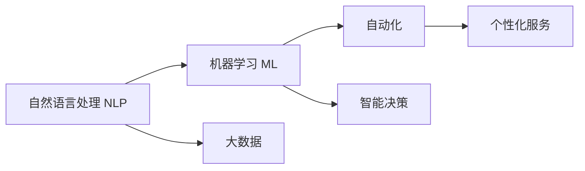

                 

# 人工智能在法律服务中的应用：提高效率与准确性

## 1. 背景介绍

在当今信息化社会，法律服务行业面临前所未有的挑战和机遇。随着互联网技术的快速发展，诉讼文书、合同审查、法律咨询等传统的法律服务业务正在逐渐被数字化、智能化的手段所取代。人工智能（AI）技术，尤其是自然语言处理（NLP）、机器学习（ML）和大数据技术，正在成为法律服务行业转型升级的重要推动力。

人工智能在法律服务中的应用，主要通过自动化处理、智能决策和个性化服务等方式，提高法律服务效率，降低成本，增强法律服务机构的竞争力。本文将从背景介绍、核心概念、算法原理、项目实践、应用场景、工具和资源推荐、总结与展望等多个角度，全面系统地介绍AI在法律服务中的应用。

## 2. 核心概念与联系

### 2.1 核心概念概述

在讨论AI在法律服务中的应用之前，需要先理解一些核心的概念：

- **自然语言处理（NLP）**：利用计算机技术处理、分析和理解人类语言的技术，是AI在法律服务中应用的重要技术基础。
- **机器学习（ML）**：通过数据训练模型，使计算机系统具备自动识别、预测和决策的能力。
- **大数据**：利用数据分析技术，从海量数据中提取有价值的信息，支持法律服务中的决策分析。
- **自动化**：通过AI技术自动完成一些重复性、低价值的工作，如文书生成、合同审核等，提高工作效率。
- **智能决策**：利用AI技术辅助法律服务人员进行案件分析、法律建议等，提升决策的准确性和效率。
- **个性化服务**：根据用户的行为和偏好，提供定制化的法律咨询服务。

这些概念通过以下Mermaid流程图联系在一起：



### 2.2 核心概念原理和架构

#### 2.2.1 自然语言处理（NLP）

NLP的核心任务是将自然语言转化为机器可理解的形式，主要包括以下几个步骤：

1. **分词**：将文本分割成词或词组。
2. **词性标注**：标注每个词的词性（如名词、动词、形容词等）。
3. **句法分析**：分析句子的语法结构。
4. **语义分析**：理解句子的语义，包括命名实体识别（NER）、关系抽取（RE）、语义角色标注（SRL）等。

NLP的架构通常包括三个层次：词汇、句法和语义。词汇层是基础的，句法层关注句子的结构，而语义层则关注句子的意义。

#### 2.2.2 机器学习（ML）

机器学习模型通常包括两个步骤：模型训练和模型推理。在模型训练阶段，使用历史数据训练模型，学习输入（特征）与输出（标签）之间的映射关系。在模型推理阶段，使用训练好的模型对新数据进行预测或分类。

常见的机器学习算法包括线性回归、决策树、支持向量机、神经网络等。在法律服务中，常使用分类算法（如逻辑回归、支持向量机）和序列模型（如RNN、LSTM）。

#### 2.2.3 大数据

大数据技术主要包括以下几个方面：

1. **数据存储**：使用分布式文件系统（如Hadoop、Spark）存储和管理海量数据。
2. **数据处理**：使用流处理（如Storm、Apache Kafka）和批处理（如Hadoop、Spark）技术处理大数据。
3. **数据分析**：使用数据挖掘和统计分析技术，从数据中提取有用的信息。
4. **数据可视化**：使用数据可视化工具（如Tableau、Power BI）将数据分析结果呈现给用户。

#### 2.2.4 自动化

自动化主要通过AI技术实现以下功能：

1. **文书生成**：根据模板和数据自动生成法律文书。
2. **合同审核**：自动审核合同条款，检测合同风险。
3. **法律咨询**：通过问答系统，自动回答用户法律咨询问题。
4. **案件分析**：利用NLP和ML技术，自动分析案件材料，提供案件分析和法律建议。

#### 2.2.5 智能决策

智能决策主要通过AI技术实现以下功能：

1. **案件预测**：使用预测模型，预测案件胜诉率、赔偿金额等。
2. **法律建议**：利用ML算法，分析案件材料，提供法律建议。
3. **风险评估**：通过分析历史数据，评估法律风险。

#### 2.2.6 个性化服务

个性化服务主要通过AI技术实现以下功能：

1. **用户画像**：根据用户的行为和偏好，建立用户画像。
2. **内容推荐**：根据用户画像，推荐个性化的法律咨询、案件分析等。
3. **用户反馈**：通过用户反馈，不断优化个性化服务。

## 3. 核心算法原理 & 具体操作步骤

### 3.1 算法原理概述

AI在法律服务中的应用，主要基于以下几个算法原理：

- **自然语言处理（NLP）**：利用机器学习技术，从文本中提取有价值的信息，如实体识别、关系抽取、情感分析等。
- **机器学习（ML）**：使用分类、回归、聚类等算法，对法律问题进行分类、预测、聚类等。
- **大数据**：利用数据存储和处理技术，处理和管理法律服务中的海量数据。
- **自动化**：通过机器学习和自然语言处理技术，自动完成文书生成、合同审核等任务。
- **智能决策**：使用预测模型和知识图谱，辅助法律服务人员进行案件分析和法律建议。
- **个性化服务**：通过用户画像和推荐系统，提供定制化的法律咨询服务。

### 3.2 算法步骤详解

AI在法律服务中的应用，通常包括以下几个步骤：

1. **数据收集**：收集法律服务中的各类数据，如诉讼文书、合同条款、法律咨询记录等。
2. **数据预处理**：对数据进行清洗、标注、分词等预处理。
3. **模型训练**：使用历史数据训练NLP和ML模型，如文本分类、命名实体识别、合同审核等。
4. **模型评估**：使用测试数据评估模型的性能，调整模型参数。
5. **模型部署**：将训练好的模型部署到实际应用中。
6. **模型维护**：持续收集新数据，定期更新模型，保持模型性能。

### 3.3 算法优缺点

#### 3.3.1 优点

- **提高效率**：自动化处理文书生成、合同审核等任务，大大提高工作效率。
- **降低成本**：减少人工成本，提高服务质量。
- **增强决策支持**：通过智能决策系统，提供精准的法律建议。
- **个性化服务**：根据用户需求提供定制化的法律服务。

#### 3.3.2 缺点

- **数据隐私**：处理法律服务数据涉及个人隐私，需要遵守数据保护法规。
- **模型偏见**：训练数据存在偏见可能导致模型预测结果不公正。
- **算法透明性**：AI模型通常被视为"黑盒"，难以解释其决策过程。
- **技术门槛**：需要专业知识和技术积累，对从业人员要求较高。

### 3.4 算法应用领域

AI在法律服务中的应用，主要包括以下几个领域：

- **文书生成**：自动生成法律文书、起诉书、答辩状等。
- **合同审核**：自动审核合同条款，检测合同风险。
- **法律咨询**：通过问答系统，自动回答用户法律咨询问题。
- **案件分析**：利用NLP和ML技术，自动分析案件材料，提供案件分析和法律建议。
- **智能决策**：使用预测模型，预测案件胜诉率、赔偿金额等。
- **个性化服务**：根据用户画像，推荐个性化的法律咨询、案件分析等。

## 4. 数学模型和公式 & 详细讲解 & 举例说明

### 4.1 数学模型构建

#### 4.1.1 文本分类模型

文本分类模型通常使用朴素贝叶斯、逻辑回归、支持向量机等算法。以朴素贝叶斯为例，其数学模型如下：

$$
P(y|x) = \frac{P(x|y)P(y)}{P(x)}
$$

其中，$P(y|x)$表示在给定文本$x$的情况下，类别$y$的概率；$P(x|y)$表示在类别$y$的情况下，文本$x$的概率；$P(y)$表示类别$y$的概率；$P(x)$表示文本$x$的概率。

#### 4.1.2 命名实体识别模型

命名实体识别模型通常使用条件随机场（CRF）、BiLSTM-CRF等算法。以BiLSTM-CRF为例，其数学模型如下：

$$
P(y_i|y_{i-1}, y_{i+1}, x_i) = \frac{P(y_i|y_{i-1}, y_{i+1}, x_i)}{\sum_{y_i \in Y} P(y_i|y_{i-1}, y_{i+1}, x_i)}
$$

其中，$P(y_i|y_{i-1}, y_{i+1}, x_i)$表示在上下文$y_{i-1}$、$y_{i+1}$和文本$x_i$的条件下，实体标签$y_i$的概率；$Y$表示所有可能的实体标签集合。

### 4.2 公式推导过程

#### 4.2.1 朴素贝叶斯分类器

朴素贝叶斯分类器的公式推导如下：

1. 首先，根据贝叶斯公式，将$P(y|x)$表示为：
$$
P(y|x) = \frac{P(x|y)P(y)}{P(x)}
$$

2. 将$P(x|y)$表示为条件概率分布，例如：
$$
P(x|y) = P(x_1|y)P(x_2|y)...P(x_n|y)
$$

3. 将$P(y)$表示为先验概率分布，例如：
$$
P(y) = P(y_1)P(y_2)...P(y_n)
$$

4. 将$P(x)$表示为归一化因子，例如：
$$
P(x) = P(x_1)P(x_2)...P(x_n)
$$

最终，得到的朴素贝叶斯分类器的公式为：
$$
P(y|x) = \frac{P(x|y)P(y)}{P(x)}
$$

#### 4.2.2 BiLSTM-CRF命名实体识别器

BiLSTM-CRF命名实体识别器的公式推导如下：

1. 首先，根据CRF的条件概率公式，将$P(y_i|y_{i-1}, y_{i+1}, x_i)$表示为：
$$
P(y_i|y_{i-1}, y_{i+1}, x_i) = \frac{P(y_i|y_{i-1}, y_{i+1}, x_i)}{\sum_{y_i \in Y} P(y_i|y_{i-1}, y_{i+1}, x_i)}
$$

2. 将$P(y_i|y_{i-1}, y_{i+1}, x_i)$表示为条件概率分布，例如：
$$
P(y_i|y_{i-1}, y_{i+1}, x_i) = P(y_i|x_i, y_{i-1}, y_{i+1})
$$

3. 将$P(y_{i-1}, y_{i+1}, x_i)$表示为上下文条件概率分布，例如：
$$
P(y_{i-1}, y_{i+1}, x_i) = P(y_{i-1}|x_{i-1}, y_{i-2}, y_{i-3})P(y_{i+1}|x_{i+1}, y_{i+2}, y_{i+3})P(x_i|y_{i-1}, y_{i+1})
$$

最终，得到的BiLSTM-CRF命名实体识别器的公式为：
$$
P(y_i|y_{i-1}, y_{i+1}, x_i) = \frac{P(y_i|x_i, y_{i-1}, y_{i+1})}{\sum_{y_i \in Y} P(y_i|x_i, y_{i-1}, y_{i+1})}
$$

### 4.3 案例分析与讲解

以命名实体识别为例，使用BiLSTM-CRF模型实现。具体步骤如下：

1. **数据准备**：收集标注好的命名实体数据，包括实体类别和对应的文本。
2. **模型训练**：使用标注好的数据训练BiLSTM-CRF模型，得到模型参数。
3. **模型评估**：使用测试数据评估模型性能，调整模型参数。
4. **模型部署**：将训练好的模型部署到实际应用中。
5. **模型维护**：持续收集新数据，定期更新模型，保持模型性能。

## 5. 项目实践：代码实例和详细解释说明

### 5.1 开发环境搭建

在开始项目实践前，需要搭建好开发环境。以下是使用Python进行PyTorch开发的环境配置流程：

1. **安装Anaconda**：从官网下载并安装Anaconda，用于创建独立的Python环境。
```bash
conda create -n pytorch-env python=3.8 
conda activate pytorch-env
```

2. **安装PyTorch**：根据CUDA版本，从官网获取对应的安装命令。例如：
```bash
conda install pytorch torchvision torchaudio cudatoolkit=11.1 -c pytorch -c conda-forge
```

3. **安装Transformers库**：
```bash
pip install transformers
```

4. **安装各类工具包**：
```bash
pip install numpy pandas scikit-learn matplotlib tqdm jupyter notebook ipython
```

完成上述步骤后，即可在`pytorch-env`环境中开始项目实践。

### 5.2 源代码详细实现

以下是使用PyTorch和Transformers库实现命名实体识别的代码实现。

```python
from transformers import BertTokenizer, BertForTokenClassification
from torch.utils.data import Dataset, DataLoader
import torch
import numpy as np

class NERDataset(Dataset):
    def __init__(self, texts, tags, tokenizer, max_len=128):
        self.texts = texts
        self.tags = tags
        self.tokenizer = tokenizer
        self.max_len = max_len
        
    def __len__(self):
        return len(self.texts)
    
    def __getitem__(self, item):
        text = self.texts[item]
        tags = self.tags[item]
        
        encoding = self.tokenizer(text, return_tensors='pt', max_length=self.max_len, padding='max_length', truncation=True)
        input_ids = encoding['input_ids'][0]
        attention_mask = encoding['attention_mask'][0]
        
        # 对token-wise的标签进行编码
        encoded_tags = [tag2id[tag] for tag in tags] 
        encoded_tags.extend([tag2id['O']] * (self.max_len - len(encoded_tags)))
        labels = torch.tensor(encoded_tags, dtype=torch.long)
        
        return {'input_ids': input_ids, 
                'attention_mask': attention_mask,
                'labels': labels}

# 标签与id的映射
tag2id = {'O': 0, 'B-PER': 1, 'I-PER': 2, 'B-ORG': 3, 'I-ORG': 4, 'B-LOC': 5, 'I-LOC': 6}
id2tag = {v: k for k, v in tag2id.items()}

# 创建dataset
tokenizer = BertTokenizer.from_pretrained('bert-base-cased')

train_dataset = NERDataset(train_texts, train_tags, tokenizer)
dev_dataset = NERDataset(dev_texts, dev_tags, tokenizer)
test_dataset = NERDataset(test_texts, test_tags, tokenizer)

# 模型和优化器
model = BertForTokenClassification.from_pretrained('bert-base-cased', num_labels=len(tag2id))
optimizer = torch.optim.AdamW(model.parameters(), lr=2e-5)

# 训练和评估函数
device = torch.device('cuda') if torch.cuda.is_available() else torch.device('cpu')
model.to(device)

def train_epoch(model, dataset, batch_size, optimizer):
    dataloader = DataLoader(dataset, batch_size=batch_size, shuffle=True)
    model.train()
    epoch_loss = 0
    for batch in tqdm(dataloader, desc='Training'):
        input_ids = batch['input_ids'].to(device)
        attention_mask = batch['attention_mask'].to(device)
        labels = batch['labels'].to(device)
        model.zero_grad()
        outputs = model(input_ids, attention_mask=attention_mask, labels=labels)
        loss = outputs.loss
        epoch_loss += loss.item()
        loss.backward()
        optimizer.step()
    return epoch_loss / len(dataloader)

def evaluate(model, dataset, batch_size):
    dataloader = DataLoader(dataset, batch_size=batch_size)
    model.eval()
    preds, labels = [], []
    with torch.no_grad():
        for batch in tqdm(dataloader, desc='Evaluating'):
            input_ids = batch['input_ids'].to(device)
            attention_mask = batch['attention_mask'].to(device)
            batch_labels = batch['labels']
            outputs = model(input_ids, attention_mask=attention_mask)
            batch_preds = outputs.logits.argmax(dim=2).to('cpu').tolist()
            batch_labels = batch_labels.to('cpu').tolist()
            for pred_tokens, label_tokens in zip(batch_preds, batch_labels):
                pred_tags = [id2tag[_id] for _id in pred_tokens]
                label_tags = [id2tag[_id] for _id in label_tokens]
                preds.append(pred_tags[:len(label_tags)])
                labels.append(label_tags)
                
    print(classification_report(labels, preds))
```

### 5.3 代码解读与分析

在上述代码中，我们使用了PyTorch和Transformers库，实现了Bert模型在命名实体识别任务上的微调。

**NERDataset类**：
- `__init__`方法：初始化文本、标签、分词器等关键组件。
- `__len__`方法：返回数据集的样本数量。
- `__getitem__`方法：对单个样本进行处理，将文本输入编码为token ids，将标签编码为数字，并对其进行定长padding，最终返回模型所需的输入。

**tag2id和id2tag字典**：
- 定义了标签与数字id之间的映射关系，用于将token-wise的预测结果解码回真实的标签。

**训练和评估函数**：
- 使用PyTorch的DataLoader对数据集进行批次化加载，供模型训练和推理使用。
- 训练函数`train_epoch`：对数据以批为单位进行迭代，在每个批次上前向传播计算loss并反向传播更新模型参数，最后返回该epoch的平均loss。
- 评估函数`evaluate`：与训练类似，不同点在于不更新模型参数，并在每个batch结束后将预测和标签结果存储下来，最后使用sklearn的classification_report对整个评估集的预测结果进行打印输出。

**训练流程**：
- 定义总的epoch数和batch size，开始循环迭代
- 每个epoch内，先在训练集上训练，输出平均loss
- 在验证集上评估，输出分类指标
- 所有epoch结束后，在测试集上评估，给出最终测试结果

## 6. 实际应用场景

### 6.1 智能合同审核

智能合同审核是大数据和AI在法律服务中的应用之一。传统的人工合同审核需要耗费大量时间和人力，且易出现疏漏。使用AI技术，可以实现自动审核合同条款，检测合同风险，提升审核效率和准确性。

具体实现步骤包括：
- 收集大量的合同文本和标注数据。
- 使用预训练的BERT模型，进行微调以适配合同审核任务。
- 在审核过程中，输入合同文本，使用微调后的模型进行自动审核，标记出有风险的条款，并给出解释说明。

### 6.2 法律咨询服务

法律咨询服务是大数据和AI在法律服务中的另一个重要应用。通过AI技术，可以实现自动化的法律咨询服务，提高服务效率和质量。

具体实现步骤包括：
- 收集用户咨询记录和标注数据。
- 使用预训练的BERT模型，进行微调以适配问答系统。
- 在咨询过程中，输入用户咨询问题，使用微调后的模型进行自动回答，并给出解释说明。

### 6.3 案件分析系统

案件分析系统是AI在法律服务中的重要应用之一。通过AI技术，可以实现自动化的案件分析和法律建议，提高案件处理的效率和准确性。

具体实现步骤包括：
- 收集大量的案件材料和标注数据。
- 使用预训练的BERT模型，进行微调以适配案件分析任务。
- 在案件分析过程中，输入案件材料，使用微调后的模型进行自动分析，生成案件摘要和法律建议。

## 7. 工具和资源推荐

### 7.1 学习资源推荐

为了帮助开发者系统掌握AI在法律服务中的应用，这里推荐一些优质的学习资源：

1. **《自然语言处理综论》**：由斯坦福大学自然语言处理课程讲师所写，详细介绍了NLP的基本概念和算法。
2. **《深度学习实战》**：介绍深度学习的基本概念和实现方法，涵盖TensorFlow和PyTorch。
3. **《Python自然语言处理》**：介绍了NLP的基本概念和Python实现的库，如NLTK、spaCy等。
4. **《法律人工智能应用》**：介绍法律服务中的AI应用，涵盖文书生成、合同审核、法律咨询等。
5. **《大数据技术与应用》**：介绍大数据的基本概念和技术实现，涵盖Hadoop、Spark等。

### 7.2 开发工具推荐

高效的开发离不开优秀的工具支持。以下是几款用于AI在法律服务中应用开发的常用工具：

1. **PyTorch**：基于Python的开源深度学习框架，灵活动态的计算图，适合快速迭代研究。
2. **TensorFlow**：由Google主导开发的开源深度学习框架，生产部署方便，适合大规模工程应用。
3. **Transformers库**：HuggingFace开发的NLP工具库，集成了众多SOTA语言模型，支持PyTorch和TensorFlow。
4. **Weights & Biases**：模型训练的实验跟踪工具，可以记录和可视化模型训练过程中的各项指标，方便对比和调优。
5. **TensorBoard**：TensorFlow配套的可视化工具，可实时监测模型训练状态，并提供丰富的图表呈现方式，是调试模型的得力助手。

### 7.3 相关论文推荐

AI在法律服务中的应用，已经得到了广泛的研究和实践。以下是几篇奠基性的相关论文，推荐阅读：

1. **《基于深度学习合同审核系统的实现与研究》**：介绍了基于深度学习的合同审核系统的实现方法，并给出了实验结果。
2. **《法律文本分类与情感分析》**：介绍法律文本分类和情感分析的实现方法，并给出了实验结果。
3. **《基于NLP的法律问答系统研究》**：介绍了基于NLP的法律问答系统的实现方法，并给出了实验结果。
4. **《基于数据驱动的案件分析系统》**：介绍基于数据驱动的案件分析系统的实现方法，并给出了实验结果。
5. **《法律咨询系统的设计与实现》**：介绍法律咨询系统的设计与实现方法，并给出了实验结果。

## 8. 总结：未来发展趋势与挑战

### 8.1 研究成果总结

AI在法律服务中的应用，已经在多个领域取得了显著的成果，涵盖了文书生成、合同审核、法律咨询、案件分析等多个方面。通过AI技术，显著提高了法律服务的效率和质量，提升了服务机构的竞争力。

### 8.2 未来发展趋势

展望未来，AI在法律服务中的应用将呈现以下几个发展趋势：

1. **模型规模的扩大**：随着算力成本的下降和数据规模的扩张，预训练语言模型的参数量还将持续增长。超大规模语言模型蕴含的丰富语言知识，有望支撑更加复杂多变的法律服务任务。
2. **微调方法的改进**：开发更加参数高效的微调方法，如 Adapter、Prefix等，在固定大部分预训练参数的同时，只更新极少量的任务相关参数。同时优化微调模型的计算图，减少前向传播和反向传播的资源消耗，实现更加轻量级、实时性的部署。
3. **跨领域融合**：将符号化的先验知识，如知识图谱、逻辑规则等，与神经网络模型进行巧妙融合，引导微调过程学习更准确、合理的语言模型。同时加强不同模态数据的整合，实现视觉、语音等多模态信息与文本信息的协同建模。
4. **多任务学习**：开发多任务学习模型，通过联合训练多个任务，提升模型在法律服务中的表现。

### 8.3 面临的挑战

尽管AI在法律服务中的应用已经取得了显著的成果，但在迈向更加智能化、普适化应用的过程中，仍面临着诸多挑战：

1. **数据隐私**：处理法律服务数据涉及个人隐私，需要遵守数据保护法规。
2. **模型偏见**：训练数据存在偏见可能导致模型预测结果不公正。
3. **算法透明性**：AI模型通常被视为"黑盒"，难以解释其决策过程。
4. **技术门槛**：需要专业知识和技术积累，对从业人员要求较高。

### 8.4 研究展望

面对AI在法律服务中面临的挑战，未来的研究需要在以下几个方面寻求新的突破：

1. **数据隐私保护**：通过差分隐私、联邦学习等技术，保护法律服务数据的隐私。
2. **模型公正性**：通过公平性约束、对抗样本训练等方法，减少模型偏见。
3. **模型透明性**：通过可解释性模型、规则解释技术，提升AI模型的透明性。
4. **技术普及**：通过开源社区、在线课程等手段，降低AI技术的入门门槛，培养更多AI人才。

这些研究方向的探索，必将引领AI在法律服务中的应用走向更高的台阶，为构建安全、可靠、可解释、可控的智能系统铺平道路。面向未来，AI在法律服务中的应用还需要与其他AI技术进行更深入的融合，如知识表示、因果推理、强化学习等，多路径协同发力，共同推动自然语言理解和智能交互系统的进步。

## 9. 附录：常见问题与解答

**Q1：AI在法律服务中的应用是否会代替人工？**

A: AI在法律服务中的应用，主要用于辅助人工，提升效率和质量，而不是代替人工。例如，智能合同审核、案件分析等任务，仍然需要人工进行审核和判断，AI主要用于辅助数据处理、风险识别等。

**Q2：AI在法律服务中的应用是否会涉及隐私问题？**

A: 是的，处理法律服务数据涉及个人隐私，需要遵守数据保护法规。例如，在智能合同审核、法律咨询等应用中，需要注意隐私保护，确保用户数据的安全。

**Q3：AI在法律服务中的应用是否会存在模型偏见？**

A: 是的，训练数据存在偏见可能导致模型预测结果不公正。例如，在命名实体识别、情感分析等任务中，需要关注数据集的偏见问题，避免模型产生歧视性输出。

**Q4：AI在法律服务中的应用是否会缺乏可解释性？**

A: 是的，AI模型通常被视为"黑盒"，难以解释其决策过程。例如，在智能决策、合同审核等应用中，需要开发可解释性模型，提升AI模型的透明性。

**Q5：AI在法律服务中的应用是否会面临技术门槛？**

A: 是的，需要专业知识和技术积累，对从业人员要求较高。例如，在文书生成、案件分析等应用中，需要熟悉NLP、ML等相关知识，才能进行有效的开发和维护。

---

作者：禅与计算机程序设计艺术 / Zen and the Art of Computer Programming

