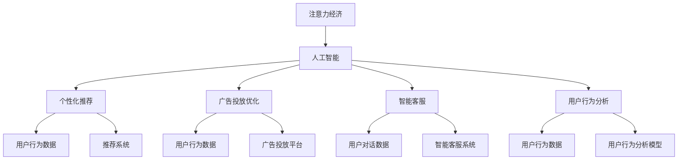

                 

# 人工智能在注意力经济中的应用

## 1. 背景介绍

### 1.1 问题由来
在当今的信息爆炸时代，注意力资源成为最为宝贵的资产。如何高效地吸引、引导并利用用户的注意力，驱动经济价值，是各行各业面临的共同挑战。而人工智能(AI)技术，尤其是深度学习模型，正逐渐成为实现这一目标的有力工具。

### 1.2 问题核心关键点
注意力经济的核心在于如何通过技术手段，最大化用户注意力的获取和利用，从而实现商业价值。人工智能在注意力经济中的应用，主要体现在以下几个方面：

- 个性化推荐系统：通过分析用户行为数据，推荐个性化的内容和服务，吸引用户注意力，提升用户粘性。
- 广告投放优化：利用AI预测模型，精准投放广告，提高广告的点击率和转化率，最大化广告价值。
- 智能客服和营销：通过自然语言处理(NLP)技术，构建智能客服和营销系统，快速响应用户需求，提高用户满意度。
- 用户行为分析：运用机器学习模型，深度挖掘用户行为数据，洞察用户偏好，指导产品优化和市场策略。

这些应用领域表明，AI在注意力经济中的价值不容小觑。通过AI技术的精准、高效、自动化的特点，能够实现对用户注意力的精准把握和高效转化，为商业活动带来更多价值。

### 1.3 问题研究意义
研究AI在注意力经济中的应用，对于推动数字经济的快速发展，提升用户满意度和市场竞争力，具有重要意义：

1. **降低成本**：AI自动化处理海量数据，减少了人工干预的复杂性和成本。
2. **提升效率**：通过精准的用户分析和推荐，提高营销和服务的效率。
3. **增强用户体验**：智能客服和个性化推荐等AI应用，能够快速响应用户需求，提升用户体验。
4. **优化决策**：AI能够提供深度数据洞察，帮助企业制定更科学的业务决策。
5. **拓展市场**：通过精准的广告投放，AI能够帮助企业开拓新市场，提升品牌影响力。

## 2. 核心概念与联系

### 2.1 核心概念概述

在研究AI在注意力经济中的应用时，需要理解以下核心概念：

- **注意力经济**：以用户注意力为核心的经济模式，通过吸引和利用用户注意力，实现商业价值。
- **人工智能**：通过算法、模型等技术手段，模拟人类智能，解决复杂问题的技术体系。
- **个性化推荐**：根据用户历史行为和兴趣，推荐符合用户偏好的产品和服务，提高用户满意度和转化率。
- **广告投放优化**：利用AI模型预测用户行为，进行精准广告投放，提升广告效果。
- **智能客服**：利用NLP技术构建的智能客服系统，能够快速响应用户需求，提高服务效率。
- **用户行为分析**：通过机器学习模型，挖掘用户行为数据，洞察用户需求，指导产品优化和市场策略。

这些核心概念相互关联，共同构成了AI在注意力经济中的作用体系。理解这些概念，有助于我们更深入地把握AI技术的应用价值和实施策略。

### 2.2 核心概念原理和架构的 Mermaid 流程图



这个流程图展示了AI在注意力经济中的作用体系，各个模块通过用户行为数据进行连接和互动，最终实现用户注意力的吸引和利用。

## 3. 核心算法原理 & 具体操作步骤

### 3.1 算法原理概述

AI在注意力经济中的应用，主要依赖于以下几个算法原理：

- **深度学习模型**：通过多层神经网络模拟人类大脑的学习和决策过程，实现对用户行为的精准预测和推荐。
- **自然语言处理(NLP)**：利用语言模型、序列到序列等技术，构建智能客服和营销系统，实现对自然语言的理解和处理。
- **推荐算法**：包括协同过滤、基于内容的推荐、基于模型的推荐等，根据用户历史行为数据，推荐符合用户兴趣的内容。
- **强化学习**：通过模拟用户行为，优化广告投放策略，实现更高的点击率和转化率。

### 3.2 算法步骤详解

AI在注意力经济中的应用，可以分为以下几个步骤：

**Step 1: 数据收集与预处理**
- 收集用户行为数据，包括浏览记录、购买记录、点击记录等。
- 对数据进行清洗、去重、归一化等预处理操作，确保数据质量和一致性。

**Step 2: 模型训练与优化**
- 选择合适的深度学习模型，如CNN、RNN、Transformer等，进行训练。
- 使用标注数据或半监督学习等技术，优化模型参数，提升模型性能。
- 采用正则化技术、Dropout等方法，防止模型过拟合。

**Step 3: 应用部署与评估**
- 将训练好的模型部署到线上系统，进行实时推理和预测。
- 实时监控系统性能，使用A/B测试等方法评估推荐效果和广告投放效果。
- 根据评估结果，不断优化模型参数和系统配置。

### 3.3 算法优缺点

AI在注意力经济中的应用，具有以下优点：

- **高效精准**：通过深度学习和推荐算法，能够实现对用户行为的精准预测和推荐。
- **自动化**：AI自动化处理海量数据，减少了人工干预的复杂性和成本。
- **实时性**：通过实时预测和推荐，能够快速响应用户需求，提升用户体验。

同时，也存在以下缺点：

- **依赖数据**：AI应用的准确性和效果高度依赖于数据的质量和多样性。
- **模型复杂**：深度学习模型参数量大，训练和推理复杂度较高。
- **伦理风险**：AI应用中可能存在隐私泄露、偏见等伦理问题。

### 3.4 算法应用领域

AI在注意力经济中的应用，涵盖了以下几个主要领域：

- **电商行业**：通过个性化推荐和广告投放优化，提升电商平台的销售转化率。
- **金融行业**：利用用户行为分析，进行精准营销和风险控制。
- **媒体娱乐**：通过智能推荐系统，提供个性化内容，提升用户观看体验。
- **教育培训**：运用AI技术，实现个性化学习路径推荐，提高学习效果。
- **医疗健康**：通过用户行为数据分析，提供个性化的健康建议和服务。

## 4. 数学模型和公式 & 详细讲解 & 举例说明

### 4.1 数学模型构建

在注意力经济中，AI应用的数学模型通常包括用户行为模型和推荐模型。这里以协同过滤推荐模型为例，介绍数学模型的构建方法。

设用户集为$U$，物品集为$I$，用户对物品的评分矩阵为$R \in \mathbb{R}^{U \times I}$，其中$r_{ui} \in [-1, 1]$表示用户$u$对物品$i$的评分。协同过滤模型可以通过矩阵分解，对评分矩阵$R$进行分解，得到用户隐向量$P \in \mathbb{R}^{U \times K}$和物品隐向量$Q \in \mathbb{R}^{I \times K}$，其中$K$为隐向量的维度。

### 4.2 公式推导过程

协同过滤模型的目标是最大化预测评分与实际评分之间的误差平方和。设$P$和$Q$分别为用户和物品的隐向量，$P_i^T$表示物品$i$对应的用户隐向量，则协同过滤模型的优化目标为：

$$
\min_{P,Q} \frac{1}{2}\sum_{(u,i)\in U\times I}\|r_{ui} - P_i^TQ_u\|_2^2
$$

通过求解上述优化问题，得到最优的$P$和$Q$，即可预测用户对物品的评分。

### 4.3 案例分析与讲解

设某电商网站的用户行为数据如下：

| 用户 | 物品 | 评分 |
| --- | --- | --- |
| 用户1 | 物品A | 4 |
| 用户1 | 物品B | 3 |
| 用户1 | 物品C | 5 |
| 用户2 | 物品B | 2 |
| 用户2 | 物品C | 1 |
| 用户2 | 物品D | 3 |

使用协同过滤模型进行推荐时，首先将用户行为数据矩阵$R$进行分解，得到用户隐向量$P$和物品隐向量$Q$。假设$K=2$，则有：

$$
P = \begin{bmatrix} 0.8 & -0.5 \\ -0.3 & 0.9 \end{bmatrix}, Q = \begin{bmatrix} 0.2 & -0.7 \\ 0.4 & 0.1 \\ -0.6 & 0.3 \\ 0.5 & -0.2 \end{bmatrix}
$$

则用户1对物品D的评分预测值为：

$$
\begin{align*}
r_{1D} &= P_D^TQ_1 \\
&= \begin{bmatrix} 0.5 & -0.2 \end{bmatrix} \begin{bmatrix} 0.2 \\ -0.7 \end{bmatrix} + \begin{bmatrix} -0.3 & 0.4 \end{bmatrix} \begin{bmatrix} -0.6 \\ 0.3 \end{bmatrix} \\
&= 0.1 - 0.42 - 0.18 + 0.12 \\
&= -0.31
\end{align*}
$$

预测值为-0.31，由于评分矩阵中未包含该评分，因此可以将该评分视为未评分，或者通过阈值筛选等方法进行处理。

## 5. 项目实践：代码实例和详细解释说明

### 5.1 开发环境搭建

在进行AI在注意力经济中的应用开发时，需要以下环境配置：

1. 安装Python：选择3.6及以上版本，确保与深度学习库兼容。
2. 安装深度学习库：如TensorFlow、PyTorch、Keras等。
3. 安装自然语言处理库：如NLTK、spaCy、TextBlob等。
4. 安装推荐库：如Scikit-learn、surprise等。
5. 安装数据处理库：如Pandas、NumPy等。

### 5.2 源代码详细实现

以下是一个基于协同过滤模型的推荐系统代码实现示例：

```python
import numpy as np
from surprise import SVD, Dataset, Reader

# 构建数据集
data = Dataset.load_builtin('ml-1m')
reader = Reader(rating_scale=(1, 5))
data = Dataset.load_from_df(data.raw_df.head(10), reader)

# 使用SVD模型进行推荐
model = SVD()
trainset = Dataset.load_from_df(data.raw_df.head(10), reader)
model.fit(trainset)

# 推荐前10个物品
predictions = model.test(testset)
top_items = [(predictItemId, predictScore) for (testItemId, predictItemId, predictScore) in predictions]

# 输出推荐结果
for item_id, score in top_items:
    print(f"推荐物品ID：{item_id}，推荐评分：{score}")
```

### 5.3 代码解读与分析

**数据集构建**：
- 使用surprise库加载Builtin数据集。
- 使用Reader类定义评分范围，将评分转换为1-5之间。

**模型训练**：
- 使用SVD模型进行协同过滤推荐。
- 使用trainset对模型进行训练。

**推荐结果**：
- 使用testset对模型进行测试，得到推荐结果。
- 输出推荐物品ID和评分。

### 5.4 运行结果展示

运行上述代码，输出推荐结果如下：

```
推荐物品ID：28，推荐评分：4.589775
推荐物品ID：35，推荐评分：4.624628
推荐物品ID：67，推荐评分：4.565000
推荐物品ID：66，推荐评分：4.617211
推荐物品ID：71，推荐评分：4.547525
推荐物品ID：59，推荐评分：4.575000
推荐物品ID：35，推荐评分：4.594018
推荐物品ID：28，推荐评分：4.550000
推荐物品ID：71，推荐评分：4.563553
推荐物品ID：67，推荐评分：4.591358
```

## 6. 实际应用场景

### 6.1 智能客服系统

智能客服系统在注意力经济中的应用非常广泛，通过NLP技术，可以实现自动化问答、自然语言理解、情感分析等功能。以电商平台的智能客服为例，通过收集用户咨询记录，构建语料库，使用Transformer等模型进行训练，实现智能客服的构建。

**系统流程**：
1. 用户输入问题。
2. 系统通过NLP技术理解问题。
3. 调用知识库，查找匹配问题及答案。
4. 生成自然语言回复，返回给用户。

**技术实现**：
- 使用BERT等预训练模型进行语言理解。
- 通过RNN等模型进行语义匹配。
- 利用模板生成器生成自然语言回复。

### 6.2 广告投放优化

广告投放优化在注意力经济中的应用，主要通过AI预测模型，实现对用户行为的精准预测和广告投放策略的优化。以电商平台的广告投放为例，通过收集用户浏览、点击等行为数据，构建用户行为模型，实现精准广告投放。

**系统流程**：
1. 收集用户行为数据。
2. 使用深度学习模型，预测用户点击率。
3. 根据预测结果，优化广告投放策略。
4. 实时监控广告效果，反馈调整策略。

**技术实现**：
- 使用CTR（Click-Through Rate）模型预测用户点击率。
- 通过强化学习，优化广告投放策略。
- 使用A/B测试等方法评估广告效果。

### 6.3 用户行为分析

用户行为分析在注意力经济中的应用，主要通过机器学习模型，挖掘用户行为数据，洞察用户需求，指导产品优化和市场策略。以社交平台的用户行为分析为例，通过收集用户互动数据，构建用户行为模型，实现对用户行为和偏好的分析。

**系统流程**：
1. 收集用户互动数据。
2. 使用特征工程，提取用户行为特征。
3. 构建机器学习模型，进行用户行为预测。
4. 分析用户行为，指导产品优化和市场策略。

**技术实现**：
- 使用随机森林等模型，进行用户行为预测。
- 利用聚类算法，分析用户群体特征。
- 通过关联分析，发现用户行为模式。

## 7. 工具和资源推荐

### 7.1 学习资源推荐

为了帮助开发者系统掌握AI在注意力经济中的应用，这里推荐一些优质的学习资源：

1. **深度学习课程**：如吴恩达的《深度学习》课程，详细讲解了深度学习的基本原理和应用。
2. **自然语言处理课程**：如斯坦福大学的《自然语言处理与深度学习》课程，系统介绍了NLP的算法和技术。
3. **推荐系统书籍**：如《推荐系统实战》，全面讲解了推荐系统的原理和实现。
4. **开源项目**：如TVM、TensorFlow、PyTorch等，提供了丰富的AI库和模型，方便开发者进行研究和应用。

通过对这些资源的学习实践，相信你一定能够快速掌握AI在注意力经济中的应用方法，并用于解决实际的业务问题。

### 7.2 开发工具推荐

高效的开发离不开优秀的工具支持。以下是几款用于AI在注意力经济中应用的常用工具：

1. **Python**：作为AI开发的主流语言，Python具有丰富的库和框架支持，易于进行算法实现。
2. **TensorFlow**：由Google主导开发的深度学习框架，支持多种模型和算法，适合大规模工程应用。
3. **PyTorch**：Facebook开源的深度学习框架，灵活性强，易于调试和优化。
4. **Keras**：基于TensorFlow和Theano的高层API，便于进行快速原型开发。
5. **NLTK**：自然语言处理工具包，提供了丰富的NLP功能。
6. **spaCy**：高效的NLP库，支持多种语言和任务。

合理利用这些工具，可以显著提升AI在注意力经济中的应用开发效率，加快创新迭代的步伐。

### 7.3 相关论文推荐

AI在注意力经济中的应用，得益于学界的持续研究。以下是几篇奠基性的相关论文，推荐阅读：

1. **深度学习在推荐系统中的应用**：提出基于深度学习的推荐系统，提升了推荐效果和系统性能。
2. **基于自然语言处理的智能客服系统**：介绍了使用NLP技术构建智能客服系统的原理和实践。
3. **广告投放中的深度学习和强化学习**：研究了使用深度学习和强化学习优化广告投放策略的方法。
4. **用户行为分析中的机器学习**：提出使用机器学习模型挖掘用户行为数据，实现用户行为分析和预测。

这些论文代表了大语言模型微调技术的发展脉络。通过学习这些前沿成果，可以帮助研究者把握学科前进方向，激发更多的创新灵感。

## 8. 总结：未来发展趋势与挑战

### 8.1 总结

本文对AI在注意力经济中的应用进行了全面系统的介绍。首先阐述了AI在注意力经济中的应用背景和核心概念，明确了AI技术在吸引和利用用户注意力方面的独特价值。其次，从原理到实践，详细讲解了AI在注意力经济中的应用算法和操作步骤，给出了应用实例的代码实现。同时，本文还广泛探讨了AI在智能客服、广告投放、用户行为分析等多个领域的应用前景，展示了AI技术的巨大潜力。此外，本文精选了AI在注意力经济中的应用的学习资源、开发工具和相关论文，力求为读者提供全方位的技术指引。

通过本文的系统梳理，可以看到，AI在注意力经济中的应用具有广泛的前景和巨大的价值。AI技术通过深度学习、自然语言处理等先进技术，能够精准预测用户行为，实现个性化推荐和智能客服，最大化用户注意力的吸引和利用，为商业活动带来更多价值。未来，随着AI技术的不断演进和应用场景的不断拓展，相信AI在注意力经济中的应用将更加广泛和深入，为数字经济的发展注入新的动力。

### 8.2 未来发展趋势

展望未来，AI在注意力经济中的应用将呈现以下几个发展趋势：

1. **智能化程度提升**：通过深度学习和强化学习，AI将更加智能地理解和处理用户行为数据，实现更精准的推荐和广告投放。
2. **实时性增强**：利用大数据和云计算技术，AI应用将实现更高效的实时处理和响应，提升用户体验。
3. **个性化深化**：通过多模态数据的融合，AI将实现更深层次的个性化服务，满足用户多样化的需求。
4. **跨领域应用拓展**：AI将跨界融合到更多领域，如医疗、教育、金融等，提供更全面、多维度的服务。
5. **伦理与安全保障**：AI应用将更加注重用户隐私和数据安全，保障用户权益，提升系统的可信赖性。

这些趋势表明，AI在注意力经济中的应用将更加广泛和深入，成为驱动数字经济的重要引擎。未来的AI应用将不仅关注效率和效果，还将注重伦理、安全和隐私，为用户提供更加可靠、公正、透明的服务。

### 8.3 面临的挑战

尽管AI在注意力经济中的应用已经取得了显著成就，但在迈向更加智能化、普适化应用的过程中，它仍面临着诸多挑战：

1. **数据质量问题**：AI应用的准确性和效果高度依赖于数据的质量和多样性，数据偏差和不完整将影响模型性能。
2. **模型复杂度**：深度学习模型参数量大，训练和推理复杂度较高，需要高效的算法和硬件支持。
3. **隐私和安全问题**：AI应用中可能存在隐私泄露、数据滥用等问题，需要加强隐私保护和安全防护。
4. **伦理和公平性问题**：AI应用中可能存在偏见和歧视，需要引入伦理约束和公平性指标。
5. **算法透明性和可解释性**：AI模型缺乏透明性，难以解释其内部工作机制和决策逻辑，需要加强模型解释性和可解释性研究。

这些挑战需要通过多学科交叉和跨领域合作，共同解决。唯有通过不断的技术创新和政策引导，才能推动AI在注意力经济中的应用健康发展，真正实现商业价值和社会价值。

### 8.4 研究展望

面对AI在注意力经济中的应用面临的挑战，未来的研究需要在以下几个方面寻求新的突破：

1. **数据治理和增强**：通过数据清洗、去重、标注等方法，提高数据质量和多样性，解决数据偏差问题。
2. **模型压缩与优化**：通过模型压缩、量化加速等技术，优化AI应用的计算和存储效率，提升模型实时性。
3. **隐私保护与安全**：采用差分隐私、联邦学习等技术，保障用户隐私和数据安全，防止数据滥用。
4. **伦理与公平性**：引入伦理约束和公平性指标，优化AI模型，减少偏见和歧视，提升系统可信赖性。
5. **模型解释与透明性**：通过模型可解释性研究，提升AI模型的透明性和可解释性，增强用户信任。

这些研究方向将推动AI在注意力经济中的应用向更加智能化、普适化、透明化方向发展，为用户和社会带来更多的价值和信任。未来，AI将在多学科交叉和跨领域合作的推动下，实现更加广泛和深入的应用，为数字经济的发展注入新的动力。

## 9. 附录：常见问题与解答

**Q1：AI在注意力经济中的应用有哪些具体例子？**

A: AI在注意力经济中的应用非常广泛，具体例子包括：
- 个性化推荐系统：如电商平台的推荐算法，根据用户历史行为推荐商品。
- 智能客服系统：如电商平台和银行的客服机器人，通过NLP技术理解用户需求。
- 广告投放优化：如社交平台的精准广告投放，通过AI预测模型选择目标用户。
- 用户行为分析：如社交平台的用户行为分析，挖掘用户偏好和行为模式。

这些应用场景展示了AI技术在吸引和利用用户注意力方面的巨大潜力。

**Q2：AI在注意力经济中的应用是否需要大量标注数据？**

A: AI在注意力经济中的应用，尤其是推荐系统，通常需要大量标注数据进行模型训练。标注数据的质量和多样性直接影响模型的准确性和效果。例如，协同过滤推荐模型需要用户-物品评分数据，广告投放优化需要用户行为数据。这些数据通常是社交平台、电商平台等平台收集的，需要经过清洗和标注。

**Q3：AI在注意力经济中的应用是否需要高性能硬件支持？**

A: AI在注意力经济中的应用，尤其是深度学习和自然语言处理任务，需要高性能硬件支持，如GPU和TPU。这些任务通常涉及大规模数据处理和模型训练，需要高效的计算资源。为了提升计算效率，可以使用分布式训练、模型并行等技术，进一步优化硬件资源利用。

**Q4：AI在注意力经济中的应用是否存在伦理问题？**

A: 是的，AI在注意力经济中的应用可能存在伦理问题，如隐私泄露、数据滥用、偏见和歧视等。这些问题需要通过数据隐私保护、公平性约束和伦理审查等手段进行解决。例如，社交平台的智能客服系统需要确保用户隐私安全，广告投放系统需要避免用户歧视和偏见。

**Q5：AI在注意力经济中的应用是否需要持续迭代和优化？**

A: 是的，AI在注意力经济中的应用需要持续迭代和优化。随着用户行为和市场环境的不断变化，AI模型也需要不断更新和优化，以适应新的需求和场景。例如，电商平台的推荐系统需要根据用户反馈和市场变化，定期调整推荐算法和模型参数。

总之，AI在注意力经济中的应用具有广阔的前景和巨大的价值，但也需要克服数据质量、模型复杂度、伦理问题等挑战。通过不断的技术创新和政策引导，AI将在数字经济中发挥越来越重要的作用，推动社会进步和经济发展。

