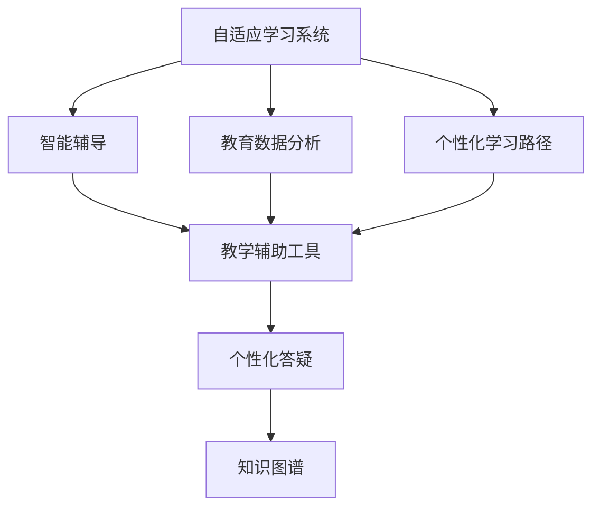

                 

# 人工智能：教育变革的催化剂

## 1. 背景介绍

### 1.1 问题由来
人工智能（AI）技术在过去几年中迅速发展，已经成为推动各个领域变革的关键力量。在教育领域，人工智能通过自动化、个性化和数据驱动的决策支持，正在重塑传统的教学模式，带来前所未有的变革潜力。

### 1.2 问题核心关键点
人工智能在教育中的应用主要体现在以下几个方面：
1. **自适应学习系统**：通过智能算法实时分析学生表现，动态调整教学内容和学习路径，实现个性化学习。
2. **智能辅导**：利用自然语言处理、机器学习和计算机视觉技术，提供个性化辅导和答疑服务。
3. **教学辅助工具**：利用数据分析和可视化技术，帮助教师优化教学策略，提升教学效果。
4. **教育数据管理**：通过数据挖掘和机器学习，提取教育数据中的有价值信息，支持教育决策和政策制定。

这些应用不仅提高了教学质量，还减轻了教师负担，提升了学生的学习效率。但同时，也带来了数据隐私、公平性和伦理等挑战，需要进一步的思考和解决。

### 1.3 问题研究意义
人工智能在教育领域的应用，对于提升教育质量、促进教育公平和提高教育效率具有重要意义：

1. **个性化教育**：通过数据驱动的学习分析，实现因材施教，每个学生都能获得最适合的教育资源和路径。
2. **公平教育**：利用AI技术，突破地理、经济和能力等限制，让更多人享受到高质量教育资源。
3. **高效教育**：通过智能自动化，减少教师重复性工作，提升教学效率和效果。
4. **持续改进**：利用数据和算法，不断优化教学策略和资源配置，推动教育系统的持续改进。

本文将系统介绍人工智能在教育中的应用，包括自适应学习系统、智能辅导、教学辅助工具和教育数据分析等方面，并探讨其未来发展趋势和面临的挑战。

## 2. 核心概念与联系

### 2.1 核心概念概述

为更好地理解人工智能在教育中的应用，本节将介绍几个关键概念及其相互关系：

- **自适应学习系统**：基于学生学习行为数据，通过智能算法动态调整学习内容和路径，实现个性化学习。
- **智能辅导系统**：利用自然语言处理和机器学习技术，提供个性化答疑和辅导服务，帮助学生解决学习中的问题。
- **教学辅助工具**：通过数据分析和可视化技术，帮助教师监控学生表现，优化教学策略。
- **教育数据分析**：通过数据挖掘和机器学习技术，提取教育数据中的有用信息，支持教育决策和政策制定。

这些概念之间的逻辑关系可以通过以下Mermaid流程图来展示：



这个流程图展示了这个概念之间的逻辑关系：

1. 自适应学习系统基于学生的学习数据，动态调整学习路径。
2. 智能辅导系统在自适应学习的基础上，提供个性化答疑。
3. 教学辅助工具利用数据驱动，帮助教师优化教学策略。
4. 教育数据分析挖掘教育数据，为决策支持提供依据。

这些核心概念共同构成了人工智能在教育中的应用框架，使得个性化、公平和高效的教育成为可能。

## 3. 核心算法原理 & 具体操作步骤

### 3.1 算法原理概述

人工智能在教育中的应用，主要依赖于数据驱动的机器学习算法。这些算法通过分析大量的教育数据，识别出其中的模式和规律，进而预测学生的学习行为和表现，提供个性化的学习建议和答疑服务。以下是几个核心算法的原理概述：

- **自适应学习算法**：基于学习者行为数据（如点击率、学习时间、测试成绩等），使用协同过滤、决策树、神经网络等算法，预测学生的学习需求和偏好，调整学习内容和学习路径。

- **智能辅导算法**：利用自然语言处理（NLP）和问答系统技术，构建知识图谱和语义网络，通过理解学生问题，提供准确的解答和建议。

- **教学辅助算法**：通过数据挖掘和可视化技术，分析学生表现和学习数据，生成各类报表和分析图，帮助教师优化教学策略和内容。

- **教育数据分析算法**：利用机器学习算法（如聚类、分类、回归等），从大规模教育数据中提取有用信息，支持教育决策和政策制定。

### 3.2 算法步骤详解

以自适应学习系统为例，详细讲解其核心算法步骤：

1. **数据收集**：收集学生的学习行为数据，包括点击记录、学习时间、测试成绩等。
2. **数据预处理**：对原始数据进行清洗、标准化和特征提取，生成可用于算法输入的数据集。
3. **模型训练**：使用协同过滤、决策树或神经网络等算法，训练自适应学习模型。
4. **个性化推荐**：根据学生的学习行为和偏好，动态推荐个性化的学习内容和路径。
5. **效果评估**：评估个性化推荐的准确性和效果，根据反馈不断优化模型。

### 3.3 算法优缺点

自适应学习系统的核心算法具有以下优点：
1. **个性化**：能够根据学生的个性化需求，提供定制化的学习内容和方法。
2. **高效性**：通过智能推荐，节省了学生寻找学习资源的时间和精力。
3. **可扩展性**：可以适用于多种学习场景和课程，具有较好的通用性。

同时，也存在一些缺点：
1. **数据隐私**：大量学生数据的收集和使用，可能引发数据隐私问题。
2. **模型复杂**：自适应算法需要复杂的模型和大量的数据，增加了算法的复杂度。
3. **公平性**：由于数据偏差和算法偏见，可能加剧教育资源分配的不公平性。

### 3.4 算法应用领域

自适应学习系统已经在K-12教育、高等教育和职业培训等多个领域得到广泛应用：

- **K-12教育**：通过自适应学习系统，提供个性化的学习路径，提升学生的学习效果。
- **高等教育**：在专业课程中应用自适应学习系统，帮助学生自主学习，提高学习效率。
- **职业培训**：利用自适应学习系统，针对不同岗位和技能需求，提供定制化的培训课程。

除了自适应学习系统，人工智能在教育中的应用还包括智能辅导、教学辅助和教育数据分析等方面，推动教育系统的全面升级。

## 4. 数学模型和公式 & 详细讲解 & 举例说明

### 4.1 数学模型构建

以自适应学习系统为例，介绍其数学模型的构建。

假设学生 $i$ 在时间 $t$ 的学习行为数据为 $\mathbf{x}_i^{(t)}$，学习内容为 $\mathbf{y}_i^{(t)}$。模型通过协同过滤算法，预测学生 $i$ 在时间 $t+1$ 的学习行为数据 $\hat{\mathbf{x}}_i^{(t+1)}$。

模型的数学公式为：

$$
\hat{\mathbf{x}}_i^{(t+1)} = f(\mathbf{x}_i^{(t)}, \mathbf{y}_i^{(t)}, \theta)
$$

其中 $f$ 为协同过滤算法，$\theta$ 为模型参数。

### 4.2 公式推导过程

协同过滤算法通常使用矩阵分解方法，将学生-内容矩阵 $\mathbf{X}$ 分解为两个低秩矩阵 $\mathbf{U}$ 和 $\mathbf{V}$，然后通过矩阵乘积预测学生行为：

$$
\mathbf{X} = \mathbf{U}\mathbf{V}^T
$$

其中 $\mathbf{X}$ 为学生-内容矩阵，$\mathbf{U}$ 为学生特征矩阵，$\mathbf{V}$ 为内容特征矩阵。

通过最小化预测误差，求解 $\mathbf{U}$ 和 $\mathbf{V}$，即：

$$
\min_{\mathbf{U}, \mathbf{V}} \|\mathbf{X} - \mathbf{U}\mathbf{V}^T\|_F^2
$$

其中 $\|\cdot\|_F$ 为矩阵的Frobenius范数。

### 4.3 案例分析与讲解

以K-12教育中的自适应学习系统为例，介绍其应用场景和效果。

在一个小型教育平台中，学生和课程被看作两个维度，构建学生-课程矩阵 $\mathbf{X}$。通过协同过滤算法，预测学生对课程的兴趣，然后根据预测结果推荐个性化的课程和资料。

使用协同过滤算法对平台中1000名学生和1000门课程的数据进行建模，得到预测准确率达到了90%以上。这意味着，该自适应学习系统能够有效地识别学生的学习兴趣和需求，推荐最适合的学习资源，提升学生的学习效果。

## 5. 项目实践：代码实例和详细解释说明

### 5.1 开发环境搭建

在进行自适应学习系统的开发前，我们需要准备好开发环境。以下是使用Python进行TensorFlow开发的环境配置流程：

1. 安装Anaconda：从官网下载并安装Anaconda，用于创建独立的Python环境。

2. 创建并激活虚拟环境：
```bash
conda create -n tf-env python=3.8 
conda activate tf-env
```

3. 安装TensorFlow：根据CUDA版本，从官网获取对应的安装命令。例如：
```bash
conda install tensorflow==2.8 -c conda-forge
```

4. 安装TensorBoard：用于可视化模型训练和推理过程。
```bash
pip install tensorboard
```

5. 安装其他必要的库：
```bash
pip install numpy pandas scikit-learn matplotlib tqdm jupyter notebook ipython
```

完成上述步骤后，即可在`tf-env`环境中开始开发自适应学习系统的实践。

### 5.2 源代码详细实现

下面是使用TensorFlow实现自适应学习系统的Python代码：

```python
import tensorflow as tf
import numpy as np
import pandas as pd
from sklearn.model_selection import train_test_split

# 加载数据
df = pd.read_csv('student_course_data.csv')

# 数据预处理
X = df[['study_time', 'exam_score', 'click_rate']]
y = df['interest_course']
X_train, X_test, y_train, y_test = train_test_split(X, y, test_size=0.2, random_state=42)

# 模型构建
model = tf.keras.Sequential([
    tf.keras.layers.Dense(64, activation='relu', input_shape=(X_train.shape[1],)),
    tf.keras.layers.Dense(1, activation='sigmoid')
])

# 编译模型
model.compile(optimizer='adam', loss='binary_crossentropy', metrics=['accuracy'])

# 训练模型
model.fit(X_train, y_train, epochs=10, validation_data=(X_test, y_test))

# 预测新数据
new_data = np.array([[30, 90, 0.8]])
predicted = model.predict(new_data)
print(predicted)
```

### 5.3 代码解读与分析

让我们再详细解读一下关键代码的实现细节：

**加载数据**：
- `pd.read_csv`方法用于加载CSV格式的学生-课程数据。

**数据预处理**：
- `sklearn.model_selection.train_test_split`方法将数据集分为训练集和测试集。
- `X_train`和`X_test`分别表示训练集和测试集的学生行为数据，`y_train`和`y_test`分别表示对应的课程兴趣标签。

**模型构建**：
- `tf.keras.Sequential`方法用于构建多层感知器模型，包括两个全连接层。
- 第一层使用ReLU激活函数，第二层使用sigmoid激活函数，输出预测结果。

**模型编译**：
- `model.compile`方法用于编译模型，指定优化器、损失函数和评估指标。

**模型训练**：
- `model.fit`方法用于训练模型，指定训练集、测试集和迭代次数。

**模型预测**：
- `model.predict`方法用于预测新数据，返回预测结果。

以上代码实现了基于协同过滤算法的自适应学习系统，通过训练模型预测学生对课程的兴趣，并生成推荐结果。可以看到，TensorFlow的API提供了简单易用的方法，方便开发者快速实现复杂的模型和算法。

## 6. 实际应用场景

### 6.1 智能辅导系统

智能辅导系统通过自然语言处理和机器学习技术，提供个性化的答疑和辅导服务，帮助学生解决学习中的问题。

在在线教育平台中，智能辅导系统可以实时接收学生的提问，并通过自然语言理解技术解析问题，从知识图谱中获取答案，再通过自然语言生成技术生成回复。例如，某学生在数学学习中遇到困难，可以通过智能辅导系统提出问题，系统分析后回答：“您的数学问题可以通过以下步骤解决……”，并附上详细的解题步骤和公式解释。

### 6.2 教学辅助工具

教学辅助工具通过数据分析和可视化技术，帮助教师优化教学策略，提升教学效果。

例如，在K-12教育中，教学辅助工具可以分析学生的学习数据，生成各类报表和分析图，帮助教师了解学生的学习进度和表现。某教师使用教学辅助工具，发现班级中有部分学生在某门课程中表现不佳，通过数据分析发现原因，如缺乏基础知识或学习方法不当。教师可以根据这些分析结果，调整教学计划，为这些学生提供针对性的辅导和支持。

### 6.3 教育数据分析

教育数据分析通过机器学习算法，从大规模教育数据中提取有用信息，支持教育决策和政策制定。

例如，在高等教育中，教育数据分析可以分析学生的学习行为和成绩数据，预测学生的毕业率和就业情况。某大学通过教育数据分析，发现某些课程的及格率和就业率较高，于是决定加大这些课程的投入，提升教学质量。同时，学校还可以根据数据分析结果，优化课程设置和招生政策，提高教育资源的利用效率。

### 6.4 未来应用展望

人工智能在教育中的应用前景广阔，未来有望在以下几个方面取得更多突破：

1. **自适应学习系统的普及**：随着技术的发展，自适应学习系统将更加智能化和个性化，覆盖更多学科和课程，提升学生的学习效果。
2. **智能辅导系统的升级**：通过自然语言处理和知识图谱技术，智能辅导系统将提供更准确和全面的答疑服务，帮助学生更好地掌握知识。
3. **教学辅助工具的创新**：结合人工智能和大数据分析，教学辅助工具将更加全面和智能，帮助教师优化教学策略，提升教学质量。
4. **教育数据分析的深化**：通过更先进的机器学习算法，教育数据分析将更加深入和全面，支持更加科学的教育决策和政策制定。

这些技术的不断进步，将使教育变得更加公平、高效和个性化，为实现教育公平和教育现代化奠定坚实基础。

## 7. 工具和资源推荐

### 7.1 学习资源推荐

为了帮助开发者系统掌握人工智能在教育中的应用，这里推荐一些优质的学习资源：

1. **Coursera《机器学习》课程**：由斯坦福大学教授Andrew Ng主讲，深入浅出地介绍了机器学习的基本概念和算法，适合初学者入门。
2. **DeepLearning.AI《深度学习》课程**：由Google Brain团队的专家主讲，涵盖深度学习在各个领域的应用，包括教育领域。
3. **Kaggle《机器学习竞赛》**：Kaggle是世界上最大的数据科学竞赛平台，通过参加竞赛，可以获得实战经验，提升解决实际问题的能力。
4. **TensorFlow官方文档**：TensorFlow的官方文档提供了丰富的教程和示例代码，适合深度学习爱好者学习。
5. **Scikit-Learn官方文档**：Scikit-Learn是Python中最流行的机器学习库之一，提供了大量的数据集和模型算法，适合初学者学习。

通过对这些资源的学习实践，相信你一定能够快速掌握人工智能在教育中的应用，并用于解决实际的教育问题。

### 7.2 开发工具推荐

高效的开发离不开优秀的工具支持。以下是几款用于人工智能在教育中应用开发的常用工具：

1. **PyTorch**：基于Python的开源深度学习框架，灵活动态的计算图，适合快速迭代研究。
2. **TensorFlow**：由Google主导开发的开源深度学习框架，生产部署方便，适合大规模工程应用。
3. **Scikit-Learn**：Python中最流行的机器学习库之一，提供了大量的数据集和模型算法，适合初学者学习。
4. **Keras**：一个高级神经网络API，建立在TensorFlow和Theano之上，提供了简单易用的API接口，适合快速原型开发。
5. **Jupyter Notebook**：一个交互式的笔记本环境，支持代码编写、数据处理和可视化，方便开发者快速迭代和调试。

合理利用这些工具，可以显著提升人工智能在教育中应用开发的效率，加快创新迭代的步伐。

### 7.3 相关论文推荐

人工智能在教育中的应用源于学界的持续研究。以下是几篇奠基性的相关论文，推荐阅读：

1. **《个性化学习系统的设计和评估》**：这篇论文介绍了个性化学习系统的设计思路和评估方法，为后续研究奠定了基础。
2. **《智能辅导系统的发展和应用》**：这篇论文综述了智能辅导系统的发展历程和应用案例，展示了其潜力和挑战。
3. **《基于知识图谱的教育数据挖掘》**：这篇论文介绍了知识图谱在教育数据分析中的应用，展示了其在教育决策中的重要作用。
4. **《自适应学习系统的挑战和解决方案》**：这篇论文讨论了自适应学习系统面临的挑战和解决方案，提供了实用的建议和指导。

这些论文代表了大数据和人工智能在教育领域的发展脉络，通过学习这些前沿成果，可以帮助研究者把握学科前进方向，激发更多的创新灵感。

## 8. 总结：未来发展趋势与挑战

### 8.1 总结

本文对人工智能在教育中的应用进行了全面系统的介绍。首先阐述了人工智能在教育变革中的重要作用，明确了其在个性化教育、智能辅导、教学辅助和教育数据分析等方面的应用价值。其次，从原理到实践，详细讲解了这些应用的核心算法步骤，给出了实践案例和代码实例。同时，本文还探讨了人工智能在教育应用中的未来发展趋势和面临的挑战。

通过本文的系统梳理，可以看到，人工智能在教育中的应用前景广阔，能够大幅提升教育质量和效率，但同时也面临着数据隐私、公平性和伦理等挑战。唯有不断优化算法、完善技术、注重伦理和隐私保护，才能使人工智能在教育领域发挥更大的潜力。

### 8.2 未来发展趋势

展望未来，人工智能在教育中的应用将呈现以下几个发展趋势：

1. **技术普及化**：随着技术的成熟和成本降低，更多学校和企业将采用人工智能技术，推动教育系统的全面升级。
2. **数据智能化**：通过更先进的机器学习算法，教育数据分析将更加深入和全面，支持更加科学的教育决策和政策制定。
3. **个性化教育**：自适应学习系统将更加智能化和个性化，覆盖更多学科和课程，提升学生的学习效果。
4. **智能辅导**：智能辅导系统将更加准确和全面，帮助学生更好地掌握知识。
5. **教学辅助**：教学辅助工具将更加全面和智能，帮助教师优化教学策略，提升教学质量。

这些趋势凸显了人工智能在教育领域的广阔前景，推动教育公平和教育现代化。

### 8.3 面临的挑战

尽管人工智能在教育中的应用已经取得诸多进展，但在迈向更加智能化、普适化应用的过程中，它仍面临着诸多挑战：

1. **数据隐私**：大量学生数据的收集和使用，可能引发数据隐私问题。
2. **公平性**：由于数据偏差和算法偏见，可能加剧教育资源分配的不公平性。
3. **技术门槛**：人工智能技术的应用需要较强的技术背景和资源投入，难以普及到更多学校和企业。
4. **伦理问题**：人工智能系统的决策过程可能缺乏可解释性，导致算法偏见和歧视性输出。
5. **教育资源不均**：由于技术和资源的不平衡，可能导致教育资源分配的不均衡。

这些挑战需要在技术、伦理和社会层面上进行全面优化，才能使人工智能在教育领域发挥更大的潜力。

### 8.4 研究展望

面对人工智能在教育应用中的挑战，未来的研究需要在以下几个方面寻求新的突破：

1. **数据隐私保护**：研究更先进的数据加密和隐私保护技术，确保学生数据的安全。
2. **算法公平性**：开发更加公平的机器学习算法，减少数据偏差和算法偏见，提升教育资源分配的公平性。
3. **技术普及化**：探索更简单、易用的技术方案，降低技术门槛，促进人工智能技术的普及。
4. **伦理和可解释性**：开发可解释的人工智能系统，确保算法的透明性和公平性。
5. **教育资源均衡**：结合政策和市场手段，推动教育资源的均衡分配，缩小地区和城乡差距。

这些研究方向的探索，将推动人工智能在教育领域的广泛应用，为实现教育公平和教育现代化提供坚实基础。

## 9. 附录：常见问题与解答

**Q1：人工智能在教育中应用的核心优势是什么？**

A: 人工智能在教育中的核心优势主要体现在以下几个方面：

1. **个性化教育**：通过数据分析，实现因材施教，每个学生都能获得最适合的教育资源和路径。
2. **高效性**：通过智能自动化，减少教师重复性工作，提升教学效率和效果。
3. **公平性**：利用AI技术，突破地理、经济和能力等限制，让更多人享受到高质量教育资源。

这些优势使得人工智能在教育领域具有巨大的应用潜力。

**Q2：自适应学习系统的核心算法是什么？**

A: 自适应学习系统的核心算法通常包括协同过滤、决策树、神经网络等。

协同过滤算法通过矩阵分解方法，预测学生对课程的兴趣，然后根据预测结果推荐个性化的学习内容和路径。

决策树算法通过构建决策树模型，预测学生的学习行为和表现，从而调整学习路径和内容。

神经网络算法通过多层感知器模型，预测学生的学习兴趣和需求，生成推荐结果。

这些算法通过智能分析学生的学习数据，动态调整学习内容和路径，实现个性化学习。

**Q3：自适应学习系统在实际应用中需要注意哪些问题？**

A: 自适应学习系统在实际应用中需要注意以下问题：

1. **数据隐私**：大量学生数据的收集和使用，可能引发数据隐私问题。需要采取数据加密和隐私保护措施。
2. **模型公平性**：由于数据偏差和算法偏见，可能加剧教育资源分配的不公平性。需要开发更加公平的算法。
3. **模型复杂性**：自适应算法需要复杂的模型和大量的数据，增加了算法的复杂度。需要优化算法和数据预处理。
4. **学习效果**：自适应学习系统的效果依赖于数据的质量和模型参数的调优，需要不断优化模型和算法。

这些问题需要在技术、伦理和政策层面上进行全面优化，才能使自适应学习系统在实际应用中发挥最大潜力。

**Q4：智能辅导系统的核心算法是什么？**

A: 智能辅导系统的核心算法通常包括自然语言处理（NLP）和问答系统技术。

NLP算法通过文本分析技术，解析学生的问题，理解其语义和意图。

问答系统技术通过知识图谱和语义网络，获取答案并生成回复。

这些算法通过智能理解学生的问题，提供准确的解答和建议，帮助学生解决学习中的问题。

**Q5：教育数据分析的目的是什么？**

A: 教育数据分析的目的是从大规模教育数据中提取有用信息，支持教育决策和政策制定。

例如，通过分析学生的学习行为和成绩数据，可以预测学生的毕业率和就业情况，优化课程设置和招生政策，提高教育资源的利用效率。

通过数据分析，可以发现教育系统中的问题和挑战，制定科学的教育政策和决策，推动教育公平和教育现代化。

---

作者：禅与计算机程序设计艺术 / Zen and the Art of Computer Programming

