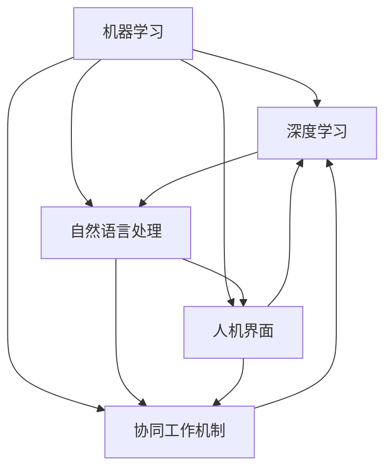

                 

## 1. 背景介绍

在人工智能的浪潮下，人机协作已经从科幻变为现实。从简单的自动化任务到复杂的智能决策，机器学习、深度学习等技术正在深刻改变着人类的工作和生活方式。这一变化不仅提高了生产效率，也带来了全新的智能应用场景。随着人工智能技术的不断成熟，人机协作正向更高级、更智能的方向演进，开启了一个共同创造更智能未来的新时代。

### 1.1 问题由来

人机协作的兴起，离不开深度学习技术的飞速发展。其中，机器学习、深度学习等技术在图像识别、自然语言处理、语音识别等领域取得了显著的突破，使得机器能够更好地理解和模仿人类。这一转变，正逐渐推动着人机协作的边界从简单自动化向智能决策、协同创新迈进。

然而，尽管人工智能在许多方面取得了突破，但机器仍无法完全替代人类。机器在情感、创造力、道德伦理等方面仍存在局限，无法完全胜任复杂多变的人类任务。因此，人机协作正成为解决这些问题的关键，机器辅助人类，共同完成更复杂、更富有创造力的任务。

### 1.2 问题核心关键点

人机协作的核心在于如何充分发挥人类和机器各自的优势，实现优势互补。关键点在于：

1. **数据和算法的融合**：通过大量数据训练深度学习模型，使其能够理解并模拟人类的决策过程。
2. **人机界面的设计**：设计高效的人机交互界面，使得人机协作过程更加自然、流畅。
3. **任务分配机制**：确定哪些任务适合机器处理，哪些任务适合人类处理，以及人机间的协同工作机制。
4. **安全性与伦理约束**：确保人机协作系统在决策和操作过程中符合伦理标准和法律法规要求。

## 2. 核心概念与联系

### 2.1 核心概念概述

为人机协作提供理论基础的，是机器学习、深度学习、自然语言处理等前沿技术。这些技术在大规模数据训练下，构建了复杂的计算模型，具备了处理海量数据、识别复杂模式的能力。人机协作的实现，需要对这些技术进行深入理解和应用，并将其融入到具体的任务场景中。

- **机器学习**：通过数据训练模型，使其能够自动提取特征、进行分类和预测。
- **深度学习**：利用多层神经网络，构建更加复杂的模型，处理更抽象和复杂的任务。
- **自然语言处理**：使机器能够理解和生成自然语言，实现语言与机器的沟通。
- **人机界面**：设计用户友好的交互界面，使得人机协作过程更加自然。
- **协同工作机制**：确定人机间的任务分配和协同工作流程，确保系统高效运作。

这些核心概念之间相互联系，共同构成了人机协作的完整系统。通过这些技术的结合，机器可以辅助人类完成更复杂、更高效的智能任务，提升生产效率和生活质量。

### 2.2 核心概念原理和架构的 Mermaid 流程图



这个流程图展示了人机协作系统的主要组件及其相互关系：

- **机器学习和深度学习**：构建模型，处理数据。
- **自然语言处理**：使机器能够理解和生成语言。
- **人机界面**：提供用户友好的交互接口。
- **协同工作机制**：确定人机任务分配和协同流程。

这些组件相互配合，共同实现高效、智能的人机协作。

## 3. 核心算法原理 & 具体操作步骤

### 3.1 算法原理概述

人机协作的核心算法是深度学习，通过大规模数据训练模型，使其具备理解、生成自然语言的能力。具体来说，人机协作的实现过程可以分为以下几个步骤：

1. **数据准备**：收集和标注用于训练的数据，如文本、图像、语音等。
2. **模型训练**：利用深度学习模型，对标注数据进行训练，提取特征并进行分类或预测。
3. **人机交互**：设计用户界面，实现人机交互。
4. **协同工作**：确定人机协作任务分配和协同流程，实现任务处理和结果输出。

### 3.2 算法步骤详解

1. **数据准备**：
   - 收集数据：收集文本、图像、语音等多种类型的数据。
   - 数据标注：对数据进行标注，如文本的情感分类、图像的物体识别等。
   - 数据清洗：去除噪声数据，确保数据质量。

2. **模型训练**：
   - 选择模型：选择合适的深度学习模型，如卷积神经网络(CNN)、循环神经网络(RNN)、Transformer等。
   - 模型训练：利用标注数据对模型进行训练，调整模型参数以优化性能。
   - 模型评估：在验证集上评估模型性能，调整训练策略，确保模型泛化能力。

3. **人机交互**：
   - 界面设计：设计高效的人机交互界面，如文本输入、语音识别等。
   - 信息展示：利用界面展示模型处理结果，如文本分类、图像识别结果等。
   - 用户反馈：收集用户反馈，优化界面和交互体验。

4. **协同工作**：
   - 任务分配：确定哪些任务适合机器处理，哪些适合人工处理。
   - 协同流程：设计协同工作流程，如模型辅助人工决策、人机交替工作等。
   - 系统集成：将各个组件集成到一个系统中，实现人机协作。

### 3.3 算法优缺点

人机协作算法具有以下优点：

- **高效处理大量数据**：深度学习模型能够高效处理大规模数据，提取复杂特征。
- **多任务并行**：多个任务可以并行处理，提高系统效率。
- **灵活性高**：模型可以根据需求进行灵活调整，适应不同的任务场景。

同时，也存在一些缺点：

- **数据依赖性强**：依赖高质量的标注数据，数据标注成本高。
- **模型复杂度高**：深度学习模型参数众多，训练和推理复杂。
- **人机协作界面设计复杂**：需要设计高效的人机交互界面，提升用户体验。

### 3.4 算法应用领域

人机协作技术广泛应用于多个领域，如智能客服、智能医疗、智能制造等。

- **智能客服**：通过深度学习模型，实现自动问答、自动应答，提升客户服务效率。
- **智能医疗**：利用深度学习模型，进行医学影像识别、疾病预测等，辅助医生诊断。
- **智能制造**：通过深度学习模型，进行缺陷检测、工艺优化等，提升生产效率和产品质量。

## 4. 数学模型和公式 & 详细讲解

### 4.1 数学模型构建

人机协作的核心模型是深度学习模型，其数学基础包括线性代数、概率论、微积分等。以下是一个简单的神经网络模型的数学模型构建：

$$
y = f(Wx + b)
$$

其中，$y$ 为输出结果，$x$ 为输入数据，$W$ 为权重矩阵，$b$ 为偏置项，$f$ 为激活函数。

### 4.2 公式推导过程

以卷积神经网络(CNN)为例，其核心公式推导过程如下：

$$
\begin{aligned}
y &= f(W^{[1]}x + b^{[1]}) \\
&= f(W^{[2]}f(W^{[1]}x + b^{[1]}) + b^{[2]})
\end{aligned}
$$

其中，$f$ 为激活函数，$W^{[l]}$ 和 $b^{[l]}$ 分别为第 $l$ 层的权重矩阵和偏置项。

### 4.3 案例分析与讲解

以医学影像识别为例，通过卷积神经网络对医学影像进行分类：

1. **数据准备**：收集大量医学影像数据，并进行标注。
2. **模型训练**：利用标注数据训练卷积神经网络模型，提取影像特征并进行分类。
3. **人机交互**：设计医生界面，展示模型识别结果，辅助医生诊断。
4. **协同工作**：医生结合模型输出和个人经验，进行综合诊断。

## 5. 项目实践：代码实例和详细解释说明

### 5.1 开发环境搭建

开发人机协作系统，需要搭建相应的开发环境。以下是使用Python进行TensorFlow开发的环境配置流程：

1. 安装Anaconda：从官网下载并安装Anaconda，用于创建独立的Python环境。
2. 创建并激活虚拟环境：
```bash
conda create -n tf-env python=3.7 
conda activate tf-env
```

3. 安装TensorFlow：根据CUDA版本，从官网获取对应的安装命令。例如：
```bash
conda install tensorflow-gpu
```

4. 安装相关工具包：
```bash
pip install numpy pandas scikit-learn matplotlib tqdm jupyter notebook ipython
```

完成上述步骤后，即可在`tf-env`环境中开始人机协作系统的开发。

### 5.2 源代码详细实现

以下是一个简单的医学影像识别系统的代码实现：

```python
import tensorflow as tf
from tensorflow.keras import layers, models

# 数据准备
train_dataset = ...
train_dataset.shuffle(buffer_size=1024)

# 模型构建
model = models.Sequential([
    layers.Conv2D(32, (3, 3), activation='relu', input_shape=(256, 256, 1)),
    layers.MaxPooling2D((2, 2)),
    layers.Conv2D(64, (3, 3), activation='relu'),
    layers.MaxPooling2D((2, 2)),
    layers.Conv2D(128, (3, 3), activation='relu'),
    layers.MaxPooling2D((2, 2)),
    layers.Flatten(),
    layers.Dense(128, activation='relu'),
    layers.Dense(2, activation='softmax')
])

# 模型训练
model.compile(optimizer=tf.keras.optimizers.Adam(learning_rate=0.001),
              loss=tf.keras.losses.SparseCategoricalCrossentropy(from_logits=True),
              metrics=['accuracy'])

model.fit(train_dataset, epochs=10, validation_data=val_dataset)

# 模型评估
test_dataset = ...
model.evaluate(test_dataset)
```

### 5.3 代码解读与分析

**医学影像识别代码**：
- `train_dataset`：训练数据集。
- `model`：卷积神经网络模型，包括卷积层、池化层、全连接层等。
- `model.compile`：模型编译，指定优化器、损失函数和评价指标。
- `model.fit`：模型训练，指定训练数据和训练轮数。
- `model.evaluate`：模型评估，指定测试数据。

可以看出，TensorFlow提供了完整的深度学习模型构建和训练框架，使得模型开发过程更加便捷高效。

## 6. 实际应用场景

### 6.1 智能客服系统

智能客服系统利用深度学习模型，实现自动问答和自动应答，提升客户服务效率。系统通过收集历史客服数据，训练深度学习模型，使得机器能够理解客户问题，并提供准确的答案。

### 6.2 智能医疗系统

智能医疗系统利用深度学习模型，进行医学影像识别、疾病预测等，辅助医生诊断。系统通过收集大量医学影像数据，训练卷积神经网络模型，实现影像分类和病变检测。医生结合模型输出和个人经验，进行综合诊断。

### 6.3 智能制造系统

智能制造系统利用深度学习模型，进行缺陷检测、工艺优化等，提升生产效率和产品质量。系统通过收集制造过程中的传感器数据，训练循环神经网络模型，实现过程监控和异常检测。

### 6.4 未来应用展望

随着深度学习技术的不断进步，人机协作将不断拓展其应用范围和深度，带来更多创新和变革。未来，人机协作技术将在智能城市、智慧农业、智能交通等领域发挥重要作用，推动社会进步。

## 7. 工具和资源推荐

### 7.1 学习资源推荐

以下是几款用于人机协作系统开发的优质学习资源：

1. **《深度学习》课程**：由Coursera和DeepLearning.AI合作推出的深度学习课程，涵盖深度学习基础、卷积神经网络、循环神经网络等内容。
2. **TensorFlow官方文档**：TensorFlow官方提供的详细文档，包含深度学习模型的构建、训练、部署等流程。
3. **Keras官方文档**：Keras官方提供的详细文档，包含高层次的深度学习模型构建框架。
4. **PyTorch官方文档**：PyTorch官方提供的详细文档，包含深度学习模型的构建、训练、部署等流程。
5. **GitHub项目**：如AlphaGo、AlphaStar等，这些开源项目展示了深度学习模型的应用和创新。

### 7.2 开发工具推荐

以下是几款用于人机协作系统开发的常用工具：

1. **TensorFlow**：谷歌开源的深度学习框架，支持GPU/TPU加速，适用于大规模工程应用。
2. **PyTorch**：Facebook开源的深度学习框架，灵活性高，适用于研究型应用。
3. **Keras**：高层次的深度学习框架，适合快速原型开发和实验验证。
4. **Jupyter Notebook**：开源的交互式笔记本环境，支持Python和多种深度学习框架，适用于快速实验和数据可视化。
5. **Google Colab**：谷歌提供的在线Jupyter Notebook环境，支持GPU/TPU加速，免费提供算力，适用于快速实验和数据共享。

### 7.3 相关论文推荐

以下是几篇经典的人机协作技术论文，推荐阅读：

1. **《神经网络与人机协作》**：探讨了神经网络在协同工作中的应用，如人机协作机器人、智能客服系统等。
2. **《深度学习在医疗领域的应用》**：展示了深度学习模型在医学影像识别、疾病预测等方面的应用。
3. **《智能制造：基于深度学习的过程监控和优化》**：讨论了深度学习在智能制造中的应用，如缺陷检测、工艺优化等。
4. **《自然语言处理与人机协作》**：探讨了自然语言处理技术在人机协作中的应用，如智能客服、智能问答系统等。

## 8. 总结：未来发展趋势与挑战

### 8.1 研究成果总结

本文系统介绍了人机协作技术，从理论基础到实际应用，探讨了其在智能客服、智能医疗、智能制造等领域的应用。通过深度学习模型的训练和应用，实现了机器对数据的理解、分类和预测，使得人机协作系统具备了高效、智能的能力。

### 8.2 未来发展趋势

人机协作技术的未来发展趋势包括以下几个方面：

1. **智能化水平的提升**：随着深度学习技术的不断发展，人机协作系统的智能化水平将进一步提升，能够处理更复杂、更抽象的任务。
2. **多模态融合**：人机协作系统将不仅仅局限于单模态数据，而是融合多种模态数据，如视觉、语音、文本等，实现多模态协同工作。
3. **个性化定制**：人机协作系统将根据用户需求进行个性化定制，提供更贴合用户需求的智能服务。
4. **伦理与法律的考量**：人机协作系统的设计将更加注重伦理和法律问题，确保系统的安全、公平和透明。
5. **跨领域应用**：人机协作技术将不断拓展应用范围，应用于更多领域，如智能城市、智慧农业等。

### 8.3 面临的挑战

人机协作技术在发展过程中，也面临一些挑战：

1. **数据隐私和安全**：人机协作系统需要处理大量敏感数据，如何保护数据隐私和安全是一个重要问题。
2. **模型可解释性**：深度学习模型的决策过程较为复杂，如何提高模型的可解释性是一个重要挑战。
3. **计算资源消耗**：深度学习模型的训练和推理需要大量计算资源，如何优化资源消耗是一个重要问题。
4. **人机协作界面设计**：如何设计高效的人机协作界面，提升用户体验是一个重要问题。
5. **伦理与法律问题**：如何确保人机协作系统的决策符合伦理和法律要求，是一个重要问题。

### 8.4 研究展望

未来，人机协作技术将在以下几个方面进行进一步研究：

1. **多模态协同工作**：融合多种模态数据，实现人机协同处理。
2. **模型可解释性**：提高模型的可解释性，使其决策过程更加透明、可理解。
3. **计算资源优化**：优化计算资源消耗，提升系统效率。
4. **个性化定制**：根据用户需求进行个性化定制，提升用户体验。
5. **伦理与法律研究**：研究伦理与法律问题，确保系统符合社会规范。

## 9. 附录：常见问题与解答

**Q1：深度学习模型在实际应用中需要注意哪些问题？**

A: 深度学习模型在实际应用中需要注意以下问题：
- 数据质量：确保数据质量，去除噪声数据，避免过拟合。
- 模型选择：选择合适的深度学习模型，适应不同任务场景。
- 超参数调优：优化模型超参数，提高模型性能。
- 模型评估：合理评估模型性能，选择合适的评价指标。
- 模型部署：优化模型部署，提高推理效率。

**Q2：如何提高深度学习模型的可解释性？**

A: 提高深度学习模型的可解释性，可以考虑以下方法：
- 模型可视化：通过可视化技术，展示模型决策过程。
- 解释性模型：选择解释性较强的模型，如决策树、线性回归等。
- 特征分析：分析模型特征重要性，理解模型决策依据。
- 对抗样本分析：通过对抗样本分析，理解模型的脆弱点。

**Q3：深度学习模型在资源优化方面有哪些方法？**

A: 深度学习模型在资源优化方面，可以采用以下方法：
- 模型压缩：通过量化、剪枝等技术，减小模型大小，提高推理速度。
- 混合精度训练：采用混合精度训练，提高训练效率。
- 分布式训练：利用分布式计算资源，提高训练速度。
- 模型并行：利用多卡并行，提高计算效率。

**Q4：人机协作系统的设计需要考虑哪些因素？**

A: 人机协作系统的设计需要考虑以下因素：
- 任务分配：确定哪些任务适合机器处理，哪些适合人工处理。
- 协同流程：设计协同工作流程，实现人机协作。
- 用户界面：设计高效的人机交互界面，提升用户体验。
- 伦理与安全：确保系统符合伦理和安全标准，避免误导和滥用。

**Q5：深度学习模型在实际应用中如何保护数据隐私？**

A: 深度学习模型在实际应用中保护数据隐私，可以采用以下方法：
- 数据匿名化：对数据进行匿名化处理，保护用户隐私。
- 数据加密：对数据进行加密处理，防止数据泄露。
- 差分隐私：采用差分隐私技术，保护个体隐私。
- 数据共享协议：制定数据共享协议，确保数据安全和合法使用。

---

作者：禅与计算机程序设计艺术 / Zen and the Art of Computer Programming

